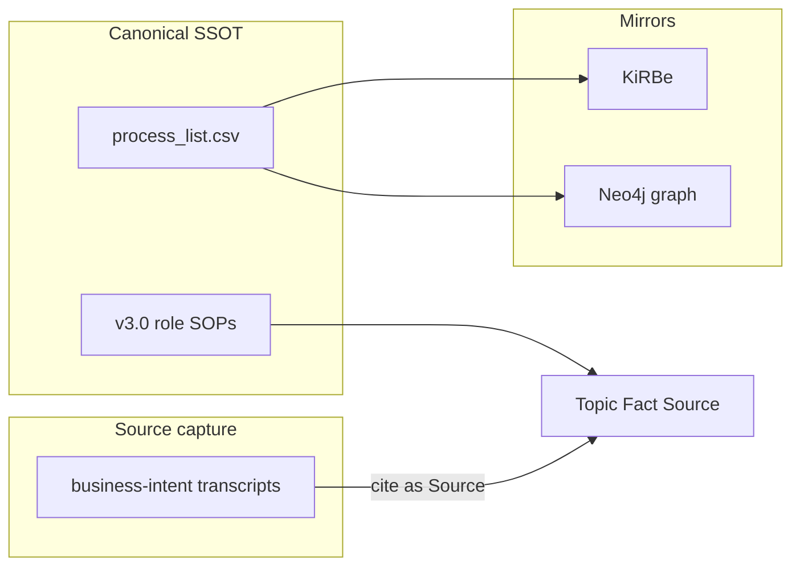
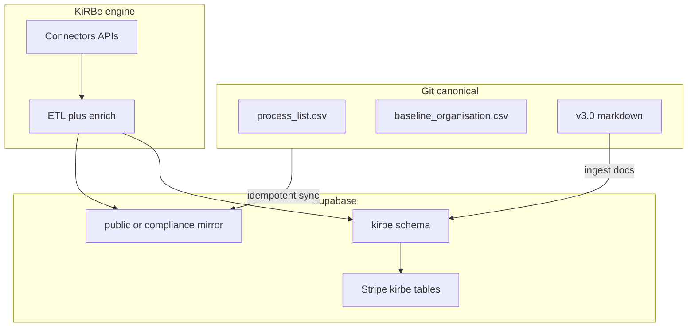
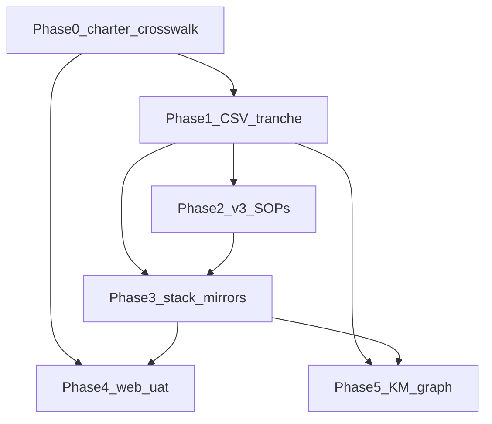

## Initiative 14 — status snapshot (2026-04-17)

**Completed (repo evidence — openclaw-akos)**

- **Initiative home:** [`docs/wip/planning/14-holistika-internal-gtm-mops/`](docs/wip/planning/14-holistika-internal-gtm-mops/) — [`master-roadmap.md`](docs/wip/planning/14-holistika-internal-gtm-mops/master-roadmap.md), [`decision-log.md`](docs/wip/planning/14-holistika-internal-gtm-mops/decision-log.md), [`evidence-matrix.md`](docs/wip/planning/14-holistika-internal-gtm-mops/evidence-matrix.md); row in [`docs/wip/planning/README.md`](docs/wip/planning/README.md).
- **Phase 1 — CSV:** Three merged rows `holistika_gtm_dtp_001`–`003` in [`docs/references/hlk/compliance/process_list.csv`](docs/references/hlk/compliance/process_list.csv); candidates in [`docs/wip/planning/14-holistika-internal-gtm-mops/candidates/process_list_tranche_holistika_internal.csv`](docs/wip/planning/14-holistika-internal-gtm-mops/candidates/process_list_tranche_holistika_internal.csv); merge via [`scripts/merge_process_list_tranche.py`](scripts/merge_process_list_tranche.py) + [`tests/test_merge_process_list_tranche.py`](tests/test_merge_process_list_tranche.py) (distinct from MADEIRA-oriented [`scripts/merge_gtm_into_process_list.py`](scripts/merge_gtm_into_process_list.py)).
- **Phase 2 — v3.0 SOPs:** Five files under `docs/references/hlk/v3.0/Admin/O5-1/` — Growth (`SOP-GTM_INBOUND_SLA_001`, `SOP-GTM_QUALIFICATION_001`, `SOP-GTM_BD_HANDOFF_001`), Brand/Copywriter (`SOP-GTM_AGENCY_PARTNER_WORKFLOW_001`), PMO (`SOP-GTM_WEEKLY_METRICS_REVIEW_001`), each extended with **Execution runbook** / RACI; vault links to `process_list.csv` use `.../hlk/compliance/process_list.csv` (relative depth varies by folder).
- **Phase 3 — documentation only (not prod DDL):** [`docs/wip/planning/14-holistika-internal-gtm-mops/reports/sql-proposal-stack-20260417.md`](docs/wip/planning/14-holistika-internal-gtm-mops/reports/sql-proposal-stack-20260417.md) — concrete DDL for `compliance.process_list_mirror`, `compliance.baseline_organisation_mirror`, `holistika_ops` stub, RLS/grants, verification queries, rollback; still **no** `apply_migration` until operator gate ([`operator-sql-gate.md`](docs/wip/planning/14-holistika-internal-gtm-mops/reports/operator-sql-gate.md)).
- **Execution packaging:** [`docs/wip/planning/14-holistika-internal-gtm-mops/reports/EXECUTION-BACKLOG.md`](docs/wip/planning/14-holistika-internal-gtm-mops/reports/EXECUTION-BACKLOG.md) (Waves A–D); [`docs/wip/planning/14-holistika-internal-gtm-mops/reports/process-list-gtm-inventory-and-next-tranches.md`](docs/wip/planning/14-holistika-internal-gtm-mops/reports/process-list-gtm-inventory-and-next-tranches.md) (anchors + **candidate** task rows, not merged).
- **TEAM_SOTA:** [`docs/wip/planning/14-holistika-internal-gtm-mops/reports/TEAM_SOTA_HLK_ERP.md`](docs/wip/planning/14-holistika-internal-gtm-mops/reports/TEAM_SOTA_HLK_ERP.md), [`docs/wip/planning/14-holistika-internal-gtm-mops/reports/TEAM_SOTA_KIRBE.md`](docs/wip/planning/14-holistika-internal-gtm-mops/reports/TEAM_SOTA_KIRBE.md).
- **Docs/tests sync:** [`CHANGELOG.md`](CHANGELOG.md), [`docs/USER_GUIDE.md`](docs/USER_GUIDE.md), [`docs/ARCHITECTURE.md`](docs/ARCHITECTURE.md), [`docs/DEVELOPER_CHECKLIST.md`](docs/DEVELOPER_CHECKLIST.md) as shipped on the branch.
- **Gates run for the tranche:** `py scripts/validate_hlk.py` (1069 process items), `py scripts/validate_hlk_vault_links.py`, `pytest tests/test_merge_process_list_tranche.py`.

**Insights to carry forward (governance)**

- **Split “Phase 3 docs” vs “Phase 3 execute”:** Narrative mirror DDL in this plan is **superseded for exact SQL** by [`sql-proposal-stack-20260417.md`](docs/wip/planning/14-holistika-internal-gtm-mops/reports/sql-proposal-stack-20260417.md); keep this plan for *why*; edit DDL only in the proposal file until approved.
- **CSV enrichment:** Prefer **task-level** children under existing `holistika_gtm_*` parents and SOP depth before new process rows; use the inventory report for **candidate** tranches—operator approval before merge.
- **Phase 4 UAT:** Stub exists ([`uat-holistika-contact-funnel-20260417.md`](docs/wip/planning/14-holistika-internal-gtm-mops/reports/uat-holistika-contact-funnel-20260417.md)); Wave D in EXECUTION-BACKLOG references the same file (alias `uat-holistika-gtm-webchat-stub` retired).

**To execute next (continuation)**

- Use **Waves A–D** in [`EXECUTION-BACKLOG.md`](docs/wip/planning/14-holistika-internal-gtm-mops/reports/EXECUTION-BACKLOG.md): A3 sync job → B1–B3 staging DDL + Stripe routing → C1–C3 business cadence → D1–D2 UAT/KM.
- Remaining **stack** todos in this plan’s YAML (`kirbe-supabase-gap`, `masterdata-live-inventory`, `stripe-billing-ssot`, `deprecate-legacy-public`, `monitoring-governance`, `phase3b-integrations-mcp-later`) map to B-waves and KiRBe repo work, not to new CSV rows.

**Optional git mirror of this plan**

- Copy this file to [`docs/wip/planning/14-holistika-internal-gtm-mops/reference/internal_gtm_marketing_ops_574ae9de.plan.md`](docs/wip/planning/14-holistika-internal-gtm-mops/reference/internal_gtm_marketing_ops_574ae9de.plan.md) for collaborators; see [`reference/README.md`](docs/wip/planning/14-holistika-internal-gtm-mops/reference/README.md).

# Holistika internal GTM and marketing operations (HLK-aligned)

## Goals (what “done” means)

- **Internal-first proof**: A measurable 90-day outcome (e.g., qualified conversations, inbound-to-meeting SLA, pipeline velocity) owned by explicit **canonical roles** from [`baseline_organisation.csv`](docs/references/hlk/compliance/baseline_organisation.csv)—not ad-hoc titles.
- **Single process story**: Marketing narrative, **lead routing** ([`LEADS WEB Centralization and BD Routing`](docs/references/hlk/compliance/process_list.csv) / [`End-to-End Marketing Lead Flow` `thi_opera_dtp_289`](docs/references/hlk/compliance/process_list.csv)), and **GTM workstream** ([`Go-To-Market Strategy` `thi_mkt_dtp_210`](docs/references/hlk/compliance/process_list.csv)) stay **one** connected graph—no parallel “shadow GTM.”
- **Multi-segment strategy** (innovators / agency partners / operational-excellence buyers / late-majority “process buyers”) expressed as **segmentation + playbooks**, not duplicate org trees—consistent with your Business Developer and Researcher onboarding transcripts in [`docs/references/hlk/business-intent/`](docs/references/hlk/business-intent/).
- **Platform-agnostic partner intake**: Outbound **proposals** arrive via many channels (agencies, marketplaces, ad platforms, e-commerce ecosystems, vertical SaaS, etc.). **Shopify was one illustrative example**, not the center of gravity—the governed pattern is **proposal → fit assessment → integration design → document → map to `process_list` / SOPs**, regardless of vendor.
- **Commercial and web consistency**: Public lines on [Services](https://www.holistikaresearch.com/services) (Marketing Operations: automation, CRM, campaigns, analytics) and [Contact](https://www.holistikaresearch.com/contact) map to **named `item_id` processes** and v3.0 SOPs.
- **Governance**: Obey [`PRECEDENCE.md`](docs/references/hlk/compliance/PRECEDENCE.md), [`SOP-META_PROCESS_MGMT_001.md`](docs/references/hlk/compliance/SOP-META_PROCESS_MGMT_001.md), and workspace rules in [`.cursor/rules/akos-governance-remediation.mdc`](.cursor/rules/akos-governance-remediation.mdc); **operator-approved** tranches for any change to canonical CSVs.

## Live Supabase inventory (MasterData — MCP read-only, 2026)

**Project**: `MasterData` (`swrmqpelgoblaquequzb`, EU Central). Inspected via **user-supabase** MCP (`list_tables`, `execute_sql` **SELECT only**).

**Authoritative DDL for new mirrors (2026-04-17):** Do not duplicate evolving `CREATE TABLE` / RLS text in this plan. Initiative 14’s concrete PostgreSQL for `compliance.*` mirrors and `holistika_ops` lives in [`docs/wip/planning/14-holistika-internal-gtm-mops/reports/sql-proposal-stack-20260417.md`](docs/wip/planning/14-holistika-internal-gtm-mops/reports/sql-proposal-stack-20260417.md) (proposal only until operator approval). The bullets below remain the *why* and inventory context.

**Critical gaps vs git canonical (openclaw-akos)**

| Artifact | DB (public) | Notes |
|----------|-------------|--------|
| **`process_list` SSOT** | Table **`public."Process list"`** exists but **0 rows** | Legacy **v2.4-era** shell; canonical is **git** [`process_list.csv`](docs/references/hlk/compliance/process_list.csv) today |
| **`baseline_organisation`** | **49 rows** | Legacy **v2.4** mirror—**stale** vs current [`baseline_organisation.csv`](docs/references/hlk/compliance/baseline_organisation.csv) |
| **Legacy / alternate process model** | `standard_process` **42** rows, `workstreams` **0**, `workflows` **0** | **Deprecate** (see below)—do **not** map into canonical; optional one-time export for archaeology only |

### One canonical process/org model (decision)

- **Single SSOT**: **[`process_list.csv`](docs/references/hlk/compliance/process_list.csv)** and **[`baseline_organisation.csv`](docs/references/hlk/compliance/baseline_organisation.csv)** in git, validated by `py scripts/validate_hlk.py`. **No** second authoring surface.
- **Legacy `public."Process list"` (v2.4)**: Its **columns are not** the authority for enriching the CSV—historical experiments may differ. **Do not** merge old DB shapes into canonical without a **CSV tranche + operator approval** per PRECEDENCE. **Approach**: (1) **Deprecate** the old table (rename to `public._deprecated_process_list_v24` or move to `archive` schema) after backup; (2) **Create** a new mirror table **`compliance.process_list_mirror`** (or `public.process_list_mirror`) whose columns are a **1:1** projection of the **current** CSV columns (same names as [`akos/hlk_process_csv`](akos/hlk_process_csv.py) / `normalize_process_row`); (3) **Load** via idempotent job from git on each release or nightly—store `source_git_sha` / `synced_at` for audit.
- **Legacy `baseline_organisation` rows**: Same pattern—replace with **`compliance.baseline_organisation_mirror`** (or equivalent) loaded from CSV; deprecate old table after cutover and diff validation.

### Deprecate parallel legacy process objects (required)

- **`standard_process`**, **`workflows`**, **`workstreams`**: **Properly deprecate**—not the alternate truth for v3.0. Steps (after operator approval): **RLS lock** or revoke from app roles; **rename** with `_deprecated_` prefix or move to **`archive`** schema; **document** in v3.0 decision log and an incident-style note referencing [PRECEDENCE.md](docs/references/hlk/compliance/PRECEDENCE.md); **ERP/UI** must read **mirror** or CSV-derived views only.
- **Quarantine `test_*` / obvious junk** (`test_aapl`, `test_clients`, `test_contract`, `test_process`, `test_product`, `rag_2` if non-prod, etc.): **Immediate governance**: mark in inventory; **no drops** until backup + approval; restrict service-role access in proposal; long-term **drop or archive** per same deprecation pattern.

**KiRBe schema (`kirbe.*`) — v2.9 runtime**

- **Present**: orgs (3), vaults (4), `subscriptions` (**2**), `graph_sync_runs` (21), `audit_events` (2), `org_quotas` (2), Stripe tables (`invoice_items`, `payment_methods` **0** rows), YouTube/GDrive/simpledir scaffolding (mostly empty).
- **Volume risk**: `kirbe.monitoring_logs` **~2.67M rows**—**ungoverned growth**; requires **retention policy**, **partitioning or time-based purge**, **indexes**, **cost budget**, and **SOP** for what may be logged ([Supabase responsibility](https://supabase.com/docs/guides/platform/shared-responsibility-model)—you own query cost and growth).
- **Duplicate vectors**: **Design error**—**deprecate** `public.data_kirbe_document_vectors_1536` after **migrating** the 153 rows into **`kirbe.data_kirbe_document_vectors_1536`** (or single approved table); **`kirbe.*` is the only** supported path for KiRBe v3.0 doc vectors; public duplicate **revoked/dropped** after approval.

**Compliance taxonomy (`compliance.*`) — v2.7 lineage**

- **Call**: **Maintain as mirrored dimensions**, not abandoned. Git [`access_levels.md`](docs/references/hlk/compliance/access_levels.md), [`confidence_levels.md`](docs/references/hlk/compliance/confidence_levels.md), [`source_taxonomy.md`](docs/references/hlk/compliance/source_taxonomy.md) remain **canonical prose**; `compliance.*` tables are **mirrors** for SQL joins—**sync/enrich** when git changes (idempotent upsert), **validate** row counts vs definitions; **deprecate** a dimension table only if git taxonomy is retired with an explicit migration. If drift is found, **canonical wins** (PRECEDENCE)—resync DB from git, document incident.

**Second project (context only)**

- `hlk-shopify-cart-drawer` (`bfsdsrqktampahhkxzoe`)—treat as **app-specific**; do not conflate with MasterData governance without explicit mapping.

## SQL and migration governance (operator-in-the-loop)

Per your instruction: **no PostgreSQL writes** (including `execute_sql` **mutating** statements and `apply_migration`) **until you explicitly approve** a written proposal.

**Why this section exists**: Past initiatives underestimated **Postgres + Supabase** surface area—**not only SQL** but **extensions**, **RLS**, **Auth/JWT**, **SDK clients**, **Edge Functions**, **webhooks/connectors**, **wrappers**, and **application logic** around migrations. Bad assumptions there caused late pain; **read docs before any SQL proposal**.

### Mandatory pre-proposal reading (Supabase)

Skim at minimum before authoring DDL/DML proposals; link the relevant pages in the proposal’s bibliography:

| Topic | Why it matters | Entry points |
|-------|----------------|--------------|
| **Shared responsibility** | You own schema, query performance, third-party integration behavior, and growth—not Supabase magic | [Platform](https://supabase.com/docs/guides/platform/shared-responsibility-model), [Deployment](https://supabase.com/docs/guides/deployment/shared-responsibility-model) |
| **Migrations vs ad-hoc SQL** | DDL belongs in versioned migrations; `execute_sql` for one-offs with care | Supabase MCP: `apply_migration` vs `execute_sql`; [migrating Postgres](https://supabase.com/docs/guides/platform/migrating-to-supabase/postgres) (pre-checks: size, version, extensions, connections) |
| **Production readiness** | Indexes, load testing, compute, **PITR** if DB greater than ~4 GB, Performance Advisor | [Going into prod](https://supabase.com/docs/guides/platform/going-into-prod), [Deployment going into prod](https://supabase.com/docs/guides/deployment/going-into-prod) |
| **Extensions** | `vector`, `pg_cron`, etc.—compatibility and upgrade path with managed Postgres | [Pre-migration checklist](https://supabase.com/docs/guides/platform/migrating-to-supabase/postgres) (`pg_extension`, `pg_available_extensions`) |
| **Third-party / Stripe / webhooks** | Outages and slow integrations **degrade your project**—monitor and design idempotency | [Shared responsibility — third-party services](https://supabase.com/docs/guides/deployment/shared-responsibility-model) |

Use **Supabase MCP** `list_extensions`, `get_advisors`, `get_logs` (read-only) as part of discovery—not a substitute for reading the docs above.

### Mandatory pre-proposal reading (PostgreSQL)

| Topic | Why it matters | Entry points |
|-------|----------------|--------------|
| **Planner & indexes** | New FKs and mirrors need **indexes** matching query patterns; avoid surprise seq scans | [Planner/optimizer](https://www.postgresql.org/docs/current/planner-optimizer.html) (index vs seq scan, join strategies) |
| **EXPLAIN** | Validate heavy migrations (e.g. backfill, `monitoring_logs` retention) **before** prod | [EXPLAIN](https://www.postgresql.org/docs/current/sql-explain.html) |
| **Prepared statements / DDL** | Object changes invalidate plans; migrations can interact with app prepared statements | [PREPARE](https://www.postgresql.org/docs/current/sql-prepare.html) |

Large-table operations (`monitoring_logs`, vector moves): plan **batch size**, **locks**, **VACUUM/ANALYZE** implications, and **staging** run first.

### Application layer (do not forget)

- **Supabase JS/ Python SDK**: RLS depends on **JWT role**; service-role bypass—document which client each path uses.
- **Edge Functions / webhooks**: Stripe and connector callbacks—**idempotency**, **signature verification**, not only table shape.
- **KiRBe app code**: Ingestion, postprocessors, **wrappers**—schema changes must align with `yy_all_in_one` + app releases; **coordinate** repo + DB migration order.

**Required workflow**

1. **Discover** (MCP read-only: `list_tables`, `list_extensions`, `get_advisors`, `get_logs` as needed, `execute_sql` **SELECT** only).
2. **Read** the relevant Supabase + Postgres sections above (record links in proposal).
3. **Propose** in a **v3.0-governed** artifact (`reports/sql-proposal-<topic>-<YYYYMMDD>.md`): objective, **exact DDL/DML**, rollback, **RLS + Auth impact**, extension changes, **index list**, **estimated row/volume impact**, PII classification, **staging plan**, link to `item_id` / PRECEDENCE.
4. **Operator approval** (you): recorded in decision log.
5. **Execute** on **staging** or **branch** when available, then prod: Supabase MCP `apply_migration` or KiRBe repo migration—**never** ad-hoc prod DDL without migration file.

**Security posture**: Treat MCP-returned rows as **untrusted**; never paste secrets into docs; third-party integration risk per [Supabase shared responsibility](https://supabase.com/docs/guides/deployment/shared-responsibility-model).

## Team-facing governed SOTA instructions (one document per repo)

**Deliverables** (two separate files—no combined “master” draft): store under [`docs/wip/planning/14-holistika-internal-gtm-mops/reports/`](docs/wip/planning/14-holistika-internal-gtm-mops/reports/) once the initiative folder exists. Each is **operator-approved engineering guidance** for that repo’s contributors—not canonical v3.0 vault law.

**Standalone requirement (mandatory)**

- Each of **`TEAM_SOTA_HLK_ERP.md`** and **`TEAM_SOTA_KIRBE.md`** must be **fully standalone**: a reader can follow it **without** opening this plan, the initiative `master-roadmap`, or relying on external URLs as prerequisites.
- **No “see above” / “see plan section X”**: every rule, procedure, and definition the engineer needs must be **written inside** that file (including abbreviated copies of governance: git CSV SSOT, mirror-only Supabase, operator SQL approval, RLS/JWT vs service role, staging-before-prod, no secrets in repo, webhook idempotency, and release order where it applies to that repo).
- **Optional** URLs may appear only as **supplementary reading**, clearly labeled—not as the only explanation of a required step.
- **Duplication is intentional**: shared concepts (e.g. PRECEDENCE “canonical wins”) should be **restated in prose** in each doc so neither depends on the other; a short “related doc” line to the sibling SOTA file is allowed but must not be required to complete work.

| Document | Repo path | Must include (non-exhaustive; all spelled out in full inside the file) |
|----------|-----------|------------------------------------------------------------------------|
| **`TEAM_SOTA_HLK_ERP.md`** | [`c:\Users\Shadow\cd_shadow\root_cd\hlk-erp`](c:\Users\Shadow\cd_shadow\root_cd\hlk-erp) | Holistika ERP purpose; Supabase **views/mirrors only**; how auth and RLS affect the app; JWT vs service client; module mapping to process/org/sales; deprecating legacy `public` tables; local run/test; **inline** SQL change workflow (approval, migrations, no ad-hoc prod writes). |
| **`TEAM_SOTA_KIRBE.md`** | [`c:\Users\Shadow\cd_shadow\root_cd\kirbe`](c:\Users\Shadow\cd_shadow\root_cd\kirbe) | KiRBe stack overview; `yy_all_in_one` / migrations; ingestion + ETL+E; **`kirbe.*` SaaS billing vs `holistika_ops` company billing** (defined in-doc); connectors; `monitoring_logs` / vectors; release sequence **CSV → ingest → SQL → deploy** explained step-by-step; webhooks; **inline** SQL/migration and security rules (same completeness as ERP doc for anything KiRBe-owned). |

**Traceability (outside the SOTA files themselves)**

- The initiative may still **list paths** to `TEAM_SOTA_*.md` in `master-roadmap.md` / decision log for audit—those index entries are **not** part of the standalone reader path for engineers.

## KiRBe v2.9 vs HLK v3.0 canonical (why Supabase lags)

- **KiRBe v2.9** ingestion paths and app logic **do not yet load** git **`process_list.csv` / `baseline_organisation.csv`** into `public."Process list"` / `baseline_organisation` at full fidelity—hence **empty/stale** mirrors.
- **v3.0** canonical remains **git + `validate_hlk.py`**; Supabase is **mirrored** ([PRECEDENCE](docs/references/hlk/compliance/PRECEDENCE.md): canonical wins on conflict).

**Enrichments from KiRBe v2.9 worth carrying into v3.0 ops (recommended)**

| KiRBe v2.9 capability | v3.0 use |
|----------------------|----------|
| **`audit_events` + org membership triggers** | Governance audit trail for role/process changes (pattern reusable in company schema) |
| **`org_quotas` + usage_events`** | Fair-use / metering for **KiRBe product** and internal quotas |
| **`graph_sync_runs` + lineage** | Tie to Neo4j / `thi_data_dtp_275` |
| **Vault policies (retention/redaction)** | Map to Legal/PII for marketing data |
| **Stripe RPC patterns** (from `yy_all_in_one.sql`) | **Reuse patterns** for **company** billing in a **non-kirbe** schema—do **not** overload `kirbe.*` |

**Schema split (required)**

- **`kirbe.subscriptions` / `invoice_items` / `payment_methods`**: Reserved for the **tentative KiRBe SaaS** product—not Holistika **company** CRM/ERP billing.
- **Company CRM / ERP / revenue**: New schema (e.g. **`holistika_ops`**, **`revenue`**, or **`erp`**)—**Stripe as core** for **Holistika** customers, partners, and internal commercial ops; FKs to **`compliance.*_mirror`** org/process where needed; owned by **CFO / Business Controller** per [`thi_finan_dtp_261`](docs/references/hlk/compliance/process_list.csv). **Migrate** any misplaced “company” billing rows out of `kirbe.*` in a governed migration (after approval).

**Postgres schema strategy: align with company areas (recommended)**

Holistika’s model is **entity + area** (e.g. Think Big / MKT, HLK Tech Lab / Tech, Holistika / Research). Using **one Postgres `schema` per coarse organizational bucket** can **reduce nomenclature fights**: object location answers “who owns this in the business,” while **table names** stay short and concrete (`lead`, `campaign_fact`, `integration_registry`).

| Principle | Detail |
|-----------|--------|
| **Does not replace SSOT** | Git CSVs + v3.0 remain authoritative; schemas are **namespaces + ownership**, not a second process definition. |
| **Granularity** | Prefer **entity or entity+area** (e.g. `think_big`, `hlk_tech_lab`, `holistika`)—**not** one schema per `role_name` (too many schemas, painful migrations). Map to [`baseline_organisation.csv`](docs/references/hlk/compliance/baseline_organisation.csv) `entity` / `area` columns in a **published mapping table** inside each standalone SOTA doc. |
| **Existing schemas** | Keep **`compliance`** for taxonomy + process/org **mirrors**; keep **`kirbe`** for the KiRBe product; **`public`** for legacy only until deprecated/quarantined. |
| **New company data** | Place **Holistika-wide** commercial/ERP/GTM tables in a dedicated schema (e.g. **`holistika_ops`** or split by area if volume warrants); **marketing ops facts** can live under e.g. **`think_big_mkt`** if you want strict area isolation—decide in SQL proposal with operator approval. |
| **Governance wins** | Clear **GRANT** / **RLS** boundaries per schema; service accounts can get `search_path` scoped to one area; auditors see ownership from `schema` + table comment. |
| **Risks** | Cross-schema joins and FKs need explicit qualification; more migrations to manage—mitigate with **naming convention doc** and **minimal** schema count. |

**Nomenclature**: Schema = **organizational home**; `item_id` / process keys stay in **mirror tables** under `compliance` or area schema as decided—**no** mixing naming conventions without a written mapping (part of SQL proposal).

When authoring **`TEAM_SOTA_HLK_ERP.md`** / **`TEAM_SOTA_KIRBE.md`**, include a **full inline schema map** (standalone requirement): list of schema names, what belongs where, and how `search_path` / Supabase roles are expected to work—**no reliance on this plan file**.

**Vectors**: Deprecate **`public.data_kirbe_document_vectors_1536`**; canonical **`kirbe.data_kirbe_document_vectors_1536`** (or unified name in KiRBe v3.0 SQL).

**Quarantine**: **`test_*`**, **`rag_2`**, **`test_aapl`**—treat as **non-prod / junk**; **restrict access** immediately in proposal; **drop or archive** only after operator approval + backup.

## Stripe and CRM/ERP billing (two planes)

- **KiRBe SaaS plane** (`kirbe.*`): Existing Stripe tables for **product** subscriptions—unchanged purpose; document in KiRBe product SOPs.
- **Holistika company plane** (new schema): **Stripe + Supabase** for **company** billing, client accounts, and ERP-facing revenue—[`thi_finan_dtp_261`](docs/references/hlk/compliance/process_list.csv), revenue share rows—**no** mixing into `kirbe` unless explicitly a KiRBe customer record.
- **Ops**: Webhooks, reconciliation, RLS by role; [shared responsibility](https://supabase.com/docs/guides/platform/shared-responsibility-model) for integrations and DB correctness.

## Asset classification (PRECEDENCE)

| Layer | Location | Role in this initiative |
|------|----------|-------------------------|
| **Canonical** | [`process_list.csv`](docs/references/hlk/compliance/process_list.csv), [`baseline_organisation.csv`](docs/references/hlk/compliance/baseline_organisation.csv), [`v3.0/`](docs/references/hlk/v3.0/) role-owned SOPs | SSOT for process IDs, ownership, and promoted procedures. |
| **Reference / source capture** | [`docs/references/hlk/business-intent/*.md`](docs/references/hlk/business-intent/) (onboarding + ENISA kickoff transcripts) | **Inputs** for ICP, agency strategy, ENISA timing—cite as **Source** in KM; promote facts only via v3.0 or CSV after review. |
| **Related program (do not fork)** | [`docs/wip/planning/04-holistika-company-formation/`](docs/wip/planning/04-holistika-company-formation/) | Legal/ENISA/incorporation narrative; **link** from GTM plan where messaging must align (startup certification vs product launch). |
| **Mirrored** | KiRBe, Neo4j (`sync_hlk_neo4j`), Drive | Rebuild after canonical updates; never author baselines here. |
| **Internal operator UI** | [Holistika ERP](https://erp.holistikaresearch.com/) (Process Registry, Organization, Components, Sales, Business Apps, Documentation) | **Use as the human shell** for running internal ops—**not** a replacement for canonical CSV/v3.0; data should **point at** or sync from **Supabase** where the ERP is backed by it, avoiding a second competing CRM. |

## Stack positioning: Supabase + Holistika ERP (decision)

- **Supabase (primary DB)**: Treat as **system of record** for relational GTM data you own (leads, pipeline stages, integration metadata, billing touchpoints). Prefer **schema-first** design ([Supabase shared responsibility](https://supabase.com/docs/guides/platform/shared-responsibility-model): you own application architecture and third-party integration behavior). Use **Stripe-related patterns** where you already have wrappers for CRM/financial linkage—document tables/views and RLS expectations in runbooks.
- **v3.0 assets**: Prefer linking governed **markdown + manifests** under `docs/references/hlk/v3.0/_assets/` where KM/visual assets apply—keeps marketing and ops artifacts **promotable** under Topic–Fact–Source.
- **Holistika ERP**: **Include in the stack** as the **internal dashboard** for people (process registry, org, component catalog, app grid, docs entry point). **Do not** introduce a *parallel* “third stack” (e.g. a separate commercial CRM) unless the ERP cannot reach Supabase—duplication violates single-relationship-record discipline. If the ERP is thin UI on top of Supabase, that is ideal. If it is mostly static today, Phase 3 defines **minimum** live links (e.g. deep links to SOPs, lead views) so it earns its place.
- **“Nothing at all” for an internal shell**: Operators still need **one** place for runbooks and process visibility—**ERP + canonical docs** beats ad-hoc spreadsheets; **ERP + nothing else** is only viable if Supabase + public site + agents cover all workflows (usually incomplete for humans).

## Integration and advertising APIs (explicit list—do not lose track)

**Already named in `process_list.csv` / Data Governance** (extend, don’t fork): `Integration Management (facebook, google, sentry, pinecone..)` (`env_tech_dtp_18`); **Facebook** Business Manager + Ads (`env_tech_dtp_38`, `thi_mkt_dtp_43`, `env_tech_dtp_63`); **Google** API (`env_tech_dtp_64`); **SEM**; **SEO** (on-page/off-page, codebase); **LinkedIn**; **Instagram**; **Mailchimp**; **Calendly**; **Web Traffic Analytics**; **Sentry**; **Pinecone** (or successor vector store); **Supabase** client onboarding (`env_tech_dtp_80`); **Postman** internal API catalog (`env_tech_dtp_293`); **Shopify** app/compliance/CI paths (product channels—**not** the only commerce API); **Stripe** + Shopify Billing (`env_tech_dtp_297`); **Gemini** FastAPI service; **Neo4j** graph sync (`env_tech_dtp_268`).

**Architecture / GTM diagram “expected connectors” (treat as catalog candidates, same governance each)**

- **Paid social / search ads**: **Meta** (Facebook/Instagram), **Google Ads**, **TikTok Ads**, **Snapchat Ads**, **Pinterest Ads**, **Microsoft Advertising** (Bing).
- **Analytics / web**: **Google Analytics 4 (GA4)**, **Google Search Console** (pair with SEO rows), **Tag Manager** (if used—event taxonomy `env_tech_dtp_243`).
- **E‑commerce / ops**: **Shopify**, **Amazon Seller Central** (marketplace), **Klaviyo** (email/SMS—alongside Mailchimp), **Gorgias** (support—CX tie-in to `thi_mkt_ws_2`).
- **Payments / billing (core)**: **Stripe** (subscriptions, invoices, payment methods—[`thi_finan_dtp_261`](docs/references/hlk/compliance/process_list.csv)); **company** billing in **`holistika_ops` (or chosen schema name)**; **KiRBe SaaS** billing stays in **`kirbe.subscriptions`**.
- **Custom**: **scrapers** / headless collection (align with OSINT / web intel rows under Research where applicable—**legal review**).
- **Internal / infra**: **YouTube** (transcripts—KiRBe `yt_*` tables), **Google Drive**, **Trello**, **simpledir**, **database** readers—already in `kirbe_source_type`; **Langfuse** (observability—AKOS initiative, no PII in traces without approval).

**Deliverable**: One **integration catalog** row per vendor above (add/remove with operator approval): owner role, environment, OAuth/app id **path**, scopes, retention, DPIA/legal basis, incident owner, SOP link, **`item_id`** pointer.

**Order**: Event taxonomy + **Stripe/billing** truth **before** broad ad connector expansion; **runbooks before MCP** ([Cursor MCP](https://docs.cursor.com/tools/mcp); [MCP architecture](https://modelcontextprotocol.io/)).

## MCPs and “marketing subpersona” (explicitly later)

- **MCPs**: **Phase 3b**—after human runbooks exist, add **agent-facing** MCP tools (could include Supabase management API, ad platform read-only queries, internal doc fetch) so MADEIRA/Envoy **assist** operators; Cursor-only MCP is **not** the end state. Align with `config/mcporter.json.example` patterns when touching AKOS.
- **Marketing subpersona / financial overlay**: **Deferred**—a natural **byproduct** of governed KB + operational metrics + finance rows; **not** a prerequisite for Phase 0–2. Revisit when RevOps metrics and Stripe/CRM joins stabilize.

## Existing anchors to extend (do not reinvent)

- **Project**: `Think Big Channel and Marketing Operations` (`thi_mkt_prj_1`).
- **GTM workstream**: `Go-To-Market Strategy` (`thi_mkt_dtp_210`)—already has children (content calendar, community, battlecards, etc.); add **Holistika-specific** internal GTM rows only where the current set is product/App-Store-heavy and does not cover **services firm** inbound.
- **Lead ops**: `End-to-End Marketing Lead Flow` (`thi_opera_dtp_289`)—description already names **campaign → Supabase → Calendly → assignment**; your plan should **document and test** that path for *your* funnel before adding new tools.
- **Tech alignment**: Rows such as [`Event Taxonomy and Analytics Pipeline` `env_tech_dtp_243`](docs/references/hlk/compliance/process_list.csv), [`Analytics` `thi_mkt_dtp_19`](docs/references/hlk/compliance/process_list.csv), and integration tasks under Data Governance—keep **one** event/attribution story.

## External practice (web + expertise) to fold in

Use as **design principles**, not as mandatory vendors:

- **Marketing ops as connective tissue**: stack + data + automation + reporting; failures often trace to **bad data, disconnected tools, misaligned metrics** (general B2B marketing ops pattern—see e.g. [B2B marketing operations overview](https://piperocket.digital/blogs/b2b-marketing-operations-guide/)).
- **First-party data and CRM discipline**: professional services value **relationship intelligence** and clean account/contact context for AI-assisted workflows ([Introhive-style framing on CRM in professional services](https://www.introhive.com/resource/whitepaper/crm-data-in-professional-services/)); your stack should make **one** relationship record the hub.
- **Measurement**: favor **pipeline contribution, velocity, and sourced revenue** over activity volume—especially under budget pressure (aligns with your “proof not busywork” intent).
- **Four-domain checklist** (same guide): map initiative deliverables to **stack**, **data**, **process automation**, **reporting/attribution** so nothing is “only tooling” or “only campaigns.”

## KiRBe + Supabase: gap analysis and actions (repo evidence)

**Reference architecture** (your MADEIRA/KiRBe diagram; workspace copy: [`assets/.../MADEIRA-Architecure-2-7-e3dd03dc-5427-4f3d-8f6c-b8d0ff07ba9d.png`](c:\Users\Shadow\.cursor\projects\c-Users-Shadow-cd-shadow-openclaw-akos/assets/c__Users_Shadow_AppData_Roaming_Cursor_User_workspaceStorage_dfe836d9a651372a03f1ed0603af245b_images_MADEIRA-Architecure-2-7-e3dd03dc-5427-4f3d-8f6c-b8d0ff07ba9d.png)): connectors → **ETL+E** (extract, transform, load, enrich/postprocessors) → **Supabase** (`raw` / `processed` / `entities` / `relationships` as logical layers) → personas (CRM/Sales, Ops, Marketing, Finance/HR) + MADEIRA UI (Streamlit/Next.js: Upload, Query, Graph).

**KiRBe SQL SSOT** ([`root_cd/kirbe/supabase/sql/yy_all_in_one.sql`](c:\Users\Shadow\cd_shadow\root_cd\kirbe\supabase\sql\yy_all_in_one.sql)) **today**:

- **Strengths**: `kirbe` schema with orgs/vaults, `kirbe_sources` + `kirbe_ingestion_runs`, documents/nodes/vectors, `graph_sync_runs`, Stripe (`subscriptions`, `invoice_items`, `payment_methods`), audit/RPCs, monitoring hooks.
- **`kirbe_source_type` enum** is limited to `simpledir`, `yt_transcript`, `gdrive`, `trello`, `web`, `database`—**does not** encode Meta/Google Ads/TikTok/Shopify/Klaviyo/GA4 etc. **Gap**: either extend enum with vendor-neutral `api_connector` + **`config` JSONB** (vendor, api_version, scopes) **or** register marketing sources under `web`/`database` with strict provenance (weaker typing).
- **HLK compliance CSV mirror**: **not** defined in `yy_all_in_one.sql`. Separate **`hlk-dump.sql`** in the KiRBe repo shows `public.baseline_organisation` and `compliance.*` / `compliance_001.*`—likely **stale vs** [openclaw-akos `baseline_organisation.csv` / `process_list.csv`](docs/references/hlk/compliance/). **Gap**: deterministic **CSV → Postgres** sync (idempotent upsert keyed by `org_id` / `item_id`), owned by the same governance as `validate_hlk.py`, not hand-edited rows.
- **v3.0 in Supabase**: treat as **ingested documents** (`kirbe_documents`) with `provenance` linking to vault path + optional `item_id` FK view—**KiRBe “born for”** this path; **3.0 logic** in app layer can change without breaking PRECEDENCE if canonical markdown remains in-repo.
- **Stripe**: already first-class in `kirbe.*` billing tables—aligns with [`KiRBe Stripe Billing Activation and Reconciliation` `thi_finan_dtp_261`](docs/references/hlk/compliance/process_list.csv) and [B2B marketing ops “stack + data”](https://piperocket.digital/blogs/b2b-marketing-operations-guide/) discipline.

| Gap | Evidence | Action |
|-----|----------|--------|
| Marketing/ad **connector catalog** vs DB enum | Diagram lists Meta, Google Ads, TikTok, Snap, Pinterest, Microsoft Ads, GA4, Shopify, Klaviyo, Gorgias, Stripe, Amazon Seller Central, scrapers | Add **connector registry** table(s) + SOP row pointers (`env_tech_dtp_18`, `env_tech_dtp_255`); document OAuth in **Secrets and Token Vault** `env_tech_dtp_277` |
| **Raw / processed / entity** layers | Diagram; `yy_all_in_one` centers on **documents** not ad **facts** | Add **namespaced tables** or materialized views for `marketing_raw_events`, `marketing_facts`, `entity_resolution`—or prove equivalent in JSONB + RLS; align with [`Formal Data Lineage` `thi_data_dtp_275`](docs/references/hlk/compliance/process_list.csv) |
| **`process_list` / org in Supabase** | CSV canonical in git; DB may lag | **Ingest job** from openclaw-akos CSVs → `public`/`compliance` tables; ERP reads **views** only |
| **Outdated tables** in remote DB | `hlk-dump.sql` snapshot | **Diff** against current CSV + `py scripts/validate_hlk.py` output; migration + one-shot reconcile |
| **Agent MCP** | [MCP host/server model](https://modelcontextprotocol.io/llms-full.txt) | **After** connector registry + RLS: thin MCP servers reading **same** Supabase RPCs (no duplicate credentials) |

**GTM-relevant `process_list` rows** to drive scope (non-exhaustive): `env_tech_dtp_18`, `env_tech_dtp_38`, `env_tech_dtp_63`, `env_tech_dtp_64`, `thi_mkt_dtp_43`, `thi_mkt_dtp_290`, `env_tech_dtp_243`, `thi_opera_dtp_289`, `env_tech_dtp_255`, `thi_finan_dtp_261`, `env_tech_dtp_277`, `thi_data_dtp_275`.

## Initiative home (traceability)

Per [`.cursor/rules/akos-planning-traceability.mdc`](.cursor/rules/akos-planning-traceability.mdc):

- Add **`docs/wip/planning/14-holistika-internal-gtm-mops/`** (next free numbered slot per [`docs/wip/planning/README.md`](docs/wip/planning/README.md)—**update the README table** when the folder is created).
- Place **`master-roadmap.md`**, phased plans, **`reports/`** (phase reports, dated **`uat-*.md`** for website/lead-flow qualitative sign-off if the roadmap promises them).
- Include **asset classification**, **decision log**, **evidence matrix**, and **governed verification matrix** (not narrower than [`docs/DEVELOPER_CHECKLIST.md`](docs/DEVELOPER_CHECKLIST.md)).

### `master-roadmap.md` (required when initiative 14 is created)

The initiative **`master-roadmap.md`** must be **self-contained for phase ordering** (operators should not need to open only the Cursor plan file to see dependencies). **Copy from this plan** (or regenerate to match **exactly**):

1. **Link** to this plan as the **authoritative expanded spec**: [`internal_gtm_marketing_ops_574ae9de.plan.md`](c:\Users\Shadow\.cursor\plans\internal_gtm_marketing_ops_574ae9de.plan.md) (Cursor plans directory; **not** in the openclaw-akos git tree by default). **Optional**: mirror the plan file into `docs/wip/planning/14-holistika-internal-gtm-mops/reference/` so the initiative has a **git-tracked** copy—then link that path for collaborators; keep the mirror in sync when § Phased execution changes.
2. **Phase dependency chain — narrative** (verbatim):

   - **Phase 0** → **Phase 1**: **Gap list** and tranche scope (what needs new `item_id`s vs reuse). **Phase 0** → **Phase 4**: **Crosswalk** is the baseline for “drift” copy checks.
   - **Phase 1** → **Phase 2**: Stable **`item_id`s** for SOP metadata. **Phase 1** → **Phase 3**: Canonical rows for **mirror ingest**. **Phase 1** → **Phase 5**: Stable **process graph** inputs.
   - **Phase 2** → **Phase 3** (**soft gate**): Primary **v3.0 SOPs drafted** so technical runbooks and ERP deep links do not chase renamed or not-yet-merged processes.
   - **Phase 3** → **Phase 4** (**optional**): Live **routing/stack** needed for end-to-end contact-funnel UAT; if stack lags, Phase 4 can still fix **static copy** from the crosswalk.
   - **Phase 3** → **Phase 5** (**conditional**): If Neo4j/KiRBe rebuild reads **Supabase mirrors**, ingest must exist; if rebuild is **git CSV–only**, **Phase 1** stability is enough.

3. **Phase dependency chain — mermaid** (verbatim):

4. **Phase 0–5 at a glance** (copy; keeps parity with § Phased execution without duplicating every sub-bullet):

   - **Phase 0** — Charter + website/service **`item_id` crosswalk** + business-intent synthesis + link to company formation initiative; **no CSV edit**; unlocks **Phase 1** gap list and **Phase 4** drift baseline.
   - **Phase 1** — Operator-approved **`process_list.csv` tranche**; Initiative 14 uses [`scripts/merge_process_list_tranche.py`](scripts/merge_process_list_tranche.py) + initiative `candidates/` CSV + **`akos.hlk_process_csv`**; MADEIRA-oriented merges continue to use [`merge_gtm_into_process_list.py`](scripts/merge_gtm_into_process_list.py); dry-run → **`validate_hlk.py`** → `--write`; **`baseline_organisation.csv`** only if new `role_owner` lines need a separate approval.
   - **Phase 2** — **3–5** v3.0 SOPs under [`v3.0/Admin/O5-1/...`](docs/references/hlk/v3.0/) (CMO, Brand, Growth, PMO); inbound SLA, qualification, BD handoff, weekly metrics, partner/agency; **SOP-META `item_id` metadata**; procedure text only—**technical runbooks → Phase 3**.
   - **Phase 3** — Stack / “customer zero”: **CSV → Supabase mirrors**, KiRBe migrations, **`holistika_ops`** (company billing) vs **`kirbe.*`** (SaaS), **Holistika ERP** links, **integration catalog** + technical runbooks (`thi_opera_dtp_289`, `env_tech_dtp_243`, `env_tech_dtp_255`); **Phase 3b** MCP after catalog stable; **operator-approved SQL** only.
   - **Phase 4** — Website/collateral **only where crosswalk shows drift**; Tech Lab vs Services boundary; dated **`uat-*.md`** (+ browser-smoke if in scope); traceability for qualitative sign-off.
   - **Phase 5** — **Topic–Fact–Source** promotion; **Neo4j / KiRBe** graph rebuild after canonical stable; **`validate_hlk_km_manifests.py`** if `_assets` manifests change.

5. **Pointer**: Full **Reassessed scope / Prerequisites / Deliverables / Verification** per phase lives under **§ Phased execution** in this plan file—**update `master-roadmap.md`** if that section changes (single source of truth: this plan; initiative copy is a **curated mirror** for readers in `docs/wip/planning/`).

6. **Standard initiative artifacts** (unchanged): decision log, evidence matrix, `reports/` for phase and **UAT** outputs.

## Phased execution (suggested)

### Phase dependency chain (read first)

- **Phase 0** → **Phase 1**: **Gap list** and tranche scope (what needs new `item_id`s vs reuse). **Phase 0** → **Phase 4**: **Crosswalk** is the baseline for “drift” copy checks.
- **Phase 1** → **Phase 2**: Stable **`item_id`s** for SOP metadata. **Phase 1** → **Phase 3**: Canonical rows for **mirror ingest**. **Phase 1** → **Phase 5**: Stable **process graph** inputs.
- **Phase 2** → **Phase 3** (**soft gate**): Primary **v3.0 SOPs drafted** so technical runbooks and ERP deep links do not chase renamed or not-yet-merged processes.
- **Phase 3** → **Phase 4** (**optional**): Live **routing/stack** needed for end-to-end contact-funnel UAT; if stack lags, Phase 4 can still fix **static copy** from the crosswalk.
- **Phase 3** → **Phase 5** (**conditional**): If Neo4j/KiRBe rebuild reads **Supabase mirrors**, ingest must exist; if rebuild is **git CSV–only**, **Phase 1** stability is enough.

### Phase 0 — Charter and crosswalk (no CSV change)

**Reassessed scope**

- **What Phase 0 is**: **Decision-quality inputs** for the rest of the initiative—**without** editing [`process_list.csv`](docs/references/hlk/compliance/process_list.csv) or [`baseline_organisation.csv`](docs/references/hlk/compliance/baseline_organisation.csv). Produces the **gap list** Phase 1 needs and the **crosswalk** Phase 4 uses for copy.
- **What Phase 0 is not**: CSV merges (Phase 1), v3.0 SOP files (Phase 2), Supabase DDL or ingest (Phase 3), production website deploys (Phase 4), Topic index / graph rebuild (Phase 5).

**Prerequisites**

- **Initiative folder** [`14-holistika-internal-gtm-mops`](docs/wip/planning/README.md) (or next free slot) with **`master-roadmap.md`**, **decision log**, **evidence matrix** per [traceability](.cursor/rules/akos-planning-traceability.mdc).

**Deliverables**

- **Charter** (one page): 90-day metric, ICP hypotheses, segment priority, agency vs direct motion.
- **Website/service crosswalk**: Table mapping each public claim (Services, Tech Lab, Contact) to **existing `item_id`** rows; flag **gaps only** (feeds Phase 1 tranche naming).
- **Input synthesis**: Summarize [`business-intent`](docs/references/hlk/business-intent/) themes (agency channel, innovation curve, **multi-platform** partner/co-sell—not Shopify-centric, operational-excellence demand) into **interpretation** notes; plan **promotion** to Topic–Fact–Source per [`HLK_KM_TOPIC_FACT_SOURCE.md`](docs/references/hlk/compliance/HLK_KM_TOPIC_FACT_SOURCE.md) (execution in Phase 5).
- **Link** to [`04-holistika-company-formation`](docs/wip/planning/04-holistika-company-formation/) where ENISA/legal messaging could collide with “product startup” GTM language.

**Verification**

- No **`validate_hlk.py`** requirement unless compliance markdown paths are edited; follow initiative **`reports/`** and [`docs/DEVELOPER_CHECKLIST.md`](docs/DEVELOPER_CHECKLIST.md) for any touched files. If only `docs/wip/planning/14-...` **markdown** changes: internal consistency + link check.

### Phase 1 — Process model gap closure (canonical CSV tranche)

**Reassessed scope**

- **What Phase 1 is**: A **single governed merge** of **approved** new rows into [`process_list.csv`](docs/references/hlk/compliance/process_list.csv)—closing gaps identified in **Phase 0** (crosswalk + charter), with **stable `item_id`s** so Phase 2 SOP metadata can cite them. Scope is **process rows only** unless the tranche explicitly includes **`baseline_organisation.csv`** changes (see below).
- **What Phase 1 is not**: v3.0 markdown (Phase 2), Supabase/mirrors/ingest (Phase 3), website copy (Phase 4), Neo4j/KiRBe rebuild (Phase 5). Do not use Phase 1 to “fix” legacy DB tables—**PRECEDENCE**: git first, mirrors after approval.

**Prerequisites**

- **Phase 0 deliverables** in hand: **gap list** (which public/ops claims need **new** `item_id`s vs **reuse** of existing rows) and **named tranche scope** so the operator approval is reviewable.
- **Operator approval** for the **named tranche** on **`process_list.csv`** (per [governance](.cursor/rules/akos-governance-remediation.mdc) and [PRECEDENCE](docs/references/hlk/compliance/PRECEDENCE.md)).
- **`baseline_organisation.csv`**: If new rows reference **new** `role_owner` / org lines that do not exist in baseline, treat **`baseline_organisation.csv`** edits as a **separate explicit approval** (same governance rule for canonical CSVs). If all new processes use **existing** roles/entities, Phase 1 can stay **`process_list.csv`-only**.

**Deliverable (rows)**

- New **`item_id`s**, **globally unique `item_name`** (see `akos/hlk_process_csv` / `validate_hlk` uniqueness checks), **`item_parent_*`** pointing to `thi_mkt_prj_1` / `thi_mkt_dtp_210` / `thi_opera_dtp_289` (or other existing parents) as appropriate—**no duplicate entities**; use **process** granularity for playbooks under GTM/Channels.
- **Typical gap examples** (same as before, now scoped to “only if Phase 0 flagged them”):
  - **Internal Holistika GTM** proof processes (if not covered by App Store–oriented children).
  - **Segment-specific playbooks** as process rows under GTM or Channels.
  - **Agency/partner** motion as explicit **External**-type rows where contractors execute (existing AV-style pattern).
- **Conventions**: Follow existing **`item_id` naming** and hierarchy patterns in the CSV (e.g. program/workstream alignment from prior MADEIRA/GTM passes—see [`docs/wip/planning/02-hlk-on-akos-madeira/reports/`](docs/wip/planning/02-hlk-on-akos-madeira/reports/) for prior semantic reviews). **Do not** conflate this initiative’s tranche with **MADEIRA-only** hierarchy rewrites—keep a **separate candidate file** and merge path for **Holistika internal GTM** (`14-holistika-internal-gtm-mops`) so rollbacks stay easy.

**Mechanical merge**

- **Initiative 14** uses [`scripts/merge_process_list_tranche.py`](scripts/merge_process_list_tranche.py) with [`docs/wip/planning/14-holistika-internal-gtm-mops/candidates/*.csv`](docs/wip/planning/14-holistika-internal-gtm-mops/candidates/) — same **`akos.hlk_process_csv`** normalization and dry-run/`--write` discipline, without overwriting MADEIRA assumptions. [`scripts/merge_gtm_into_process_list.py`](scripts/merge_gtm_into_process_list.py) remains **MADEIRA-oriented** for that initiative’s candidate files.
- **Workflow**: **dry-run** → review diff → `py scripts/validate_hlk.py` → **`--write` only** after validation passes. Optional: `py scripts/dedupe_ambiguous_process_item_names.py --report` if touching ambiguous names (see prior hardening reports in initiative `02`).

**Verification** (mandatory when CSV changes)

- `py scripts/validate_hlk.py`
- `py scripts/check-drift.py` and **`py scripts/release-gate.py`** (or full [`docs/DEVELOPER_CHECKLIST.md`](docs/DEVELOPER_CHECKLIST.md) matrix for the branch)
- Update **`docs/USER_GUIDE.md`** (HLK Operator Model / process counts) and **`docs/ARCHITECTURE.md`** / **`CHANGELOG.md`** when row counts or registry semantics change

### Phase 2 — v3.0 SOPs and runbooks (canonical knowledge)

**Reassessed scope (given Phase 0–1 and governance)**

- **What Phase 2 is**: **Canonical, human-executable procedure text** in git under [`v3.0/Admin/O5-1/...`](docs/references/hlk/v3.0/)—the **operational layer** on top of [`process_list.csv`](docs/references/hlk/compliance/process_list.csv). Target **3–5** high-leverage SOPs (five topics below can be **five SOPs** or merged into fewer if one doc cleanly covers two related flows—**cap remains 3–5 files** to avoid sprawl).
- **What Phase 2 is not**: **Technical/infra runbooks** (Supabase DDL, connector OAuth, incident response for MCP, ETL job operations) belong in **Phase 3** (stack / “customer zero”). If an SOP needs a short “where to click” for ERP or a form URL, include it as **links inside the SOP**; **do not** duplicate Phase 3 integration catalog content.
- **“Runbooks” in this phase**: Means **step-by-step sections inside the same v3.0 SOPs** (e.g. weekly metrics checklist, handoff template)—not a separate runbook repo unless PMO asks for a paired doc under the same role folder.

**Prerequisites**

- **New** processes: Per [SOP-META §4.2–4.3](docs/references/hlk/compliance/SOP-META_PROCESS_MGMT_001.md), the **`item_id` must exist in `process_list.csv`** before the SOP is finalized—so **Phase 1** must land (or you only author SOPs for **already-existing** `item_id`s in Phase 2a, then add SOPs for net-new rows in Phase 2b after the tranche merges).
- **`validate_hlk.py` green** on any CSV touched in Phase 1 before locking SOP metadata that cites those rows.

**Deliverables**

| Topic (coverage) | Owner roles (folder placement) | Primary `item_id` anchors (confirm after Phase 1; examples from GTM scope) |
|------------------|--------------------------------|-------------------------------------------------------------------------------|
| Inbound SLA (response time, routing) | CMO / Growth Manager | e.g. [`thi_opera_dtp_289`](docs/references/hlk/compliance/process_list.csv) and related children |
| Qualification (ICP fit, scoring) | Growth Manager / Brand Manager | Align to lead flow / GTM rows merged in Phase 1 |
| Handoff to BD | Growth Manager → BD alignment | Tie to BD routing / centralization rows |
| Weekly metrics review | PMO / CMO | Dashboard definitions + review cadence |
| Partner/agency workflow | Brand Manager / CMO | External contractor pattern; not vendor-specific |

- Author under the correct **`v3.0/Admin/O5-1/<Entity>/<Area>/<Role>/`** tree per vault conventions; **CMO, Brand Manager, Growth Manager, PMO** are **accountable owners**—use the **actual folder names** present in the vault (match [`baseline_organisation.csv`](docs/references/hlk/compliance/baseline_organisation.csv) role naming).
- **Metadata**: Each SOP includes **`item_name` and `item_id`** from `process_list.csv` in its header/metadata block per [SOP-META §4.3](docs/references/hlk/compliance/SOP-META_PROCESS_MGMT_001.md) (and any additional frontmatter the vault template requires).

**Verification**

- `py scripts/validate_hlk.py` (if any compliance CSV or registry semantics tied to the SOPs changed in the same branch).
- `py scripts/validate_hlk_vault_links.py` if `v3.0/**/*.md` links or paths change.
- Update **`docs/USER_GUIDE.md`** / **`docs/ARCHITECTURE.md`** if HLK Operator Model role or process counts shift; **`CHANGELOG.md`** for promoted SOPs.

### Phase 3 — Stack and data layer (“we are customer zero”)

**Reassessed scope**

- **What Phase 3 is**: **Technical runbooks**, **Supabase/KiRBe data plane**, **CSV → mirror ingest**, **integration catalog**, **Holistika ERP** links, and **company billing** schema (`holistika_ops` / equivalent)—the **runtime** layer. **Operator-approved SQL** only; proposals before any DDL ([SQL governance](#sql-and-migration-governance-operator-in-the-loop) above).
- **What Phase 3 is not**: Canonical CSV authoring (Phase 1), v3.0 **human** SOP prose (Phase 2), marketing **website copy** (Phase 4), **Topic–Fact–Source** promotion (Phase 5). **KiRBe SaaS** billing stays in **`kirbe.*`**; company CRM/ERP revenue uses **non-`kirbe`** schema per plan.

**Prerequisites**

- **Phase 1** merged: mirrors must track **stable** `item_id` rows.
- **Phase 2 soft gate**: Primary SOPs **drafted** so runbooks reference real process names and owners.
- **Written SQL/migration proposal** + operator approval before `apply_migration` / mutating `execute_sql`.

**Deliverables**

- **CSV → Supabase**: **Idempotent ingest** of `baseline_organisation.csv` and `process_list.csv` into mirror tables (see **KiRBe + Supabase gap analysis** above); ERP and dashboards consume **views**, not hand-edited duplicates.
- **KiRBe repo** ([`root_cd/kirbe`](c:\Users\Shadow\cd_shadow\root_cd\kirbe)): versioned migrations (`yy_all_in_one` or companion SQL) for **connector registry** + optional **marketing fact** tables; reconcile with **`hlk-dump.sql`** legacy; **openclaw-akos** remains CSV SSOT ([PRECEDENCE](docs/references/hlk/compliance/PRECEDENCE.md)).
- **Data plane**: **Supabase** as primary store; schemas for leads, accounts, campaigns, **integration registry**; **Stripe** for **company** commercial ops in the **non-`kirbe`** schema; **one** relationship hub ([professional-services CRM discipline](https://www.introhive.com/resource/whitepaper/crm-data-in-professional-services/)).
- **Operator plane**: **[Holistika ERP](https://erp.holistikaresearch.com/)** as default internal UI—wire or deep-link to Supabase-backed views; **avoid** a parallel CRM unless decision-logged.
- **Channels plane**: Forms, calendar, email automation, **web analytics**, paid/organic social—aligned to existing rows (`Mailchimp`, `Calendly`, `Facebook Business Manager`, `Web Traffic Analytics`, Google/SEM, Supabase per `thi_opera_dtp_289`).
- **Integration catalog** + **technical runbooks**: Google (Ads, Analytics, Search Console), Meta Business, other **tier-1** APIs—each with runbook + **`item_id`** pointer; align [`env_tech_dtp_18`](docs/references/hlk/compliance/process_list.csv), [`env_tech_dtp_243`](docs/references/hlk/compliance/process_list.csv), [`env_tech_dtp_255`](docs/references/hlk/compliance/process_list.csv).
- **Governance**: Consent, PII, retention per **Legal** rows in CSV; [Supabase shared responsibility](https://supabase.com/docs/guides/deployment/shared-responsibility-model).
- **MCP / agents**: **Phase 3b** only—after event taxonomy and catalog are stable; observability **without** PII paths unless approved.

**Verification**

- `py scripts/validate_hlk.py` and `py scripts/check-drift.py` when CSV or compliance docs change in the branch.
- `py scripts/test.py all`, `py scripts/release-gate.py`, and Performance Advisor / advisor checks **after** DDL (per [verification matrix](#verification-matrix-governed-must-not-be-narrowed)).
- **`kirbe.monitoring_logs`** (or successor): retention / partitioning SOP aligned after ingest traffic appears.

### Phase 4 — Website and collateral alignment

**Reassessed scope**

- **What Phase 4 is**: **Public-facing consistency** with Phase 0 crosswalk and Phase 1 process names—**copy and UX** only where evidence shows **drift**; **qualitative UAT** where the roadmap promises it ([traceability](.cursor/rules/akos-planning-traceability.mdc)).
- **What Phase 4 is not**: New `item_id` rows (Phase 1), v3.0 vault SOP authoring (Phase 2), Supabase schema work (Phase 3), graph rebuild (Phase 5).

**Prerequisites**

- **Phase 0 crosswalk** (baseline for what “correct” messaging maps to).
- **Phase 3** optional for **end-to-end** lead routing UAT; static copy fixes can proceed without live stack.

**Deliverables**

- Update copy **only** where crosswalk shows **drift**; preserve **Tech Lab** vs **Think Big Marketing Ops** boundary ([Tech Lab](https://www.holistikaresearch.com/tech-lab) vs [Services](https://www.holistikaresearch.com/services)).
- **UAT**: Dated [`reports/uat-*.md`](docs/wip/planning/10-madeira-eval-hardening/reports/uat-madeira-path-bc-browser-20260416.md) pattern—checklist (form submit, interest=Marketing Operations, expected routing) if qualitative browser sign-off is in scope; **`py scripts/browser-smoke.py --playwright`** as automated coverage where applicable.

**Verification**

- Do not mark phase **complete** on automated gates alone if the roadmap required **dashboard / browser** sign-off—use dated **`uat-*.md`** or explicit **SKIP/N/A** per traceability rule.

### Phase 5 — KM enrichment and mirrors

**Reassessed scope**

- **What Phase 5 is**: **Knowledge promotion** (Topic–Fact–Source) and **graph/mirror rebuild** after canonical **process_list** and (if applicable) **Supabase** mirrors are stable—feeds long-lived KM, not day-one GTM execution.
- **What Phase 5 is not**: Replacing Phase 2 v3.0 SOPs; not the first home for **business-intent** transcripts (those stay **sources** until promoted per [HLK_KM_TOPIC_FACT_SOURCE](docs/references/hlk/compliance/HLK_KM_TOPIC_FACT_SOURCE.md)).

**Prerequisites**

- **Phase 1** stable (minimum). **Phase 3** complete if Neo4j/KiRBe ingest consumes **DB mirrors**; if ingest is **git-only**, Phase 3 can be parallel or later.

**Deliverables**

- Promote stable facts to **Topic index** (template: [`TOPIC_KNOWLEDGE_INDEX_TEMPLATE.md`](docs/references/hlk/v3.0/Admin/O5-1/People/Compliance/TOPIC_KNOWLEDGE_INDEX_TEMPLATE.md)).
- Rebuild **Neo4j** / KiRBe document graph per operator procedure.

**Verification**

- `py scripts/validate_hlk.py` when CSV or compliance assets change in the same release.
- `py scripts/validate_hlk_km_manifests.py` if `docs/references/hlk/v3.0/_assets/**/*.manifest.md` change.
- Full matrix per [`docs/DEVELOPER_CHECKLIST.md`](docs/DEVELOPER_CHECKLIST.md) when KM assets ship.

## Decision log (seed questions to resolve in Phase 0)

- **North-star metric** for 90 days (qualified meetings vs pipeline $ vs inbound SQLs).
- **Primary segment** for the first proof (innovators vs agencies vs SME operational excellence).
- **Single CRM of record** (confirm **Supabase** as SSOT for lead/pipeline tables) and how **Holistika ERP** surfaces that data—must match `thi_opera_dtp_289` description or update the row intentionally.
- **Integration priority**: Which **two** critical APIs to document end-to-end first (e.g. Meta + Google) vs long tail of partner proposals.
- **ENISA / incorporation** messaging: ensure GTM does not present the firm as a **pure product startup** if legal narrative differs ([`04-holistika-company-formation`](docs/wip/planning/04-holistika-company-formation/)).

## Verification matrix (governed; must not be narrowed)

When any compliance asset or promoted v3.0 doc ships:

- `py scripts/validate_hlk.py`
- `py scripts/validate_hlk_vault_links.py` (if `v3.0/**/*.md` links change)
- `py scripts/check-drift.py`, `py scripts/test.py all`, `py scripts/release-gate.py` as appropriate for the branch
- `py scripts/validate_hlk_km_manifests.py` if `_assets/**/*.manifest.md` touched
- Update **`docs/USER_GUIDE.md`** (HLK Operator Model / counts) and **`docs/ARCHITECTURE.md`** when CSV/registry counts change
- **`CHANGELOG.md`** entry for user-visible doc/process changes
- **After Supabase DDL** (when in scope): re-run **Performance Advisor** / `get_advisors` MCP; spot-check **RLS** with JWT vs service-role; confirm **extensions** unchanged or documented

## Risk register (short)

- **CSV sprawl**: Mitigate by favoring **instructions** + SOPs before new rows.
- **Canonical vs transcript conflict**: Transcripts in `business-intent` are **sources**, not process SSOT—resolve in charter.
- **Scope creep into AKOS runtime**: Keep GTM work in **HLK + docs + optional scripts** unless explicitly extending [`akos/`](akos/) (separate phase).
- **Integration sprawl** (many APIs + partner proposals): Mitigate with **one integration catalog**, **priority tiers**, and **no MCP** until runbooks + credentials policy exist.
- **ERP vs Supabase drift**: If ERP shows stale org/process data, **canonical still wins** (PRECEDENCE)—schedule resync or read-only ERP views from Supabase.
- **Two-repo coordination** (openclaw-akos vs `root_cd/kirbe`): Migrations and ingest jobs must stay **versioned and repeatable**; avoid editing production Supabase without a migration file in the KiRBe repo and CSV bump in AKOS when baselines change.
- **Postgres + Supabase underestimation**: Mitigate with **mandatory doc read** before proposals, **staging** runs, **indexes/EXPLAIN** on hot paths, and explicit **SDK/RLS/Edge/webhook** notes in the same change that touches schema.

## What this plan explicitly does not do

- Change **AKOS inventory modes** or relax full provider inventory (forbidden by workspace governance).
- Treat **GitHub or mirrors** as authoring surfaces for baselines.
- Mark phases **complete** on automated gates alone if the roadmap promised **browser / dashboard** qualitative acceptance—require dated **`reports/uat-*.md`** or explicit SKIP/N/A per [akos-planning-traceability](.cursor/rules/akos-planning-traceability.mdc).
