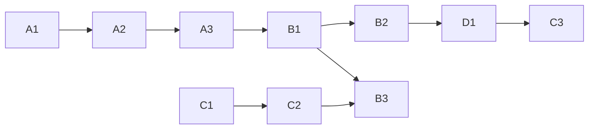

# Initiative 14 — execution backlog (concrete tasks)

**Purpose:** Operator-ready work units with **verification**. Higher-level narrative stays in [`master-roadmap.md`](../master-roadmap.md).

**Convention:** `ID` is stable across reports; **status** is `pending` | `blocked` | `done` (update in place when executing).

---

## Wave A — Governance CSV and mirrors (no Supabase prod write)

| ID | Task | Owner | Verification | Status |
|----|------|-------|--------------|--------|
| A1 | Confirm `holistika_gtm_dtp_001`–`003` rows in [`process_list.csv`](../../../../references/hlk/compliance/process_list.csv) match SOP frontmatter `item_id` | PMO | `py scripts/validate_hlk.py` | done |
| A2 | Merge discipline: run **`merge_process_list_tranche.py` without `--write`** (default dry-run) before `--write`; Phase 1 tranche **merged** 2026-04-17 per [`phase-1-tranche-report.md`](phase-1-tranche-report.md); repeat for **next** tranche from [`candidates/`](../candidates/) | Data | `pytest tests/test_merge_process_list_tranche.py`; `py scripts/validate_hlk.py` | done |
| A3 | **Sync job:** [`scripts/sync_compliance_mirrors_from_csv.py`](../../../../../scripts/sync_compliance_mirrors_from_csv.py) emits `INSERT … ON CONFLICT` SQL for `compliance.process_list_mirror` + `baseline_organisation_mirror` from git CSVs (`--count-only` / `--output`). Run against DB only **after** B1 DDL + operator approval. | Eng | `py scripts/sync_compliance_mirrors_from_csv.py --count-only`; `pytest tests/test_sync_compliance_mirrors_from_csv.py` | done |

---

## Wave B — Staging DDL (after operator approval)

| ID | Task | Owner | Verification | Status |
|----|------|-------|--------------|--------|
| B1 | Apply §4–§6 DDL to **staging** project only (bundled: [`scripts/sql/i14_phase3_staging/20260417_i14_phase3_up.sql`](../../../../scripts/sql/i14_phase3_staging/20260417_i14_phase3_up.sql); then load mirrors per A3) | DBA / Eng | §8 queries — [`verify_staging.sql`](../../../../../scripts/sql/i14_phase3_staging/verify_staging.sql) or `py scripts/verify_phase3_mirror_schema.py` | done |
| B2 | Run **deprecation rename** on staging copy of legacy `public` tables (if present) | DBA | App smoke + [`deprecate-legacy-public-proposal.md`](deprecate-legacy-public-proposal.md) + optional [`20260417_deprecate_legacy_public_optional.sql`](../../../../../scripts/sql/i14_phase3_staging/20260417_deprecate_legacy_public_optional.sql) | done |
| B3 | Wire **Stripe webhook** routing: KiRBe product vs `holistika_ops` tables | Eng | [`supabase/functions/stripe-webhook-handler/`](../../../../../supabase/functions/stripe-webhook-handler/README.md); test events in Stripe CLI; no cross-schema writes | done |

**Note:** **Status `done`** means **repo + procedure artifacts** are in place. **Executing** DDL/webhooks against a live Supabase project remains **operator-gated** (staging first, then production per [`operator-sql-gate.md`](operator-sql-gate.md)).

---

## Wave C — SOP execution (business)

**Order (2026-04-18):** **D1 contact UAT** and tagging/CRM clarity **before** committing to **four consecutive weekly forums (C3)** — see **D-GTM-C3-ORDER** in [`decision-log.md`](../decision-log.md).

| ID | Task | Owner | Verification | Status |
|----|------|-------|--------------|--------|
| C1 | Set **numeric SLA** for first response (replace placeholder in **SOP-GTM_INBOUND_SLA_001**) and publish in team calendar / Notion | CMO | **D-GTM-C1** in [`decision-log.md`](../decision-log.md) (4 business hours); SOP updated; calendar copy (operator) | done |
| C2 | Define **CRM minimum fields** for qualification + BD handoff; map to columns or JSON in Supabase | Growth + Ops | [`crm-minimum-fields-supabase.md`](crm-minimum-fields-supabase.md) + evidence matrix row; **D-GTM-C2** | done |
| C3 | Run **weekly metrics forum** per **SOP-GTM_WEEKLY_METRICS_REVIEW_001** for 4 consecutive weeks | PMO | [`wave-c-weekly-metrics-forum-log.md`](wave-c-weekly-metrics-forum-log.md) filled; minutes in decision log or KM — **start after D1 is credible** | pending |

---

## Wave D — UAT and KM

| ID | Task | Owner | Verification | Status |
|----|------|-------|--------------|--------|
| D1 | Complete Phase 4 UAT [`uat-holistika-contact-funnel-20260417.md`](uat-holistika-contact-funnel-20260417.md) — mock customer E2E + GTM/CRM/ERP rows | Operator | Dated report; PASS/N/A/PENDING per row | in progress |
| D2 | Mirror approved SOP paths under `v3.0/` per [`phase-5-km-checklist.md`](phase-5-km-checklist.md) | PMO | [`gtm-sop-vault-index.md`](gtm-sop-vault-index.md); `validate_hlk_km_manifests.py` if `_assets` manifests added | done |

---

## Wave E — Event and attribution (Initiative 14 unified plan)

**Reference:** [`event-attribution-blueprint-reference.md`](event-attribution-blueprint-reference.md) · **Marketing repo:** `root_cd/boilerplate` (Next.js) · **ERP:** `root_cd/hlk-erp`.

| ID | Task | Owner | Verification | Status |
|----|------|-------|--------------|--------|
| E1 | Structured **`dataLayer`**, event taxonomy, Meta **`event_id`** dedupe (browser vs CAPI path) | Growth + Eng | `next lint` / smoke on boilerplate; GTM preview | pending |
| E2 | Stripe **`client_reference_id`** / metadata (`hlk_marketing_session_id`, UTM) + webhook correlation docs; **`holistika_ops`** persistence per SQL proposal | Eng | README + DDL when applied; [`stripe-webhook-handler`](../../../../../supabase/functions/stripe-webhook-handler/README.md) | pending |
| E3 | Optional **sGTM** + optional server-to-Postgres (auth + RLS) | Ops + Eng | Security review; staging | pending |
| E4 | Bi-directional **CRM** sync — vendor + field map ([`crm-minimum-fields-supabase.md`](crm-minimum-fields-supabase.md)); decision log | Ops | Integration catalog row | pending |

---

## Dependency graph (summary)

**Note:** **C3** (four weekly forums) is intentionally sequenced **after** **D1** contact UAT is credible — see Wave C intro and **D-GTM-C3-ORDER**.

---

## Gates before marking Initiative 14 “closed”

1. `py scripts/validate_hlk.py`
2. `py scripts/check-drift.py`
3. `py scripts/release-gate.py`
4. Operator sign-off on production DDL (separate from this document)
