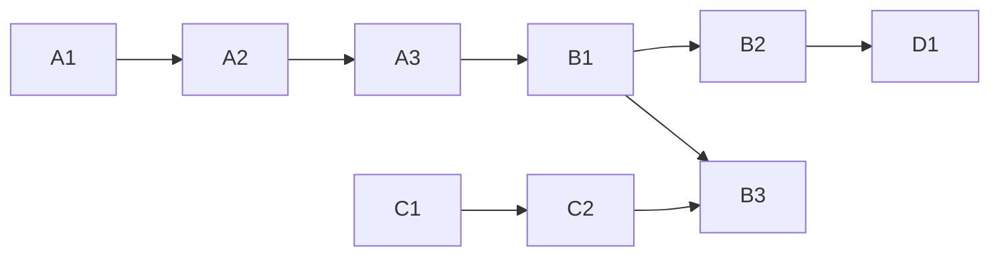

# Initiative 14 — execution backlog (concrete tasks)

**Purpose:** Operator-ready work units with **verification**. Higher-level narrative stays in [`master-roadmap.md`](../master-roadmap.md).

**Convention:** `ID` is stable across reports; **status** is `pending` | `blocked` | `done` (update in place when executing).

---

## Wave A — Governance CSV and mirrors (no Supabase prod write)

| ID | Task | Owner | Verification | Status |
|----|------|-------|--------------|--------|
| A1 | Confirm `holistika_gtm_dtp_001`–`003` rows in [`process_list.csv`](../../../../references/hlk/compliance/process_list.csv) match SOP frontmatter `item_id` | PMO | `py scripts/validate_hlk.py` | done |
| A2 | Run merge dry-run in CI / locally when adding **next** tranche from [`candidates/`](../candidates/) | Data | `py scripts/merge_process_list_tranche.py --dry-run` + `validate_hlk` | pending |
| A3 | **Sync job:** [`scripts/sync_compliance_mirrors_from_csv.py`](../../../../scripts/sync_compliance_mirrors_from_csv.py) emits `INSERT … ON CONFLICT` SQL for `compliance.process_list_mirror` + `baseline_organisation_mirror` from git CSVs (`--count-only` / `--output`). Run against DB only **after** B1 DDL + operator approval. | Eng | `py scripts/sync_compliance_mirrors_from_csv.py --count-only`; `pytest tests/test_sync_compliance_mirrors_from_csv.py` | done |

---

## Wave B — Staging DDL (after operator approval)

| ID | Task | Owner | Verification |
|----|------|-------|--------------|
| B1 | Apply §4–§6 DDL to **staging** project only | DBA / Eng | §8 verification queries pass |
| B2 | Run **deprecation rename** on staging copy of legacy `public` tables (if present) | DBA | App smoke + [`deprecate-legacy-public-proposal.md`](deprecate-legacy-public-proposal.md) checklist |
| B3 | Wire **Stripe webhook** routing: KiRBe product vs `holistika_ops` tables | Eng | Test events in Stripe CLI; no cross-schema writes |

---

## Wave C — SOP execution (business)

| ID | Task | Owner | Verification |
|----|------|-------|--------------|
| C1 | Set **numeric SLA** for first response (replace placeholder in **SOP-GTM_INBOUND_SLA_001**) and publish in team calendar / Notion | CMO | Dated decision in [`decision-log.md`](../decision-log.md) |
| C2 | Define **CRM minimum fields** for qualification + BD handoff; map to columns or JSON in Supabase | Growth + Ops | Screen recording or schema doc linked in evidence matrix |
| C3 | Run **weekly metrics forum** per **SOP-GTM_WEEKLY_METRICS_REVIEW_001** for 4 consecutive weeks | PMO | Minutes + action items in decision log or KM |

---

## Wave D — UAT and KM

| ID | Task | Owner | Verification |
|----|------|-------|--------------|
| D1 | Complete Phase 4 UAT stub [`uat-holistika-contact-funnel-20260417.md`](uat-holistika-contact-funnel-20260417.md) when dashboard paths exist | Operator | Dated report row, not PENDING |
| D2 | Mirror approved SOP paths under `v3.0/` per [`phase-5-km-checklist.md`](phase-5-km-checklist.md) | PMO | `py scripts/validate_hlk_km_manifests.py` if manifests touched |

---

## Dependency graph (summary)

---

## Gates before marking Initiative 14 “closed”

1. `py scripts/validate_hlk.py`
2. `py scripts/check-drift.py`
3. `py scripts/release-gate.py`
4. Operator sign-off on production DDL (separate from this document)
