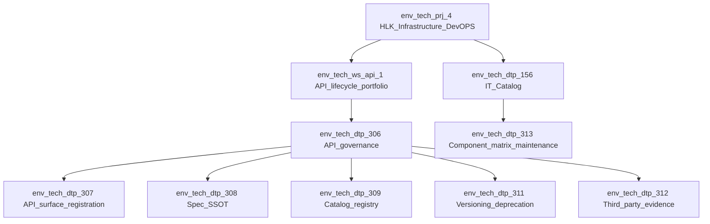

# Simulated process subtree — API lifecycle (post-tranche)

Frozen **mermaid** diagram for human diff against `process_list.csv` (not SSOT).

```mermaid
flowchart TD
  env_tech_prj_4[env_tech_prj_4 HLK_Infrastructure_DevOPS]
  env_tech_ws_api_1[env_tech_ws_api_1 API_lifecycle_portfolio]
  env_tech_dtp_306[env_tech_dtp_306 API_governance]
  env_tech_dtp_307[env_tech_dtp_307 API_surface_registration]
  env_tech_dtp_308[env_tech_dtp_308 Spec_SSOT]
  env_tech_dtp_309[env_tech_dtp_309 Catalog_registry]
  env_tech_dtp_311[env_tech_dtp_311 Versioning_deprecation]
  env_tech_dtp_312[env_tech_dtp_312 Third_party_evidence]
  env_tech_dtp_156[env_tech_dtp_156 IT_Catalog]
  env_tech_dtp_313[env_tech_dtp_313 Component_matrix_maintenance]
  env_tech_prj_4 --> env_tech_ws_api_1
  env_tech_ws_api_1 --> env_tech_dtp_306
  env_tech_dtp_306 --> env_tech_dtp_307
  env_tech_dtp_306 --> env_tech_dtp_308
  env_tech_dtp_306 --> env_tech_dtp_309
  env_tech_dtp_306 --> env_tech_dtp_311
  env_tech_dtp_306 --> env_tech_dtp_312
  env_tech_prj_4 --> env_tech_dtp_156
  env_tech_dtp_156 --> env_tech_dtp_313
```
