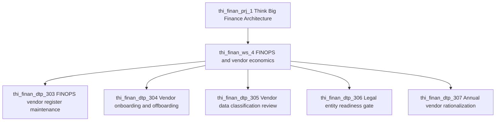

# Process tree fragment — Think Big Finance Architecture (FINOPS)

```mermaid
flowchart TB
  prj[thi_finan_prj_1 Think Big Finance Architecture]
  ws4[thi_finan_ws_4 FINOPS and vendor economics]
  p303[thi_finan_dtp_303 FINOPS vendor register maintenance]
  p304[thi_finan_dtp_304 Vendor onboarding and offboarding]
  p305[thi_finan_dtp_305 Vendor data classification review]
  p306[thi_finan_dtp_306 Legal entity readiness gate]
  p307[thi_finan_dtp_307 Annual vendor rationalization]
  prj --> ws4
  ws4 --> p303
  ws4 --> p304
  ws4 --> p305
  ws4 --> p306
  ws4 --> p307
```
