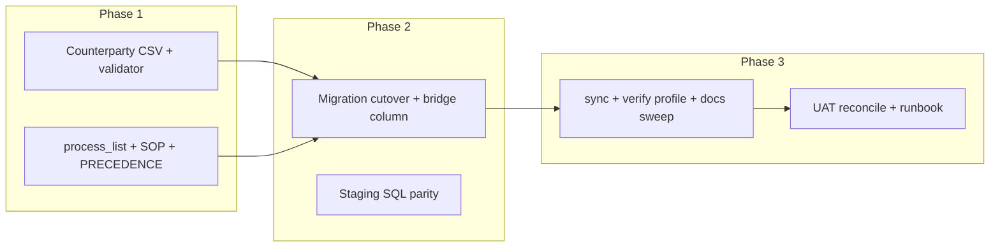

# Initiative 18 — FINOPS counterparty SSOT + Stripe FDW

**Folder:** `docs/wip/planning/18-hlk-finops-counterparty-stripe/`  
**Status:** Executed (2026-04-23)  
**Supersedes:** Initiative 16 vendor-only register and mirror ([`16-hlk-finops-vendor-ssot/`](../16-hlk-finops-vendor-ssot/master-roadmap.md)) for FINOPS commercial metadata.

## Outcome

- Git-canonical **`FINOPS_COUNTERPARTY_REGISTER.csv`** (vendors, customers, partners) replaces **`FINOPS_VENDOR_REGISTER.csv`**.
- Supabase **`compliance.finops_counterparty_register_mirror`** with one-step migration from **`finops_vendor_register_mirror`** then drop of the old table.
- **`holistika_ops.stripe_customer_link.finops_counterparty_id`** bridges Stripe rows to register slugs (git authoritative; not a database FK to the mirror).
- **Stripe read plane:** inventory-first documentation and privilege hardening for existing **`stripe_gtm`** / **`stripe_gtm_server`** (no duplicate Wrapper server unless `decision-log.md` approves).
- Validators, sync script (`--finops-counterparty-register-only`), verification profile **`compliance_mirror_emit`**, **`PRECEDENCE.md`**, Finance **SOP**, **`process_list.csv`** tranche (`thi_finan_ws_4` narrative, `thi_finan_dtp_303`–`307` retarget, **`thi_finan_dtp_308`** Revenue FDW stewardship, **`thi_finan_dtp_309`** counterparty onboarding).

## Planes (MKTOPS vs FINOPS vs Stripe)

| Plane | Owns | System of record |
|-------|------|------------------|
| **MKTOPS** (Initiative 14) | Funnel, qualification, `lead_intake` | GTM process rows + `holistika_ops.lead_intake` |
| **FINOPS** (Finance tree) | Counterparty **metadata**, ownership, process linkage, contract **pointers** | **`FINOPS_COUNTERPARTY_REGISTER.csv`** + mirror |
| **Stripe** | Payments, subscriptions, invoices | **Stripe API**; **FDW** = federated read; webhooks hydrate ops tables |
| **Phase C** | Monetary ledger facts | Future **`finops`** schema — still gated (`thi_finan_dtp_306`) |

## Phases

1. **CSV + HLK:** Fieldnames module, validator, seed rows, `validate_hlk.py` integration.
2. **Governance:** Process tranche, new Business Controller SOP, stub legacy vendor SOP, PRECEDENCE.
3. **DDL:** Staging under `scripts/sql/i18_phase1_staging/`, forward migration under `supabase/migrations/`, README parity map.
4. **Tooling + docs:** `sync_compliance_mirrors_from_csv.py`, `verification-profiles.json`, ARCHITECTURE / USER_GUIDE / GLOSSARY / CHANGELOG, ERP handoff refresh, tests.
5. **Operator:** `compliance_mirror_emit` SQL apply; optional seed `stripe_customer_link`; Stripe FDW privilege review per runbook; MCP-backed UAT.

## Links

- [decision-log.md](decision-log.md)
- [reports/execution-tranche-20260423.md](reports/execution-tranche-20260423.md)
- [reports/stripe-fdw-operator-runbook.md](reports/stripe-fdw-operator-runbook.md)
- [reports/uat-stripe-finops-reconcile-20260423.md](reports/uat-stripe-finops-reconcile-20260423.md)
