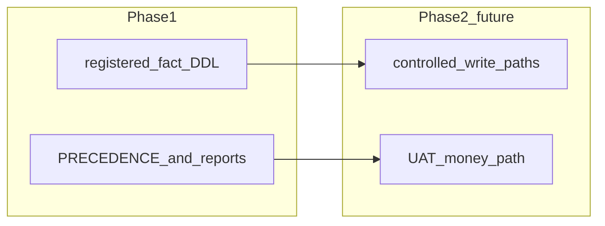

# Initiative 19 — FINOPS `finops.*` ledger (Phase C)

**Folder:** `docs/wip/planning/19-hlk-finops-ledger/`  
**Status:** Phase 1 DDL applied **MasterData** (`swrmqpelgoblaquequzb`) + git parity (2026-04-23)  
**Depends on:** [Initiative 18](../18-hlk-finops-counterparty-stripe/master-roadmap.md) (counterparty mirror + Stripe bridge)

## Outcome (Phase 1)

- Postgres schema **`finops`** with **`finops.registered_fact`**: optional monetary minor units, `fact_type` discriminator, joins via **`counterparty_id`** (CSV slug) and optional **`stripe_customer_id` / `stripe_subscription_id`**.
- **RLS:** deny `anon` / `authenticated`; **`service_role`** for writes (same posture as compliance mirrors).
- **SSOT unchanged:** `FINOPS_COUNTERPARTY_REGISTER.csv` = metadata; Stripe API = payment truth; this table is **governed operational storage**, not a CSV replacement.

## Phases

1. **Phase 1 (complete in repo):** Staging SQL, forward migration, tests, PRECEDENCE + initiative docs.
2. **Phase 2 (future):** Edge functions / batch jobs / ERP handoff for inserts; expand `fact_type` vocabulary; dated UAT when live reconciliation is in scope.

## Links

- [decision-log.md](decision-log.md)
- [reports/sql-proposal-phase1-20260423.md](reports/sql-proposal-phase1-20260423.md)
- [reports/execution-tranche-20260423.md](reports/execution-tranche-20260423.md)
