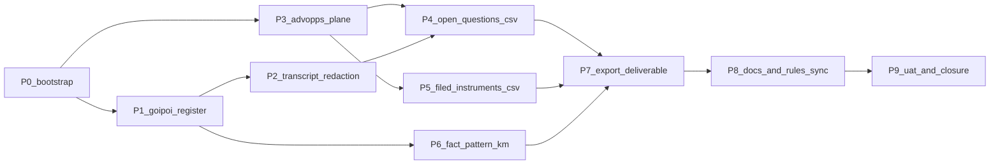

# Initiative 21 — Adviser Engagement plane + GOI/POI dimension

**Folder:** `docs/wip/planning/21-hlk-adviser-engagement-and-goipoi/`  
**Status:** **Closed (2026-04-28)** — UAT report [`reports/uat-adviser-handoff-20260428.md`](reports/uat-adviser-handoff-20260428.md)  
**Authoritative Cursor plan:** `~/.cursor/plans/adviser_engagement_plane_goi_poi_b61ebcbe.plan.md`  
**Supersedes / extends:** [`04-holistika-company-formation/`](../04-holistika-company-formation/master-roadmap.md) ad-hoc counsel handoff vault edits (commit `1ebf9b8`); promotes them into governed registers and a scalable plane.

> **Closure note (2026-04-28)** — All 10 phases (P0–P9) are complete. Verification matrix passes (HLK validators, KM manifests, vault links, sync mirror smoke tests, export smoke profile). The two pre-existing `tests/validate_configs.py` failures (sandbox `mode='all'` literal) pre-date this initiative and track separately under the ShadowGPU/ShadowPC terminology change recorded in `CHANGELOG.md` (2026-04-24). No baseline_organisation rows changed; five `process_list.csv` tranches were merged before the SOPs that cite their `item_id`s (SOP-META invariant respected). The cursor-rules hygiene checkbox is **CONFIRMED**: `akos-adviser-engagement.mdc` was added in P3, `akos-holistika-operations.mdc` planes table now includes the ADVOPS row, and `akos-docs-config-sync.mdc` lists triggers for the four new akos modules + four validators + the export script.

> **Closure follow-up (2026-04-29) — Initiative 22 closed all three deferred actions:** live Supabase mirror DDL applied via user-supabase MCP `apply_migration` (4/4) + seed DML via `execute_sql` (`service_role`, row counts 6/6/12/1 match CSV); PDF rendering wired via WeasyPrint → fpdf2 → pandoc chain with opt-in `requirements-export.txt`; `git filter-repo` posture re-affirmed as DEFERRED with documented re-evaluation trigger in [`docs/wip/planning/22-hlk-scalability-and-i21-closures/reports/re-eval-trigger.md`](../22-hlk-scalability-and-i21-closures/reports/re-eval-trigger.md). The four migration filenames were renamed from `20260428190{000,100,200,300}` to `20260429081{728,734,754,800}` to match the remote `schema_migrations` ledger. See [Initiative 22 UAT](../22-hlk-scalability-and-i21-closures/reports/uat-i22-scalability-and-closure-20260429.md) for the full verification matrix; the i22 plane × program × topic layout convention also relocates this initiative's KM topic asset under `_assets/advops/PRJ-HOL-FOUNDING-2026/adviser_handoff/`. Recommended (non-blocking) follow-ups are listed in the UAT report.

## Outcome

Two cross-cutting upgrades on top of the existing founder-incorporation work:

1. **GOI/POI as a canonical knowledge dimension** — `GOI_POI_REGISTER.csv` under `compliance/` with `akos/` fieldnames module, validator, mirror DDL, vault SOP, and `process_list.csv` row. Documents reference `POI-*` / `GOI-*` ids only; obfuscation becomes deterministic.
2. **External Adviser Engagement plane (ADVOPS)** parallel to MKTOPS / FINOPS / OPS / TECHOPS — disciplines lookup CSV, plane SOP, vault router, and a per-discipline structure for the existing handoff package. The existing **markdown** open-questions and filed-instruments registers graduate to **CSV SSOT** with vault MD as the human read-out.

## Asset classification (per [`PRECEDENCE.md`](../../../references/hlk/compliance/PRECEDENCE.md))

| Class | Paths | Rule |
|:------|:------|:-----|
| **New canonical CSVs** | `docs/references/hlk/compliance/GOI_POI_REGISTER.csv`, `ADVISER_ENGAGEMENT_DISCIPLINES.csv`, `ADVISER_OPEN_QUESTIONS.csv`, `FOUNDER_FILED_INSTRUMENTS.csv` | Edit-here-first; HLK convention (no `.example`); validator-gated |
| **New mirrors** | `compliance.goipoi_register_mirror`, `compliance.adviser_engagement_disciplines_mirror`, `compliance.adviser_open_questions_mirror`, `compliance.founder_filed_instruments_mirror` | DDL via `supabase/migrations/`; DML via `compliance_mirror_emit`; `service_role` only |
| **New canonical vault** | `SOP-HLK_GOIPOI_REGISTER_MAINTENANCE_001.md`, `SOP-HLK_TRANSCRIPT_REDACTION_001.md`, `SOP-EXTERNAL_ADVISER_ENGAGEMENT_001.md`, `EXTERNAL_ADVISER_ROUTER.md`, KM Output 1 manifest | Role-owned; SOP-META envelope; CSV merges before SOP for net-new `item_id`s |
| **Reference-only** | `docs/references/hlk/business-intent/delete-legal-transcripts/` (redacted) | Non-canonical; raw originals off-repo; redacted markdown references `POI-*`/`GOI-*` |

## Phase dependency

## Phase at a glance

| Phase | Purpose | Key deliverable / gate |
|:-----:|:--------|:-----------------------|
| **P0** | Bootstrap initiative + traceability | This `master-roadmap.md`, `decision-log.md` (D-CH-1..D-CH-8), `asset-classification.md`, `evidence-matrix.md`; baseline `validate_hlk` + `validate_hlk_vault_links` |
| **P1** | GOI/POI canonical register + SOP + tranche + mirror | `GOI_POI_REGISTER.csv` validated, vault SOP, `hol_peopl_dtp_303` row (operator-gated), mirror DDL |
| **P2** | Redaction SOP + redacted transcripts | `SOP-HLK_TRANSCRIPT_REDACTION_001.md`, redacted `delete-legal-transcripts/`, `hol_peopl_dtp_304` row |
| **P3** | ADVOPS plane (rule + disciplines CSV + plane SOP + router) | `akos-adviser-engagement.mdc`, `ADVISER_ENGAGEMENT_DISCIPLINES.csv`, `EXTERNAL_ADVISER_ROUTER.md`, `hol_opera_ws_5` workstream |
| **P4** | Open questions CSV graduation + per-discipline sections | `ADVISER_OPEN_QUESTIONS.csv` validated; vault MD becomes derived view; section7 traceability preserved |
| **P5** | Filed instruments CSV graduation | `FOUNDER_FILED_INSTRUMENTS.csv` validated; vault MD becomes derived view |
| **P6** | Fact pattern + KM Topic-Fact-Source manifest | Fact pattern uses `POI-*`/`GOI-*` only; manifest under `v3.0/_assets/` |
| **P7** | Export deliverable | `scripts/export_adviser_handoff.py` + smoke step in `verification-profiles.json` |
| **P8** | Docs + rules sync | `ARCHITECTURE`, `USER_GUIDE`, `v3.0/index.md`, `CHANGELOG`; cursor rules updated |
| **P9** | UAT + closure | Operator approvals on each tranche; `reports/uat-adviser-handoff-YYYYMMDD.md`; closure note |

## Verification matrix (governed)

- `py scripts/validate_hlk.py` (extended with new register validators when files exist)
- `py scripts/validate_hlk_vault_links.py`
- `py scripts/validate_hlk_km_manifests.py` (P6+)
- `py scripts/validate_goipoi_register.py` (P1+)
- `py scripts/validate_adviser_disciplines.py` (P3+)
- `py scripts/validate_adviser_questions.py` (P4+)
- `py scripts/validate_founder_filed_instruments.py` (P5+)
- `py scripts/verify.py pre_commit`
- `py scripts/release-gate.py`
- `py scripts/export_adviser_handoff.py --discipline all --format md` (P7+)

Per [`akos-planning-traceability.mdc`](../../../../.cursor/rules/akos-planning-traceability.mdc) UAT contract: a dated `reports/uat-adviser-handoff-YYYYMMDD.md` with PASS/SKIP/N/A rows is required to close the initiative.

## Operator approval gates (per [`akos-governance-remediation.mdc`](../../../../.cursor/rules/akos-governance-remediation.mdc))

One explicit gate per `process_list.csv` tranche:

- **G-1** P1 — `hol_peopl_dtp_303` GOI/POI register maintenance (Compliance role, under `hol_peopl_ws_1` Compliance Methodology).
- **G-2** P2 — `hol_peopl_dtp_304` Adviser transcript redaction (Compliance role, under `hol_peopl_ws_1`).
- **G-3** P3 — `hol_opera_ws_5` External Adviser Engagement (PMO role, under `thi_opera_prj_1`) + `hol_opera_dtp_311` disciplines maintenance.
- **G-4** P4 — `hol_opera_dtp_312` Adviser open questions register maintenance (PMO).
- **G-5** P5 — `thi_legal_dtp_304` Founder filed instruments register maintenance (Legal Counsel, under `thi_legal_ws_2`).

`baseline_organisation.csv` is **not** expected to change unless P3 reveals a missing role; if it does, that change uses its own approval gate.

## Links

- [decision-log.md](decision-log.md)
- [asset-classification.md](asset-classification.md)
- [evidence-matrix.md](evidence-matrix.md)
- [reports/p2-redaction-diff.md](reports/p2-redaction-diff.md)
- [reports/uat-adviser-handoff-20260428.md](reports/uat-adviser-handoff-20260428.md)
- Founder program: [`PRJ-HOL-FOUNDING-2026`](../../references/hlk/v3.0/Admin/O5-1/Operations/PMO/TOPIC_PMO_CLIENT_DELIVERY_HUB.md)
- Counsel handoff today: [`EXTERNAL_COUNSEL_HANDOFF_PACKAGE.md`](../../references/hlk/v3.0/Admin/O5-1/People/Legal/EXTERNAL_COUNSEL_HANDOFF_PACKAGE.md)
- Plane SOP: [`SOP-EXTERNAL_ADVISER_ENGAGEMENT_001.md`](../../references/hlk/v3.0/Admin/O5-1/Operations/PMO/SOP-EXTERNAL_ADVISER_ENGAGEMENT_001.md)
- Router: [`EXTERNAL_ADVISER_ROUTER.md`](../../references/hlk/v3.0/Admin/O5-1/Operations/PMO/EXTERNAL_ADVISER_ROUTER.md)
- KM Topic manifest: [`topic_external_adviser_handoff.manifest.md`](../../references/hlk/v3.0/_assets/advops/PRJ-HOL-FOUNDING-2026/adviser_handoff/topic_external_adviser_handoff.manifest.md) (relocated under plane × program × topic convention by [Initiative 22](../22-hlk-scalability-and-i21-closures/master-roadmap.md) P2)
- Cursor rule: [`akos-adviser-engagement.mdc`](../../../../.cursor/rules/akos-adviser-engagement.mdc)
