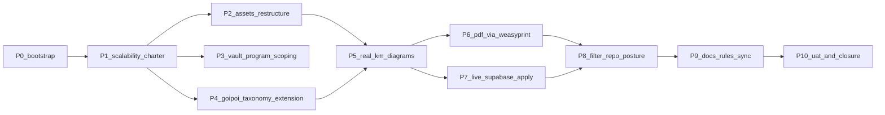

# Initiative 22 — Scalable HLK hierarchy + Initiative 21 closures

**Folder:** `docs/wip/planning/22-hlk-scalability-and-i21-closures/`  
**Status:** **Closed (2026-04-29)** — UAT [`reports/uat-i22-scalability-and-closure-20260429.md`](reports/uat-i22-scalability-and-closure-20260429.md)  
**Authoritative Cursor plan:** `~/.cursor/plans/scalable_hlk_hierarchy_plus_i21_closures_5efb0b1a.plan.md`  
**Supersedes / extends:** [`21-hlk-adviser-engagement-and-goipoi/`](../21-hlk-adviser-engagement-and-goipoi/master-roadmap.md) — closes its three deferred actions and generalises its surfaces beyond the founder-incorporation program.

> **Closure note (2026-04-29)** — All 11 phases (P0–P10) are complete. Verification matrix: 15/15 PASS (incl. live Supabase mirror probe via user-supabase MCP, MD + PDF export smoke profiles, KM manifest + vault links + HLK validators, migration ledger parity rename, security advisor clean for new mirrors). Initiative 21 deferred items closed: live Supabase mirror DDL+DML applied; PDF rendering via WeasyPrint→fpdf2→pandoc chain; `git filter-repo` posture re-affirmed as DEFERRED with documented re-evaluation trigger. Forward layout convention `<plane> × <program_id> × <topic_id>` adopted for `_assets/` (physically restructured) and `compliance/` (convention-only with deprecation alias map). New cursor-rules entries: `akos-holistika-operations.mdc` (forward layout convention pointer) and `akos-docs-config-sync.mdc` (six new sync triggers covering the new READMEs, scripts, and opt-in deps). The cursor-rules hygiene checkbox is **CONFIRMED**.

## Outcome

Three connected goals on top of Initiative 21:

1. **Scalability of canonical surfaces** — the KM Topic-Fact-Source manifest, the GOI/POI dimension, the `compliance/` CSV directory, the `_assets/` visual store, and the `v3.0/<role>/` casework folders should not be coupled to one program. Establish a forward layout convention `<plane> × <program_id> × <topic_id>` and physically restructure `_assets/`; document `compliance/` convention without breaking moves; add a program-folder pattern under role-owned vault folders.
2. **Real KM diagrams** — replace the placeholder PNG checked in for the ADVOPS plane with a real Mermaid-rendered diagram (source `.mmd` + rendered `.png`/`.svg`), driven by a deterministic CLI (`mmdc` + `mermaid.ink` fallback). Reuse for future Topic-Fact-Source manifests.
3. **Close Initiative 21 deferred items** — apply the four `compliance.*_mirror` migrations on the live Supabase project via the user-supabase MCP and seed via `service_role`; add WeasyPrint-based PDF rendering to `scripts/export_adviser_handoff.py`; re-affirm the `git filter-repo` posture as DEFERRED with a documented re-evaluation contract.

## Asset classification (per [`PRECEDENCE.md`](../../../references/hlk/compliance/PRECEDENCE.md))

| Class | Paths | Rule |
|:------|:------|:-----|
| **New canonical** | `docs/references/hlk/compliance/README.md` (forward layout convention), `docs/references/hlk/v3.0/_assets/README.md` (Output-1 directory rules), `<role>/programs/<program_id>/README.md` (program scoping pattern) | Edit-here-first; reference-only docs but governed under PRECEDENCE additions |
| **Restructured (canonical)** | `docs/references/hlk/v3.0/_assets/advops/PRJ-HOL-FOUNDING-2026/adviser_handoff/topic_external_adviser_handoff.{manifest.md,md,png,svg,mmd}` | Moved via `git mv`; manifest sha256 refreshed against new render |
| **Extended canonical** | `scripts/validate_goipoi_register.py` (extended `class` enum), `docs/references/hlk/v3.0/Admin/O5-1/People/Compliance/SOP-HLK_GOIPOI_REGISTER_MAINTENANCE_001.md` (program-onboarding subsection) | Backwards-compatible additions; existing rows unchanged |
| **New tooling** | `scripts/render_km_diagrams.py`, `requirements-export.txt`, `config/verification-profiles.json` (`export_adviser_handoff_pdf_smoke`) | New deterministic CLIs and opt-in dependencies |
| **Mirrored / derived** | `compliance.{goipoi_register,adviser_engagement_disciplines,adviser_open_questions,founder_filed_instruments}_mirror` rows on live Supabase | Seeded from canonical CSVs via MCP `apply_migration` + `execute_sql`; not git-canonical |
| **Reference-only** | `docs/wip/planning/22-.../reports/p7-supabase-apply-evidence.md`, `re-eval-trigger.md` | Evidence and trigger contracts |

## Phase dependency

## Phase at a glance

| Phase | Purpose | Key deliverable / gate |
|:-----:|:--------|:-----------------------|
| **P0** | Bootstrap initiative + traceability | This `master-roadmap.md`, `decision-log.md` (D-IH-1..D-IH-7), `asset-classification.md`, `evidence-matrix.md`; baseline validate_hlk / vault links / KM manifests |
| **P1** | Scalability charter (convention SSOT) | `compliance/README.md`, `PRECEDENCE.md` "Layout convention (forward)", `HLK_KM_TOPIC_FACT_SOURCE.md` `paths.mermaid` slot |
| **P2** | `_assets/` restructure | `git mv` topic into `_assets/advops/PRJ-HOL-FOUNDING-2026/adviser_handoff/`; `_assets/README.md`; KM manifest validator green |
| **P3** | `v3.0/` program scoping | `programs/<program_id>/` subfolders + READMEs under Legal/Compliance/Operations; admonition headers on existing `FOUNDER_*` docs |
| **P4** | GOI/POI scalability extension | Extended `class` enum + program-onboarding SOP subsection |
| **P5** | Real KM diagrams | `topic_external_adviser_handoff.mmd` + `scripts/render_km_diagrams.py` (mmdc + mermaid.ink fallback); placeholder PNG replaced |
| **P6** | PDF via WeasyPrint | `requirements-export.txt`; `--format pdf` path; `export_adviser_handoff_pdf_smoke` profile |
| **P7** | Live Supabase mirror apply | 4 i21 DDL applied via MCP; seed DML via `service_role`; row-count probe; evidence report |
| **P8** | Filter-repo posture (deferred) | i21 UAT row C → "DEFERRED — trigger not met"; `re-eval-trigger.md` template |
| **P9** | Docs + rules sync | ARCHITECTURE/USER_GUIDE/CHANGELOG/CONTRIBUTING/cursor rules updated |
| **P10** | UAT + closure | Verification matrix incl. live mirror probe; dated UAT report; closure note + i21 cross-link |

## Verification matrix (governed)

- `py scripts/validate_hlk.py`
- `py scripts/validate_hlk_vault_links.py`
- `py scripts/validate_hlk_km_manifests.py`
- `py scripts/sync_compliance_mirrors_from_csv.py --count-only`
- `py scripts/verify.py compliance_mirror_emit`
- `py scripts/verify.py export_adviser_handoff_smoke` (Markdown)
- `py scripts/verify.py export_adviser_handoff_pdf_smoke` (PDF; SKIP gracefully if WeasyPrint missing)
- MCP `execute_sql` row-count probe per i21 mirror
- `py scripts/release-gate.py` (Initiative 21+22 lanes; pre-existing `validate_configs.py` failures remain out of scope)

Per [`akos-planning-traceability.mdc`](../../../../.cursor/rules/akos-planning-traceability.mdc) UAT contract: a dated `reports/uat-i22-scalability-and-closure-YYYYMMDD.md` with PASS/SKIP/N/A rows is required to close.

## Operator approval gates (per [`akos-governance-remediation.mdc`](../../../../.cursor/rules/akos-governance-remediation.mdc))

- **G-1** P4 — extended `class` enum in `validate_goipoi_register.py` (read-only forward addition; no existing-row impact).
- **G-2** P7 — live Supabase DDL apply via MCP `apply_migration` (parity with files already in `supabase/migrations/`; explicit operator-SQL-gate semantics per `akos-holistika-operations.mdc`).
- **G-3** P7 — seed DML via `service_role` `execute_sql` (deny-`anon`/`authenticated` posture preserved).
- **G-4** P6 — opt-in WeasyPrint dependency (separate `requirements-export.txt`; default install footprint unchanged).

`baseline_organisation.csv` is **not** expected to change. `process_list.csv` is **not** expected to change in this initiative — no new processes introduced.

## Out of scope (explicit)

- Physical relocation of `FINOPS_*`, `COMPONENT_SERVICE_MATRIX.csv`, `process_list.csv`, `baseline_organisation.csv` (deferred to a dedicated initiative; convention is documented now).
- `git filter-repo` history rewrite (deferred per SOP-HLK_TRANSCRIPT_REDACTION_001 §7; trigger not met).
- Renaming `FOUNDER_FILED_INSTRUMENTS.csv` → `FILED_INSTRUMENTS.csv` (deferred; alias documented).
- Auto-rendering vault MD from CSVs (kept manual; future P-X if pain accumulates).

## Links

- [decision-log.md](decision-log.md)
- [asset-classification.md](asset-classification.md)
- [evidence-matrix.md](evidence-matrix.md)
- Initiative 21: [`21-hlk-adviser-engagement-and-goipoi/master-roadmap.md`](../21-hlk-adviser-engagement-and-goipoi/master-roadmap.md)
- Initiative 21 UAT: [`uat-adviser-handoff-20260428.md`](../21-hlk-adviser-engagement-and-goipoi/reports/uat-adviser-handoff-20260428.md)
- KM contract: [`HLK_KM_TOPIC_FACT_SOURCE.md`](../../../references/hlk/compliance/HLK_KM_TOPIC_FACT_SOURCE.md)
- Redaction SOP: [`SOP-HLK_TRANSCRIPT_REDACTION_001.md`](../../../references/hlk/v3.0/Admin/O5-1/People/Compliance/SOP-HLK_TRANSCRIPT_REDACTION_001.md)
