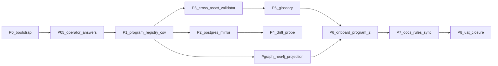

# Initiative 23 — Program Registry + Onboarding Program 2

**Folder:** `docs/wip/planning/23-hlk-program-registry-and-program-2/`  
**Status:** **Closed (2026-04-29)** — UAT [`reports/uat-i23-program-registry-20260429.md`](reports/uat-i23-program-registry-20260429.md).  
**Authoritative Cursor plan:** `~/.cursor/plans/hlk_scalability_wave_2_initiatives_639a02d7.plan.md` §"Initiative 23".  
**Bootstrap dependency:** Initiative 22a (`docs/wip/planning/22a-i22-post-closure-followups/`) — operator-answers YAML + scaffolder.

> **Closure note (2026-04-29)** — All 9 phases (P0–P8) complete: P0+P0.5+P1+P2+Pgraph shipped in [PR #13](https://github.com/FraysaXII/openclaw-akos/pull/13); P3+P4+P5 in [PR #14](https://github.com/FraysaXII/openclaw-akos/pull/14); P6+P7+P8 in this branch's PR. **12 programs registered** with unique 3-letter codes; Postgres mirror applied; Neo4j projection live (`:Program` + typed program-side edges, naming disambiguated from existing `:PARENT_OF`); cross-asset validator integrated into `validate_hlk.py`; drift probe operator-pasted with graceful SKIP; cross-program glossary published. **P6 onboard program 2 (`PRJ-HOL-KIR-2026`)**: 6 evidence-based role-folder READMEs landed under Tech / Data×2 / Finance / People / PMO; existing `env_tech_prj_2` row satisfies G-23-2 (no new project row needed); no new role required so G-23-3 is N/A; `consumes_program_ids` edge `PRJ-HOL-KIR-2026 → PRJ-HOL-FOUNDING-2026` registered in CSV + projected to Neo4j as `:CONSUMES`; one KM topic asset (`_assets/techops/PRJ-HOL-KIR-2026/topic_kirbe_billing_plane_routing/`) with `.mmd` source-of-truth + manifest + companion + rendered PNG/SVG (sha256 `779e9f8e616b4e41…`) proves the layout works at N=2 programs. **Drift fixed** — the P4 probe surfaced `compliance.process_list_mirror=1083` vs canonical CSV=1091; the missing 8 rows (i21 ADVOPS tranche + i18/i19 finance rows) were re-seeded via MCP `execute_sql`; live mirror now reports 1091 = CSV. Verification matrix: `validate_hlk.py` PASS (12 programs / 1091 processes / 65 roles), `validate_hlk_vault_links.py` PASS, `validate_hlk_km_manifests.py` PASS, 37/37 pytest PASS, drift probe PASS (8/8 mirrors at parity). **YAML Section 4 (KiRBe duality) sentinels remain operator-pending by design** — they describe future operator decisions (paying-customers status, secondary owner roles); P6 closure does not require them. **D-IH-23-B**: product programs use 3-letter `program_code` as the slug (`PRJ-HOL-KIR-2026`, not `PRJ-HOL-KIRBE-2026`); casework programs keep the long form (`PRJ-HOL-FOUNDING-2026`). Initiative 22 stays closed.

## Outcome

Promote programs to a first-class governed registry, separate from `process_list.csv` projects:

1. **Canonical PROGRAM_REGISTRY.csv** under `compliance/dimensions/` (first canonical CSV that lands directly under the Initiative-22 forward-layout `dimensions/` subfolder per D-IH-1).
2. **Program-to-program edges** as denormalized text in CSV/Postgres + typed relationships in Neo4j (D-IH-9): `parent_program_id`, `consumes_program_ids`, `produces_for_program_ids`, `subsumes_program_ids`.
3. **Cross-asset consistency validator** asserts every `program_id` reference in GOI/POI / questions / instruments / KM manifests / vault `programs/<program_id>/` resolves into the registry (P3).
4. **Drift probe** — operator-pasted JSON parity check between canonical CSVs and live Supabase mirrors (P4).
5. **Cross-program glossary** — `docs/reference/glossary-cross-program.md` (P5).
6. **Onboard program 2** — `PRJ-HOL-KIRBE-2026` (D-IH-16) honoring its **dual nature** (SaaS product plane + KM ingestion source) with **evidence-based** role roots (P6).

## Asset classification (per [`PRECEDENCE.md`](../../../references/hlk/compliance/PRECEDENCE.md))

| Class | Paths | Rule |
|:------|:------|:-----|
| **New canonical** | `docs/references/hlk/compliance/dimensions/PROGRAM_REGISTRY.csv` | Edit-here-first; emitted from `operator-answers-wave2.yaml` Section 1 by `scripts/wave2_backfill.py` |
| **New canonical (tooling)** | `akos/hlk_program_registry_csv.py`, `scripts/validate_program_registry.py`, `scripts/validate_program_id_consistency.py`, `scripts/probe_compliance_mirror_drift.py` | Backwards-compatible; integrated into `validate_hlk.py` |
| **New canonical (vault)** | `docs/reference/glossary-cross-program.md` | Cross-program vocabulary; first-class doc when terms appear in 3+ first-class docs |
| **Mirrored / derived (Postgres)** | `compliance.program_registry_mirror` | DDL via `supabase/migrations/`, DML via `compliance_mirror_emit`, RLS deny `anon`/`authenticated`, `service_role`-only |
| **Mirrored / derived (Neo4j)** | `:Program` label + `:CONSUMES` / `:PRODUCES_FOR` / `:PROGRAM_PARENT_OF` / `:PROGRAM_SUBSUMES` / `:OWNED_BY` edges | Read-only graph projection per Initiative 07 D2; full rebuild via `scripts/sync_hlk_neo4j.py`; never authoring surface |
| **Reference-only** | `reports/p2-mirror-apply-evidence.md`, `reports/uat-i23-*.md` | Evidence + UAT artifacts |

## Phase dependency

## Phase at a glance

| Phase | Purpose | Key deliverable |
|:-----:|:--------|:----------------|
| **P0** | Bootstrap initiative folder + 6 artifacts | This roadmap, decision log (D-IH-8/9/16/18), asset classification, evidence matrix, **risk register**, `reports/` |
| **P0.5** | Operator answers Section 1 + Section 4 | Agent pre-fills Tier-1/2 + Tier-3 defaults; operator flips outliers; sentinel-validated |
| **P1** | Canonical PROGRAM_REGISTRY | CSV + akos field contract + validator (cycle/uniqueness/FK/forward-ref); seed all 12 programs |
| **P2** | Postgres mirror (G-23-1) | DDL staging + Supabase migration; MCP `apply_migration` + `execute_sql` seed; row-count probe |
| **Pgraph** | Neo4j projection (G-23-4) | `:Program` nodes + edges; `sync_hlk_neo4j.py` rebuilds; allowlisted Cypher; graceful SKIP |
| **P3** | Cross-asset consistency validator | `validate_program_id_consistency.py` integrated into `validate_hlk.py` |
| **P4** | Mirror drift probe | `compliance_mirror_drift_probe` verify profile (operator-pasted JSON; SKIPs gracefully) |
| **P5** | Cross-program glossary | `docs/reference/glossary-cross-program.md` |
| **P6** | Onboard program 2 (G-23-2; conditionally G-23-3) | `PRJ-HOL-KIRBE-2026` with 6 evidence-based role roots; consumes-edge with FOUNDING |
| **P7** | Docs/rules sync | ARCHITECTURE/USER_GUIDE/CHANGELOG/CONTRIBUTING; cursor-rules triggers |
| **P8** | UAT + closure | Verification matrix; dated UAT report; cursor-rules-hygiene checkbox |

## Verification matrix

- `py scripts/validate_hlk.py` (each phase touching CSVs)
- `py scripts/validate_hlk_vault_links.py` (after every vault MD restructure)
- `py scripts/validate_program_registry.py` (P1+)
- `py scripts/validate_program_id_consistency.py` (P3+)
- `py -m pytest tests/test_wave2_backfill.py -v` (every scaffolder change)
- `py scripts/verify.py compliance_mirror_emit` (post-P2 apply)
- `py scripts/verify.py compliance_mirror_drift_probe` (operator-pasted)
- `py scripts/verify.py sync_hlk_neo4j_dry_run_smoke` (Pgraph; SKIPs when Neo4j unconfigured)
- MCP `execute_sql` row-count probe per mirror after apply
- MCP `get_advisors` (security) after each new DDL

## Operator approval gates

| Gate | Phase | What it covers |
|:----:|:-----:|:---------------|
| **G-23-1** | P2 | `compliance.program_registry_mirror` DDL apply via MCP + seed via `service_role` |
| **G-23-2** | P6 | `process_list.csv` named tranche "PRJ-HOL-KIRBE-2026 program-2 onboarding" if missing |
| **G-23-3** | P6 | `baseline_organisation.csv` change ONLY if onboarding requires a new role |
| **G-23-4** | Pgraph | Neo4j projection extension applied (extends Initiative 07 schema; SKIPs when Neo4j unconfigured) |

## Out of scope (explicit)

- Multi-format export (Initiative 24).
- Topic graph + ENISA backfill (Initiative 25).
- Ops hardening (Initiative 26).
- `compliance/<plane>/` physical relocation (D-IH-15 trigger gate; Initiative 26 P4).
- Promoting Neo4j from optional to mandatory in the agent ladder (D-IH-18 trigger).

## Links

- [decision-log.md](decision-log.md)
- [asset-classification.md](asset-classification.md)
- [evidence-matrix.md](evidence-matrix.md)
- [risk-register.md](risk-register.md)
- Initiative 22a: [`22a-i22-post-closure-followups/master-roadmap.md`](../22a-i22-post-closure-followups/master-roadmap.md)
- Initiative 22 closure: [`22-hlk-scalability-and-i21-closures/master-roadmap.md`](../22-hlk-scalability-and-i21-closures/master-roadmap.md)
