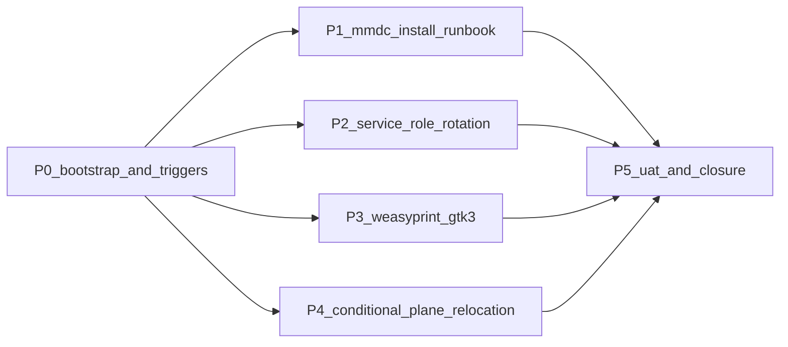

# Initiative 26 — Operations hardening (small ops items + persistent triggers)

**Folder:** `docs/wip/planning/26-hlk-ops-hardening/`
**Status:** **CLOSED for P0+P1+P2+P3+P5 (2026-04-29). P4 DEFERRED with persistent trigger contract.** Independent of I23/I24/I25; ran in parallel.
**Authoritative Cursor plan:** `~/.cursor/plans/hlk_scalability_wave_2_initiatives_639a02d7.plan.md` §"Initiative 26".

> **Closure note (2026-04-29)** — All in-scope phases shipped: P0 (initiative folder + 6 standard artifacts + 3 persistent re-eval-trigger templates for D-IH-14/15/18) and P1 (pinned `mmdc@^11` install runbook + Linux CI extras) landed in [PR #16](https://github.com/FraysaXII/openclaw-akos/pull/16); P2 (`service_role` quarterly rotation runbook in `SOP-HLK_GOIPOI` §6.1), P3 (WeasyPrint GTK3 Windows install runbook), P5 UAT, and closure note ship in this PR. **P4 (`compliance/<plane>/` physical relocation) is explicitly DEFERRED** per D-IH-26-E — the persistent template at [`reports/re-eval-trigger-compliance-plane-relocation.md`](reports/re-eval-trigger-compliance-plane-relocation.md) carries the trigger contract; I23-P6 KIR onboarding closed without surfacing the friction that would justify acting now. Verification: `validate_hlk.py` PASS, `validate_hlk_vault_links.py` PASS. Operator follow-ups (mmdc install, WeasyPrint GTK3 install, first quarterly rotation Q3 2026) tracked in [`reports/uat-i26-ops-hardening-20260429.md`](reports/uat-i26-ops-hardening-20260429.md). Cursor-rules-hygiene checkbox CONFIRMED.

## Outcome

Small ops items + persistent re-evaluation-trigger templates that capture the deferral contracts from Wave-2 decisions:

1. **Persistent re-eval-trigger templates** for D-IH-14 (FINOPS/TECHOPS second CSV), D-IH-15 (`compliance/<plane>/` physical relocation), D-IH-18 (Neo4j graph MCP tooling promotion). Mirrors the I22-P8 pattern.
2. **`mmdc` install runbook** (pinned `@mermaid-js/mermaid-cli@^11`) + Linux CI extras (`libgbm1`, `fonts-liberation`, `fonts-noto-color-emoji`, `--no-sandbox`).
3. **`service_role` quarterly rotation runbook** in `SOP-HLK_GOIPOI_REGISTER_MAINTENANCE_001.md` §6.
4. **WeasyPrint GTK3 install runbook** (Windows-specific) cross-linked to `requirements-export.txt`.
5. **Conditional `compliance/<plane>/` physical relocation** (D-IH-15 trigger gate) — DEFERRED until trigger fires.

## Asset classification (per [`PRECEDENCE.md`](../../../references/hlk/compliance/PRECEDENCE.md))

| Class | Paths | Rule |
|:------|:------|:-----|
| **New canonical (planning)** | `docs/wip/planning/26-hlk-ops-hardening/{master-roadmap,decision-log,asset-classification,evidence-matrix,risk-register}.md` | Standard six-artifact contract |
| **New canonical (re-eval triggers)** | `reports/re-eval-trigger-{finops-techops-second-csv,compliance-plane-relocation,graph-mcp-tooling-promotion}.md` | Persistent deferral contracts; keep until triggers fire |
| **Doc updates** | `CONTRIBUTING.md` mmdc section; `SOP-HLK_GOIPOI_REGISTER_MAINTENANCE_001.md` §6 service_role rotation; CONTRIBUTING WeasyPrint GTK3 section | Operator runbooks |
| **Conditional canonical (DEFERRED)** | `compliance/<plane>/` directory restructure — only when D-IH-15 trigger fires | Tracked in `reports/re-eval-trigger-compliance-plane-relocation.md` |
| **Reference-only** | Phase reports under `reports/` | Standard initiative artifact |

## Phase dependency

## Phase at a glance

| Phase | Purpose | Key deliverable | Status |
|:-----:|:--------|:----------------|:------:|
| **P0** | Bootstrap initiative + 6 artifacts + persistent re-eval-trigger templates | Folder + decision log (D-IH-14/15/18 references) + 3 trigger templates | IN PROGRESS |
| **P1** | `mmdc` install runbook (pinned + Linux CI) | CONTRIBUTING.md section | IN PROGRESS |
| **P2** | `service_role` quarterly rotation runbook | SOP-HLK_GOIPOI §6 procedure | PENDING |
| **P3** | WeasyPrint GTK3 install runbook (Windows) | CONTRIBUTING.md section | PENDING |
| **P4** | Conditional `compliance/<plane>/` relocation | DEFERRED — trigger not met (per persistent template) | DEFERRED |
| **P5** | UAT + closure | Verification matrix; dated UAT report; cursor-rules-hygiene checkbox | PENDING |

## Operator approval gates

| Gate | Phase | What it covers |
|:----:|:-----:|:---------------|
| **G-26-1** | P4 | Conditional `compliance/<plane>/` physical relocation IF trigger fires (DEFERRED at P0; revisited only when D-IH-15 trigger conditions surface) |

`baseline_organisation.csv` and `process_list.csv` are **not** expected to change in this initiative.

## Re-evaluation triggers (persistent, P0 deliverable)

| Decision | Template | Trigger condition |
|:---------|:---------|:------------------|
| **D-IH-14** | [`reports/re-eval-trigger-finops-techops-second-csv.md`](reports/re-eval-trigger-finops-techops-second-csv.md) | Third FINOPS use case beyond counterparty + ledger; OR TECHOPS adds a 2nd register beyond `COMPONENT_SERVICE_MATRIX.csv` |
| **D-IH-15** | [`reports/re-eval-trigger-compliance-plane-relocation.md`](reports/re-eval-trigger-compliance-plane-relocation.md) | Program 2 onboarded AND observed file-naming friction; OR a 2nd canonical CSV joins any existing plane |
| **D-IH-18** | [`reports/re-eval-trigger-graph-mcp-tooling-promotion.md`](reports/re-eval-trigger-graph-mcp-tooling-promotion.md) | Operator UAT shows actual reliance on `:Program` / `:Topic` graph traversal in agent answers; promote graph MCP tools from optional to mandatory in the agent ladder |

Each template captures: trigger description, evidence-required schema, operator-approval row, scope-of-work, post-action validation matrix, links back to PRECEDENCE / planning README.

## Verification matrix

- `py scripts/validate_hlk.py` (when SOPs change in §"P2")
- `py scripts/validate_hlk_vault_links.py` (after every vault MD edit)
- `where.exe mmdc` / `which mmdc` (operator slot in P1 runbook)
- `python -c "from weasyprint import HTML"` (operator slot in P3 runbook)
- `py scripts/release-gate.py` (P5 UAT)

## Out of scope (explicit)

- Anything in I23/I24/I25 — independent initiative.
- Force-push history rewrite (Initiative 21 D-CH-2 / Initiative 22 D-IH-6 — separate trigger contract in `re-eval-trigger.md` from I22).
- Promoting Neo4j graph from optional to mandatory in the agent ladder (D-IH-18 trigger; documented as P0 template; action deferred until trigger fires).

## Links

- [decision-log.md](decision-log.md)
- [asset-classification.md](asset-classification.md)
- [evidence-matrix.md](evidence-matrix.md)
- [risk-register.md](risk-register.md)
- Wave-2 plan: `~/.cursor/plans/hlk_scalability_wave_2_initiatives_639a02d7.plan.md` §"Initiative 26"
- I22 closure note: [`22-hlk-scalability-and-i21-closures/master-roadmap.md`](../22-hlk-scalability-and-i21-closures/master-roadmap.md)
- I23 closure note: [`23-hlk-program-registry-and-program-2/master-roadmap.md`](../23-hlk-program-registry-and-program-2/master-roadmap.md)
