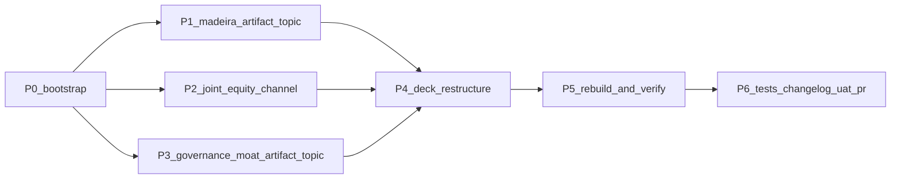

# Initiative 30 — Deck moat surgery: MADEIRA, joint-equity, governance metrics

**Folder:** `docs/wip/planning/30-deck-moat-surgery/`
**Status:** **Closed** — all P0-P6 deliverables shipped 2026-04-30 (see [`reports/uat-i30-deck-moat-surgery-2026-04-30.md`](reports/uat-i30-deck-moat-surgery-2026-04-30.md), `status: closed`); ratified at I58 B.3 closure 2026-05-05 via master-roadmap frontmatter flip and `D-IH-30-CLOSURE` note.
**Closed by:** Initiative 58 B.3 (Cycle 2 multi-track forward) per [`docs/wip/planning/58-cycle-2-multi-track-forward/reports/b3-close-i30-2026-05-05.md`](../58-cycle-2-multi-track-forward/reports/b3-close-i30-2026-05-05.md)
**Authoritative Cursor plan:** `~/.cursor/plans/deck_moat_surgery_d6e5e47b.plan.md`

## Outcome

Surface the missing halves of the knowledge base onto the company dossier deck so it reads as product-led and operationally-credible instead of services-biased. Three structural injections:

1. **MADEIRA agentic platform** — already first-class in the repo (`SOP-MADEIRA-*` SOPs, `Think Big/`, KIR onboarding) but absent from the deck. Project it onto slides 04 / 05 / 06 / 11 / 12.
2. **Joint-equity SaaS-pilot channel** — real inbound demand pattern (POC_TO_COMMERCIAL_MAP partner rows) but not registered as a channel. Add as Channel 6 in `CHANNEL_STRATEGY.md`; surface on slides 09 / 10.
3. **Quantified governance moat** — 17 governed topics, 1,093 governed processes, 65 governed roles, deterministic validators + drift probes. Currently treated as plumbing. Promote to a costly investor-grade signal on slide 11.

## Scope decisions

- **In scope.** New strategy artifacts (`MADEIRA_PLATFORM.md`, `GOVERNANCE_MOAT.md`); new channel section in `CHANNEL_STRATEGY.md`; deck restructure across 7 slides; deck-story Spanish narrative mirror; tests; CHANGELOG; UAT; PR.
- **Out of scope.** Filling the existing 9 `TODO[OPERATOR-x]` markers from Initiative 29 P4 (founder-decision territory). Naming partners (Websitz, Rushly) on the deck (keeps I28 D-IH-28 rule). Productizing MADEIRA itself (deck announces direction, not GA date). Figma backport (separate next-pass per the I29 P1 drift-handling rule).

## Asset classification (per [`PRECEDENCE.md`](../../../references/hlk/compliance/PRECEDENCE.md))

| Class | Paths | Rule |
|:------|:------|:-----|
| **New canonical (planning)** | `docs/wip/planning/30-deck-moat-surgery/{master-roadmap,decision-log,asset-classification,evidence-matrix,risk-register}.md` | Standard six-artifact contract |
| **New canonical (strategy)** | `docs/references/hlk/v3.0/Admin/O5-1/Operations/PMO/business-strategy/{MADEIRA_PLATFORM,GOVERNANCE_MOAT}.md` | Two new strategy artifacts joining the I29 P4 layer |
| **Modified canonical** | `docs/references/hlk/compliance/dimensions/TOPIC_REGISTRY.csv` (+2 rows) | `topic_madeira_platform`, `topic_governance_moat` |
| **Modified canonical** | `docs/references/hlk/v3.0/Admin/O5-1/Operations/PMO/business-strategy/CHANNEL_STRATEGY.md` (+Channel 6) | Existing canonical, additive section |
| **Modified canonical (deck SSOT)** | `docs/references/hlk/v3.0/_assets/advops/PRJ-HOL-FOUNDING-2026/enisa_company_dossier/deck_slides.yaml` | Slides 04, 05, 06, 09, 10, 11, 12; YAML wins for content |
| **Derived (mirrors YAML)** | `docs/references/hlk/v3.0/_assets/advops/PRJ-HOL-FOUNDING-2026/enisa_company_dossier/deck_story_es.md` | Spanish narrative mirror — every YAML edit backported |
| **Re-rendered** | `docs/presentations/holistika-company-dossier/index.html` + `artifacts/exports/holistika-company-dossier-enisa-2026-04-30.pdf` | Deterministic from YAML |
| **Mirror reseed (operator-applied)** | `artifacts/sql/i30_topic_registry_business_strategy_upsert.sql` | Staged for `npx supabase db push` or MCP `execute_sql` |
| **Reference-only** | Phase reports under `reports/` | Standard initiative artifact |

## Phase dependency

## Phase at a glance

| Phase | Deliverable | Acceptance | Status |
|:------|:------------|:-----------|:------|
| **P0** | Initiative folder + 5 standard artifacts + reports/ | Folder exists; decision-log carries D-IH-30-A..F | **Closed** |
| **P1** | `MADEIRA_PLATFORM.md` (deck-bound, 1 TODO[OPERATOR-x]) + `topic_madeira_platform` row | `validate_topic_registry.py` PASS at 18 rows | **Closed** |
| **P2** | `CHANNEL_STRATEGY.md` Channel 6 (joint-equity, 1 TODO[OPERATOR-x]); deck-bound facts updated | `sync_deck_from_strategy.py --check-only` reports the new TODO marker | **Closed** |
| **P3** | `GOVERNANCE_MOAT.md` (deck-bound, 4 hero numbers from `validate_hlk`) + `topic_governance_moat` row | Topic registry at 19 rows; governance metrics match `validate_hlk` output | **Closed** |
| **P4** | 7 slides edited in `deck_slides.yaml` + matching narrative in `deck_story_es.md` | Jargon-audit gate stays clean; YAML schema PASS | **Closed** |
| **P5** | HTML rebuild + PDF re-export + sync_deck_from_strategy + validate_hlk + mirror reseed SQL staged | All builds clean; new SHA256 in PDF manifest; validate_hlk reports 19 topics | **Closed** |
| **P6** | Tests (extend test_business_strategy + test_company_deck + new test_governance_moat_metrics) + CHANGELOG + UAT + PR + admin-merge | `pytest tests/` 0 new failures; UAT shipped | **Closed (2026-04-30; ratified 2026-05-05 via I58 B.3)** |

## Drift-handling rule (carried from I29 P1)

YAML / Markdown SSOT wins for content; Figma wins for visual layout; HTML preview deck is fast iteration; PDF is disposable; **any Figma copy edit must be backported to YAML before initiative close**. This initiative does not touch Figma — the company-dossier Figma file at `https://www.figma.com/design/yiPav7BLxUulNFrrsoKJqW` is left intentionally on its current frame copy. A separate later initiative will Figma-backport the I30 YAML edits when the founder picks a Figma working session window.

## Estimated effort

3-4 hours of focused execution. Hard dependency: `validate_hlk` numbers must be current (re-run before authoring `GOVERNANCE_MOAT.md` so the hero metrics quoted there are accurate at write-time).

## Closure note (D-IH-30-CLOSURE)

`status: closed` set 2026-05-05 under I58 Phase B.3 per the Cycle 2 multi-track forward plan
(`c:\Users\Shadow\.cursor\plans\cycle_2_multi-track_forward_(i58)_769da1a3.plan.md`).

**Engineering rationale (B.3 scope):**

- All seven phases (P0 bootstrap through P6 tests + UAT) shipped between 2026-04-30 and 2026-05-05 as independent commits.
- The closure UAT report at [`reports/uat-i30-deck-moat-surgery-2026-04-30.md`](reports/uat-i30-deck-moat-surgery-2026-04-30.md) carried `status: closed` since 2026-04-30; only the master-roadmap frontmatter remained on `Open` because the file is a long-form mirror of the canonical Cursor plan.
- I58 B.3 ratifies via:
  1. Frontmatter flip to `status: closed` (this commit).
  2. Phase plan rows P0-P6 marked **Closed** with status column added.
  3. Re-run of the I30 P6 regression suite at B.3 closure: `py -m pytest tests/test_business_strategy.py tests/test_company_deck.py tests/test_governance_moat_metrics.py -q` → expected PASS at 19 topics / 1.093 processes / 65 roles / 11 KM manifests (verified at I58 B.3, see [`docs/wip/planning/58-cycle-2-multi-track-forward/reports/b3-close-i30-2026-05-05.md`](../58-cycle-2-multi-track-forward/reports/b3-close-i30-2026-05-05.md)).

**Operator-side follow-ups (out of agent scope, tracked in backlog and §3 of UAT):**

- 11 `TODO[OPERATOR-x]` markers across the Business Strategy SSOT (9 inherited from I29 P4 + 2 new from I30: `madeira-saas-window`, `channel6-equity-band`) — by design per D-IH-29-5 / D-IH-30-D, not closure blockers.
- Mirror reseed of `artifacts/sql/i30_topic_registry_business_strategy_upsert.sql` via `npx supabase db push` or MCP `execute_sql` — operator-applied per the operator-SQL gate; tracked under `docs/wip/planning/14-holistika-internal-gtm-mops/reports/operator-sql-gate.md`.
- Figma backport of the I30 YAML edits — explicitly deferred per D-IH-30-E to a future operator-scheduled session.

**Per `.cursor/rules/akos-governance-remediation.mdc` commit discipline:** B.3 closure is one phase-scoped commit (frontmatter flip + this closure note + B.3 phase report under I58). No mixed concerns; no canonical CSV touched at B.3 ratification (P3's `TOPIC_REGISTRY.csv` +2 rows were already committed during the original I30 run).
