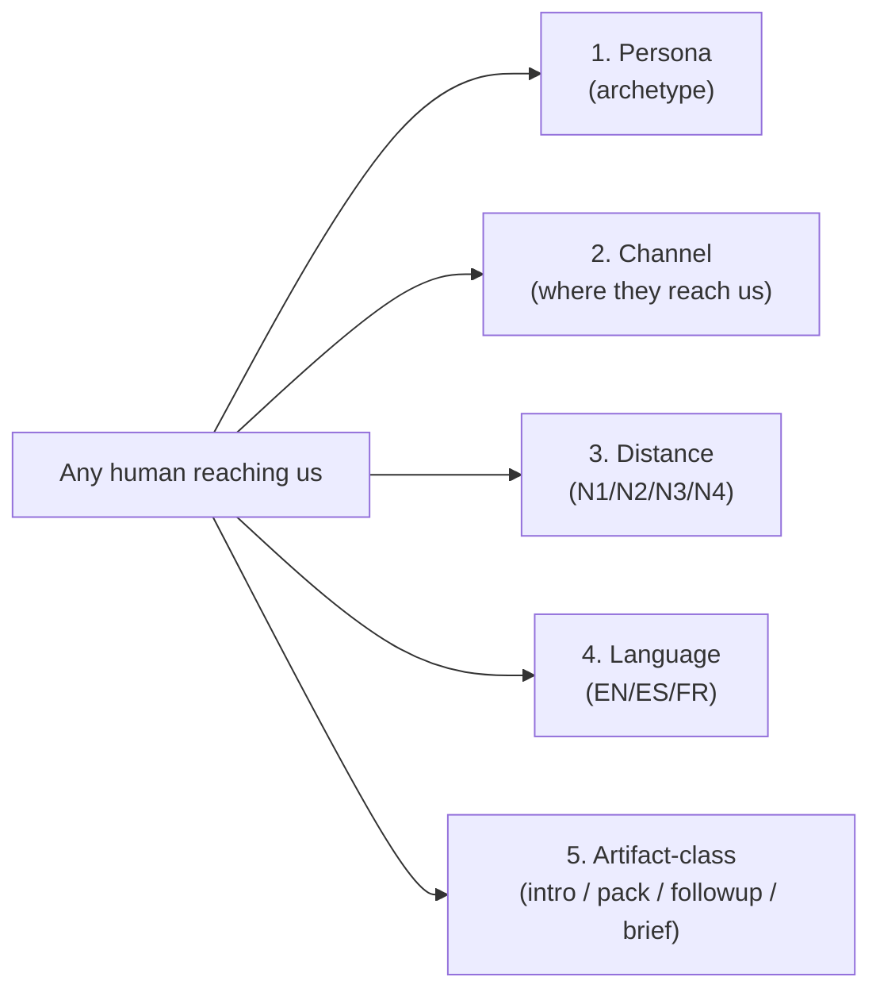
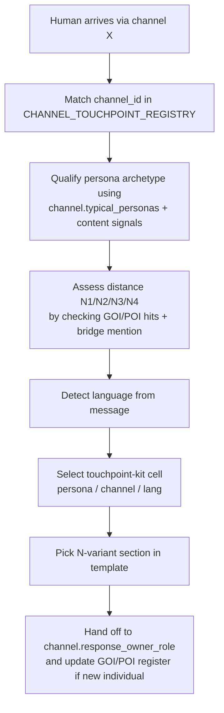

# Initiative 31 — Discovery taxonomy: the 5-axis Holistik Ops operating system

This document is the **input** to the registers in P2/P3/P5 and the **conceptual source** for the meta-doc in P6 (`HOLISTIK_OPS_DISCOVERY.md`).

## The 5 axes

Each axis is a governed surface:

| Axis | Surface | Where it lives | Cardinality (today) |
|:-----|:--------|:---------------|:--------------------|
| **Persona** | `PERSONA_REGISTRY.csv` | `docs/references/hlk/compliance/dimensions/` | ~16 archetypes |
| **Channel** | `CHANNEL_TOUCHPOINT_REGISTRY.csv` | Same | ~10 touchpoints |
| **Distance** | `distance_band` column on `GOI_POI_REGISTER.csv` (named individuals) + `typical_distance_band` on `PERSONA_REGISTRY.csv` (archetype expectation) | `docs/references/hlk/compliance/` and `dimensions/` | 4 bands (N1, N2, N3, N4) |
| **Language** | `language:` frontmatter on every canonical Markdown + `BRAND_*_PATTERNS.md` rule files | Distributed (every MD) + brand SSOT | 3 codes today (en, es, fr-stub) |
| **Artifact-class** | `intellectual_kind` frontmatter field (existing) + the touchpoint-kit folder convention (new) | Distributed | 8-12 classes (intro_message, intro_pack, followup, brief, dossier, deck, sop, runbook, etc.) |

## The 16-persona seed list

| persona_id | direction | typical_distance_band | typical_languages | value_band |
|:-----------|:----------|:----------------------|:------------------|:-----------|
| `PERSONA-INVESTOR-COLD` | inbound | N3-N4 | en;es | depends_on_qualification |
| `PERSONA-INVESTOR-WARM` | inbound | N1-N2 | en;es | high |
| `PERSONA-ADVISOR-REFERRAL` | inbound | N1-N2 | es | high |
| `PERSONA-ADVISOR-COLD` | inbound | N3-N4 | en;es | low |
| `PERSONA-TALENT-INBOUND` | inbound | N3-N4 | any | depends_on_qualification |
| `PERSONA-VENDOR-OUTBOUND` | outbound | N1-N4 | any | high (when N1) / low (when N4) |
| `PERSONA-VENDOR-INBOUND` | inbound | N3-N4 | any | low |
| `PERSONA-PRESS` | inbound | N2-N4 | en;es | medium |
| `PERSONA-CUSTOMER-KIRBE-PROSPECT` | inbound | N3-N4 | es;en | high |
| `PERSONA-CUSTOMER-SERVICE-PROSPECT` | inbound | N1-N3 | es | high |
| `PERSONA-PARTNER-JOINT-EQUITY` | inbound | N2-N3 | es;en | high |
| `PERSONA-PARTNER-SUBCONTRACT` | inbound | N1-N2 | es;en | medium |
| `PERSONA-IDEA-PROPOSER` | inbound | N1-N2 | any | depends_on_qualification |
| `PERSONA-RANDOM-INBOUND` | inbound | N4 | any | low |
| `PERSONA-EXISTING-CUSTOMER` | bidirectional | N1 | matches engagement | high |
| `PERSONA-EXISTING-PARTNER` | bidirectional | N1 | matches engagement | high |

## The 10-channel seed list

| channel_id | direction | supported_languages | typical_distance_band_inbound |
|:-----------|:----------|:--------------------|:------------------------------|
| `CHAN-LINKEDIN-DM` | bidirectional | en;es;fr | N4 (cold dominant; N3 occasional) |
| `CHAN-LINKEDIN-POST-RESPONSE` | inbound | en;es;fr | N3-N4 |
| `CHAN-EMAIL-INBOUND` | inbound | en;es;fr | N1-N4 (full range; depends on persona) |
| `CHAN-WEB-FORM` | inbound | en;es;fr | N4 (cold by definition) |
| `CHAN-CAL-SCHEDULE` | inbound | en;es;fr | N1 (link is shared deliberately) |
| `CHAN-AD-CAMPAIGN` | inbound | en;es;fr | N4 |
| `CHAN-SEARCH-ORGANIC` | inbound | en;es;fr | N4 |
| `CHAN-DIRECT-DM` | bidirectional | en;es;fr | N1-N2 (WhatsApp / SMS / personal email) |
| `CHAN-PARTNER-REFERRAL` | inbound | en;es;fr | N2 (one bridge by definition) |
| `CHAN-EVENT-MEETING` | bidirectional | en;es;fr | N1-N3 |

## The 8 highest-leverage touchpoint-kit cells

The seed pass for P4 covers the founder's most-used routes. Each cell ships with `intro_message_<lang>.md` carrying 2-3 distance-variant sections.

| Persona × Channel | Languages | Distance variants in template |
|:------------------|:----------|:------------------------------|
| `PERSONA-INVESTOR-COLD` × `CHAN-LINKEDIN-DM` | en + es | N3, N4 |
| `PERSONA-INVESTOR-WARM` × `CHAN-EMAIL-INBOUND` | en + es | N1, N2 |
| `PERSONA-ADVISOR-REFERRAL` × `CHAN-EMAIL-INBOUND` | es | N1, N2 |
| `PERSONA-PARTNER-JOINT-EQUITY` × `CHAN-EMAIL-INBOUND` | es + en | N2, N3 |
| `PERSONA-TALENT-INBOUND` × `CHAN-WEB-FORM` | en + es | N4 |
| `PERSONA-VENDOR-OUTBOUND` × `CHAN-DIRECT-DM` | en + es | N1, N3, N4 |
| `PERSONA-CUSTOMER-KIRBE-PROSPECT` × `CHAN-WEB-FORM` | es + en | N4 |
| `PERSONA-IDEA-PROPOSER` × `CHAN-DIRECT-DM` | es + en | N1, N2 |

## Cross-axis routing flow

## What this taxonomy enables

- The founder can ask "show me all my N1 investor contacts in EN" and get an answerable query against the canonicals.
- A new persona / channel / language can be added by inserting a row in the matching CSV — no code change, no template rewrite.
- A descale (dropping a channel, retiring a persona, demoting a vendor from N1 to N4) is a single CSV edit. The validator catches orphan FKs immediately.
- The HOLISTIK_OPS_DISCOVERY.md meta-doc in P6 will reference this taxonomy as its origin.
