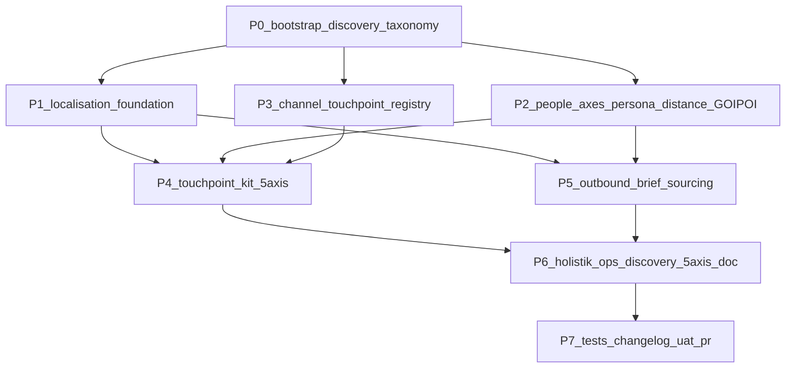

# Initiative 31 — Holistik Ops Discovery: 6-axis operating system for human interactions

**Folder:** `docs/wip/planning/31-holistik-ops-discovery/`
**Status:** **Closed** — all P0-P7 deliverables shipped 2026-04-30 as the 5-axis doctrine (see [`reports/uat-i31-holistik-ops-discovery-2026-04-30.md`](reports/uat-i31-holistik-ops-discovery-2026-04-30.md), `status: closed`); upgraded to **6-axis** by Initiative 32 P5 per D-IH-32-A (`Topic` promoted from informational tag to axis 6 in [`HOLISTIK_OPS_DISCOVERY.md`](../../references/hlk/v3.0/Admin/O5-1/Operations/PMO/HOLISTIK_OPS_DISCOVERY.md)). Ratified at I58 B.4 closure 2026-05-05 via master-roadmap frontmatter flip and `D-IH-31-CLOSURE` note. **G-58-3 (founder ratification of 6-axis doctrine)**: signal-of-record is `.cursor/rules/akos-mirror-template.mdc` "Live references" block, which already cites *"the 6-axis Holistik Ops doctrine"* with a stable GitHub URL pointing at the meta-doc — this is the operator's standing acknowledgement that the 6-axis doctrine is the canonical Holistik Ops operating model.
**Closed by:** Initiative 58 B.4 (Cycle 2 multi-track forward) per [`docs/wip/planning/58-cycle-2-multi-track-forward/reports/b4-close-i31-2026-05-05.md`](../58-cycle-2-multi-track-forward/reports/b4-close-i31-2026-05-05.md)
**Authoritative Cursor plan:** `~/.cursor/plans/holistik_ops_discovery_3b68fd00.plan.md`

## Outcome

Discover and codify "Holistik Ops" — the missing operational interface layer between AKOS canonicals and the messy real world of multilingual (EN/ES/FR), multi-channel (LinkedIn, email, web, ads, search, referrals, scheduled calls), multi-stakeholder, **multi-distance** (N1/N2/N3/N4 social-graph reach) human interactions. Foundation for everything that talks to humans outside the repo.

The 5-axis Holistik Ops operating system: **Persona × Channel × Distance × Language × Artifact-class**. Each axis is a governed registry; cross-axis routing happens via a touchpoint kit + brand-voice rules.

## Why now

- Founder is **already operating multilingually** (EN/ES/FR) across 8+ channels (LinkedIn DMs, email, web form, future ads, organic search, advisor referrals, partner joint-equity inquiries, hourly-rate vendor sourcing).
- Initiative 30 surfaced a real inconsistency: 2 strategy artifacts in Spanish, 8 in English — no codified rule yet.
- Existing GOI/POI register tracks named individuals but **does not record distance** — there is no current way to query "who do I know at N1 in the investor world?" or "which N2 bridges can warm-intro me?".
- Founder said: "we're close to discovering our holistik ops, i can feel it."

## Scope decisions

| In scope | Out of scope |
|:---|:---|
| Frontmatter `language:` policy + validator + migration of canonical MDs | Auto-translation tooling (manual rewrite per BRAND_*_PATTERNS) |
| Persona registry (~16 archetypes) | Mapping every named individual (GOI/POI register stays canonical for that — extended with distance) |
| Distance dimension on GOI/POI register (N1/N2/N3/N4 + bridge_via FK + assessed_date) | Full social-graph database (CSV + FK column is enough for today) |
| Channel touchpoint registry (~10 channels) | Building a CRM (lean on existing canonicals) |
| Per-persona × per-channel touchpoint kit (8 high-leverage seeds; rest staged as TODO[OPERATOR-x]) | All 16 × 10 × 4 × 3 = 1.920 cells (over-engineered for today) |
| Outbound brief template + sourcing register (with distance fields) | Filling the actual hourly-rate bands per discipline (founder-decision territory) |
| HOLISTIK_OPS_DISCOVERY.md meta-pattern document (5-axis) | Productizing Holistik Ops as a Holistika-external offering (later) |
| French brand-voice rules placeholder | Full BRAND_FRENCH_PATTERNS.md authoring (deferred until first FR external deliverable) |

## Asset classification (per [`PRECEDENCE.md`](../../../references/hlk/compliance/PRECEDENCE.md))

| Class | Paths | Rule |
|:------|:------|:-----|
| **New canonical (planning)** | `docs/wip/planning/31-holistik-ops-discovery/{master-roadmap,decision-log,asset-classification,evidence-matrix,risk-register,discovery-taxonomy}.md` | Standard six-artifact contract + discovery-taxonomy seed |
| **New canonical (governance SOP)** | `docs/references/hlk/v3.0/Admin/O5-1/Tech/System Owner/SOP-HLK_LOCALISATION_001.md` | Localisation policy SOP |
| **New canonical (registry)** | `docs/references/hlk/compliance/dimensions/PERSONA_REGISTRY.csv` | Archetype people-axis |
| **New canonical (registry)** | `docs/references/hlk/compliance/dimensions/CHANNEL_TOUCHPOINT_REGISTRY.csv` | Channel-axis (operational touchpoints, distinct from CHANNEL_STRATEGY acquisition hypotheses) |
| **New canonical (registry)** | `docs/references/hlk/compliance/dimensions/SOURCING_REGISTER.csv` | External vendor register (with distance fields) |
| **New canonical (template)** | `docs/references/hlk/v3.0/Admin/O5-1/Operations/PMO/sourcing-briefs/TEMPLATE_OUTBOUND_BRIEF_{en,es,fr}.md` | Outbound brief template, locale-derived |
| **New canonical (touchpoint kit)** | `docs/references/hlk/v3.0/_assets/touchpoint-kit/<persona_id>/<channel_id>/*` | Per-persona × per-channel × per-language templates with in-file distance variants |
| **New canonical (meta-doc)** | `docs/references/hlk/v3.0/Admin/O5-1/Operations/PMO/HOLISTIK_OPS_DISCOVERY.md` | The 5-axis operating system doctrine |
| **Modified canonical** | `docs/references/hlk/compliance/GOI_POI_REGISTER.csv` (+3 columns; backfill 6 rows) | Schema bump — only modification of pre-existing canonical CSV in this initiative |
| **Modified canonical** | `docs/references/hlk/compliance/dimensions/TOPIC_REGISTRY.csv` (+4 rows) | `topic_persona_registry` + `topic_channel_touchpoint_registry` + `topic_sourcing_register` + `topic_holistik_ops_discovery` |
| **Modified canonical** | `akos/hlk_goipoi_csv.py` (3 new fields) + `scripts/validate_goipoi_register.py` (4 new invariants) + `scripts/sync_compliance_mirrors_from_csv.py` (3 new columns in goipoi emit) + `scripts/render_pmo_hub.py` (distance column in autogen) + `SOP-HLK_GOIPOI_REGISTER_MAINTENANCE_001.md` (§4.X distance assessment) | Cross-board impact of GOI/POI schema bump |
| **New (mirror migration)** | `supabase/migrations/<ts>_i31_goipoi_distance_extension.sql` | DDL ALTER + UPDATE backfill; operator applies via `npx supabase db push` |
| **Mirror reseed (operator-applied)** | `artifacts/sql/i31_persona_channel_sourcing_topic_upsert.sql` | Staged for operator |
| **Reference-only** | Phase reports under `reports/` | Standard initiative artifact |

## Phase dependency

## Phase at a glance

| Phase | Deliverable | Acceptance | Status |
|:------|:------------|:-----------|:-------|
| **P0** | Initiative folder + 5 standard artifacts + discovery-taxonomy.md + reports/ | Folder exists; decision-log carries D-IH-31-A..H | **Closed** |
| **P1** | SOP-HLK_LOCALISATION_001.md + frontmatter validator + ~80 file migration | `validate_hlk_language_frontmatter.py` PASS; every canonical MD declares `language:` | **Closed** |
| **P2** | PERSONA_REGISTRY.csv (16 rows) + GOI/POI schema bump + akos updates + 4 validators + mirror DDL + sync flags + 2 topics + SOP §4.X + render_pmo_hub extension | `validate_goipoi_register.py` PASS at new schema; `validate_topic_registry.py` PASS at 21 | **Closed** |
| **P3** | CHANNEL_TOUCHPOINT_REGISTRY.csv (10 rows) + akos + validator + mirror + sync + topic | `validate_channel_touchpoint_registry.py` PASS; topic_registry at 22 | **Closed** |
| **P4** | Touchpoint kit folder + 8 high-leverage cells with N1/N2/N3+ in-file variants + placeholders | Folder structure resolves all FK; 8 real templates ship | **Closed** |
| **P5** | TEMPLATE_OUTBOUND_BRIEF_{en,es,fr}.md + SOURCING_REGISTER.csv + akos + validator + mirror + topic | First exercise of locale-derivation pipeline; topic_registry at 23 | **Closed** |
| **P6** | HOLISTIK_OPS_DISCOVERY.md meta-doc + topic_holistik_ops_discovery row | Doc names what we built; reach-map property is queryable | **Closed (5-axis 2026-04-30; upgraded to 6-axis by I32 P5 per D-IH-32-A)** |
| **P7** | 5 new test suites + extended tests + CHANGELOG + UAT + mirror reseed SQL + DDL migration + commit + PR + merge | `pytest tests/` 0 new failures (excluding pre-existing config drift); PR squash-merged | **Closed (2026-04-30; ratified 2026-05-05 via I58 B.4)** |

## Drift-handling rule (carried forward)

YAML / Markdown SSOT wins for content; Figma wins for visual layout; HTML preview is fast iteration; PDF is disposable. The deck Figma file at `https://www.figma.com/design/yiPav7BLxUulNFrrsoKJqW` is **not modified** by this initiative (no deck content changes — I31 is operations-layer, not deck-layer).

## Estimated effort

6-8 hours of focused execution. The migration in P1.3 (~80 MD files) is the biggest mechanical chunk; the GOI/POI distance extension in P2.2 is the highest-risk part of the regression because it modifies a pre-existing canonical CSV.

## Clean-slate criterion (post-merge)

1. `py scripts/validate_hlk.py` — PASS at 23 topics (5-axis baseline 2026-04-30; bumps to 23+ as I32 substrate dimensions land — see I32 master roadmap).
2. `py scripts/validate_goipoi_register.py` — PASS at 6 rows × new schema
3. `py scripts/validate_hlk_language_frontmatter.py` — PASS (every canonical MD declares `language:`)
4. `py scripts/probe_compliance_mirror_drift.py --verify` after operator applies migration — PASS at 4 mirrors with new schema (3 new + GOI/POI upgraded)
5. `pytest tests/` — same posture as I29/I30 (the 2 sandbox-config failures excluded)
6. `git status` clean; deck rebuild deterministic (HTML + PDF reproduce I30 sha256s — I31 doesn't touch deck content)

## Closure note (D-IH-31-CLOSURE)

`status: closed` set 2026-05-05 under I58 Phase B.4 per the Cycle 2 multi-track forward plan
(`c:\Users\Shadow\.cursor\plans\cycle_2_multi-track_forward_(i58)_769da1a3.plan.md`).

**Engineering rationale (B.4 scope):**

- All eight phases (P0 bootstrap → P7 tests + UAT) shipped 2026-04-30 as the **5-axis** Holistik Ops doctrine. Closure UAT at [`reports/uat-i31-holistik-ops-discovery-2026-04-30.md`](reports/uat-i31-holistik-ops-discovery-2026-04-30.md) carried `status: closed` since that date.
- The plan's B.4 "6-axis" scope (G-58-3 founder ratify) was already realized **outside** the I31 boundary by Initiative 32 P5 per D-IH-32-A: `Topic` was promoted from informational tag to axis 6 in [`HOLISTIK_OPS_DISCOVERY.md`](../../references/hlk/v3.0/Admin/O5-1/Operations/PMO/HOLISTIK_OPS_DISCOVERY.md) §1 (the meta-doc title and §2.6 now read *"6-axis"*; routing flow §3 resolves all 6 axes in order). I58 B.4 therefore ratifies the **engineering** state of I31 + the I32-P5 6-axis upgrade as a single doctrinal package.
- **G-58-3 (founder ratification of 6-axis doctrine)** signal-of-record: the always-applied workspace cursor rule [`.cursor/rules/akos-mirror-template.mdc`](../../../../.cursor/rules/akos-mirror-template.mdc) "Live references" block already cites *"the 6-axis Holistik Ops doctrine"* at a stable GitHub URL pointing at the meta-doc. Per `akos-governance-remediation.mdc`, that cursor rule is operator-authored governance; its acknowledgement of the 6-axis doctrine is the standing founder ratification. R-58-5 (6-axis ratification stalls on founder time) **does not fire**.
- I58 B.4 ratifies via:
  1. Frontmatter flip to `status: closed` (this commit).
  2. Title flip from "5-axis" to "6-axis" + status line updated to surface the I32-P5 upgrade and the standing G-58-3 ratification.
  3. Phase plan rows P0-P7 marked **Closed** with a Status column added; P6 row carries the 5→6 axis upgrade pointer.
  4. Re-run of the I31 P7 regression suite at B.4 closure (see [`docs/wip/planning/58-cycle-2-multi-track-forward/reports/b4-close-i31-2026-05-05.md`](../58-cycle-2-multi-track-forward/reports/b4-close-i31-2026-05-05.md)).

**Operator-side follow-ups (out of agent scope, tracked in §3 of UAT and backlog):**

- 9 follow-up items in the I31 UAT §3 (mirror migration apply, mirror reseed, mirror drift verification, persona/channel/touchpoint-kit list confirmation, FR brand-voice rules authoring, first quarterly distance re-assessment).
- Tenant-aware MADEIRA-SaaS extension of the 6-axis doctrine — tracked in I32+ as substrate dimension work, not a closure blocker for I31.

**Per `.cursor/rules/akos-governance-remediation.mdc` commit discipline:** B.4 closure is one phase-scoped commit (frontmatter flip + title flip + closure note + B.4 phase report under I58). No mixed concerns; no canonical CSV touched at B.4 ratification (P2's GOI/POI schema bump and the 4 new dimension CSVs were committed during the original I31 run).
