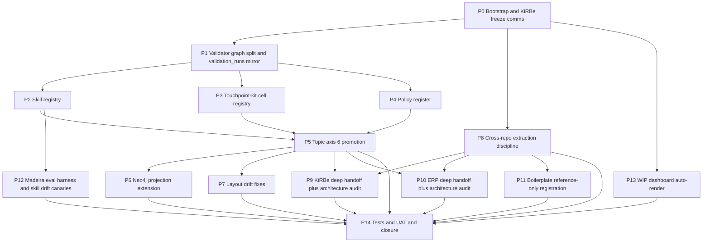

# Initiative 32 — Holistik Ops Maturation: 15-phase production-readiness pass

**Folder:** `docs/wip/planning/32-holistik-ops-maturation/`
**Status:** Open (started 2026-04-30)
**Authoritative Cursor plan:** `~/.cursor/plans/i32_holistik_ops_maturation_a5099ce7.plan.md`
**Predecessor:** [Initiative 31](../31-holistik-ops-discovery/master-roadmap.md) (Holistik Ops Discovery — 5-axis system).

## Outcome

Mature the 5-axis Holistik Ops doctrine into a production-ready, multi-tenant, multiagentic skill-based platform. Closes 6 artifact gaps (skill registry, touchpoint-kit cell registry, policy register, validator graph dispatcher, repo health snapshot mirror, WIP dashboard), promotes Topic to axis 6, fixes 2 layout drifts (GOI/POI move, localisation SOP move), extends the Neo4j projection to 6 new node labels, ships dated handoff bundles + architecture audits to KiRBe and ERP teams, and registers `boilerplate` as `repo_class=reference`.

Three audiences, one governed substrate: founder + PMO loop, KiRBe team, ERP team.

## Why now

- I31 codified the 5-axis system but left 4 mirrors unapplied (persona, channel, sourcing, GOI/POI distance schema).
- KiRBe is `v1.2` production (audit logging, hybrid search, Stripe billing); the current `kirbe-sync-contract.md` §2 enumerates 3 mirrors, the canonical set is 12. Stale.
- HLK-ERP carries a `data-ssot.mdc` cursor rule that says "centralize in lib/*" — directly contradicts AKOS PRECEDENCE.md.
- Neo4j projection is one initiative behind on dimensions; will be 4 behind once I32 ships if not extended.
- MADEIRA-Cursor pattern is partially deployed across external repos (rules exist, no AKOS doctrine cross-reference). EXTERNAL_REPO_CONTRACT seed closes this without rewriting either rulepack.

Operator framing (2026-04-30): "are we missing dimensions, mirrors, governance? what's our data-governance topology? can we go to prod with the ERP? what about Madeira bloat?"

## Scope decisions

| In scope | Out of scope |
|:---|:---|
| Validator graph split + `compliance.validation_runs` mirror | ERP prod-readiness (Initiative 33) |
| 3 new canonical dimensions: Skill, Touchpoint-kit cell, Policy | MADEIRA SaaS productisation window (founder territory) |
| Topic promoted to axis 6 with FK propagation across 5 dimensions | French brand-voice authoring (D-IH-31-D trigger not met) |
| Neo4j projection extension (6 new node labels, 6+ edge types, live sync mandatory per D-IH-32-Q) | KiRBe / ERP / Boilerplate **code** edits (we ship contract templates + cover-email drafts; teams merge) |
| Layout drift fixes (GOI/POI to dimensions, localisation SOP to Brand) | Touchpoint-kit physical relocation (Initiative 35) |
| Cross-repo extraction discipline (EXTERNAL_REPO_CONTRACT + akos-mirror.mdc + REPO_HEALTH_SNAPSHOT mirror) | Cross-repo CI integration (Initiative 42) |
| KiRBe handoff: §2 rewrite + 6-section memo + architecture audit + bilingual cover-emails | Boilerplate's embedded Obsidian snapshot retirement (Initiative 43) |
| ERP handoff bundle (6 artifacts) + architecture audit + Q10 supersession recommendation | Sensitivity / visibility 8th axis (Initiative 37) |
| Boilerplate registered as `class=reference` (light-touch) | KiRBe's local Neo4j merge with AKOS Neo4j (D-IH-32-M: stays separate) |
| Madeira eval harness per-skill + 5 drift canaries | Hosting boilerplate's CRM/ERP Supabase schemas |
| WIP dashboard auto-render | Initiative 27 process_list.csv per-plane re-architecture |

## Asset classification (per [`PRECEDENCE.md`](../../../references/hlk/compliance/PRECEDENCE.md))

| Class | Paths | Rule |
|:------|:------|:-----|
| **New canonical (planning)** | `docs/wip/planning/32-holistik-ops-maturation/{master-roadmap,decision-log,asset-classification,evidence-matrix,risk-register}.md` + `reports/` | Standard six-artifact contract |
| **New canonical (registry)** | `docs/references/hlk/compliance/dimensions/SKILL_REGISTRY.csv` (P2) | 7th canonical dimension |
| **New canonical (registry)** | `docs/references/hlk/compliance/dimensions/TOUCHPOINT_KIT_CELL_REGISTRY.csv` (P3) | Makes touchpoint-kit queryable |
| **New canonical (registry)** | `docs/references/hlk/compliance/dimensions/POLICY_REGISTER.csv` (P4) | RLS + service_role rotation + redaction policies |
| **New canonical (snapshot)** | `docs/references/hlk/compliance/REPO_HEALTH_SNAPSHOT.csv` (P8) | Pull-based external-repo state ingestion |
| **New canonical (template)** | `docs/references/hlk/v3.0/Envoy Tech Lab/Repositories/EXTERNAL_REPO_CONTRACT_TEMPLATE.md` (P8) | Cross-repo discipline seed |
| **New canonical (template)** | `.cursor/rules/akos-mirror-template.mdc` (P8) | Cursor rule template for external repos |
| **Modified canonical** | [`scripts/validate_hlk.py`](../../../../scripts/validate_hlk.py) refactored to dispatcher + per-validator graph (P1) | Backward-compatible CLI; structured JSON report |
| **Modified canonical** | [`HOLISTIK_OPS_DISCOVERY.md`](../../../references/hlk/v3.0/Admin/O5-1/Operations/PMO/HOLISTIK_OPS_DISCOVERY.md) extended to 6 axes (P5) | Axis 6 promotion |
| **Modified canonical** | 5 dimension CSVs (PERSONA, CHANNEL, SOURCING, SKILL, TOUCHPOINT_KIT_CELL) gain `topic_ids` column (P5) | Axis 6 propagation |
| **Modified canonical** | [`config/sync/kirbe-sync-contract.md`](../../../../config/sync/kirbe-sync-contract.md) §2 rewrite (P9) | All 12 mirrors enumerated |
| **Modified canonical** | [`scripts/sync_hlk_neo4j.py`](../../../../scripts/sync_hlk_neo4j.py) + `akos/hlk_graph_model.py` extended (P6) | 6 new node labels + 6+ edge types |
| **Moved canonical** | `GOI_POI_REGISTER.csv` from `compliance/` to `compliance/dimensions/` (P7) | Layout convention |
| **Moved canonical** | `SOP-HLK_LOCALISATION_001.md` from `Tech/System Owner/` to `Marketing/Brand/` (P7) | Role ownership |
| **Modified canonical** | [`TOPIC_REGISTRY.csv`](../../../references/hlk/compliance/dimensions/TOPIC_REGISTRY.csv) +4 rows | topic_skill_registry, topic_touchpoint_kit_cell_registry, topic_policy_register, topic_repo_health_snapshot |
| **Modified canonical** | [`REPOSITORIES_REGISTRY.md`](../../../references/hlk/v3.0/Envoy%20Tech%20Lab/Repositories/REPOSITORIES_REGISTRY.md) +1 row (P11) | `boilerplate` as `class=reference` |
| **New (mirror DDL)** | `supabase/migrations/<ts>_i32_validation_runs.sql`, `<ts>_i32_skill_registry_mirror.sql`, `<ts>_i32_touchpoint_kit_cell_mirror.sql`, `<ts>_i32_policy_register_mirror.sql`, `<ts>_i32_repo_health_snapshot_mirror.sql` | Operator applies via `npx supabase db push` after PR squash-merge |
| **Mirror reseed (operator-applied)** | `artifacts/sql/i32_skill_touchpoint_policy_topic_repohealth_upsert.sql` | Staged for operator |
| **Reference-only** | I32 phase reports under `reports/` | Standard initiative artifact |

## Phase dependency

## Phase at a glance

| Phase | Deliverable | Acceptance |
|:------|:------------|:-----------|
| **P0** | 5 standard artifacts + KiRBe freeze memo + planning README row + R-32-2 hard gate | Folder exists; D-IH-32-A..Q in decision log; gate evidence captured |
| **P1** | `scripts/validate_hlk.py` refactored to dispatcher + `compliance.validation_runs` mirror | `--json` returns structured report; backward-compatible CLI; mirror DDL applied |
| **P2** | `SKILL_REGISTRY.csv` (5 rows) + akos contract + validator + mirror + topic | Validator passes at 5; topic registry at 24 |
| **P3** | `TOUCHPOINT_KIT_CELL_REGISTRY.csv` (8 rows) + akos + validator with FS-drift + mirror + topic | Validator passes at 8; FS-drift planted-phantom test passes; topic registry at 25 |
| **P4** | `POLICY_REGISTER.csv` + akos + validator + mirror + topic | Every existing RLS rule resolves to one row; SOPs cite `policy_id` |
| **P5** | HOLISTIK_OPS_DISCOVERY.md v2 (6 axes) + 5 dimension CSVs gain `topic_ids` + mirror ALTER | Every dimension row has at least one valid `topic_ids`; one skill routes via topic end-to-end |
| **P6** | Neo4j projection extension (6 new node labels, 6+ edge types) + live sync per D-IH-32-Q | `--dry-run` reports 6 new labels with CSV-matching counts; live sync succeeds twice idempotently |
| **P7** | GOI/POI moves to `dimensions/`; localisation SOP moves to Brand; one-cycle aliases | Vault link validator green; CHANGELOG calls out both moves |
| **P8** | EXTERNAL_REPO_CONTRACT template + akos-mirror.mdc template + REPO_HEALTH_SNAPSHOT.csv + mirror + snapshot script + 3 PR patches | Snapshot script emits 3 rows; mirror applied; PR patches review-ready |
| **P9** | KiRBe sync contract §2 rewrite + §11 cross-repo + 6-section memo + architecture audit + bilingual cover-emails (EN+ES) | KiRBe team acknowledges both; sync contract enumerates ≥12 mirrors |
| **P10** | ERP handoff bundle (6 artifacts) + architecture audit + Q10 supersession recommendation + bilingual cover-emails | ERP team acknowledges both; bundle complete; jargon audit passes |
| **P11** | Boilerplate row in REPOSITORIES_REGISTRY (class=reference) + reference-note + light boilerplate.patch + bilingual cover-emails | Row exists; reference class documented; reference-note shipped |
| **P12** | Per-skill scorecard + 5 drift canaries + 5 baseline JSONs | Synthetic regression test trips canary 2; baselines committed |
| **P13** | `WIP_DASHBOARD.md` auto-rendered + verify profile | Deterministic sha256 across two runs |
| **P14** | 8 new test suites + UAT + mirror reseed SQL + CHANGELOG + commit + PR + admin-merge | Full pytest sweep posture matches I29/I30/I31; 16 mirrors live |

## Drift-handling rule (carried forward)

Canonical CSVs win. Mirrors derived. Neo4j is read projection (never authoring). External repos consume via RLS read-only or dated handoff bundle; never push back to AKOS authoring surfaces. Boilerplate is reference-only (D-IH-32-N).

## Estimated effort

10-14 hours of focused execution. P1 (validator graph split) is the highest-leverage prerequisite. P6 (live Neo4j sync) is the only phase requiring an externally-configured runtime. The 3 cross-repo PR patches in P8 + cover-email drafts in P9/P10/P11 are reviewed-and-staged outputs (operator forwards; we don't auto-open PRs).

## Clean-slate criterion (post-merge)

1. `py scripts/validate_hlk.py --json | jq '.runs[].status'` — all `pass`
2. `py scripts/validate_topic_registry.py` — PASS at 27 rows
3. `py scripts/validate_skill_registry.py` — PASS at 5 rows
4. `py scripts/validate_touchpoint_kit_cells.py` — PASS at 8 rows; FS-drift planted-phantom test PASS
5. `py scripts/validate_policy_register.py` — PASS
6. `py scripts/validate_repo_health_snapshot.py` — PASS at 3 rows (one per external repo)
7. `py scripts/probe_compliance_mirror_drift.py --verify` — PASS at 16 mirrors live (12 prior + 3 new dimensions + 1 repo health snapshot)
8. `py scripts/sync_hlk_neo4j.py --dry-run` — 6 new node labels with CSV-matching counts; live sync succeeded twice idempotently
9. `pytest tests/` — same posture as I29/I30/I31 (the 2 sandbox-config failures excluded)
10. `git status` clean; PR squash-merged
