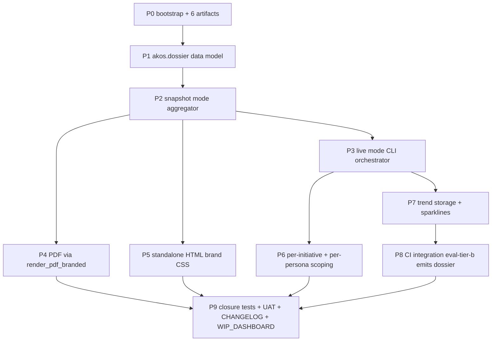

# Initiative 48 — Operator-facing UAT Dossier

**Folder:** `docs/wip/planning/48-operator-dossier/`
**Status:** Closed (2026-05-02)
**Authoritative Cursor plan:** `~/.cursor/plans/i48_operator_dossier_7949bc1d.plan.md`
**Predecessors:** [I27 P4](../27-enisa-dossier/master-roadmap.md) (`scripts/render_dossier.py` ENISA exemplar; the proven brand-aligned PDF pattern), [I32 P10](../32-holistik-ops-maturation/master-roadmap.md) (`scripts/render_wip_dashboard.py` auto-render-with-markers pattern), [I47 P15](../47-user-centric-uat/master-roadmap.md) (the dossier-shaped UAT closure report this initiative generalises).
**Sister to:** I46 P5 conditional GraphRAG ship (consumer of dossier evidence), future I49 (multi-judge consensus + benchmark scoring; consumer of dossier trend lines).

## Outcome

```
py scripts/render_uat_dossier.py
```

emits, in one command, a brand-aligned **3-format artifact pack** at `artifacts/uat-dossier/uat-dossier-<UTC>/`:

- `dossier.md` — the canonical markdown body (12 sections; auto-render markers preserve hand-edits per the I32 P10 pattern)
- `dossier.pdf` — brand-aligned PDF via `akos.hlk_pdf_render.render_pdf_branded` (same chain as the ENISA dossier)
- `dossier.html` — standalone styled HTML (collapsible sections; embedded sparklines as inline SVG; **no JS/CDN/external references**)
- `manifest.json` — sha256 + run_id + git_sha + cell counts + cost roll-up
- `screenshots/` — optional Cursor browser MCP captures of OpenClaw Control SPA at run-time (opt-in)

3 modes — operator chooses cost/time trade-off:

- `--mode snapshot` (default; ~10s; reads existing artifacts only; offline-safe)
- `--mode live` (~5min; runs all 10 CLIs; no Tier B)
- `--mode tier-b` (~15min + cost; runs Tier B subset; opt-in via `AKOS_DOSSIER_TIER_B=1`)

## Why now

- **Operator-UX gap surfaced post-I47 P15 closure (2026-05-02 05:31 CET):** *"if i, as an human operator want to run the full UAT suite and have a report of everything that happened in a really really well presented manner, like a dossier, can i do that? or is it all cli?"*
- **Materials exist; aggregator missing.** ~10 CLIs already emit markdown/JSON; the brand-aligned PDF chain (`akos.hlk_pdf_render.render_pdf_branded`) is proven via the ENISA dossier; the auto-render-with-markers pattern works (I32 P10 WIP_DASHBOARD).
- **Compounding initiative reach.** A dossier renderer serves Tier B weekly runs, post-PR sanity checks, ENISA-style audits, KiRBe / hlk-erp cross-repo health snapshots, board reviews — every cadence in the system.
- **`compliance.eval_run` mirror just got live writes (I47 P13 item 4).** P7 trend lines need this substrate; without a dossier consumer the data has no surface.

## Phase dependency diagram



## Phase dependency narrative

- **P0 → P1:** P0 ratifies the 12 decisions D-IH-48-A..L (especially A: package vs single file; B: 3 formats; H: PDF chain reuse) before P1 starts coding the module.
- **P1 → P2:** P2 needs `Section` ABC + `DossierRun` dataclass to instantiate; without P1 there is no SSOT for section assembly.
- **P2 → P3 / P4 / P5:** P2 establishes the snapshot baseline (offline aggregator); each output mode (live / pdf / html) extends a working snapshot rather than re-implementing aggregation.
- **P3 → P6 / P7:** P6 (per-initiative / per-persona scoping) and P7 (trend storage) need the live-mode CLI orchestrator since their data sources include re-runs.
- **P7 → P8:** P8 CI integration ships dossier as Tier B artifact; the trend storage from P7 is the substrate for week-over-week diffs in PR comments.
- **P4 + P5 + P6 + P8 → P9:** P9 closure validates ALL phases ship (multi-format produced; filters work; trend lines render with ≥2 runs; CI artifacts upload).

## Phase at a glance (10 phases / ~9 weeks elapsed)

| # | Phase | Output | Cumulative tests |
|:--:|:------|:-------|:----------------:|
| P0 | Bootstrap + section spec + 12 decisions seeded D-IH-48-A..L | 6 standard artifacts + `dossier-section-spec.md` (12-section contract) + planning README row + WIP_DASHBOARD re-render | 0 |
| P1 | `akos/dossier/` module: `DossierRun` dataclass + `Section` ABC + 12 section subclasses + `assemble()` | NEW canonical Python package; brand-token reuse via `akos.hlk_pdf_render` | ~25 |
| P2 | Snapshot mode (offline aggregator) | `--mode snapshot` reads `artifacts/calibration/*.json` + `artifacts/chaos/*.json` + `artifacts/agent-memory-triggers/*.json` + `compliance.eval_run` mirror + WIP_DASHBOARD frontmatter; <30s | ~15 |
| P3 | Live mode (CLI orchestrator) | `--mode live` runs each CLI in subprocess; captures stdout/stderr/exit-code; degrades gracefully on per-CLI failure (records SKIP not crash); ~5min | ~20 |
| P4 | Brand-aligned PDF | `--format pdf` via `render_pdf_branded` reusing `BRAND_TOKENS_LIGHT/DARK`; cover band + Inter typography + 0.5rem radius (same as ENISA dossier); WeasyPrint→fpdf2→pandoc fallback; soft-success markdown sidecar | ~12 |
| P5 | Standalone HTML | `--format html` via markdown library + brand CSS; collapsible `<details>` sections per topic; inline-SVG sparklines; **no JS dependency** (R-48-3 mitigation) | ~12 |
| P6 | Per-initiative + per-persona scoping | `--initiative 47` filters to one initiative's reports; `--persona <id>` filters scenario stats + per-persona scorecard + persona-conditioned MADEIRA prompt diff; `--since <YYYY-MM-DD>` for date-window | ~10 |
| P7 | Trend storage + sparklines | NEW `compliance.dossier_run` mirror table (run_id + timestamp + per-section pass/fail counts + roll-up metrics); reads last N runs to compute deltas; emits inline SVG sparklines per metric (eval pass rate, calibration drift, cost trend, drift canary count) | ~18 |
| P8 | CI integration | `eval-tier-b.yml` matrix-cell trailing step uploads dossier as artifact; optional `gh pr comment` with executive summary; per-week dossier diff via `--since` flag | ~10 |
| P9 | Closure: tests + UAT + CHANGELOG + WIP_DASHBOARD + live operator demo | UAT report at `reports/uat-i48-operator-dossier-2026-05-02.md` per akos-planning-traceability.mdc UAT contract | — |

## Closure (2026-05-02)

All planned phases P0–P9 are implemented: `akos/dossier/` package, snapshot/live/tier-b modes, multi-format output, P6 filters, `compliance.dossier_run` DDL + best-effort writer + local `index.json` trend cache, CI steps, verify profile `dossier_smoke` wired into `pre_commit`, documentation sync, and closure UAT report with the 10-step results table. Remote Supabase apply of the new migration remains an operator follow-up when MasterData is linked.

## Verification matrix (governed; per `config/verification-profiles.json`)

| Check | Profile | Cadence |
|:------|:--------|:--------|
| `validate_hlk.py` (full vault incl. new POLICY_REGISTER `retention` row from P7) | `pre_commit` | Every commit |
| `validate_policy_register.py` (new `retention` policy_class enum value) | `pre_commit` | Every commit |
| `pytest -q --ignore=tests/validate_configs.py` (~122 new I48 tests + 1180+ existing) | `pre_commit` | Every commit |
| `dossier_smoke` (NEW; `py scripts/render_uat_dossier.py --mode snapshot --format md`) | `pre_commit` | Every commit |
| Tier B 4-D matrix dossier artifact upload | `eval_tier_b_weekly` | Weekly + on-demand |
| `release-gate.py` PASS | release flow | Pre-merge |

## Success metrics (closure conditions)

- All 10 phases ship; ~122 new I48 tests PASS
- `validate_hlk` OVERALL PASS includes new POLICY_REGISTER count (26 with `retention: 1`) + new `compliance.dossier_run` table (DDL shipped; remote apply operator-pending)
- `dossier_smoke` profile in `pre_commit` chain and PASSES
- UAT report captures the 10-step results table per akos-planning-traceability.mdc UAT contract
- Branch `i48-operator-dossier` pushed to remote
- Operator confirms `py scripts/render_uat_dossier.py` produces a "dossier-shaped" artifact in their preferred format
- Doc sync per akos-docs-config-sync.mdc complete (ARCHITECTURE + USER_GUIDE + DEVELOPER_CHECKLIST + DEV_VERIFICATION_REFERENCE)
- ≥2 dossier runs land in `compliance.dossier_run` **or** local `artifacts/uat-dossier/index.json` (sparklines render with ≥2 datapoints)

## Risks + rollback

See [`risk-register.md`](risk-register.md). 10 risks tracked; key concerns: aggregator coupling (R-48-1), HTML XSS surface (R-48-3; mitigated by no-JS posture), trend storage growth (R-48-5; mitigated by retention policy), brand drift (R-48-10; mitigated by existing `test_brand_tokens_light_match_pattern_doc`).

## Reporting artifacts

- `reports/p<N>-*-YYYY-MM-DD.md` per phase
- `reports/uat-i48-operator-dossier-2026-05-02.md` (P9 closure; per akos-planning-traceability.mdc UAT contract; 10-step results table)

## Cross-cutting

- Decision IDs: `D-IH-48-A` through `D-IH-48-L` (12 seeded; defaults pre-ratified at greenlight 2026-05-02 05:46 CET per the cursor plan attachment)
- All vault docs carry `language: en` frontmatter (per `SOP-HLK_LOCALISATION_001.md`)
- WIP_DASHBOARD picks this row up automatically via auto-render markers
- CHANGELOG entry on closure (P9)
- Doc sync per [`akos-docs-config-sync.mdc`](../../../.cursor/rules/akos-docs-config-sync.mdc) at P9

## What this is NOT

- Not a rewrite of `Scorecard.to_markdown()` or `validate_hlk.py` (orchestrate; do not reinvent)
- Not a new web UI / SPA / dashboard server (static artifact pack only)
- Not a heavy front-end framework (no Alpine.js / htmx / React; D-IH-48-I)
- Not a public benchmark portal (internal-scored only; same posture as I47 D-DEFER-47-α)
- Not Inspect AI / DeepEval adoption (D-IH-45-A still holds)
- Not multi-tenant productisation (I34 scope)
- Not Langfuse-integrated trace dossier (D-DEFER-48-γ; revisit I49)
