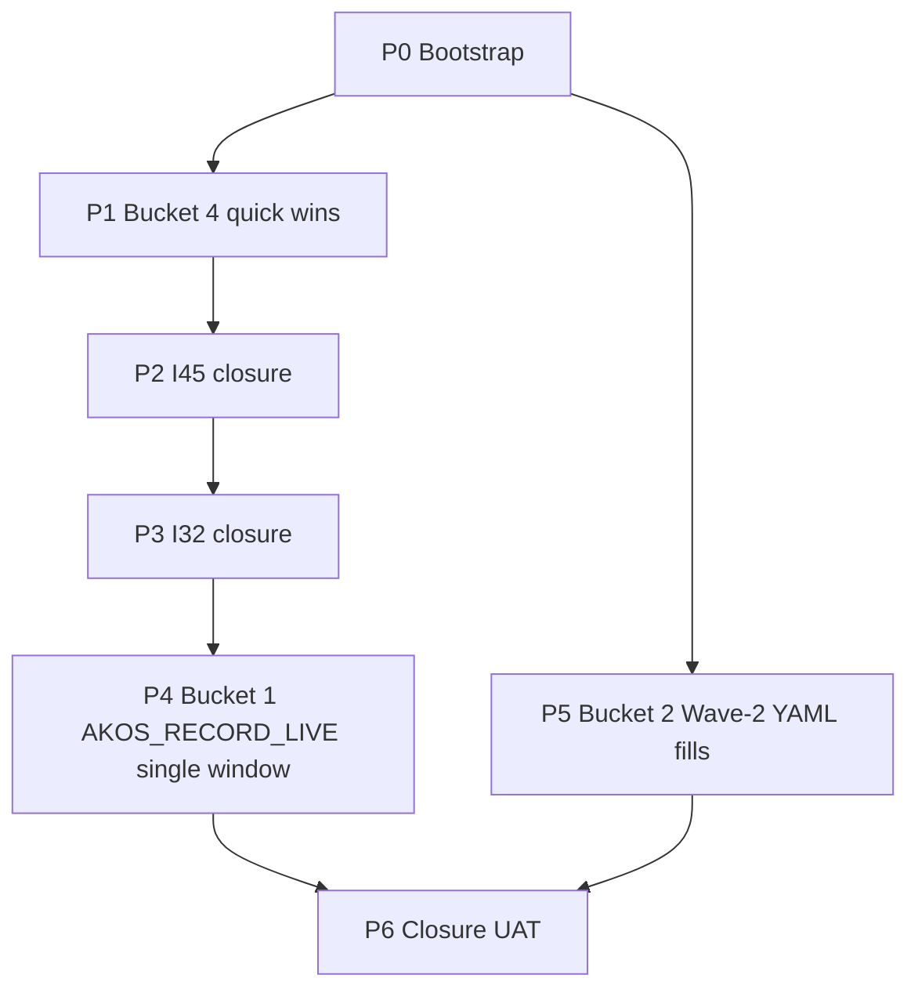

# Initiative 57 — Cycle closeout + first live-validation window

**Folder:** `docs/wip/planning/57-cycle-closeout-live-validation/`
**Status:** Closed engineering side 2026-05-04 via [UAT-I57-2026-05-04](reports/uat-i57-cycle-closeout-2026-05-04.md). All 5 engineering phases (P0 + P1 + P2 + P3 + P5 + P6) shipped GREEN with release-gate 8/8 PASS + 1764 tests. P4 forwards as **OPS-57-1** (operator-funded `AKOS_RECORD_LIVE` window; runbook in [P4 forward report](reports/p4-live-cycle-forward-2026-05-04.md)). Downstream consumption of P5 forwards as **OPS-57-2** (owned by I24 + I55 phases). Residual 1 axe-Serious finding on `/madeira/control` filed as **OPS-54-1.c** (CSS variable change in next quick-wins cycle).
**Authoritative plan:** [`~/.cursor/plans/i57-cycle-closeout-live-validation_b736db8d.plan.md`](#)
**Predecessors:** [I50](../50-live-cycle-closure/master-roadmap.md) → [I51](../51-persona-calibration-cleanup/master-roadmap.md) → [I52](../52-multi-model-judge-and-cost-discipline/master-roadmap.md) → [I53](../53-graphrag-poc-closure/master-roadmap.md) → [I54](../54-surface-test-hardening/master-roadmap.md) → [I55](../55-brand-ops-continuous-loop/master-roadmap.md) → [I56](../56-first-response-cycle/master-roadmap.md). Coordinates closeout of in-flight [I32 — Holistik Ops Maturation](../32-holistik-ops-maturation/master-roadmap.md) and [I45 — Live Eval Harness Modernisation](../45-live-eval-harness/master-roadmap.md).

## Outcome

After the I50→I56 burst the MADEIRA + KM stack is **ship-ready in dispatcher-validation mode** but the snapshot dossier still returns NO-GO purely because Sections 3, 5, 7 are SKIP (no `--mode live` data yet). I57 sequences four buckets to convert that into GREEN-on-data and absorb the operator-content fills:

1. **Bucket 4 quick wins** (P1) — Two `compliance_mirror_emit` value-coercion bugs (F-22a-EMIT-1 DATE, F-22a-EMIT-2 NOT NULL bool) and two residual a11y findings from OPS-54-1 (color-contrast, scrollable-region-focusable).
2. **In-flight initiative closures** (P2 + P3) — Both [I45](../45-live-eval-harness/master-roadmap.md) and [I32](../32-holistik-ops-maturation/master-roadmap.md) already have green closure UAT reports dated 2026-05-01 and 2026-04-30 respectively; this initiative re-runs the verification matrices and flips master-roadmap status to Closed.
3. **First operator-funded live cycle** (P4) — Single `AKOS_RECORD_LIVE` window batching OPS-52-1 (multi-judge calibration burn) + OPS-53-1 (GraphRAG PoC A/B against the D-IH-46-E non-additive bar) + OPS-50-1/51-1 (persona-keyed cassette dispatch in multi-judge mode); ~$30-50 envelope under `MAX_DOSSIER_USD=50`.
4. **Wave-2 YAML content fills** (P5) — Operator-content for [`operator-answers-wave2.yaml`](../22a-i22-post-closure-followups/operator-answers-wave2.yaml) Sections 3 + 5; D-IH-17 forbids agent invention so this phase ships the gate, not the keystrokes.

## Why now

- **MADEIRA dossier NO-GO is a data gap, not a quality gap.** Sections 3 (Eval health), 5 (Adversarial), 7 (Drift canaries) are SKIP because `compliance.eval_run` mirror has no rows yet. I45 P4 already shipped the DDL + emitter; OPS-52-1 / OPS-53-1 / OPS-50-1 are the operator-funded write events that fill it.
- **Two in-flight initiatives are content-complete but not status-flipped.** I32 closure UAT (2026-04-30, `status: closed`) and I45 closure UAT (2026-05-01, `status: closed`) are written and PASS, but master-roadmap.md still says `status: active`. WIP_DASHBOARD shows them Open. One re-run of each verification matrix + a status flip closes both cleanly.
- **Two `compliance_mirror_emit` defects degrade every mirror cycle.** F-22a-EMIT-1 emits `''` for empty DATE columns (broke `sourcing_register_mirror.last_engagement_date` at the I22a apply); F-22a-EMIT-2 emits `NULL` for empty NOT NULL bool columns (broke `skill_registry_mirror.tools_required_waived`). Both were patched in-batch at 2026-05-04 and filed as I22a follow-ups; I57 P1 lands the upstream fixes + regression tests.
- **Two Serious axe findings sit in OPS-54-1 backlog.** Single-line CSS for the locale switcher contrast and one `tabindex` for the handoff scrollable region; clean small wins.
- **Operator stack is healthy enough for one funded cycle.** I50 closure left drift-clean state; I52 multi-judge dispatcher is wired; I53 GraphRAG infra is preserved ship-ready behind `AKOS_GRAPHRAG_POC_LIVE=1`; I22a P7 reconciled Supabase MasterData parity at 17/17 mirrors row-for-row to canonical. The window can fire with confidence.

Operator framing (2026-05-04): "we implemented a lot of work in madeira and the knowledge base from hlk perspective. What's next?" → four buckets, sequenced 4 → 3 → 1 → 2.

## Scope decisions

| In scope | Out of scope |
|:---|:---|
| F-22a-EMIT-1 + F-22a-EMIT-2 upstream fixes in [`scripts/sync_compliance_mirrors_from_csv.py`](../../../../scripts/sync_compliance_mirrors_from_csv.py) (P1) | Replacing the `_sql_text_literal` family with a typed-coercion library |
| OPS-54-1.a + OPS-54-1.b residual axe-Serious fixes in [`static/madeira_control.html`](../../../../static/madeira_control.html) (P1) | New a11y surface coverage beyond the I54 D-IH-54-C scope |
| Re-run verification matrix and flip status for [I45](../45-live-eval-harness/master-roadmap.md) (P2) and [I32](../32-holistik-ops-maturation/master-roadmap.md) (P3) | Re-execution of any I45 / I32 phase content |
| Single `AKOS_RECORD_LIVE` window batching OPS-52-1 + OPS-53-1 + OPS-50-1/51-1 (P4) | A second live window for any item that fails the non-additive bar |
| Wave-2 YAML Section 3 + 5 verification gate (P5) | Authoring Section 3 GOI/POI voice profiles (D-IH-17 operator-only) |
| Closure UAT + CHANGELOG + WIP_DASHBOARD re-render (P6) | I46 P5 conditional `SKILL_REGISTRY.csv` `retrieval_mode` flip + POLICY clone (only fires if GraphRAG GO; spawned as small follow-on, not in this initiative) |

## Asset classification (per [`PRECEDENCE.md`](../../../references/hlk/compliance/PRECEDENCE.md))

| Class | Paths | Rule |
|:------|:------|:-----|
| **New canonical (planning)** | `docs/wip/planning/57-cycle-closeout-live-validation/{master-roadmap,decision-log,asset-classification,evidence-matrix,risk-register}.md` + `reports/` | Standard six-artifact contract |
| **Modified canonical (script)** | [`scripts/sync_compliance_mirrors_from_csv.py`](../../../../scripts/sync_compliance_mirrors_from_csv.py) value coercion (F-22a-EMIT-1 DATE NULL coercion in `_emit_sourcing_register_upserts`; F-22a-EMIT-2 NOT NULL bool default in `_emit_skill_registry_upserts`) | P1 — both fixes carry per-defect regression tests |
| **Modified canonical (surface)** | [`static/madeira_control.html`](../../../../static/madeira_control.html) CSS contrast (OPS-54-1.a) + DOM tabindex (OPS-54-1.b) | P1 — verified by `browser-smoke.py --playwright --axe` |
| **Modified canonical (status flip)** | [`docs/wip/planning/45-live-eval-harness/master-roadmap.md`](../45-live-eval-harness/master-roadmap.md) frontmatter `status: closed` (P2) | UAT report 2026-05-01 already declares closure |
| **Modified canonical (status flip)** | [`docs/wip/planning/32-holistik-ops-maturation/master-roadmap.md`](../32-holistik-ops-maturation/master-roadmap.md) frontmatter `status: closed` (P3) | UAT report 2026-04-30 already declares closure |
| **New mirrored / derived** | `artifacts/dossier-i57-live-cycle/` (P4 dossier emit); cassettes under `tests/evals/cassettes/<persona_id>/` (P4 OPS-50-1/51-1); GraphRAG A/B run artifact under `tests/evals/cassettes/graph_rag/` (P4 OPS-53-1) | Recorded, not authored; gated by `AKOS_RECORD_LIVE=1` |
| **Operator-authored canonical** | [`docs/wip/planning/22a-i22-post-closure-followups/operator-answers-wave2.yaml`](../22a-i22-post-closure-followups/operator-answers-wave2.yaml) Sections 3 + 5 (P5) | D-IH-17 forbids agent invention; the YAML writer materializes operator content into canonical CSV rows |
| **Conditional new canonical (GraphRAG GO only)** | `SKILL_REGISTRY.csv` `retrieval_mode` flip + POLICY row clone | Out-of-scope for this initiative; spawned as small follow-on if P4 (c) returns GO |
| **Reference-only** | I57 phase reports under `reports/` | Standard initiative artifact |

## Phase dependency

P5 runs **in parallel from P0 onwards** because it is operator-content work (D-IH-17 forbids invention) and does not block any engineering phase. The I55 continuous loop (L1-L7) keeps operating regardless of P5 progress per D-IH-55-E both-signal-and-silence. P4 depends on P3 only because the dossier rendered in P4 (d) reads the just-flipped I32 + I45 status rows from the WIP_DASHBOARD.

## Phase at a glance

| # | Phase | Output | Cycle 1 status |
|:--:|:------|:-------|:--------------:|
| **P0** | Bootstrap | Six governance artifacts under `docs/wip/planning/57-cycle-closeout-live-validation/`; planning README row 57; CHANGELOG entry | DONE (this commit) |
| **P1** | Bucket 4 quick wins | F-22a-EMIT-1 DATE NULL coercion + regression test; F-22a-EMIT-2 NOT NULL bool default + regression test; OPS-54-1.a color-contrast CSS; OPS-54-1.b tabindex on `#handoff-example` | Engineering (this initiative) |
| **P2** | I45 closure | Re-run I45 verification matrix; flip [`master-roadmap.md`](../45-live-eval-harness/master-roadmap.md) `status: closed`; WIP_DASHBOARD re-render | Engineering (this initiative) |
| **P3** | I32 closure | Re-run I32 verification matrix; flip [`master-roadmap.md`](../32-holistik-ops-maturation/master-roadmap.md) `status: closed`; WIP_DASHBOARD re-render | Engineering (this initiative) |
| **P4** | Bucket 1 single live window | OPS-52-1 multi-judge calibration burn + OPS-50-1/51-1 persona cassettes + OPS-53-1 GraphRAG A/B + live `--filter madeira` dossier; ~$30-50 under `MAX_DOSSIER_USD=50` | **OPS-57-1** (operator-funded; AKOS does not have provider keys / Supabase env / spend budget) |
| **P5** | Bucket 2 Wave-2 fills | Section 3 six GOI/POI voice profiles; Section 5 `process_list.csv` tranche `thi_mkt_dtp_NN`; Sections 4/6/7 sentinel scan | **OPS-57-2** (operator-content per D-IH-17; engineering ships gate not keystrokes) |
| **P6** | Closure UAT | Verification matrix; CHANGELOG entry; WIP_DASHBOARD re-render; flip I57 status to Closed (engineering side) or stay Open pending OPS-57-1/2 | Engineering (this initiative) |

The cycle-1 posture matches the I54 / I55 / I56 stub-mode-then-OPS-* pattern: AKOS ships the deterministic engineering work in P0 + P1 + P2 + P3 + P6 and forwards the operator-funded / operator-content work to OPS-57-1 (live cycle) and OPS-57-2 (Wave-2 fills). The honest verdict at this initiative's first closure is "engineering closeout shipped; live validation + Wave-2 content forwarded".

## Verification matrix

| Check | Profile / command | Cadence |
|:------|:------------------|:--------|
| `py scripts/legacy/verify_openclaw_inventory.py` | inventory | Every phase |
| `py scripts/check-drift.py` | drift | Every phase |
| `py scripts/test.py all` | full pytest sweep, must hit 1751+ pass | Every phase |
| `py scripts/validate_hlk.py` | full vault | P1, P3, P5, P6 |
| `py scripts/verify.py compliance_mirror_emit` | mirror emit smoke | P1 (regression slice for F-22a-EMIT-1 + F-22a-EMIT-2) |
| `py scripts/browser-smoke.py --playwright --axe` | axe a11y; OPS-54-1 follow-up | P1, P6 |
| `py scripts/wave2_backfill.py --check-only` | Wave-2 sentinel scan | P5 |
| `py scripts/judge_calibration_burn.py --live` | OPS-52-1 (operator) | P4 (a) |
| `py scripts/graphrag_poc.py --live --golden-set` | OPS-53-1 (operator) | P4 (c) |
| `py scripts/render_uat_dossier.py --filter madeira --mode live` | live dossier | P4 (d), P6 |
| `py scripts/release-gate.py` | 8/8 closure gate | P6 |
| `py scripts/render_wip_dashboard.py` | WIP_DASHBOARD refresh | P0, P2, P3, P6 |

## Operator approval gates

- **G-57-1** (P4 pre-flight) — Operator confirms `MAX_DOSSIER_USD=50` envelope, abort threshold $40, `AKOS_RECORD_LIVE=1`, and that all four provider/key inputs are loaded (Anthropic + OpenAI + Supabase service-role + RunPod/Kalavai). Without this, P4 cannot fire.
- **G-57-2** (P4 mid-flight, R-57-1 trigger) — `endpoint_envelope_alarm.py` aborts P4 execution if cumulative cost crosses $40; partial outcomes recorded; remaining sub-steps re-forward to a future window.
- **G-57-3** (P5 per-section) — Operator confirms each Wave-2 section commit; D-IH-17 forbids agent invention so the operator authors and AKOS validates.

## Decisions seeded (D-IH-57-A through G)

- **D-IH-57-A** — Initiative model: single coordinating I57 vs distributed close-out across existing folders. Chosen single per operator selection 2026-05-04; consolidates the four buckets into one master-roadmap with one closure UAT.
- **D-IH-57-B** — Live cycle batching: single `AKOS_RECORD_LIVE` window batching OPS-52-1 + OPS-53-1 + OPS-50-1/51-1 vs split. Chosen single per operator selection 2026-05-04; max efficiency, ~3-4h sitting under one envelope.
- **D-IH-57-C** — P1 commit granularity: ship Bucket 4 as one P1 commit grouping all four fixes vs four separate commits. **Recommend one commit per fix** to keep regressions bisectable; revisit at P1 execution time if commits are tightly coupled.
- **D-IH-57-D** — Wave-2 Section 3 content authority: operator-only per D-IH-17. Agent may not synthesise GOI/POI voice profiles even when given strong prior signal (e.g., adviser correspondence excerpts).
- **D-IH-57-E** — GraphRAG ship verdict policy: re-affirms [D-IH-46-E](../46-neo4j-strategic-posture/decision-log.md) non-additive bar and [D-IH-53-C](../53-graphrag-poc-closure/decision-log.md) no-partial-credit. If P4 (c) hits any single bar by ≥3pp accuracy lift OR ≥30% latency reduction OR ≥40% cost reduction, GO; otherwise NO-SHIP and OPS-53-1 forwards. No mid-bar negotiation.
- **D-IH-57-F** — Multi-judge calibration alignment minimum: `POL-EVAL-JUDGE-THRESHOLD-{BRAND-VOICE,CITATION,PERSONA-FIT}-V1` rows stay at `min_pass_score=4`. Gate re-arms on first <80% alignment event from the OPS-52-1 burn.
- **D-IH-57-G** — Cost ceiling envelope for the live cycle: `MAX_DOSSIER_USD=50` hard ceiling, `endpoint_envelope_alarm.py` abort at $40, kill switch wired to halt P4 execution mid-flight if exceeded. Per the I52 P5 cost discipline + I50 P2 prices truth-up.

## Risks (R-57-1 through 7)

| ID | Risk | Likelihood | Severity | Mitigation | Owner |
|:---|:-----|:-----------|:---------|:-----------|:------|
| **R-57-1** | Live cycle exceeds $50 envelope | Low | High | Abort at $40 via `endpoint_envelope_alarm.py`; partial outcomes recorded; remaining OPS items re-forward | System Owner |
| **R-57-2** | GraphRAG P4 (c) fails the non-additive bar | Medium | Medium | Captured as NO-SHIP governance event per D-IH-53-C; no partial credit; OPS-53-1 forwards to a future cycle | AI Engineer |
| **R-57-3** | Multi-judge calibration alignment <80% | Low | Medium | `POL-EVAL-JUDGE-THRESHOLD-*` recalibration cycle scheduled; OPS-52-1 partially closes; gate re-arms | AI Engineer |
| **R-57-4** | F-22a-EMIT fixes break existing mirror sync paths | Low | Medium | Per-fix regression test before commit; rollback is `git revert` of the P1 commits; mirror-emit smoke runs in `pre_commit` | System Owner |
| **R-57-5** | Wave-2 operator-content delays Bucket 2 indefinitely | Medium | Low | Engineering work is independent; the I55 continuous loop continues per D-IH-55-E both-signal-and-silence; OPS-57-2 stays open without blocking I57 closure |  Brand Manager + Founder |
| **R-57-6** | I32 / I45 P2-P3 verification re-run surfaces unrecoverable drift since the original UAT | Low | Medium | Spawn a separate I57.5 sub-initiative for any unrecoverable drift; do not block P4 on this; the existing UAT reports identify the baseline state | System Owner |
| **R-57-7** | AKOS_RECORD_LIVE prerequisites missing at sitting time (provider keys, Supabase env, RunPod / Kalavai endpoints) | Medium | Low | Abort pre-flight via G-57-1 checklist; reschedule the window | Operator |

## Success metrics (closure conditions)

**Engineering side (I57 close at P6):**
- Bucket 4: F-22a-EMIT-1 + F-22a-EMIT-2 fixes shipped with regression tests; OPS-54-1.a + OPS-54-1.b verified by `browser-smoke.py --playwright --axe` returning 0 Critical / 0 Serious findings (down from 0/2).
- Bucket 3: I32 master-roadmap status `closed`; I45 master-roadmap status `closed`; WIP_DASHBOARD shows both Closed.
- All verification matrix steps PASS.
- CHANGELOG entry under `[Unreleased] / Added` references this initiative.
- Tests pass at 1751+ (was 1751 at I55 closure; +N for new regression tests).

**Operator side (OPS-57-1 close, separate cycle):**
- P4 (a) OPS-52-1: multi-judge calibration alignment ≥80% on at least 2 of 3 axes; or `POL-EVAL-JUDGE-THRESHOLD-*` rows recalibrated and committed.
- P4 (b) OPS-50-1/51-1: at least 2 personas have populated cassettes under `tests/evals/cassettes/<persona_id>/`.
- P4 (c) OPS-53-1: GraphRAG GO or NO-SHIP verdict written to both [I46](../46-neo4j-strategic-posture/decision-log.md) and [I53](../53-graphrag-poc-closure/decision-log.md) decision-logs as `D-IH-46-Decision-P3-2026-MM-DD`.
- P4 (d) live dossier: Sections 3, 5, 7 produce real rows; three-light verdict re-evaluated; manifest sha256 recorded.

**Operator-content side (OPS-57-2, separate cadence):**
- Wave-2 Section 3 six GOI/POI voice profiles operator-authored.
- Wave-2 Section 5 `process_list.csv` tranche `thi_mkt_dtp_NN` operator-authored and merged.
- `wave2_backfill.py --check-only` reports zero pending leaves.
- Closes the OPS-55-1 content cluster (engineering portions of OPS-55-1 already shipped at I55 P6+P7).

## What this is NOT

- Not a rewrite of any existing initiative: I32 and I45 keep their folders; this initiative drives them to status closure and writes one short closeout report per initiative, not full re-execution.
- Not the actual Wave-2 content authoring (operator-only per D-IH-17); P5 owns the gate and the verification, not the keystrokes.
- Not the I46 P5 CSV flip + POLICY clone — that is the conditional follow-on if GraphRAG hits GO at P4 (c) and is spawned as a small follow-on task, not phased here.
- Not multi-tenant scoping (Initiative 34) or `process_list.csv` per-plane re-architecture (Initiative 27 deferred trigger).
- Not a continuous loop: I57 is a one-time cycle-closeout initiative that closes when P6 fires; OPS-57-1 + OPS-57-2 forward to their own closure cadences.

## Reporting artifacts

- `reports/p<N>-*-2026-05-DD.md` per phase (per AKOS convention from I22+).
- `reports/p0-bootstrap-2026-05-04.md` (this commit's bootstrap evidence).
- `reports/uat-i57-cycle-closeout-2026-05-DD.md` (P6 closure).

## Cross-cutting

- Decision IDs: `D-IH-57-A` through `D-IH-57-G` (7 seeded; user-ratified at greenlight 2026-05-04).
- All vault and report documents carry `language: en` frontmatter (per [`SOP-HLK_LOCALISATION_001.md`](../../../references/hlk/v3.0/Admin/O5-1/Marketing/Brand/SOP-HLK_LOCALISATION_001.md)).
- WIP_DASHBOARD picks this row up automatically once `master-roadmap.md` is committed.
- CHANGELOG entry on closure (P6).
