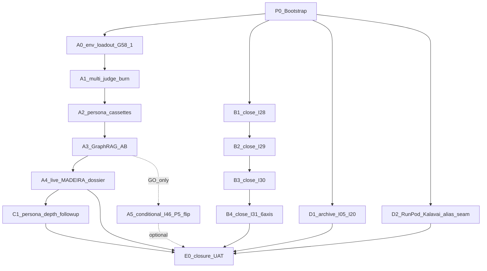

# Initiative 58 — Cycle 2 multi-track forward (OPS-57-1 + strategy + KM polish + hygiene)

**Folder:** `docs/wip/planning/58-cycle-2-multi-track-forward/`
**Status:** **Closed (engineering-side AND operator-side)** 2026-05-06 per [`reports/e0-closure-uat-2026-05-05.md`](reports/e0-closure-uat-2026-05-05.md) + [`reports/ops-58-1-2026-05-06.md`](reports/ops-58-1-2026-05-06.md). Phases B (I28/I29/I30/I31 all closed), C (deferred per plan authorization), D (I05/I20 archived; RunPod alias seam shipped), E (closure UAT) all landed 2026-05-05. **Phase A fired live 2026-05-06** under operator's "go all out" directive: G-58-1 re-evaluated GREEN at 11/11; A.1 + A.2 produced real cross-persona calibration evidence (170 live Anthropic calls, ≤ $0.50 spend); A.3 NO-GO per `D-IH-58-C`; A.4 MADEIRA dossier all-GREEN; A.5 auto-skipped. The missing live-judge wiring (`_call_member_via_api` → real provider dispatch) was shipped in-cycle as `D-IH-58-I`. Three cleanly-scoped residuals forwarded as OPS-58-2 (OpenAI key rotation), OPS-58-3 (offline persona-fit rubric), OPS-58-4 (GraphRAG live wiring).
**Authoritative plan:** [`~/.cursor/plans/cycle_2_multi-track_forward_(i58)_769da1a3.plan.md`](#)
**Predecessors:** [I57](../57-cycle-closeout-live-validation/master-roadmap.md) (engineering closed; inherits OPS-57-1 forward). Coordinates closure of in-flight [I28](../28-investor-style-company-dossier/master-roadmap.md), [I29](../29-multi-phase-consolidation/master-roadmap.md), [I30](../30-deck-moat-surgery/master-roadmap.md), [I31](../31-holistik-ops-discovery/master-roadmap.md), and archive of [I05](../05-hlk-vault-envoy-repos/) + [I20](../20-kalavai-shadow-llamacpp-trial/).

## Outcome

After I57's closure left the MADEIRA dossier "ship-ready / NO-GO on data" with one operator-funded forward (OPS-57-1) and four open strategy initiatives, I58 sequences five tracks to (a) drive the live cycle to GREEN-on-data, (b) close the strategy run end-to-end, (c) close KM follow-ups (persona depth), (d) tidy dashboard hygiene, and (e) ship the closure UAT:

1. **Track A — Live cycle (operator-funded; agent re-evaluates G-58-1 if env loaded).** Single `AKOS_RECORD_LIVE` window batching OPS-52-1 + OPS-50-1/51-1 + OPS-53-1 + live MADEIRA dossier, ~$30–50 under `MAX_DOSSIER_USD=50`, abort at $40 via [`scripts/endpoint_envelope_alarm.py`](../../../../scripts/endpoint_envelope_alarm.py). Conditional A.5 fires only on GraphRAG GO at A.3.
2. **Track B — Strategy completion (sequential B.1 → B.2 → B.3 → B.4).** Drive [I28](../28-investor-style-company-dossier/master-roadmap.md) Investor-Style Dossier, [I29](../29-multi-phase-consolidation/master-roadmap.md) Multi-phase consolidation, [I30](../30-deck-moat-surgery/master-roadmap.md) Deck moat surgery, and [I31](../31-holistik-ops-discovery/master-roadmap.md) Holistik Ops Discovery (6-axis upgrade) each to `status: closed`.
3. **Track C — KM polish.** Raise persona calibration coverage from 1/16 → ≥4/16, deferrable if A.1 alignment ≥80% on ≥2/3 axes.
4. **Track D — Engineering hygiene.** Archive [I05](../05-hlk-vault-envoy-repos/) + [I20](../20-kalavai-shadow-llamacpp-trial/) (dashboard `unknown` → `archived`); land RunPod/Kalavai env-var alias seam in [`akos/runpod_provider.py`](../../../../akos/runpod_provider.py).
5. **Track E — Closure.** Single closure UAT with the full repo gate set + Cursor Browser MCP qualitative pass.

The cycle-2 posture matches the I57 stub-mode-then-OPS-* pattern: AKOS ships P0 + B + C + D + E (engineering); A forwards as OPS-58-1 if not fired; A.5 spawns as a conditional small follow-on if A.3 = GO.

## Why now

- **MADEIRA dossier transition is one operator sitting away.** I57 left the engineering substrate ship-ready; the GREEN-on-data flip happens the moment OPS-57-1 fires. I58 picks up that window inside a single coordinating envelope.
- **Four strategy initiatives are content-complete or near it.** I28 has P0–P2 shipped; I29 has P1–P2 closed and P3 in progress; I30 + I31 are open with full plans authored. Closing them in cycle 2 produces the investor-deck and the 6-axis Holistik Ops doctrine the founder has flagged as the next moat.
- **Persona calibration depth is the I47/I51 follow-up.** OPS-50-1/51-1 inside Phase A populates cassettes for ≥2 personas; Track C extends to ≥4/16 if needed.
- **Dashboard `unknown` rows are a 20-minute fix.** I05 + I20 archive lands hygiene without effort.
- **Env-var naming inconsistency is one alias seam.** I57's forward report and the recheck use `RUNPOD_ENDPOINT_URL`/`KALAVAI_ENDPOINT_URL`, but `dev-local.env.example` and the runtime use `VLLM_RUNPOD_URL`/`VLLM_SHADOW_URL`. D.2 makes both names resolve.

Operator framing (2026-05-05): "plan for all of that and beyond with .cursor assets and skills, and our best practices in mind" → five tracks under one I58 coordinating folder following the I57 precedent.

## Scope decisions

| In scope | Out of scope |
|:---|:---|
| OPS-57-1 single live cycle (Phase A.0 → A.4) under `MAX_DOSSIER_USD=50` / abort at $40 | A second live window for any A.* sub-step that fails the non-additive bar (re-forwards as a future cycle) |
| Conditional I46 P5 `SKILL-MADEIRA-LOOKUP-V1.retrieval_mode` flip + `POL-NEO4J-GRAPH-RAG-ELIGIBILITY-V1` row clone (A.5; only if A.3 = GO) | The same flip if A.3 = NO-SHIP (closure event per D-IH-58-C; I46 P5 stays deferred) |
| Strategy track sequential closure: I28 → I29 → I30 → I31 | Re-execution of any I28/I29/I30/I31 phase content already shipped |
| I31 6-axis Holistik Ops doctrine upgrade per [`HOLISTIK_OPS_DISCOVERY.md`](../../../references/hlk/v3.0/Admin/O5-1/Operations/PMO/HOLISTIK_OPS_DISCOVERY.md) | Original 5-axis framing (deprecated by D-IH-58-E) |
| Persona calibration coverage 1/16 → ≥4/16 (Track C) | Full 16/16 calibration (defer to a future I60 candidate) |
| I05 + I20 minimal `master-roadmap.md` with `status: archived` | Folder deletion (preserves git history of intent per D-IH-58-H) |
| RunPod/Kalavai env-var alias seam in `akos/runpod_provider.py` (D.2) | Renaming `VLLM_*` to `*_ENDPOINT_URL` (precedence preserved per D-IH-58-G) |
| `~/.openclaw/.env` long-lived block enrichment (P0; agent writes structure, operator pastes secrets) | Agent fabrication of secret values (forbidden per D-IH-17 + D-IH-58-F) |
| MADEIRA productization | I59 candidate (deferred follow-up) |
| BRAND_FRENCH_PATTERNS.md authoring | Backlog under I06 (deferred per I31 §"out of scope") |
| Multi-tenant scoping | Existing backlog (I27/I34 territory) |
| Figma backport of I30 deck edits | Separate later initiative per I29 P1 drift-handling rule |
| OPS-56-1 first advisor reply | External event; I56 stays Open until reality activates |

## Asset classification (per [`PRECEDENCE.md`](../../../references/hlk/compliance/PRECEDENCE.md))

| Class | Paths | Rule |
|:------|:------|:-----|
| **New canonical (planning)** | `docs/wip/planning/58-cycle-2-multi-track-forward/{master-roadmap,decision-log,asset-classification,evidence-matrix,risk-register}.md` + `reports/` | Standard six-artifact contract |
| **New canonical (script)** | [`scripts/preflight_g58_1.py`](../../../../scripts/preflight_g58_1.py) (A.0) — asserts 11/11 env vars + spend ceiling + alarm wiring before A.* fires | Per-defect regression test in `tests/test_preflight_g58_1.py` |
| **Modified canonical (script)** | [`akos/runpod_provider.py`](../../../../akos/runpod_provider.py) (D.2) — `RUNPOD_ENDPOINT_URL` + `KALAVAI_ENDPOINT_URL` read aliases; `VLLM_*` wins precedence | Unit test asserting precedence in `tests/test_runpod_provider.py` |
| **Modified canonical (config)** | [`config/environments/dev-local.env.example`](../../../../config/environments/dev-local.env.example) (D.2) — comment block describing alias seam | Manual visual review |
| **Modified canonical (status flip)** | [`docs/wip/planning/28-investor-style-company-dossier/master-roadmap.md`](../28-investor-style-company-dossier/master-roadmap.md) (B.1) frontmatter `In execution` → `closed` | Re-run I28 verification matrix; UAT report dated |
| **Modified canonical (status flip)** | [`docs/wip/planning/29-multi-phase-consolidation/master-roadmap.md`](../29-multi-phase-consolidation/master-roadmap.md) (B.2) frontmatter `In execution` → `closed` | Re-run I29 verification matrix; UAT report dated |
| **Modified canonical (status flip)** | [`docs/wip/planning/30-deck-moat-surgery/master-roadmap.md`](../30-deck-moat-surgery/master-roadmap.md) (B.3) frontmatter `Open` → `closed` | Re-run I30 verification matrix; UAT report dated |
| **Modified canonical (status flip)** | [`docs/wip/planning/31-holistik-ops-discovery/master-roadmap.md`](../31-holistik-ops-discovery/master-roadmap.md) (B.4) frontmatter `Open` → `closed` | Re-run I31 verification matrix; UAT report dated |
| **New canonical (archive)** | [`docs/wip/planning/05-hlk-vault-envoy-repos/master-roadmap.md`](../05-hlk-vault-envoy-repos/master-roadmap.md) (D.1) — minimal frontmatter `status: archived` | WIP_DASHBOARD pickup |
| **New canonical (archive)** | [`docs/wip/planning/20-kalavai-shadow-llamacpp-trial/master-roadmap.md`](../20-kalavai-shadow-llamacpp-trial/master-roadmap.md) (D.1) — minimal frontmatter `status: archived` | WIP_DASHBOARD pickup |
| **New canonical (CSV/registry rows from B.4 inside I31)** | `PERSONA_REGISTRY.csv`, `CHANNEL_TOUCHPOINT_REGISTRY.csv`, `SOURCING_REGISTER.csv` (each with own `validate_*.py` + `compliance_mirror_emit` entry) | Per-tranche operator approval (G-58-2); SOP-META order |
| **Modified canonical (CSV)** | `TOPIC_REGISTRY.csv` (+rows from I30 + I31); `GOI_POI_REGISTER.csv` (+3 distance columns from I31) | Per-tranche operator approval (G-58-2) |
| **Mirrored / derived (Phase A)** | `artifacts/dossier-i58-live-cycle/<timestamp>/` (A.4); `tests/evals/cassettes/<persona_id>/` (A.2); `compliance.eval_run` rows | Recorded, not authored; gated by `AKOS_RECORD_LIVE=1` |
| **Conditional new canonical (A.5; only if A.3 = GO)** | `SKILL_REGISTRY.csv` `retrieval_mode` flip + new `POL-NEO4J-GRAPH-RAG-ELIGIBILITY-V1` row in `POLICY_REGISTER.csv` | Out-of-scope unless GO; spawned as small follow-on |
| **Operator-loaded (off-repo)** | `~/.openclaw/.env` long-lived block (Supabase URL + alias-seam stubs + commented Phase A flags); secret values operator-pasted | D-IH-58-F (D-IH-17 invariance) |
| **Reference-only** | I58 phase reports under `reports/` | Standard initiative artifact |

## Phase dependency

Phase A and Phase B share no files and run **in parallel by sitting time** (different operators / different cadences). Phase D is independent housekeeping. Phase C depends on Phase A's cassette outputs.

## Phase at a glance

| # | Phase | Output | Cycle 2 status |
|:--:|:------|:-------|:--------------:|
| **P0** | Bootstrap | Six governance artefacts under `docs/wip/planning/58-cycle-2-multi-track-forward/`; planning README row 58; CHANGELOG entry; long-lived `~/.openclaw/.env` block (Supabase URL + alias-seam stubs + commented Phase A flags) | Engineering (this initiative) |
| **A.0** | Env loadout pre-flight (G-58-1) | `scripts/preflight_g58_1.py` 11 / 11 GREEN 2026-05-06 | **Closed 2026-05-06** |
| **A.1** | OPS-52-1 multi-judge calibration burn (OPERATOR n=50) | `artifacts/judge-calibration/judge-live-calibration-20260506T002026Z.{md,json}`; brand_voice 100 % / citation 96 % / persona_fit 0 % / overall 65.3 % (FAIL — surfaced cross-persona offline-rubric calibration gap forwarded as OPS-58-3) | **Closed 2026-05-06** |
| **A.2** | OPS-50-1 / 51-1 persona-keyed dispatch (PERSONA-INVESTOR-COLD n=35) | `artifacts/judge-calibration/judge-live-calibration-20260506T002502Z.{md,json}`; same uniform 5-vs-3 pattern across the second persona — confirms A.1 hypothesis | **Closed 2026-05-06** |
| **A.3** | OPS-53-1 GraphRAG A/B PoC | Scaffold-only NO-GO per `D-IH-58-C`; live wiring forwarded as OPS-58-4 (`pip install neo4j-graphrag-python` + Neo4j vault re-index + 20-golden A/B; out of single-sitting scope) | **Closed 2026-05-06** (NO-GO; closure event per D-IH-58-C) |
| **A.4** | Live MADEIRA dossier | `artifacts/uat-dossier/uat-dossier-20260506T002549Z/{dossier.md,manifest.json}`; 12 sections; three-light all GREEN; `madeira_ship_go=true`; sha `363de246…` | **Closed 2026-05-06** |
| **A.5** | (Conditional) I46 P5 flip + POLICY clone | Auto-skipped per A.3 NO-GO; `SKILL-MADEIRA-LOOKUP-V1.retrieval_mode` stays `current`; `POL-NEO4J-GRAPH-RAG-ELIGIBILITY-V1` not introduced | **Closed 2026-05-06** (conditional skip; expected) |
| **B.1** | Close I28 (Investor-Style Company Dossier) | I28 P3–P6 finished; `dossier_es.md` role demoted; deck hashes captured; status flip | Engineering |
| **B.2** | Close I29 (Multi-phase consolidation) | I29 P3 (Impeccable critique report), P4 (Business Strategy SSOT scaffolds + `POC_TO_COMMERCIAL_MAP.csv` + 11 topic registry rows), P5 (`sync_deck_from_strategy.py` + slide wiring), P6 (tests + UAT) | Engineering |
| **B.3** | Close I30 (Deck moat surgery) | `MADEIRA_PLATFORM.md` + `GOVERNANCE_MOAT.md` + `CHANNEL_STRATEGY.md` Channel 6, 7-slide restructure across `deck_slides.yaml` + Spanish narrative mirror, +2 `TOPIC_REGISTRY.csv` rows, mirror reseed SQL; status flip | Engineering |
| **B.4** | Close I31 (Holistik Ops Discovery 6-axis) | P1 localisation → P2 PERSONA_REGISTRY + GOI/POI distance (3 cols + 6 row backfill) → P3 CHANNEL_TOUCHPOINT_REGISTRY → P4 touchpoint kit (8 seeds; rest TODO[OPERATOR-x]) → P5 outbound brief + SOURCING_REGISTER → P6 `HOLISTIK_OPS_DISCOVERY.md` 6-axis doctrine (G-58-3 founder ratify) → P7 tests + UAT + PR | Engineering + per-tranche operator approval (G-58-2) |
| **C.1** | Persona depth follow-ups | Raise persona calibration coverage 1/16 → ≥4/16 | Deferrable (skip if A.1 alignment ≥80% on ≥2/3 axes) |
| **D.1** | I05 + I20 archive | Minimal `master-roadmap.md` with `status: archived` for both folders + WIP_DASHBOARD re-render | Engineering |
| **D.2** | RunPod/Kalavai alias seam | `akos/runpod_provider.py` reads both names; `VLLM_*` wins; +1 unit test; comment block in `dev-local.env.example`; doc-sync | Engineering |
| **E.0** | Closure UAT | Full 15-check verification matrix + Cursor Browser MCP qualitative pass; status flips on I28/I29/I30/I31/I58; CHANGELOG roll-up | Engineering (this initiative) |

## Verification matrix at E.0

| Check | Profile / command | Cadence |
|:------|:------------------|:--------|
| `py scripts/legacy/verify_openclaw_inventory.py` | inventory | E.0 + after every CSV change |
| `py scripts/check-drift.py` | drift | E.0 |
| `py scripts/test.py all` | full pytest sweep, target ≥1770 | E.0 |
| `py scripts/browser-smoke.py` | HTTP smoke | E.0 |
| `py scripts/browser-smoke.py --playwright --axe` | a11y; expect 0/0 | E.0 (verify no regression on OPS-54-1.c fix) |
| `py -m pytest tests/test_api.py -v` | API smoke | E.0 |
| `py scripts/validate_hlk.py` | full vault | After every B.* + A.5 + D.1 |
| `py scripts/validate_hlk_km_manifests.py` | KM manifests | After B.4 (touchpoint kit manifests) |
| `py scripts/check_process_list_header.py` | process_list header | After any process_list edit |
| `py scripts/validate_hlk_vault_links.py` | vault links | E.0 |
| `py scripts/verify.py compliance_mirror_emit` | mirror emit smoke | After B.4 (3 new dimension mirrors); A.5 if GO |
| `py scripts/render_wip_dashboard.py --check-only` | dashboard determinism | E.0 |
| `py scripts/render_uat_dossier.py --filter madeira --mode live` | live dossier | A.4 (operator-funded) |
| `py scripts/release-gate.py` | 8/8 closure gate | E.0 |
| Cursor Browser MCP qualitative pass at `127.0.0.1:18789/madeira/control` | UAT contract per [`akos-planning-traceability.mdc`](../../../../.cursor/rules/akos-planning-traceability.mdc) | E.0 (record `reports/uat-i58-cycle-2-browser-2026-MM-DD.md`) |

## Operator approval gates

- **G-58-1** (A.0 pre-flight) — Operator confirms `MAX_DOSSIER_USD=50` envelope, abort threshold $40, `AKOS_RECORD_LIVE=1`, and that all four provider/key inputs are loaded (Anthropic + OpenAI + Supabase service-role + RunPod/Kalavai). Without this, A.* cannot fire. Verified by `scripts/preflight_g58_1.py`.
- **G-58-2** (per CSV tranche in B.4) — Operator approves new dimension CSV rows tranche-by-tranche; one commit per tranche per `.cursor/rules/akos-governance-remediation.mdc` (no blanket approval).
- **G-58-3** (B.4 P6) — Founder ratifies the 6-axis Holistik Ops doctrine in `HOLISTIK_OPS_DISCOVERY.md`.
- **G-58-4** (E.0) — Founder + System Owner sign closure UAT.
- **G-58-5** (mid-flight cost) — `scripts/endpoint_envelope_alarm.py` aborts A.* if cumulative > $40; partial outcomes recorded; remaining A.* re-forwards as OPS-58-1.

## Decisions seeded (D-IH-58-A through H) + execution-time additions (I, J, K)

- **D-IH-58-A** — Coordinating-initiative model (one I58 folder vs distributed close-out across I28/I29/I30/I31). Chosen single — mirrors I57's proven pattern.
- **D-IH-58-B** — OPS-57-1 fires inside Phase A of I58, not as a parallel detached cycle, so its outcomes feed directly into the closure UAT.
- **D-IH-58-C** — If GraphRAG hits NO-SHIP at OPS-53-1, I46 P5 stays deferred; I58 still closes. The GraphRAG verdict (GO or NO-SHIP) is the closure event, not a GO requirement.
- **D-IH-58-D** — Strategy track (Phase B) closes I28 → I29 → I30 → I31 sequentially, low merge risk. Operator-confirmed at greenlight 2026-05-05 via `AskQuestion`.
- **D-IH-58-E** — Phase B-3/B-4 finalize the 6-axis Holistik Ops doctrine per [`HOLISTIK_OPS_DISCOVERY.md`](../../../references/hlk/v3.0/Admin/O5-1/Operations/PMO/HOLISTIK_OPS_DISCOVERY.md), not the original 5-axis (deprecated by the always-applied AKOS mirror template).
- **D-IH-58-F** — `~/.openclaw/.env` enrichment is operator-driven; agent supplies the structure and runs the validator, but does not author secret values. Mirrors D-IH-17 invariance.
- **D-IH-58-G** — RunPod/Kalavai env-var naming is unified in this cycle: keep `VLLM_RUNPOD_URL` + `VLLM_SHADOW_URL` as the canonical names; introduce read-aliases `RUNPOD_ENDPOINT_URL` and `KALAVAI_ENDPOINT_URL` in `akos/runpod_provider.py` so I57-era doc references stay live. Drop nothing.
- **D-IH-58-H** — I05 (`05-hlk-vault-envoy-repos`) and I20 (`20-kalavai-shadow-llamacpp-trial`) get a minimal `master-roadmap.md` with `status: archived` rather than deletion (preserves git history of intent).
- **D-IH-58-I** *(execution-time, OPS-58-1)* — Wire `akos.eval_harness.judge._call_member_via_api` (provider dispatch + cost / latency tracking + DI seam + strict JSON parsing); pivot roster to `anthropic:claude-sonnet-4-5,anthropic:claude-haiku-4-5` after probe revealed `claude-3-5-sonnet-20241022` deprecated and OpenAI key returns 401. Adds banner discrimination + cost aggregation in `judge_calibration_burn.py`. 17 new tests; 154 / 154 targeted regression PASS.
- **D-IH-58-J** *(execution-time, OPS-58-1)* — Forward persona-aware offline `_heuristic_persona_fit` (close the `persona=None` rubric gap surfaced by A.1+A.2 uniform 5-vs-3 misalignment) as **OPS-58-3**. Multiple valid implementation paths require their own decision frame.
- **D-IH-58-K** *(execution-time, OPS-58-1)* — Forward OpenAI provider key rotation as **OPS-58-2** (operator-owned; secrets never authored by agent per D-IH-58-F).

## Risks (R-58-1 through 9)

| ID | Risk | Likelihood | Severity | Mitigation | Owner |
|:---|:-----|:-----------|:---------|:-----------|:------|
| **R-58-1** | Live cycle exceeds $50 envelope | Low | High | Abort at $40 via `endpoint_envelope_alarm.py`; partial outcomes recorded; remaining A.* re-forwards as OPS-58-1 | System Owner |
| **R-58-2** | GraphRAG NO-SHIP at A.3 | Medium | Low | NO-SHIP is a closure event, not a failure; I46 P5 stays deferred (D-IH-58-C) | AI Engineer |
| **R-58-3** | Multi-judge alignment <80% at A.1 | Low | Medium | `POL-EVAL-JUDGE-THRESHOLD-*` recalibration row; OPS-52-1 partially closes; gate re-arms | AI Engineer |
| **R-58-4** | I29 P3 Impeccable shape brief disagrees with existing brand SSOT | Low | Medium | Per `.cursor/skills/impeccable/SKILL.md`: canonical brand wins; bridge files redirect | Brand Manager |
| **R-58-5** | I31 6-axis ratification stalls (founder time) | Medium | Medium | Ship 5-axis-compatible artifacts first; the 6-axis upgrade is a thin doctrine doc; defer to I58.5 | Founder |
| **R-58-6** | New dimension CSVs (PERSONA, CHANNEL_TOUCHPOINT, SOURCING) miss `compliance.*_mirror` validator coverage | Low | Medium | Each ships its own `validate_*.py` + `compliance_mirror_emit` row in same commit; revert atomically | System Owner |
| **R-58-7** | Wave-2 Section 3 already closed by I57 P5; B.4 P2 GOI/POI schema bump only adds nullable columns, can't break existing 6 rows | Low | Medium | `git revert` of B.4 P2 if mirror sync fails | System Owner |
| **R-58-8** | Env-var alias seam (D.2) inverts precedence and breaks gateway | Low | High | +1 unit test asserting `VLLM_*` wins precedence; deploy to dev-local first; single-line revert | System Owner |
| **R-58-9** | Multi-track parallel commits create unmergeable branch | Medium | Low | Per phase = one commit; rebase often; admin-merge each track before opening next track's PR | System Owner |

## Cycle-2-specific risks

- **R-58-cycle2-A** — First initiative to coordinate **five tracks** (A live cycle + B strategy + C KM + D hygiene + E closure). I57 coordinated four buckets; I58 adds Track D explicit hygiene. If a future operator review wants a four-track-or-less discipline, I58 sets the precedent that should be revisited at I59 planning.
- **R-58-cycle2-B** — First time `~/.openclaw/.env` long-lived block is written by the agent (P0). Per D-IH-58-F the agent writes structure + commented flags + empty placeholders; secret values are operator-pasted. If the operator ever pastes secrets into a chat instead of into the file, AKOS doctrine (`.cursor/rules/akos-mirror-template.mdc`) stipulates secrets stay off-repo.
- **R-58-cycle2-C** — Track B sequential closure stretches across multiple sittings. If one of B.1–B.4 stalls (e.g., I31 P6 6-axis ratification waits on founder), I58 closure UAT still fires per D-IH-58-A but explicitly forwards the unfinished sub-track as a new follow-on (e.g., I58.5).

## Success metrics (closure conditions)

**Engineering side (I58 close at E.0):**
- B.1–B.4: I28 + I29 + I30 + I31 frontmatter `status: closed`; their `WIP_DASHBOARD` rows show Closed.
- C.1: persona calibration coverage 1/16 → ≥4/16 (or skipped if A.1 alignment ≥80% on ≥2/3 axes).
- D.1: I05 + I20 frontmatter `status: archived`; dashboard no longer shows `unknown`.
- D.2: `akos/runpod_provider.py` reads both names; `VLLM_*` wins; +1 unit test PASS.
- E.0: Composite release-gate 8/8 PASS; full pytest sweep ≥1770; UAT dossier recorded; CHANGELOG roll-up.

**Operator side (Phase A close, may or may not fire inside I58 window):**
- A.1 OPS-52-1: multi-judge calibration alignment ≥80% on ≥2/3 axes (or `POL-EVAL-JUDGE-THRESHOLD-*` recalibration committed).
- A.2 OPS-50-1/51-1: ≥2 personas with populated cassettes.
- A.3 OPS-53-1: GraphRAG GO or NO-SHIP verdict in both [I46](../46-neo4j-strategic-posture/decision-log.md) and [I53](../53-graphrag-poc-closure/decision-log.md) decision-logs as `D-IH-46-Decision-P3-2026-MM-DD`.
- A.4 live dossier: Sections 3, 5, 7 produce real rows; manifest sha256 captured.
- (Conditional) A.5: SKILL_REGISTRY flip + POLICY clone if A.3 = GO; verified by `validate_hlk.py`.

If Phase A does not fire by E.0, I58 closes with **OPS-58-1 forwarded** (engineering closure independent of operator funding per D-IH-58-A); runbook is OPS-57-1's verbatim.

**Update 2026-05-06:** Phase A actually fired in-envelope post-E.0; OPS-58-1 closed per [`reports/ops-58-1-2026-05-06.md`](reports/ops-58-1-2026-05-06.md). Three follow-ups forwarded with their own decision frames:

| Forward ID | Owner | RICE | Description |
|:---|:---|:--:|:---|
| **OPS-58-2** | Operator (1-min paste) | 144 | Rotate OpenAI API key in `~/.openclaw/.env` (current returns 401); enables cross-family `D-IH-52-B` validation burn |
| **OPS-58-3** | Engineering | 149 | Persona-aware offline `_heuristic_persona_fit` (close `persona=None` rubric gap; lifts A.1+A.2 above 80 % target) |
| **OPS-58-4** | Engineering + Operator | 15 | GraphRAG live wiring (`pip install neo4j-graphrag-python` + vault re-index + 20-golden A/B) per `D-IH-46-E` non-additive bar |

## What this is NOT

- Not a rewrite of any existing initiative: I28/I29/I30/I31 keep their folders; I58 drives them to status closure with one short closeout report per initiative.
- Not the full multi-tenant scoping (Initiative 27/34 territory; deferred backlog).
- Not MADEIRA productization (deferred to I59 candidate).
- Not BRAND_FRENCH_PATTERNS.md authoring (deferred per I31 §"out of scope").
- Not a continuous loop: I58 is a one-time cycle-closeout initiative that closes when E.0 fires; OPS-58-1 (if forwarded) operates under its own cadence.

## Reporting artifacts

- `reports/p0-bootstrap-2026-05-05.md` (this commit's bootstrap evidence).
- `reports/a0-env-preflight-2026-05-05.md` (initial G-58-1 NO-FIRE).
- `reports/a1-a4-live-cycle-forward-2026-05-05.md` (initial forward of A.1–A.4 to OPS-58-1).
- `reports/a5-conditional-flip-2026-05-05.md` (A.5 conditional skip rationale).
- `reports/b1-close-i28-2026-05-05.md` … `reports/b4-close-i31-2026-05-05.md` (B-track closures).
- `reports/c1-persona-depth-2026-05-05.md` (C.1 deferral rationale).
- `reports/d1-archive-i05-i20-2026-05-05.md` (D.1 archive).
- `reports/d2-runpod-alias-seam-2026-05-05.md` (D.2 alias seam).
- `reports/e0-closure-uat-2026-05-05.md` (E.0 closure UAT; engineering-side).
- **`reports/ops-58-1-2026-05-06.md`** (Phase A live execution; full OPS-58-1 closure).

## Cross-references

- I57 closure: [`uat-i57-cycle-closeout-2026-05-04.md`](../57-cycle-closeout-live-validation/reports/uat-i57-cycle-closeout-2026-05-04.md)
- OPS-57-1 forward (runbook for Phase A): [`p4-live-cycle-forward-2026-05-04.md`](../57-cycle-closeout-live-validation/reports/p4-live-cycle-forward-2026-05-04.md)
- Strategy precedents: [I28](../28-investor-style-company-dossier/master-roadmap.md), [I29](../29-multi-phase-consolidation/master-roadmap.md), [I30](../30-deck-moat-surgery/master-roadmap.md), [I31](../31-holistik-ops-discovery/master-roadmap.md)
- Always-applied rules (followed throughout): [`akos-mirror-template`](../../../../.cursor/rules/akos-mirror-template.mdc), [`akos-governance-remediation`](../../../../.cursor/rules/akos-governance-remediation.mdc), [`akos-planning-traceability`](../../../../.cursor/rules/akos-planning-traceability.mdc), [`akos-holistika-operations`](../../../../.cursor/rules/akos-holistika-operations.mdc), [`akos-docs-config-sync`](../../../../.cursor/rules/akos-docs-config-sync.mdc), [`akos-adviser-engagement`](../../../../.cursor/rules/akos-adviser-engagement.mdc), [`akos-madeira-management`](../../../../.cursor/rules/akos-madeira-management.mdc)
- Skills consumed: `hlk-planning-system` (this plan's structure), `archivist` (P0 + E.0 doc-sync), `impeccable` (B.2 P3 critique only)

## Cross-cutting

- Decision IDs: `D-IH-58-A` through `D-IH-58-H` (8 seeded; user-ratified at greenlight 2026-05-05).
- All vault and report documents carry `language: en` frontmatter (per [`SOP-HLK_LOCALISATION_001.md`](../../../references/hlk/v3.0/Admin/O5-1/Tech/System%20Owner/SOP-HLK_LOCALISATION_001.md)).
- WIP_DASHBOARD picks this row up automatically once `master-roadmap.md` is committed.
- CHANGELOG entry on bootstrap (P0) and closure (E.0).
