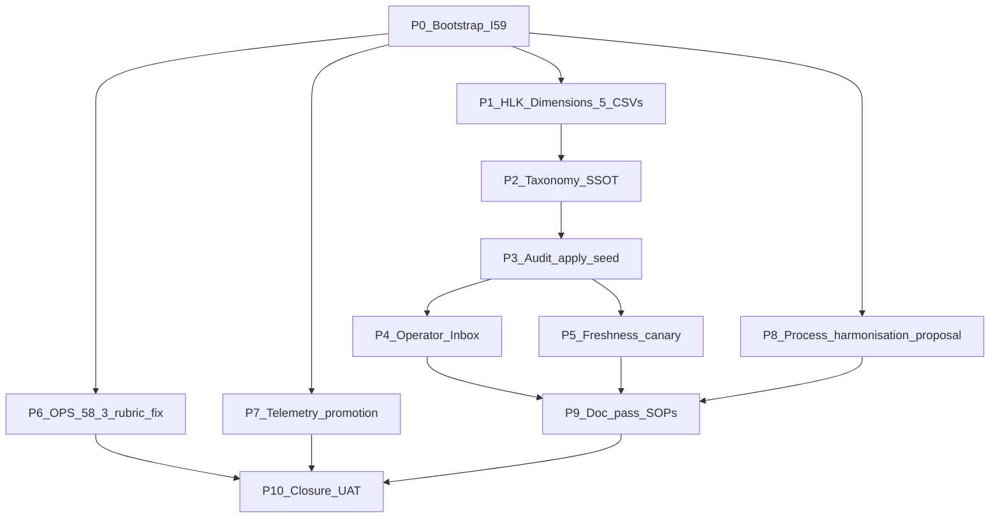

# Initiative 59 — HLK governance promotion + clean slate cycle (5 dimensions + I60/I61 lookahead)

**Folder:** `docs/wip/planning/59-hlk-governance-clean-slate/`
**Status:** **Active** — bootstrapped 2026-05-06.
**Authoritative plan:** [`~/.cursor/plans/i59_clean_slate_taxonomy_5fea803a.plan.md`](#) (preserved verbatim; this master-roadmap is the canonical workspace artifact).
**Predecessors:** [I58](../58-cycle-2-multi-track-forward/master-roadmap.md) (closed engineering + operator side 2026-05-06).

## Outcome

After I58 closed, the planning workspace surfaced a structural ambiguity: ~16 initiatives showed `active` in the WIP dashboard, but only ~5 were genuinely in execution. The rest were continuous loops (I06/I55), program-line items (I04/I08/I14), gated on external events (I12/I56), gated on operator content (I24), or completable but never closed (I02/I07/I15/I09 + F-22a-EMIT/OPS-55-1-P1 stale-doc gaps). Two repeat-offender problems compounded: (a) no governed taxonomy for "active by design vs deferred"; (b) no compliance dimension for the planning workspace itself, while every other Holistika dimension (PERSONA / POLICY / GOI / SKILL / TOPIC / PROGRAM) has been promoted to a CSV-governed primary registry.

I59 fixes both:

1. **Governance promotion.** Five new HLK-governed compliance dimensions land — `REPOSITORY_REGISTRY.csv`, `INITIATIVE_REGISTRY.csv`, `OPS_REGISTER.csv`, `CYCLE_REGISTER.csv`, `DECISION_REGISTER.csv` — each with Pydantic schema + validator + Supabase mirror + RLS + tests + PRECEDENCE row + KM manifest, plus two new SOPs at v3.0 codifying the lifecycle (`SOP-INITIATIVE_GOVERNANCE_001.md`) and the process_list harmonisation recipe (`SOP-INITIATIVE_PROCESS_HARMONISATION_001.md`). The two-layer SSOT pattern (markdown↔CSV) preserves prose authoring while making metadata queryable from Supabase.
2. **Clean slate.** The new taxonomy enum (`closed` / `archived` / `active` / `continuous` / `program_line` / `gated_external` / `gated_operator`) is applied to every initiative master-roadmap AND seeded into INITIATIVE_REGISTRY.csv. I02 + I07 + I15 close with closure UATs; I09 archives (superseded by I10); F-22a-EMIT-1/2 + OPS-55-1 P1 stale-doc gaps flip to DONE. The 12 long-running initiatives get re-statused with the new vocabulary.
3. **Operator surfaces.** A new `OPERATOR_INBOX.md` is auto-rendered from `OPS_REGISTER.csv` (status=open AND owner_class IN (operator, mixed) ORDER BY rice_score DESC) — one ranked file the operator reads to know what blocks them. A new cycle-staleness canary nudges if `active` initiatives go untouched > 14 days.
4. **Engineering follow-up from I58.** OPS-58-3 (rubric calibration fix; RICE 149) closes inside this cycle; the offline `_heuristic_persona_fit` path now resolves persona context from `scenario.persona_id` so cross-persona alignment lifts from 0% / 5.7% (I58 A.1+A.2 evidence) to ≥80%.
5. **Recurring routine in operator's stead.** The telemetry → scenario promotion script runs once in P7; proposals + triage report land for operator merge at next sitting (auto-merge forbidden per I49 P11 / I50 P5 design).
6. **Forward agenda for I60 + I61.** The process_list harmonisation proposal (P8) recommends ~17 candidate `process_list.csv` rows across 6 program tranches, drafts the harmonisation SOP at `status: review`, and hands a clean operator-approval-gated agenda to I60.

The cycle-3 posture matches the I57/I58 stub-mode-then-OPS-* pattern: AKOS ships P0 + P1 + P2 + P3 (engineering) + P4 + P5 + P6 + P7 + P8 (proposal) + P9 + P10 (closure); the operator-content-gated work (process_list mints, OpenAI rotation, GraphRAG live wiring, first advisor reply, Wave-2 Section 3 voice profiles) stays governed through OPS_REGISTER.csv as I60+ candidate scope.

## Why now

- **I58 is closed but the workspace ambiguity persists.** Until taxonomy lands, every cycle re-discusses "what's truly open" (a process-engineering smell).
- **Five HLK-governed dimensions follow an established pattern reused 11× already** — the marginal cost of adding five more is low.
- **DECISION_REGISTER hardens forward-compat.** INITIATIVE_REGISTRY.inception_decision_id starts as a real FK instead of a string ALTER TABLE'd later.
- **OPS-58-3 RICE = 149** is the highest-RICE engineering follow-up; folding it into this cycle's ride-along closes the only FAILing axis from I58's calibration burns.
- **Operator framing 2026-05-06:** "Go all out, I want a clean slate. Everything must be completed (not the active ones)" + "we already govern repos, shouldn't we govern their initiatives better?" + "you are the operator assistant, things you can do in my stead."

## Scope decisions

| In scope | Out of scope |
|:---|:---|
| 5 new HLK-governed compliance dimensions (REPOSITORY/INITIATIVE/OPS/CYCLE/DECISION) shipped atomically per the established HLK pattern | Replacing per-initiative `decision-log.md` files (CSV is governed metadata frame; markdown stays canonical for prose) |
| 2 new SOPs at v3.0 (initiative governance + process harmonisation), authored at `status: review`; G-59-D ratifies at P9 | Authoring `DECISION_REGISTER.csv` rows for every commit-message-only decision (best-effort audit only; idempotent CSV append later) |
| Status taxonomy enum (7 values) shared by master-roadmap.md frontmatter validator AND INITIATIVE_REGISTRY.csv schema | Touching `process_list.csv` (operator-content per `.cursor/rules/akos-governance-remediation.mdc`; I60 candidate mints with G-60-N gates) |
| `OPERATOR_INBOX.md` auto-rendered from OPS_REGISTER.csv | Manually-curated operator inbox |
| Cycle-staleness canary (14-day default; informational) | Hard-fail release-gate on stale `active` initiatives |
| Close I02 + I07 + I15 (with closure UATs) + archive I09 (superseded by I10) | Closing genuinely active I03/I08/I11/I13/I17 |
| Doc-sync flips F-22a-EMIT-1/2 (I22a) + OPS-55-1 P1 (I55) | Closing externally-gated I12 / I56 (status flip only; no fake closure event) |
| OPS-58-3 rubric fix (engineering-side; RICE 149) | OPS-58-2 (operator key rotation) — stays in OPERATOR_INBOX |
| Telemetry → scenario promotion proposal run (operator routine in stead) | Telemetry → scenario merge (auto-merge forbidden; operator merges) |
| Process_list harmonisation **proposal** (per-initiative manifests_processes recommendations + tranche-grouped candidate rows) | Process_list mints (operator-content; I60 candidate) |
| `manifests_processes` semicolon-list FK column added to INITIATIVE_REGISTRY.csv schema as **nullable** | Populating it in I59 |
| `inception_decision_id` / `closure_decision_id` real FKs to DECISION_REGISTER.csv (not strings) | DECISION_REGISTER for governance-decisions-from-commit-messages |
| `RUNTIME_INVENTORY.csv` / `EVIDENCE_MATRIX_ROWS.csv` / `RISK_REGISTER_ROWS.csv` as future dimension candidates | Authoring any of those in I59 |

## Asset classification (per [`PRECEDENCE.md`](../../../references/hlk/compliance/PRECEDENCE.md))

See [`asset-classification.md`](asset-classification.md) for the full table. Summary: 5 new canonical CSV dimensions + 5 mirror tables + 2 new canonical SOPs + 2 KM manifests + ~50 modified canonical (initiative master-roadmaps re-statused) + ~3 new canonical (closure UATs for I02/I07/I15) + 1 modified canonical (I09 archive flip).

## Phase dependency

P1 is the long pole (5 HLK dimensions atomic commit). P2 reuses P1's enum module. P3 is the bulk audit + CSV seed. P6/P7/P8 run independently after P0. P4+P5 depend on P3's seeded registries. P9+P10 close.

## Phase at a glance

| # | Phase | Output | Status |
|:--:|:------|:-------|:-------|
| **P0** | Bootstrap | Six governance artefacts under `docs/wip/planning/59-hlk-governance-clean-slate/`; planning README row 59; CHANGELOG entry | **Done** (2026-05-06) |
| **P1** | 5 HLK dimensions | `REPOSITORY_REGISTRY.csv` + `INITIATIVE_REGISTRY.csv` + `OPS_REGISTER.csv` + `CYCLE_REGISTER.csv` + `DECISION_REGISTER.csv` + Pydantic schemas + 5 validators + 3 sync validators + 5 migrations + 5 mirror-emit helpers + 2 new SOPs at `status: review` | **Done** (2026-05-06) |
| **P2** | Status taxonomy SSOT | `akos/planning/status_taxonomy.py` enum module + frontmatter validator + dashboard renderer section split + frontmatter↔CSV sync validator | Engineering |
| **P3** | Audit + tag + REGISTRY seed | All ~50 master-roadmap.md status flips + 5 CSVs seeded + close I02/I07/I15 + archive I09 + doc-sync I22a/I55 stale rows | Engineering + G-59-A/B/C |
| **P4** | Operator Inbox SSOT | `docs/wip/planning/OPERATOR_INBOX.md` auto-rendered from OPS_REGISTER.csv via new `scripts/render_operator_inbox.py` | Engineering |
| **P5** | Cycle staleness canary | New `scripts/check_active_initiative_freshness.py`; 14-day default; soft warning | Engineering |
| **P6** | OPS-58-3 rubric fix | `_heuristic_persona_fit` resolves persona from `scenario.persona_id`; A.1+A.2 burns re-run; OPS-58-3 OPS_REGISTER row flipped to closed | Engineering |
| **P7** | Telemetry promotion (in stead) | `scripts/promote_telemetry_to_scenario.py --since-days 30` run; triage report + OPS-59-1 row minted | Engineering (operator merges later) |
| **P8** | Process_list harmonisation proposal | Per-initiative manifests_processes recommendations + ~17 candidate `process_list.csv` rows across 6 program tranches + draft `SOP-INITIATIVE_PROCESS_HARMONISATION_001.md` at `status: review` + I60 candidate placeholder | Engineering (NO process_list mints) |
| **P9** | Documentation pass + 2 SOPs ratification | USER_GUIDE.md + ARCHITECTURE.md + planning README + CHANGELOG.md + SOP.md doc-sync + 2 KM manifests + G-59-D ratifies both new SOPs | Engineering + G-59-D |
| **P10** | Closure UAT | 22-check verification matrix; `reports/uat-i59-clean-slate-2026-05-06.md`; flip I59 closed in master-roadmap.md AND INITIATIVE_REGISTRY.csv; CYC-59 row to closed | Engineering |

## Verification matrix at P10

| Check | Profile / command | Cadence |
|:------|:------------------|:--------|
| `py scripts/legacy/verify_openclaw_inventory.py` | inventory | P10 |
| `py scripts/check-drift.py` | drift | P10 |
| `py scripts/test.py all` | full pytest sweep, target ≥1741 + ~95 new tests | P10 |
| `py scripts/browser-smoke.py` | HTTP smoke | P10 |
| `py -m pytest tests/test_api.py -v` | API smoke | P10 |
| `py scripts/validate_hlk.py` (with 5 new validators + 3 sync gates) | full vault | P10 + after every CSV change |
| `py scripts/check_process_list_header.py` | process_list header | P10 |
| `py scripts/validate_hlk_vault_links.py` | vault links | P10 |
| `py scripts/validate_hlk_km_manifests.py` (incl. 2 new SOP manifests) | KM manifests | P10 |
| `py scripts/validate_repository_registry.py` | new dimension | P10 + per-tranche |
| `py scripts/validate_repository_registry_md_csv_sync.py` | sync gate | P10 |
| `py scripts/validate_initiative_registry.py` | new dimension | P10 |
| `py scripts/validate_initiative_registry_frontmatter_sync.py` | sync gate | P10 |
| `py scripts/validate_ops_register.py` | new dimension | P10 |
| `py scripts/validate_cycle_register.py` | new dimension | P10 |
| `py scripts/validate_decision_register.py` | new dimension | P10 |
| `py scripts/validate_decision_register_decision_log_md_sync.py` | sync gate | P10 |
| `py scripts/verify.py compliance_mirror_emit` (5 new mirrors) | mirror emit | P10 |
| `py scripts/render_wip_dashboard.py --check-only` | dashboard determinism | P10 |
| `py scripts/render_operator_inbox.py --check-only` | inbox determinism | P10 |
| `py scripts/check_active_initiative_freshness.py` | freshness canary | P10 (informational) |
| `py scripts/release-gate.py` | 8/8 closure gate | P10 |

## Operator approval gates

- **G-59-A** (P1 close) — Operator approves the **five** new CSVs' inception in one batch (substantial canonical addition; ~30-min review of the design + asset-classification + draft SOP table-of-contents).
- **G-59-B** (P3.6 close) — Operator approves the ~50 INITIATIVE_REGISTRY.csv seed rows (per-row rationale in `reports/p3-initiative-registry-seed-2026-05-06.md`).
- **G-59-C** (P3.9 close) — Operator approves the **~16 OPS_REGISTER + 4 CYCLE_REGISTER + ~47 DECISION_REGISTER seed rows** in one combined review (related concerns; ranked + cross-referenced; ~45-min read).
- **G-59-D** (P9 close) — Operator approves the **two** new SOPs (`SOP-INITIATIVE_GOVERNANCE_001.md` + `SOP-INITIATIVE_PROCESS_HARMONISATION_001.md`); both flip from `status: review` to `status: active`.

## Decisions seeded (D-IH-59-A through N)

See [`decision-log.md`](decision-log.md) for the full text. Summary:

- **D-IH-59-A** — HLK governance promotion model: five dimensions land atomically (vs incremental).
- **D-IH-59-B** — Two-layer SSOT: markdown for prose, CSV for governed metadata; sync validators enforce.
- **D-IH-59-C** — REPOSITORY_REGISTRY.csv promotes the existing markdown SSOT to a governed dimension; both stay canonical.
- **D-IH-59-D** — Status taxonomy: 7 values with companion-field rules (closed/archived/active/continuous/program_line/gated_external/gated_operator).
- **D-IH-59-E** — DECISION_REGISTER folded into I59 (vs I60 deferral) — marginal cost; high leverage; forward-compat avoids ALTER TABLE.
- **D-IH-59-F** — Process_list harmonisation deferred to I60 — operator-content per `akos-governance-remediation.mdc`; I59 ships proposal + draft SOP only.
- **D-IH-59-G** — `manifests_processes` semicolon-list FK column added nullable in I59 — receiver column for I60 mints.
- **D-IH-59-H** — Two SOPs authored at v3.0 (governance + harmonisation); both at `status: review` until G-59-D.
- **D-IH-59-I** — OPS-58-3 path A: resolve persona in burn harness from `scenario.persona_id`.
- **D-IH-59-J** — Telemetry routine in operator's stead (proposal-only run in P7; OPS-59-1 minted for merge).
- **D-IH-59-K** — Operator approval gates G-59-A/B/C/D batched to minimize review fatigue (~2h total operator time).
- **D-IH-59-L** — `scripts/scaffold_initiative.py` stretch goal — defer to I60+ if effort exceeds budget.
- **D-IH-59-M** — Folder/role/artifact recommendations: keep `<NN>-<slug>/` convention; no new roles; existing six per-initiative artefacts codified by new SOP.
- **D-IH-59-N** — I59 closure decision (recorded at P10): cycle complete; I60 candidate handed off cleanly.

## Risks (R-59-1 through R-59-13)

See [`risk-register.md`](risk-register.md) for the full table. Summary:

- **R-59-1** — Audit misclassification (Low/Med; explore-subagent verdict at P3 baseline).
- **R-59-2** — Dashboard render regression (Low/Low; determinism gate + tests).
- **R-59-3** — Inbox sync drift (Low/Low; determinism gate + tests).
- **R-59-4** — Markdown↔CSV drift (Med/Med; sync validators fail CI).
- **R-59-5** — FK orphans (Low/High; validators enforce all FKs at commit time).
- **R-59-6** — Mirror-emit RLS regression (Low/High; mirror tests + rollback).
- **R-59-7** — Mass-rename merge conflict (Med/Low; per-phase commit discipline).
- **R-59-8** — SOP authoring scope creep (Med/Med; both SOPs at `status: review`; G-59-D constrains).
- **R-59-9** — P1 long-pole effort drift (Med/Low; sub-phases independently shippable).
- **R-59-10** — Operator approval-gate fatigue (Med/Low; batched G-59-* gates).
- **R-59-11** — Markdown↔CSV sync drift in steady state (Low/Med; 3 sync validators).
- **R-59-12** — I60 candidate scope creep (Low/Low; `akos-governance-remediation.mdc` blocks process_list mints; SOP at `status: review`).
- **R-59-13** — DECISION_REGISTER seed audit incomplete (Low/Low; idempotent CSV append later).

## Success metrics (closure conditions)

**Engineering side (I59 closes at P10):**

- 5 new compliance CSVs landed with validators + mirrors + tests + PRECEDENCE rows + KM manifests
- 2 new SOPs at v3.0 with `status: active` after G-59-D
- All ~50 initiative master-roadmaps re-statused per the 7-value enum
- INITIATIVE_REGISTRY.csv has one row per initiative; markdown↔CSV sync validator PASS
- OPERATOR_INBOX.md auto-renders from OPS_REGISTER.csv with ≥5 ranked rows
- Cycle staleness canary runs informationally
- I02 / I07 / I15 closed with closure UATs; I09 archived; F-22a-EMIT + OPS-55-1 P1 doc-sync done
- OPS-58-3 rubric fix achieves ≥80% persona_fit alignment in re-run A.1+A.2 burns
- Telemetry promotion script run in stead; OPS-59-1 minted
- Process_list harmonisation proposal produced; SOP at `status: review` ready for I60 ratification
- All 22 verification-matrix checks PASS

**Operator side (handed off at I60+):**

- OPS-58-2 (1-min paste) — operator rotates OpenAI key
- OPS-55-1 / OPS-14-1 / OPS-56-1 / OPS-58-4 / OPS-59-1 — operator schedules per RICE
- I60 candidate (process_list harmonisation mint) — operator schedules with G-60-N tranche gates

## What this is NOT

- Not a rewrite of any existing initiative; the master-roadmap.md prose stays canonical.
- Not a replacement for `process_list.csv`; we add a `manifests_processes` FK column and a harmonisation proposal, not new rows.
- Not a Supabase-write surface; CSVs stay git-canonical, mirrors are read-only projections.
- Not a tool for inventing new IDs; agent never mints `initiative_id` / `ops_action_id` / `cycle_id` / `decision_id` / `repo_slug` outside the I59 P3 seed (which carries operator approval gates).
- Not the I60 / I61 work itself (process_list mints + deeper artifact-process mapping); those are forward candidates with explicit gates.

## Reporting artifacts

- `reports/p0-bootstrap-2026-05-06.md` (this commit's bootstrap evidence)
- `reports/p1-hlk-dimensions-2026-05-06.md` (the 5-CSV + 2-SOP commit)
- `reports/p2-status-taxonomy-2026-05-06.md`
- `reports/p3-status-audit-2026-05-06.md` + `reports/p3-repository-registry-seed-2026-05-06.md` + `reports/p3-initiative-registry-seed-2026-05-06.md` + `reports/p3-ops-register-seed-2026-05-06.md` + `reports/p3-cycle-register-seed-2026-05-06.md` + `reports/p3-decision-register-seed-2026-05-06.md`
- `reports/uat-i59-close-i02-2026-05-06.md` + `reports/uat-i59-close-i07-2026-05-06.md` + `reports/uat-i59-close-i15-2026-05-06.md`
- `reports/p4-operator-inbox-2026-05-06.md`
- `reports/p5-freshness-canary-2026-05-06.md`
- `reports/p6-ops-58-3-rubric-fix-2026-05-06.md`
- `reports/p7-telemetry-triage-2026-05-06.md`
- `reports/p8-process-list-harmonisation-proposal-2026-05-06.md`
- `reports/p9-doc-pass-2026-05-06.md`
- `reports/uat-i59-clean-slate-2026-05-06.md` (P10 closure)

## Cross-references

- I58 closure (immediate predecessor): [`58-cycle-2-multi-track-forward/master-roadmap.md`](../58-cycle-2-multi-track-forward/master-roadmap.md)
- HLK pattern reference (closest in-repo dimension to copy): `scripts/validate_skill_registry.py` + `akos/hlk_skill_registry_csv.py` + `docs/references/hlk/compliance/dimensions/SKILL_REGISTRY.csv`
- Repos markdown SSOT (CSV-promotion source): `docs/references/hlk/v3.0/Envoy Tech Lab/Repositories/REPOSITORIES_REGISTRY.md`
- SOP-META precedent (CSV before SOP): `docs/references/hlk/compliance/SOP-META_PROCESS_MGMT_001.md`
- Mirror-emit pattern: `scripts/sync_compliance_mirrors_from_csv.py`
- AKOS governance rules followed throughout: [`akos-mirror-template`](../../../../.cursor/rules/akos-mirror-template.mdc), [`akos-governance-remediation`](../../../../.cursor/rules/akos-governance-remediation.mdc), [`akos-planning-traceability`](../../../../.cursor/rules/akos-planning-traceability.mdc), [`akos-docs-config-sync`](../../../../.cursor/rules/akos-docs-config-sync.mdc)

## Cross-cutting

- Decision IDs: D-IH-59-A through N (14 seeded; operator-ratified at the I59 greenlight session 2026-05-06).
- All vault and report documents carry `language: en` frontmatter (per `SOP-HLK_LOCALISATION_001.md`).
- WIP_DASHBOARD picks this row up automatically once `master-roadmap.md` is committed.
- CHANGELOG entry on bootstrap (P0) and closure (P10).
