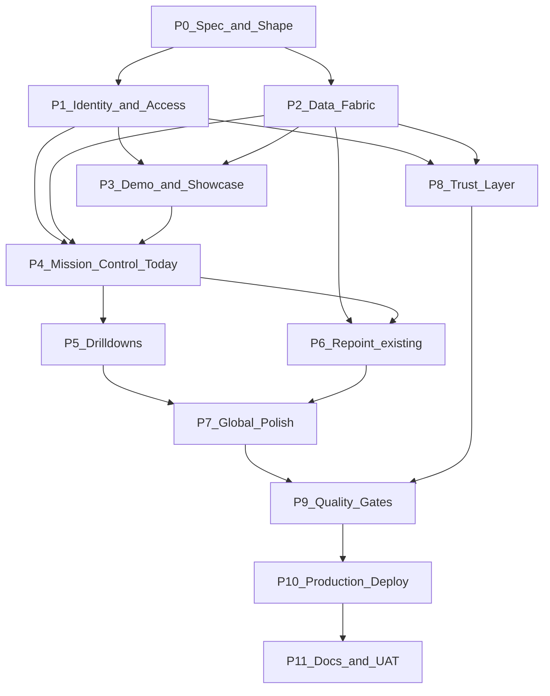

# Initiative 62 — Mission Control (hlk-erp magnificent ERP)

**Folder:** `docs/wip/planning/62-mission-control/`
**Status:** **Active** — P0 bootstrapped 2026-05-06.
**Authoritative plan:** `~/.cursor/plans/hlk-erp_mission_control_magnificent_5aa05486.plan.md` (preserved verbatim; this master-roadmap is the canonical workspace mirror).
**Predecessors:** [I32](../32-holistik-ops-maturation/master-roadmap.md) (ERP handoff bundle 2026-04-30), [I59](../59-hlk-governance-clean-slate/master-roadmap.md) (5 HLK-governed dimensions + status taxonomy + OPERATOR_INBOX).

## Outcome

Transform the external [`hlk-erp`](https://github.com/FraysaXII/hlk-erp) repository from a v0-scaffolded shell with mocked data into a production-grade, governance-clean, role-aware **Mission Control** for the Holistika operating system: wiring the ERP to AKOS canonical mirrors, adding authentication + RBAC + audit, a separate showcase/demo mode for safe show-offs, and a polished UX layer that respects the AKOS brand and planning-traceability rules.

The ERP is the operator's **reading room** for everything HLK / MADEIRA produces. It does not author governance — that's AKOS. It does not ingest documents — that's KirBe. Its single job is to make the operating system legible. After I62, opening `erp.holistika.com` answers "is the system safe to ship today?" in one screen and lets the operator drill into every governed dimension; opening `madeira.holistika.com` shows the same surface fed by fictional-but-realistic demo data, brand-clean, no-auth, safe to share with advisors.

## Why now

- **I32 P8 already shipped a 7-file handoff bundle** to the ERP team ([`erp-handoff-bundle-2026-04-30/`](../32-holistik-ops-maturation/reports/erp-handoff-bundle-2026-04-30/)) but the ERP repository has not yet absorbed it: 16 mirrors are documented, 0 are wired into screens.
- **I59 closed the planning workspace governance gap** with `INITIATIVE_REGISTRY.csv`, `OPS_REGISTER.csv`, `CYCLE_REGISTER.csv`, `DECISION_REGISTER.csv`, `OPERATOR_INBOX.md` — perfect substrate for an operator-facing surface that surfaces those rows live.
- **The current ERP `tech-lab/project-madeira` page hard-codes "99.9% Uptime / 10x Faster / SOC 2 Compliant"** — marketing voice on a stub with no data. We replace fake numbers with honest live numbers from `validation_runs` + `compliance.mirror_health`.
- **Operator showcase ask 2026-05-06:** "I want to show off my ERP but the data is fake. If we fill it with real data, we need that logic & decisions to be well designed." The `madeira.holistika.com` showcase + demo schema lets the operator share a memorable URL with advisors/investors without leaking real GOI/POI / FINOPS counterparty data.
- **No auth exists today.** `components/user-nav.tsx` hard-codes `"Admin" / admin@holistika.com`; no `middleware.ts`; only `@supabase/supabase-js` in deps but unused. Production-readiness gates must close before the team uses the ERP day-to-day.

## Scope decisions

| In scope | Out of scope |
|:---|:---|
| Mission Control "Today" board (7 tiles) reading from 16 `compliance.*_mirror` tables + 5 new `erp.*` views | Authoring HLK content in the ERP (governance lives in AKOS per [EXTERNAL_REPO_CONTRACT.md](https://github.com/FraysaXII/hlk-erp/blob/main/EXTERNAL_REPO_CONTRACT.md)) |
| Identity + RBAC backbone mapped to AKOS `baseline_organisation.access_level` (0-6) | Replacing AKOS-canonical access levels (mirror-only consumption) |
| New `erp.*` Postgres schema for read-side projection views | Authoring the ERP schema on the AKOS side (created via SQL gate, owned by the ERP application) |
| Demo / showcase mode (separate `demo.*` schema + `madeira.holistika.com` Vercel project) | Customer-facing SaaS productisation (KirBe scope) |
| New canonical AKOS asset `SUBDOMAINS_REGISTRY.md` governing every Holistika subdomain | Fancy DNS automation (Vercel handles DNS via project domain attach) |
| 18 new operator-only routes under `/mission-control` and `/operations` and `/external-engagement` | Replacing the existing `/dashboard`, `/processes`, `/components`, `/organization`, `/sales` shells (repointed, not rebuilt) |
| Trust layer: audit log + Sentry + health endpoints + status page + freshness ribbon | A separate observability vendor (Sentry covers crashes; Langfuse covers eval traces; existing tools suffice) |
| Quality gates: Playwright e2e + axe-core + brand-jargon lint + Lighthouse CI + perf budgets | A second QA vendor; we extend the AKOS gates already in `release-gate.py` |
| Three Vercel projects (production / preview / showcase) governed by `SUBDOMAINS_REGISTRY.md` | Multi-region or multi-cloud deploy (single-region Vercel + Supabase suffices) |
| Brand-jargon CI gate on `app/showcase/**` + `app/(marketing)/**` | Forbidding internal jargon on operator surfaces (allowed per [BRAND_JARGON_AUDIT.md](../../../references/hlk/v3.0/Admin/O5-1/Marketing/Brand/BRAND_JARGON_AUDIT.md) §3 "Out of scope") |

## Asset classification (per [`PRECEDENCE.md`](../../../references/hlk/compliance/PRECEDENCE.md))

See [`asset-classification.md`](asset-classification.md) for the full table. Summary:

- **Canonical (new)**: `SUBDOMAINS_REGISTRY.md` (under `docs/references/hlk/v3.0/Envoy Tech Lab/Repositories/`) + `scripts/validate_subdomains_registry.py` + a `release-gate.py` step. Parallels the [`FIGMA_FILES_REGISTRY.md`](../../../references/hlk/v3.0/Envoy Tech Lab/Repositories/FIGMA_FILES_REGISTRY.md) and [`REPOSITORIES_REGISTRY.md`](../../../references/hlk/v3.0/Envoy Tech Lab/Repositories/REPOSITORIES_REGISTRY.md) patterns.
- **Mirrored / derived (new)**: `erp.*` schema with five views (`vw_three_lights_status`, `vw_mission_control_today`, `vw_operator_inbox_top`, `vw_initiative_pulse`, `vw_mirror_health`) plus `erp.vw_public_health` for the public status page. Consumed read-only from the ERP. Demo-aware via session GUC `app.data_mode`.
- **ERP-canonical (write-side, new)**: `holistika_ops.user_role_mapping`, `holistika_ops.audit_log`, `holistika_ops.user_preferences`, `holistika_ops.notifications`. Migration ships through the same operator-SQL gate.
- **Reference-only (new)**: 6 governance artefacts in this folder (master-roadmap + decision-log + asset-classification + evidence-matrix + risk-register + impeccable-shape reports + UAT reports).

## Phase dependency

## Phase at a glance

| Phase | Purpose | Key deliverable / gate |
|:---|:---|:---|
| **P0** | Spec & Shape | This roadmap + decision-log + 3 Impeccable shape docs + schema-discovery report + new `SUBDOMAINS_REGISTRY.md` canonical asset |
| **P1** | Identity & Access | Supabase Auth + middleware + RBAC schema (`holistika_ops.user_role_mapping`/`audit_log`/`user_preferences`) + feature-gate library + founder impersonation; G-62-A operator approval on RBAC route matrix |
| **P2** | Data Fabric | Supabase client split + TanStack Query + new `erp.*` schema + 5 derived views + freshness pattern + `lib/data.ts` deletion; G-62-B operator approval on `erp.*` SQL proposal |
| **P3** | Demo & Showcase | `demo.*` schema + idempotent seeder + `DATA_MODE` toggle + showcase Vercel project on `madeira.holistika.com` |
| **P4** | Mission Control "Today" | One screen, seven live tiles, brand tokens applied; first founder UAT row |
| **P5** | Drill-downs | 7 drill-down pages with TanStack Table + Vaul drawers + saved views + CSV/print export |
| **P6** | Repoint existing rooms | Replace `lib/data.ts` callers; add 14 new mirror-backed rooms (Personas, Channels, Programs, Topics, Skills, Policies, Disciplines, Open Questions, Filed Instruments, Counterparties, Sourcing, Dossiers, Knowledge Graph iframe, Madeira Console iframe) |
| **P7** | Global polish | Cmd+K palette + global verdict chip + notifications + bookmarks + saved views + density/locale/theme switchers + time-travel + AI-assist (Cmd+J) |
| **P8** | Trust layer | Audit-log dashboard + Sentry + health/ready/status endpoints + freshness ribbon + changelog drawer + onboarding tour + `/help` + GDPR surface |
| **P9** | Quality gates | Playwright + axe-core + brand-jargon lint + Lighthouse CI + bundle budgets + strict TS + security headers + Dependabot + GitHub Actions |
| **P10** | Production deploy | 3 Vercel projects + 2 Supabase projects + secrets rotation + PITR + DR runbook + Sentry alerts + Slack webhook + rate limits |
| **P11** | Docs & UAT closure | AKOS USER_GUIDE / ARCHITECTURE updates + ERP README/CONTRIBUTING/CHANGELOG + new `.cursor/rules/hlk-erp-mission-control.mdc` + final UAT report; flip status to `closed` |

## Key decisions seeded

See [`decision-log.md`](decision-log.md) for the full register. 18 decisions D-IH-62-A..R covering auth, RBAC, demo data, subdomain governance, schema design, MCP toolchain, and UX defaults.

## Operator approval gates

| Gate | Phase | What it ratifies |
|:---|:---|:---|
| **G-62-A** | P1.4 | Route × access-level matrix (who sees what) |
| **G-62-B** | P2.3 | `CREATE SCHEMA erp` + 5 views + `holistika_ops.*` RBAC tables SQL proposal |
| **G-62-C** | P3.4 | `madeira.holistika.com` showcase deploy (data-only-fictional gate) |
| **G-62-D** | P10.1 | Three-Vercel-project topology + secrets rotation cadence |
| **G-62-E** | P11.5 | Closure UAT (founder walks every route per role via impersonation) |

## Verification matrix

Run before declaring closure:

- AKOS-side: `py scripts/verify.py pre_commit`
- AKOS-side: `py scripts/release-gate.py` (now includes `validate_subdomains_registry.py`)
- AKOS-side: `py scripts/validate_hlk.py` (when compliance assets touched)
- ERP-side: `npm run lint && npm run typecheck && npm run test:ci && npm run test:e2e`
- ERP-side: `npm run lighthouse` (Lighthouse CI)
- ERP-side: `npm run lint:jargon` (brand-voice fast-lint on showcase + marketing)
- ERP-side: `npm run a11y` (axe-core report)
- Manual: founder UAT walkthrough per the role matrix.
- Manual: advisor preview on showcase deploy with brand-jargon scan.

UAT evidence per phase: `reports/uat-mission-control-<phase>-<YYYYMMDD>.md` per [.cursor/rules/akos-planning-traceability.mdc](../../../../.cursor/rules/akos-planning-traceability.mdc).

## Cross-references

- AKOS contract: [EXTERNAL_REPO_CONTRACT.md](https://github.com/FraysaXII/hlk-erp/blob/main/EXTERNAL_REPO_CONTRACT.md)
- ERP handoff bundle: [erp-handoff-bundle-2026-04-30/](../32-holistik-ops-maturation/reports/erp-handoff-bundle-2026-04-30/)
- Mirror schema map: [01-mirror-schema-map.md](../32-holistik-ops-maturation/reports/erp-handoff-bundle-2026-04-30/01-mirror-schema-map.md)
- 5-axis integration spec: [02-five-axis-integration-spec.md](../32-holistik-ops-maturation/reports/erp-handoff-bundle-2026-04-30/02-five-axis-integration-spec.md)
- ERP architecture audit: [erp-architecture-audit-2026-04-30.md](../32-holistik-ops-maturation/reports/erp-architecture-audit-2026-04-30.md)
- Operator SQL gate: [operator-sql-gate.md](../14-holistika-internal-gtm-mops/reports/operator-sql-gate.md)
- Brand voice + visual SSOT: [PRODUCT.md](../../../../PRODUCT.md), [DESIGN.md](../../../../DESIGN.md), [BRAND_JARGON_AUDIT.md](../../../references/hlk/v3.0/Admin/O5-1/Marketing/Brand/BRAND_JARGON_AUDIT.md), [BRAND_VISUAL_PATTERNS.md](../../../references/hlk/v3.0/Admin/O5-1/Marketing/Brand/BRAND_VISUAL_PATTERNS.md)
- Planning traceability: [.cursor/rules/akos-planning-traceability.mdc](../../../../.cursor/rules/akos-planning-traceability.mdc)
- Holistika operations rules: [.cursor/rules/akos-holistika-operations.mdc](../../../../.cursor/rules/akos-holistika-operations.mdc)
- Madeira management: [.cursor/rules/akos-madeira-management.mdc](../../../../.cursor/rules/akos-madeira-management.mdc)
- Reference Impeccable shape: [impeccable-shape-madeira-control-2026-05-03.md](../49-madeira-management-rollup/reports/impeccable-shape-madeira-control-2026-05-03.md)

## Estimated effort

~5-6 weeks of focused work, split into 12 phases that can be reviewed and merged independently.

## Cross-repo governance follow-up (2026-05-06)

I62 P1-P3 surfaced a new, generalisable concern: how AKOS keeps the
governance + CI/CD + observability surface of *every* Holistika-tracked
external repo aligned without asking the operator to hand-copy from the
canonicals every time. We answered it with the **External Repo Bless
Pattern** — an executable scaffolder
([`scripts/bless_external_repo.py`](../../../../scripts/bless_external_repo.py)),
9 automation scripts (drift PR, posture check, snapshot, secret rotation
reminders, branch protection, type regen, Vercel provisioning, canonical
change broadcast, un-blessed row detection), 22 templates, and a release-gate
hook. `hlk-erp` is the first beneficiary; future `kirbe-platform` and any
`client-delivery-*` repo onboard via `bless_external_repo.py --repo-slug
<slug>`.

The canonical artefact half of that work (a `process_list.csv` tranche,
three new `REPOSITORY_REGISTRY.csv` columns, three SOPs) lives in the
**sister initiative
[I63 — External Repo Governance Codification](../63-external-repo-governance-codification/master-roadmap.md)**
to keep I62 scoped to the operator surface and I63 scoped to canonical
governance. The two are independently reviewable; I62 closure does not
wait on I63 promotion.
