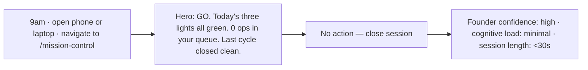
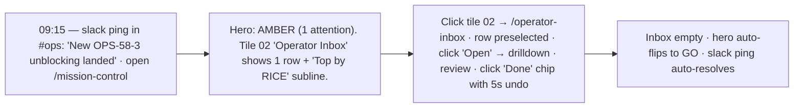
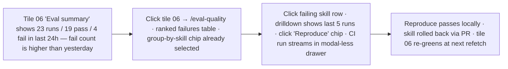
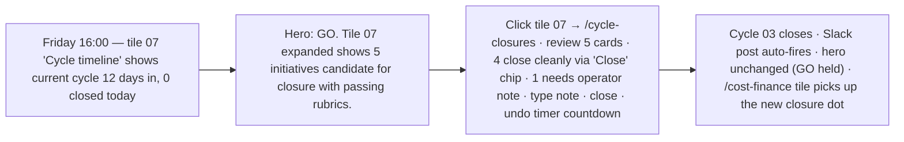
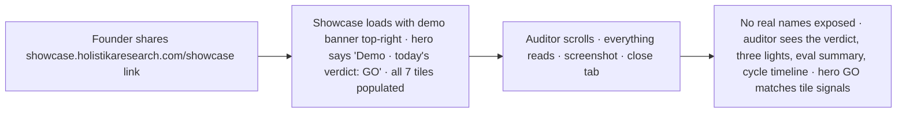

# Impeccable journeys — MADEIRA Mission Control (`hlk-erp` `/mission-control`)

> Companion to the **shape** report at [`impeccable-shape-mission-control-today-2026-05-06.md`](impeccable-shape-mission-control-today-2026-05-06.md). Where the shape report locks the **pieces** (palette, typography, tile primitive), this **journeys** report locks how those pieces are **used in time** by the three personas. Anchors: [`master-roadmap.md`](../master-roadmap.md), [`page-spec-2026-05-06.md`](page-spec-2026-05-06.md), [`SUBDOMAINS_REGISTRY.md`](../../../references/hlk/v3.0/Envoy%20Tech%20Lab/Repositories/SUBDOMAINS_REGISTRY.md), Impeccable design laws (`.cursor/skills/impeccable/SKILL.md`).

## 1. Whose grasp this is calibrated for

The MC Today board has three personas with three time budgets and three intents. **The board must serve all three without a mode toggle.**

| Persona | Path | Time | Intent | Failure looks like |
|:---|:---|:---|:---|:---|
| **Founder** (level 6) | `erp.holistikaresearch.com/mission-control` | <8s glance | "Anything broken?" | scrolling, opening drawers, asking team |
| **Ops operator** (level 4) | `erp.holistikaresearch.com/mission-control` | <90s scan | "What wants me?" | clicking through 3 tiles to find their queue |
| **Auditor** (level 1, demo) | `showcase.holistikaresearch.com/showcase` | <60s tour | "Is this thing real?" | empty tiles, contradictory numbers, jargon |

**The board is read-first.** Drilldowns absorb writes. The hero verdict carries the load — the seven tiles are scannable supporting evidence, not the primary reading surface.

## 2. The five journeys

### J-MC-1 — Founder safety check (8 seconds, mobile or desktop)



Grasp test passes only if the **first sentence on screen** carries all three numbers. The seven tiles below it should reinforce, not re-explain. If a Founder feels the need to read tile 02 to interpret tile 01, the hero copy has failed.

### J-MC-2 — Operator inbox triage (90 seconds, desktop)



Grasp test passes only if the operator can land on the right tile **without scanning all seven**. The hero's secondary line ("1 attention · Operator Inbox") tells them which tile to click. The seven tiles are alphabetized only when the hero is GREEN; when AMBER/RED, the relevant tile floats to position 02 ("attention pull").

### J-MC-3 — Eval regression sweep (180 seconds, desktop)



Grasp test passes only if "23 runs / 19 pass / 4 fail" is more legible than a 4-row sparkline. The shape report locked **mono-num tabular numerals** to make these triplets read as a unit, not as 3 separate cells.

### J-MC-4 — Cycle closure on Friday (180 seconds, desktop)



Grasp test passes only if the operator never sees a "Are you sure?" modal. The chip + 5s undo strip is the entire confirmation gesture (matching `/operator-inbox` and `/governance/external-repos`).

### J-MC-5 — Auditor demo on `showcase.holistikaresearch.com/showcase` (60 seconds, mobile or desktop)



Grasp test passes only if `?mode=demo` and `showcase.holistikaresearch.com/showcase` produce **identical** layouts and copy, only the data layer differs. The auditor should not encounter a parallel "lite" surface.

## 3. Per-tile grasp polish (the 7 tiles)

The shape report defined the tile primitive (`MissionControlTile`: numeric eyebrow, uppercase title, body, optional sparkline, optional drilldown chip). This section locks the **first sentence** of each tile so the Founder's 8-second glance reads as one paragraph from hero through tiles.

| Tile | First sentence (locked) | Why this works |
|:---|:---|:---|
| **01 · Three Lights** | `Conversational green · Dossier green · Skill quality green` | Three labels, three colors, no extra prose. Sparkline below the labels. |
| **02 · Operator Inbox** | `0 ops in your queue (last 24h: -2)` | "your" makes it personal even on a shared dashboard. `last 24h` delta gives momentum signal. |
| **03 · Initiative Pulse** | `47 active · 2 closed this week · 0 stalled` | Three numbers; `stalled` = not reviewed in 21d. Hides when zero across all states. |
| **04 · Cost & Finance** | `$2,470 spent this cycle · within envelope` | One number, one verdict word. No graph in the first sentence. |
| **05 · Compliance Pulse** | `16 of 16 mirrors green · last sync 4 min ago` | Reading-perfect: "16 of 16" beats "100%" because it carries the inventory size for free. |
| **06 · Eval Summary** | `23 runs / 19 pass / 4 fail · last 24h` | The slashes lock the triplet visually; tabular-nums lock the alignment. |
| **07 · Cycle Timeline** | `Cycle 03 · day 12 of 21 · 5 candidates for closure` | "day 12 of 21" reads like a marathon split, not a percentage. |

Microcopy laws: every first sentence ≤ 56 characters; no em-dashes (replaced with mid-dot `·`); no English/Spanish hedge words ("approximately", "around"); no jargon outside the public dictionary defined in `lib/i18n/`.

## 4. Governance chip — the I64 entry point

When I64 ships its `/operator/governance/external-repos/`, the MC verdict bar gets one new visual element (and **only** one) — a chip the size of the existing GO/AMBER/NO-GO chip, right of it:

```
[GO] [Governance · 0 / 1 / 0]    Mission Control · Today · 2026-05-07
       drifting · due · unblessed
```

Three numbers in `slug · num / num / num` shape, parallel with the eval summary triplet. Click → I64 page. **No new tile**. The MC tile count stays at exactly 7.

If governance state goes ember (≥1 drifting OR ≥1 secret due in 14d OR ≥1 unblessed), the chip color shifts to `--gov-attention` (warm-orange OKLCH) — visible in peripheral vision, not loud. If governance goes RED (any FAIL), the chip turns rust **and** the MC hero goes AMBER (governance failure escalates). This is a one-direction escalation: governance can pull MC down, but a governance GREEN never auto-flips MC to GO.

## 5. Anti-patterns rejected

The MC v1 was already impeccable. This report locks five rejections that an over-eager redesign might revisit:

1. **No "Refresh" button.** TanStack Query refetches on focus + 30s interval. The button is visual noise pretending to be agency.
2. **No skeletons longer than 400ms.** If the page can't render in 400ms, render the cached state with a freshness chip; never a wholesale skeleton.
3. **No traffic-light row tints.** Status is one dot + label per row. Tinting whole rows weakens the hero verdict (the only place color carries the load).
4. **No tile reordering toggle.** The order is locked: 01-07 with attention-pull when AMBER/RED. Founder muscle memory beats personalisation.
5. **No "What's new in v2" modal on first load.** Changelog lives in the existing changelog drawer (`components/changelog/changelog-drawer.tsx`), not a popover.

## 6. Acceptance criteria

| ID | Criterion | Verification |
|:---|:---|:---|
| MC-J-A | All 5 journeys pass their time budget on a 27" desktop @ 4G throttling (Lighthouse synthetic) | Playwright + LH CI per-journey |
| MC-J-B | Hero first sentence ≤ 56 chars across all 8 verdict states (GO×4 + AMBER×3 + NO-GO×1) | Snapshot test per state |
| MC-J-C | Tile 01-07 first sentences match the locked text in §3 | DOM snapshot per locale |
| MC-J-D | Governance chip renders 3 numbers and routes correctly to `/operator/governance/external-repos/` | Playwright link |
| MC-J-E | Demo mode (`?mode=demo` and `showcase.holistikaresearch.com/showcase`) produces identical DOM trees, only data differs | Playwright AST diff |
| MC-J-F | "Attention pull" — when verdict is AMBER/RED the relevant tile floats to position 02 | Snapshot test per simulated state |
| MC-J-G | No modal appears in any of J-MC-2, J-MC-3, J-MC-4 confirmation flows | Playwright DOM assertion |
| MC-J-H | `prefers-reduced-motion: reduce` strips all motion except the entry fade | a11y + manual |

## 7. Out of scope

- "Founder mode" personalisation (rejected per §5/4).
- Per-tile mute / pin (likewise).
- Cross-cycle comparison (moves to a future "Trends" page if needed).

## 8. Decision

This report locks the journey-level UX for `/mission-control`. It does not require a code change today — the I62 build already implements the shape and most of the language. P11 (post-P10) will tighten any tile copy that drifted from the locks in §3 and ship the governance chip alongside I64's first build commit.
