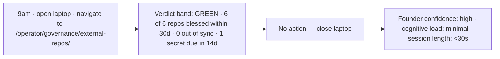
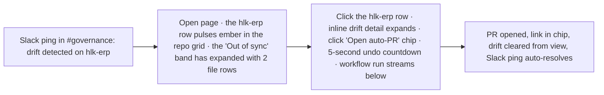
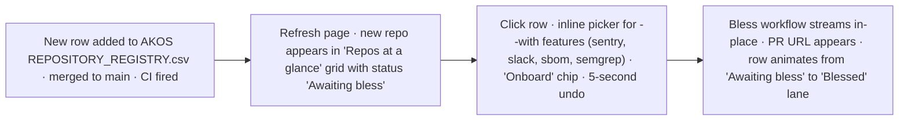
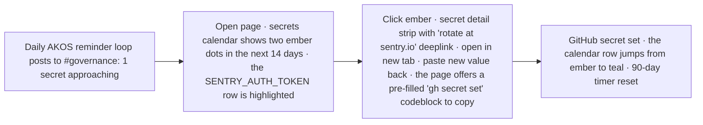
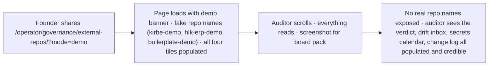
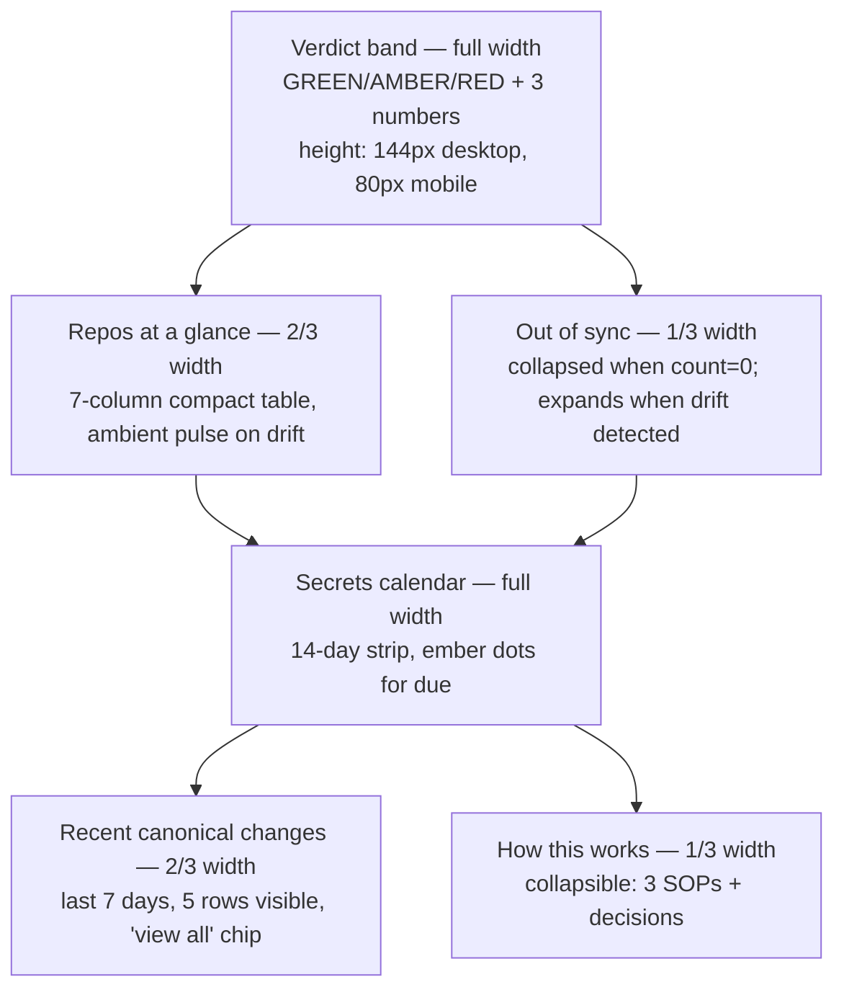

# Impeccable shape — Governance Mission Control (`hlk-erp` `/operator/governance/external-repos/`)

> **Operator approval gate before P3 build starts.**
> This report **supersedes** `reports/archive/page-spec-v1-2026-05-06.md` (the v1 was a structural panel-by-panel spec; the v2 below adds audience + journeys + impeccable laws and rejects 4 anti-patterns the v1 had drifted into). Anchors: [`master-roadmap.md`](../master-roadmap.md), [`62-mission-control` impeccable shape](../../62-mission-control/reports/impeccable-shape-mission-control-today-2026-05-06.md), [`SUBDOMAINS_REGISTRY.md`](../../../references/hlk/v3.0/Envoy%20Tech%20Lab/Repositories/SUBDOMAINS_REGISTRY.md), Impeccable design laws (`.cursor/skills/impeccable/SKILL.md`), `BRAND_VISUAL_PATTERNS.md`.

## 1. Audience and the one job

Three people will open this page. They share **one job**: *"Tell me, in one screen, whether external-repo governance is healthy and what — if anything — wants me right now."*

| Persona | Access | Time budget | Primary signal | Outcome |
|:---|:---|:---|:---|:---|
| **Founder / System Owner** (level 6) | full | **<10 seconds**, glance only | composite verdict + drift count | close laptop or escalate |
| **DevOPS engineer** (level 4) | full | **<3 visual hops** | drift inbox + secrets calendar | confirm an auto-PR or rotate |
| **Auditor / advisor** (level 1, demo mode) | demo only | **<60 seconds** | repo grid (with fake names) + recent canonical changes | screenshot for board pack |

If a Founder needs to *interact* with this page on a normal day, the page has failed its primary job. **Read-first, write-only-when-needed.**

## 2. What's there today

The route doesn't exist. `hlk-erp` ships `/operator/initiatives`, `/operator/decisions`, `/operator/operator-inbox`, `/operator/cycle-closures`, `/operator/eval-quality`, `/operator/compliance-pulse`, `/operator/cost-finance`, plus `/mission-control` Today board and `/mission-control/audit-log`. None surface external-repo governance. The AKOS-side tooling (`scripts/snapshot_external_repos.py`, `scripts/check_external_repo_ci_posture.py`, `scripts/secret_rotation_reminders.py`) emits CSV snapshots and Slack pings but no UI projection.

This is greenfield in the right adjacency: `/operator/governance/external-repos/` is one segment over from the existing operator group; same auth middleware, same shadcn/ui, same `MissionControlTile` primitive.

## 3. User journeys (`trigger → glance → action → outcome`)

Five journeys define what "intuitive grasp" means here. Each says exactly which surface element fires the signal and which (if any) action follows.

### J-1 — Morning safety check (Founder, ~10 seconds)



**Why it works:** The verdict band carries **all three numbers** in one sentence. No clicks. The "1 secret due in 14d" is the only nudge — and it's quiet (chip color, not modal).

### J-2 — Drift triage (DevOPS, ~90 seconds)



**Why it works:** The drift signal is **ambient** (1.4s ease-out-quart pulse on one row) instead of a blocking banner. The action is **one chip + one undo**, no modal. The fact-of-completion is the row visually leaving the "Out of sync" band — kinetic confirmation.

### J-3 — Onboard a new repo (Tech Lab, ~120 seconds)



**Why it works:** The onboarding affordance only appears when there's a row that needs it. Empty state of the "Awaiting" lane is normal. The picker is a quiet inline expand, not a wizard, not a modal. The animation from "Awaiting" to "Blessed" is the **only** confirmation needed.

### J-4 — Secret rotation 14 days before expiry (DevOPS, ~180 seconds)



**Why it works:** Calendar density encodes urgency at a glance. No table to scan. The codeblock-with-copy hands off the rotation cleanly without forcing the dashboard to *be* a CLI. The post-rotation visual move (ember → teal) is the receipt.

### J-5 — Auditor demo (Advisor, ~60 seconds)



**Why it works:** Demo mode is a **first-class data source**, not a stylesheet trick. Every panel renders with fixture rows. Founder doesn't have to redact anything before sharing.

## 4. Impeccable laws applied

### Color (Restrained strategy + brand commit)

OKLCH only. Tinted neutrals match the existing `/mission-control` slate hero so this page reads as **the same product**, not a separate "governance" tool.

| Token | Value | Use |
|:---|:---|:---|
| `--gov-bg` | `oklch(96% 0.02 80)` | page background, cream-warm |
| `--gov-surface` | `oklch(99% 0.01 80)` | card surfaces |
| `--gov-ink` | `oklch(20% 0.02 230)` | body type |
| `--gov-hero` | `oklch(22% 0.05 220)` | verdict band — same slate as MC hero |
| `--gov-blessed` | `oklch(72% 0.13 195)` | teal accent for "blessed" / "passing" |
| `--gov-attention` | `oklch(78% 0.16 65)` | ember accent for "out of sync" / "due soon" |
| `--gov-warn` | `oklch(85% 0.12 90)` | wheat for "approaching threshold" |
| `--gov-fail` | `oklch(55% 0.20 28)` | rust for "overdue" / "failure" |

No `green-50/amber-50/red-50` row backgrounds (v1 had this — flagged by the AI slop test as "category reflex: governance dashboard → traffic-light tints"). Status is encoded by **a single colored dot + small label**, not by tinting the whole row. Quieter, scannable, brand-consistent.

### Theme (forced answer, not category reflex)

Scene sentence: *"DevOPS engineer scanning repo health on a 27-inch monitor, same workspace as MADEIRA Mission Control, 9am or post-Slack-ping, never demo'd in a dim room."* → **Light mode default** (matches the cream MC palette), with the verdict band as the dark anchor. Dark mode is supported but not the showcase.

### Typography (Inter, scale 1.25)

| Step | Size | Weight | Use |
|:---|:---|:---|:---|
| h1 | 32 / 40 | 600 | page title |
| h2 | 22 / 28 | 600 | band titles |
| eyebrow | 11 / 16 | 600, uppercase, tracking 0.18em | tile index "01 ·" |
| body | 14 / 22 | 400 | row content, microcopy |
| mono-num | 14 / 22 | 500, `font-variant-numeric: tabular-nums` | counts, dates, durations |

### Layout (hierarchy, not 6-panel monotony)

The v1 specified **6 panels of equal weight** — flagged by impeccable's "identical card grids" ban. v2 promotes the verdict band, reduces top-row tile count to 3, demotes the SOP rail to a quiet collapsible footer.



Mobile (≤640px): everything stacks. Verdict band becomes 80px instead of 144px. "Out of sync" stays adjacent to "Repos at a glance" to preserve the scan loop.

### Motion (purposeful, reduced-motion respected)

| Surface | Motion | Curve | Duration |
|:---|:---|:---|:---|
| Verdict band on entry | fade + 4px translate-up | ease-out-quart | 320ms |
| Drift row pulse | scale 1.0 → 1.005 → 1.0 + outline opacity 0 → 0.4 → 0 | ease-out-quart | 1400ms loop while drift active |
| Onboard / auto-PR confirm strip | slide-down with 5s undo countdown | ease-out-expo | 240ms in, hold 5000ms, 240ms out |
| Calendar dot urgency | no animation; color-only |  |  |

`@media (prefers-reduced-motion: reduce)` strips all of the above except the entry fade.

### Absolute bans honored

- ✗ **No side-stripe borders** — v1 had `border-left-4` accents on cards.
- ✗ **No gradient text** — verdict label is solid `--gov-fail` / `--gov-attention` / `--gov-blessed`.
- ✗ **No glassmorphism** — opaque cards on the cream background.
- ✗ **No hero-metric template** — verdict band is sentence-shaped, not a "Big Number / Small Label / Sparkline" stat-card. The 3 numbers are inline in prose.
- ✗ **No identical card grid** — see Layout hierarchy above.
- ✗ **No modal as first thought** — `bless` and `auto-PR` confirms are inline strips with 5s undo (matching `/operator-inbox`).

### Microcopy rewrite (every label earns its place)

| v1 | v2 (intuitive grasp) |
|:---|:---|
| Repo health grid | **Repos at a glance** |
| Drift inbox | **Out of sync** |
| Bless this repo | **Onboard a new repo** |
| Canonical change broadcast log | **Recent canonical changes** |
| SOP + decision-log surface | **How this works** |
| "Open" (drill-in chip) | **"See detail"** |
| "Refresh" (top-right button) | *(removed — TanStack Query refetches on focus + 30s interval)* |
| "Demo mode toggle" | *(removed from header — controlled by `?mode=demo` query param to keep header clean)* |

Em-dashes excluded throughout (impeccable Copy law).

## 5. Information architecture (concrete)

### Verdict band (always visible, 144px desktop)

```
┌──────────────────────────────────────────────────────────────────────────────┐
│ External Repo Governance · 2026-05-07                                        │
│                                                                              │
│ All clear. 6 of 6 repos blessed within 30d. 0 out of sync. 1 secret due.    │
│                                                                              │
│ source: AKOS · last sync 2 min ago                                          │
└──────────────────────────────────────────────────────────────────────────────┘
```

GREEN = `--gov-hero` background, cream type. AMBER = `--gov-warn` background, ink type. RED = `--gov-fail` background, cream type. The numbers are inline in the sentence — not a stat-card pile.

### Repos at a glance (2/3 width on desktop)

7-column compact table. One row per repo. No wrap-around row tints; status is a **leading dot** + bold mono name, then small-type columns.

| Col | Width | Source |
|:---|:---|:---|
| Status dot | 16px | composite of: blessed_age, drift, ci_posture, secrets_due |
| repo_slug | 24% | bold mono |
| Class | 12% | tag pill (platform / internal / client-delivery) |
| Blessed | 12% | "30d ago" (relative) — ember if >30 |
| Drift | 8% | "—" or "2 files" |
| CI | 8% | percentage right-aligned tabular-nums |
| Last commit | 12% | relative time |
| Secrets due | 12% | count or "—" |

Click row → inline detail pane drops below the row (not a modal, not a new page); shows file SHAs, links to AKOS rules, and the "Open auto-PR" chip if drift > 0.

### Out of sync (1/3 width, hides when empty)

When `drift_count > 0`: card with one row per drifting repo, 2 most-recently-drifted files visible, "See detail" chip. When `drift_count == 0`: replaced by **a single line of body text**: *"Everything is in sync. Last drift detected 4 days ago."* No empty card.

### Secrets calendar (full width, 168px tall)

14-day horizontal strip + a 7-day "next week" extension. Each cell is a repo × day. Cell color encodes urgency: cream = healthy, ember = due in <14d, rust = overdue. Hover surfaces secret name + provider link.

Below the strip: a single ranked line of "next 3 due" with secret-name + days-until + repo. Click a row → inline strip with provider-deeplink + a copy-ready `gh secret set` codeblock.

### Recent canonical changes (2/3 width)

Last 7 days from `governance.canonical_change_log`. 5 visible rows, "see all" chip below. Columns: relative time, csv_name (mono pill), consumers (slug list), broadcast_status (pass/regen-PR/ack), Slack thread link if present.

### How this works (1/3 width, collapsed by default)

Three SOPs + linked decisions. Always at the bottom-right; **collapsed by default** so it doesn't compete with the action surfaces above it. Expanded form shows process name, role_owner, last review date, deeplinks to GitHub source.

## 6. Home tile on the existing MADEIRA Mission Control

Not a new tile. A small **chip in the verdict bar** of `/mission-control`, right of the GO/AMBER/NO-GO chip:

```
[GO] [Governance · 0 / 1 / 0]    Mission Control · Today · 2026-05-07
       drifting · due · unblessed
```

Click → `/operator/governance/external-repos/`. This avoids the v1 hero-metric stat-card cliché and keeps MC at exactly 7 tiles.

## 7. Data contracts (kept from v1, condensed)

```ts
type Verdict = 'GREEN' | 'AMBER' | 'RED';

interface VerdictBand {
  verdict: Verdict;
  total_repos: number;
  blessed_within_30d: number;
  drift_count: number;
  secrets_due_14d: number;
  last_sync_at: string; // ISO
}

interface RepoAtAGlance {
  repo_slug: string;
  github_url: string;
  class: 'platform' | 'internal' | 'client-delivery' | 'reference';
  blessed_age_days: number | null;
  drift_files: string[]; // empty when in sync
  ci_posture_pct: number;
  last_commit_main: string | null;
  secrets_due_count: number;
  status_dot: 'blessed' | 'attention' | 'fail';
}

interface SecretCalendarCell {
  repo_slug: string;
  secret_name: string;
  due_at: string;
  urgency: 'healthy' | 'due_soon' | 'overdue';
  provider_url: string;
  gh_secret_set_template: string; // pre-filled command
}

interface CanonicalChangeRow {
  changed_at: string;
  csv_name: string;
  consumers: { slug: string; status: 'posted' | 'regen-pr' | 'ack' }[];
  thread_url: string | null;
}
```

These shapes are produced by 4 server routes (`/api/governance/verdict`, `/api/governance/repos`, `/api/governance/secrets-calendar`, `/api/governance/canonical-changes`) plus 2 dispatch routes (`/api/governance/onboard`, `/api/governance/auto-pr`). RBAC: operator + admin can read; only admin can dispatch (POST routes). Anon + authenticated-non-operator → 403.

## 8. Acceptance criteria for P3 build (locked)

| ID | Criterion | Verification |
|:---|:---|:---|
| GMC-A | OKLCH palette declared as CSS custom properties; no hex except `transparent` | Stylelint custom rule `no-raw-hex` |
| GMC-B | Verdict band fits 320px viewport above the fold without horizontal scroll | Playwright viewport assertion |
| GMC-C | Drift row ambient pulse honors `prefers-reduced-motion: reduce` | Playwright + axe-core |
| GMC-D | All 5 user journeys completable in their stated visual hops; J-1 ≤10s, J-2 ≤90s, J-3 ≤120s, J-4 ≤180s, J-5 ≤60s | Recorded UAT walk per journey |
| GMC-E | en + es dictionaries inline; copy never hardcoded outside dict | `npm run lint:i18n-parity` |
| GMC-F | Onboard + auto-PR confirms are inline strips with 5s undo (no modal) | Playwright DOM assertion |
| GMC-G | Demo mode (`?mode=demo`) hides real repo names AND uses fixture data | Playwright snapshot of DOM text |
| GMC-H | Lighthouse perf ≥90, a11y ≥95 desktop + mobile | Lighthouse CI per-route |
| GMC-I | Brand-jargon scan passes (`AKOS`, `topic_*`, `RBAC`, `RLS` not in rendered DOM in showcase mode) | `npm run lint:jargon -- --route /operator/governance/external-repos --mode showcase` |
| GMC-J | Mission Control verdict-bar Governance chip renders 3 numbers and routes correctly | Playwright link + DOM |
| GMC-K | "How this works" collapsed by default; expand state persists to `holistika_ops.user_preferences.expanded_sections` | Playwright + DB assertion |

## 9. Out of scope (P4+)

- Live Sentry release tracking inside the page (defer; the chip is good enough).
- Full audit log of every drift detection (lives in `/mission-control/audit-log` already).
- Cross-org governance (only FraysaXII for now).

## 10. Decision

This v2 supersedes the v1 page-spec. Promotion of I64 to `active` was already executed in this session with this rewrite as the gate. The v1 is preserved at [`reports/archive/page-spec-v1-2026-05-06.md`](archive/page-spec-v1-2026-05-06.md) for traceability.
