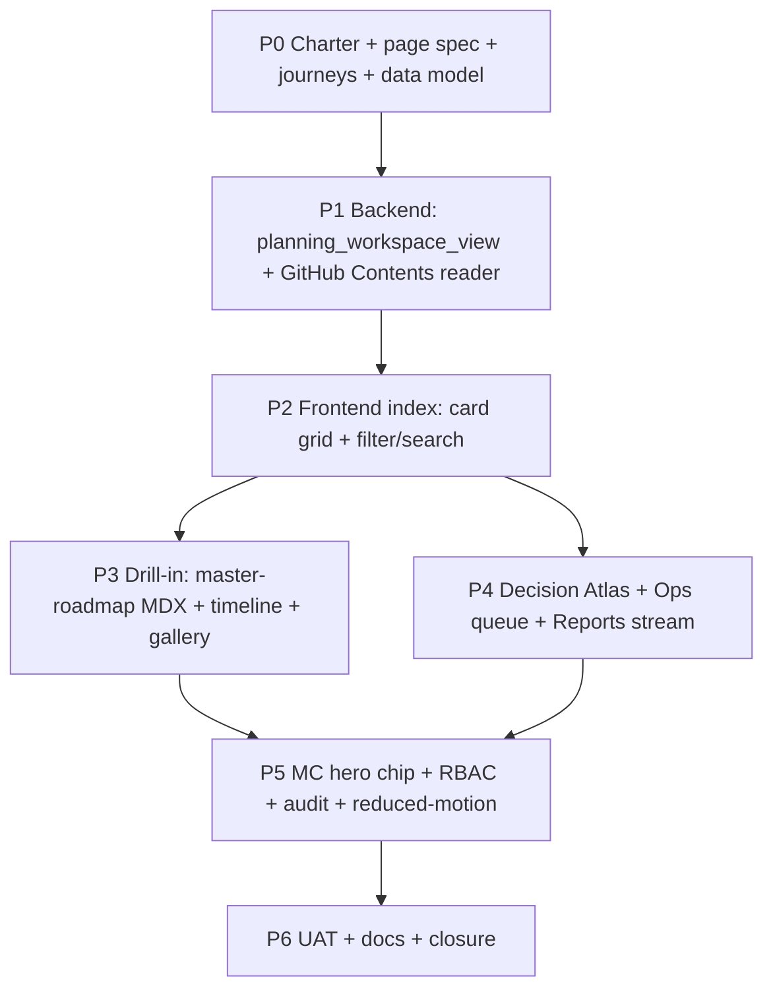

# Initiative 65 — AKOS Planning Workspace Panel (in hlk-erp)

**Folder:** `docs/wip/planning/65-akos-planning-workspace-panel/`
**Status:** **Active** — chartered and promoted in the same session on 2026-05-07. Charter package ([`reports/page-spec-impeccable-2026-05-07.md`](reports/page-spec-impeccable-2026-05-07.md), [`reports/journeys-2026-05-07.md`](reports/journeys-2026-05-07.md), [`reports/data-model-2026-05-07.md`](reports/data-model-2026-05-07.md)) was operator-approved alongside the user request *"We don't have an AKOS panel where we can see what we do in `docs/wip/planning/`. Let's fix that."* Sibling to [I62](../62-mission-control/master-roadmap.md) (Mission Control), [I63](../63-external-repo-governance-codification/master-roadmap.md) (External Repo Governance), [I64](../64-governance-mission-control/master-roadmap.md) (Governance Mission Control).

## Outcome

Render the full AKOS planning workspace at `docs/wip/planning/` as a first-class operator surface inside hlk-erp at `/operator/planning/`. Every initiative folder, every master-roadmap, every decision-log, every reports artefact becomes browseable, searchable, time-aware, and cross-linkable from the existing operator chrome — without leaving hlk-erp and without git surgery.

The unified panel:

1. **Index** — every initiative as a card (not a row) grouped by status pill (active / charter / closed / archived / continuous / program_line / gated_*). Filterable by program, role_owner, last_review date.
2. **Initiative drill-in** — `master-roadmap.md` rendered as MDX with phase tracker; decision log as a vertical timeline; evidence matrix as a checklist; risk register as a compact card list; reports as a gallery (latest first, file-mtime ordered) with first-paragraph preview.
3. **Decision Atlas** — every decision across every initiative on one page, filterable by class (governance/UX/data) and status; cross-references rendered as clickable chips.
4. **Operations queue** — every OPS row across initiatives, ranked by RICE, with links back to originating initiative and decision.
5. **Reports stream** — site-wide newsroom: every `reports/*.md` across every initiative, latest first, grouped by week; useful for end-of-day catch-up.
6. **Search** — full-text across folder names, master-roadmap headings, decision titles, report frontmatter `report_kind`.

Plus a **summary chip in the existing MADEIRA Mission Control hero**: "Planning · 47 active · 5 reports today · 1 attention" — single click → I65 index. Companion to the I64 governance chip; still no new tile on MC.

## Why now

- The user said it directly on 2026-05-07: *"We don't have an AKOS panel where we can see what we do in `docs/wip/planning/`. Let's fix that."*
- AKOS planning workspace has grown to 50+ initiative folders with their own decision logs, evidence matrices, risk registers, and reports. Today this surface is **only browseable in a file explorer or via GitHub web**. There's no way to ask "what's been written this week?" or "which initiatives haven't been reviewed in 21 days?" without scripting it.
- I62 already shipped `/operator/initiatives`, `/operator/decisions`, `/operator/cycle-closures` — but those are roll-up views over the **CSV registries** (`INITIATIVE_REGISTRY.csv`, `DECISION_REGISTER.csv`, `OPS_REGISTER.csv`). They tell you *what's tracked*, not *what's being authored right now in the workspace*.
- I63 + I64 codify external-repo governance and visualize it. Same playbook applied internally: codify how planning artefacts move from charter → active → closed, and visualize the live state.
- This panel is also a precondition for the I47 user-centric UAT loop — operators can't validate planning quality if the artefacts themselves aren't navigable.

## Scope decisions

| In scope | Out of scope |
|:---|:---|
| Read-only panel surfacing every artefact under `docs/wip/planning/` | Editing markdown in-browser (use Cursor / VS Code locally) |
| Index, drill-in, decision atlas, ops queue, reports stream, search | Cross-repo planning (this is openclaw-akos's `docs/wip/planning/` only) |
| Reuse `compliance.initiative_registry_mirror`, `compliance.ops_register_mirror`, AKOS git contents | Net-new canonical CSVs |
| Time-travel: "what did the workspace look like 14 days ago?" via git SHA | Forking the workspace |
| Demo mode mirrors the I62 pattern (`?mode=demo` + fixture data) | Public access — operator-only |
| Locale: en + es per existing hlk-erp i18n parity | New languages |
| Companion chip on `/mission-control` hero (parallel to I64 governance chip) | New tile on `/mission-control` |

## Asset classification (per [`PRECEDENCE.md`](../../../references/hlk/compliance/PRECEDENCE.md))

See [`asset-classification.md`](asset-classification.md). Summary:

- **Canonical (proposed)**: 1 new Supabase view `governance.planning_workspace_view` joining `INITIATIVE_REGISTRY`, `DECISION_REGISTER`, `OPS_REGISTER`, and `repo_health_snapshot_mirror` to surface "freshness" and "report count" per initiative without re-encoding state.
- **Mirrored / derived**: TypeScript types regenerated from `regen_consumer_types.py`. Markdown rendering at request time via the GitHub Contents API (no caching of raw .md content in Supabase).
- **Reference-only**: this charter folder.

## Phase dependency

## Phases

### P0 Charter + page spec + journeys + data model

This folder, fully populated:

- `master-roadmap.md` (this file)
- `decision-log.md` with at least D-IH-65-A (panel placement), D-IH-65-B (data model: Supabase view vs GitHub API), D-IH-65-C (markdown rendering at request time)
- `asset-classification.md`, `evidence-matrix.md`, `risk-register.md`
- `reports/page-spec-impeccable-2026-05-07.md` — operator-facing UI specification (impeccable laws, IA mermaid, OKLCH palette, motion rules)
- `reports/journeys-2026-05-07.md` — 5 user journeys with grasp tests
- `reports/data-model-2026-05-07.md` — Supabase view DDL + TypeScript shapes + GitHub Contents API call patterns

**Verification.** Operator review approves the page spec and the journeys.

### P1 Backend wiring

1. **Supabase view** `governance.planning_workspace_view` joining:
   - `compliance.initiative_registry_mirror` (status, last_review, owner_role, repo_slug, folder_path)
   - `compliance.ops_register_mirror` aggregated by `originating_initiative_id` (open count, top-3 by RICE)
   - `compliance.decision_register_mirror` (or `DECISION_REGISTER.csv` if mirror not yet created — fallback: read CSV via AKOS at deploy time and emit to a derived table)
   - `compliance.repo_health_snapshot_mirror` for the linked external repo's last commit (when relevant)
2. **GitHub Contents reader** (`lib/planning/github-reader.ts`): typed wrapper over the GitHub Contents + Trees API to fetch:
   - `docs/wip/planning/<NN>-<slug>/master-roadmap.md` (raw markdown for MDX)
   - `docs/wip/planning/<NN>-<slug>/reports/*.md` listing with metadata (filename, mtime, size, first-frontmatter `report_kind` and `last_review`)
   - 60-second TanStack Query cache; revalidate on `?ref=<sha>` change for time-travel
3. **MDX compile pipeline**: server-side, with `remark-gfm`, `remark-frontmatter`, sanitization (no inline HTML).

**Verification.** `governance.planning_workspace_view` returns rows that join cleanly with current registries; GitHub Contents reader handles a missing folder, an empty `reports/`, and an oversized file (>100KB cap) gracefully.

### P2 Frontend index

- `app/operator/planning/page.tsx`: index route, server-rendered.
- `components/planning/initiative-card-grid.tsx`: 1 card per initiative; status-pill leading; mtime relative; report-count badge.
- `components/planning/planning-filters.tsx`: status, program, role_owner, time-since-review, "stale only" toggle.
- `components/planning/planning-search.tsx`: text input over folder name + master-roadmap H1/H2 + decision titles + report frontmatter.

**Verification.** Playwright e2e `tests/e2e/planning-index.spec.ts` covers: load → filter to status=active → search "governance" → click first card → land on drill-in.

### P3 Drill-in

- `app/operator/planning/[slug]/page.tsx`: per-initiative.
- `components/planning/master-roadmap-mdx.tsx`: server-compiled MDX render of `master-roadmap.md`.
- `components/planning/decision-timeline.tsx`: vertical timeline derived from `decision-log.md`.
- `components/planning/evidence-checklist.tsx`: tabular reading of `evidence-matrix.md`, status-grouped.
- `components/planning/risk-card-list.tsx`: compact reading of `risk-register.md`.
- `components/planning/reports-gallery.tsx`: latest-first; first-paragraph preview; click → in-page report detail.
- `components/planning/cross-link-rail.tsx`: chips for sibling/related initiatives, linked decisions, originating cycle.

**Verification.** Playwright e2e: load `/operator/planning/64-governance-mission-control` → see all 6 sub-blocks render → click first report → see report rendered with frontmatter callout.

### P4 Atlas + Queue + Stream

- `app/operator/planning/decisions/page.tsx`: Decision Atlas (over the existing `/operator/decisions/` table; this is the **planning-workspace-aware** view, with cross-initiative chips and class/status filters).
- `app/operator/planning/operations/page.tsx`: Ops queue (sister to `/operator-inbox` but planning-scoped, ranked by RICE within initiative).
- `app/operator/planning/reports/page.tsx`: Reports stream — every `reports/*.md` across every initiative, week-grouped, latest first.
- `lib/planning/cross-references.ts`: parser that extracts `D-IH-NN-X`, `OPS-NN-X`, `INIT-OPENCLAW_AKOS-NN` patterns from any markdown body and resolves them to URLs.

**Verification.** Playwright e2e: navigate to Reports stream → see rows from at least 5 distinct initiatives → click any → land on the drill-in's report detail. Atlas filters work (decision_class=governance returns ≥ 1 row across multiple initiatives).

### P5 MC hero chip + RBAC + audit + reduced-motion

- `components/mission-control/hero.tsx`: append "Planning · X active · Y reports today · Z attention" chip parallel to the I64 governance chip; click → `/operator/planning/`.
- Tighten `/operator/planning/*` to operator-only via existing middleware.
- Audit-log every drill-in into a non-public report (`access_level < 4` views) to `holistika_ops.audit_log` with `action='planning.report.read'`.
- All motion respects `prefers-reduced-motion`.

**Verification.** Anonymous → 403 on `/operator/planning/`; non-operator → 403; operator landing logs an audit row. `prefers-reduced-motion: reduce` strips all transitions except the entry fade.

### P6 UAT + closure

- Operator UAT walking through every panel with a real workspace: index → search → drill-in → reports → atlas → operations → MC chip → time-travel back 14d.
- Docs: USER_GUIDE §24.13 ¶6 documents the panel.
- I65 closure decision logged.

**Verification.** UAT report at `reports/uat-i65-2026-05-XX.md` and I65 master-roadmap flips to `closed`.

## Verification matrix

| Phase | Command |
|:---|:---|
| P0 | Operator review approves page spec + journeys |
| P1 | `py scripts/test_governance_planning_workspace_view.py`; Supabase migration applies on staging |
| P2 | `pnpm test:e2e -- --grep planning-index`; `pnpm lighthouse` ≥90 |
| P3 | `pnpm test:e2e -- --grep planning-drilldown` |
| P4 | `pnpm test:e2e -- --grep planning-atlas-stream-queue` |
| P5 | `pnpm test:e2e -- --grep planning-rbac`; audit log table populated |
| P6 | UAT report at `reports/uat-i65-2026-05-XX.md` + I65 master-roadmap flips closed |

## Cross-references

- [I62 — Mission Control](../62-mission-control/master-roadmap.md) — the hero chip lands here.
- [I63 — External Repo Governance Codification](../63-external-repo-governance-codification/master-roadmap.md) — sibling pattern.
- [I64 — Governance Mission Control](../64-governance-mission-control/master-roadmap.md) — sibling pattern; planning chip parallels the governance chip.
- [I47 — User-Centric UAT](../47-user-centric-uat/master-roadmap.md) — downstream consumer (operators need this panel to validate planning quality).
- [I59 — HLK Governance Clean Slate](../59-hlk-governance-clean-slate/master-roadmap.md) — the cleanest example of a multi-phase folder; the drill-in must render its 8 reports cleanly.
- [`SOP-META_PROCESS_MGMT_001`](../../../references/hlk/v3.0/Admin/O5-1/Operations/PMO/SOP-META_PROCESS_MGMT_001.md) — process model the workspace embodies.
- [`PRECEDENCE.md`](../../../references/hlk/compliance/PRECEDENCE.md) — asset classification gates this panel honors.

## Decision triggers (logged in [`decision-log.md`](decision-log.md))

- **D-IH-65-A** Where the panel lives (new top-level operator route vs nested under `/mission-control` vs an enhancement of `/operator/initiatives`).
- **D-IH-65-B** Markdown rendering source (live GitHub Contents API vs nightly Supabase mirror vs deploy-time prebuild).
- **D-IH-65-C** Time-travel implementation (git SHA query string vs Supabase historical snapshots vs none for v1).
