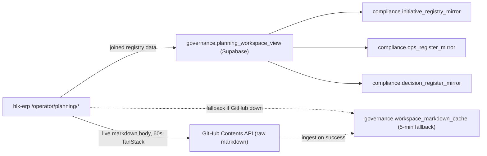
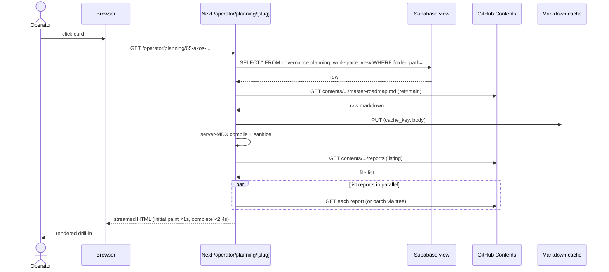

# Data model — AKOS Planning Workspace Panel

> Locks the data shapes and access patterns for I65 P1 backend. References [`master-roadmap.md`](../master-roadmap.md), [`decision-log.md`](../decision-log.md) (especially D-IH-65-B and D-IH-65-C), [`asset-classification.md`](../asset-classification.md).

## 1. Architecture overview



D-IH-65-B: GitHub is canonical for markdown. Supabase is canonical for joined registry state. Cache is lossy and rebuildable.

## 2. `governance.planning_workspace_view` DDL

```sql
CREATE OR REPLACE VIEW governance.planning_workspace_view AS
WITH ops_per_initiative AS (
  SELECT
    originating_initiative_id AS initiative_id,
    COUNT(*) FILTER (WHERE status = 'open') AS open_ops,
    COUNT(*) AS total_ops,
    MAX(rice_score) AS top_rice
  FROM compliance.ops_register_mirror
  GROUP BY originating_initiative_id
),
decisions_per_initiative AS (
  SELECT
    initiating_initiative_id AS initiative_id,
    COUNT(*) AS total_decisions,
    COUNT(*) FILTER (WHERE status = 'active') AS active_decisions,
    MAX(decided_at) AS last_decision_at
  FROM compliance.decision_register_mirror
  GROUP BY initiating_initiative_id
)
SELECT
  i.initiative_id,
  i.repo_slug,
  i.folder_path,
  i.title,
  i.status,
  i.cycle_id,
  i.owner_role,
  i.last_review,
  i.closed_at,
  CASE
    WHEN i.status = 'active' AND i.last_review < CURRENT_DATE - INTERVAL '21 days' THEN 'stale'
    WHEN i.status = 'active' AND i.last_review < CURRENT_DATE - INTERVAL '14 days' THEN 'aging'
    ELSE 'fresh'
  END AS freshness_state,
  COALESCE(o.open_ops, 0) AS open_ops_count,
  COALESCE(o.top_rice, 0) AS top_ops_rice,
  COALESCE(d.total_decisions, 0) AS total_decisions,
  COALESCE(d.active_decisions, 0) AS active_decisions,
  d.last_decision_at,
  i.synced_at AS registry_synced_at
FROM compliance.initiative_registry_mirror i
LEFT JOIN ops_per_initiative o ON o.initiative_id = i.initiative_id
LEFT JOIN decisions_per_initiative d ON d.initiative_id = i.initiative_id;

COMMENT ON VIEW governance.planning_workspace_view IS
  'I65 — joined registry state per initiative for /operator/planning/. Live computed.';

GRANT SELECT ON governance.planning_workspace_view TO authenticated;
```

RLS inherits from underlying mirrors via `SECURITY INVOKER`. Operator (level >= 4) reads; below that, the page returns 403 at the route level.

## 3. `governance.workspace_markdown_cache` DDL (fallback only)

```sql
CREATE TABLE IF NOT EXISTS governance.workspace_markdown_cache (
  cache_key      TEXT PRIMARY KEY,        -- '<sha or "main">::<path-encoded>'
  ref            TEXT NOT NULL,           -- 'main' or commit SHA
  path           TEXT NOT NULL,           -- 'docs/wip/planning/65-.../master-roadmap.md'
  body           TEXT NOT NULL,
  size_bytes     INTEGER NOT NULL,
  fetched_at     TIMESTAMPTZ NOT NULL DEFAULT now(),
  expires_at     TIMESTAMPTZ NOT NULL DEFAULT (now() + INTERVAL '5 minutes')
);

CREATE INDEX IF NOT EXISTS workspace_markdown_cache_expires_idx
  ON governance.workspace_markdown_cache (expires_at);

ALTER TABLE governance.workspace_markdown_cache ENABLE ROW LEVEL SECURITY;
CREATE POLICY workspace_markdown_cache_read
  ON governance.workspace_markdown_cache FOR SELECT TO authenticated USING (true);
CREATE POLICY workspace_markdown_cache_service_role_all
  ON governance.workspace_markdown_cache FOR ALL TO service_role USING (true) WITH CHECK (true);
```

A scheduled function `governance.purge_expired_workspace_cache()` runs every 5 minutes and DELETEs rows where `expires_at < now()`. Storage budget: 100 MB cap (path + body); average page = 4-12 KB; comfortable headroom.

## 4. TypeScript shapes (`hlk-erp/lib/types/planning.ts`)

```ts
export type InitiativeStatus =
  | 'active'
  | 'charter'
  | 'closed'
  | 'archived'
  | 'continuous'
  | 'program_line'
  | 'gated_external'
  | 'gated_operator';

export type FreshnessState = 'fresh' | 'aging' | 'stale';

export interface InitiativeRow {
  initiative_id: string; // 'INIT-OPENCLAW_AKOS-65'
  repo_slug: string;
  folder_path: string; // 'docs/wip/planning/65-akos-planning-workspace-panel'
  title: string;
  status: InitiativeStatus;
  cycle_id: string | null;
  owner_role: string;
  last_review: string | null; // ISO date
  closed_at: string | null;
  freshness_state: FreshnessState;
  open_ops_count: number;
  top_ops_rice: number;
  total_decisions: number;
  active_decisions: number;
  last_decision_at: string | null;
  registry_synced_at: string;
}

export interface ReportFile {
  filename: string;            // 'page-spec-impeccable-2026-05-07.md'
  path: string;                // 'docs/wip/planning/65-.../reports/page-spec-impeccable-2026-05-07.md'
  size_bytes: number;
  last_committed_at: string;   // from git log -1 -- <path>
  report_kind: string | null;  // from frontmatter
  preview: string;             // first non-empty paragraph, plaintext
  cursor_deeplink: string;     // 'cursor://file/<absolute-on-operator-machine>'
}

export interface InitiativeDrillIn {
  row: InitiativeRow;
  master_roadmap_mdx: string;          // server-compiled MDX HTML
  decisions: Array<{
    id: string;
    title: string;
    status: 'active' | 'archived' | 'superseded';
    decided_at: string | null;
    body_html: string;
  }>;
  evidence: Array<{ id: string; claim: string; status: string; evidence_path: string | null }>;
  risks: Array<{ id: string; risk: string; likelihood: string; impact: string; mitigation: string }>;
  reports: ReportFile[];
  cross_links: Array<{ kind: 'sibling' | 'parent' | 'closure_decision' | 'cycle' | 'sop'; label: string; url: string }>;
}
```

## 5. GitHub Contents API call patterns

```ts
// lib/planning/github-reader.ts
const REPO = 'FraysaXII/openclaw-akos';
const BRANCH = (ref?: string) => ref ?? 'main';

async function listFolder(path: string, ref?: string) {
  const url = `https://api.github.com/repos/${REPO}/contents/${encodeURIComponent(path)}?ref=${BRANCH(ref)}`;
  const headers = await ghHeaders();
  const res = await fetch(url, { headers, next: { revalidate: 60 } });
  if (!res.ok) throw new GhError(res.status, path);
  return (await res.json()) as Array<{ name: string; path: string; size: number; sha: string; type: 'file' | 'dir' }>;
}

async function readFile(path: string, ref?: string) {
  const url = `https://api.github.com/repos/${REPO}/contents/${encodeURIComponent(path)}?ref=${BRANCH(ref)}`;
  const headers = await ghHeaders({ accept: 'application/vnd.github.raw' });
  const res = await fetch(url, { headers, next: { revalidate: 60 } });
  if (!res.ok) {
    // Try fallback cache; emit metric "planning.github.fallback"
    const fallback = await fallbackCache.get(`${BRANCH(ref)}::${path}`);
    if (fallback) return { body: fallback.body, fromCache: true };
    throw new GhError(res.status, path);
  }
  const body = await res.text();
  await fallbackCache.put({ cache_key: `${BRANCH(ref)}::${path}`, ref: BRANCH(ref), path, body, size_bytes: body.length });
  return { body, fromCache: false };
}
```

Token: `GH_PAT_AUTOPR` from the I63 governance loop (already scoped to `openclaw-akos`). Read-only headers; no write paths in this module.

Rate-limit budget: 5,000 requests/hour with the PAT (vs 60 unauthenticated). Operator browsing ≈ 30 reqs/folder visit; comfortable headroom.

## 6. Cursor deeplink

```ts
// lib/planning/cursor-link.ts
export function buildCursorLink(opts: { repoLocalRoot: string; relativePath: string; line?: number }) {
  // cursor://file/<absolute>:LINE
  const abs = path.join(opts.repoLocalRoot, opts.relativePath);
  return `cursor://file/${encodeURIComponent(abs)}${opts.line ? `:${opts.line}` : ''}`;
}
```

`repoLocalRoot` comes from a per-user preference (`holistika_ops.user_preferences.workspace_path_for_openclaw_akos`). If not set, the chip is hidden and the report opens in-browser instead.

## 7. Date → SHA resolver (D-IH-65-C)

```ts
// lib/planning/time-travel.ts
export async function resolveDateToSha(date: string /* YYYY-MM-DD */): Promise<string | null> {
  const url = `https://api.github.com/repos/${REPO}/commits?sha=main&until=${date}T23:59:59Z&per_page=1`;
  const res = await fetch(url, { headers: await ghHeaders() });
  if (!res.ok) return null;
  const json = (await res.json()) as Array<{ sha: string }>;
  return json[0]?.sha ?? null;
}
```

Single REST call. Cached for 24h via TanStack Query (the SHA for "the day before yesterday" doesn't change once the day is closed).

## 8. Cross-reference resolver (`lib/planning/cross-references.ts`)

Regex patterns:

| Pattern | Resolves to |
|:---|:---|
| `D-IH-(\d+)-([A-Z])` | `/operator/planning/<NN>-<slug>#decision-D-IH-${1}-${2}` |
| `OPS-(\d+)-([A-Z0-9]+)` | `/operator/planning/operations?id=OPS-${1}-${2}` |
| `INIT-OPENCLAW_AKOS-(\d+)` | `/operator/planning/<NN>-<slug>` |
| `Cycle (\d+)` | `/operator/cycle-closures?cycle=${1}` |
| `SOP-([A-Z_0-9]+)` | external link to GitHub source via `SOP_REGISTRY.csv` mapping |

When the resolver doesn't find a target, it renders the inline pattern as plain monospace text (not as a broken link).

## 9. Performance budget

| Surface | Budget |
|:---|:---|
| Index page LCP | < 1.6s on 4G throttled |
| Drill-in page LCP | < 2.4s (includes one master-roadmap MDX compile) |
| Card grid render of 60 initiatives | < 200ms client-side hydrate |
| Search query (over 200 cached titles + headings) | < 80ms client-side |
| Reports stream first paint | < 1.2s |
| Time-travel re-render after date change | < 800ms |

## 10. Sequence diagram — drill-in load


