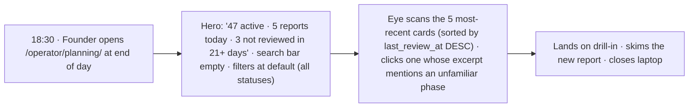
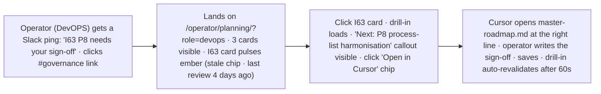
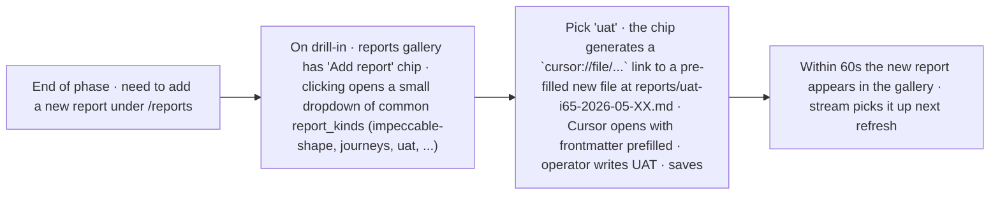
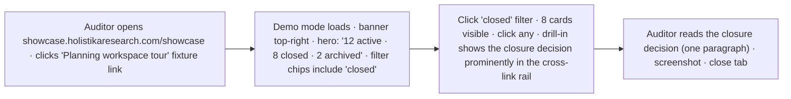
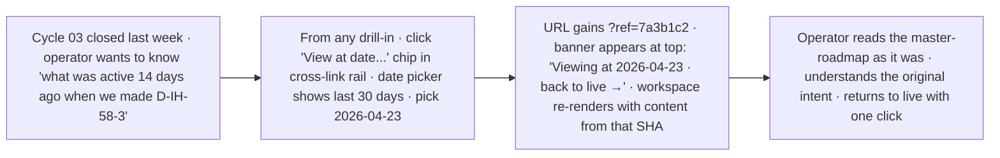

# User journeys — AKOS Planning Workspace Panel

> 5 journeys, each with `trigger → glance → action → outcome` and a grasp test that defines what "intuitive" looks like. These journeys gate the I65 build.

## J-65-1 — Founder catch-up scan (<30 seconds)

**Grasp test passes only if** the hero band carries the count of "reports today". Without it, the founder scans cards to count — which is a 90-second job, not a 30-second one. The 5 most-recent cards must be visible above the fold on a 1440×900 viewport.

## J-65-2 — Operator drilling into "my" initiative (<90 seconds)

**Grasp test passes only if** the role filter persists across page loads, the "Next phase" callout is the dominant signal in the drill-in, and the Cursor deeplink works from the chip without manual path-pasting.

## J-65-3 — Authoring the next report inline (<180 seconds)

**Grasp test passes only if** the operator never types a path manually. The chip generates the path; Cursor handles the rest. The pre-filled frontmatter matches the AKOS report-kind conventions exactly.

## J-65-4 — Auditor reviewing closed initiatives (<120 seconds)

**Grasp test passes only if** demo mode shows fixture data only (no real workspace text), the closure decision is the **first** item in the cross-link rail for closed initiatives (not buried), and the closure decision rendering is one paragraph (not a table dump).

## J-65-5 — Time-travel post-mortem (<240 seconds)

**Grasp test passes only if** the time-travel banner is loud enough that no one mistakes historical for live (per R-65-4), and the date→SHA resolver returns reliably for the most recent merged commit on `main` at the picked date.

## Grasp tests, summary

For each journey, what "intuitive" means:

1. **J-65-1**: hero carries the count. Cards are scannable by status pill. No filtering required.
2. **J-65-2**: role filter persists. "Next phase" callout dominates drill-in. Cursor deeplink works.
3. **J-65-3**: no manual path typing. Frontmatter pre-filled. Gallery refreshes within 60s.
4. **J-65-4**: closure decision dominates closed-initiative drill-ins. Showcase shows fixtures only.
5. **J-65-5**: banner loud, "back to live" obvious, date→SHA reliable.

## Out of journey scope

- **Editing master-roadmap content.** Cursor handles authoring. The panel is read+navigate only.
- **Cross-AKOS-instance views.** Single AKOS instance for now.
- **Initiative dependency graph.** Defers to P7 if requested.
