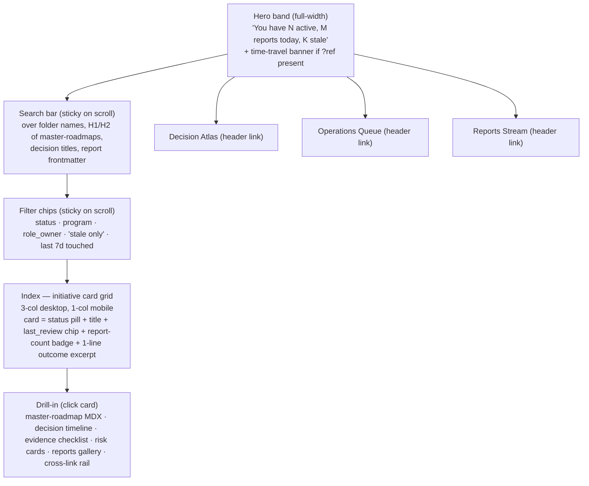

# Impeccable shape — AKOS Planning Workspace Panel (`hlk-erp` `/operator/planning/`)

> Operator approval gate before P2 build starts. Anchors: [`master-roadmap.md`](../master-roadmap.md), [`decision-log.md`](../decision-log.md), [`62-mission-control` impeccable shape](../../62-mission-control/reports/impeccable-shape-mission-control-today-2026-05-06.md), [`64-governance-mission-control` page spec](../../64-governance-mission-control/reports/page-spec-2026-05-06.md), Impeccable design laws (`.cursor/skills/impeccable/SKILL.md`).

## 1. Audience and the one job

Three personas open this panel. The **one job**: *"Show me what's being authored in the AKOS planning workspace, what's stale, and let me drill into any artefact in two clicks."*

| Persona | Access | Time budget | Signal | Outcome |
|:---|:---|:---|:---|:---|
| **Founder** (level 6) | full | <30s scan | "What's been touched this week?" | catch-up; close laptop |
| **Operator / role_owner** (level 4) | full | <90s drill | "What does my initiative need from me?" | open the report, write the next thing |
| **Auditor** (level 1, demo) | demo only | <120s tour | "Is this workspace credible?" | screenshot a few artefacts |

**The panel is read-first.** Editing happens in Cursor / VS Code — out of scope on purpose.

## 2. The IA in one diagram

## 3. User journeys (the same 5 from `journeys-2026-05-07.md`, design implications here)

| Journey | Layout consequence |
|:---|:---|
| J-65-1 Catch-up scan (<30s) | Hero must carry "M reports today" so the scan resolves on the band, not the cards. |
| J-65-2 Drill into my initiative (<90s) | Cards must be filterable by `role_owner = current_user`. "My initiatives" toggle. |
| J-65-3 Write the next phase (<180s) | Drill-in must show "next phase" callout (computed from master-roadmap phase tracker) and route to the local file in Cursor via `cursor://file/...` deeplink chip. |
| J-65-4 Audit a closed initiative (<120s) | Closed initiatives must be reachable via filter; their drill-in must show the closure decision prominently. |
| J-65-5 Time-travel post-mortem (<240s) | `?ref=<sha>` banner is loud enough that no one mistakes historical for live. |

## 4. Impeccable laws applied

### Color (OKLCH, governance-aligned, calmer)

The planning panel reuses **the same** palette as `/operator/governance/external-repos/` (D-IH-65-A: same workspace family, same visual chrome). One **new** accent for "stale" (≥21 days no review on an active initiative).

| Token | Value | Use |
|:---|:---|:---|
| `--plan-bg` | `oklch(96% 0.02 80)` | page background |
| `--plan-surface` | `oklch(99% 0.01 80)` | card surfaces |
| `--plan-ink` | `oklch(20% 0.02 230)` | body type |
| `--plan-hero` | `oklch(22% 0.05 220)` | hero band |
| `--plan-active` | `oklch(72% 0.13 195)` | active status pill |
| `--plan-charter` | `oklch(85% 0.08 270)` | charter status pill (cool muted) |
| `--plan-closed` | `oklch(55% 0.04 250)` | closed status pill (slate-quiet) |
| `--plan-stale` | `oklch(78% 0.16 65)` | "stale" warning (ember; reused from governance) |
| `--plan-archived` | `oklch(60% 0.02 60)` | archived (dust) |
| `--plan-fail` | `oklch(55% 0.20 28)` | rare; only for "validation failed" badges |

No status-row tinting. Status pill is leading-glyph + label, not a row backdrop.

### Theme

Light default (matches governance + MC). Dark mode supported. Print stylesheet always shows time-travel timestamp (R-65-4 mitigation).

### Typography (same Inter scale 1.25 as the rest of hlk-erp)

Card title: 16/24, weight 600. Card excerpt: 14/22, weight 400, color `--plan-ink` at 0.72 opacity. Status pill: 11/16, weight 600, uppercase, tracking 0.10em. MDX body in drill-in: 16/26 with 64ch line length. H2 drill-in: 22/28, weight 600, with 32px top margin. **Code blocks inside MDX use mono with `font-variant-numeric: tabular-nums` only on numeric tables — not on prose code.**

### Layout (deliberate hierarchy, not "everything's a card")

Index is a **3-column card grid on desktop**, **1-column on mobile**. Cards are **deliberately uniform** in size — this is one place where uniformity helps because the operator's job is to scan dozens of items quickly. The hierarchy comes from:

- Status pill leading (color + glyph)
- Title bold
- 1-line excerpt with first phase name + role_owner
- Trailing: "last review 4d ago" chip with stale-color when ≥21d

Drill-in is a **single column** with 768px max-content-width — long-form reading deserves single-column. The cross-link rail floats right on desktop (≥1280px) and stacks below on smaller viewports.

### Motion

| Surface | Motion | Curve | Duration |
|:---|:---|:---|:---|
| Card hover | translate-up 2px + shadow opacity 0 → 0.08 | ease-out-quart | 220ms |
| Card click → drill-in | shared-element transition on the title | ease-out-expo | 360ms |
| Search dropdown reveal | opacity 0→1 + scale 0.98→1 | ease-out-quart | 200ms |
| Time-travel banner appear | slide-down + ember pulse 1× | ease-out-expo | 320ms in |
| Stale chip on overdue cards | no animation; color carries the load |  |  |

`prefers-reduced-motion: reduce` strips all of the above except the entry fade.

### Microcopy (every label earns its place)

| Plain | Locked microcopy |
|:---|:---|
| Page title | **AKOS Planning Workspace** |
| Hero (GREEN, no stale) | `47 active · 5 reports today · all reviewed within 21 days` |
| Hero (with stale) | `47 active · 5 reports today · 3 not reviewed in 21+ days` |
| Stale chip | `Last review 24d ago` (relative; absolute on hover) |
| Empty index | `No initiatives match those filters. Try clearing one or browse the Reports stream.` |
| Drill-in "next phase" callout | `Next: P2 Frontend index — verification: pnpm test:e2e --grep planning-index` (extracted from master-roadmap.md `## Phases`) |
| Time-travel banner | `Viewing AKOS planning workspace at 2026-04-23 (commit 7a3b1c2). Back to live →` |
| Cross-reference unresolved | `[Decision D-IH-66-A — not yet logged]` (gentle, not error) |

Em-dashes excluded throughout. No "we", no "please", no "kindly".

### Absolute bans honored

- ✗ No glassmorphism (cards are opaque).
- ✗ No gradient text (status pills are solid).
- ✗ No card grid with mismatched heights (uniform card = scan rhythm).
- ✗ No modal as first thought (drill-in is a route, not a modal — supports right-click "open in new tab").
- ✗ No skeleton longer than 400ms (stream cards as they arrive; show count placeholder only on the hero band).
- ✗ No left-side stripe accent on cards (status pill carries the role).

## 5. Anti-patterns rejected

1. **Tabs for index/atlas/queue/stream.** Each is a route. Tabs would imply they share filters — they don't. Each has its own filter rail.
2. **Initiative dependency graph as the index.** Graphs are for slide decks. The index is for scanning. A "graph" view can ship as P7 if needed; not P0.
3. **In-browser markdown editing.** Hard out. Cursor is the editor. The panel deeplinks to Cursor via `cursor://file/...` chips.
4. **"Pin to dashboard" personalisation.** Same rejection as MC: muscle memory beats personalisation. The "stale only" filter is the closest the panel gets.
5. **Auto-refresh banner on every workspace change.** Stale-while-revalidate at 60s is invisible enough; a banner would be noise.

## 6. Acceptance criteria (locked)

| ID | Criterion | Verification |
|:---|:---|:---|
| PLAN-A | OKLCH palette declared as CSS custom properties; no hex except `transparent` | Stylelint `no-raw-hex` |
| PLAN-B | Hero band fits 320px viewport above the fold without horizontal scroll | Playwright viewport |
| PLAN-C | All 5 user journeys completable in their time budgets on 4G throttled Lighthouse synthetic | LH CI per-journey |
| PLAN-D | Card grid renders ≥48 initiatives without virtualisation crash | Playwright with seeded fixture |
| PLAN-E | en + es locale parity verified | `pnpm check-i18n-parity` |
| PLAN-F | Drill-in MDX never injects inline scripts; CSP enforced | rehype-sanitize unit test + CSP header check |
| PLAN-G | Demo mode (`?mode=demo`) shows fixture data; never reads real workspace markdown | Playwright DOM snapshot |
| PLAN-H | Lighthouse perf ≥90, a11y ≥95 desktop + mobile | Lighthouse CI |
| PLAN-I | Brand-jargon scan passes for showcase mode | `npm run lint:jargon -- --route /operator/planning --mode showcase` |
| PLAN-J | MC hero chip renders 3 numbers and routes correctly | Playwright link + DOM |
| PLAN-K | `prefers-reduced-motion: reduce` strips all motion except entry fade | a11y + Playwright |
| PLAN-L | Time-travel `?ref=<sha>` shows banner; "back to live" chip clears it | Playwright |
| PLAN-M | Cursor deeplink chips construct correct `cursor://file/<absolute-path>` URLs | unit test on path resolver |

## 7. Out of scope (P7+)

- Initiative dependency graph view.
- In-browser editing.
- Cross-AKOS-instance planning (multi-org).

## 8. Decision

This page-spec gates I65 promotion from `charter` to `active`. The journeys report ([`journeys-2026-05-07.md`](journeys-2026-05-07.md)) and data-model report ([`data-model-2026-05-07.md`](data-model-2026-05-07.md)) lock the operator and engineering inputs.
