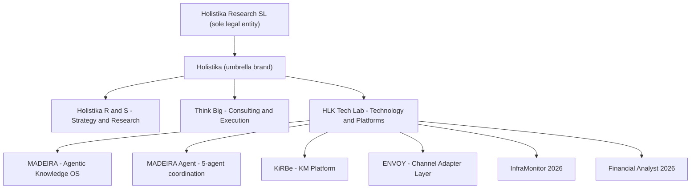
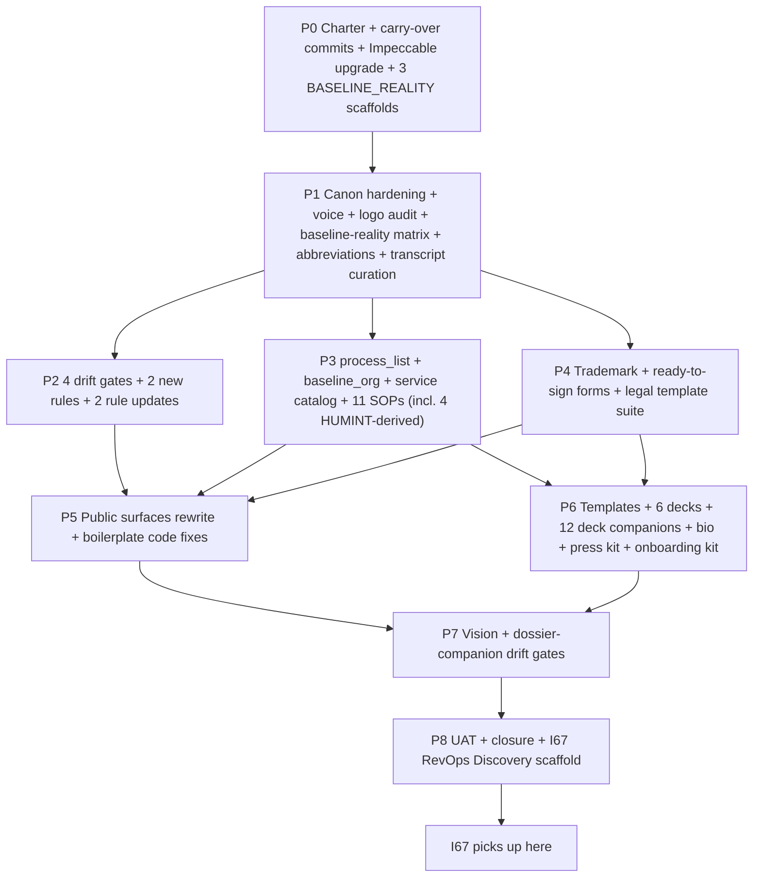

# Initiative 66 — Brand, Vision, Ops Sweep

**Folder:** `docs/wip/planning/66-brand-vision-ops-sweep/`
**Status:** **Closed** — P0-P8 completed on 2026-05-09; I67 RevOps Discovery scaffolded as gated successor.
**Authoritative plan:** `~/.cursor/plans/brand_vision_ops_sweep_4f4c51dd.plan.md` (out-of-repo; this `master-roadmap.md` is the workspace mirror per [`akos-planning-traceability.mdc`](../../../../.cursor/rules/akos-planning-traceability.mdc)).

Sibling to [I62](../62-mission-control/master-roadmap.md), [I63](../63-external-repo-governance-codification/master-roadmap.md), [I64](../64-governance-mission-control/master-roadmap.md), [I65](../65-akos-planning-workspace-panel/master-roadmap.md). Bootstraps successor [I67](../67-revops-discovery/) (RevOps Discovery, scaffold-only at I66 closure; charter pending the next agent's research).

## Outcome

By I66 close, every brand asset Holistika ships — vault canon, public surfaces, outbound emails, slide decks, contracts, dossiers, trademark filings, founder bio, press kit, onboarding kit, intelligence reports — derives from a single AKOS-canonical source and is enforced against drift in CI. The founder can hand the website, the dossier, an investor deck, an ENISA application, a contract template, a recruiter deck, and a press-kit boilerplate to seven different audiences and they will read in one consistent voice with one consistent visual identity, citing one consistent legal architecture (Holistika Research SL · umbrella brand Holistika · three operational sub-marks · product brand stack).

Trademark filings are ready-to-sign and operator-handoff is sign + pay + submit. The ~20 part-time collaborators have an onboarding kit and a quarterly canon-refresh SOP. New cursor agents and MCP servers acknowledge a brand digest before producing external prose.

The CORPINT capability — structured research + audience-baselined communication + protected intel discipline — is externalized in audience-translated language across founder bio, BRAND_VISION public-region, investor deck, press kit, decks. The HUMINT framework citations stay internal-only, scoped to SOPs + operator-private `/governance/intelligence` panel + per-deck companions + `docs/wip/intelligence/` working space. The link is `BRAND_BASELINE_REALITY_MATRIX.md` with dual-register design.

I66 closure produces one more thing: a research-first scaffold for **I67 RevOps Discovery** — the next initiative that takes positioning-through-retention-through-referral seriously. The scaffold is deliberately near-empty; the next agent's binding mandate is to read I66's outputs + 20+ operator-supplied transcripts + external benchmarks, conduct operator interviews, and only then propose a phased plan.

## Why now

Operator surfaced four threads on 2026-05-08 (timestamp 19:00-20:30 UTC+2) that materially change earlier choices:

1. The **Baseline Reality framing**: messaging requires processes that bridge our concept of normal to the counterparty's. This is exactly what intelligence officers do when handling sources, and the operator-supplied HUMINT FM 2-22.3 (US Army, 6 Sept 2006, public release) is the founder's CORPINT background.
2. **HLK as a short for Holistika** needs governance.
3. **Logos may need rework** — operator showed four candidates: Hi monogram, HOLÍSTIKA Research wordmark with accent on Í, Holistika RGB-rings chromatic version, and a duplicate. Audit + decision needed.
4. **Pause rhythm** — 8 operator pauses for ~5.5 weeks is right at the operator boundary; agent context degradation between pauses needs its own discipline.

Plus the deeper context:

- The Branded House conundrum (one legal entity → umbrella brand → three operational arms → product stack) is solved doctrinally but not yet codified in canonicals.
- BRAND_HIERARCHY_AND_TRADEMARK_SCOPE_2026-04 still has open trademark questions; trademark filing should land inside this initiative, not as deferred TODO[OPERATOR].
- Real conversation transcripts (20+ recordings: Constitución Sociedad / ENISA / Consultoría Hostelería / NFQ Purview / Websitz / EFA / WhatsApp / BD + Researcher onboardings) are voice goldmines that should produce BRAND_SPANISH_PATTERNS substantial enrichment + new BRAND_FRENCH_PATTERNS canonical.
- Five public manifesto entries (`/manifiesto/holistika`, `/manifiesto/madeira`, `/manifiesto/madeira-agent`, `/manifiesto/kirbe`, `/manifiesto/envoy`) need the Tier-2 voice contract codified everywhere, not just `/manifiesto/holistika`.
- The 6-services × 3-arms × 3-tiers service catalog the founder described in the BD onboarding deserves its own canonical (not lost in transcripts).
- Marketing-ops + sales-ops + legal-template suites pair with trademark in P4 because they share the legal-counsel reviewer.

## Architecture (the contract this work codifies)

## Scope decisions

| In scope | Out of scope |
|:---|:---|
| 6 new canonicals: BRAND_ARCHITECTURE, BRAND_VISION, BRAND_LOGO_SYSTEM, BRAND_BASELINE_REALITY_MATRIX, BRAND_ABBREVIATIONS, BRAND_FRENCH_PATTERNS | Italian voice canonical (no audience signal) |
| Major rewrite of BRAND_HIERARCHY_AND_TRADEMARK_SCOPE_2026-04 | Forking the brand canonicals across repos (consumers cite back) |
| Trademark clearance + filing strategy + ready-to-sign forms (5 marks × 2 jurisdictions) + operator-handoff package | Trademark filings actually completed at the registry (external dependencies; tracked in OPS_REGISTER) |
| 5 drift gates wired into release-gate.py | Photography / illustration system (Lucide + Spotlight is enough) |
| 16 process_list.csv rows + 11 SOPs (incl. 4 HUMINT-derived) + 3 sub-mark Lead rows in baseline_organisation.csv + SERVICE_OFFERING_CATALOG canonical | InfraMonitor + Financial Analyst implementations (separate product initiatives) |
| All 5 manifesto entries rewritten | Decommissioning `/dashboard` + `/(authapp)/login` on boilerplate (declared OOS in `boilerplate/PRODUCT.md`) |
| Home flywheel + /services + /tech-lab + /how-we-work + /vision rewritten | Migrating boilerplate `defaultTheme="dark"` → `"system"` |
| 6 deck templates each with .objections.md + .counterparty-brief.md companions; founder bio with track-record + per-audience FAQ; press kit; onboarding kit; sales-ops | CRM / marketing-automation tooling selection (in I67 DP-3) |
| 2 new cursor rules (agent-checkpoint-discipline, brand-baseline-reality) + 2 rule updates (docs-config-sync, planning-traceability) | Pricing-tier validation methodology (in I67 DP-5) |
| Impeccable v3.1 upgrade (BASELINE_REALITY 5th setup gate) | Channel + content cadence decisions (in I67 starting-hypotheses.md) |
| 2 new operator panels in hlk-erp: `/governance/brand-templates` + `/governance/intelligence` (AccessLevel ≥ 5) | Partner-deal economics formalization (in I67 DP-6) |
| I67 RevOps Discovery research-first scaffold at closure | KPI selection + dashboards (in I67 DP-7) |

Full IN/OUT catalog: [`scope-compendium.md`](scope-compendium.md).

## Asset classification (per [`PRECEDENCE.md`](../../../references/hlk/compliance/PRECEDENCE.md))

See [`asset-classification.md`](asset-classification.md). Summary:

- **Canonical**: 6 new BRAND_* files + SERVICE_OFFERING_CATALOG + 11 new SOPs + TRADEMARK_FILING_STRATEGY_2026-05 + legal templates (MSA / SOW / NDA / DPA) + FOUNDER_BIO + PRESS_KIT + ONBOARDING_KIT + 2 new cursor rules + Impeccable SKILL.md upgrade.
- **Mirrored / derived**: `governance.brand_template_registry` view + `governance.engagement_intelligence_view` view + boilerplate prose drawn from canonicals + hlk-erp dashboard panel components.
- **Reference-only**: this charter folder; the operator-supplied transcripts under `docs/_assets/transcripts/`; HUMINT FM 2-22.3 source citations in SOP frontmatter.

## Phase dependency

P2, P3, P4 run in parallel after P1. P5 and P6 run in parallel after P3 + P4. The fan-out is deliberate; sequential would push the calendar to 8+ weeks.

## Phase at a glance

| # | Phase | Effort | Operator pause | Agent self-checkpoints | Key deliverable |
|:---|:---|---:|:---:|:---:|:---|
| P0 | Charter + carry-over + Impeccable upgrade | 3-3.5d | #1 | 1 | This folder + 5 carry-over commits + Impeccable SKILL v3.1 |
| P1 | Canon hardening + voice + logo audit + baseline-reality + abbreviations + transcript curation | 7-8d | #2 | 4 | 6 new BRAND_* canonicals + BRAND_HIERARCHY rewrite + 20+ transcripts curated |
| P2 | 4 drift gates + 2 new rules + 2 rule updates | 3-4d | #3 | 2 | `validate_brand_*.py` × 4 + `.cursor/rules/*` × 4 (2 new + 2 updated) |
| P3 | Operations integration | 5-6d | #4 (CSV gate) | 3 | 16 process_list rows + 3 baseline_organisation rows + SERVICE_OFFERING_CATALOG + 11 SOPs + `docs/wip/intelligence/` working space |
| P4 | Trademark + ready-to-sign forms + legal-template suite | 5-6d | #5 | 2 | Clearance reports + filing strategy + ~7-8 ready-to-sign forms + MSA/SOW/NDA/DPA + Privacy/Terms/Cookies refresh |
| P5 | Public surfaces rewrite + boilerplate code | 6d | #6 | 3 | All 5 manifestos + home flywheel + /services + /tech-lab + /how-we-work + /vision + i18n parity |
| P6 | Marketing-ops + sales-ops template suite | 7d | #7 | 3 | Email signatures + sequences + 6 decks × 3 files + founder bio + press kit + onboarding kit + sales-ops + 2 governance views + 2 operator panels |
| P7 | Vision + dossier-companion drift gates | 1-2d | #8 | 0 | `validate_brand_vision_drift.py` + `validate_dossier_companion_drift.py` + tests + deliberate-drift verification |
| P8 | UAT + closure + I67 scaffold | 5d | implicit | 0 | Dated UAT report + cycle closeout + INITIATIVE_REGISTRY close + 20 D-IH-66-* logged + I67 scaffold |
| **Total** | | **42-49d** | **8** | **~18** | ~5.5 calendar weeks with parallelism |

## Pause + checkpoint discipline

- **Operator pauses (8):** required at every named phase boundary. Each pause = explicit operator approval gate; no phase merge without pause-recorded artifact in `reports/`.
- **Agent self-checkpoints (~18):** required every ~1.5-2 days within a phase, or at every ~5-7 deliverable units, whichever comes first. Pattern: agent re-reads relevant plan section + relevant canonicals + own previous outputs, summarizes progress, notes any drift, continues. Non-blocking. Codified as a new rule in P2 ([`.cursor/rules/akos-agent-checkpoint-discipline.mdc`](../../../../.cursor/rules/akos-agent-checkpoint-discipline.mdc)) so the pattern propagates to I67 / I68.
- Drift-failure posture: if a self-checkpoint reveals canonical-citation drift, agent stops, surfaces drift to operator, does not silently fix.
- Cross-references: [Cursor large-codebases guidance](https://docs.cursor.com/guides/advanced/large-codebases) (the "stay close to plan-creation" principle); [`akos-planning-traceability.mdc`](../../../../.cursor/rules/akos-planning-traceability.mdc) UAT evidence contract.

## Decisions

See [`decision-log.md`](decision-log.md). 20 decisions: D-IH-66-A through D-IH-66-T.

## Risk register

See [`risk-register.md`](risk-register.md). Top 10 risks with mitigations.

## Evidence matrix

See [`evidence-matrix.md`](evidence-matrix.md). Gates × artifacts × tests.

## Operator + audience journeys

See [`journeys-2026-05-08.md`](journeys-2026-05-08.md). 7 audience reading paths (operator, investor, advisor, ENISA, partner, recruiter, customer).

## Verification matrix (final, P8)

- `py scripts/validate_hlk.py` — all canonicals + cross-references resolve
- `py scripts/validate_decision_register.py` — 20 D-IH-66-* logged
- `py scripts/validate_initiative_registry.py` — I66 closed; I67 chartered
- `py scripts/check-drift.py`
- `py scripts/validate_brand_canon_drift.py` (P2)
- `py scripts/validate_brand_jargon.py` (P2)
- `py scripts/validate_brand_voice_register.py` (P2)
- `py scripts/validate_brand_baseline_reality_drift.py` (P2)
- `py scripts/validate_brand_vision_drift.py` (P7)
- `py scripts/validate_dossier_companion_drift.py` (P7)
- `py scripts/release-gate.py` (final)

## Governance contract compliance

This plan complies with:

- [`.cursor/rules/akos-mirror-template.mdc`](../../../../.cursor/rules/akos-mirror-template.mdc) — AKOS as SSOT; consumer repos cite back.
- [`.cursor/rules/akos-governance-remediation.mdc`](../../../../.cursor/rules/akos-governance-remediation.mdc) — SSOT / DI / SOC / DX / UX preserved; reuse-not-duplicate; one-commit-per-phase; CSV-before-SOP.
- [`.cursor/rules/akos-planning-traceability.mdc`](../../../../.cursor/rules/akos-planning-traceability.mdc) — workspace mirror at `docs/wip/planning/66-...`; full governance content (decision-log, asset-classification, evidence-matrix, risk-register, journeys, scope-compendium); UAT evidence contract honored at P8 with dated `reports/uat-i66-<YYYYMMDD>.md`.
- [`.cursor/rules/akos-docs-config-sync.mdc`](../../../../.cursor/rules/akos-docs-config-sync.mdc) — every phase produces a CHANGELOG `[Unreleased]` entry; relevant `docs/USER_GUIDE.md` + `docs/ARCHITECTURE.md` + `docs/SOP.md` syncs.
- [`.cursor/rules/akos-holistika-operations.mdc`](../../../../.cursor/rules/akos-holistika-operations.mdc) — Supabase changes use `compliance_mirror_emit` + DDL migrations; no megabyte migrations.
- [`.cursor/rules/akos-adviser-engagement.mdc`](../../../../.cursor/rules/akos-adviser-engagement.mdc) — new `SOP-COUNTERPARTY_*` family complements (does not duplicate) the existing ADVOPS adviser disciplines + open-questions + filed-instruments registers.

## Successor — I67 RevOps Discovery

I66 closure produces (P8 Part C) the I67 scaffold under `docs/wip/planning/67-revops-discovery/`:
- `charter.md` — research-first scope; working title challengeable
- `research-brief.md` — mandatory inputs + external research + operator interviews
- `starting-hypotheses.md` — deliberately near-empty tree of `[UNKNOWN]` markers (NOT opinions)
- `decision-points.md` — 8 operator-blocking decisions before any phase scopes
- `sources-and-prior-art.md` — transcripts curated by funnel-mining lens, I66 outputs, public benchmarks
- `AGENT_INSTRUCTIONS.md` — six binding mandates: research-before-opinions, challenge-the-scaffold, surface-decisions-never-silently-lock, inherit-I66-discipline, coordinate-with-running-governance, brand-voice-in-own-outputs

The I67 scaffold is the operator's tool to ensure the next agent investigates rather than assumes.
