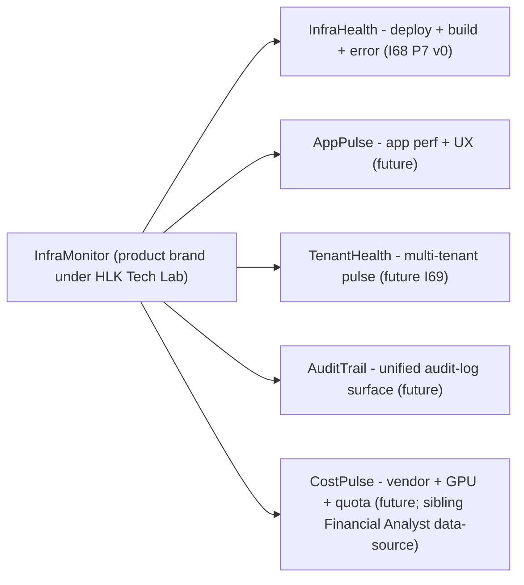
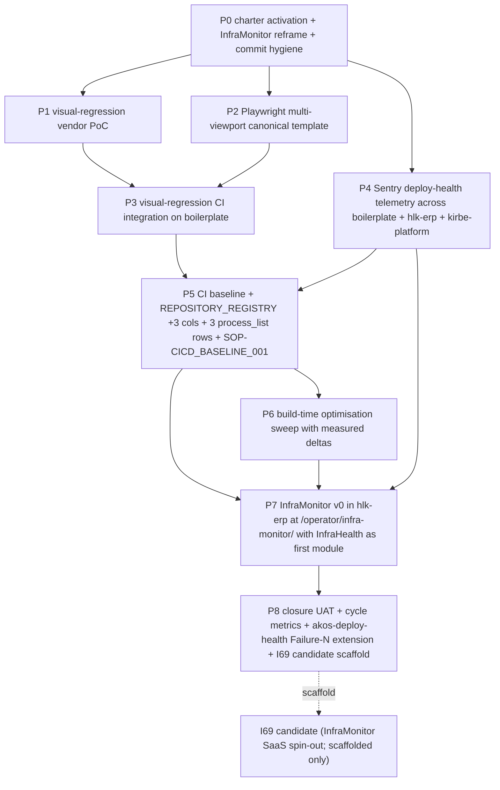

# I68 — CICD Discipline + Observability Maturity

> **status: active (promoted 2026-05-10).** Activation gates satisfied: (a) I66 closed 2026-05-09 (`INITIATIVE_REGISTRY.csv` row 53); (b) operator promotion signal received via Round-2 plan acceptance; (c) Render MCP `unauthorized` blocker CLEARED 2026-05-10 (see [`reports/render-mcp-auth-troubleshooting-2026-05-09.md`](reports/render-mcp-auth-troubleshooting-2026-05-09.md) closure header). The 8-phase scope is **deepened** by the Round-2 plan ([`~/.cursor/plans/i68_cicd_activation_roadmap_592a78e2.plan.md`](https://example.invalid/cursor-plans-not-in-repo)) which adds two new decisions (D-IH-68-K + D-IH-68-L), two new risks (R-IH-68-11 NEW + R-IH-68-12 NEW), and the InfraMonitor architectural reframe captured in §0.1 below.

## 0.1 InfraMonitor architectural reframe (D-IH-68-K + D-IH-68-L; Round 2 / 2026-05-10)

The original charter listed an "InfraMonitor seed dashboard" as a flat operator surface at `/operator/infra-health`. Round-2 review against the [I66 BRAND_ARCHITECTURE](../../references/hlk/v3.0/Admin/O5-1/Marketing/Brand/BRAND_ARCHITECTURE.md) tree (which already positions **InfraMonitor 2026** as a sibling product brand under HLK Tech Lab, alongside MADEIRA / KiRBe / ENVOY) surfaced a misalignment. The reframe:

- **InfraMonitor** is the **product-brand namespace** (sibling of MADEIRA / KiRBe / ENVOY under HLK Tech Lab).
- **InfraHealth** is its **first module** (deploy + build + error + source-map + release telemetry).
- **v0 ships in `hlk-erp`** at `/operator/infra-monitor/` (namespace shell) + `/operator/infra-monitor/health/` (first sub-route) reusing the operator-surface chassis built by I62 (auth + RBAC + audit-log + brand tokens + Cmd+K + freshness ribbon + locale + time-travel).
- **Future modules** (AppPulse / TenantHealth / AuditTrail / CostPulse) slot in as additional sub-routes without renames.
- **SaaS spin-out** (multi-tenant + customer-facing + paid) is the **I69 candidate** scaffolded at P8 closure under [`docs/wip/planning/_candidates/i69-inframonitor-saas-product.md`](../_candidates/i69-inframonitor-saas-product.md).

**Why I62 / I64 / I65 are NOT modules of InfraMonitor** (audience + SaaS-intent + data-sovereignty split):

- **Audience.** I62 / I64 / I65 are for **Holistika's own System Owner role** (per `baseline_organisation.csv` AccessLevel ≥ 4). InfraMonitor (as product brand) is for **external customers' system owners** monitoring their own systems.
- **SaaS intent.** I62 / I64 / I65 are internal Holistika ops with no commercial intent. InfraMonitor IS commercial intent (sibling to KiRBe / MADEIRA which are commercial SaaS plays).
- **Data sovereignty.** I62 / I64 / I65 read directly from AKOS canonical CSVs + `compliance.*_mirror` Supabase tables (Holistika's own data). InfraMonitor SaaS would need per-tenant Supabase projects (or row-level multi-tenancy with FK-tagging) + customer-controlled data deletion (GDPR) + audit-log scoping per tenant.

What IS shared is the **operator-surface chassis** I62 built — inherited structurally (via `hlk-erp/app/operator/` namespace + middleware + brand tokens + RBAC matrix) NOT hierarchically. When InfraMonitor spins out to I69, the chassis-extraction work becomes its own initiative.

## 0. Why this initiative

Three concurrent observations triggered the charter:

1. **Build-fix incident (I66 P5, 2026-05-09)**: 16 of 20 boilerplate deployments were ERROR; 5 sequential failure modes (TypeScript declaration-merge / Sentry CLI 504 / static-prerender Supabase / mobile navbar overflow / sticky-header overlap) had to be fixed in-flight. Each failure was solvable but **discovery was reactive**. The pattern needs proactive coverage.
2. **Visual regression gap**: There's no automated detection of visual changes across PRs. Operator-driven UAT (browser-use subagent + manual check) catches issues but isn't repeatable or scalable across many consumer repos. Operator request: "I'm interested in visual regression — Percy / Argos / Chromatic — design the best and lock the initiative."
3. **InfraMonitor seed**: Operator flagged this as a future product — "an app that lets a system owner see what's happening over their systems, each their admin/user journey." The data feed for InfraMonitor (deploy-health metrics, error rates, performance degradations, build-time trends) is essentially what good CICD observability produces. So InfraMonitor is partially **emergent** from this initiative's outputs.

The cursor rule [`akos-deploy-health.mdc`](../../../.cursor/rules/akos-deploy-health.mdc) (created during I66 P5) is the **discipline** layer; I68 is the **infrastructure + automation** layer that operationalises it.

## 1. Scope

### 1.1 In scope (initial charter)

- **Visual regression integration** in at least one consumer repo (boilerplate, as the highest-traffic public surface) with a chosen tool from a researched shortlist.
- **Multi-viewport Playwright suite extension** to cover mobile / tablet / desktop / wide-desktop breakpoints (5 standard viewports per cursor rule §"Step 3 — Visual smoke").
- **Sentry observability hardening**: not just error capture, but **deploy-health telemetry** (deploy duration, build-step durations, success/failure rates, source-map upload health). This is the seed data for InfraMonitor.
- **GitHub Actions / Vercel CI consolidation**: ensure every consumer repo runs a baseline-equivalent CICD posture (lint + type + e2e + visual + lighthouse). Per-repo customisation allowed; the **baseline** is shared.
- **Build-time discipline**: enforce the < 2-min preview-build target on `boilerplate`, `hlk-erp`, and any future Next.js / SPA repo. Catalogue per-repo current build times. Apply targeted optimisations.
- **InfraMonitor v0 namespace shell + InfraHealth module** (per D-IH-68-K reframe): a v0 read-only operator surface at `hlk-erp/app/operator/infra-monitor/` (namespace shell) + `hlk-erp/app/operator/infra-monitor/health/` (first sub-route = InfraHealth module) + `hlk-erp/app/operator/infra-monitor/health/[repo-slug]/` (per-repo drill-in) displaying per-repo deploy-health + error-rate + build-time trend lines. Pure read; no actions; remediation stays in vendor consoles. Reuses I62 chassis structurally (auth + RBAC + audit-log + brand tokens + Cmd+K + freshness ribbon + locale + time-travel) without absorbing I62 / I64 / I65 sibling routes.
- **Cursor-rule companion updates**: extend `akos-deploy-health.mdc` with new failure patterns discovered in P1+, plus reference the I68 deliverables (Playwright-config templates, visual-regression CI workflow, Sentry config templates).

### 1.2 Out of scope (will defer to follow-up I-NN)

- **Full InfraMonitor product** (mobile app, multi-tenancy, alerting workflows, agent-driven remediation) — only the **read-only data feed + v0 dashboard** is in I68 scope. Full product is a separate initiative.
- **Self-hosted observability stack** (Grafana / Prometheus / Loki) — out of I68 scope; cloud-vendor-managed only (Sentry, Vercel Analytics, possibly Datadog free tier).
- **Cost-optimisation analysis** of all hosting / observability vendors — out of I68 scope (would need a finops-led initiative).

## 2. Phase plan (8 phases)

### P0 — Charter activation + InfraMonitor reframe + commit hygiene (2 days; PAUSE POINT #1)

- This master-roadmap (now carrying the §0.1 reframe + simplified §3 dependency mermaid).
- [`decision-log.md`](decision-log.md) with decision IDs D-IH-68-A through D-IH-68-L (10 charter + 2 Round-2 = 12 decisions).
- [`asset-classification.md`](asset-classification.md): canonical / mirrored / reference per `PRECEDENCE.md`; Round 2 adds InfraMonitor namespace mirrored rows.
- [`evidence-matrix.md`](evidence-matrix.md): linking decisions → artefacts; Round 2 adds D-IH-68-K + D-IH-68-L + R-IH-68-11 NEW + R-IH-68-12 NEW rows.
- [`risk-register.md`](risk-register.md): R-IH-68-1 through R-IH-68-12 (10 charter + 2 Round-2 NEW).
- [`files-modified.csv`](files-modified.csv): 18-col stub seeded per `akos-planning-traceability.mdc` mandate; `commit_sha=akos-pending` rows backfilled with the actual short SHA after the P0 commit lands.
- [`reports/p0-pause-record-2026-05-10.md`](reports/p0-pause-record-2026-05-10.md): P0 pause record per [`akos-agent-checkpoint-discipline.mdc`](../../../.cursor/rules/akos-agent-checkpoint-discipline.mdc) (mechanical evidence + documentary evidence + pre-P1 self-checkpoint + 5-item operator approval checklist).
- [`reports/render-mcp-auth-troubleshooting-2026-05-09.md`](reports/render-mcp-auth-troubleshooting-2026-05-09.md): closure header added noting MCP cleared 2026-05-10.
- INITIATIVE_REGISTRY row 55 flipped: `status` `gated_operator` → `active`; `gated_on` cleared; `operator_action` → `Approve P5 canonical CSV gate when reached`; `last_review` 2026-05-10.
- [`docs/wip/planning/README.md`](../README.md) row 60 status badge `Charter` → `Active`; summary refreshed to surface InfraMonitor v0 + InfraHealth module.
- [`CHANGELOG.md`](../../../CHANGELOG.md) `[Unreleased]` entry per [`akos-docs-config-sync.mdc`](../../../.cursor/rules/akos-docs-config-sync.mdc).
- **PAUSE POINT #1**: operator approves (1) charter promotion to `active`; (2) D-IH-68-K reframe + D-IH-68-L route namespace; (3) Render MCP unblock confirmed and P4b/P5b folded; (4) P1 vendor PoC scope (Argos free tier on `boilerplate`, Lost Pixel as fallback); (5) P5 canonical CSV gate scheduling.

### P1 — Visual regression tool selection (research-driven; 2-3 days)

Research-led decision per HLK methodology. Candidates ranked (initial recommendation, subject to P1 deeper research):

| Tool | Pricing | Strengths | Weaknesses | Fit |
|:---|:---|:---|:---|:---|
| **Argos** ⭐ recommended | Free OSS / $19/mo small team / GitHub-acquired 2024 | GitHub-native, Playwright-first, Vercel-friendly, free tier covers small projects | Younger ecosystem than Percy | Strong for Holistika's stack (Next.js + Vercel + Playwright) |
| **Percy** (BrowserStack) | From $149/mo | Mature, broad tooling integration | Costlier, dashboard separate from GitHub | Solid but expensive |
| **Chromatic** | Free OSS / from $149/mo | Best-in-class for Storybook-driven workflows | Requires Storybook adoption | Only if Holistika decides to add Storybook |
| **Lost Pixel** | OSS / $0 self-hosted / cloud paid | Open-source, no vendor lock-in | More setup work | Solid for cost-conscious + privacy-conscious teams |

**Recommended P1 outcome**: Argos with Playwright integration as primary; Lost Pixel self-hosted as fallback if cost discipline becomes critical. **Decision**: D-IH-68-A.

### P2 — Multi-viewport Playwright suite extension (3-4 days)

Per consumer repo with a frontend (`boilerplate`, `hlk-erp`, `kirbe-frontend`, future):

- 5 standard viewports per `akos-deploy-health.mdc` §"Step 3".
- Smoke tests for top-level routes (home, key public pages, `/operator/*` operator surfaces).
- Locale switching (EN / ES / FR for `boilerplate`; per-repo for others).
- Auth-state handling (preview-protected deploys; reusable session credentials in CI).
- Console-error / 404 capture as test assertions.

Pause point #2 (canonical-CSV-equivalent — touches CI infrastructure).

### P3 — Visual regression integration (chosen tool from P1; 3 days)

- CI workflow file template (GitHub Actions or Vercel-integrated).
- Baseline screenshot capture + storage per branch.
- PR comment integration (visual diff link in PR).
- Threshold tuning (pixel diff % allowed; per-page overrides for animation-heavy pages).
- Onboarding doc per consumer repo.

### P4 — Sentry observability hardening + deploy-health telemetry across all 3 active platform repos (4 days)

> **Round-2 update**: Render MCP `unauthorized` blocker CLEARED 2026-05-10 ⇒ `kirbe-platform` (Render-hosted) participates from day 1; no deferred P4b slice.

- Audit current Sentry config across `boilerplate` (Vercel), `hlk-erp` (Vercel), `kirbe-platform` (Render): org / project / DSN / sample rates / release management.
- Add **deploy-health metrics** beyond error capture:
  - Deploy success/failure rate per repo (rolling 7d / 30d).
  - Build-time trend line per repo (rolling 30d).
  - Source-map upload health.
  - Lighthouse score trend (separate but adjacent).
- Standardise Sentry `release` format `<repo-slug>@<commit-sha-short>` (D-IH-68-I) for cross-repo correlation; `kirbe-platform` Render-equivalent skip-on-preview maps to `RENDER_SERVICE_TYPE != "preview" || git_branch == "main"`.
- Mint `SENTRY_DASHBOARD_HOLISTIKA.md` canonical doc + `validate_sentry_release_format.py` validator + Pydantic model in `akos/sentry_release.py` per [`CONTRIBUTING.md`](../../../CONTRIBUTING.md) §"Python Code Standards".
- Define alerting thresholds (operator decides what's alert-worthy; default conservative).

### P5 — GitHub Actions / Vercel / Render CI baseline + canonical CSV gate (4 days; PAUSE POINT #3)

> **Round-2 update**: Render MCP cleared ⇒ Render YAML template (`_templates/render/render-baseline.yaml.tmpl`) lands alongside the GitHub Actions template in P5 main path, no deferred P5b slice. Per-repo PR rollout: `boilerplate` (canary, reference-class) → `hlk-erp` (operator-internal) → `kirbe-platform` (production-customer-facing; coordinates with KirBe team review window).

- Inventory current CI posture per consumer repo (per `REPOSITORY_REGISTRY.csv`).
- Mint canonical SOP `SOP-CICD_BASELINE_001.md` (status: `review` at land time; promoted to `active` in P8) defining per-class baselines:
  - `class=platform` (kirbe-platform, hlk-erp, openclaw-akos): lint + type + unit + Playwright smoke + visual-regression + Lighthouse + brand drift gates (where applicable).
  - `class=reference` (boilerplate): all of the above (boilerplate IS the brand surface).
  - `class=internal`: lint + type + unit only.
- Mint canonical templates: GitHub Actions workflow at `_templates/github-workflows/ci-baseline.yml.tmpl` + Render YAML at `_templates/render/render-baseline.yaml.tmpl`.
- Mint `validate_cicd_baseline.py` + Pydantic `CICDBaselineRule` in `akos/cicd_baseline.py` per [`CONTRIBUTING.md`](../../../CONTRIBUTING.md).
- **Canonical CSV bumps (PAUSE POINT #3 — MANDATORY operator gate per [`akos-governance-remediation.mdc`](../../../.cursor/rules/akos-governance-remediation.mdc)):**
  - `REPOSITORY_REGISTRY.csv` +3 columns: `ci_baseline_version`, `build_time_target_seconds`, `ci_baseline_optouts`.
  - `process_list.csv` +3 rows under `env_tech_*` prefix: `cicd_baseline_maintenance` (System Owner; quarterly), `observability_dashboard_review` (System Owner; monthly), `visual_regression_triage` (System Owner; per-PR-as-needed).
- Per-repo `bless_external_repo.py` extension: new `--with ci-baseline` flag (additive; idempotent + sha256-stamped per existing bless pattern).
- `check_external_repo_ci_posture.py` extension: cross-check each `class=platform` repo's actual CI against the SOP baseline version recorded in `REPOSITORY_REGISTRY.csv ci_baseline_version`.
- Apply baseline retroactively to existing consumer repos (PRs per repo, validated independently per R-IH-68-6 mitigation).

### P6 — Build-time optimisation sweep (3 days)

- Profile current build times per consumer repo (baseline measurement).
- Apply targeted optimisations per `akos-deploy-health.mdc` §"Step 4":
  - Sentry skip-on-preview pattern (already done for `boilerplate` in I66 P5).
  - Build cache validation.
  - Static-prerender review (lazy-init for data-source-dependent routes).
  - Framework-level (Turbopack opt-in for Next.js 14+, etc.).
- Target: < 2 min for typical preview build per consumer repo.

### P7 — InfraMonitor v0 namespace shell + InfraHealth module (5-6 days; PAUSE POINT #4 page-spec gate)

> **Round-2 update (D-IH-68-K + D-IH-68-L)**: route is `/operator/infra-monitor/` (namespace shell) + `/operator/infra-monitor/health/` (first sub-route = InfraHealth module) + `/operator/infra-monitor/health/[repo-slug]/` (drill-in). Original charter route `/operator/infra-health` is **renamed** per the architectural reframe.

- **PAUSE POINT #4 (page-spec gate before code lands)** per I64 v2 page-spec discipline precedent: file `reports/p7-page-spec-impeccable-2026-05-NN.md` with Impeccable laws (5 setup gates), 3–5 named user journeys (J1 daily glance / J2 drill on red / J3 build-time investigation / J4 future-module preview), information architecture (verdict band > module grid > drill-in), explicit anti-patterns rejected (no auto-refresh / no traffic-light row tints / no actions in v0 / no fake percentages).
- New routes in `hlk-erp`:
  - `hlk-erp/app/operator/infra-monitor/page.tsx` — namespace shell (module-picker home + verdict band + future-module placeholder cards rendered as `coming with I69`).
  - `hlk-erp/app/operator/infra-monitor/health/page.tsx` — InfraHealth module landing (per-repo cards: color-coded verdict + last-deploy timestamp + last-5-deploys mini-trend SVG + current Sentry error count + current build-time vs target).
  - `hlk-erp/app/operator/infra-monitor/health/[repo-slug]/page.tsx` — drill-in (per-repo timeline of last 30 deploys + recent Sentry release-grouped errors + build-time inflection points + click-through to vendor consoles).
- Stateless server-side aggregator at `hlk-erp/lib/infra-monitor/health-aggregator.ts` reading Vercel API + Render API (now-cleared) + Sentry API; 5-min in-memory TTL via Next.js `cache()` (R-IH-68-10 mitigation); reads `REPOSITORY_REGISTRY.csv` via `compliance.repository_registry_mirror` Supabase view.
- **No actions in v0** (R-IH-68-4 explicit OOS); only outbound interactions are deep-links to Vercel + Render + Sentry vendor consoles.
- RBAC: route protected at AccessLevel ≥ 4 (operator) per I62 RBAC matrix; audit-log entry on every load via existing `holistika_ops.audit_log`.
- Reuses I62 chassis structurally (namespace + middleware + brand tokens + Cmd+K + freshness ribbon + locale + time-travel) NOT hierarchically.

### P8 — Closure + handoff (2-3 days)

- Cycle metrics: build-time deltas, deploy-success-rate deltas, time-to-detect-regression deltas.
- CHANGELOG + USER_GUIDE + ARCHITECTURE updates.
- INITIATIVE_REGISTRY row close (I68).
- Optional: charter follow-up I-NN for full InfraMonitor product (mobile + alerting + agent remediation).

## 3. Phase dependency diagram (Round 2 — Render-gating node removed)

P1 ‖ P2 ‖ P4 (after P0). P3 gates on both P1 + P2. P5 gates on P3 + P4 (and is the canonical CSV gate per `akos-governance-remediation.mdc`). P6 sequential after P5. P7 page-spec can start once P5 lands; P7 build needs P4 + P5 + P6 telemetry available.

## 4. Key decisions (preview; full list in `decision-log.md`)

| ID | Decision | Owner | Status |
|:---|:---|:---|:---|
| D-IH-68-A | Visual regression tool selection | System Owner | open (recommended: Argos; final in P1) |
| D-IH-68-B | Multi-viewport set (which viewports are mandatory vs optional) | Brand Manager + System Owner | open (default: 5 per `akos-deploy-health.mdc`) |
| D-IH-68-C | Sentry sample-rate strategy (production vs preview) | System Owner + CTO | open |
| D-IH-68-D | Baseline CI workflow contents (test minima per repo) | System Owner | open |
| D-IH-68-E | Build-time targets (<2min for preview baseline) | System Owner + CBO | open |
| D-IH-68-F | InfraMonitor v0 location (`hlk-erp` operator surface vs separate repo) | CBO + CTO | open (recommended: `hlk-erp`) |
| D-IH-68-G | Self-hosted vs vendor-managed observability long-term direction | CTO + CFO (cost) | open |
| D-IH-68-H | Visual-regression baseline storage (cloud vs git-stored) | System Owner | open |
| D-IH-68-I | Cross-repo release SHA / version correlation strategy | System Owner | open |
| D-IH-68-J | Per-repo opt-out criteria (when a repo can skip a baseline check) | Brand Manager + System Owner | open |
| **D-IH-68-K** (Round 2 NEW) | InfraMonitor architectural reframe: product-brand namespace under HLK Tech Lab; InfraHealth as first module; v0 ships in `hlk-erp`; SaaS spin-out is I69 candidate | System Owner + Brand Manager | **closed in P0** (this plan) |
| **D-IH-68-L** (Round 2 NEW) | Route namespace `/operator/infra-monitor/` shell + `/operator/infra-monitor/health/` first module sub-route; future modules slot in without renames | System Owner | **closed in P0** (this plan) |

## 5. Risks (preview; full list in `risk-register.md`)

- **R-IH-68-1**: Vendor lock-in on chosen visual-regression tool.
- **R-IH-68-2**: Build-time target unachievable for some repos (e.g., legacy `/dashboard` tree in `boilerplate` — operator decommission queued).
- **R-IH-68-3**: Sentry quota exhaustion at high traffic.
- **R-IH-68-4**: InfraMonitor seed scope creep into full product mid-initiative.
- **R-IH-68-5**: Visual-regression false positives blocking PRs (threshold-tuning challenge).
- **R-IH-68-6**: CI baseline applied retroactively breaks existing tests in some repos.
- **R-IH-68-7**: Sentry source-map storage costs as repo count grows.
- **R-IH-68-8**: Vercel preview-protection blocks visual-regression CI from accessing previews.
- **R-IH-68-9**: Operator burnout if I68 spans concurrently with active I66 (mitigated — I66 closed 2026-05-09).
- **R-IH-68-10**: InfraMonitor v0 reads vendor APIs that rate-limit.
- **R-IH-68-11 NEW (Round 2)**: InfraMonitor module-namespace prematurely couples with future SaaS multi-tenancy. Mitigation: v0 stays single-tenant; modules ESM-bundled per route; multi-tenant boundary is I69 P0; chassis sharing with I62/I64/I65 is structural, not hierarchical.
- **R-IH-68-12 NEW (Round 2)**: Argos GitHub App PR-from-fork permission constraint blocks community-PR visual regression. Mitigation: P3 documents `pull_request_target` + `vetted-by-owner` label pattern.

## 6. Verification matrix (per phase)

- P0 → **PAUSE POINT #1**: operator approves charter promotion + reframe + Render unblock + P1 vendor PoC scope + P5 canonical CSV gate scheduling.
- P1 → vendor PoC report (Argos vs Lost Pixel); D-IH-68-A + D-IH-68-H closed.
- P2 → canonical Playwright config template + `validate_playwright_baseline.py` + Pydantic model + tests; sibling-repo carry-overs; D-IH-68-B closed.
- P3 → visual-regression PR comment visible on a real `boilerplate` PR; **PAUSE POINT #2** operator UX review of PR-comment surface.
- P4 → Sentry dashboard shows deploy-health metrics across `boilerplate` + `hlk-erp` + `kirbe-platform`; `validate_sentry_release_format.py` PASS; D-IH-68-C + D-IH-68-G + D-IH-68-I closed.
- P5 → **PAUSE POINT #3 MANDATORY canonical CSV gate**: operator approves `REPOSITORY_REGISTRY.csv` +3 columns + 3 `process_list.csv` `env_tech_*` rows + `SOP-CICD_BASELINE_001.md` v0.9.0 + per-repo PR rollout sequence; D-IH-68-D + D-IH-68-J closed.
- P6 → build-time pre/post measurements; ≥20% improvement on Vercel previews; ≥15% on Render builds; D-IH-68-E closed.
- P7 → **PAUSE POINT #4 page-spec gate**: operator approves page-spec doc BEFORE TSX code lands. Then operator opens `/operator/infra-monitor/` (namespace shell) + `/operator/infra-monitor/health/` (InfraHealth module) + drill-in route; D-IH-68-F + D-IH-68-K + D-IH-68-L closed.
- P8 → cycle metrics report; closure UAT; `akos-deploy-health.mdc` Failure-N catalogue extension; I69 candidate scaffold; closure pause record (implicit).

## 7. Cross-references

- Cursor rule: [`.cursor/rules/akos-deploy-health.mdc`](../../../.cursor/rules/akos-deploy-health.mdc) — discipline layer that I68 operationalises.
- I66 P5 build-fix incident → motivation; commits referenced in `files-modified.csv`.
- I63 External Repo Bless Pattern → consumer-repo-registry foundation that P5 baseline workflow extends.
- I62 Mission Control → operator-surface paradigm that P7 InfraMonitor seed extends.
- D-IH-66-AC → "this rule is the discipline; I68 is the automation" cross-reference.

