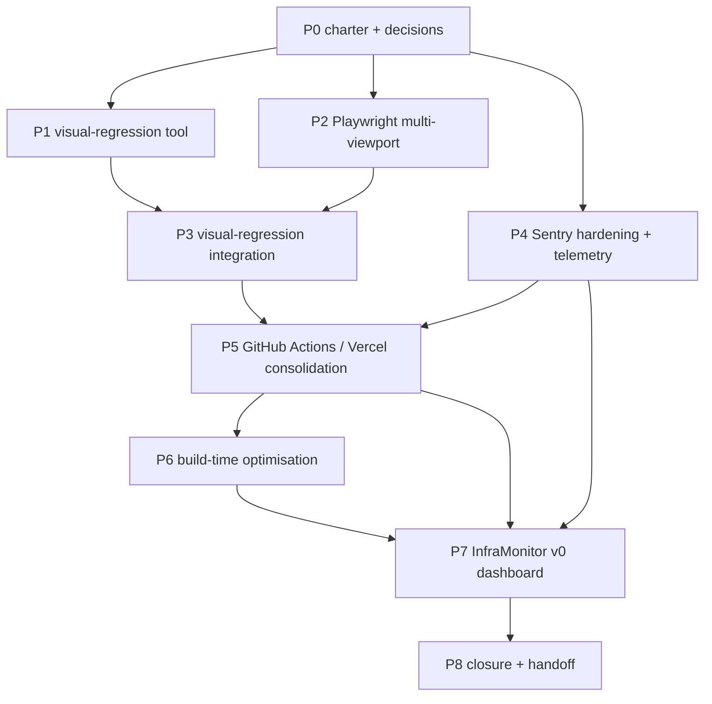

---
initiative_id: INIT-OPENCLAW_AKOS-68
title: CICD Discipline + Observability Maturity (Visual Regression + Build-Time Discipline + InfraMonitor Seed)
status: gated_operator
owner_role: System Owner
inception: 2026-05-09
last_review: 2026-05-09
linked_decisions:
  - D-IH-66-AC (recurrent CICD discipline cursor rule extracted to I68)
authority: Founder + System Owner + CTO + Brand Manager
language: en
linked_initiatives:
  - I66 (Brand, Vision, Ops Sweep — surfaced the build-fix incident that motivated this charter)
  - I63 (External Repo Bless Pattern — provides the consumer-repo-registry foundation)
  - I62 (Mission Control — provides the operator-surface paradigm InfraMonitor seed extends)
deferred_until: post-I66-closure (P8) or operator-priority signal
---

# I68 — CICD Discipline + Observability Maturity

> **status: gated_operator (locked for future launch).** This initiative is **chartered, not active.** It defines the scope + tool selection + phase plan for hardening Holistika's CICD pipeline + observability surface across all consumer repos. Activation gates on (a) I66 closure (P8) and (b) explicit operator promotion signal. The charter is sized to be promotable as-is when those conditions hold; phases are sequenced so the operator can run only P0+P1 (decisions) before deciding whether to execute P2+ at full scope or split into a smaller follow-up.

## 0. Why this initiative

Three concurrent observations triggered the charter:

1. **Build-fix incident (I66 P5, 2026-05-09)**: 16 of 20 boilerplate deployments were ERROR; 5 sequential failure modes (TypeScript declaration-merge / Sentry CLI 504 / static-prerender Supabase / mobile navbar overflow / sticky-header overlap) had to be fixed in-flight. Each failure was solvable but **discovery was reactive**. The pattern needs proactive coverage.
2. **Visual regression gap**: There's no automated detection of visual changes across PRs. Operator-driven UAT (browser-use subagent + manual check) catches issues but isn't repeatable or scalable across many consumer repos. Operator request: "I'm interested in visual regression — Percy / Argos / Chromatic — design the best and lock the initiative."
3. **InfraMonitor seed**: Operator flagged this as a future product — "an app that lets a system owner see what's happening over their systems, each their admin/user journey." The data feed for InfraMonitor (deploy-health metrics, error rates, performance degradations, build-time trends) is essentially what good CICD observability produces. So InfraMonitor is partially **emergent** from this initiative's outputs.

The cursor rule [`akos-deploy-health.mdc`](../../../.cursor/rules/akos-deploy-health.mdc) (created during I66 P5) is the **discipline** layer; I68 is the **infrastructure + automation** layer that operationalises it.

## 1. Scope

### 1.1 In scope (initial charter)

- **Visual regression integration** in at least one consumer repo (boilerplate, as the highest-traffic public surface) with a chosen tool from a researched shortlist.
- **Multi-viewport Playwright suite extension** to cover mobile / tablet / desktop / wide-desktop breakpoints (5 standard viewports per cursor rule §"Step 3 — Visual smoke").
- **Sentry observability hardening**: not just error capture, but **deploy-health telemetry** (deploy duration, build-step durations, success/failure rates, source-map upload health). This is the seed data for InfraMonitor.
- **GitHub Actions / Vercel CI consolidation**: ensure every consumer repo runs a baseline-equivalent CICD posture (lint + type + e2e + visual + lighthouse). Per-repo customisation allowed; the **baseline** is shared.
- **Build-time discipline**: enforce the < 2-min preview-build target on `boilerplate`, `hlk-erp`, and any future Next.js / SPA repo. Catalogue per-repo current build times. Apply targeted optimisations.
- **InfraMonitor seed dashboard**: a v0 read-only operator surface that displays per-repo deploy-health + error-rate + build-time trend lines. Lives in `hlk-erp` as `/operator/infra-health` (or similar). Pure read; no actions.
- **Cursor-rule companion updates**: extend `akos-deploy-health.mdc` with new failure patterns discovered in P1+, plus reference the I68 deliverables (Playwright-config templates, visual-regression CI workflow, Sentry config templates).

### 1.2 Out of scope (will defer to follow-up I-NN)

- **Full InfraMonitor product** (mobile app, multi-tenancy, alerting workflows, agent-driven remediation) — only the **read-only data feed + v0 dashboard** is in I68 scope. Full product is a separate initiative.
- **Self-hosted observability stack** (Grafana / Prometheus / Loki) — out of I68 scope; cloud-vendor-managed only (Sentry, Vercel Analytics, possibly Datadog free tier).
- **Cost-optimisation analysis** of all hosting / observability vendors — out of I68 scope (would need a finops-led initiative).

## 2. Phase plan (8 phases)

### P0 — Charter + decisions (this commit; ~3 days execution when promoted)

- This master-roadmap.
- [`decision-log.md`](decision-log.md) with decision IDs D-IH-68-A through D-IH-68-J (10 decisions).
- [`asset-classification.md`](asset-classification.md): canonical / mirrored / reference per `PRECEDENCE.md`.
- [`evidence-matrix.md`](evidence-matrix.md): linking decisions → artefacts.
- [`risk-register.md`](risk-register.md): R-IH-68-1 through R-IH-68-7.
- [`files-modified.csv`](files-modified.csv): empty 18-col stub seeded per `akos-planning-traceability.mdc` mandate.
- INITIATIVE_REGISTRY row at `status: gated_operator`.
- Pause point #1: operator approves decision package before P1.

### P1 — Visual regression tool selection (research-driven; 2-3 days)

Research-led decision per HLK methodology. Candidates ranked (initial recommendation, subject to P1 deeper research):

| Tool | Pricing | Strengths | Weaknesses | Fit |
|:---|:---|:---|:---|:---|
| **Argos** ⭐ recommended | Free OSS / $19/mo small team / GitHub-acquired 2024 | GitHub-native, Playwright-first, Vercel-friendly, free tier covers small projects | Younger ecosystem than Percy | Strong for Holistika's stack (Next.js + Vercel + Playwright) |
| **Percy** (BrowserStack) | From $149/mo | Mature, broad tooling integration | Costlier, dashboard separate from GitHub | Solid but expensive |
| **Chromatic** | Free OSS / from $149/mo | Best-in-class for Storybook-driven workflows | Requires Storybook adoption | Only if Holistika decides to add Storybook |
| **Lost Pixel** | OSS / $0 self-hosted / cloud paid | Open-source, no vendor lock-in | More setup work | Solid for cost-conscious + privacy-conscious teams |

**Recommended P1 outcome**: Argos with Playwright integration as primary; Lost Pixel self-hosted as fallback if cost discipline becomes critical. **Decision**: D-IH-68-A.

### P2 — Multi-viewport Playwright suite extension (3-4 days)

Per consumer repo with a frontend (`boilerplate`, `hlk-erp`, `kirbe-frontend`, future):

- 5 standard viewports per `akos-deploy-health.mdc` §"Step 3".
- Smoke tests for top-level routes (home, key public pages, `/operator/*` operator surfaces).
- Locale switching (EN / ES / FR for `boilerplate`; per-repo for others).
- Auth-state handling (preview-protected deploys; reusable session credentials in CI).
- Console-error / 404 capture as test assertions.

Pause point #2 (canonical-CSV-equivalent — touches CI infrastructure).

### P3 — Visual regression integration (chosen tool from P1; 3 days)

- CI workflow file template (GitHub Actions or Vercel-integrated).
- Baseline screenshot capture + storage per branch.
- PR comment integration (visual diff link in PR).
- Threshold tuning (pixel diff % allowed; per-page overrides for animation-heavy pages).
- Onboarding doc per consumer repo.

### P4 — Sentry observability hardening + deploy-health telemetry (4-5 days)

- Audit current Sentry config across consumer repos (org / project / DSN / sample rates / release management).
- Add **deploy-health metrics** beyond error capture:
  - Deploy success/failure rate per repo (rolling 7d / 30d).
  - Build-time trend line per repo (rolling 30d).
  - Source-map upload health.
  - Lighthouse score trend (separate but adjacent).
- Standardise `release` versioning (commit SHA + branch + repo) for cross-repo correlation.
- Define alerting thresholds (operator decides what's alert-worthy; default conservative).

### P5 — GitHub Actions / Vercel CI consolidation (3-4 days)

- Inventory current CI posture per consumer repo (per `REPOSITORY_REGISTRY.csv`).
- Define a **baseline workflow** every consumer repo adopts: lint + type-check + unit-test + Playwright smoke + visual regression + Lighthouse + brand drift gates (where applicable).
- Per-repo `bless_external_repo.py` extension to scaffold the baseline workflow on new consumer repos.
- Apply baseline retroactively to existing consumer repos (PRs per repo).

### P6 — Build-time optimisation sweep (3 days)

- Profile current build times per consumer repo (baseline measurement).
- Apply targeted optimisations per `akos-deploy-health.mdc` §"Step 4":
  - Sentry skip-on-preview pattern (already done for `boilerplate` in I66 P5).
  - Build cache validation.
  - Static-prerender review (lazy-init for data-source-dependent routes).
  - Framework-level (Turbopack opt-in for Next.js 14+, etc.).
- Target: < 2 min for typical preview build per consumer repo.

### P7 — InfraMonitor v0 read-only dashboard (5-6 days)

- New route in `hlk-erp` → `/operator/infra-health` (or similar; final naming per Brand Manager).
- Read-only data surface aggregating P4 deploy-health metrics + Sentry error counts + build-time trends across all consumer repos.
- Per-repo cards: green/yellow/red status, last deploy timestamp, last 5 deploys mini-trend, current Sentry error count.
- Drill-in: per-repo timeline + recent failures with links to build logs.
- **No actions** — pure observability; remediation stays in vendor consoles. (Actions = future product scope.)
- Operator can review the dashboard at start of every operator turn; partly automates the cursor rule's Step 1 deploy-status check.

### P8 — Closure + handoff (2-3 days)

- Cycle metrics: build-time deltas, deploy-success-rate deltas, time-to-detect-regression deltas.
- CHANGELOG + USER_GUIDE + ARCHITECTURE updates.
- INITIATIVE_REGISTRY row close (I68).
- Optional: charter follow-up I-NN for full InfraMonitor product (mobile + alerting + agent remediation).

## 3. Phase dependency diagram

## 4. Key decisions (preview; full list in `decision-log.md`)

| ID | Decision | Owner | Status |
|:---|:---|:---|:---|
| D-IH-68-A | Visual regression tool selection | System Owner | open (recommended: Argos; final in P1) |
| D-IH-68-B | Multi-viewport set (which viewports are mandatory vs optional) | Brand Manager + System Owner | open (default: 5 per `akos-deploy-health.mdc`) |
| D-IH-68-C | Sentry sample-rate strategy (production vs preview) | System Owner + CTO | open |
| D-IH-68-D | Baseline CI workflow contents (test minima per repo) | System Owner | open |
| D-IH-68-E | Build-time targets (<2min for preview baseline) | System Owner + CBO | open |
| D-IH-68-F | InfraMonitor v0 location (`hlk-erp` operator surface vs separate repo) | CBO + CTO | open (recommended: `hlk-erp`) |
| D-IH-68-G | Self-hosted vs vendor-managed observability long-term direction | CTO + CFO (cost) | open |
| D-IH-68-H | Visual-regression baseline storage (cloud vs git-stored) | System Owner | open |
| D-IH-68-I | Cross-repo release SHA / version correlation strategy | System Owner | open |
| D-IH-68-J | Per-repo opt-out criteria (when a repo can skip a baseline check) | Brand Manager + System Owner | open |

## 5. Risks (preview; full list in `risk-register.md`)

- **R-IH-68-1**: Vendor lock-in on chosen visual-regression tool.
- **R-IH-68-2**: Build-time target unachievable for some repos (e.g., legacy `/dashboard` tree in `boilerplate` — operator decommission queued).
- **R-IH-68-3**: Sentry quota exhaustion at high traffic.
- **R-IH-68-4**: InfraMonitor seed scope creep into full product mid-initiative.
- **R-IH-68-5**: Visual-regression false positives blocking PRs (threshold-tuning challenge).
- **R-IH-68-6**: CI baseline applied retroactively breaks existing tests in some repos.
- **R-IH-68-7**: Sentry source-map storage costs as repo count grows.

## 6. Verification matrix (per phase)

- P0 → operator approves charter package.
- P1 → tool research report; vendor demo (if applicable); cost analysis.
- P2 → Playwright suite passes on `boilerplate` (canary repo) at all 5 viewports.
- P3 → visual-regression PR comment visible on a test PR.
- P4 → Sentry dashboard shows deploy-health metrics for `boilerplate`.
- P5 → all `REPOSITORY_REGISTRY.csv` `state=active` rows have baseline CI workflow.
- P6 → build-time benchmarks before/after, < 2 min for `boilerplate` + `hlk-erp` previews.
- P7 → operator can open `/operator/infra-health`, see all consumer repos, drill into one.
- P8 → cycle metrics report; closure pause record.

## 7. Cross-references

- Cursor rule: [`.cursor/rules/akos-deploy-health.mdc`](../../../.cursor/rules/akos-deploy-health.mdc) — discipline layer that I68 operationalises.
- I66 P5 build-fix incident → motivation; commits referenced in `files-modified.csv`.
- I63 External Repo Bless Pattern → consumer-repo-registry foundation that P5 baseline workflow extends.
- I62 Mission Control → operator-surface paradigm that P7 InfraMonitor seed extends.
- D-IH-66-AC → "this rule is the discipline; I68 is the automation" cross-reference.

