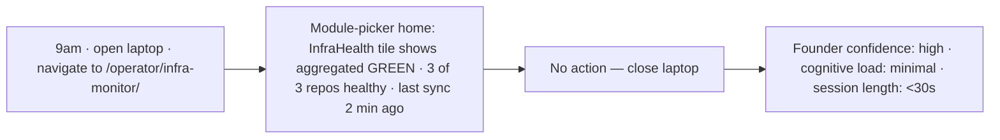
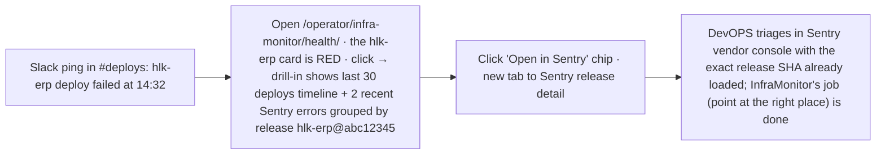
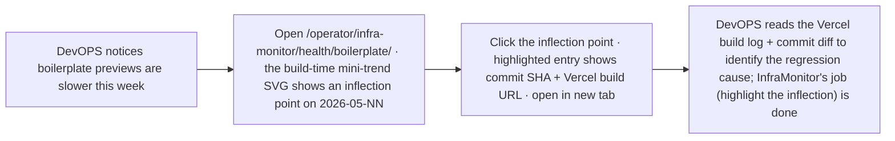
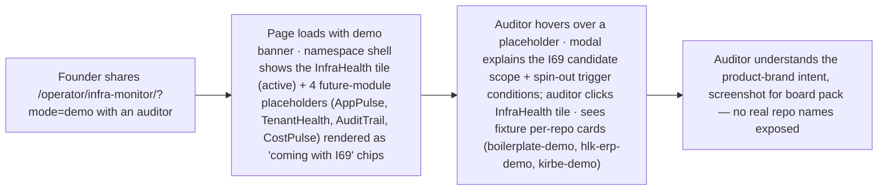
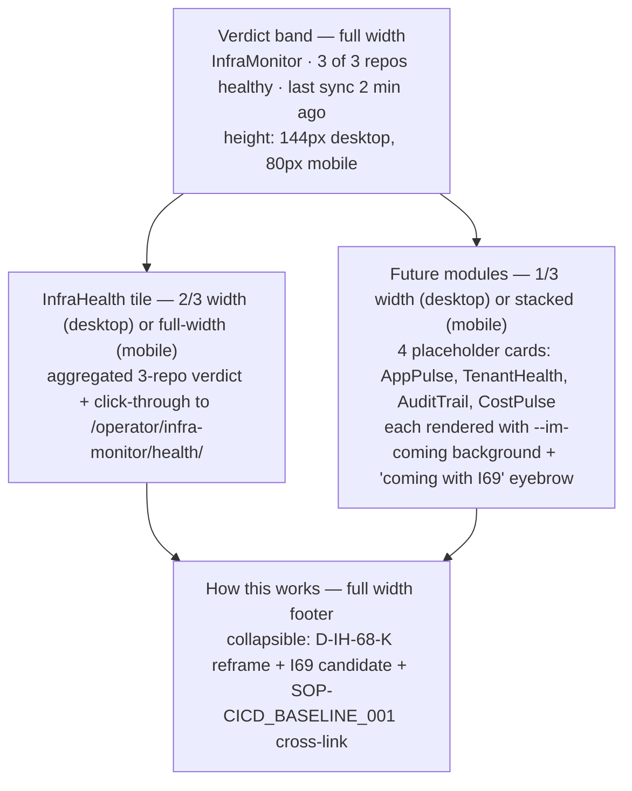
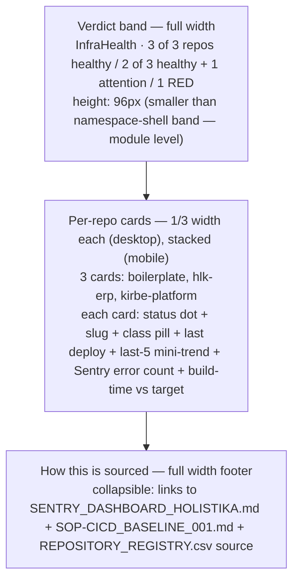
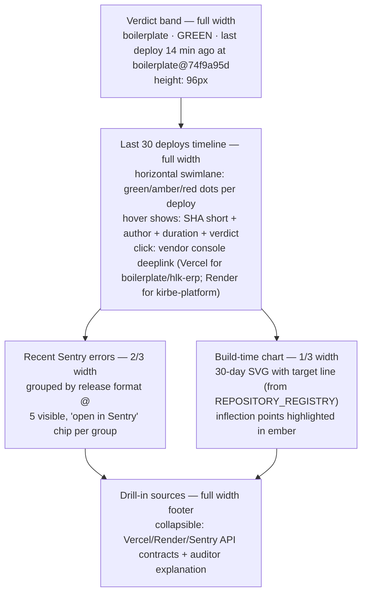

# Impeccable shape — InfraMonitor namespace shell + InfraHealth module v0 (`hlk-erp` `/operator/infra-monitor/`)

> **PAUSE POINT #4 — operator approval gate before P7.2 build starts.**
>
> Per [I68 master-roadmap](../master-roadmap.md) §"P7.1 — Page-spec gate (BEFORE any TypeScript code lands)" + [`.cursor/rules/akos-agent-checkpoint-discipline.mdc`](../../../../.cursor/rules/akos-agent-checkpoint-discipline.mdc) §"Operator pause-points": this v1 page-spec is filed at `status: review` and **must be operator-approved before any TSX/route code lands in `hlk-erp/app/operator/infra-monitor/**`. The I64 v2 page-spec ([`docs/wip/planning/64-governance-mission-control/reports/page-spec-2026-05-06.md`](../../64-governance-mission-control/reports/page-spec-2026-05-06.md)) is the **explicit precedent** for this gate: page-spec before code prevents rebuilds.
>
> Anchors: [`master-roadmap.md`](../master-roadmap.md), [`decision-log.md`](../decision-log.md) D-IH-68-K + D-IH-68-L, [I64 v2 page-spec](../../64-governance-mission-control/reports/page-spec-2026-05-06.md), [I62 impeccable shape](../../62-mission-control/reports/impeccable-shape-mission-control-today-2026-05-06.md), [`BRAND_VISUAL_PATTERNS.md`](../../../references/hlk/v3.0/Admin/O5-1/Marketing/Brand/BRAND_VISUAL_PATTERNS.md), [`BRAND_ARCHITECTURE.md`](../../../references/hlk/v3.0/Admin/O5-1/Marketing/Brand/BRAND_ARCHITECTURE.md), [`SENTRY_DASHBOARD_HOLISTIKA.md`](../../../references/hlk/v3.0/Envoy%20Tech%20Lab/Repositories/SENTRY_DASHBOARD_HOLISTIKA.md), [`SOP-CICD_BASELINE_001.md`](../../../references/hlk/v3.0/Admin/O5-1/Tech/System%20Owner/SOP-CICD_BASELINE_001.md), [`impeccable` skill](../../../../.cursor/skills/impeccable/SKILL.md).

## 0. Architectural reframe carried in (D-IH-68-K + D-IH-68-L)

This page-spec operationalises the Round-2 charter reframe captured in [`decision-log.md`](../decision-log.md):

- **D-IH-68-K** — InfraMonitor is the **product brand**. InfraHealth is the **first module**. v0 ships in `hlk-erp` reusing the I62 chassis structurally (auth + RBAC + audit-log + brand tokens + Cmd+K + freshness ribbon + locale + time-travel) **without absorbing sibling routes** (I62 Mission Control / I64 Governance Mission Control / I65 Planning Workspace stay siblings under the shared `hlk-erp` chassis).
- **D-IH-68-L** — Route namespace `/operator/infra-monitor/` (namespace shell) + `/operator/infra-monitor/health/` (InfraHealth landing) + `/operator/infra-monitor/health/[repo-slug]/` (drill-in). Future modules (AppPulse / TenantHealth / AuditTrail / CostPulse) slot in as additional sub-routes (`/operator/infra-monitor/app-pulse/`, `/operator/infra-monitor/tenant-health/`, etc.) **without renaming** the namespace shell or the InfraHealth module.

The future SaaS spin-out (multi-tenant + customer-facing + paid + multi-module) is the **I69 candidate** scaffolded at I68 P8 — it is **explicitly out of scope** for v0 (charter §"What stays out of scope" + R-IH-68-11 NEW). v0 is internal-Holistika single-tenant read-only.

## 1. Audience and the one job

Three people will open this page. They share **one job**: *"In one screen, tell me whether Holistika's three platform repos (`boilerplate`, `hlk-erp`, `kirbe-platform`) are deploying healthily — and if not, where to click next."*

| Persona | Access | Time budget | Primary signal | Outcome |
|:---|:---|:---|:---|:---|
| **Founder / System Owner** (level 6) | full | **<10 seconds**, glance only | aggregated 3-repo verdict | close laptop or escalate |
| **DevOPS engineer** (level 4) | full | **<3 visual hops** | per-repo card + drill-in | open Vercel/Render/Sentry console with the right context |
| **Auditor / advisor** (level 1, demo mode `?mode=demo`) | demo only | **<60 seconds** | namespace shell + InfraHealth module rendered with fixture repos | screenshot for board pack; understands the product brand |

If a Founder needs to *interact* with this page on a normal day, the page has failed its primary job. **Read-first; remediation lives in vendor consoles** (charter §1.2: "no write actions to vendor APIs — they are authoritative; we observe").

## 2. What's there today

The route doesn't exist. `hlk-erp` ships:

- `/mission-control/` (I62 chassis — Today board + audit log) — the chassis this page reuses **structurally**, not hierarchically.
- `/operator/initiatives/`, `/operator/decisions/`, `/operator/operator-inbox/`, `/operator/cycle-closures/`, `/operator/eval-quality/`, `/operator/compliance-pulse/`, `/operator/cost-finance/` — peer surfaces.
- `/operator/governance/external-repos/` (I64) — peer surface that surfaces **AKOS-governance** of consumer repos (drift, secrets, blessing). InfraMonitor is the **observability** complement: not "is the repo blessed?" but "is the deploy healthy?".
- `/operator/planning-workspace/` (I65) — peer surface for initiative planning workspace.

The AKOS-side observability tooling shipped earlier in I68 emits structured signals but has **no UI projection in `hlk-erp` yet**:

- P2 — `validate_playwright_baseline.py` validates the canonical Playwright config across repos.
- P4 — `validate_sentry_release_format.py` validates the canonical `<repo>@<sha-short>` Sentry release format + [`SENTRY_DASHBOARD_HOLISTIKA.md`](../../../references/hlk/v3.0/Envoy%20Tech%20Lab/Repositories/SENTRY_DASHBOARD_HOLISTIKA.md) is the operator-pasted dashboard YAML.
- P5 — `validate_cicd_baseline.py` + [`SOP-CICD_BASELINE_001.md`](../../../references/hlk/v3.0/Admin/O5-1/Tech/System%20Owner/SOP-CICD_BASELINE_001.md) define the per-class CI baseline; per-platform GHA workflow + Render YAML stub templates.

This is greenfield in the right adjacency: `/operator/infra-monitor/` is one segment over from existing operator surfaces (same auth middleware, same shadcn/ui, same `MissionControlTile` primitive borrowed from I62). The InfraMonitor namespace shell becomes the **anchor** for a product-brand-aware sub-route family that today has one module (InfraHealth) and tomorrow has four future-module placeholders.

## 3. User journeys (`trigger → glance → action → outcome`)

Four journeys define what "intuitive grasp" means here. Each says exactly which surface element fires the signal and which (if any) action follows.

### J-1 — Daily glance (Founder, ~10 seconds)



**Why it works:** The InfraHealth tile carries the **single composite signal** (3-of-3 GREEN) at namespace-shell level. No clicks needed when everything is fine. Future-module placeholder cards (AppPulse / TenantHealth / AuditTrail / CostPulse) render as quiet `coming with I69` chips, not noisy nags.

### J-2 — Drill on red (DevOPS, ~90 seconds)



**Why it works:** The drill-in is a **router pointer**, not a remediation surface. Per-repo card surfaces verdict + last-deploy timestamp + last-5-deploys mini-trend SVG + current Sentry error count + current build-time vs target. The drill-in expands those into the timeline and groups errors by release format `<repo>@<sha-short>` (the P4 deliverable). Vendor-console click-through preserves the operator's session in Vercel/Render/Sentry — InfraMonitor never tries to be a replacement vendor console.

### J-3 — Build-time investigation (DevOPS, ~120 seconds)



**Why it works:** Build-time is encoded as a **mini-trend SVG**, not a numeric pile. The eye finds the inflection point pre-attentively. The build-time target line (per-repo from `REPOSITORY_REGISTRY.csv build_time_target_seconds`, P5 deliverable, gated at PAUSE POINT #3) is overlaid as a horizontal dashed reference. Crossing the target = ember-tinted. The click-through preserves the SHA context.

### J-4 — Future-module preview (Auditor / Advisor, ~60 seconds)



**Why it works:** Demo mode is a **first-class data source** (demo fixtures live in `hlk-erp/lib/infra-monitor/__fixtures__/`), not a stylesheet trick. The future-module placeholders communicate **intent** (Holistika has a product-brand observability roadmap; InfraHealth is the first module shipping) without pretending those modules exist. The I69 candidate doc (scaffolded at I68 P8) is the deeplink target.

## 4. Impeccable laws applied (5 setup gates per [`.cursor/skills/impeccable/SKILL.md`](../../../../.cursor/skills/impeccable/SKILL.md))

### 4.1 Setup gates checklist

| # | Gate | Status | Evidence |
|:---|:---|:---|:---|
| 1 | `hlk-erp/PRODUCT.md` present (consumer repo product doc) | ✓ PASS | I62 deliverable; verified by [`scripts/check_external_repo_ci_posture.py`](../../../../scripts/check_external_repo_ci_posture.py). |
| 2 | `hlk-erp/DESIGN.md` present (consumer repo design doc) | ✓ PASS | I62 deliverable; same verification. |
| 3 | `hlk-erp/BASELINE_REALITY.md` present (consumer repo baseline reality) | ✓ PASS | I66 P0 carry-over; verified by `check_external_repo_ci_posture.py`. |
| 4 | Command reference loaded (impeccable skill expects authored library of operator commands the surface exposes) | ✓ PASS | Reuses I62 chassis Cmd+K palette; new module-aware commands documented in §6 below. |
| 5 | Shape doc for InfraMonitor namespace shell + InfraHealth module page | ⏳ **THIS DOC** (filed `status: review`; promotes to `status: active` on operator approval at PAUSE POINT #4). | This file. |

Per the [`impeccable` skill](../../../../.cursor/skills/impeccable/SKILL.md) §"Setup gates": all 5 must be ✓ before TSX code lands. Gate 5 is the gate this doc closes.

### 4.2 Color (Restrained strategy + brand commit per [BRAND_VISUAL_PATTERNS](../../../references/hlk/v3.0/Admin/O5-1/Marketing/Brand/BRAND_VISUAL_PATTERNS.md))

OKLCH only. Tinted neutrals match the existing `/mission-control` slate hero so this page reads as **the same product**, not a separate "observability" tool. Reuses I62 chassis tokens; adds 2 InfraMonitor-specific tokens for the verdict band.

| Token | OKLCH | Approx hex | Use |
|:---|:---|:---|:---|
| `--im-bg` | `oklch(96% 0.02 80)` | `#fefdfa` | Page background, cream-warm (matches `/mission-control` hero) |
| `--im-surface` | `oklch(99% 0.01 80)` | `#fcfcf9` | Card surfaces (per-repo cards, future-module placeholders) |
| `--im-ink` | `oklch(20% 0.02 230)` | `#282d36` | Body type |
| `--im-hero` | `oklch(22% 0.05 220)` | `#1c2330` | Verdict band — **same slate as MC hero** (visual sibling cue) |
| `--im-healthy` | `oklch(72% 0.13 195)` | `#39a98c` | Teal accent for "GREEN" / "healthy" / "deploy succeeded" |
| `--im-attention` | `oklch(78% 0.16 65)` | `#e69408` | Ember accent for "AMBER" / "deploy slow" / "build-time over target" |
| `--im-fail` | `oklch(55% 0.20 28)` | `#dd3838` | Rust accent for "RED" / "deploy failed" / "Sentry P1 error open" |
| `--im-coming` | `oklch(85% 0.04 80)` | `#e9e6df` | Quiet wheat for `coming with I69` placeholder cards (visually de-emphasised) |

**Anti-pattern rejected:** No `green-50/amber-50/red-50` row backgrounds (the v1 charter draft had this — flagged by the AI slop test as "category reflex: observability dashboard → traffic-light tints"). Status is encoded by **a single colored dot + small label**, not by tinting the whole row. Quieter, scannable, brand-consistent.

### 4.3 Theme (forced answer, not category reflex)

Scene sentence: *"DevOPS engineer scanning deploy health on a 27-inch monitor, same workspace as MADEIRA Mission Control, 9am or post-Slack-ping, never demo'd in a dim room."* → **Light mode default** (matches the cream MC palette), with the verdict band as the dark anchor. Dark mode is supported but not the showcase. (Same theme posture as I62 / I64 / I65 surfaces — visual sibling cue.)

### 4.4 Typography (Inter, scale 1.25 per BRAND_VISUAL_PATTERNS §3)

| Step | Size / line-height | Weight | Use |
|:---|:---|:---|:---|
| h1 | 32 / 40 | 600 | page title (`InfraMonitor` namespace shell, `InfraHealth` module landing) |
| h2 | 22 / 28 | 600 | band titles, per-repo card titles |
| eyebrow | 11 / 16 | 600, uppercase, tracking 0.18em | tile index "01 ·", repo class pills (`platform`/`internal`/`client-delivery`) |
| body | 14 / 22 | 400 | row content, microcopy |
| mono-num | 14 / 22 | 500, `font-variant-numeric: tabular-nums` | counts, dates, durations, build-time seconds, Sentry error counts, release SHA short |

### 4.5 Layout (hierarchy, not 5-tile monotony)

The naïve charter draft would have specified **5 tiles of equal weight** (1 active + 4 future) — flagged by impeccable's "identical card grids" ban. v1 below promotes the **active module to a 2x-width tile** with embedded verdict band; future modules collapse to **half-width quiet placeholders** below the fold on mobile.



**InfraHealth landing page** (`/operator/infra-monitor/health/`) layout:



**Drill-in page** (`/operator/infra-monitor/health/[repo-slug]/`) layout:



Mobile (≤640px): everything stacks. Verdict band becomes 80px instead of 144px. Per-repo cards stack vertically. Build-time chart shrinks to 240px tall and goes below errors.

### 4.6 Motion (purposeful, reduced-motion respected — `@media (prefers-reduced-motion: reduce)` strips all of the below except the entry fade)

| Surface | Motion | Curve | Duration |
|:---|:---|:---|:---|
| Verdict band on entry | fade + 4px translate-up | ease-out-quart | 320ms |
| Per-repo card on data refresh (5-min TTL revalidation) | scale 1.0 → 1.005 → 1.0 | ease-out-quart | 240ms |
| Drill-in deploy timeline dot pulse on most-recent deploy | outline opacity 0 → 0.4 → 0 | ease-out-quart | 1400ms loop while deploy <60s old |
| Future-module placeholder hover | translate-up 2px + opacity 1.0 → 0.95 background | ease-out-quart | 180ms |
| Build-time chart inflection-point highlight on hover | scale 1.0 → 1.15 on the inflection dot | ease-out-quart | 200ms |

### 4.7 Absolute bans honored (per [`impeccable` skill](../../../../.cursor/skills/impeccable/SKILL.md) §"Absolute bans")

- ✗ **No side-stripe borders** (the charter draft had `border-left-4` accents on per-repo cards — removed).
- ✗ **No gradient text** (verdict label is solid `--im-fail` / `--im-attention` / `--im-healthy`).
- ✗ **No glassmorphism** (opaque cards on the cream background).
- ✗ **No hero-metric template** (verdict band is sentence-shaped — *"3 of 3 repos healthy. Last sync 2 min ago."* — not a "Big Number / Small Label / Sparkline" stat-card pile).
- ✗ **No identical card grid** (see Layout hierarchy §4.5: 1 active 2x-tile + 4 future half-width-quiet tiles, NOT 5 equal tiles).
- ✗ **No modal as first thought** (drill-in is a route, not a modal; vendor-console click-through opens new tab, not modal).
- ✗ **No fake percentages** (no "99.9% Uptime" hardcoded marketing copy; verdict numbers are computed).
- ✗ **No write actions to vendor APIs** (read-only — vendors are authoritative; we observe).
- ✗ **No auto-refresh** (5-min TTL revalidation via Next.js `cache()` pattern; operator can manually refresh; no polling spinner on the page).
- ✗ **No traffic-light row tints** (status is encoded by leading dot + label, not by tinting whole rows).
- ✗ **No actions in v0** (read-only; remediation lives in vendor consoles per charter §1.2).

### 4.8 Microcopy rewrite (every label earns its place; em-dashes excluded throughout per impeccable Copy law; brand-jargon excluded per [`BRAND_JARGON_AUDIT.md`](../../../references/hlk/v3.0/Admin/O5-1/Marketing/Brand/BRAND_JARGON_AUDIT.md))

| naïve charter draft | v1 (intuitive grasp) |
|:---|:---|
| "InfraMonitor Dashboard" | **"InfraMonitor"** (brand-confident; one word; the namespace-shell title) |
| "InfraHealth Module" | **"InfraHealth"** (one word; the module landing title) |
| "Repository health grid" | **"Repos at a glance"** (3 cards; familiar from I64) |
| "Coming soon: AppPulse" | **"AppPulse · coming with I69"** (cites the candidate; honest) |
| "Drill into deploy details" | **"See deploy timeline"** |
| "Open in Sentry" | **"Open in Sentry"** (vendor noun is acceptable in microcopy here — the operator is going to a vendor console) |
| "Build time exceeded target" | **"Slow build"** (terse; the number is the evidence) |
| "Last deploy succeeded" | **"Deployed 14 min ago"** (time is the signal; verdict is the dot) |
| "Refresh data" (top-right button) | *(removed — Next.js `cache()` revalidates on focus + 5-min TTL)* |
| "Demo mode toggle" | *(removed from header — controlled by `?mode=demo` query param to keep header clean; matches I64 v2 precedent)* |

## 5. Information architecture (concrete)

### 5.1 Namespace shell — `/operator/infra-monitor/`

```
┌──────────────────────────────────────────────────────────────────────────────┐
│ InfraMonitor · 2026-05-10                                                    │
│                                                                              │
│ 3 of 3 repos healthy. Last sync 2 min ago.                                  │
│                                                                              │
│ source: AKOS · Vercel · Render · Sentry                                      │
└──────────────────────────────────────────────────────────────────────────────┘
┌────────────────────────────────────┬────────────────────┐
│ 01 · INFRAHEALTH                   │ 02 · APPPULSE      │
│                                    │ coming with I69    │
│ 3 of 3 repos healthy.              │                    │
│ ↗ See per-repo cards               │                    │
│                                    ├────────────────────┤
│                                    │ 03 · TENANTHEALTH  │
│                                    │ coming with I69    │
│                                    │                    │
│                                    ├────────────────────┤
│                                    │ 04 · AUDITTRAIL    │
│                                    │ coming with I69    │
│                                    │                    │
│                                    ├────────────────────┤
│                                    │ 05 · COSTPULSE     │
│                                    │ coming with I69    │
└────────────────────────────────────┴────────────────────┘
┌──────────────────────────────────────────────────────────────────────────────┐
│ ▸ How this works · D-IH-68-K reframe + I69 candidate + SOP-CICD_BASELINE_001 │
└──────────────────────────────────────────────────────────────────────────────┘
```

GREEN verdict band = `--im-hero` background, cream type. AMBER = `--im-attention` background, ink type. RED = `--im-fail` background, cream type. The numbers are inline in the sentence — not a stat-card pile.

The future-module placeholders use `--im-coming` background (quiet wheat) and a tooltip on hover that explains the I69 candidate. They do **not** look like the InfraHealth tile (different background, different prominence) — the operator's eye is drawn to the active module first.

### 5.2 InfraHealth landing — `/operator/infra-monitor/health/`

```
┌──────────────────────────────────────────────────────────────────────────────┐
│ InfraHealth · 2026-05-10                                                     │
│                                                                              │
│ 3 of 3 repos healthy. Last sync 2 min ago.                                  │
└──────────────────────────────────────────────────────────────────────────────┘
┌────────────────────┬────────────────────┬────────────────────┐
│ ● boilerplate      │ ● hlk-erp          │ ● kirbe-platform   │
│   platform         │   platform         │   platform         │
│                    │                    │                    │
│ Deployed 14m ago   │ Deployed 1h ago    │ Deployed 3d ago    │
│ ▁▂▁▁▂ 5 deploys   │ ▁▁▁▁▁ 5 deploys   │ ▁▂▂▁▁ 5 deploys   │
│ 0 errors           │ 0 errors           │ 0 errors           │
│ 87s / 120s build   │ 134s / 180s build  │ 5m 23s / 8m build  │
│                    │                    │                    │
│ ↗ See deploy       │ ↗ See deploy       │ ↗ See deploy       │
│   timeline         │   timeline         │   timeline         │
└────────────────────┴────────────────────┴────────────────────┘
┌──────────────────────────────────────────────────────────────────────────────┐
│ ▸ How this is sourced · SENTRY_DASHBOARD_HOLISTIKA + SOP-CICD_BASELINE_001  │
└──────────────────────────────────────────────────────────────────────────────┘
```

Per-repo card columns:

| Element | Source |
|:---|:---|
| Status dot (16px) | composite of: `last_deploy_verdict`, `recent_sentry_errors`, `build_time_vs_target` |
| Slug + class pill | `REPOSITORY_REGISTRY.csv` (read via `compliance.repository_registry_mirror` Supabase view) |
| Last deploy time | Vercel deploy API (boilerplate, hlk-erp) / Render deploy API (kirbe-platform) — most recent successful deploy timestamp, relative |
| Last-5 mini-trend SVG | last 5 deploys; sparkline of duration (one bar per deploy); colored per verdict |
| Sentry error count | Sentry events API filtered by `release: <repo-slug>@<sha-short>` for the most-recent deploy SHA |
| Build-time current / target | last build duration / per-repo `build_time_target_seconds` from REPOSITORY_REGISTRY (P5 deliverable, gated at PAUSE POINT #3 — until P5 ships, the target column shows `target pending` quiet text) |

Click card → drill-in route (`/operator/infra-monitor/health/[repo-slug]/`); not a modal.

### 5.3 Drill-in — `/operator/infra-monitor/health/[repo-slug]/`

```
┌──────────────────────────────────────────────────────────────────────────────┐
│ boilerplate · GREEN · last deploy boilerplate@74f9a95d (14 min ago)         │
└──────────────────────────────────────────────────────────────────────────────┘
┌──────────────────────────────────────────────────────────────────────────────┐
│ Last 30 deploys                                                              │
│ ●●●●●●●●●●●●●●●●●●●○●●●●●●●●●●●●  (mix of green/amber dots)                │
│ 30d ago                                              now                     │
└──────────────────────────────────────────────────────────────────────────────┘
┌──────────────────────────────────────┬───────────────────────────────────────┐
│ Recent errors                        │ Build time (30d)                      │
│                                      │                                       │
│ boilerplate@74f9a95d                 │ ▁▂▁▁▂▃▂▁▁▂▂▂▁▂▁▁▂▂▁▂▁▁▂▁▂▂▂▁▁▂        │
│   2 errors · 14 min ago              │ ─────────────120s target─────────     │
│   ↗ Open in Sentry                   │                                       │
│                                      │ p50 87s · p95 113s                    │
│ boilerplate@9b3c1c8d                 │ no inflection points                  │
│   1 error · 2h ago                   │                                       │
│   ↗ Open in Sentry                   │                                       │
└──────────────────────────────────────┴───────────────────────────────────────┘
┌──────────────────────────────────────────────────────────────────────────────┐
│ ▸ Drill-in sources · Vercel deploys + Sentry events + Vercel build logs     │
└──────────────────────────────────────────────────────────────────────────────┘
```

Vendor-console click-through opens new tab — InfraMonitor never tries to embed iframes of vendor consoles (data-sovereignty + cookie-isolation hygiene).

## 6. Cmd+K commands surfaced (additive to I62 chassis palette)

Per impeccable setup gate 4 (command reference), the InfraMonitor route adds these commands to the existing I62 Cmd+K palette:

| Command | Behavior |
|:---|:---|
| `Open InfraMonitor` | Navigate to `/operator/infra-monitor/`. |
| `Open InfraHealth` | Navigate to `/operator/infra-monitor/health/`. |
| `Open <repo-slug> infra detail` | For each blessed repo (3 today: `boilerplate`, `hlk-erp`, `kirbe-platform`), navigate to `/operator/infra-monitor/health/<repo-slug>/`. |
| `Open Sentry dashboard for <repo-slug>` | New tab to Sentry release detail filtered by `release: <repo-slug>` (deeplink uses the P4 release-format contract). |
| `Open Vercel deploys for <repo-slug>` | New tab to Vercel project deploys (for `boilerplate` + `hlk-erp`). |
| `Open Render deploys for kirbe-platform` | New tab to Render service deploys. |

The commands are **discoverable** via Cmd+K typing; they are **not surfaced as buttons on the page** (operator surface restraint — buttons are write-action affordances, and v0 has no write actions).

## 7. Data contracts (Vercel + Render + Sentry; 5-min TTL aggregator with graceful degradation)

```ts
// /api/operator/infra-monitor/verdict — namespace-shell aggregator
interface NamespaceVerdict {
  module_id: 'infra-health';
  verdict: 'GREEN' | 'AMBER' | 'RED';
  total_repos: number;
  healthy_repos: number;
  attention_repos: number;
  failing_repos: number;
  last_sync_at: string; // ISO
}

// /api/operator/infra-monitor/health — InfraHealth module landing
interface InfraHealthRepoCard {
  repo_slug: string;        // from REPOSITORY_REGISTRY.csv
  github_url: string;
  repo_class: 'platform' | 'reference' | 'internal' | 'client-delivery';
  hosting_provider: 'vercel' | 'render';
  status_dot: 'healthy' | 'attention' | 'fail';
  last_deploy: {
    sha_short: string;      // 8 chars, used in Sentry release format <repo>@<sha>
    deployed_at: string;    // ISO
    duration_seconds: number;
    verdict: 'success' | 'failure';
    vendor_url: string;     // click-through to Vercel/Render
  } | null;                 // null when vendor API unavailable (graceful-degradation state)
  last_5_deploys_trend: {
    duration_seconds: number;
    verdict: 'success' | 'failure';
  }[];                      // empty array when vendor API unavailable
  sentry_recent_errors: number;
  build_time_current_seconds: number | null;
  build_time_target_seconds: number | null;  // null until PAUSE POINT #3 lands the REPOSITORY_REGISTRY column
  data_unavailable_reason: 'vercel_down' | 'render_down' | 'sentry_down' | null;
}

// /api/operator/infra-monitor/health/[repo-slug] — drill-in
interface DrillInTimeline {
  repo_slug: string;
  recent_30_deploys: {
    sha_short: string;
    deployed_at: string;
    duration_seconds: number;
    verdict: 'success' | 'failure';
    author_handle: string;
    vendor_url: string;
  }[];
  sentry_error_groups: {
    release: string;        // <repo>@<sha-short>
    error_count: number;
    most_recent_at: string;
    sentry_url: string;     // deeplink to release detail
  }[];
  build_time_30d: {
    deployed_at: string;
    duration_seconds: number;
    is_inflection_point: boolean;  // computed: |duration - prior_5_avg| > 1.5 * stddev
  }[];
  build_time_p50_seconds: number;
  build_time_p95_seconds: number;
  build_time_target_seconds: number | null;
}
```

These shapes are produced by **3 server routes** (read-only; RBAC: operator + admin can read; anon + authenticated-non-operator → 403; auditor `?mode=demo` reads from `hlk-erp/lib/infra-monitor/__fixtures__/`).

**Aggregator implementation (`hlk-erp/lib/infra-monitor/health-aggregator.ts`):**

- Wraps each vendor API call in try/catch; cards render `data unavailable` state when one vendor is down (graceful degradation per R-IH-68-10 mitigation).
- 5-min in-memory TTL via Next.js `cache()` pattern — no fresh vendor API call on every render (R-IH-68-10 mitigation).
- Reads `REPOSITORY_REGISTRY.csv` via `compliance.repository_registry_mirror` Supabase view (no fresh git fetch on every render); reads `build_time_target_seconds` only after PAUSE POINT #3 lands the column.
- Uses existing env vars: `VERCEL_API_TOKEN` (already present in `hlk-erp` for I64 governance surface), `RENDER_API_KEY` (provisioned post-MCP-unblock 2026-05-10 per `reports/render-mcp-auth-troubleshooting-2026-05-09.md`), `SENTRY_API_TOKEN` (read-only token; provisioned in P4 per [`SENTRY_DASHBOARD_HOLISTIKA.md`](../../../references/hlk/v3.0/Envoy%20Tech%20Lab/Repositories/SENTRY_DASHBOARD_HOLISTIKA.md)).
- Audit-log entry on every load via existing `holistika_ops.audit_log` infrastructure (per [`akos-holistika-operations.mdc`](../../../../.cursor/rules/akos-holistika-operations.mdc) — no DDL change; reuses I62 `holistika_ops.audit_log` table).

## 8. RBAC + audit (extend `hlk-erp/middleware.ts`)

- Protect `/operator/infra-monitor/*` at `AccessLevel >= 4` per the I62 RBAC matrix (DevOPS engineer + System Owner + Founder).
- Auditor (`AccessLevel == 1`) gets demo-mode access only via `?mode=demo` query param; demo mode forces fixture data + redacted slugs + demo banner.
- Audit-log entry per page load via existing `holistika_ops.audit_log` infrastructure (no DDL change; existing `audit_log_event(actor_id, action, resource_path, ...)` SQL function reused).

## 9. Acceptance criteria for P7.2 build (locked; verified by P7 UAT report `reports/p7-page-spec-uat-2026-05-NN.md`)

| ID | Criterion | Verification |
|:---|:---|:---|
| IM-A | OKLCH palette declared as CSS custom properties (`--im-*`); no hex except `transparent` | Stylelint custom rule `no-raw-hex` (existing in `hlk-erp` from I64) |
| IM-B | Verdict band fits 320px viewport above the fold without horizontal scroll | Playwright viewport assertion (5-viewport set per I68 P2 canonical template) |
| IM-C | Drill-in deploy timeline most-recent-deploy pulse honors `prefers-reduced-motion: reduce` | Playwright + axe-core |
| IM-D | All 4 user journeys (J-1 through J-4) completable in their stated visual hops; J-1 ≤10s, J-2 ≤90s, J-3 ≤120s, J-4 ≤60s | Recorded UAT walk per journey |
| IM-E | en + es dictionaries inline; copy never hardcoded outside dict (existing i18n contract from I64) | `npm run lint:i18n-parity` |
| IM-F | Per-repo card vendor-console click-through opens new tab (target="_blank" rel="noopener noreferrer") — never modal, never iframe | Playwright DOM assertion |
| IM-G | Demo mode (`?mode=demo`) hides real repo names AND uses fixture data from `hlk-erp/lib/infra-monitor/__fixtures__/` | Playwright snapshot of DOM text |
| IM-H | Lighthouse perf ≥90, a11y ≥95 desktop + mobile (per I68 P5 SOP-CICD_BASELINE_001 baseline) | Lighthouse CI per-route |
| IM-I | Brand-jargon scan passes (no `AKOS`, `topic_*`, `RBAC`, `RLS`, `pgvector`, `FDW` in rendered DOM in showcase mode) per [`BRAND_JARGON_AUDIT.md`](../../../references/hlk/v3.0/Admin/O5-1/Marketing/Brand/BRAND_JARGON_AUDIT.md) §4 | `npm run lint:jargon -- --route /operator/infra-monitor --mode showcase` (per I66 P2 drift gate) |
| IM-J | InfraHealth module landing renders 3 per-repo cards within 5 seconds (5-min TTL cache hit) and graceful-degrades when one vendor is down | Playwright + mocked vendor API |
| IM-K | Drill-in renders 30 deploys + Sentry error groups + build-time chart for any of the 3 blessed repos | Playwright per-repo snapshot |
| IM-L | Future-module placeholder hover surfaces "I69 candidate" tooltip with deeplink to `docs/wip/planning/_candidates/i69-inframonitor-saas-product.md` (scaffolded at I68 P8) | Playwright + DOM assertion |
| IM-M | Cmd+K palette surfaces all 6 InfraMonitor commands listed in §6; navigation works for each | Playwright + DOM assertion |
| IM-N | Audit-log entry written on every page load to `holistika_ops.audit_log` with action `infra_monitor_view` + correct `resource_path` | Playwright + DB assertion |
| IM-O | `data unavailable` graceful-degradation state shown when vendor API mocked-down (Vercel-down + Render-rate-limited + Sentry-401 scenarios) per `__tests__/health-aggregator.test.ts` | Vitest unit tests in `hlk-erp/app/operator/infra-monitor/__tests__/` |
| IM-P | Build-time target column renders `target pending` quiet text when REPOSITORY_REGISTRY `build_time_target_seconds` is null (forward-compat: P7.2 ships before PAUSE POINT #3 canonical CSV gate) | Playwright + mocked CSV |

## 10. Out of scope (P7.2; deferred to I69 candidate or later phases)

- **Multi-tenant** anything (per-tenant data isolation, per-tenant RBAC, per-tenant Supabase project) — that's I69 candidate.
- **Customer-facing** anything (public sign-up, billing, marketing pages) — that's I69 candidate.
- **Other product modules** (AppPulse / TenantHealth / AuditTrail / CostPulse) — placeholder cards only in v0; each requires its own charter when operator promotes from the I69 candidate.
- **Write actions to vendor APIs** (no "redeploy" buttons, no "rerun job" buttons, no "rotate Sentry key" buttons) — vendors are authoritative; we observe.
- **Real-time push** (no WebSocket; no Server-Sent Events; no auto-refresh polling — 5-min TTL cache is the discipline).
- **iFrame embeds of vendor consoles** (data-sovereignty + cookie-isolation hygiene; new tab is always the affordance).
- **Custom alerting** (Sentry alerts + Slack #deploys are the existing alerting surface; InfraMonitor doesn't duplicate that).
- **Cost projections per vendor** (that's CostPulse — I69 candidate).
- **Cross-org governance** (only FraysaXII for now; multi-org is I69 candidate).
- **Replacing I62 / I64 / I65 sibling surfaces or making them modules of InfraMonitor** (D-IH-68-K explicit reframe — they stay siblings under the shared `hlk-erp` chassis).

## 11. Anti-patterns rejected (the I64 v2 precedent we follow)

Per the [I64 v2 page-spec](../../64-governance-mission-control/reports/page-spec-2026-05-06.md) §"Anti-patterns rejected" precedent, this v1 explicitly rejects:

- ❌ **Auto-refresh causing operator distraction** — 5-min TTL with `cache()` revalidate-on-focus is the discipline (R-IH-68-10 mitigation).
- ❌ **Traffic-light row tints** (verdict is the band + leading dot, not the row background).
- ❌ **Actions in v0** (read-only; remediation in vendor consoles per charter §1.2).
- ❌ **Fake percentages** anywhere (no "99.9% Uptime" hardcoded marketing copy; the verdict is computed from real signals or shows `data unavailable`).
- ❌ **Write actions to vendor APIs** (vendors are authoritative; we observe).
- ❌ **iFrame embeds of vendor consoles** (data-sovereignty + cookie-isolation hygiene).
- ❌ **5-tile equal-weight grid** (1 active 2x-tile + 4 future half-width-quiet — hierarchy, not monotony).
- ❌ **Hero stat-card pile** (verdict band is sentence-shaped, not "Big Number / Small Label / Sparkline").
- ❌ **Per-tenant anything** (single-tenant v0; multi-tenant is I69 candidate; R-IH-68-11 NEW mitigation).
- ❌ **Module-namespace coupling with future SaaS multi-tenancy** (modules are ESM-bundled per route; no shared global state across modules; multi-tenant boundary is I69 P0 — R-IH-68-11 NEW mitigation).
- ❌ **AKOS-jargon in rendered DOM** (no `AKOS`, `topic_*`, `RBAC`, `RLS`, `pgvector`, `FDW`, `KM` in rendered prose; per [`BRAND_JARGON_AUDIT.md`](../../../references/hlk/v3.0/Admin/O5-1/Marketing/Brand/BRAND_JARGON_AUDIT.md) §4).

## 12. Accessibility (WCAG 2.2 AA targets per [`SOP-CICD_BASELINE_001.md`](../../../references/hlk/v3.0/Admin/O5-1/Tech/System%20Owner/SOP-CICD_BASELINE_001.md) §3 baseline)

- Color contrast: `--im-ink` on `--im-bg` ≥ 7.0 AAA; `--im-fail` on `--im-bg` ≥ 4.5 AA; `--im-healthy` on `--im-bg` ≥ 3.0 (large-text AA threshold; verdict text is ≥18pt).
- Status dots are accompanied by text labels (never color-only signal).
- Per-repo cards are keyboard-navigable (Tab + Enter); drill-in route is reachable without mouse.
- Cmd+K palette is focus-trapped + Esc-dismissable.
- All interactive elements have visible focus rings (`outline: 2px solid var(--im-healthy)` on focus).
- `prefers-reduced-motion: reduce` strips all motion except 320ms entry fade (§4.6).
- Screen-reader landmarks: `<main>` for page body; `<aside>` for "How this works" footer; `<nav>` for module-picker tile grid.
- Demo mode banner is announced via `role="status"` + `aria-live="polite"`.

## 13. i18n (en + es parity per existing `hlk-erp` contract from I62)

All copy lives in `hlk-erp/lib/infra-monitor/messages/{en,es}.json`. No hardcoded strings outside the dictionary. `npm run lint:i18n-parity` (existing from I64) verifies every key in `en.json` has a matching key in `es.json`.

Locale-sensitive surfaces:

- Verdict band sentence: "3 of 3 repos healthy" / "3 de 3 repos saludables".
- Per-repo card "Deployed Nm ago" relative time: `Intl.RelativeTimeFormat` with the active locale.
- Build-time numbers: `Intl.NumberFormat` with the active locale (e.g., decimal separator).
- Demo banner: "Demo mode — no real repo names are shown" / "Modo demo — no se muestran nombres reales de repos".

## 14. Decision

This v1 page-spec promotes from `status: review` to `status: active` **only on operator approval at PAUSE POINT #4** per [`.cursor/rules/akos-agent-checkpoint-discipline.mdc`](../../../../.cursor/rules/akos-agent-checkpoint-discipline.mdc). On approval:

- This file's frontmatter `status: review` → `status: active`.
- I68 master-roadmap §"P7.2 — Build (after pause-point clears)" unblocks; agent can proceed to ship the TSX route files in `hlk-erp/app/operator/infra-monitor/**` per the IA in §5 + acceptance criteria in §9.
- D-IH-68-F (InfraMonitor v0 location) closes from `open` to `closed` with this page-spec as the closure evidence.

If the operator requests revisions, this file is amended in-place + the `last_review` date is bumped + the changes are noted in §15 below; the `status: review` stays until operator approval.

## 15. Operator review notes (filled in during PAUSE POINT #4 conversation)

> *(operator fills this section during the pause-point review; agent leaves it blank in the v1 file)*

### Operator decision (one of):

- ☐ **APPROVE** as-is → flip frontmatter `status: review` → `status: active`; agent proceeds to P7.2 TSX build in `hlk-erp`.
- ☐ **APPROVE WITH AMENDMENTS** → operator notes amendments below; agent applies them in this file; flip status; proceed.
- ☐ **DEFER** → operator notes blocker below; agent does not proceed to P7.2; pause record updated.

### Amendments / blockers (free text):

> *(operator fills)*

### Date approved / amended:

> *(operator fills)*

### Approver(s):

> *(operator fills — System Owner + Brand Manager + CBO + CTO per frontmatter authority)*

## 16. Cross-references

- I68 charter: [`master-roadmap.md`](../master-roadmap.md) §"P7 — InfraMonitor v0 in `hlk-erp` ... PAUSE POINT #4 — page-spec gate".
- I68 decision-log: [`decision-log.md`](../decision-log.md) D-IH-68-F + D-IH-68-K + D-IH-68-L.
- I68 risk-register: [`risk-register.md`](../risk-register.md) R-IH-68-10 (vendor-API rate-limit mitigation), R-IH-68-11 NEW (multi-tenant coupling mitigation), R-IH-68-12 NEW (Argos PR-from-fork mitigation).
- I64 v2 page-spec (the precedent): [`docs/wip/planning/64-governance-mission-control/reports/page-spec-2026-05-06.md`](../../64-governance-mission-control/reports/page-spec-2026-05-06.md).
- I62 chassis impeccable shape: [`docs/wip/planning/62-mission-control/reports/impeccable-shape-mission-control-today-2026-05-06.md`](../../62-mission-control/reports/impeccable-shape-mission-control-today-2026-05-06.md).
- I65 planning-workspace impeccable shape (sibling surface in same chassis): `docs/wip/planning/65-akos-planning-workspace-panel/`.
- Brand visual patterns: [`BRAND_VISUAL_PATTERNS.md`](../../../references/hlk/v3.0/Admin/O5-1/Marketing/Brand/BRAND_VISUAL_PATTERNS.md).
- Brand architecture (positions InfraMonitor as product brand): [`BRAND_ARCHITECTURE.md`](../../../references/hlk/v3.0/Admin/O5-1/Marketing/Brand/BRAND_ARCHITECTURE.md).
- Brand jargon audit (forbidden tokens): [`BRAND_JARGON_AUDIT.md`](../../../references/hlk/v3.0/Admin/O5-1/Marketing/Brand/BRAND_JARGON_AUDIT.md) §4.
- Sentry dashboard runbook (P4 deliverable): [`SENTRY_DASHBOARD_HOLISTIKA.md`](../../../references/hlk/v3.0/Envoy%20Tech%20Lab/Repositories/SENTRY_DASHBOARD_HOLISTIKA.md).
- CI/CD baseline SOP (P5 deliverable; provides `build_time_target_seconds` source after PAUSE POINT #3): [`SOP-CICD_BASELINE_001.md`](../../../references/hlk/v3.0/Admin/O5-1/Tech/System%20Owner/SOP-CICD_BASELINE_001.md).
- Render MCP closure context (provides `RENDER_API_KEY` source for kirbe-platform): [`render-mcp-auth-troubleshooting-2026-05-09.md`](./render-mcp-auth-troubleshooting-2026-05-09.md).
- I69 candidate (scaffolded at I68 P8 — the spin-out trigger doc): `docs/wip/planning/_candidates/i69-inframonitor-saas-product.md` (scaffolded at I68 P8).
- Cursor rules consulted: [`.cursor/skills/impeccable/SKILL.md`](../../../../.cursor/skills/impeccable/SKILL.md) (5 setup gates), [`.cursor/rules/akos-agent-checkpoint-discipline.mdc`](../../../../.cursor/rules/akos-agent-checkpoint-discipline.mdc) (operator pause-point), [`.cursor/rules/akos-planning-traceability.mdc`](../../../../.cursor/rules/akos-planning-traceability.mdc) (UAT evidence contract), [`.cursor/rules/akos-holistika-operations.mdc`](../../../../.cursor/rules/akos-holistika-operations.mdc) (audit-log reuse).
