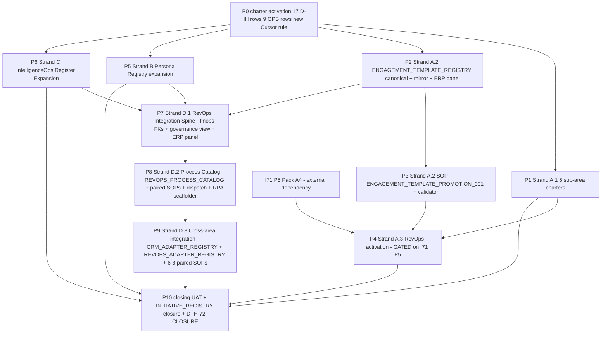

# I72 — Marketing Area Governance + Persona Registry + IntelligenceOps Register Expansion + RevOps Integration Spine + Process Catalog

> **Status: active (chartered 2026-05-14 per `D-IH-72-A`).** **Round 5 expansion (2026-05-14 same day):** added **Strand D — RevOps Integration Spine + Process Catalog + Cross-area integration** as the 4th super-strand to honor the operator's directive that I72 deliver actionable strategic integration with Finance / Data / Tech / GTM (not a sub-area silo). New Cursor rule [`akos-executable-process-catalog.mdc`](../../../../.cursor/rules/akos-executable-process-catalog.mdc) minted at P0 codifying the SOP + executable runbook pairing rule (every executable process gets a paired human SOP — both SSOT for the same process) + adapter active/inactive lifecycle metadata + cadence taxonomy + DAMA-DMBOK 2.0 alignment.
>
> **Round 6 audit ratification (2026-05-14 same day):** 3 P0-blocking documentation consistency fixes applied + 6 architectural/scope refinements ratified inline. **6 new D-IH-72 rows R-W** added: **R** Round 6 audit charter; **S** AIC (Agent in Charge) role_owner forward-reference from I76 candidate + AC binary axis with AIC-as-human-equivalent for SOP consumption; **T** MarTech adapter breadth (6 sibling registries: EMAIL/ATTRIBUTION/BILLING/COMMUNICATION/SCHEDULING/CONTRACT with active/inactive/planned status); **U** `validate_process_list_pairing.py` owned by I72 P9 full validator (covers all 4 Cursor rule dimensions); **V** ARCHITECTURE.md + USER_GUIDE.md per-phase cascade per [`akos-docs-config-sync.mdc`](../../../../.cursor/rules/akos-docs-config-sync.mdc) binding rule (each canonical-register phase P2/P6/P7/P8/P9 includes doc-sync sub-deliverables); **W** Cross-area dependency feature-flag pattern (TODO markers + `validate_hlk_vault_links.py` SKIP rule for forward-references to I73/I75/etc.). **P8↔P9 sequencing hazard resolved via split-P8** (registry SHELLS at P8 entry; rows + paired SOPs at P9; DAMA RMDM principle). **Total D-IH-72 rows: 23** (Round 4: A-K = 11; Round 5: L-Q = 6; Round 6: R-W = 6). OPS rows stay at 9 (deliverable lists extended in OPS-72-7/8/9). Cursor rule body extended with 6 adapter registry classes + AIC note + new Rule 5 mandating AC-HUMAN + AC-AUTOMATION per catalog entry + validator pin. Full Round 6 detail in [`reports/p0-csv-rows-to-append-2026-05-14.md`](reports/p0-csv-rows-to-append-2026-05-14.md) §2 (D-IH-72-R..W rows) + [`reports/p0-charter-2026-05-14.md`](reports/p0-charter-2026-05-14.md) Authority + Decisions Minted + Out of scope sections + the authoritative Cursor plan `What changed since` Round 6 narrative.

## Authoritative plan link

The authoritative full-initiative plan covering P0-P10 lives at [`.cursor/plans/i72-marketing-area-governance-and-persona-registry-expansion_72c0a5e3.plan.md`](../../../../.cursor/plans/i72-marketing-area-governance-and-persona-registry-expansion_72c0a5e3.plan.md) per the PLAN SCOPE binding guardrail (commit `a2bb018`). This master-roadmap is the workspace mirror with phase dependencies, narrative, and stable per-phase summaries. When the authoritative plan changes, update this file too per [`.cursor/rules/akos-planning-traceability.mdc`](../../../../.cursor/rules/akos-planning-traceability.mdc).

## Operating story

I70 P8 redesigned Marketing into the **M3 ontology** ([`MARKETING_AREA_M3_REDESIGN.md`](../../../references/hlk/v3.0/Admin/O5-1/Marketing/canonicals/MARKETING_AREA_M3_REDESIGN.md) per `D-IH-70-T`). I70 P8.5 ran the GOI class regression hunt and ratified four new GOI/POI enum classes plus three concrete rows; per `D-IH-70-AC`, four scope items were forward-charted to I72:

1. **`business-developer-collaborator` persona row** under existing partner class.
2. **`competitor-intelligence-target` schema** for IntelligenceOps register.
3. **Regulator-relationship roadmap** (ENISA worked example).
4. **Media-counterparty-onboarding pattern** (PR Manager activation).

The original 3-super-strand candidate (Marketing + Persona Registry + IntelligenceOps Register) addressed those deferrals but was a sub-area silo — it did not wire RevOps into the cross-area governance system (Finance ledger / Data / Tech / GTM / People / Legal / Research). Per the operator's Round 5 directive (2026-05-14), **I72 expands to 4 super-strands** with Strand D adding the integration spine + curated process catalog activatable on-demand or recurring + multi-CRM adapter pattern with active/inactive metadata.

The cohering principle: **I72 operationalises the Marketing redesign AND unblocks three I70-P8.5-deferred governance dimensions AND wires RevOps into the cross-area governance system AND ships a curated process catalog that operators + agents can activate on demand or recurring schedule.** The four super-strands share an activation moment (P0 charter) but address distinct artifacts:

- **Strand A** (P1-P4): Marketing Area Governance — 5 sub-area charters + engagement-template promotion machine + RevOps activation.
- **Strand B** (P5): Persona Registry expansion.
- **Strand C** (P6): IntelligenceOps Register Expansion.
- **Strand D** (P7-P9): RevOps Integration Spine + Process Catalog + Cross-area integration.

Strand A is the heaviest authoring strand. Strands B + C are smaller per-deliverable but cross-coordinate with Research / People initiatives. Strand D is the **cross-cutting glue** that makes I72 strategically coherent — RevOps becomes the central nervous system connecting engagement → finance ledger → data registry → tech workflows → GTM funnel → People onboarding → Legal templates → Research intelligence.

## Strand A — Marketing Area Governance

### A.1 — Sub-area charter authoring (P1)

| Sub-area | Charter target | Anchor |
|:---|:---|:---|
| **Reach** | `Marketing/Reach/canonicals/REACH_DISCIPLINE_CHARTER.md` | Acquisition + Demand Gen + Paid Media; existing Growth folder migrates here. |
| **Resonance** | `Marketing/Resonance/canonicals/RESONANCE_DISCIPLINE_CHARTER.md` | Account Management + Community Manager; deploys Storytelling artifacts. |
| **Storytelling** | `Marketing/Storytelling/canonicals/STORYTELLING_DISCIPLINE_CHARTER.md` | PR + Thought Leadership + Corporate Marketing; **authors** narrative artifacts per `D-IH-70-X` (reinforced by `D-IH-72-D` role-tagging). Cross-link to Strand C media-counterparty-onboarding via `D-IH-72-J`. |
| **Experimentation** | `Marketing/Experimentation/canonicals/EXPERIMENTATION_DISCIPLINE_CHARTER.md` | Growth Hacker + Marketing Analytics; **standalone 5th sub-area** per `D-IH-72-E`. |
| **Account Management** | `Marketing/Resonance/Account Management/canonicals/ACCOUNT_MANAGEMENT_CHARTER.md` | Sub-discipline of Resonance per `D-IH-70-R` + `D-IH-72-C` (Customer Success folds under Account Management). |

### A.2 — Engagement-template promotion machine (P2 + P3)

- **Source patterns**: 6 patterns from the I70 P2.4 previous-project annex (PRD / GTM / tech-spec / timeline / competitive-analysis / technical-annex).
- **Promotion rule**: **3 engagements** consuming the same template → RevOps takes ownership (per `D-IH-72-B`, consistent with [`WORKSPACE_BLUEPRINT_HOLISTIKA.md`](../../../references/hlk/v3.0/Admin/O5-1/Operations/PMO/canonicals/WORKSPACE_BLUEPRINT_HOLISTIKA.md) §16.3).
- **Carrier table** (P2): new `ENGAGEMENT_TEMPLATE_REGISTRY.csv` at `Marketing/Resonance/Account Management/canonicals/dimensions/`. Sibling canonical CSV + Supabase mirror per `D-IH-72-F`.
- **Promotion SOP** (P3): `SOP-ENGAGEMENT_TEMPLATE_PROMOTION_001.md` + `scripts/validate_engagement_template_promotion.py` (event_triggered cadence — fires when 3+ engagements consume same template per the new cadence taxonomy).
- **ERP panel slot**: `op_revops_engagement_templates` reserved at P0.

### A.3 — RevOps owner activation (P4 — GATED on I71 P5)

- **Baseline row**: change RevOps row in [`baseline_organisation.csv`](../../../references/hlk/v3.0/Admin/O5-1/People/Compliance/canonicals/baseline_organisation.csv) from gated to active; `sub_area: Marketing/Resonance` per `D-IH-70-Z`.
- **SOPs**: `SOP-ENGAGEMENT_TEMPLATE_PROMOTION_001.md` (P3) + `SOP-REVOPS_QBR_001.md` (per-engagement quarterly business review).
- **Validator dependency (HARD)**: requires I71 Pack **A4** (`validate_render_ownership.py`) shipped on `main` (I71 P5).

## Strand B — Persona Registry expansion (P5)

Per `D-IH-70-AC`: business-developer-collaborator deferred to I72 as a persona within the existing partner class.

| Deliverable | Location | Anchor |
|:---|:---|:---|
| `PERSONA_REGISTRY.csv` row(s) | `dimensions/PERSONA_REGISTRY.csv` | New persona: business-developer-collaborator (partner class). Discovery may surface additional personas. |
| `PERSONA_SCENARIO_REGISTRY.csv` row(s) | sibling path | Per-persona scenarios for engagement-shape rehearsal — both per `D-IH-72-G`. |
| Brand-voice register check | per I71 Pack A1 | New persona prose audited via `validate_brand_voice_register.py` strict mode. |

## Strand C — IntelligenceOps Register Expansion (P6)

Per `D-IH-70-AC`: competitor-intelligence-target schema + regulator-relationship roadmap (ENISA) + media-counterparty-onboarding + recruiter onboarding.

| Deliverable | Location | Anchor |
|:---|:---|:---|
| `INTELLIGENCEOPS_REGISTER.csv` | `dimensions/INTELLIGENCEOPS_REGISTER.csv` | Sibling register per `D-IH-72-H`. Schema: target_id (FK GOI_POI_REGISTER), target_class (`competitor_intelligence_target` / `regulator` / `media` / `recruiter`), cadence, source_type (HUMINT/OSINT/TECHINT/hybrid), reliability (A-E HUMINT FM 2-22.3), output_artifact, responsible_role. |
| Regulator SOP | `Research/Intelligence/canonicals/SOP-REGULATOR_RELATIONSHIP_001.md` | Generic + ENISA worked-example annex per `D-IH-72-I`. |
| Media SOP | `Marketing/Storytelling/canonicals/SOP-MEDIA_ONBOARDING_001.md` | Per `D-IH-72-J`; cross-link from `INTELLIGENCEOPS_REGISTER.csv` media row. |
| Recruiter SOP cross-link | cross-link to `People/People Operations/canonicals/SOP-RECRUITER_ONBOARDING_001.md` (target I73) | Per `D-IH-72-K`. |
| ERP panel slot | `op_intelligenceops_register` reserved at P0. | `D-IH-72-H` ratification implication. |

## Strand D — RevOps Integration Spine + Process Catalog + Cross-area integration (NEW; Round 5)

Three sub-strands address the operator's "miss interactions from RevOps to other areas" + "we lack actionable strategic thinking" + "we need curated processes activatable on demand or regularly" directives.

### D.1 — RevOps Integration Spine (P7)

The integration spine wires RevOps into the existing Finance ledger + Data governance views + Tech panel routes per **D-IH-72-M** (DAMA-aligned).

| Deliverable | Location | Anchor |
|:---|:---|:---|
| `engagement_id` + `template_id` FK columns on `finops.registered_fact` | `supabase/migrations/<ts>_i72_p7_revops_finops_fk.sql` | FKs against `compliance.engagement_registry_mirror` + `compliance.engagement_template_registry_mirror`. Per Routine.co RevOps Blueprint 2026: "one consistent revenue story from deal creation through recognition". DAMA-DMBOK 2.0 RMDM principle. |
| `governance.engagement_revenue_view` | `supabase/migrations/<ts>_i72_p7_engagement_revenue_view.sql` | Cross-area view joining `compliance.engagement_registry_mirror` + `compliance.engagement_template_registry_mirror` + `finops.registered_fact` + `holistika_ops.stripe_customer_link`. Per-engagement revenue rollup (booked / billed / recognized per Routine.co terminology). |
| ERP panel slot `op_revops_engagement_revenue` | reserved in `HLK_ERP_ARCHITECTURE.md` §4 at P0; route `/operator/marketing/revops/engagement-revenue/` | Wired to `governance.engagement_revenue_view` at P7. Operator-facing revenue dashboard. |
| Pydantic models + validator | `akos/hlk_revops_spine.py` + `scripts/validate_revops_spine.py` | Per [`CONTRIBUTING.md`](../../../../CONTRIBUTING.md) §"Python Code Standards". |

### D.2 — Process Catalog (P8)

The curated process catalog is the load-bearing deliverable for the operator's "activatable on demand or regularly" intent. Per **D-IH-72-N**: process_list.csv (governance SSOT) + REVOPS_PROCESS_CATALOG.yaml (executable runbook detail) + paired SOPs (human-readable canonical) — all three SSOT for the same process. Per the new Cursor rule [`akos-executable-process-catalog.mdc`](../../../../.cursor/rules/akos-executable-process-catalog.mdc).

| Deliverable | Location | Cadence |
|:---|:---|:---:|
| `REVOPS_PROCESS_CATALOG.yaml` | `Marketing/Resonance/RevOps/canonicals/REVOPS_PROCESS_CATALOG.yaml` | Carries 8-12 seed RevOps processes covering: regression sweep (on_demand + quarterly), template promotion ratification (event_triggered + gated_operator), QBR cycle (scheduled monthly), engagement scaffold (event_triggered when template promoted), revenue rollup (scheduled weekly), persona audit (on_demand), CRM sync (scheduled daily per active adapter), advisor email send (gated_operator), regulator-relationship checkpoint (scheduled quarterly per ENISA + future regulators), media-counterparty review (event_triggered when new PR engagement lands). Each entry has paired SOP path. |
| Paired SOPs (8-12) | one per catalog entry under `Marketing/Resonance/RevOps/canonicals/SOP-<purpose>_<NNN>.md` | Authored to I70 P8.4 SMO-charter quality bar. |
| Dispatch script | `scripts/revops_dispatch.py` | Reads catalog YAML; routes invocation by cadence; on_demand → CLI args; scheduled → cron; event_triggered → webhook listener (or release-gate hook); gated_operator → AskQuestion ratification gate first. |
| RPA scaffolder | `scripts/scaffold_engagement.py` | Per **D-IH-72-P**: takes `engagement_id` + `template_id` args; copies `Think Big/Clients/_engagement-template/` skeleton to `Think Big/Clients/<slug>/`; seeds frontmatter; opens PR. Catalog entry cadence = `event_triggered` (fires when template promoted at 3 engagements). Paired SOP at `SOP-ENGAGEMENT_SCAFFOLDING_001.md`. |
| process_list.csv tranche | append 8-12 new rows for the catalog entries | Operator-gated canonical-CSV per `akos-governance-remediation.mdc`. Each row has `cadence` cell from the new taxonomy enum + cross-references the SOP path + runbook path per the new Cursor rule. |

### D.3 — Cross-area integration (P9)

Adapter rows + cross-link entries connecting RevOps to the rest of Holistika's operating system. Per **D-IH-72-O** (multi-CRM adapter pattern with active/inactive metadata) and the operator's "we need processes that link Tech and Data to RevOps" directive.

| Cross-area target | Deliverable | Cadence type |
|:---|:---|:---|
| **Finance** (FINOPS counterparty) | adapter row in new `Marketing/Resonance/RevOps/canonicals/REVOPS_ADAPTER_REGISTRY.csv` (status: `active`); paired SOP `SOP-FINOPS_BRIDGE_001.md` | event_triggered (fires on engagement signing → counterparty registration) |
| **Data** (hlk-erp panel) | wire `op_revops_engagement_revenue` panel to `governance.engagement_revenue_view`; sibling-repo PR follow-up to `hlk-erp` per `akos-mirror-template.mdc` | scheduled (panel renders on operator visit) |
| **Tech** (CICD baseline + observability) | cross-reference I71 brand-voice register validator + I68 Sentry release format on RevOps service surfaces; adapter row (status: `active`) | scheduled (per release) |
| **GTM / CRM** (multi-CRM adapter) | mint `CRM_ADAPTER_REGISTRY.csv` at `Marketing/Reach/canonicals/dimensions/` with rows for: HubSpot (status `planned`), Salesforce (`planned`), Pipedrive (`inactive`), Close (`inactive`), Attio (`experimental`), Copper (`inactive`), Folk (`inactive`), Odoo (`inactive`), Apollo (`inactive`), SalesLoft (`inactive`); seed AKOS-internal `holistika_ops` (status `active`). Paired SOP `SOP-CRM_INTEGRATION_001.md` documents Normalized Adapter Pattern per Truto/Unified.to/Apideck consensus 2026. | scheduled (per active adapter; sync daily) |
| **People / People Operations** | adapter row (status: `active`) for engagement → onboarding handoff; paired SOP `SOP-PEOPLE_ENGAGEMENT_HANDOFF_001.md`. Cross-link to I73 People Operations Lead activation. | event_triggered (fires when engagement signed) |
| **Legal** | adapter row (status: `active`) for engagement → legal template fire (NDA/MSA/SOW per I66 P3 deliverables); paired SOP `SOP-LEGAL_TEMPLATE_FIRE_001.md` | event_triggered (fires when engagement reaches scope-locked stage) |
| **Research / Intelligence** | adapter row (status: `active`) for engagement → competitor-intelligence collection trigger via `INTELLIGENCEOPS_REGISTER.csv` (Strand C P6 deliverable); paired SOP `SOP-RESEARCH_ENGAGEMENT_TRIGGER_001.md` | event_triggered (fires when engagement scope includes competitive landscape) |
| **MADEIRA / Tech workflows** | adapter row (status: `active`) for RevOps process catalog → MADEIRA workflow execution; paired SOP `SOP-MADEIRA_REVOPS_HANDOFF_001.md` | on_demand (via `revops_dispatch.py`) |

Total P9 deliverable: **1 new canonical** (`CRM_ADAPTER_REGISTRY.csv` + sibling validator + Pydantic SSOT) + **1 new canonical** (`REVOPS_ADAPTER_REGISTRY.csv` + sibling validator + Pydantic SSOT) + **6-8 paired SOPs** under `Marketing/Resonance/RevOps/canonicals/` + cross-link entries from each existing canonical to the new adapter rows.

## Phase dependency chain — narrative

- **P0 → P1, P2, P5, P6**: charter ratification mints all 17 D-IH-72 rows + 9 OPS rows + new Cursor rule + INIT activation; precondition for any per-phase execution.
- **P0 → P2 → P3 → P4**: A.2 promotion machine pipeline.
- **P0 → P5 (Strand B)** and **P0 → P6 (Strand C)** independent of A.
- **P1 → P4**: RevOps activation depends on Account Management charter authored.
- **I71 P5 (Pack A4) → P4**: HARD external dependency.
- **P2 → P7 (Strand D.1)**: spine FKs need ENGAGEMENT_TEMPLATE_REGISTRY existing.
- **P5 + P6 → P7**: Strand D.1 spine ideally lands after persona + intelligenceops registries exist (clean FK targets), but can run in parallel with them at risk of follow-up FK additions.
- **P7 → P8 (Strand D.2)**: catalog needs spine before runbooks reference revenue rollup.
- **P8 → P9 (Strand D.3)**: cross-area adapters extend the catalog pattern.
- **P1 + P4 + P5 + P6 + P9 → P10**: closing UAT.

## Phase dependency diagram



## Phase status table

| Phase | Title | Strand | Status | Closes OPS |
|:---|:---|:---:|:---|:---:|
| **P0** | Charter + 17 D-IH-72 rows + 9 OPS-72 rows + INIT activation + new Cursor rule + WORKSPACE/ERP cross-links | — | **SHIPPED 2026-05-14** | — |
| **P1** | Strand A.1 — 5 sub-area charters | A.1 | pending | OPS-72-6 |
| **P2** | Strand A.2 — ENGAGEMENT_TEMPLATE_REGISTRY canonical + Supabase mirror + ERP panel | A.2 | pending | OPS-72-1 |
| **P3** | Strand A.2 — SOP-ENGAGEMENT_TEMPLATE_PROMOTION_001 + promotion-rule validator | A.2 | pending | OPS-72-2 |
| **P4** | Strand A.3 — RevOps owner activation | A.3 | **gated on I71 P5 Pack A4** | OPS-72-3 |
| **P5** | Strand B — Persona Registry expansion | B | pending | OPS-72-4 |
| **P6** | Strand C — IntelligenceOps Register Expansion | C | pending | OPS-72-5 |
| **P7** | Strand D.1 — RevOps Integration Spine (finops FKs + governance view + ERP panel) | D.1 | pending | OPS-72-7 |
| **P8** | Strand D.2 — Process Catalog (REVOPS_PROCESS_CATALOG.yaml + paired SOPs + dispatch + RPA scaffolder) | D.2 | pending | OPS-72-8 |
| **P9** | Strand D.3 — Cross-area integration (CRM + REVOPS adapter registries + 6-8 paired SOPs) | D.3 | pending | OPS-72-9 |
| **P10** | Closing UAT + INITIATIVE_REGISTRY closure + D-IH-72-CLOSURE | — | pending | — |

## Per-phase scoping

### P0 — Charter activation (SHIPPED 2026-05-14)

- **Scope**: activate `INIT-OPENCLAW_AKOS-72` from `gated_operator` to `active`; mint 17 D-IH-72-* rows ratifying all 15 architectural conundrums + the charter row + Strand D charter; mint 9 OPS-72-* rows mapping P1-P9 closures; mint new Cursor rule [`akos-executable-process-catalog.mdc`](../../../../.cursor/rules/akos-executable-process-catalog.mdc); cross-link `WORKSPACE_BLUEPRINT_HOLISTIKA.md` §16.3 + reserve 3 ERP panel slots (`op_revops_engagement_templates` + `op_intelligenceops_register` + `op_revops_engagement_revenue`) in `HLK_ERP_ARCHITECTURE.md` §4; promote candidate.
- **Prerequisites**: I70 P11 closure on `main`; I71 P1 SHIPPED; existing INIT-OPENCLAW_AKOS-72 row at `INITIATIVE_REGISTRY.csv` line 58.
- **Deliverables**: this `master-roadmap.md` + `reports/p0-charter-2026-05-14.md` + `promoted-candidate-2026-05-14.md` + `reports/p0-csv-rows-to-append-2026-05-14.md` + `reports/p0-cursor-rule-to-mint-2026-05-14.md` + `files-modified.csv` (18-col) + Cursor plan + INIT row update + 17 D-IH-72 rows + 9 OPS-72 rows + new Cursor rule + 3 ERP panel slots + WORKSPACE_BLUEPRINT cross-link + CHANGELOG entry + README row.
- **Verification**: 7-validator matrix below all PASS.

### P1 through P6 — see authoritative Cursor plan

Per [`.cursor/plans/i72-marketing-area-governance-and-persona-registry-expansion_72c0a5e3.plan.md`](../../../../.cursor/plans/i72-marketing-area-governance-and-persona-registry-expansion_72c0a5e3.plan.md) §"Per-phase deep sections" for P1-P6. Same scope/files/verification structure as Round 4 plan; no Round 5 changes to P1-P6.

### P7 — Strand D.1 RevOps Integration Spine (~3-4 days; MANDATORY canonical-CSV gate; DAMA-aligned)

- **Scope**: ship the 3-deliverable spine — finops FK additions + governance view + ERP panel wiring. Per **D-IH-72-M** (option D — both FKs AND view). Per DAMA-DMBOK 2.0 Reference & Master Data Management + Data Integration & Interoperability knowledge areas.
- **Prerequisites**: P2 closed (ENGAGEMENT_TEMPLATE_REGISTRY exists); ideally P5 + P6 closed (PERSONA_REGISTRY + INTELLIGENCEOPS_REGISTER exist for clean FK targets, but not strictly required); operator approval for `finops.registered_fact` schema change (canonical-CSV gate equivalent for ledger DDL).
- **Deliverables**: Supabase migration for `engagement_id` + `template_id` FK columns on `finops.registered_fact` (forward-compatible per `NOT VALID + VALIDATE CONSTRAINT` pattern); Supabase migration for `governance.engagement_revenue_view`; HLK-ERP panel route `/operator/marketing/revops/engagement-revenue/` wired to view (sibling-repo PR follow-up); `akos/hlk_revops_spine.py` Pydantic models; `scripts/validate_revops_spine.py` validator + tests + release-gate row; CANONICAL_REGISTRY entry for the view; PRECEDENCE classification; phase report.
- **Verification**: `validate_revops_spine.py` PASS; `validate_compliance_schema_drift.py` PASS; `validate_canonical_registry.py` PASS; mirror migration applied; release-gate green; per-engagement revenue rollup query returns expected schema.
- **Inline-ratify gate**: finops schema change ratification (operator-gated; ledger DDL is high-blast-radius).
- **Self-checkpoint count**: 2 (pre-P7 finops state check + mid-P7 after FK migration before view migration).

### P8 — Strand D.2 Process Catalog (~4-6 days; MANDATORY canonical-CSV gate; per new Cursor rule)

- **Scope**: mint `REVOPS_PROCESS_CATALOG.yaml` with 8-12 seed processes + paired SOPs (one per catalog entry, authored to SMO-charter quality bar) + `scripts/revops_dispatch.py` dispatch script + `scripts/scaffold_engagement.py` RPA scaffolder + process_list.csv tranche of 8-12 new rows. Per **D-IH-72-N** + new Cursor rule [`akos-executable-process-catalog.mdc`](../../../../.cursor/rules/akos-executable-process-catalog.mdc).
- **Prerequisites**: P7 closed (spine exists; processes can reference revenue rollup); new Cursor rule loaded.
- **Deliverables**: 1 catalog YAML + 8-12 paired SOPs + 2 scripts + process_list.csv tranche (operator-gated) + `akos/revops_process_catalog.py` Pydantic models + `scripts/validate_process_catalog_cadence.py` validator + tests + release-gate wiring + phase report.
- **Verification**: `validate_process_catalog_cadence.py` PASS; pairing rule enforced (every catalog entry has SOP path + runbook path); cadence enum enforced; `validate_hlk.py` PASS.
- **Inline-ratify gate**: per-catalog-entry inline-ratify (8-12 gates batched into 2-3 AskQuestion sessions).
- **Self-checkpoint count**: 3 (pre-P8 + mid-P8 after 4-6 catalog entries land + post-SOP-pairing audit).

### P9 — Strand D.3 Cross-area integration (~5-7 days; MANDATORY canonical-CSV gate; multi-area touchpoints)

- **Scope**: mint `CRM_ADAPTER_REGISTRY.csv` + `REVOPS_ADAPTER_REGISTRY.csv` per **D-IH-72-O** (Normalized Adapter Pattern per Truto/Unified.to/Apideck 2026 consensus); seed adapter rows for 8 cross-area targets (Finance / Data / Tech / GTM-CRM / People / Legal / Research / MADEIRA) with active/inactive lifecycle status; author 6-8 paired SOPs.
- **Prerequisites**: P8 closed (process catalog exists; adapters extend the catalog pattern); coordination check with I73 (People Operations) + I75 (Research) + I77 (Brand) candidate states.
- **Deliverables**: 2 new canonical CSVs + 2 SSOT modules + 2 validators + 2 Supabase mirrors + ~10 adapter seed rows + 6-8 paired SOPs + cross-link entries in existing canonicals + phase report.
- **Verification**: `validate_crm_adapter_registry.py` PASS; `validate_revops_adapter_registry.py` PASS; status enum enforced (active/inactive/planned/deprecated/experimental per Cursor rule); `validate_hlk_vault_links.py` PASS (all 6-8 SOP cross-links resolve); release-gate green.
- **Inline-ratify gate**: CRM adapter scope ratification (which CRMs ship as `planned` vs `inactive` vs `experimental` first); cross-area handoff SOP body ratification.
- **Self-checkpoint count**: 3 (pre-P9 cross-area readiness audit + mid-P9 after CSV bodies + post-SOP-pairing).

### P10 — Closing UAT (~1-2 days; MANDATORY operator UAT)

- **Scope**: operator UAT pass per the verification matrix in the master-roadmap; close INIT + 9 OPS rows; mint `D-IH-72-CLOSURE`; author closing report; CHANGELOG closure entry.
- **Prerequisites**: P1-P9 shipped on `main`; release-gate green; OPS-72-1 through OPS-72-9 closed.
- **Verification**: full validator matrix PASS; operator UAT bands A-E PASS via inline `AskQuestion`.

## Conundrums (all 15 ratified at P0; verdict rows in DECISION_REGISTER.csv)

| ID | Conundrum | Verdict | D-IH row |
|:---|:---|:---|:---:|
| C-72-1 | Template-promotion threshold (3 vs 5 vs 7 engagements) | **3 engagements** (per `WORKSPACE_BLUEPRINT_HOLISTIKA.md` §16.3) | D-IH-72-B |
| C-72-2 | Account Mgmt vs CS vs SMO boundary | **SMO=WHAT / Account Management=WHO / CS folds under Account Management** | D-IH-72-C |
| C-72-3 | Storytelling-authors / Resonance-consumes edge cases | **Role-tagging, not person-tagging** | D-IH-72-D |
| C-72-4 | Experimentation standalone vs Reach sub-discipline | **Standalone 5th sub-area** | D-IH-72-E |
| C-72-5 | ENGAGEMENT_TEMPLATE_REGISTRY mirror posture | **Sibling canonical CSV + Supabase mirror** | D-IH-72-F |
| C-72-6 | Persona registry vs scenario registry boundary | **Both** — persona row + scenario row | D-IH-72-G |
| C-72-7 | IntelligenceOps register architecture | **Sibling `INTELLIGENCEOPS_REGISTER.csv`** | D-IH-72-H |
| C-72-8 | Regulator-relationship roadmap shape | **Generic SOP with ENISA worked-example annex** | D-IH-72-I |
| C-72-9 | Media-counterparty-onboarding placement | **Both** — Storytelling + IntelligenceOps cross-linked | D-IH-72-J |
| C-72-10 | Recruiter onboarding placement | **IntelligenceOps row + People Ops onboarding SOP cross-linked** | D-IH-72-K |
| C-72-11 (Round 5) | Finance integration depth | **Both** — engagement_id + template_id FKs on `finops.registered_fact` AND `governance.engagement_revenue_view` (DAMA RMDM + Data Integration & Interoperability) | D-IH-72-M |
| C-72-12 (Round 5) | Process catalog architecture | **Triplet** — `process_list.csv` (governance SSOT) + `REVOPS_PROCESS_CATALOG.yaml` (executable runbook) + paired SOPs (human-readable canonical). NEW Cursor rule mints to enforce. | D-IH-72-N |
| C-72-13 (Round 5) | GTM/CRM scope | **AKOS-internal SSOT + HubSpot adapter shim + multi-CRM Normalized Adapter Pattern + active/inactive metadata** (per Truto/Unified.to/Apideck 2026 + DAMA Metadata Management) | D-IH-72-O |
| C-72-14 (Round 5) | RPA scope | **Mint `scripts/scaffold_engagement.py` as P8 deliverable + paired SOP-ENGAGEMENT_SCAFFOLDING_001.md** | D-IH-72-P |
| C-72-15 (Round 5) | Cadence taxonomy | **All 4 cadences** — on_demand + scheduled + event_triggered + gated_operator | D-IH-72-Q |

## Decision preview (17 D-IH-72-* rows + closure)

- **D-IH-72-A** — I72 charter ratification (4 super-strands; activation from gated_operator to active).
- **D-IH-72-B** through **D-IH-72-K** — 10 conundrum ratifications C-72-1..10 (Round 4).
- **D-IH-72-L** — Strand D charter (RevOps Integration Spine + Process Catalog + Cross-area integration; DAMA-DMBOK 2.0 aligned posture).
- **D-IH-72-M** — C-72-11 verdict (Finance integration depth = both FK + view; DAMA RMDM + Data Integration & Interoperability).
- **D-IH-72-N** — C-72-12 verdict (Process catalog triplet architecture; new Cursor rule `akos-executable-process-catalog.mdc`).
- **D-IH-72-O** — C-72-13 verdict (GTM/CRM Normalized Adapter Pattern + active/inactive metadata).
- **D-IH-72-P** — C-72-14 verdict (RPA scaffolder + paired SOP).
- **D-IH-72-Q** — C-72-15 verdict (cadence taxonomy 4 cadences).
- **D-IH-72-CLOSURE** — initiative closure (P10).

## Risk register

| ID | Risk | Sev | Mitigation |
|:---:|:---|:---:|:---|
| R-72-1 | HLK validator surprise on P0 commit (17 D-IH + 9 OPS + INIT update + new Cursor rule + 5 cross-links) | H | Run validators incrementally during P0 authoring. |
| R-72-2 | Strand C cross-collision with I75 candidate | H | P6 pre-execution audit; cross-coordinate at P6 inline-ratify. |
| R-72-3 | Strand B + C scope explosion mid-execution | H | Pre-charter conundrum ratification locks architecture at P0. |
| R-72-4 | I71 P5 Pack A4 slips → P4 RevOps activation slips | M | Pre-allocate gate; P4 NOT on critical path for PMO→RevOps trigger. |
| R-72-5 | Account Management charter conflates with SMO Account Manager | M | Cross-charter section cites D-IH-70-R boundary explicitly. |
| R-72-6 | Premature template promotion canonicalizes one-off patterns | H | C-72-1 fixed at 3 + explicit RevOps ratification per template. |
| **R-72-7 (Round 5)** | Strand D.1 finops FK migration breaks existing `registered_fact` rows or downstream ledger consumers | H | `NOT VALID + VALIDATE CONSTRAINT` pattern (per I70 P8.5 precedent); pre-migration backfill audit; staging-mode validator before P7 commit. |
| **R-72-8 (Round 5)** | Strand D.2 process catalog SOP/runbook pairing rule violated mid-execution (operator drifts to YAML-only or SOP-only) | H | New Cursor rule `akos-executable-process-catalog.mdc` enforces at session-load; PR review checklist; future `validate_process_list_pairing.py` validator forward-charted. |
| **R-72-9 (Round 5)** | Strand D.3 multi-CRM adapter scope explodes (operator surfaces 20+ CRMs to support) | M | Adapter status enum bounds the scope: most ship as `planned` or `inactive` (spec-only); only 1-2 ship as `active` per cycle. Per Truto pattern: Normalized Adapter Pattern handles 47+ CRMs behind single interface; abstraction caps marginal cost. |
| **R-72-10 (Round 5)** | Cross-area handoffs (P9) collide with sibling initiatives (I73 People Ops; I75 Research; I77 Brand) on canonical paths | M | P9 pre-execution coordination check with each sibling; cross-link entries (not duplicate canonicals) where overlap exists; explicit operator inline-ratify for any path collision. |
| **R-72-11 (Round 5)** | DAMA-DMBOK alignment posture creates analysis-paralysis (operator over-indexes on framework citation vs concrete delivery) | L | DAMA citation is grounding, not gating; concrete deliverables (FK + view + adapter pattern) ship per industry consensus (Routine/Truto/Unified.to); DAMA cited only where it directly informs an architectural choice. |

## Verification matrix (P0 commit)

Run in order; STOP at first FAIL:

```
py scripts/validate_decision_register.py
py scripts/validate_initiative_registry.py
py scripts/validate_ops_register.py
py scripts/validate_hlk.py
py scripts/validate_master_roadmap_frontmatter.py
py scripts/validate_hlk_vault_links.py
py scripts/render_operator_inbox.py
```

Read-only pre-edit passes at P0: `validate_persona_registry.py` + `validate_canonical_registry.py`.

## Cross-references

- I70 plan + closure: [`.cursor/plans/holistika_os_self-governance_foundation_63841b81.plan.md`](../../../../.cursor/plans/holistika_os_self-governance_foundation_63841b81.plan.md) + [`p70-closing.md`](../70-holistika-os-self-governance/reports/p70-closing.md).
- I70 P8.5 forward-charter source: `D-IH-70-AC` in [`DECISION_REGISTER.csv`](../../../references/hlk/v3.0/Admin/O5-1/People/Compliance/canonicals/DECISION_REGISTER.csv).
- Sibling I71 master-roadmap (Pack A4 dependency for Strand A.3 P4): [`docs/wip/planning/71-cicd-discipline-and-aiops-baseline-maturity/master-roadmap.md`](../71-cicd-discipline-and-aiops-baseline-maturity/master-roadmap.md) §P5.
- I19 FINOPS ledger Phase 1 (Strand D.1 spine extends `finops.registered_fact`): [`19-hlk-finops-ledger/master-roadmap.md`](../19-hlk-finops-ledger/master-roadmap.md).
- I18 FINOPS counterparty register + Stripe FDW (Strand D.1 cross-references `compliance.finops_counterparty_register_mirror` + `holistika_ops.stripe_customer_link`): [`18-hlk-finops-counterparty-stripe/master-roadmap.md`](../18-hlk-finops-counterparty-stripe/master-roadmap.md).
- I14 Holistika internal GTM/MOPS (Strand D.3 cross-links `holistika_ops.lead_intake`): [`14-holistika-internal-gtm-mops/master-roadmap.md`](../14-holistika-internal-gtm-mops/master-roadmap.md).
- I62 Mission Control (Strand D.1 panel slot wires into hlk-erp via Mission Control chassis): [`62-mission-control/master-roadmap.md`](../62-mission-control/master-roadmap.md).
- I64 Governance Mission Control (Strand D.1 panel pattern reference): [`64-governance-mission-control/master-roadmap.md`](../64-governance-mission-control/master-roadmap.md).
- I65 AKOS Planning Workspace Panel (Strand D.1 panel pattern reference): [`65-akos-planning-workspace-panel/master-roadmap.md`](../65-akos-planning-workspace-panel/master-roadmap.md).
- WORKSPACE_BLUEPRINT §16.3 (PMO → RevOps transition trigger): [`WORKSPACE_BLUEPRINT_HOLISTIKA.md`](../../../references/hlk/v3.0/Admin/O5-1/Operations/PMO/canonicals/WORKSPACE_BLUEPRINT_HOLISTIKA.md).
- HLK_ERP_ARCHITECTURE §4 (P0 reserves 3 panel slots): [`HLK_ERP_ARCHITECTURE.md`](../../../references/hlk/v3.0/Admin/O5-1/Operations/PMO/canonicals/HLK_ERP_ARCHITECTURE.md).
- Marketing M3 redesign canonical: [`MARKETING_AREA_M3_REDESIGN.md`](../../../references/hlk/v3.0/Admin/O5-1/Marketing/canonicals/MARKETING_AREA_M3_REDESIGN.md) §4.
- Promoted candidate: [`promoted-candidate-2026-05-14.md`](promoted-candidate-2026-05-14.md).
- P0 charter ratification record: [`reports/p0-charter-2026-05-14.md`](reports/p0-charter-2026-05-14.md).
- P0 CSV-rows-to-append handoff: [`reports/p0-csv-rows-to-append-2026-05-14.md`](reports/p0-csv-rows-to-append-2026-05-14.md).
- P0 Cursor-rule-to-mint handoff: [`reports/p0-cursor-rule-to-mint-2026-05-14.md`](reports/p0-cursor-rule-to-mint-2026-05-14.md).
- Files-modified per-initiative CSV: [`files-modified.csv`](files-modified.csv) (18-col schema per `D-IH-66-Z`).
- I73 candidate cross-link (P6 + P9 recruiter onboarding handoff): TBA when I73 lands.
- I75 candidate cross-link (P6 + P9 IntelligenceOps + Research engagement-trigger handoff): TBA when I75 lands.
- I77 (Impeccable Brand-Bridge Refresh; sibling pair to I71 P1): [`77-impeccable-brand-bridge-refresh/master-roadmap.md`](../77-impeccable-brand-bridge-refresh/master-roadmap.md).
- I78 candidate (LLM-as-judge advisory layer; cross-coordinate with Strand D.2 process catalog cadence taxonomy): [`_candidates/i78-brand-voice-llm-judge.md`](../_candidates/i78-brand-voice-llm-judge.md).
- New Cursor rule (P0 deliverable): [`akos-executable-process-catalog.mdc`](../../../../.cursor/rules/akos-executable-process-catalog.mdc) — codifies SOP+runbook pairing + adapter status metadata + cadence taxonomy + DAMA-DMBOK posture.
- DAMA-DMBOK 2.0 (2024 revision) — Reference & Master Data Management + Metadata Management + Data Integration & Interoperability knowledge areas (Strand D grounding).
- Industry CRM adapter pattern consensus (2026): Truto + Unified.to + Apideck Normalized Adapter Pattern (cited in P9 deliverables + new Cursor rule).
- Routine.co RevOps Blueprint 2026 (Strand D.1 spine grounding): "one consistent revenue story from deal creation through recognition".
- Cursor rules in scope: [`akos-executable-process-catalog.mdc`](../../../../.cursor/rules/akos-executable-process-catalog.mdc) (NEW; minted at P0) + [`akos-inline-ratification.mdc`](../../../../.cursor/rules/akos-inline-ratification.mdc) + [`akos-planning-traceability.mdc`](../../../../.cursor/rules/akos-planning-traceability.mdc) + [`akos-governance-remediation.mdc`](../../../../.cursor/rules/akos-governance-remediation.mdc) + [`akos-holistika-operations.mdc`](../../../../.cursor/rules/akos-holistika-operations.mdc) + [`akos-agent-checkpoint-discipline.mdc`](../../../../.cursor/rules/akos-agent-checkpoint-discipline.mdc) + [`akos-mirror-template.mdc`](../../../../.cursor/rules/akos-mirror-template.mdc).
