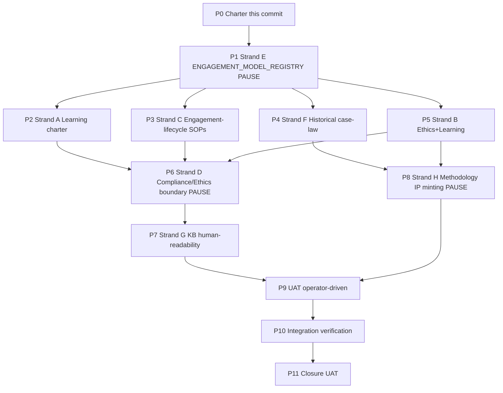

# I73 — People Operations + Engagement Models + Methodology IP (mega-initiative)

> **Status: active (P0 charter ratified 2026-05-15).** 8 strands across 11 phases (P0 → P11). Workspace mirror of the authoritative Cursor plan at [`~/.cursor/plans/i73-people-ops-engagement-models-methodology-ip-c9d4e7f3.plan.md`](file:///~/.cursor/plans/i73-people-ops-engagement-models-methodology-ip-c9d4e7f3.plan.md). The Cursor plan body carries the full per-phase deep sections + decision-log preview + risk-register preview + external research catalog + 12-row self-critique gate; this file mirrors phase dependencies + phase-at-a-glance for git collaboration and history.

## Authoritative plan link

[`~/.cursor/plans/i73-people-ops-engagement-models-methodology-ip-c9d4e7f3.plan.md`](file:///~/.cursor/plans/i73-people-ops-engagement-models-methodology-ip-c9d4e7f3.plan.md) — read end-to-end before working on any I73 phase. The Cursor plan is the SSOT for execution detail; this `master-roadmap.md` mirrors phase ordering + dependencies only.

## Operating story (charter §1)

People is the discipline of growing humans inside the OS — but in bootstrapping mode, "humans" is a varied set of engagement classes, not a payroll. Operator + Madeira (AI O5-1) form the **permanent core**; everyone else is **engagement-bounded**: hourly consultants, milestone consultants, percentage collaborators (Bâtard pattern), apprentices (Mark-II / Alias V pattern), investors (Bâtard pattern), outsourced low-cost helpers (Fiverr / Cameroon pattern, ~€400/mo cap), or operator-self (the baseline carrier of operating cost — founder's own paid employment per [`FOUNDER_TRAJECTORY_INTERNAL.md`](../../../references/hlk/v3.0/Admin/O5-1/People/canonicals/FOUNDER_TRAJECTORY_INTERNAL.md) §2 funds Holistika's bootstrap).

The cohering principle: **engagement design = retribution discipline = scaling discipline**. If we streamline value capture, collaborators stay happy with percentage-share retribution; if we don't, ad-hoc engagements collapse into operator burnout. The seven classes are not five-year-future hires — they are today's reality.

## What changed since the candidate scaffold (Round-2 amendment)

The candidate at [`docs/wip/planning/_candidates/i73-people-operations-and-learning-curriculum.md`](../_candidates/i73-people-operations-and-learning-curriculum.md) (4 strands; traditional employer/employee model; 6 phases) is amended in three structural ways:

- **Engagement-as-unit reframe.** Strand C ("hiring/onboarding/payroll/offboarding") becomes engagement-lifecycle SOPs **parameterized by `engagement_model_id`**, not full-time-employee SOPs.
- **Four new strands added (E, F, G, H).** Engagement Model Registry (E), Historical pattern codification (F), KB human-readability (G), Methodology IP minting (H). Total = 8 strands.
- **Hold-gate reframing.** The candidate's "first Holistik Researcher hired" + "People Ops Lead onboarded" gates are reframed as **charter-satisfies-gate** (D-IH-73-B). Designing the engagement models IS the unblock.

## Phase dependency chain (narrative)

- **P0 → P1**: Charter ratifies architecture + decisions. P1 lands the canonical CSV gate (ENGAGEMENT_MODEL_REGISTRY) which everything downstream depends on.
- **P1 → P2, P3, P4, P5 (parallel)**: After the registry lands, Learning charter (P2), Engagement-lifecycle SOPs (P3), Historical case-law (P4), and Ethics+Learning SOP (P5) may proceed in parallel.
- **P2 + P3 + P5 → P6**: Compliance/Ethics boundary (P6) ratifies which `hol_peopl_*` processes are owned by which sub-area; depends on the charters being authored.
- **P6 → P7**: KB human-readability charter (P7) routes per access_level + engagement_model_id + Compliance/Ethics boundary.
- **P4 + P5 → P8**: Methodology IP minting path (P8) reads case-law (P4) + Ethics+Learning (P5).
- **P7 + P8 → P9 → P10 → P11**: Sequential closing chain — UAT, integration verification, closure.

**PAUSE POINTS**: P1 (canonical CSV gate), P6 (process_list orphan reassignments), P8 (brand-vs-name decision matrix) — operator approval required before commit.

## Phase dependency diagram

## Phase at a glance

| Phase | Title | Strand | Pause class | Closes OPS | Status |
|:---|:---|:---:|:---|:---:|:---|
| **P0** | Charter + registries + master-roadmap | — | standard | — | **SHIPPED** (this commit) |
| **P1** | ENGAGEMENT_MODEL_REGISTRY mint + ENGAGEMENT_REGISTRY 17-col extension + process_list tranche | E | canonical-CSV gate | OPS-73-1 | **SHIPPED** (precondition commit `9aeee38`) |
| **P2** | Learning charter + Holistik Researcher curriculum + LEARNING_OPS_BACKLOG | A | standard | OPS-73-2 | **SHIPPED** (this phase commit) |
| **P3** | 5 Engagement SOPs + 6 paired runbooks + Learning pairing stub | C | standard | OPS-73-3 | **SHIPPED** (this phase commit) |
| **P4** | HISTORICAL_ENGAGEMENT_CASE_LAW (Bâtard / Mark-II / Alias V / RCD Legal / L'Oréal arrangement) | F | standard | OPS-73-4 | pending |
| **P5** | SOP-ETHICS_LEARNING_REVIEW + BRAND_VOICE_FOUNDATION refresh | B | standard | OPS-73-5 | pending |
| **P6** | PEOPLE_COMPLIANCE_VS_ETHICS_BOUNDARY + process_list orphan reassignments | D | canonical-CSV gate | OPS-73-6 | pending |
| **P7** | KB_HUMAN_READABILITY_CHARTER + 4 hlk-erp panel filter routes | G | standard | OPS-73-7 | pending |
| **P8** | METHODOLOGY_IP_MINTING_PATH + brand-vs-name decision matrix | H | brand/legal gate | OPS-73-8 | pending |
| **P9** | First engagement onboarded under new model (operator UAT) | — | standard | OPS-73-9 | pending |
| **P10** | Cross-strand integration verification | — | standard | OPS-73-10 | pending |
| **P11** | Closure UAT + INITIATIVE_REGISTRY status flip + dep map update | — | closure gate | — | pending |

The Cursor plan §"Phase scaffold (deep sections)" has the full SCOPE / PREREQUISITES / DELIVERABLES / VERIFICATION / pause-point class / self-checkpoint count / cursor-rules adherence per phase.

## Sync rule

When the Cursor plan's phased execution changes (phase added, dependency redrawn, deliverables shift), **update this `master-roadmap.md` accordingly** per [`akos-planning-traceability.mdc`](../../../../.cursor/rules/akos-planning-traceability.mdc) §"`master-roadmap.md` contents". This file is the git-collaboration surface; the Cursor plan is the SSOT for execution detail. They must agree on phase ordering + dependencies + pause-point classification.

## Cross-references

- Authoritative Cursor plan: [`~/.cursor/plans/i73-people-ops-engagement-models-methodology-ip-c9d4e7f3.plan.md`](file:///~/.cursor/plans/i73-people-ops-engagement-models-methodology-ip-c9d4e7f3.plan.md).
- P0 charter report: [`reports/p0-charter-report.md`](reports/p0-charter-report.md).
- Decision log: [`decision-log.md`](decision-log.md).
- Risk register: [`risk-register.md`](risk-register.md).
- Files-modified CSV: [`files-modified.csv`](files-modified.csv).
- Candidate scaffold (now superseded stub): [`docs/wip/planning/_candidates/i73-people-operations-and-learning-curriculum.md`](../_candidates/i73-people-operations-and-learning-curriculum.md).
- Compendium appendix: [`docs/wip/planning/_templates/PLANNING_COMPENDIUM.md`](../_templates/PLANNING_COMPENDIUM.md) §11.4.
- Dep map: [`docs/wip/planning/_templates/INITIATIVE_DEPENDENCIES.md`](../_templates/INITIATIVE_DEPENDENCIES.md).
