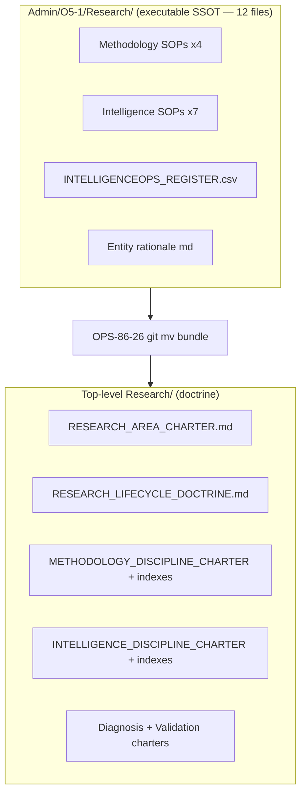
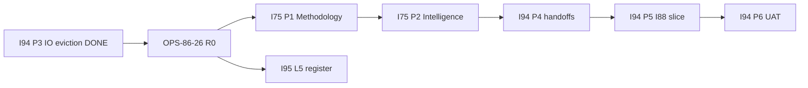

# Research area audit — post-IntelligenceOps eviction (2026-06-10)

> Operator ratification (binding): **Q1=B** full Research rebuild starting with **OPS-86-26**
> (legacy Admin SSOT → top-level `Research/` tree), then I75 P1–P2 SOP tranches.
> I94 P3 evicted two IntelligenceOps SOPs from Operations; executable SSOT still
> straddles the dual tree documented below.

## 1. Executive summary

Research is a **dual tree**: modern doctrine and area charter live under
`docs/references/hlk/v3.0/Research/` (lifecycle spine, four discipline charters,
capability-seeded sub-area indexes), while **12 executable SSOT files** (Methodology +
Intelligence SOPs + `INTELLIGENCEOPS_REGISTER.csv` + entity rationale) remain under
the legacy `docs/references/hlk/v3.0/Admin/O5-1/Research/` path. That split depresses
area-completeness scoring (validator cannot see charter/README at legacy paths) and
ripples into `process_list.csv` `sop_path` cells, PRECEDENCE rows 54/55/117–120,
cursor-rule globs, and mirror emit paths.

**Remediation order:** R0 (OPS-86-26 `git mv` bundle) → R1 (I75 P1 Methodology SOP
tranche + `process_list` gate) → R2 (I75 P2 Intelligence SOP tranche) → R3 (I94 P4–P6
after Research) → R4 (I95 L5 Topics + IntelligenceOps schema tranche).

## 2. Live area-completeness scores (2026-06-10)

Commands run:

```powershell
py scripts/validate_area_completeness.py --area Research --matrix
py scripts/validate_area_completeness.py --area Research --next
py scripts/validate_area_completeness.py --area Operations --matrix
```

### Research

| Metric | Value |
|:---|:---|
| Tier | **INCOMPLETE** |
| Score | **90%** (12 pass / 3 partial / 0 gap / 1 skip) — post OPS-86-26 |
| crit@L3 | **9/10** |

| Component | Status | Severity | Finding |
|:---|:---|:---:|:---|
| AREA-08-DIMENSION-REGISTRIES | partial | low | 1 dimension CSV at top-level path |
| AREA-09-PAIRED-SOP-RUNBOOK | partial | medium | **4/41** paired processes (I75 P1–P2 tranche) |
| AREA-16-FILE-PLAN | partial | medium | sub-folder=role match **1/4**; orphans: Diagnosis, Methodology, Validation discipline stubs |

### Research worklist (`--next`, critical-first)

| Component | now → tgt | Owner | Next action |
|:---|:---|:---|:---|
| AREA-02-AREA-CHARTER | L0 → L3 | Holistik Researcher | Resolve dual-tree path; scorer should index `Research/canonicals/RESEARCH_AREA_CHARTER.md` |
| AREA-03-DISCIPLINE-CHARTERS | L0 → L3 | Holistik Researcher | Promote discipline charters from stub → paired SOP sets (I75 P1–P4) |
| AREA-08-DIMENSION-REGISTRIES | L2 → L3 | Holistik Researcher | Complete OPS-86-26 register move + I95 L5 schema tranche |
| AREA-13-AREA-README | L0 → L2 | Holistik Researcher | Wire README anchor after migration (already exists; link hygiene) |
| AREA-16-FILE-PLAN | L1 → L2 | Holistik Researcher | Align orphan workstream FKs in `process_list.csv` or retire legacy names |

### Operations (post-P3 reference)

| Metric | Value |
|:---|:---|
| Tier | **COMPLETE** |
| Score | **93%** |
| crit@L3 | **10/10** |

Partial only: AREA-09 (12/53 paired), AREA-12 (1 discipline not in §6 table).

## 3. Dual-tree inventory



| Tree | Path | Role | File count (2026-06-10) |
|:---|:---|:---|:---:|
| Modern doctrine | `docs/references/hlk/v3.0/Research/` | Area charter, lifecycle spine, discipline charters, capability indexes, People-owned action/radar disciplines | 23+ markdown |
| Legacy executable SSOT | `docs/references/hlk/v3.0/Admin/O5-1/Research/` | SOPs + IntelligenceOps register still referenced by validators, `process_list`, mirrors | **12** |
| Tier-1 WIP | `docs/wip/intelligence/` | Cross-area research working space | — |

## 4. Per-subfolder inventory (legacy Admin tree)

| Subfolder | Files | Proposed destination (OPS-86-26) |
|:---|:---|:---|
| `Methodology/canonicals/` | `SUBSTRATE_LANDSCAPE_DOCTRINE.md`, `SOP-RESEARCH_ACTION_001.md`, `SOP-RESEARCH_RADAR_001.md`, `SOP-RESEARCH_SUBSTRATE_AUDIT_CADENCE_001.md` | `Research/Methodology/canonicals/` |
| `Intelligence/canonicals/` | 6 SOPs (IO + regulator + engagement trigger) | `Research/Intelligence/canonicals/` |
| `Intelligence/canonicals/dimensions/` | `INTELLIGENCEOPS_REGISTER.csv` | `Research/Intelligence/canonicals/dimensions/` |
| Root | `RESEARCH_VS_TECH_LAB_ENTITY_RATIONALE_2026-04.md` | `Research/canonicals/` |

**Already at top-level (no move):** `RESEARCH_ACTION_DISCIPLINE.md`, `RESEARCH_RADAR_DISCIPLINE.md`,
`GOI_POI_STANCE_DOCTRINE.md`, `SOP-RESEARCH_OUTAKE_HANDOFF_001.md`, `DERIVED_RECALL_DISCIPLINE.md`,
`COUNTER_INTELLIGENCE_DISCIPLINE.md`, discipline charters, sub-area README indexes.

**I94 P3 partial eviction:** `SOP-IO_COUNTERPARTY_BASELINE_ASSESSMENT_001` and
`SOP-IO_RELIABILITY_GRADING_001` were `git mv`'d from `Operations/IntelligenceOps/` into
`Admin/O5-1/Research/Intelligence/canonicals/` — still legacy path until OPS-86-26.

## 5. Gap table (audit findings)

| ID | Gap | Root cause | Remediation phase | Owner |
|:---|:---|:---|:---|:---|
| G-01 | Dual-tree SSOT | OPS-86-26 deferred at Wave R+5 C6 | **R0** OPS-86-26 | System Owner |
| G-02 | AREA-09 4/41 pairing | Most Methodology/Intelligence SOPs lack `process_list` rows + runbooks | **R1–R2** I75 P1–P2 | Lead Researcher |
| G-03 | AREA-16 orphan workstreams | Legacy `process_list` workstream names vs new folder taxonomy | **R1** + P7 drift | PMO |
| G-04 | I88 §1.4 cites IntelligenceOps under Operations | Pre-P3 charter text | **R0** link hygiene | PMO |
| G-05 | I95 L5 blocked on register path | `INTELLIGENCEOPS_REGISTER.csv` SSOT path | **R0** then **R4** | System Owner |
| G-06 | Stale `Operations/IntelligenceOps/` refs in templates/rules | I66-era paths | **R0** R0 link hygiene | Holistik Researcher |

## 6. Remediation phases R0–R4

| Phase | Scope | Deliverable | Gate |
|:---|:---|:---|:---|
| **R0** | OPS-86-26 full bundle + R0 link hygiene | 12-file `git mv`; PRECEDENCE + validators + globs + `process_list` sop_path ripple | Operator ratified 2026-06-10 |
| **R1** | I75 P1 Methodology discipline SOPs | ~6–8 pillar SOPs at `Research/Methodology/canonicals/` | **canonical-CSV gate** — new `process_list` rows |
| **R2** | I75 P2 Intelligence discipline SOPs | Source-type SOP completion + pairing | **canonical-CSV gate** |
| **R3** | I94 P4 → P5 → P6 (after Research) | Cross-area handoffs doc, I88 Ops slice, Operations UAT | Sequential per operator Q2=A |
| **R4** | I95 L5 Topics + IntelligenceOps | Schema tranche after SSOT path stable | Depends R0 |

## 7. Cross-initiative dependencies



| Initiative | Depends on | Produces for downstream |
|:---|:---|:---|
| I86 / OPS-86-26 | Operator ratification | Closes backlog row; unblocks I75 + I95 L5 |
| I75 | OPS-86-26 | Full discipline SOP sets + AREA-09 lift |
| I94 P4–P6 | Research R0–R2 minimum | Operations closure + cross-area contracts |
| I95 L5 | OPS-86-26 register path | Topic registry + IntelligenceOps FK verbs |
| I88 | I94 P5 | Operations 10-pillar wiring (§1.4 IntelligenceOps text update) |

## 8. Forward-charter (I75 P1–P2 — process_list gate STOP)

I75 P1–P2 **must not** mint `process_list.csv` rows in this session without a separate
operator CSV gate. Rows likely needed (preview — not minted):

### P1 Methodology tranche (indicative)

| Proposed item_id | Governing SOP (post-R0 path) | Notes |
|:---|:---|:---|
| `hol_resea_dtp_substrate_landscape_mtnce_001` | `SUBSTRATE_LANDSCAPE_DOCTRINE.md` maintenance | May extend existing `env_tech_dtp_substrate_landscape_mtnce_001` pairing |
| `hol_resea_dtp_pestel_pillar_001` … `hol_resea_dtp_foresight_pillar_004` | New pillar SOPs (charter status) | ~4–6 net-new rows per D-IH-75-C |
| `hol_resea_dtp_derived_recall_001` | `DERIVED_RECALL_DISCIPLINE.md` | Charter exists; needs process row + runbook |

### P2 Intelligence tranche (indicative)

| Proposed item_id | Governing SOP | Notes |
|:---|:---|:---|
| `hol_res_prc_regulator_relationship_001` | `SOP-REGULATOR_RELATIONSHIP_001.md` | No `process_list` row today |
| `hol_res_prc_engagement_trigger_001` | `SOP-RESEARCH_ENGAGEMENT_TRIGGER_001.md` | PRECEDENCE row 54 |
| OSINT / SIGINT placeholder rows | Forward-charter per D-IH-75-D | Reserved disciplines |

**Existing paired rows (path update only at R0):** `hol_resea_dtp_research_action_001`,
`hol_resea_dtp_research_radar_001`, `hol_res_prc_counterparty_baseline_assess_001`,
`hol_res_prc_elicitation_discipline_001`, `hol_res_prc_reliability_grading_001`,
`hol_res_prc_intelligence_report_001`.

## 9. Verification matrix (this audit)

| Command | Result (2026-06-10) |
|:---|:---|
| `validate_area_completeness.py --area Research --matrix` | Research 67%, crit 7/10 |
| `validate_area_completeness.py --area Research --next` | 5 worklist items |
| `validate_area_completeness.py --area Operations --matrix` | Operations 93%, COMPLETE |

Post-R0 target: re-run Research `--matrix`; expect AREA-02/03/13 gaps to clear or narrow
once scorer indexes top-level tree only.

## 10. Cross-references

- Migration proposal: [`docs/wip/intelligence/legacy-research-admin-migration-proposal-2026-05-29.md`](../../../intelligence/legacy-research-admin-migration-proposal-2026-05-29.md)
- I75 master-roadmap: [`../master-roadmap.md`](../master-roadmap.md)
- I94 P3 placement: [`../../94-area-architecture-and-completeness-v2/reports/i94-p0-research-p3-placement-2026-06-10.md`](../../94-area-architecture-and-completeness-v2/reports/i94-p0-research-p3-placement-2026-06-10.md)
- OPS-86-26: [`OPS_REGISTER.csv`](../../../../references/hlk/v3.0/Admin/O5-1/People/Compliance/canonicals/OPS_REGISTER.csv)
- Area anchor: [`Research/README.md`](../../../../references/hlk/v3.0/Research/README.md)
