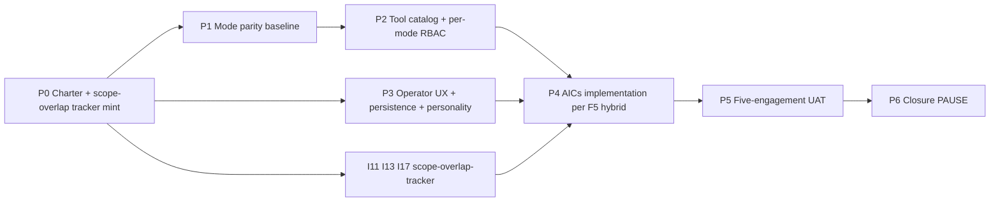
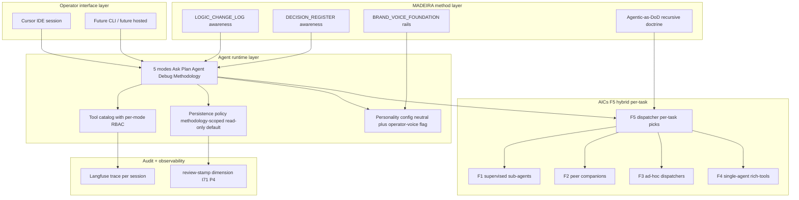

# I76 — MADEIRA elevation (operator-interaction quality at Cursor-grade)

> **Status: active (charter ratified 2026-05-18 by D-IH-76-A; I17 + I11 consolidation v1 ratified Wave H 2026-05-19 by D-IH-76-B + D-IH-76-C; Wave M canonical-CSV gates D-IH-76-D..M; scope-up MERGE override ratified Wave P Push 3 2026-05-21 by D-IH-76-N + D-IH-76-O + D-IH-76-P; Wave A of Bundle D push under I86 cluster orchestration).** Promoted from candidate per operator inline-ratify gate A1 Option D (novel framing — full P0..P6 charter + minted scope-overlap-tracker for I11/I13/I17 active stack). I84 P4 D-IH-84-C pre-ratified the AICs framing as F5 (Hybrid; per-task operator picks) so charter is free to focus on per-pattern instantiation, not the meta-decision. AIC-as-people framing per `D-IH-70-V` and the I79 People-as-Discipline-of-Disciplines RULE 5 Madeira role-class footnote. Madeira (current AI O5-1) is the named embodiment; AI O5-1 is the role class.

## Wave P Push 3 scope-up (2026-05-21; operator Q7 ratification)

Operator Q7 at Wave P kickoff ratify gate (2026-05-21): *"scope-up-i17-i11-merge-now"*. This overrides the Wave H v1 consolidation rationales (I17 v1 = D-IH-76-B Option E per-deliverable triage; I11 v1 = D-IH-76-C Option E criterion-deferred at 67% projected PARALLEL) with **Option B clean MERGE** for both initiatives at I76 P1 + P3 absorption points.

**Three Wave P Push 3 decisions ratified inline:**

- **D-IH-76-N (I11 consolidation gate MERGE override; supersedes D-IH-76-C)**: RATIFIED to Option B = MERGE at P3 absorption. The 12 inventoried I11 ops-copilot use-cases come under unified I76 P3 stewardship; the 4 uncovered use-cases become explicit scope-extension targets in the persistence + personality SOPs. I11 INITIATIVE_REGISTRY row flips `active` → `closed` at P3 closure.
- **D-IH-76-O (I17 consolidation gate MERGE override; supersedes D-IH-76-B)**: RATIFIED to Option B = MERGE at P1 absorption. The 8 non-obsolete I17 deliverables consolidated into I76 P1 MERGE disposition; 2 obsolete deliverables remain DECOMMISSIONED with audit trail; 2 cross-initiative forward-charters to I68 P3 + I78 remain INTACT but non-blocking. I17 INITIATIVE_REGISTRY row flips `active` → `closed` at P1 closure.
- **D-IH-76-P (execution forward-charter)**: RATIFIED at Wave P Push 3 — scope-up at Push 3 + execute at next push window with operator engagement at sub-gates. I76 P1+P2+P3 substantive execution (5 mode SOPs authoring + tool catalog RBAC matrix + persistence + personality + I17 MERGE absorption + I11 MERGE absorption) requires operator-engaged sessions (each ~1-2d work touching substantial SOP authoring + canonical-CSV mints). Compressing into agent-only push window before operator ratification produces shallow work incompatible with v3.1 doctrine quality bar (precedent: D-IH-86-CJ Wave P kickoff forward-charter). OPS-76-5 tracks the forward-charter status across operator ratification cycle.

**I13 consolidation gate NOT pre-ratified at Wave P Push 3** — operator Q7 named only I17 + I11 in the MERGE-NOW directive. I13's AIC-management scope overlaps with I76 F5 implementation in a way that genuinely requires P4-phase evidence to disposition (cannot be pre-ratified without P4 dispatcher pattern in hand). I13 consolidation gate stays at P4 per the original charter; default outcome at P4 entry if not ratified = Option C remain-parallel per scope-overlap-tracker §3.3.

**Net effect on phase shape**: P1 + P3 absorb I17 + I11 MERGE respectively (each closes the corresponding INITIATIVE_REGISTRY row at phase close); P4 reduces from 3 consolidation inline-ratifies → 1 (I13 only). P5 + P6 unchanged.

**Stale decisions-table note**: The "Decisions (preview)" section below was authored at Wave A 2026-05-18 with speculative IDs that never materialised (the plan slotted I17/I11/I13 gates at D-IH-76-F/G/H but Wave M reused F..M for unrelated MADEIRA persistence + voice + anti-sycophancy decisions). The table is a **stale artifact** that a Wave-cleanup initiative will reconcile separately; the Wave H + Wave M + Wave P Push 3 reality lives in DECISION_REGISTER.csv (canonical SSOT) and is summarised in this Wave P Push 3 section + the matching rows below.

## Lineage (why I76 follows I70 + I84)

I70 P2.5 codified MADEIRA at two levels — **methodology** (the founder method that produces v3.x of the Holistika OS) and **agent shape** (the L6 founder-companion AI agent that today's Cursor-agent interactions empirically embody, per `D-IH-70-V`). I84 P4 closed the AICs framing question (`D-IH-84-C` = F5 hybrid per-task operator picks) and the substrate-shape question (`D-IH-84-D` = D3 hybrid library + agent platform). I79 P5 minted the People-as-Discipline-of-Disciplines doctrine including RULE 5 Madeira role-class footnote pattern + RULE 3 agentic-as-DoD recursive doctrine.

The gap I76 closes: **the operator's interaction with MADEIRA today is fragmented across three active initiatives** (I11 60% completion, I13 active, I17 40% completion) **but lacks the polish of Cursor itself as an interaction surface**. The operator's verbatim quote: *"this is a huge win to bring my interaction with MADEIRA to be like the one I have with Cursor."* I76 brings the **shape of how MADEIRA operates and feels** up to a bar where it's a tool the operator reaches for **deliberately** rather than a default agent runtime that incidentally implements the method.

The cohering principle: **MADEIRA is a method that runs on an agent runtime; bring the runtime fit to method-grade**. Today's Cursor-as-runtime is generic; MADEIRA-the-method is specific. The fit is structural mismatch. I76 closes the mismatch by making MADEIRA's operating posture (rules, hooks, skills, MCPs, sub-agents-or-not, mode parity, tool catalog, persistence) explicitly designed for the method, not borrowed from a generic agent's defaults.

## Lineage to prior reverted promotion (governance-precedent acknowledgement)

`D-IH-86-F` (2026-05-17) initially minted I76 + I74 + I75 + I83 as active rows in INITIATIVE_REGISTRY plus `D-IH-74-A..D-IH-83-A` decision rows. Operator immediately corrected the scope to "only `gated_operator` / `gated_external` rows promoted active" and `D-IH-86-G` (2026-05-17) reverted the four candidates' active status. Today's promotion (`D-IH-76-A` mint per A1 Option D ratify 2026-05-18) is the **first formal active-status promotion of I76** under the operator's explicit Option-D framing — full P0..P6 charter + scope-overlap-tracker for I11/I13/I17 + companion blocker-trackers for I74/I75/I83 (which remain candidate-only per their own activation criteria). Today's mint preserves the operator-corrected discipline established at `D-IH-86-G`: only initiatives whose own activation criteria are clearly met (operator-driven for I76 per i76-madeira-elevation.md §1 update note 2026-05-17) get promoted, the rest get governance-shape artifacts.

## Operating story (operator framing, condensed)

> *"this is a huge win to bring my interaction with MADEIRA to be like the one I have with Cursor"* — operator at I70 P2.5 closure (per `D-IH-70-V`) plus I84 P4 (per `D-IH-84-C`).

Today's Cursor-agent interaction is the empirical MADEIRA: every `LOGIC_CHANGE_LOG` row, every `D-IH-NN-X` decision, every founder principle 2.x is authored through a Cursor session that empirically IS the MADEIRA method running on a generic Cursor runtime. The mismatch between method-specific intent and runtime-generic execution shows up in three ways: (1) MADEIRA mode parity is fragmented (Ask + Plan + Agent + Debug exist as Cursor primitives but no Methodology mode that treats every interaction as a methodology checkpoint); (2) Tool RBAC creep risks (MADEIRA might get write access to surfaces it should only read in certain phases); (3) Persistence is ephemeral (Cursor default is per-session; MADEIRA the method is methodology-scoped — `LOGIC_CHANGE_LOG` aware across sessions).

I76 closes the mismatch by formalizing five strands: mode parity (Strand B), tool catalog standardization with per-mode RBAC (Strand E), operator UX with persistence and personality ratification (Strand F), AICs implementation per F5 hybrid framing (Strand C, F5 pre-ratified at D-IH-84-C so charter inherits), inline-ratify integration as MADEIRA's canonical reference implementation (Strand D, references already-ratified `akos-inline-ratification.mdc` rule + I80 P3 inline-ratify-craft skill).

## Phase dependency chain (narrative)

- **P0 → P1**: Charter ratifies architecture inheritance (F5 from D-IH-84-C; D3 substrate from D-IH-84-D), mints INITIATIVE_REGISTRY + DECISION_REGISTER + OPS_REGISTER rows, mints scope-overlap-tracker for I11/I13/I17 as P0 deliverable §x6 with sub-ratify gates planned per phase. P0 also folds promotion criterion (b) handling (I11/I13/I17 scope-overlap review) into a tracked artifact rather than a single P0 decision so consolidation is per-phase ratifyable.
- **P1 → P2**: P1 ships mode-parity baseline (Ask + Plan + Agent + Debug + Methodology mode definitions; mode-specific tool affordances spec); P2 ratifies tool catalog with per-mode RBAC (Langfuse trace shape per I71 Strand B; deny-list explicit; tool RBAC frozen per mode per ratifiable enum).
- **P0 → P3 (parallel with P1)**: Inline-ratify MADEIRA-specific reference implementation lands as a worked example extension to `akos-inline-ratification.mdc` worked-example section + cross-link to I80 P3 craft skill. Independent of mode-parity work.
- **P2 + P3 → P4**: AICs implementation per F5 (per-task operator picks). F5 means the charter ships the per-task framing config + the dispatcher pattern, not a single F1/F2/F3/F4 implementation. P4 also ships the I11/I13/I17 consolidation-or-merge ratify gate per scope-overlap-tracker §3 (one gate per active initiative).
- **P4 → P5**: 5-engagement UAT — five real engagements use the elevated MADEIRA at the new bar; collect drift signals, mode-misuse cases, persistence misalignments, AICs F5 per-task pivot frequency.
- **P5 → P6**: Closure — `D-IH-76-CLOSURE`; INITIATIVE_REGISTRY status=closed; OPS-76-* closed; scope-overlap-tracker §3 gates closed (or forward-chartered to I76b if AICs implementation needs second cycle); handoff to I74 Strand C if TRIGGER-2 has fired by then.

## Phase dependency diagram (mermaid 1 of 3)

## Architecture diagram (mermaid 2 of 3) — MADEIRA system shape

## Module diagram (mermaid 3 of 3) — Five modes anatomy

```mermaid
flowchart LR
    subgraph ask [Ask mode read-only]
        AskTools[Read Grep Glob WebSearch]
        AskRBAC[No write no shell no MCP-write]
    end
    subgraph plan [Plan mode]
        PlanTools[Read plus AskQuestion plus plan-file write]
        PlanRBAC[Write only to plans dir]
    end
    subgraph agent [Agent mode]
        AgentTools[All tools plus Shell plus MCPs plus subagents]
        AgentRBAC[Full per atomic-phase discipline]
    end
    subgraph debug [Debug mode]
        DebugTools[Read plus observability plus hypothesis-ladder]
        DebugRBAC[No write no commit explicit hypothesis log]
    end
    subgraph methodology [Methodology mode NEW]
        MethTools[Read plus LOGIC_CHANGE_LOG candidate plus DR candidate plus BVF check]
        MethRBAC[Methodology-checkpoint discipline]
    end

    ask --> plan
    plan --> agent
    agent --> debug
    debug --> methodology
    methodology --> ask
```

## Phase deep sections

### P0 — Charter ratification + scope-overlap-tracker mint (0.5 day; PAUSE POINT none, charter-satisfies-gate per inheritance from D-IH-79-A and D-IH-80-A)

**Scope.** Mint INITIATIVE_REGISTRY row I76 active; mint DECISION_REGISTER row D-IH-76-A (charter inception, this row); mint scope-overlap-tracker for I11/I13/I17 at `docs/wip/planning/_trackers/i11-i13-i17-scope-overlap-tracker.md` per A1 Option D ratify; mint OPS-76-1 (P0 charter coordination); mint companion files (decision-log + risk-register + asset-classification + evidence-matrix + files-modified.csv); update I86 master-roadmap §1.3 sibling table; update INITIATIVE_DEPENDENCIES + planning README. Inherit F5 (D-IH-84-C) + D3 (D-IH-84-D) without re-ratifying.

**Files (canonical).**
- New: [`docs/wip/planning/76-madeira-elevation/master-roadmap.md`](master-roadmap.md) (this file).
- New: [`docs/wip/planning/76-madeira-elevation/decision-log.md`](decision-log.md).
- New: [`docs/wip/planning/76-madeira-elevation/risk-register.md`](risk-register.md).
- New: [`docs/wip/planning/76-madeira-elevation/asset-classification.md`](asset-classification.md).
- New: [`docs/wip/planning/76-madeira-elevation/evidence-matrix.md`](evidence-matrix.md).
- New: [`docs/wip/planning/76-madeira-elevation/files-modified.csv`](files-modified.csv).
- New: [`docs/wip/planning/_trackers/i11-i13-i17-scope-overlap-tracker.md`](../_trackers/i11-i13-i17-scope-overlap-tracker.md).
- Modified: [`docs/references/hlk/v3.0/Admin/O5-1/People/Compliance/canonicals/INITIATIVE_REGISTRY.csv`](../../../references/hlk/v3.0/Admin/O5-1/People/Compliance/canonicals/INITIATIVE_REGISTRY.csv) (append I76 row).
- Modified: [`docs/references/hlk/v3.0/Admin/O5-1/People/Compliance/canonicals/DECISION_REGISTER.csv`](../../../references/hlk/v3.0/Admin/O5-1/People/Compliance/canonicals/DECISION_REGISTER.csv) (append D-IH-76-A + D-IH-86-O).
- Modified: [`docs/references/hlk/v3.0/Admin/O5-1/People/Compliance/canonicals/OPS_REGISTER.csv`](../../../references/hlk/v3.0/Admin/O5-1/People/Compliance/canonicals/OPS_REGISTER.csv) (append OPS-76-1 + OPS-86-6).
- Modified: [`docs/wip/planning/86-initiative-cluster-execution-coordinator/master-roadmap.md`](../86-initiative-cluster-execution-coordinator/master-roadmap.md) §1.3 (I76 row update from forward-candidate to active).
- Modified: [`docs/wip/planning/INITIATIVE_DEPENDENCIES.md`](../INITIATIVE_DEPENDENCIES.md) (add I76 dependency on I84 + I86 + I79).
- Modified: [`docs/wip/planning/README.md`](../README.md) (add I76 active row).

**Verification.** `py scripts/validate_hlk.py` (initiative-registry FK resolution + decision-register FK resolution); `py scripts/validate_initiative_registry.py` (I76 row schema); manual readback of master-roadmap diagrams (mermaid render).

**Pause-point classification.** Standard (no canonical-CSV-mutating gate beyond INITIATIVE_REGISTRY append which is allowed inline per I86 cluster orchestration precedent for sibling promotions D-IH-86-G).

**Self-checkpoint count.** 1 (already filed at `reports/checkpoints/sc-pre-wave-a-2026-05-18.md` of I86 — covers Wave A entry).

**Cursor-rules adherence.** This phase operationalises [`akos-planning-traceability.mdc`](../../../.cursor/rules/akos-planning-traceability.mdc) §"Plan-quality bar" (multi-sentence YAML todos minted via the I76 frontmatter; three mermaid diagrams ratified above; per-initiative `files-modified.csv` will land at this charter mint commit) + [`akos-inline-ratification.mdc`](../../../.cursor/rules/akos-inline-ratification.mdc) (gate A1 Option D fired before charter authoring) + [`akos-people-discipline-of-disciplines.mdc`](../../../.cursor/rules/akos-people-discipline-of-disciplines.mdc) RULE 5 (Madeira role-class footnote applied above) + [`akos-governance-remediation.mdc`](../../../.cursor/rules/akos-governance-remediation.mdc) (commit-and-phase discipline, one commit per phase planned).

### P1 — Mode parity baseline + I17 MERGE absorption (1-2 days; absorbs I17 per D-IH-76-O ratified Wave P Push 3)

**Scope.** Author 5 mode definitions (Ask + Plan + Agent + Debug + Methodology). Each mode definition specifies: tool affordances (which tools available); RBAC posture (read / read+plan-write / full / read+observability / methodology-checkpoint); transition rules (when does the mode switch fire); session state retention. Methodology mode is the MADEIRA delta: every interaction surfaces as a `LOGIC_CHANGE_LOG` candidate row + a `DECISION_REGISTER` candidate row + a brand-voice register check. **I17 MERGE absorption (per D-IH-76-O Wave P Push 3 ratification; supersedes D-IH-76-B v1 per-deliverable triage)**: 8 non-obsolete I17 deliverables explicitly cited as P1 input + carry-forward in the 5 mode SOPs (preserved from v1 per-deliverable triage report at `reports/i17-deliverable-triage-2026-05-19.md`); 2 obsolete deliverables (3-mode UI + swarm overlays) remain DECOMMISSIONED with audit trail; 2 cross-initiative forward-charters (pytest+log-watcher → I68 P3 ; executor_harness → I78) remain INTACT as non-blocking cross-references. I17 INITIATIVE_REGISTRY row flips `active` → `closed` at P1 closure via `D-IH-17-CLOSURE`.

**Files (canonical).**
- New: `docs/references/hlk/v3.0/Admin/O5-1/Envoy Tech Lab/canonicals/MADEIRA_MODE_PARITY.md` (mode taxonomy + per-mode RBAC overview).
- New: `docs/references/hlk/v3.0/Admin/O5-1/Envoy Tech Lab/canonicals/MADEIRA_METHODOLOGY_MODE.md` (NEW mode spec; methodology-checkpoint discipline).
- Modified: `docs/wip/planning/_trackers/i11-i13-i17-scope-overlap-tracker.md` §3.1 (I17 MERGE absorption status update from v2 RATIFIED → CLOSED-AT-P1).
- Modified: `docs/references/hlk/v3.0/Admin/O5-1/People/Compliance/canonicals/INITIATIVE_REGISTRY.csv` (I17 row status `active` → `closed`).
- New: `docs/wip/planning/76-madeira-elevation/reports/p1-i17-merge-absorption-<YYYYMMDD>.md` (deliverable-by-deliverable absorption ledger; cross-references v1 per-deliverable triage report + names which mode SOP absorbs each substrate-worthy I17 deliverable).

**Verification.** Validator stub `scripts/validate_madeira_mode_parity.py` (Pydantic model `akos/hlk_madeira_mode.py` enforcing the mode enum + RBAC posture per mode); `py scripts/validate_hlk.py` extension; review-stamp dimension applied per I71 P4.

**Pause-point classification.** Standard (no canonical-CSV gate; new SOPs ratified inline per I72 P9 process_list pairing Rule 1 — paired runbook is the validator + Methodology mode runbook).

**Self-checkpoint count.** 2 (pre-P1 + mid-P1 once mode definitions ratified).

### P2 — Tool catalog with per-mode RBAC (1-2 days)

**Scope.** Authoritative list of tools MADEIRA can call (Read + Edit + Shell + validators + MCPs); RBAC matrix per mode (5 modes x N tools); explicit deny-list (no auto-publish to PyPI; no GitHub release without operator ratification; no canonical CSV mutation outside operator-gated phases). Audit log: every MADEIRA session emits a Langfuse trace per I71 Strand B.

**Files (canonical).**
- New: `docs/references/hlk/v3.0/Admin/O5-1/Envoy Tech Lab/canonicals/MADEIRA_TOOL_CATALOG.md`.
- New: `docs/references/hlk/v3.0/Admin/O5-1/Envoy Tech Lab/canonicals/dimensions/MADEIRA_TOOL_RBAC.csv` (mode_id, tool_id, allowed: bool, rationale).
- New: `akos/hlk_madeira_tool_csv.py` (Pydantic model for the RBAC CSV).
- New: `scripts/validate_madeira_tool_rbac.py` (validator).

**Verification.** `py scripts/validate_madeira_tool_rbac.py` + `py scripts/test.py madeira` (unit tests for RBAC enforcement at session-start) + Langfuse trace shape ratified.

**Pause-point classification.** Standard (canonical CSV append for MADEIRA_TOOL_RBAC is allowed inline per the new-canonical-CSV-pattern in `akos-holistika-operations.mdc`).

**Self-checkpoint count.** 2.

### P3 — Operator UX + persistence + personality + I11 MERGE absorption (1-2 days; parallel-eligible with P1; absorbs I11 per D-IH-76-N ratified Wave P Push 3)

**Scope.** Persistence policy (default: methodology-scoped read-only; MADEIRA can read recent decisions + LOGIC_CHANGE_LOG rows but doesn't write across sessions without explicit ratification); personality (default: neutral; operator-voice mirror under explicit flag per Strand A research findings absorbed from I84 P1 Tier-1 WIP); brand-jargon hygiene (per `D-IH-70-I` strict mode + `akos-brand-baseline-reality.mdc` dual-register contract). **I11 MERGE absorption (per D-IH-76-N Wave P Push 3 ratification; supersedes D-IH-76-C v1 criterion-deferred)**: 12 inventoried I11 ops-copilot use-cases brought under unified I76 P3 stewardship; per the v1 measurement at `reports/i11-consolidation-criterion-2026-05-19.md`, 8 of 12 already covered by I76 P1+P3 SOP scope; the 4 uncovered ops-copilot-specific use-cases become explicit scope-extension targets in `SOP-TECH_MADEIRA_PERSISTENCE_001` (ops-copilot persistence patterns) + `SOP-TECH_MADEIRA_PERSONALITY_001` (ops-copilot personality affordances). I11 INITIATIVE_REGISTRY row flips `active` → `closed` at P3 closure via `D-IH-11-CLOSURE`.

**Files (canonical).**
- New: `docs/references/hlk/v3.0/Admin/O5-1/Envoy Tech Lab/canonicals/SOP-TECH_MADEIRA_PERSISTENCE_001.md` (extended scope includes the 4 uncovered I11 ops-copilot persistence use-cases).
- New: `docs/references/hlk/v3.0/Admin/O5-1/Envoy Tech Lab/canonicals/SOP-TECH_MADEIRA_PERSONALITY_001.md` (extended scope includes the 4 uncovered I11 ops-copilot personality use-cases when applicable; otherwise the persistence SOP covers all 4).
- New: `scripts/madeira_persistence_check.py` (paired runbook for the persistence SOP).
- New: `scripts/madeira_personality_check.py` (paired runbook for the personality SOP).
- Modified: `docs/wip/planning/_trackers/i11-i13-i17-scope-overlap-tracker.md` §3.2 (I11 MERGE absorption status update from v2 RATIFIED → CLOSED-AT-P3).
- Modified: `docs/references/hlk/v3.0/Admin/O5-1/People/Compliance/canonicals/INITIATIVE_REGISTRY.csv` (I11 row status `active` → `closed`).
- New: `docs/wip/planning/76-madeira-elevation/reports/p3-i11-merge-absorption-<YYYYMMDD>.md` (use-case-by-use-case absorption ledger; cross-references v1 criterion report + names which SOP section absorbs each I11 use-case).

**Verification.** Both SOPs have paired runbooks per `akos-executable-process-catalog.mdc` Rule 1. `py scripts/validate_hlk.py` + cross-reference to BBR drift gate.

**Pause-point classification.** Standard (operator may inline-ratify the personality default at the SOP-mint moment).

**Self-checkpoint count.** 2.

### P4 — AICs implementation per F5 hybrid + I13 consolidation ratify (2-3 days; reduced from I11+I13+I17 to I13-only)

**Scope.** F5 (Hybrid; per-task operator picks) means MADEIRA dispatches AICs from a per-task config — F1 supervised-sub-agents for some task classes; F2 peer-companions for others; F3 ad-hoc-dispatch for one-shots; F4 single-agent rich-tools as the trivial case. Implementation: a per-task registry (`MADEIRA_AIC_PER_TASK_REGISTRY.csv`) with rows (task_class, default_framing, dispatcher_pattern, escalation_path). **Scope reduction (per Wave P Push 3 D-IH-76-N + D-IH-76-O ratifications)**: I17 + I11 consolidation gates pre-ratified to MERGE at P1 + P3 respectively, closing both initiatives before P4. Only **I13 consolidation gate** remains at P4 — single inline-ratify gate per scope-overlap-tracker §3.3 (I13's AIC-management scope overlaps with I76 F5 implementation in a way that genuinely requires P4-phase evidence to disposition; cannot be pre-ratified at Wave P Push 3 like I17 + I11).

**Files (canonical).**

> **Drift-correction (2026-05-29, regression-amendment pass).** The registry + Pydantic model + validator below were minted EARLY under the AIC-registry work (I82 P4 / I86 Wave Q CSV 4 child, `D-IH-82-S`) at the **People/Compliance** path — see [`PRECEDENCE.md`](../../../references/hlk/v3.0/Admin/O5-1/People/Compliance/canonicals/PRECEDENCE.md) line 99. They are **NOT net-new at the Envoy Tech Lab path** this section originally claimed. Only the dispatch runbook + SOP remain genuinely net-new under I76 P4. (This stale list is the drift that misled a downstream planning pass; corrected here so no future agent re-mints existing canonicals.)

- **EXISTS** (minted I82 P4): `docs/references/hlk/v3.0/Admin/O5-1/People/Compliance/canonicals/dimensions/MADEIRA_AIC_PER_TASK_REGISTRY.csv` (3 demonstrator rows; enums `task_class`(8) / `dispatcher_pattern`(6) / `rbac_class`(4); FK `aic_id` → AIC_REGISTRY).
- **EXISTS** (minted I82 P4): `akos/hlk_madeira_aic_per_task_csv.py` (Pydantic model — note the `_per_task_csv` suffix, not `hlk_madeira_aic_csv.py`).
- **EXISTS** (minted I82 P4): `scripts/validate_madeira_aic_per_task.py` (validator).
- New (genuinely net-new under I76 P4): `scripts/madeira_aic_dispatch.py` (paired runbook — given a task_class, returns the F-framing config).
- New (genuinely net-new under I76 P4): `docs/references/hlk/v3.0/Admin/O5-1/Envoy Tech Lab/canonicals/SOP-TECH_MADEIRA_AIC_DISPATCH_001.md`.
- Modified: `docs/wip/planning/_trackers/i11-i13-i17-scope-overlap-tracker.md` §3.3 (I13 consolidation ratify gate closes; §3.1 + §3.2 already closed at P1 + P3 respectively).

**Verification.** Per-task registry validator green; I13 consolidation ratify gate closes (1 entry in scope-overlap-tracker §3.3 ratified or forward-chartered); I13 INITIATIVE_REGISTRY row updated (closed if consolidated; status preserved if remain-parallel).

**Pause-point classification.** One operator-gated inline-ratify (I13 consolidation decision; reversible); plus canonical-CSV append for the new MADEIRA_AIC_PER_TASK_REGISTRY which lands inline per the new-canonical-CSV-pattern in `akos-holistika-operations.mdc`. Scope reduction from 3 inline-ratifies → 1 (per Wave P Push 3 pre-ratification of I17 + I11).

**Self-checkpoint count.** 2 (pre-P4 + mid-P4 after dispatcher pattern lands; reduced from 3 → 2 because P4 scope reduction removes one consolidation cycle).

### P5 — Five-engagement UAT (3-5 days; calendar-spread)

**Scope.** Five real engagements use the elevated MADEIRA at the new bar over a ~2-week calendar window. Collect: mode-misuse rate (operator switches modes Y times per session vs baseline N); persistence misalignments (MADEIRA reads stale decisions); AICs F5 per-task pivot frequency (which task classes pivot from default framing); brand-jargon hygiene leak rate (BBR drift gate hits per session); methodology-mode capture rate (LOGIC_CHANGE_LOG candidates surfaced vs ratified).

**Files (canonical).**
- New: `docs/wip/planning/76-madeira-elevation/reports/uat-five-engagements-<YYYYMMDD>.md` (UAT evidence per `akos-planning-traceability.mdc` UAT contract).
- Modified: `docs/wip/planning/76-madeira-elevation/files-modified.csv` (UAT-cycle phase rows).

**Verification.** UAT report table with PASS / SKIP / N/A per engagement per dimension; minimum 3/5 engagements PASS the brand-jargon hygiene + methodology-mode dimensions (per I76 risk #2 mitigation); operator review.

**Pause-point classification.** Standard with operator review at UAT report mint.

**Self-checkpoint count.** 1 (mid-P5; UAT report drafting may surface conflict that triggers ratify gate).

### P6 — Closure (0.5 day; PAUSE POINT — closure)

**Scope.** Mint `D-IH-76-CLOSURE`; INITIATIVE_REGISTRY status=closed; OPS-76-* closed; scope-overlap-tracker §3 gates closed (or forward-chartered to I76b); files-modified.csv P6-closure rows; closure pause record per `akos-agent-checkpoint-discipline.mdc`; handoff to I74 Strand C if TRIGGER-2 has fired by closure date (link decision-log if not).

**Files (canonical).**
- New: `docs/wip/planning/76-madeira-elevation/reports/p6-closure-pause-record-<YYYYMMDD>.md`.
- Modified: INITIATIVE_REGISTRY (I76 status closed); DECISION_REGISTER (D-IH-76-CLOSURE row); OPS_REGISTER (OPS-76-* closed).

**Verification.** Closure pause record per the rule template (mechanical evidence + documentary evidence + approval checklist ≤ 7 items).

**Pause-point classification.** Closure pause point (mandatory operator approval per `akos-agent-checkpoint-discipline.mdc`).

**Self-checkpoint count.** 1 (pre-P6 closure).

## Decisions (preview)

| Decision | Question | Owner | Status entering | Close-out phase |
|:---|:---|:---|:---|:---|
| **D-IH-76-A** | I76 charter inception (Wave A 2026-05-18 promotion under Option D) | System Owner + PMO | RATIFIED (Wave A) | P0 |
| **D-IH-76-B** | Mode taxonomy (4 modes vs 5; Methodology mode shape) | System Owner | Proposed | P1 |
| **D-IH-76-C** | Tool catalog + per-mode RBAC architecture | System Owner | Proposed | P2 |
| **D-IH-76-D** | Persistence shape (ephemeral / session / methodology) | System Owner + Founder | Proposed | P3 |
| **D-IH-76-E** | Personality ratification (neutral / operator-voice / named) | Founder | Proposed | P3 |
| **D-IH-76-F** | MADEIRA persistence vehicle registry mint (canonical-CSV gate) | System Owner + Founder | RATIFIED Wave M (2026-05-19) — MADEIRA_PERSISTENCE_VEHICLE_REGISTRY.csv minted with 16 seed rows | Wave M |
| **D-IH-76-G** | MADEIRA voice canonical shape (PROSE-FIRST SOP + Pydantic chassis only at v1) | Founder + System Owner | RATIFIED Wave M (2026-05-19) — `not overengineered` framing | Wave M |
| **D-IH-76-H** | MADEIRA voice trait vocabulary closed at 9 traits | Founder | RATIFIED Wave M (2026-05-19) — STANDARD_TRAIT_VOCABULARY frozenset | Wave M |
| **D-IH-76-I** | MADEIRA voice audience_constraint v1 set ratified at 3 classes | Founder | RATIFIED Wave M (2026-05-19) — {J-OP, J-AD-post-NDA, J-CO} | Wave M |
| **D-IH-76-J** | MADEIRA anti-sycophancy friction injection at 3-consecutive-agreement threshold | Founder | RATIFIED Wave M (2026-05-19) — `anti_sycophancy_threshold` default = 3 | Wave M |
| **D-IH-76-K** | MADEIRA corpus access FK-only per OperatorVoiceProfile.corpus_paths | Founder + System Owner | RATIFIED Wave M (2026-05-19) — preserves access_level 5 confidentiality | Wave M |
| **D-IH-76-L** | MADEIRA voice knowledge-test cadence quarterly inline-ratify default | Founder | RATIFIED Wave M (2026-05-19) — 90-day default per OperatorVoiceProfile.knowledge_test_cadence_days | Wave M |
| **D-IH-76-M** | MADEIRA cross-AIC handling per-AIC re-load on switch (no shared session state) | Founder + System Owner | RATIFIED Wave M (2026-05-19) — extensible to N>1 AICs via per-AIC re-load contract | Wave M |
| **D-IH-76-N** | I11 consolidation gate MERGE override (supersedes D-IH-76-C) | Founder | **RATIFIED Wave P Push 3 (2026-05-21): Option B = MERGE** per operator Q7 override; overrides v1 D-IH-76-C Option E criterion-deferred (67% PARALLEL auto-decision); accepts 4 uncovered I11 use-cases as P3 SOP scope-extension targets | Wave P Push 3 (was P4) |
| **D-IH-76-O** | I17 consolidation gate MERGE override (supersedes D-IH-76-B) | Founder | **RATIFIED Wave P Push 3 (2026-05-21): Option B = MERGE** per operator Q7 override; overrides v1 D-IH-76-B Option E per-deliverable triage; 8 non-obsolete I17 deliverables consolidated into I76 P1 MERGE disposition; 2 obsolete deliverables remain DECOMMISSIONED; 2 cross-initiative forward-charters to I68 P3 + I78 remain INTACT but non-blocking | Wave P Push 3 (was P4) |
| **D-IH-76-P** | I76 P1+P2+P3 substantive execution forward-charter | Founder + System Owner | **RATIFIED Wave P Push 3 (2026-05-21)** per operator Q7 framing: scope-up at Push 3 + execute at next push window with operator engagement at sub-gates (5 mode SOPs authoring + tool catalog RBAC matrix + persistence + personality + I17 MERGE absorption + I11 MERGE absorption). Compressing into agent-only push window before operator ratification produces shallow work incompatible with v3.1 doctrine quality bar (precedent: D-IH-86-CJ). OPS-76-5 tracks status across operator ratification cycle. | Wave P Push 3 |
| **D-IH-76-Q** | I13 consolidation gate (remaining at P4 per Wave P Push 3 scope; operator Q7 did not pre-ratify) | Founder | Proposed | P4 |
| **D-IH-76-R** | I74 Strand C handoff trigger (productization gate) | Founder | Proposed | P6 |
| **D-IH-76-CLOSURE** | initiative closure | Founder + System Owner | Proposed | P6 |

Inherited (pre-ratified at I84 P4):

- `D-IH-84-C` = F5 (Hybrid; per-task operator picks) → consumed at P4.
- `D-IH-84-D` = D3 (Hybrid library + agent platform) → consumed at P4 + at I74 Strand C handoff.

## Risks (preview)

| Risk | L | I | Mitigation |
|:---|:---:|:---:|:---|
| **R-IH-76-1** Premature AICs commitment locks pattern before live evidence supports it | Medium | High | F5 hybrid framing means per-task operator picks; the dispatcher pattern carries the framing flexibility; P5 UAT collects pivot frequency to inform whether F5 holds or any framing should be promoted as primary. |
| **R-IH-76-2** Brand-voice / personality conflict (per `D-IH-70-I`) | Medium | High | P3 SOP + paired runbook with BBR drift gate enforcement; Strand F brand-jargon hygiene gates at every MADEIRA-authored artifact. |
| **R-IH-76-3** Tool RBAC creep (MADEIRA gets too many tools too fast) | Medium | Medium | P2 explicit deny-list + per-mode RBAC frozen by enum; Langfuse trace audit per session per I71 Strand B. |
| **R-IH-76-4** Persistence violates `D-IH-70-I` brand-jargon hygiene OR `D-IH-71-E` review-stamp dimension | Medium | Medium | C-76-3 default = methodology-scoped read-only; brand-jargon validator + review-stamp validator both gate persistent state per P3 SOP. |
| **R-IH-76-5** I11 / I13 / I17 consolidation ratify creates downtime in active engagements | Medium | High | Scope-overlap-tracker §3 ratifies one sibling per phase, not all at once; default = remain-parallel for any sibling without consolidation evidence; tracker forward-charters to I76b if consolidation needs second cycle. |
| **R-IH-76-6** P5 UAT cohort can't be assembled (no 5 active engagements when P4 closes) | Medium | Medium | P5 calendar-spread (~2 weeks); operator can use 3 engagements + 2 simulated runs as fallback; UAT report acknowledges sample size as caveat. |
| **R-IH-76-7** I76 closure fires before TRIGGER-2 of I74 (productization) — Strand C handoff has nothing to receive | Low | Low | D-IH-76-I gate at P6 — closure includes "handoff trigger pending TRIGGER-2 firing"; I74 picks up when its own gate clears (per i74-promotion-blocker-tracker.md). |
| **R-IH-76-8** Methodology mode is overengineered (5th mode adds cognitive load) | Medium | Low | C-76-2 ratifies at P1 inline-ratify; default = real mode IF unique tool affordances; preset otherwise. |

## Asset classification (per PRECEDENCE.md)

| Asset | Class | Edit rule |
|:---|:---|:---|
| INITIATIVE_REGISTRY row I76 | canonical | Edit at `docs/references/hlk/v3.0/Admin/O5-1/People/Compliance/canonicals/INITIATIVE_REGISTRY.csv` |
| DECISION_REGISTER rows D-IH-76-* | canonical | Edit at `DECISION_REGISTER.csv` |
| OPS_REGISTER rows OPS-76-* | canonical | Edit at `OPS_REGISTER.csv` |
| MADEIRA mode SOPs (P1-P3) | canonical | Edit at `Envoy Tech Lab/canonicals/` |
| MADEIRA paired runbooks | canonical | Edit at `scripts/madeira_*.py` |
| MADEIRA_TOOL_RBAC.csv (P2) | canonical | Edit at `Envoy Tech Lab/canonicals/dimensions/` |
| MADEIRA_AIC_PER_TASK_REGISTRY.csv (P4) | canonical | **Exists** (minted I82 P4, `D-IH-82-S`); edit at `People/Compliance/canonicals/dimensions/` per PRECEDENCE line 99 |
| Compliance mirror tables (Supabase) | mirrored | Auto-emit via `compliance_mirror_emit` from canonical |
| `docs/wip/planning/76-madeira-elevation/` | planning | Mirror of authoritative plan (this folder is itself authoritative for I76 per frontmatter) |
| `docs/wip/planning/_trackers/i11-i13-i17-scope-overlap-tracker.md` | planning (governance-shape artifact) | Edit at this file; forward-chartered ratify gates close into per-phase I76 decisions |
| Cursor session transcripts | reference | Read-only audit material; consumed by Langfuse |

## Acceptance criteria (closure-readiness contract)

1. All 5 mode SOPs minted at `Envoy Tech Lab/canonicals/` (Ask + Plan + Agent + Debug + Methodology) with paired runbooks per `akos-executable-process-catalog.mdc` Rule 1.
2. MADEIRA_TOOL_RBAC.csv minted with full per-mode RBAC matrix; validator green.
3. MADEIRA_AIC_PER_TASK_REGISTRY.csv minted; F5 hybrid dispatcher pattern operational; per-task config ratifyable per session.
4. Persistence + personality SOPs minted with paired runbooks; BBR drift gate compliant.
5. Inline-ratify worked-example MADEIRA-specific extension landed in `akos-inline-ratification.mdc`.
6. I11 / I13 / I17 consolidation gates ratified at scope-overlap-tracker §3 (per-sibling decision: decommission / merge / remain-parallel / forward-charter).
7. P5 UAT report present at `reports/uat-five-engagements-<YYYYMMDD>.md` with PASS / SKIP / N/A per dimension; ≥ 3/5 engagements PASS the brand-jargon + methodology-mode dimensions.
8. D-IH-76-CLOSURE minted; INITIATIVE_REGISTRY row I76 status=closed; OPS-76-* closed.
9. files-modified.csv covers every commit landing under I76 with full schema (18 columns per `akos-planning-traceability.mdc`).
10. Closure pause record at `reports/p6-closure-pause-record-<YYYYMMDD>.md` filed and operator-approved.

## Cross-references

- [I76 candidate file](../_candidates/i76-madeira-elevation.md) — promoted to active by this charter.
- [I84 master-roadmap](../84-substrate-doctrine-and-commercial-readiness/master-roadmap.md) — D-IH-84-C + D-IH-84-D pre-ratified.
- [I80 master-roadmap](../80-i79-lessons-learned/master-roadmap.md) — gold-standard v3.1 charter shape; inline-ratify-craft skill.
- [I86 master-roadmap](../86-initiative-cluster-execution-coordinator/master-roadmap.md) — cluster orchestration; §1.3 sibling table.
- [I79 master-roadmap](../79-people-manifesto-and-pattern-library/master-roadmap.md) — People-as-DoD doctrine + Madeira role-class footnote pattern.
- [I71 master-roadmap](../71-cicd-discipline-and-aiops-baseline-maturity/master-roadmap.md) — Langfuse trace shape (Strand B); validator packs (Strand A); review-stamp dimension (P4).
- [I11 master-roadmap](../11-madeira-ops-copilot/master-roadmap.md) — active sibling; consolidation ratify at I76 P4 per scope-overlap-tracker §3.
- [I13 master-roadmap](../13-madeira-research-followthrough/master-roadmap.md) — active sibling; same.
- [I17 master-roadmap](../17-madeira-cursor-mode-parity/master-roadmap.md) — active sibling; consolidation question is most acute since I17 directly addresses mode parity.
- [I74 candidate](../_candidates/i74-brand-tooling-productization.md) Strand C — productization downstream of I76 closure if TRIGGER-2 fires.
- [scope-overlap-tracker](../_trackers/i11-i13-i17-scope-overlap-tracker.md) — governance-shape artifact for this charter's scope-overlap question.
- [`akos-inline-ratification.mdc`](../../../.cursor/rules/akos-inline-ratification.mdc) — discipline MADEIRA itself canonicalises.
- [`.cursor/skills/inline-ratify-craft/SKILL.md`](../../../.cursor/skills/inline-ratify-craft/SKILL.md) — craft skill MADEIRA agents inherit.
- [`.cursor/rules/akos-people-discipline-of-disciplines.mdc`](../../../.cursor/rules/akos-people-discipline-of-disciplines.mdc) RULE 5 — Madeira role-class footnote pattern (applied above).
