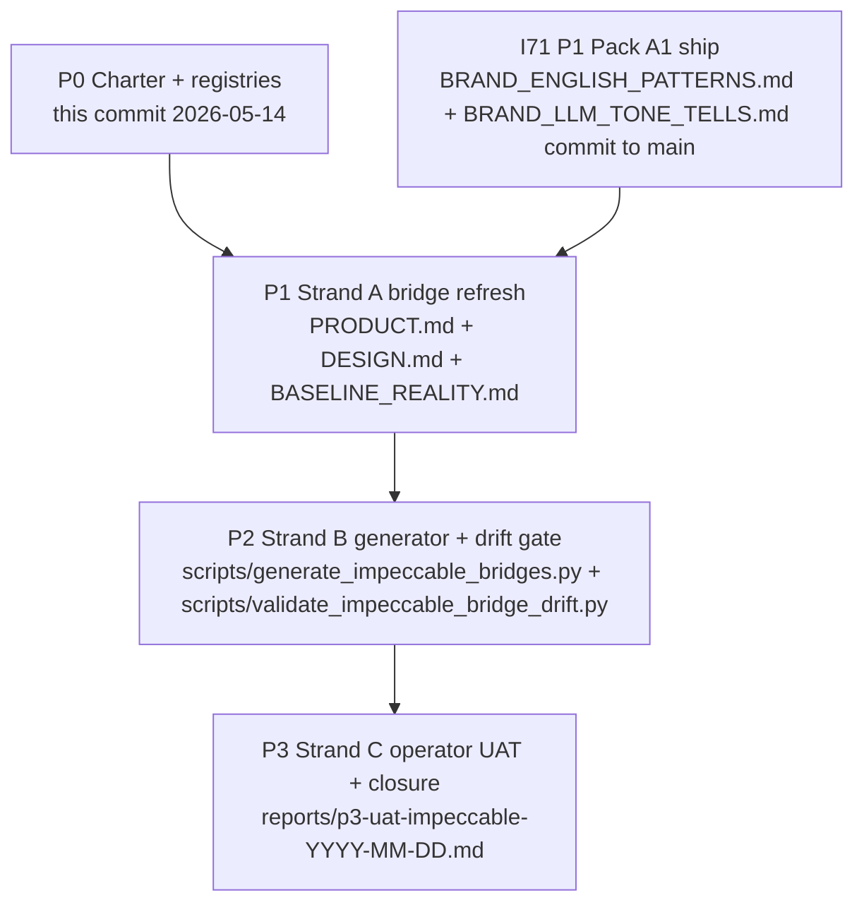

# I77 — Impeccable Brand-Bridge Refresh + Drift Gate + Brand-Canon Collapse Remediation + Rendering-Governance Discovery

> **Status: CLOSED V2 2026-05-16 via [D-IH-77-CLOSURE-V2](../../../references/hlk/v3.0/Admin/O5-1/People/Compliance/canonicals/DECISION_REGISTER.csv).** Originally three strands (A bridges + B drift gate + C UAT) shipped same-day as PASS, then reopened when P3 UAT review uncovered an agent-hallucinated brand-canon variant ("Holística" framed as a Spanish-locale brand form when the brand is **Holistika universally**) AND surfaced the operator directive to govern rendering pipelines as a scalable discipline (not orphan processes per initiative). **P4 absorbed three sub-strands and CLOSED V2 same-day**: **4.A** total-prose brand-canon sweep across 10 file-class tiers (193 instances) **SHIPPED**; **4.B** UAT rendered as brand-aligned visual artifact via [`scripts/render_impeccable_uat.py`](../../../../scripts/render_impeccable_uat.py) → [`docs/presentations/uat-impeccable-all-surfaces-2026-05-16/`](../../../../docs/presentations/uat-impeccable-all-surfaces-2026-05-16/) **SHIPPED**; **4.C** orphan-rendering-pipeline registry [`RENDERING_PIPELINE_REGISTRY.csv`](../../../references/hlk/v3.0/Envoy%20Tech%20Lab/canonicals/dimensions/RENDERING_PIPELINE_REGISTRY.csv) (18 seed rows) + Pydantic [`akos/hlk_rendering_pipeline_csv.py`](../../../../akos/hlk_rendering_pipeline_csv.py) + validator + paired SOP + paired runbook + 20 governance tests **SHIPPED**. All validators green. See [`reports/p4-brand-canon-collapse-remediation-2026-05-16.md`](reports/p4-brand-canon-collapse-remediation-2026-05-16.md) for the closure narrative.

## Operating story

Initiative 29 P3 authored [`PRODUCT.md`](../../../PRODUCT.md) + [`DESIGN.md`](../../../DESIGN.md) at workspace root as thin-redirect bridge files for the Impeccable Style cursor skill (`.cursor/skills/impeccable/`). Both files cite 6 canonicals under `Marketing/Brand/canonicals/`. Since then, **15+ brand canonicals** have landed across I66 (Brand Vision Ops Sweep) + I70 (OS Self-Governance) + I71 (Pack A1 chassis) that the bridges do NOT reference:

- I66 additions: `BRAND_ARCHITECTURE.md` (Branded House topology + Tier 1/2/3 voice + D-IH-66-R no-separate-companies), `BRAND_VISION.md` (public-vision fence), `BRAND_BASELINE_REALITY_MATRIX.md` (§3 translation rules), `BRAND_ABBREVIATIONS.md` (forbidden short-forms), `BRAND_FRENCH_PATTERNS.md` (FR locale), `BRAND_LOGO_SYSTEM.md` (visual identity).
- I70 additions: `BRAND_COBRANDING_PATTERN.md` (host/guest split), `BRAND_DISCIPLINE_ONTOLOGY.md` (sub-discipline boundary per `D-IH-70-X` Storytelling/Resonance), `BRAND_GANTT_DISCIPLINE.md` (4-quadrant audience matrix), `BRAND_MULTILINGUAL_CONTRACT.md` (locale discipline + `D-IH-70-P`), `BRAND_TEMPLATE_REGISTRY.md` (template inventory).
- I71 P1 additions (will exist once Pack A1 commits): `BRAND_ENGLISH_PATTERNS.md` (EN locale parity), `BRAND_LLM_TONE_TELLS.md` (anti-LLM corporate-prose tells), `BRAND_COPYWRITING_DISCIPLINE.md` 7 tic families §2.

Plus a load-bearing gap: **Impeccable SKILL v3.1.0 declares `BASELINE_REALITY.md` as a required gate** for any surface with ≥2 audiences (per the v3.1 setup matrix in [`.cursor/skills/impeccable/SKILL.md`](../../../.cursor/skills/impeccable/SKILL.md) line 8). The workspace canonical `BRAND_BASELINE_REALITY_MATRIX.md` exists, but no root bridge file points Impeccable at it — so the v3.1 multi-audience nudge fires every session today.

Closing the loop matters for two reasons. **First**, when I71 Pack A1 lands strict-day-1 (validator gates 10 layers fail-loud), `/polish` + `/critique` will produce copy that gets FAILED by Pack A1 unless Impeccable is brand-DNA-aware. The bridges are the seam. **Second**, the Holistika institutional brand corpus is the inverse of Impeccable's `/impeccable teach` 5-minute interview pattern: we don't have a founder's gut-feel voice-in-three-words, we have 15+ canonical SSOTs governing voice + visual + audience across Branded House topology. The bridge ARCHITECTURE is right (thin redirect — exactly Impeccable's intended path); the bridge CONTENT needs refresh + completion.

## Strand A — Bridge refresh (P1)

Refresh PRODUCT.md + DESIGN.md + author BASELINE_REALITY.md as thin redirects to canonical brand SSOT. **NO duplicated brand content** (preserves the I29 P3 + `SOP-HLK_TOOLING_STANDARDS_001.md` §3.7 thin-redirect contract). Per-bridge scope:

- **[`PRODUCT.md`](../../../PRODUCT.md)** — extend canonical-SSOT section to cite all 15 brand canonicals (+ I71 P1.3 outputs once available). Add cross-references to Branded House topology, voice persona axis, engagement-type defaults, Storytelling/Resonance boundary, anti-LLM-tone canon. Preserve AKOS-precedence rule.
- **[`DESIGN.md`](../../../DESIGN.md)** — extend visual-SSOT section with cross-references to BRAND_LOGO_SYSTEM, BRAND_COBRANDING_PATTERN, FIGMA_FILES_REGISTRY. Update token snapshot if canonicals have shifted since I29 P3.
- **NEW [`BASELINE_REALITY.md`](../../../BASELINE_REALITY.md)** at workspace root — thin redirect to [`BRAND_BASELINE_REALITY_MATRIX.md`](../../references/hlk/v3.0/Admin/O5-1/Marketing/Brand/canonicals/BRAND_BASELINE_REALITY_MATRIX.md). Covers per-audience assumed-normal + bridge frame + objection patterns + decision criteria + evidence types trusted + first-doubt trigger. Sources from the canonical §3 translation rules + per-audience J-* rows.

## Strand B — Generator + drift gate (P2)

Mint `scripts/generate_impeccable_bridges.py` that auto-produces all three bridge files from canonicals at run time (preserves thin-redirect; no content authoring beyond cross-link assembly). Mint `scripts/validate_impeccable_bridge_drift.py` that fails CI when bridges go stale relative to canonicals (e.g., a new BRAND_*.md canonical lands but PRODUCT.md doesn't cite it).

- Generator follows the `akos.brand_voice_register` Pydantic-chassis pattern from I71 P1.4: Pydantic models `BridgeFileSpec` + `CanonicalCrossReference`; helper `parse_canonical_inventory()` + `render_bridge_markdown()`.
- Drift gate scans the canonical inventory (CANONICAL_REGISTRY.csv `category=marketing_brand`) and asserts each `validator=validate_brand_voice_register.py | validate_brand_canon_drift.py | validate_brand_jargon.py | validate_brand_baseline_reality_drift.py | validate_brand_vision_drift.py | <none>` row appears as a cross-reference in at least one of the three bridges.
- Strictness ladder per `D-IH-77-C`: soft-30d-then-strict (matches validate_cicd_baseline.py precedent). Operator override possible at P2 inline-ratify gate.
- Wire into `scripts/release-gate.py` as a new row + `config/verification-profiles.json` `impeccable_bridge_drift_smoke` profile.

## Strand C — Operator UAT (P3)

Run `/critique` or `/polish` on a real Holistika surface via Cursor IDE Browser MCP or operator-driven Cursor session — verify Impeccable consumes refreshed context correctly + produces brand-DNA-aligned suggestions. Candidate surfaces (operator picks):

- `boilerplate/` home page (Tier 1 master umbrella surface).
- `hlk-erp/` operator dashboard chrome (Tier 1 ERP).
- A deck slide from `_assets/advops/2026-holistika-incorporation/` (Tier-1 customer-facing).
- A dossier prose page (Tier-2 sub-mark context).

Record verdicts in `reports/p3-uat-impeccable-<YYYY-MM-DD>.md` per `.cursor/rules/akos-planning-traceability.mdc` §"UAT evidence contract" (results table: step / PASS / SKIP / N/A / short note).

## Phase status table

| Phase | Title | Strand | Status | Closes OPS |
|:---|:---|:---:|:---|:---:|
| **P0** | Charter + registries + master-roadmap | A+B+C | **SHIPPED** (2026-05-14) | — |
| **P1** | Strand A — bridge refresh (3 files) | A | **SHIPPED** (2026-05-16; see `reports/p1-bridge-refresh-2026-05-16.md`) | — |
| **P2** | Strand B — generator + drift gate | B | **SHIPPED** (2026-05-16; see `reports/p2-generator-drift-gate-2026-05-16.md`) | — |
| **P3** | Strand C — operator UAT + closure | C | **SHIPPED** (2026-05-16; see `reports/uat-impeccable-all-surfaces-2026-05-16.md`) | **OPS-77-1 closed** |
| **Closure** | INIT-OPENCLAW_AKOS-77 closed via D-IH-77-CLOSURE (2026-05-16) | — | **CLOSED** | — |

## Phase dependency chain (narrative)

- **P0 → P1**: charter ratifies scope + dependencies + decisions. P1 starts only after I71 P1 commits land (so BRAND_ENGLISH_PATTERNS.md + BRAND_LLM_TONE_TELLS.md exist for cross-reference).
- **P1 → P2**: bridges refreshed manually first. Generator script + drift gate land second to lock the refresh in place + prevent future drift.
- **P2 → P3**: drift gate passes + release-gate green → operator UAT against a real surface → I77 closure decision.

## Phase dependency diagram

## Per-phase scoping (scope / prerequisites / deliverables / verification)

### P0 — Charter (SHIPPED 2026-05-14)

- **Scope**: charter ratification + INITIATIVE / DECISION / OPS rows + this master-roadmap + p0-charter report.
- **Prerequisites**: operator instruction to mint full initiative (Round 3 ratification this turn).
- **Deliverables**: this `master-roadmap.md` + `reports/p0-charter-2026-05-14.md` + 4 `D-IH-77-A..D` rows + `OPS-77-1` row + `docs/wip/planning/README.md` index update + CHANGELOG entry.
- **Verification**: `validate_decision_register.py`, `validate_initiative_registry.py`, `validate_ops_register.py`, `validate_hlk.py`, `validate_master_roadmap_frontmatter.py` all PASS.

### P1 — Strand A — Bridge refresh

- **Scope**: refresh [`PRODUCT.md`](../../../PRODUCT.md) + [`DESIGN.md`](../../../DESIGN.md); author NEW [`BASELINE_REALITY.md`](../../../BASELINE_REALITY.md). All three remain thin redirects per `SOP-HLK_TOOLING_STANDARDS_001.md` §3.7.
- **Prerequisites**: I71 P1 commit on `main` (so BRAND_ENGLISH_PATTERNS.md + BRAND_LLM_TONE_TELLS.md exist).
- **Deliverables**: 3 refreshed/new bridges + cross-references to 15+ canonicals + CANONICAL_REGISTRY.csv append row for BASELINE_REALITY.md + PRECEDENCE.md classification + CHANGELOG entry + `reports/p1-bridge-refresh-<date>.md` phase report.
- **Verification**: `py scripts/validate_hlk.py` PASS + `node .cursor/skills/impeccable/scripts/load-context.mjs` consumes all 3 bridges cleanly (no missing-file or `[TODO]` placeholder errors); manual sanity-check that the v3.1 multi-audience nudge no longer fires.
- **Key risk**: Brand Manager review needed for BASELINE_REALITY.md content (multi-audience matrix authoring is sensitive). Mitigation: inline-ratify gate with operator before commit.

### P2 — Strand B — Generator + drift gate

- **Scope**: mint `scripts/generate_impeccable_bridges.py` (canonicals → bridges generator preserving thin-redirect pattern) + `scripts/validate_impeccable_bridge_drift.py` (drift gate) + Pydantic models in `akos/impeccable_bridge.py` (chassis-compatible with I71's `akos/brand_voice_register.py` Pydantic-first pattern); tests + release-gate wiring + verification profile.
- **Prerequisites**: P1 closed; bridges in stable state for the generator to validate against.
- **Deliverables**: 1 generator script + 1 validator + Pydantic module + tests (`tests/test_validate_impeccable_bridge_drift.py`) + release-gate row + `impeccable_bridge_drift_smoke` profile + CHANGELOG entry + `reports/p2-generator-drift-gate-<date>.md` phase report.
- **Verification**: generator output matches hand-authored P1 bridges (round-trip stability); drift gate FAILS on a deliberate stale-bridge test fixture; release-gate green; pytest passes.
- **Inline-ratify gate**: strictness ladder verdict (default soft-30d-then-strict per validator family precedent).
- **Key risk**: generator must preserve operator-edited prose in PRODUCT.md (operator may add narrative beyond pure cross-references). Mitigation: generator marks regenerable sections between `<!-- generator:start -->` / `<!-- generator:end -->` fences; operator-prose lives outside fences.

### P3 — Strand C — Operator UAT + closure

- **Scope**: operator runs `/critique` or `/polish` via Cursor IDE Browser MCP on a Holistika surface (operator picks); verifies Impeccable consumes refreshed context + produces brand-DNA-aligned suggestions; records verdicts.
- **Prerequisites**: P1 + P2 closed; release-gate green.
- **Deliverables**: `reports/p3-uat-impeccable-<date>.md` (results table per `.cursor/rules/akos-planning-traceability.mdc` §UAT evidence contract) + INITIATIVE_REGISTRY closure row + `D-IH-77-CLOSURE` decision + OPS-77-1 closure + CHANGELOG closure entry.
- **Verification**: at least 4 PASS rows in UAT report (one per candidate surface family OR per-bridge-load verification + per-command-output verification); `OPS-77-1` closes with `closed_at`.

## Conundrums (open at P0; ratify during execution)

1. **C-77-1 — Generator overwrite vs operator-prose preservation**: hard-overwrite bridges (operator prose lost on regen) vs fenced-regenerable-sections (operator-prose preserved outside fences) vs sidecar-companion-files (`PRODUCT.generated.md` separate from operator-authored `PRODUCT.md`). **Default**: fenced-regenerable-sections at P2 inline-ratify.
2. **C-77-2 — Bridge file naming convention**: extend pattern to additional bridges if Impeccable v3.2+ requires (e.g., `RESEARCH.md` for research-mode surfaces) vs keep 3-file contract. **Default**: 3-file contract; extend on Impeccable version bump.
3. **C-77-3 — Drift gate strictness ladder**: soft-30d-then-strict (validator family precedent) vs strict-day-1 (aggressive; matches I71 P1 Pack A1 stance) vs warn-only-until-Impeccable-v3.2 (cautious). **Default**: soft-30d-then-strict at P2 inline-ratify.

## Decision preview (D-IH-77-* rows minted at P0)

| ID | Title | Class | Phase |
|:---|:---|:---|:---|
| **D-IH-77-A** | I77 charter ratification (Impeccable Brand-Bridge Refresh + Drift Gate; 3 strands + 4 phases) | governance | P0 |
| **D-IH-77-B** | Strand A scope: 3 bridges (PRODUCT.md + DESIGN.md + BASELINE_REALITY.md) cross-referencing 15+ canonicals; thin-redirect preserved | architecture | P0 |
| **D-IH-77-C** | Strand B posture: generator + drift gate; soft-30d-then-strict default; akos/impeccable_bridge.py Pydantic chassis | architecture | P0 |
| **D-IH-77-D** | Dependency on I71 P1 ship: P1 of I77 starts only after I71 P1 commits land (BRAND_ENGLISH_PATTERNS.md + BRAND_LLM_TONE_TELLS.md required as cross-reference targets) | governance | P0 |

Decisions to mint at later phases (preview):

- **D-IH-77-E** — P1 Strand A bridge refresh ratification (after operator review of refreshed bridges).
- **D-IH-77-F** — P2 strictness ladder verdict (C-77-3 resolution).
- **D-IH-77-G** — P2 generator overwrite mode (C-77-1 resolution).
- **D-IH-77-CLOSURE** — initiative closure (P3).

## Risk register (top 5)

| ID | Risk | Severity | Mitigation |
|:---:|:---|:---:|:---|
| **R-IH-77-1** | I71 P1 dependency creates serial gate; I77 P1 blocks if I71 P1 slips | Medium | Independent atomic commits; I71 P1 likely ships within 1-2 chat sessions; I77 P0 ships now so charter exists in parallel. |
| **R-IH-77-2** | Brand canonical refresh creates merge conflicts if I72/I73/I76 land brand canonicals concurrently | Low | I72/I73/I76 are candidate-only; no active brand-canonical authoring concurrent with I77 P1. |
| **R-IH-77-3** | BASELINE_REALITY.md authoring is sensitive (multi-audience matrix); operator-eye review required before commit | Medium | P1 inline-ratify gate with Brand Manager review; thin-redirect pattern minimizes new prose. |
| **R-IH-77-4** | Generator script (P2) drift gate flaky if canonical file structure changes between releases | Low | Pydantic models declare expected canonical headers; drift gate FAILS loud on schema mismatch; canonical authors update via SOP-HLK_TOOLING_STANDARDS §3.7. |
| **R-IH-77-5** | Impeccable v3.2+ changes BASELINE_REALITY.md contract → bridge needs updating | Low | Cursor skill files have version frontmatter (currently v3.1.0); drift gate cross-references skill version; out-of-band update on Impeccable bump. |

## Verification matrix (P3 acceptance — operator UAT inputs)

- [ ] Strand A: 3 bridges refreshed; CANONICAL_REGISTRY.csv updated; `node .cursor/skills/impeccable/scripts/load-context.mjs` PASS without nudges.
- [ ] Strand B: generator + drift gate ship; release-gate green; `impeccable_bridge_drift_smoke` profile PASS.
- [ ] Strand C: operator runs `/critique` or `/polish` against ≥1 Holistika surface; Impeccable surfaces brand-DNA-aware suggestions; UAT report records ≥4 PASS rows.
- [ ] All four `D-IH-77-A`/`B`/`C`/`D` rows + `D-IH-77-CLOSURE` exist in `DECISION_REGISTER.csv`.
- [ ] `OPS-77-1` closed.

## Cross-references

- [`PRODUCT.md`](../../../PRODUCT.md) — existing bridge file (I29 P3) refreshed at P1.
- [`DESIGN.md`](../../../DESIGN.md) — existing bridge file (I29 P3) refreshed at P1.
- `BASELINE_REALITY.md` — NEW at P1; bridge for Impeccable v3.1 multi-audience gate.
- [`.cursor/skills/impeccable/SKILL.md`](../../../.cursor/skills/impeccable/SKILL.md) — Impeccable v3.1.0 cursor skill (vendor file; we do not modify).
- [`docs/references/hlk/v3.0/Admin/O5-1/Tech/System Owner/canonicals/SOP-HLK_TOOLING_STANDARDS_001.md`](../../references/hlk/v3.0/Admin/O5-1/Tech/System%20Owner/canonicals/SOP-HLK_TOOLING_STANDARDS_001.md) §3.7 — Impeccable governance contract (thin-redirect pattern).
- [`docs/references/hlk/v3.0/Admin/O5-1/Marketing/Brand/canonicals/BRAND_BASELINE_REALITY_MATRIX.md`](../../references/hlk/v3.0/Admin/O5-1/Marketing/Brand/canonicals/BRAND_BASELINE_REALITY_MATRIX.md) — canonical SSOT for new BASELINE_REALITY.md bridge.
- [`reports/p0-charter-2026-05-14.md`](reports/p0-charter-2026-05-14.md) — charter ratification record.
- I29 (multi-phase consolidation): `docs/wip/planning/29-multi-phase-consolidation/` — origin of bridges.
- I66 (brand-vision-ops sweep): [`docs/wip/planning/66-brand-vision-ops-sweep/master-roadmap.md`](../66-brand-vision-ops-sweep/master-roadmap.md) — 6 new BRAND_* canonicals.
- I70 (OS self-governance): [`docs/wip/planning/70-holistika-os-self-governance/`](../70-holistika-os-self-governance/) — federalization + D-IH-70-X Storytelling/Resonance.
- I71 (Pack A1 chassis): [`docs/wip/planning/71-cicd-discipline-and-aiops-baseline-maturity/master-roadmap.md`](../71-cicd-discipline-and-aiops-baseline-maturity/master-roadmap.md) — strict-day-1 validator pair.
- I74 (brand tooling productization candidate): [`docs/wip/planning/_candidates/i74-brand-tooling-productization.md`](../_candidates/i74-brand-tooling-productization.md) — TRIGGER-2 absorbs I77's pattern as `@holistika/akos-brand` library export.
- I76 (MADEIRA elevation candidate): [`docs/wip/planning/_candidates/i76-madeira-elevation.md`](../_candidates/i76-madeira-elevation.md) — soft-depends on brand-DNA-aware design for L6 founder companion (C-76-7).
- [`.cursor/rules/akos-planning-traceability.mdc`](../../../.cursor/rules/akos-planning-traceability.mdc) — plan-quality bar + UAT evidence contract.
- [`.cursor/rules/akos-governance-remediation.mdc`](../../../.cursor/rules/akos-governance-remediation.mdc) — canonical CSV gates + phase + commit discipline.
- [`.cursor/rules/akos-docs-config-sync.mdc`](../../../.cursor/rules/akos-docs-config-sync.mdc) — `PRODUCT.md` + `DESIGN.md` trigger row (Initiative 29 P3); to be extended at P1 with `BASELINE_REALITY.md` row.
