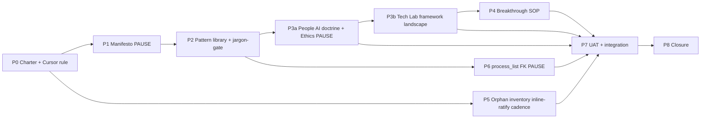

# I79 — Holistika People Manifesto + Knowledge Hygiene + Cross-area Design Patterns + AI Governance

> **Status: active (P0 ratified 2026-05-15).** Charter-satisfies-gate posture (identical reasoning to I73 D-IH-73-B). Workspace mirror of authoritative Cursor plan; this file is the git collaboration surface for phase ordering + dependencies + sync rule. Cursor plan holds expanded prose.

## Authoritative plan link

[`~/.cursor/plans/i79_people_doctrine_4e309f45.plan.md`](file:///~/.cursor/plans/i79_people_doctrine_4e309f45.plan.md) — read end-to-end before working any I79 phase. The Cursor plan is the SSOT for execution detail; this `master-roadmap.md` mirrors phase ordering + dependencies + decisions only.

## Lineage (why I79 follows I73)

I73 (closed 2026-05-15 per `D-IH-73-CLOSURE`) acted at the **operational layer**: engagement-model registry, lifecycle SOPs, KB-readability charter, methodology IP minting path. **I79 acts at the doctrinal layer**: manifesto + agentic doctrine + cross-area design pattern library + AI governance split + vault hygiene + jargon-discipline.

I73's [`ENGAGEMENT_MODEL_REGISTRY.csv`](../../../references/hlk/v3.0/Admin/O5-1/People/People%20Operations/canonicals/dimensions/ENGAGEMENT_MODEL_REGISTRY.csv) is a People dimension. I79's [`PEOPLE_DESIGN_PATTERN_REGISTRY.csv`](../../../references/hlk/v3.0/Admin/O5-1/People/Compliance/canonicals/dimensions/PEOPLE_DESIGN_PATTERN_REGISTRY.csv) makes any area's process **declare which People pattern parents it** (process_list 8th col `inherited_pattern_id`) — that's process-singularity made countable. I79 also mints the **anti-jargon drift gate** that enforces clarity mechanically.

## Operating story (the operator's CPO frame, condensed)

> *Holistik means achieving singularity at least process-wise, holistikally. We compress and categorize info in a way one would remember. From CORPINT we set to create a self-governable company if one knows its KB entirely; if they have capacity to anchor more people, it's ok if those new people only know their part — provided one knows exactly what that part means. That makes knowledge scalable.*
>
> *People is the discipline of disciplines: we give consulting design patterns to other areas; they author their own processes. People supports them when a breakthrough comes. KB-accessibility is People's responsibility across every role. Our KB infrastructure is agnostic by design — Obsidian-compatible, embedder-agnostic, transformer-agnostic, ERP-transformable.*
>
> *AI governance is a People sub-discipline. Agentic is itself a discipline of disciplines (recursive). The technical sub-disciplines are owned by Tech Lab. People's job is to drive process singularity by fighting through jargon-minefields until everything reads as simple, actionable, shareable, democratic, friendly. People gives proper directives to Research / Tech Lab / any other area.*

## Phase dependency chain (narrative)

- **P0 → P1**: Charter ratifies architecture + decisions + Cursor rule. P1 lands manifesto canonical (PAUSE for AL5 review).
- **P1 → P2**: Pattern library (CSV + MD + Pydantic + validator + anti-jargon drift gate + Supabase mirror).
- **P2 → P3a**: Strand C-People AI doctrine + ops + Ethics anchor (PAUSE — Ethics canonical mint). Drift gate must pass.
- **P3a → P3b**: Strand C-Tech-Lab framework landscape + agent-infra SOP. Tech Lab canonicals carry framework jargon legitimately.
- **P3b → P4**: Cross-area breakthrough-escalation SOP + paired runbook (with Tech Lab pingback when AGENTIC_DOCTRINE row touched).
- **P0 → P5 (parallel)**: Orphan inventory across all 7 doc trees — case-by-case inline-ratify housekeeping. PAUSE only if any DELETE approved.
- **P2 → P6**: process_list canonical schema extension (8th col `inherited_pattern_id` FK) + seeded FKs. PAUSE — canonical CSV gate.
- **P3a + P3b + P4 + P5 + P6 → P7**: UAT + integration verification. Madeira knowledge-test + jargon-scan green + landscape audit green.
- **P7 → P8**: Closure — `D-IH-79-CLOSURE`; INITIATIVE_REGISTRY status=closed; all `OPS-79-*` rows closed; dep map sync.

## Phase dependency diagram

## Phase at a glance

| Phase | Title | Strand | Pause class | Closes OPS | Status |
|:---|:---|:---:|:---|:---:|:---|
| **P0** | Charter + Cursor rule + dep-map sync | — | standard | — | **SHIPPED** (this commit) |
| **P1** | Strand A Manifesto canonical (`HOLISTIKA_ORGANISING_DOCTRINE.md`) | A | manifest publish gate | OPS-79-1 | pending |
| **P2** | Strand B Pattern library (CSV + MD + Pydantic + validator + jargon-scan + Supabase mirror) | B | standard | OPS-79-2 | pending |
| **P3a** | Strand C-People AI doctrine + ops + Ethics anchor | C-People | Ethics-anchor canonical gate | OPS-79-3 | pending |
| **P3b** | Strand C-Tech-Lab framework landscape + infra SOP | C-Tech-Lab | standard | OPS-79-4 | pending |
| **P4** | Strand D Cross-area breakthrough-escalation SOP + paired runbook | D | standard | OPS-79-5 | **SHIPPED** `79149f6` |
| **P5** | Strand E Orphan inventory across 7 trees + per-cluster inline-ratify housekeeping | E | only-on-deletes | OPS-79-6 | **SHIPPED** `55bfaed` (cluster A deletes) + `c0c74d0` (cluster B RESERVED-marks) + `0501420` (cluster C bookmarks + index.md SSOT rewrite) + `83ac4f1` (cluster D closure) |
| **P6** | Strand F process_list 8th col `inherited_pattern_id` mint + seeded FKs | F | canonical CSV gate (inline-ratify replaces real-stop pause) | OPS-79-7 + OPS-79-8 | **SHIPPED** `38256cb` (schema + Pydantic + validator + Supabase migration) + `68dcc3f` (wave 1: 15 FK seeds) + `cb4d7cc` (wave 2: 9 additional FK seeds + D-IH-79-R doctrinal framing call) + closure (this commit) |
| **P7** | UAT (Madeira knowledge-test + jargon-scan + landscape audit) + integration verification | — | standard | OPS-79-9 | pending |
| **P8** | Closure — D-IH-79-CLOSURE; registry flip; dep map sync | — | closure gate | OPS-79-10 | pending |

The Cursor plan §"Phase scaffold" has the full SCOPE / PREREQUISITES / DELIVERABLES / VERIFICATION / pause-point class / self-checkpoint count / cursor-rules adherence per phase.

## PAUSE points (5 declared upfront)

1. **P1 manifest publish** — operator AL5 review of `HOLISTIKA_ORGANISING_DOCTRINE.md`.
2. **P3a Ethics anchor canonical mint** — `ETHICAL_AGENTIC_BOUNDARIES.md` cross-sub-area gate.
3. **P5 orphan-housekeeping deletes** — only fires if any cluster approved for deletion (per D-IH-79-J case-by-case posture).
4. **P6 process_list canonical schema extension** — 8th col `inherited_pattern_id` mint + seeded FKs (canonical CSV gate per `akos-governance-remediation.mdc`).
5. **P8 closure pause record** — initiative-close gate per `akos-agent-checkpoint-discipline.mdc`.

## Sync rule

When the Cursor plan's phased execution changes (phase added, dependency redrawn, deliverables shift), **update this `master-roadmap.md` accordingly** per [`akos-planning-traceability.mdc`](../../../../.cursor/rules/akos-planning-traceability.mdc) §"`master-roadmap.md` contents". This file is the git-collaboration surface; the Cursor plan is the SSOT for execution detail. They must agree on phase ordering + dependencies + pause-point classification.

## Cross-references

- Authoritative Cursor plan: [`~/.cursor/plans/i79_people_doctrine_4e309f45.plan.md`](file:///~/.cursor/plans/i79_people_doctrine_4e309f45.plan.md).
- P0 charter report: [`reports/p0-charter-report.md`](reports/p0-charter-report.md).
- Decision log: [`decision-log.md`](decision-log.md).
- Risk register: [`risk-register.md`](risk-register.md).
- Files-modified CSV: [`files-modified.csv`](files-modified.csv).
- Lineage (closed): [I73 master-roadmap](../73-people-operations-and-learning-curriculum/master-roadmap.md) + `D-IH-73-CLOSURE`.
- Compendium appendix: [`docs/wip/planning/_templates/PLANNING_COMPENDIUM.md`](../_templates/PLANNING_COMPENDIUM.md) — to be extended with §11.10 sub-section at P0.
- Dep map: [`docs/wip/planning/_templates/INITIATIVE_DEPENDENCIES.md`](../_templates/INITIATIVE_DEPENDENCIES.md) — synced at P0 (i73 → i79 hard-block edge added).
- New Cursor rule: [`.cursor/rules/akos-people-discipline-of-disciplines.mdc`](../../../.cursor/rules/akos-people-discipline-of-disciplines.mdc) — always-applied; ratified at P0.
