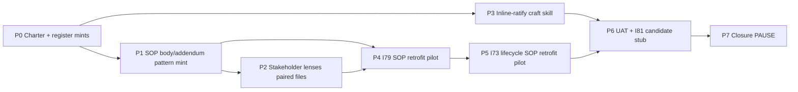

# I80 — I79 Lessons-Learned (SOP Body/Addendum Pattern + Stakeholder Lenses + Inline-Ratify Craft Skill)

> **Status: active (P0 ratified 2026-05-16).** Charter-satisfies-gate posture (inherits I79 D-IH-79-A precedent which itself inherited I73 D-IH-73-B). Three-track lessons-learned initiative absorbing the polish + meta-discipline rollup that surfaced at I79 closure. Compact: 8 phases, ~3-4 calendar days, single PAUSE point at closure.

## Lineage (why I80 follows I79)

I79 closed at the doctrinal layer (manifesto + pattern library + agentic governance triangle + cross-area breakthrough propagation + orphan hygiene + process-singularity FK lever). At closure, the operator surfaced three lessons-learned worth codifying:

1. **SOPs should read like the manifesto reads** — plain-language, executor-empowering, end-to-end actionable. Where I79 SOPs loaded cross-area jargon into the body, the executor pays a comprehension tax. The operator-introduced **addendum** concept solves this: SOP body habilitates the executor; addendum carries supporting context (cross-area jargon, validator details, system-owner audit material) without polluting the executor's reading path.
2. **Stakeholder lenses are evergreen** — the 7-perspective onboarding/positioning material the agent surfaced post-closure deserves canonical mint, not chat-buffer ephemerality.
3. **Inline-ratify question craft is teachable** — the AskQuestion authoring quality the agent demonstrated at I79 (option rationale embedded inline; recommended defaults marked; evidence cited; novel framings that helped the operator brainstorm) should be transmitted to other agents via a Cursor skill, not stay tacit.

I80 packages all three as a small charter-satisfies-gate initiative with **DAMA-DMBOK 2.0 alignment as a doctrinal thread** running through every architectural decision.

## Operating story (the operator's framing, condensed)

> *I'd like the SOPs to be like that [as clear as the new .md and the index]. It's our responsibility to make sure people understand what they read. But I understand why we both went technical when authoring each of them, but maybe that's why I invented the concept of addendum — to add extra documentation that is extra not because it's not relevant but because the goal of an SOP is to habilitate a person to execute the process e2e with the relevant context and all, but all the supporting documentation can very well go into addendum. That way we can keep the extreme jargon weave in some SOPs out of the way, at least when it's jargon of another area of course. Each area must speak their own jargon, that's ok. Data speaks data, tech speaks tech, finances the same, and people are plain terms because it's people.*
>
> *I'd like you to help other agents nail [inline AskQuestion craft] like you did. They were extremely helpful and even helped me brainstorm a lot — it was like advancing 3 months of me + Mark-II in a single initiative.*

The DAMA-readiness directive rides through all three tracks: paired-file-by-default for SOPs (D-IH-80-B), paired-file for lenses (D-IH-80-C), and `*.addendum.md` glob exclusion in the jargon-gate (D-IH-80-F) — together they make every canonical a discrete metadata-row consumable by KM systems (Supabase mirror / Neo4j projection / Obsidian vault / RAG pipelines / ERP panel filters / future external KM consumers) without parsing markdown structure.

## Phase dependency chain (narrative)

- **P0 → P1**: Charter ratifies architecture + decisions. P1 mints the SOP body/addendum pattern (registry row + library narrative + SOP-META extension + jargon-gate refinement). The pattern must exist before it can be instantiated.
- **P1 → P2**: Stakeholder lenses paired-files (the **first instantiation** of the new pattern; demonstrates the architecture works). Agent reflection report.
- **P0 → P3 (parallel with P1)**: Inline-ratify craft skill + Cursor rule extension. Independent of the SOP-addendum work.
- **P1 + P2 → P4**: I79 SOP retrofit pilot (3 files; demonstrates the pattern on I79 SOPs that surfaced the lesson).
- **P4 → P5**: I73 lifecycle SOP retrofit pilot (5 files; demonstrates DAMA-readiness at scale per operator Option B+C directive).
- **P3 + P5 → P6**: UAT + integration verification + I81 candidate stub for full-vault retrofit.
- **P6 → P7**: Closure — `D-IH-80-CLOSURE`; INITIATIVE_REGISTRY status=closed; OPS-80-* closed; dep map sync; closure pause record per `akos-agent-checkpoint-discipline.mdc`.

## Phase dependency diagram

## Phase at a glance

| Phase | Title | Track | Pause class | Closes OPS | Status |
|:---|:---|:---:|:---|:---:|:---|
| **P0** | Charter + register mints + dep map sync | — | standard | — | **SHIPPED** (this commit) |
| **P1** | Track 2 SOP body/addendum pattern mint (registry + library + SOP-META + jargon-gate refinement) | 2 | standard | OPS-80-1 | pending |
| **P2** | Track 1 Stakeholder lenses paired files + agent reflection (first instantiation of pattern) | 1 | standard | OPS-80-2 | pending |
| **P3** | Track 3 Inline-ratify craft skill + Cursor rule extension | 3 | standard | OPS-80-3 | pending |
| **P4** | I79 SOP retrofit pilot (3 files) | retrofit | standard | OPS-80-4 | pending |
| **P5** | I73 lifecycle SOP retrofit pilot (5 files; DAMA-readiness demonstration) | retrofit | standard | OPS-80-5 | pending |
| **P6** | UAT + integration verification + I81 candidate stub (full-vault retrofit forward-charter) | — | standard | OPS-80-6 | pending |
| **P6.5** | KNOWLEDGE_PAIRING_REGISTRY.csv mint (per `D-IH-80-H`) — documentation-relationship registry for DAMA + SSOT + mirror + hlk-erp + AI Archivist scope; inserted between P6 and P7 per operator inline-ratify Round 9 | mint | standard | OPS-80-8 | pending |
| **P7** | Closure — D-IH-80-CLOSURE; registry flip; dep map sync; closure pause record; I82 + I83 candidate stubs (capability commercial readiness doctrine + AI Archivist forward-charter) | — | closure gate | OPS-80-7 | pending |

## PAUSE points

1. **P7 closure pause record** — initiative-close gate per `akos-agent-checkpoint-discipline.mdc`. Single PAUSE for the whole initiative because (a) charter-satisfies-gate inherits from I79 / I73, (b) no canonical CSV gate touches `process_list.csv` or `baseline_organisation.csv` substantively (P2 appends one process row for stakeholder lenses review cadence; that's a single-row addition, not a tranche), (c) no trademark filings, (d) no public-prose publish, (e) the pattern mint (P1) is registry-internal and validated mechanically.

Inline-ratify gates may fire during P5 (which 5 of the I73 lifecycle SOPs have addendum-worthy content; how to split per-SOP body vs addendum content) and P6 (I81 candidate stub scope — continuous initiative vs concrete future I-NN), per `akos-inline-ratification.mdc` Round 5 worked-example posture.

## Decisions encoded (preview)

| ID | Question | Owner | Status | Close-out phase |
|:---|:---|:---|:---|:---|
| **D-IH-80-A** | Mega-charter scope — 3-track lessons-learned absorption (SOP body/addendum + stakeholder lenses + inline-ratify craft) | Founder | Active | P0 (this commit) |
| **D-IH-80-B** | SOP body/addendum naming — paired-file default for DAMA-readiness | People Operations Manager | Active | P0 (this commit); operationalised P1 |
| **D-IH-80-C** | Stakeholder lenses shape — paired-files (body level 4 + addendum level 5) | People Operations Manager | Active | P0 (this commit); operationalised P2 |
| **D-IH-80-D** | Retrofit scope — I80 pilots Option B (8 SOPs); Option C forward-chartered to I81 | PMO | Active | P0 (this commit); pilots P4+P5; forward-charter P6 |
| **D-IH-80-E** | Inline-ratify craft skill home — .cursor/skills/inline-ratify-craft/ + rule extension | System Owner | Active | P0 (this commit); operationalised P3 |
| **D-IH-80-F** | Jargon-gate refinement — `*.addendum.md` glob exclusion (DAMA Data Integration alignment) | System Owner | Active | P0 (this commit); operationalised P1 |
| **D-IH-80-G** | Pattern_class taxonomy extension — `documentation_layering` as 11th class | People Operations Manager | Active | P0 (this commit); operationalised P1 |
| **D-IH-80-H** | KNOWLEDGE_PAIRING_REGISTRY.csv mint — documentation-relationship registry (paired-file / index / doctrine-companion governance for DAMA + SSOT + mirror + hlk-erp + AI Archivist scope) | People Operations Manager | Active | P6.5 (operator inline-ratify Round 9; 2026-05-16) |
| **D-IH-80-CLOSURE** | Initiative closure | PMO | (pending) | P7 |

## Risks (preview)

| ID | Risk | Likelihood | Impact | Mitigation |
|:---|:---|:---:|:---:|:---|
| **R-IH-80-1** | Retrofit body/addendum split judgement varies per agent — different agents extract different sections to addendum | Medium | Low | Codify in SOP-META extension at P1 with a 5-row rubric (executor-context-vs-supporting-context test); single agent lands all P4+P5 retrofits in one session |
| **R-IH-80-2** | Stakeholder lenses become stale if not reviewed at funding rounds / role activations / regulatory submissions | Medium | Medium | Annual scheduled cadence + event_triggered review at major company state changes; process_list row at P2 binds the cadence |
| **R-IH-80-3** | Inline-ratify craft skill not discovered by other agents (skills require trigger-recognition) | Medium | Medium | Cursor rule extension at P3 cross-references the skill; agents authoring AskQuestion encounter the rule first; skill description has strong trigger words |
| **R-IH-80-4** | Paired-file convention adds file-count overhead some agents/operators dislike | Low | Low | SOP-META permits single-file degenerate case; paired-file is default but not mandate; addendum stays optional when SOP body is fully self-sufficient |
| **R-IH-80-5** | Full-vault retrofit (I81) never executes — backlog grows | Medium | Medium | I81 candidate stub at P6 as continuous initiative posture (like I01 AKOS Full Roadmap); each SOP review cadence absorbs retrofit naturally over 6-12 months |
| **R-IH-80-6** | Addendum register frontmatter confusion when paired-file body and addendum diverge in `last_review` / `last_review_decision_id` | Low | Low | Validator extension at P1 emits an info-level warning when paired files have divergent frontmatter beyond access_level / classification — operator review, not a failure |
| **R-IH-80-7** | Cursor skills evolve faster than docs (skills are agent-side platform feature) | Low | Low | Skill format follows current Cursor SDK skill SKILL.md spec; reviewable per Cursor SDK release; non-blocking for I80 closure |

## Sync rule

When phased execution changes (phase added, dependency redrawn, deliverables shift), update this `master-roadmap.md` accordingly per [`akos-planning-traceability.mdc`](../../../../.cursor/rules/akos-planning-traceability.mdc) §"`master-roadmap.md` contents". For I80 the master-roadmap is **authoritative** (no out-of-repo Cursor plan companion); the in-repo single-source contract makes the small-initiative posture explicit.

## Cross-references

- I79 closure precedent: [`../79-people-manifesto-and-pattern-library/master-roadmap.md`](../79-people-manifesto-and-pattern-library/master-roadmap.md) + `D-IH-79-CLOSURE` + closure pause record.
- I73 lineage (retrofit pilot scope at P5): [`../73-people-operations-and-learning-curriculum/master-roadmap.md`](../73-people-operations-and-learning-curriculum/master-roadmap.md).
- DAMA-DMBOK 2.0 alignment: per [`akos-executable-process-catalog.mdc`](../../../.cursor/rules/akos-executable-process-catalog.mdc) §Rule 4.
- Plan-quality bar: per [`akos-planning-traceability.mdc`](../../../.cursor/rules/akos-planning-traceability.mdc) §"Plan-quality bar (I66 / I68 precedent; mandatory for execution-grade Cursor plans)".
- Inline-ratify pattern: per [`akos-inline-ratification.mdc`](../../../.cursor/rules/akos-inline-ratification.mdc).
- Operator pause-record contract: per [`akos-agent-checkpoint-discipline.mdc`](../../../.cursor/rules/akos-agent-checkpoint-discipline.mdc).
- P0 charter report: [`reports/p0-charter-report.md`](reports/p0-charter-report.md).
- Decision log: [`decision-log.md`](decision-log.md).
- Risk register: [`risk-register.md`](risk-register.md).
- Files-modified CSV: [`files-modified.csv`](files-modified.csv).
