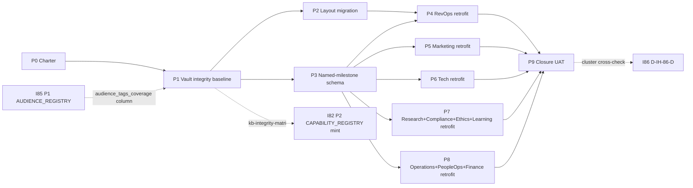

# I81 — Vault integrity sweep + layout migration + named-milestone schema + SOP body/addendum retrofit

> **Promoted candidate → active on 2026-05-16** under [I86 — Initiative Cluster Execution Coordinator](../86-initiative-cluster-execution-coordinator/master-roadmap.md) Wave 1. Promoted to advance vault-and-planning-surface integrity foundations that downstream I82+I83 build on. Full operating story + 4-quadrant scope + 10 candidate conundrums in [`_candidates/i81-full-vault-sop-addendum-retrofit.md`](../_candidates/i81-full-vault-sop-addendum-retrofit.md).

## 1. Operating story (one-paragraph synthesis)

The vault has substrate (SOPs + addenda + canonicals + pairing registry + validators) but lacks an **evidence baseline** that proves end-to-end integrity. Three foundation layers need parity: **vault integrity** (every `process_list.csv` executable row resolves to a real SOP + paired addendum + runbook + KNOWLEDGE_PAIRING row + mirror coverage), **planning-surface integrity** (cross-initiative references use FK-resolved named milestones instead of fragile `I82 P2`-style magic numbers), and **layout legibility** (legacy Compliance canonicals migrate from cramped root into Initiative 22 forward layout — `dimensions/` / `advops/` / `finops/` / `techops/`). After foundations, ~40 remaining SOPs (4 strands) get the I80 `pattern_sop_addendum_split` retrofit. I81 absorbs the I80 P6 forward-charter + operator's 2026-05-16 dual directive (vault integrity sprint + Wave 2 planning-surface integrity).

## 2. Charter decisions ratified at P0 (agent-default; operator skip 2026-05-16)

| ID | Question | Verdict | Source |
|:---|:---|:---|:---|
| **D-IH-81-A** | Retrofit mode (continuous vs absorbed) | **Absorbed** — per-area quarterly cadence; less context-switch; aligns with how each area already reviews its canonicals. P4-P8 schedulable in parallel waves vs forced linear. | `agent_inline_default` |
| **D-IH-81-B** | No-addendum-needed threshold | **Heuristic**: body word-count ≥ 600 OR cross-area integration count ≥ 2 → addendum recommended. Below: body-only acceptable; record `addendum_needed: false` in retrofit log. Per-pair author judgement is final. | `agent_inline_default` |
| **D-IH-81-C** | Author posture (role_owner vs single-agent batch) | **Each area's `role_owner` with agent assistance** — preserves register-discipline expertise per area; agent does the mechanical scaffolding; role_owner reviews + signs off. | `agent_inline_default` |
| **D-IH-81-E** | Per-area register-specific jargon-scan extension | **Out-of-scope for I81** — per-area register-jargon is legitimate (Tech speaks tech; Marketing speaks brand-voice). Logged as future-gate candidate line item in P1 integrity report; no validator extension this run. | `agent_inline_default` |
| **D-IH-81-H** | Named-milestone schema vocabulary | **`<I_ID>-<PURPOSE_SLUG>`** format — `INITIATIVE_ID` matches `^I\d{2,3}$`; `PURPOSE_SLUG` is `UPPER-KEBAB-CASE`, ≤ 6 hyphenated tokens, semantically meaningful. Frontmatter `milestones:` array carries `id`, `phase`, `purpose`, `status`. Body headers retain `## P<N> — <name>` AND add `(milestone: I<NN>-<SLUG>)` parenthetical. Finalised at P3 if migration reveals corner cases. | `agent_inline_default` |

**Deferred decisions** (close at later phases):

- **D-IH-81-D** — Forward-extension to non-SOP canonicals → P9 closure stub.
- ~~**D-IH-81-F** — Integrity matrix methodology + PASS threshold → P1 close.~~ **Ratified at P1 close (2026-05-19; Wave H lane-2)** — 5-signal model + 95% threshold per [`reports/2026-05-19-p1-closure.md`](reports/2026-05-19-p1-closure.md) §2.1; threshold NOT enforced at P1 baseline (CI INFO advisory), strict promotion gated at P9 closure UAT.
- ~~**D-IH-81-G** — Layout migration wave plan + deprecation-alias policy → P2 close.~~ **Closed at P2 (2026-05-23; Wave R Lane D Bundle D)** — five tranches executed T5→T4→T1→T2→T3 under umbrella D-IH-81-G; per-tranche closure decisions D-IH-81-L/M/Q/R/S; deprecation-alias one-cycle policy exercised; I81 P2 **5-of-5 COMPLETE**. See [`decision-log.md`](decision-log.md) §D-IH-81-S + [`files-modified.csv`](files-modified.csv) P2-T* rows.
- **D-IH-81-I** — Validator wiring scope + strictness → P3 close.
- **D-IH-81-J** — Closed-initiative frozen-reference policy → P3 close.
- **D-IH-81-K (NEW)** — I81 P1 phase ratification (Wave H lane-2 closure; execution class) → ratified at this commit per [`reports/2026-05-19-p1-closure.md`](reports/2026-05-19-p1-closure.md) §1.

## 3. Phase shape

| Phase | Milestone | Effort | Deliverable | Gate |
|:---|:---|:---|:---|:---|
| **P0 — Charter** (this commit) | I81-CHARTER | 0.5d | Folder + 6 planning files + INIT/DEC/OPS rows + INITIATIVE_DEPENDENCIES + planning README update | inline-ratify |
| **P1 — Vault integrity baseline** | I81-VAULT-INTEGRITY-BASELINE | 1-3d | `reports/i81/kb-integrity-audit-<date>.md` + `reports/i81/kb-integrity-matrix-<date>.csv` (one row per `process_list.csv` executable row; columns include `audience_tags_coverage` consuming I85 P1 output) + KNOWLEDGE_PAIRING gap register + mirror-emit coverage checklist | inline-ratify (D-IH-81-F close) |
| **P2 — Compliance layout migration** ✅ | I81-LAYOUT-MIGRATION | 3-10d (5 tranches) | T5 techops/COMPONENT_SERVICE_MATRIX + T4 dimensions/GOI_POI + T1 finops/COUNTERPARTY + T2 advops/ADVISER_* paired + T3 advops/FILED_INSTRUMENTS full cascade rename; Bundle D atomic commits `07ebb38`+`d4521ab`; `validate_hlk.py` GREEN | **CLOSED 2026-05-23** (D-IH-81-S; operator gates per tranche satisfied) |
| **P3 — Named-milestone schema + class-B validator** | I81-NAMED-MILESTONE-SCHEMA | 0.5-1d | `akos/hlk_planning_milestone.py` Pydantic SSOT + `scripts/validate_planning_cross_refs.py` + `tests/test_planning_cross_refs.py` + class-B regression sweep report; migrate active candidates + dep map + active master-roadmaps to named milestones (Wave 1 + 2 + 3); wire validator into `validate_hlk.py` + `release-gate.py` + `pre_commit` profile; extend `.cursor/rules/akos-planning-traceability.mdc` §"Plan-quality bar" with named-milestone convention | inline-ratify (D-IH-81-I + D-IH-81-J close) |
| **P4 — RevOps retrofit** | I81-REVOPS-RETROFIT | 2-3d | 9 RevOps SOPs body/addendum retrofit per `pattern_sop_addendum_split` | per-pair author |
| **P5 — Marketing retrofit** | I81-MARKETING-RETROFIT | 1-2d | ~6 Marketing SOPs retrofit (Reach + Brand + Storytelling) | per-pair author |
| **P6 — Tech retrofit** | I81-TECH-RETROFIT | 1-2d | ~8 Tech Lab + System Owner SOPs retrofit | per-pair author |
| **P7 — Research + Compliance + Ethics + Learning retrofit** | I81-RESEARCH-COMPLIANCE-RETROFIT | 1-2d | ~8 SOPs retrofit | per-pair author |
| **P8 — Operations remainder + People Ops + Finance retrofit** | I81-OPERATIONS-FINANCE-RETROFIT | 1-2d | ~6 SOPs retrofit | per-pair author |
| **P9 — Closing UAT + closure** | I81-CLOSURE | 0.5d | Integrity regression GREEN + spot-check DQ rows + mirror smoke + named-milestone validator GREEN on full active surface + INITIATIVE closure + successor stub (optional dimensional-registry retrofit) | operator approval |
| **Total** | | **~10-25d** (continuous) **or absorbed** | | |

## 4. Phase-dependency diagram

## 5. Wiring (cross-initiative dependencies)

| Inter-initiative wire | Direction | Realisation |
|:---|:---|:---|
| **I85 P1 → I81 P1** | `audience_tags_coverage` column flows into `kb-integrity-matrix-<date>.csv` | Column added by I81 P1 after I85 P1 mint (shipped under SHA `7d47199` 2026-05-16) |
| **I81 P1 → I82 P2** | Integrity-matrix evidence feeds CAPABILITY_REGISTRY mint anchors | Per I82 candidate §3 dependency (D-IH-82-PREREQ closes at I82 P2 entrance) |
| **I81 P3 → all future plans** | Named-milestone schema becomes inherited default | `.cursor/rules/akos-planning-traceability.mdc` extension at P3 close |
| **I81 P2 → hlk-erp** | Layout migration touches consumer paths | Cross-repo schema propagation SOP per tranche; hard `R-IH-81-7` mitigation |

## 6. Standing obligation — P1 observation cadence (continuous)

I81 stays **`active`** with P1 vault-integrity re-observation on the same rhythm as Quality Fabric field-test windows: **each I86 cluster wave-close** (minimum **quarterly** while initiative is open). Each observation ships paired artefacts under `reports/i81/`:

- `kb-integrity-audit-<YYYY-MM-DD>.md` — summary + gap signals
- `kb-integrity-matrix-<YYYY-MM-DD>.csv` — one row per executable `process_list` row

**OPS-81-1** remains the register anchor; `evidence_path` + `notes` carry the latest observation pointer. Pass-rate near zero is **expected** until audience-tag wire (I85) + P4–P8 SOP retrofits lift pairing coverage; trend matters more than absolute PASS at this stage.

| Observation date | Audit | Matrix | Pass rate | Notes |
|:---|:---|:---|---:|:---|
| 2026-05-19 | [`kb-integrity-audit-2026-05-19.md`](reports/i81/kb-integrity-audit-2026-05-19.md) | [`kb-integrity-matrix-2026-05-19.csv`](reports/i81/kb-integrity-matrix-2026-05-19.csv) | P1 baseline | D-IH-81-K close |
| 2026-05-27 | [`kb-integrity-audit-2026-05-27.md`](reports/i81/kb-integrity-audit-2026-05-27.md) | [`kb-integrity-matrix-2026-05-27.csv`](reports/i81/kb-integrity-matrix-2026-05-27.csv) | ~0% | Wave R+4 index drain |
| 2026-06-01 | [`kb-integrity-audit-2026-06-01.md`](reports/i81/kb-integrity-audit-2026-06-01.md) | [`kb-integrity-matrix-2026-06-01.csv`](reports/i81/kb-integrity-matrix-2026-06-01.csv) | 0.00% | Post–I90 P3b hygiene; 1100 executable rows |

Reproduce: `py scripts/audit_kb_integrity.py --emit-audit docs/wip/planning/81-vault-integrity-layout-milestones-retrofit/reports/i81/kb-integrity-audit-<date>.md`
| **I81 P9 → I86 D-IH-86-D** | Mechanical cluster cross-check on closure | Per I86 charter contract |

## 6. Asset classification (per [`PRECEDENCE.md`](../../../docs/references/hlk/v3.0/Admin/O5-1/People/Compliance/canonicals/PRECEDENCE.md))

- **Canonical** (P0): `INITIATIVE_REGISTRY.csv`, `DECISION_REGISTER.csv`, `OPS_REGISTER.csv` row appends.
- **Canonical modifications** (P2): legacy Compliance canonicals migrating to forward-layout subfolders; `PRECEDENCE.md` updates per tranche.
- **Canonical** (P3): `akos/hlk_planning_milestone.py` (Pydantic SSOT); `scripts/validate_planning_cross_refs.py`; cursor-rule extension to `akos-planning-traceability.mdc`.
- **Mirrored / derived**: `compliance.*_mirror` tables impacted by P2 path moves (per `sync_compliance_mirrors_from_csv.py` re-mapping).
- **Reference** (planning-internal): `reports/i81/kb-integrity-audit-*.md`, `reports/i81/kb-integrity-matrix-*.csv`, `reports/p3-class-b-regression-sweep-*.md`.
- **Engineering surface** (governed by [`CONTRIBUTING.md`](../../../CONTRIBUTING.md)): `akos/hlk_planning_milestone.py`, `scripts/validate_planning_cross_refs.py`, `tests/test_planning_cross_refs.py`.

## 7. Risk register (preview; full at [`risk-register.md`](risk-register.md))

| ID | Risk | L | I | Mitigation |
|:---|:---|:---:|:---:|:---|
| R-IH-81-1 | Retrofit fatigue if continuous mode chosen | M | M | D-IH-81-A defaults to absorbed mode |
| R-IH-81-6 | Integrity matrix becomes stale post-P1 | M | M | Quarterly reconciliation row assigned to PMO at P9 |
| R-IH-81-7 | Layout migration breaks sibling repo `hlk-erp` without coordinated PR | M | H | Cross-repo schema propagation SOP per tranche; hard checklist row |
| R-IH-81-8 | Named-milestone migration mid-flight breakage | M | M | C-81-9 explicit transition allowlist with empty P3-close gate; P3 ships before P4-P8 |
| R-IH-81-9 | Validator over-strict (false positives on prose mentions) | L | M | Validator scopes link targets + frontmatter + cross-ref paragraphs only; prose mentions warn-only |
| R-IH-81-10 | Closed-initiative frozen-reference policy mis-applied | L | M | D-IH-81-J ratifies policy; validator allowlist enforces; cursor-rule codifies for future authors |

## 8. Cross-references

- **Cluster coordinator**: [`86-initiative-cluster-execution-coordinator/master-roadmap.md`](../86-initiative-cluster-execution-coordinator/master-roadmap.md).
- **Candidate stub** (full expanded scope): [`_candidates/i81-full-vault-sop-addendum-retrofit.md`](../_candidates/i81-full-vault-sop-addendum-retrofit.md).
- **Parent**: [I80 P6 forward-charter](../80-i79-lessons-learned/master-roadmap.md) + [I80 P6 UAT](../80-i79-lessons-learned/reports/p6-uat-2026-05-16.md).
- **Siblings**:
  - **[I85 — Audience-tag canonicalization](../85-audience-tag-canonicalization/master-roadmap.md)** (forward-link `audience_tags_coverage` wire).
  - **[I82 — Capability Doctrine](../82-holistika-capability-doctrine-and-commercial-readiness/master-roadmap.md)** (downstream consumer of P1 integrity-matrix).
  - **[I83 — AI Archivist + KiRBe ingestor](../_candidates/i83-ai-archivist-and-kirbe-ingestor.md)** (forward consumer).
- **Pattern doctrine**: [`pattern_sop_addendum_split`](../../references/hlk/v3.0/Admin/O5-1/People/canonicals/PEOPLE_DESIGN_PATTERN_LIBRARY.md) (I80 P1).
- **Authoring contract**: [`SOP-META_PROCESS_MGMT_001.md`](../../references/hlk/v3.0/Admin/O5-1/People/Compliance/canonicals/SOP-META_PROCESS_MGMT_001.md) §"Body and Addendum split".
- **Forward layout**: [`canonicals/README.md`](../../references/hlk/v3.0/Admin/O5-1/People/Compliance/canonicals/README.md) (Initiative 22).
- **Decision log** (full rationale): [`decision-log.md`](decision-log.md).
- **Files modified** (per-commit traceability): [`files-modified.csv`](files-modified.csv).
- **Governing rules**: [`akos-planning-traceability.mdc`](../../../.cursor/rules/akos-planning-traceability.mdc) §"Plan-quality bar"; [`akos-governance-remediation.mdc`](../../../.cursor/rules/akos-governance-remediation.mdc) §"HLK compliance governance"; [`akos-holistika-operations.mdc`](../../../.cursor/rules/akos-holistika-operations.mdc).

## 9. Closure criteria

- All ten phases land per shape table (or are explicitly waived with logged decision).
- Vault-integrity matrix proves end-to-end `process_list.csv → SOP → addendum → runbook → KNOWLEDGE_PAIRING → mirror` resolution; PASS rate ≥ 95% with FAIL rows tracked as OPS rows.
- Legacy Compliance canonicals migrated to Initiative 22 forward layout (or operator-waived per tranche).
- `validate_planning_cross_refs.py` GREEN on full active planning surface; allowlist empty.
- ~40 remaining SOPs body/addendum retrofitted (or `addendum_needed: false` documented).
- `INIT-OPENCLAW_AKOS-81` flipped `active → closed`; closure UAT report dated under `reports/`.
- I86 D-IH-86-D mechanical cross-check PASS.
