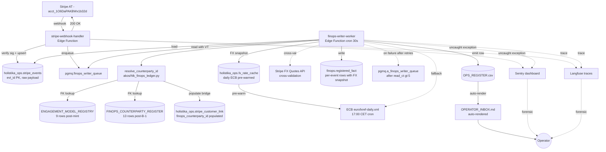

# I81 P2 Bundle B-2 — Monetary substrate architecture decisions (synthesis-before-tranche)

> Companion to [`p2-stripe-recon-2026-05-23.md`](p2-stripe-recon-2026-05-23.md). Per the `synthesis-before-tranche` pattern minted at Wave R Lane A (s6-d → 12th Quality Fabric specialty pending) and per `akos-applied-research-discipline.mdc` RULE 1 + RULE 2 (internal sweep + external research for novel framings). Operator's `b2-*` batch (2026-05-23) ratified 3 of 7 decisions clean and ratified the *direction* on 4 with explicit research-grounded craft requested. This report grounds those 4 in evidence, surfaces a refined inline-ratify batch, and proposes the file-by-file B-2 scope so operator can ratify the stand-up commit cleanly.

## §0 TL;DR table

| Decision | Operator answer (b2-*) | Status | Research-grounded craft (this report) |
|:---|:---|:---|:---|
| **A — write granularity** | `a1-per-event` | CLEAN | One `finops.registered_fact` row per Stripe event id; idempotency via `evt_id` UNIQUE. |
| **B — counterparty resolution** | "scalable; consultancy/SaaS strict (b2); RPP convenience auto (c-style); use our internal ENGAGEMENT_MODEL_REGISTRY" | CRAFTED | Engagement-model-aware router; 2 new engagement_models minted (`eng_model_saas_subscription` + `eng_model_rpp_vendor`); 4-class resolution table. |
| **C — currency strategy** | `c3-hybrid-snapshot` | CRAFTED | ECB daily reference rate authoritative; Stripe FX Quote captured at write time when applicable; corrected recon-report error (Stripe `Charge.exchange_rate` doesn't exist). |
| **D — Pydantic SSOT location** | `d1-finops-ledger` | CLEAN | New module `akos/hlk_finops_ledger.py` co-located with `finops.*` domain. |
| **E — retry posture** | `e3-DLQ` | CRAFTED | Two-layer pattern: raw `stripe_events` log (PK on `evt_id`) + Supabase-native `pgmq` queue with archive as DLQ; reconciliation runbook. |
| **F — signing secrets** | `f1-env-per-env` | CLEAN | `STRIPE_WEBHOOK_SECRET_TEST` + `STRIPE_WEBHOOK_SECRET_LIVE` in Supabase Edge Function secrets. |
| **G — observability** | "g4 properly governed via our ERP" | CRAFTED | All events converge in existing `OPERATOR_INBOX.md` via `OPS_REGISTER.csv` row emission; Sentry stays for uncaught exceptions; Langfuse stays for traces; **zero new observability surface — re-use what we built**. |

## §1 Operator framing (verbatim from b2-* batch, 2026-05-23)

- **B**: *"For consultancy, option B is good; for SaaS option B is good; for RPP convenience, C is good. So please craft something that can be scalable by researching internally and externally. I want to have all our OPS taken into account so that we don't have to do manual things, we're short on back office but we may do back office, and also there's our own internal X to take into account."*
- **C**: *"Option C, research internally and externally what's best to address open questions about conversion rate at write time."*
- **E**: *"I like option C [E3], do a regression over internet and/or data to craft this up."*
- **G**: *"Option D [G4] but properly governed for our convenience. We have the ERP for that and we did a lot of work already, we just need to keep building and rework what's there."*

## §2 Research grounding

### §2.1 Internal sweep (per RULE 1)

| Artifact | Bearing on decisions |
|:---|:---|
| [`ENGAGEMENT_MODEL_REGISTRY.csv`](../../../references/hlk/v3.0/Admin/O5-1/People/People%20Operations/canonicals/dimensions/ENGAGEMENT_MODEL_REGISTRY.csv) — 7 active models (`eng_model_hourly_consultant`, `eng_model_milestone_consultant`, `eng_model_percentage_collaborator`, `eng_model_apprentice_learner`, `eng_model_investor_advisor`, `eng_model_outsourced_helper`, `eng_model_operator_self`) | **B**: This IS the operator's "our own internal X". Resolution routes on `engagement_model_id` + `retribution_pattern`. 2 net-new models needed for B-2 scope. |
| [`OPS_REGISTER.csv`](../../../references/hlk/v3.0/Admin/O5-1/People/Compliance/canonicals/OPS_REGISTER.csv) + [`render_operator_inbox.py`](../../../../scripts/render_operator_inbox.py) → [`OPERATOR_INBOX.md`](../../OPERATOR_INBOX.md) | **G**: I59 P4 already minted the convergence surface. `OPS_REGISTER.csv` is SSOT; `OPERATOR_INBOX.md` auto-renders ranked by RICE. Status flips re-render automatically. B-2 emits OPS-19-* rows; no new surface. |
| [`stripe-webhook-handler/index.ts`](../../../../supabase/functions/stripe-webhook-handler/index.ts) — handles 13 event types; routes by `metadata.hlk_billing_plane` | **B + E**: handler already has the routing skeleton; B-2 extends with FINOPS branch + worker enqueue. |
| [`holistika_ops.stripe_customer_link`](../../../../supabase/migrations/20260423014144_i18_finops_counterparty_mirror_cutover.sql) carries `finops_counterparty_id TEXT` (added via `ADD COLUMN IF NOT EXISTS` at I18) | **B**: bridge column exists; just never populated. Resolution function populates on first webhook for a customer. |
| [`finops.registered_fact`](../../../../supabase/migrations/20260423014326_i19_finops_ledger_phase1.sql) DDL exists from I19 P1 (charter-only; never wrote) | **A + C + D**: schema is the target; B-2 mints the Pydantic + writer + 2 new columns (fx snapshot). |
| [`scripts/sync_compliance_mirrors_from_csv.py`](../../../../scripts/sync_compliance_mirrors_from_csv.py) pattern | **D**: validator pattern for `hlk_finops_ledger.py` — sibling of `hlk_finops_counterparty_csv.py`. |

### §2.2 External research (per RULE 2 — novel framings require external citation)

#### FX rate source-of-truth (C)

| Source | Finding | Citation |
|:---|:---|:---|
| **Stripe FX Quotes API** | `POST /v1/fx_quotes` returns `rates.<currency>.exchange_rate` (with FX fee) + `rate_details.reference_rate_provider` ("ecb") + `rate_details.reference_rate` (underlying ECB) + `rate_details.base_rate`. Free for `lock_duration:none`. **`Charge.exchange_rate` field does NOT exist** — recon report inaccuracy corrected here. | [Stripe Docs — FX Quotes API](https://docs.stripe.com/payments/currencies/localize-prices/fx-quotes-api) |
| **ECB Reference Rates** | European Central Bank publishes daily reference rates at ~16:00 CET; free + no-auth XML feed (`eurofxref-daily.xml`). Stripe's FX Quotes API uses ECB as the reference rate provider. | [ECB Reference Rates](https://www.ecb.europa.eu/stats/eurofxref/eurofxref-daily.xml) |
| **DAMA-DMBOK 2.0 Reference & Master Data Management** | Point-of-fact snapshotting is the canonical pattern for financial facts: capture the rate that was current at the moment the fact occurred; never recompute historical values against current rates. | DAMA-DMBOK 2.0 (2024 revision) Reference & Master Data Management chapter §"Temporal data + audit trails" |

**Conclusion**: ECB daily reference rate is the authoritative source-of-truth (matches Holistika's EU/Madeira geographic anchor; matches Stripe's own reference). Stripe FX Quote captured at webhook time provides cross-validation when present. Both stored in `finops.registered_fact` (`fx_rate_ecb` + `fx_rate_stripe` + `fx_source` enum).

#### Webhook DLQ pattern (E)

| Source | Finding | Citation |
|:---|:---|:---|
| **Stripe Docs — Webhook best practices** | Stripe retries failed webhooks (non-2xx response) with exponential backoff up to 72h. Stripe also recommends idempotency via event_id ("logging the event IDs you've processed"). Manual resend does NOT cancel automatic retry cycle — endpoint may receive duplicates. | [Stripe Docs — Webhooks](https://docs.stripe.com/webhooks) |
| **Industry consensus (DEV.to articles 2026)** | Two-layer pattern: (1) raw events table with `evt_id` PK + `onConflictDoNothing` for idempotency; (2) async worker queue with retry counter + DLQ archive after N attempts. Alert on DLQ growth (rate-based, not absolute). | [Webhook Retry Strategies 2026](https://dev.to/shotatanikawa/webhook-retry-strategies-2026-idempotency-backoff-dead-letters-1e71); [Stripe Webhooks Idempotency/Retries/Queue Setup](https://dev.to/iurii_rogulia/stripe-webhooks-idempotency-retries-and-queue-setup-33bf) |
| **Supabase Queues / `pgmq`** | Officially supported by Supabase (upstream: Tembo `pgmq` extension under OSI-compatible PostgreSQL license). SQS-API-parity: `send`, `read` (with visibility timeout), `archive`, `pop`. Per-message `read_ct` counter for retry tracking. `archive` is the DLQ pattern: failed messages moved out of active queue + retained for audit/replay. Native to Postgres — no external broker. | [Supabase Queues](https://supabase.com/docs/guides/queues); [pgmq Extension](https://supabase.com/docs/guides/queues/pgmq) |

**Conclusion**: Use Supabase `pgmq` extension. Matches "use what we built / Supabase-native" framing; no external broker dependency; gives us archive (DLQ) + retry counter + visibility window for free. Pattern:

```
stripe webhook → verify signature → INSERT INTO stripe_events ON CONFLICT (evt_id) DO NOTHING → pgmq.send('finops_writer_queue', event_id) → return 200
                                                                                                                                                  ↓
                                                                                              worker reads with VT → process → pgmq.delete (success) OR retry until read_ct > N → pgmq.archive (DLQ)
                                                                                                                                                                                       ↓
                                                                                                                                                                  OPERATOR_INBOX row emitted via OPS_REGISTER append
```

#### HLK-ERP observability convergence (G)

No external research needed — operator's framing IS the doctrine: re-use the existing OPERATOR_INBOX surface. Cross-references:

- `akos-planning-traceability.mdc` §"Per-initiative file-changes CSV" — every B-2 event that materially affects FINOPS state becomes a row trail; OPERATOR_INBOX is the operator-facing convergence point.
- `akos-quality-fabric.mdc` RULE 1 (5-axis resolution) — for J-OP audience class, OPERATOR_INBOX is the canonical render surface (J-OP is markdown-OK per `akos-external-render-discipline.mdc` RULE 2).

## §3 Refined architectural recommendations per decision

### §3.1 Decision B — engagement-model-aware counterparty resolution (CRAFTED)

**New engagement_models to mint** (2 rows added to `ENGAGEMENT_MODEL_REGISTRY.csv`; canonical-CSV gate per `akos-governance-remediation.mdc`):

| engagement_model_id | engagement_model_name | retribution_pattern | retribution_unit | payment_cadence | direction | counterparty_resolution_strategy |
|:---|:---|:---|:---|:---|:---|:---|
| `eng_model_saas_subscription` | SaaS Subscription Customer | saas_subscription | monthly_subscription | monthly_or_annual | INBOUND (customer pays Holistika) | HYBRID — auto-create FINOPS row from Stripe Customer metadata; route to quarantine partition; OPERATOR_INBOX raise for review-stamp before promotion to active |
| `eng_model_rpp_vendor` | Recurring-Payment-to-Provider Vendor | recurring_outbound | monthly_subscription | monthly_or_annual | OUTBOUND (Holistika pays vendor) | LOOKUP — FINOPS row pre-exists from Bundle B-1; resolve by stripe_customer_id (after first webhook) or org_name fuzzy match; populate `finops_counterparty_id` on `stripe_customer_link` |

**Resolution function** (`akos/hlk_finops_ledger.py:resolve_counterparty_id`):

```python
class CounterpartyResolutionStrategy(str, Enum):
    STRICT_REQUIRE_PREEXISTING = "strict"      # consultancy + investor: fail closed, quarantine
    HYBRID_AUTO_CREATE_REVIEW = "hybrid"       # SaaS subscription: auto-create + review-stamp gate
    LOOKUP_PREEXISTING = "lookup"              # RPP vendor: FK resolve from FINOPS_COUNTERPARTY_REGISTER
    DEFAULT_QUARANTINE = "default_quarantine"  # missing metadata: quarantine + OPERATOR_INBOX raise

def resolve_counterparty_id(
    stripe_event: dict,
    billing_plane: str | None,          # metadata.hlk_billing_plane: "kirbe" / "holistika_ops" / None
    engagement_model: str | None,       # metadata.hlk_engagement_model: FK to ENGAGEMENT_MODEL_REGISTRY
) -> tuple[str | None, CounterpartyResolutionStrategy]:
    """Returns (finops_counterparty_id_or_None, strategy_used)."""
    # Strategy table from §3.1
    ...
```

**Stripe metadata contract extension** — adds `hlk_engagement_model` field alongside existing `hlk_billing_plane`. Both must be set on Stripe Customer (or Subscription) for clean resolution; resolution defaults to `DEFAULT_QUARANTINE` if either is missing. Helper script `scripts/stripe_set_billing_plane.py` extends to set both atomically; new script `scripts/stripe_audit_metadata.py` flags Stripe customers with missing metadata for back-fill.

**Why this is scalable** (addressing operator's "scalable + don't waste time later" framing):

1. **Adding a new engagement_model class** = append 1 row to `ENGAGEMENT_MODEL_REGISTRY.csv` + 1 entry in `CounterpartyResolutionStrategy` enum. No webhook handler code change for the common case (3 strategies cover all envisioned classes).
2. **Adding a new counterparty in an existing class** = the resolution function does the right thing automatically; OPERATOR_INBOX surfaces the new row for review-stamp where the strategy demands it.
3. **Reverse-direction operations** (Holistika as Stripe Connect platform paying out — future case) = add `eng_model_connect_payee` row + `LOOKUP_OR_ENABLE_CONNECT` strategy when it lands; current architecture doesn't lock it out.
4. **Back-office burden** is bounded: review-stamp work fires only on first webhook for a new SaaS customer (one-time per customer); RPP vendor rows resolve silently; quarantine partition is the safety net for misconfigured metadata.

### §3.2 Decision C — FX rate source-of-truth (CRAFTED)

**Correction to recon report**: §3 of `p2-stripe-recon-2026-05-23.md` referenced Stripe `Charge.exchange_rate` field; this field **does not exist** on Charge per Stripe API reference. Apologies for the inaccuracy.

**Refined architecture**:

| Column added to `finops.registered_fact` | Source | Notes |
|:---|:---|:---|
| `currency` | Stripe event payload | 3-letter ISO 4217 lowercase per Stripe convention |
| `amount_minor` | Stripe event payload | integer cents/centavos/yen per ISO 4217 minor-unit |
| `amount_minor_eur` | Computed at write time | snapshot in EUR using `fx_rate_ecb` (or `fx_rate_stripe` when present); equals `amount_minor` when currency=='eur' |
| `fx_rate_ecb` | ECB eurofxref-daily.xml | DECIMAL(18,8) — fetched at write time + cached per-day in `holistika_ops.fx_rate_cache` (NEW table; 1-row-per-currency-per-day) |
| `fx_rate_stripe` | Stripe FX Quotes API (when `lock_duration:none` call succeeds within webhook handler latency budget) | DECIMAL(18,8) — captured for cross-validation; NULL when Stripe call skipped or timed out |
| `fx_source` | Pydantic enum | `'ecb_daily'` (default) / `'stripe_fx_quote'` / `'native_eur_no_conversion'` |

**`holistika_ops.fx_rate_cache` table** (NEW; minted in same migration as `finops.registered_fact` Phase 2 expansion):

```sql
CREATE TABLE holistika_ops.fx_rate_cache (
    cache_date DATE NOT NULL,
    from_currency TEXT NOT NULL,
    to_currency TEXT NOT NULL DEFAULT 'eur',
    rate DECIMAL(18,8) NOT NULL,
    source TEXT NOT NULL,                -- 'ecb' / 'stripe_fx_quote' / 'manual'
    fetched_at TIMESTAMPTZ NOT NULL,
    PRIMARY KEY (cache_date, from_currency, to_currency, source)
);
```

**Daily ECB fetch** = scheduled Edge Function (`supabase/functions/fx-rate-cache-refresh/index.ts`) at 17:00 CET (1h after ECB publishes). Bulk-inserts daily rates for the ~30 currencies on the ECB list. Idempotent via PK. Pre-warms cache so webhook-time lookups are local.

**Webhook fallback ladder** (when ECB cache miss for the event's date):

1. Try `holistika_ops.fx_rate_cache` lookup for event date.
2. If miss → fetch ECB XML inline (timeout: 2s) → cache + use.
3. If ECB inline fetch fails → try Stripe FX Quote (`POST /v1/fx_quotes` with `lock_duration:none`; timeout: 1s).
4. If both fail → write `registered_fact` with `amount_minor_eur=NULL` + `fx_source='deferred_resolution'` + emit OPERATOR_INBOX row for back-fill.

### §3.3 Decision E — DLQ pattern with `pgmq` (CRAFTED)

**Two-layer pattern**:

**Layer 1 — Raw event log** (`holistika_ops.stripe_events` table; NEW):

```sql
CREATE TABLE holistika_ops.stripe_events (
    evt_id TEXT PRIMARY KEY,             -- Stripe event id "evt_*"; UNIQUE by construction
    event_type TEXT NOT NULL,            -- e.g., "invoice.paid", "subscription.created"
    livemode BOOLEAN NOT NULL,           -- false for AT (test), true for live
    payload JSONB NOT NULL,              -- raw event payload for replay
    received_at TIMESTAMPTZ NOT NULL DEFAULT NOW(),
    processed_at TIMESTAMPTZ,            -- NULL until worker processes
    processing_error TEXT                -- last error message if processing failed
);
```

Webhook handler writes here BEFORE enqueueing. `ON CONFLICT (evt_id) DO NOTHING` is the idempotency guard. Returns 200 to Stripe immediately after this insert.

**Layer 2 — Worker queue with archive-as-DLQ** (Supabase `pgmq` extension):

```sql
SELECT pgmq.create('finops_writer_queue');
-- on webhook (after stripe_events insert):
SELECT pgmq.send('finops_writer_queue', jsonb_build_object('evt_id', 'evt_xxx'), 0);
-- worker (cron-triggered Edge Function `finops-writer-worker` at 30s cadence):
SELECT * FROM pgmq.read('finops_writer_queue', vt:=60, qty:=10);
-- process: load full event from stripe_events; write to finops.registered_fact; pgmq.delete on success
-- on failure: NOT pgmq.delete; message becomes visible again after vt expires; read_ct increments
-- when read_ct > 5: pgmq.archive (moves to pgmq.a_finops_writer_queue) + emit OPS-19-N OPERATOR_INBOX row
```

**Worker process** (`supabase/functions/finops-writer-worker/index.ts`; NEW; scheduled via `pg_cron`):

```typescript
async function processFinopsWriterQueue() {
    const messages = await sb.rpc('pgmq.read', { queue_name: 'finops_writer_queue', vt: 60, qty: 10 });
    for (const msg of messages) {
        try {
            const event = await loadStripeEvent(msg.message.evt_id);
            const cpId = resolveCounterpartyId(event, ...);
            await writeRegisteredFact(event, cpId);
            await sb.rpc('pgmq.delete', { queue_name: 'finops_writer_queue', msg_id: msg.msg_id });
        } catch (err) {
            if (msg.read_ct > 5) {
                await sb.rpc('pgmq.archive', { queue_name: 'finops_writer_queue', msg_id: msg.msg_id });
                await emitOpsRegisterRow({
                    ops_action_id: `OPS-19-DLQ-${msg.message.evt_id}`,
                    owner_class: 'mixed',
                    owner_role: 'System Owner',
                    summary: `FINOPS writer DLQ: ${event.type} for ${cpId} — ${err.message}`,
                    linked_decision_ids: 'D-IH-81-W',
                });
            }
            // else: leave for next read; vt expires; retry
        }
    }
}
```

**Reconciliation runbook** (`scripts/finops_dlq_drain.py`; NEW):

```text
py scripts/finops_dlq_drain.py --inspect              # list DLQ archived messages with last error
py scripts/finops_dlq_drain.py --replay <evt_id>      # re-enqueue specific event for retry
py scripts/finops_dlq_drain.py --replay-all           # batch replay (after fixing root cause)
py scripts/finops_dlq_drain.py --reconcile <date>     # cross-check stripe_events vs registered_fact; surface gaps
```

### §3.4 Decision G — HLK-ERP convergence (CRAFTED)

**Surface re-use** — zero new observability surface:

| Event class | Routes to | Mechanism |
|:---|:---|:---|
| Counterparty quarantine (SaaS subscription needs review-stamp) | OPERATOR_INBOX | Webhook emits `OPS-19-QUARANTINE-<cust_id>` row; `owner_class=operator`; surfaces ranked by RICE |
| FX rate fetch failure (ECB + Stripe both timed out) | OPERATOR_INBOX | Worker emits `OPS-19-FX-DEFERRED-<evt_id>` row; `owner_class=mixed`; back-fill action |
| DLQ archive (worker failed N times) | OPERATOR_INBOX | Worker emits `OPS-19-DLQ-<evt_id>` row; `owner_class=mixed`; triage action |
| Reconciliation discrepancy (nightly cross-check stripe_events vs registered_fact) | OPERATOR_INBOX | Cron emits `OPS-19-RECONCILE-<date>` row; `owner_class=operator`; investigate gap |
| Uncaught exception in webhook handler or worker | Sentry (existing) | `class=platform` release format per `SENTRY_DASHBOARD_HOLISTIKA.md` |
| Per-webhook trace (debugging) | Langfuse (existing) | Trace ID per webhook invocation; spans for each substep |

**OPS_REGISTER row emission** — uses a new helper `akos/hlk_ops_register_emit.py`:

```python
def emit_ops_register_row(
    ops_action_id: str,
    owner_class: Literal['operator', 'mixed', 'agent'],
    owner_role: str,
    summary: str,
    linked_decision_ids: str,
    rice_score: int | None = None,
) -> None:
    """Append a row to OPS_REGISTER.csv via SQL (compliance.ops_register_mirror).
    Auto-triggers render_operator_inbox.py via Supabase webhook on mirror change.
    """
    ...
```

Routing is **synchronous** for operator-facing events (`emit_ops_register_row` inside the worker — fail-closed if it fails so the OPS row never gets lost). `OPERATOR_INBOX.md` re-renders within seconds of the OPS_REGISTER row landing (via `render_operator_inbox.py --check-only` in release-gate; the actual re-render is operator-discretion or cron at 5-min cadence per existing I59 P4 pattern).

**Cross-references** between observability surfaces:

- Every OPERATOR_INBOX row carries `linked_decision_ids` pointing back to `D-IH-81-W`.
- Sentry events tagged with `release=openclaw-akos@<sha>` carry `evt_id` in `extra` for cross-lookup.
- Langfuse traces tagged with `evt_id` + `finops_counterparty_id` for filtering.

Operator's "single triage surface" = OPERATOR_INBOX. Sentry + Langfuse are forensic; operator only opens them when an OPERATOR_INBOX row points to a deeper investigation.

## §4 End-to-end Bundle B-2 architecture (composed)



## §5 Bundle B-2 file-by-file deliverable inventory

**Supabase migrations** (1 new file):
- `supabase/migrations/20260524000000_i81_p2_b2_finops_writer_substrate.sql` — `holistika_ops.stripe_events` + `holistika_ops.fx_rate_cache` + `pgmq.create('finops_writer_queue')` + extend `finops.registered_fact` with `fx_rate_ecb` + `fx_rate_stripe` + `fx_source` + `amount_minor_eur` columns + `compliance.ops_register_mirror` write grant for service_role.

**Pydantic SSOT** (1 new file):
- `akos/hlk_finops_ledger.py` — `RegisteredFactRow` (Pydantic; 14 cols including FX); `CounterpartyResolutionStrategy` enum; `resolve_counterparty_id()` function; `compute_fx_snapshot()` function; valid frozensets (`VALID_FACT_TYPES`, `VALID_FX_SOURCES`, `VALID_RESOLUTION_STRATEGIES`).

**Helper modules** (2 new files):
- `akos/hlk_ops_register_emit.py` — `emit_ops_register_row()` for B-2 + future writers.
- `akos/hlk_fx_rate.py` — ECB XML parser + Stripe FX Quotes client + cache lookup + fallback ladder.

**Edge Functions** (3 new files):
- `supabase/functions/fx-rate-cache-refresh/index.ts` — daily ECB fetch (cron: 17:00 CET); `index.ts` + `README.md` + `.gitignore`.
- `supabase/functions/finops-writer-worker/index.ts` — queue drain worker (cron: 30s); `index.ts` + `README.md`.
- `supabase/functions/stripe-webhook-handler/index.ts` — **MODIFIED**: extend with FINOPS branch (stripe_events insert + pgmq enqueue + 200 fast). Existing `kirbe.*` + `holistika_ops.*` routing preserved.

**Validators** (1 new file):
- `scripts/validate_finops_ledger.py` — exercises `RegisteredFactRow` on a synthetic fact-stream; verifies FK to FINOPS_COUNTERPARTY_REGISTER + ENGAGEMENT_MODEL_REGISTRY; release-gate INFO ramp.

**Runbooks** (2 new files):
- `scripts/finops_dlq_drain.py` — DLQ inspect / replay / reconcile.
- `scripts/stripe_audit_metadata.py` — flag Stripe customers with missing `hlk_billing_plane` or `hlk_engagement_model` metadata.

**Canonical CSV writes** (2 row appends):
- `ENGAGEMENT_MODEL_REGISTRY.csv` — 2 new rows (`eng_model_saas_subscription` + `eng_model_rpp_vendor`). **Operator gate** per `akos-governance-remediation.mdc` canonical-CSV discipline.
- `DECISION_REGISTER.csv` — `D-IH-81-V` (architecture closure) + `D-IH-81-W` (stand-up closure) rows.

**Tests** (3 new files):
- `tests/test_validate_finops_ledger.py` — synthetic fact validation.
- `tests/test_hlk_fx_rate.py` — ECB parser + Stripe FX Quotes mock + fallback ladder.
- `tests/test_resolve_counterparty_id.py` — 4-strategy routing table coverage.

**Cursor rule + skill** (optional; can defer to Bundle B-3):
- `.cursor/rules/akos-finops-writer-path.mdc` — when to extend the writer with a new event_type / when to add a new engagement_model.
- `.cursor/skills/finops-writer-craft/SKILL.md` — paired *how* layer.

**Documentation sync** per `akos-docs-config-sync.mdc`:
- `docs/ARCHITECTURE.md` — Supabase schema (extend `finops.*` section + new `holistika_ops.stripe_events` + `holistika_ops.fx_rate_cache` + `pgmq.finops_writer_queue`); Orchestration Library `akos/` table (+3 modules); Operator Scripts table (+2 runbooks); FastAPI / Edge Function topology.
- `docs/USER_GUIDE.md` — HLK Operator Model section: new FINOPS writer pipeline + DLQ drain procedure + OPERATOR_INBOX FINOPS rows.
- `CHANGELOG.md` — `[Unreleased]` Bundle B-2 entry.

**Governance writes**:
- `docs/wip/planning/81-vault-integrity-layout-milestones-retrofit/files-modified.csv` — ~20 rows tagged `P2-bundleB2`.
- `docs/wip/planning/86-initiative-cluster-execution-coordinator/files-modified.csv` — ~2 rows tagged `Wave-R-BundleB2` + operator-scratchpad drain.
- `docs/wip/planning/81-vault-integrity-layout-milestones-retrofit/decision-log.md` — `D-IH-81-V` + `D-IH-81-W` rationale.

**Total scope estimate**: ~30 files, ~1500 lines of code/config + ~500 lines of docs/governance. Single push window feasible IF operator ratifies all §6 questions in one batch; otherwise 2 sessions.

## §6 Refined inline-ratify batch (4 craft confirmations + 1 scope-shape)

Per `akos-inline-ratification.mdc` + `inline-ratify-craft` SKILL Principle 5, these are tightly-coupled (architecture decisions for the same substrate). Batched here for operator ratify-in-one-go.

| # | Question | Recommendation | Reversibility |
|:---|:---|:---|:---|
| **R1** | Decision B engagement-model-aware router as specified in §3.1 (2 new engagement_models minted + 4-strategy resolution function + Stripe metadata extension)? | YES — matches operator framing; bounds back-office to first-webhook review-stamps only | Low (schema lock-in once rows land) |
| **R2** | Decision C ECB-authoritative + Stripe FX Quote cross-validation + `holistika_ops.fx_rate_cache` daily pre-warm as specified in §3.2? | YES — matches DAMA point-of-fact discipline; ECB is free + EU-anchor + Stripe's own reference | Low (column lock-in) |
| **R3** | Decision E two-layer with Supabase `pgmq` (raw `stripe_events` + queue + archive-as-DLQ + reconciliation runbook) as specified in §3.3? | YES — Supabase-native; matches "use what we built" framing; industry consensus on the pattern | Medium (queue can be drained and replaced) |
| **R4** | Decision G HLK-ERP convergence via `OPS_REGISTER.csv` row emission (zero new observability surface; Sentry + Langfuse stay forensic) as specified in §3.4? | YES — matches operator framing exactly; re-uses existing I59 P4 pipeline | High (just CSV rows) |
| **R5** | Bundle B-2 scope: ship all §5 files in **one commit** (single push window; ~30 files) OR split into B-2a (substrate + migrations + Pydantic + validators) + B-2b (Edge Functions + worker + runbooks + docs)? | B-2a + B-2b split RECOMMENDED — substrate lands clean + tested first; Edge Functions land second after substrate is verified | High (split is purely operational) |

## §7 Risk register update (post-research; supersedes recon §6)

| ID | Risk | L | I | Mitigation |
|:---|:---|:---|:---|:---|
| R-B2-1 | `pgmq` extension not enabled on operator's Supabase project | M | H | First migration check + enable extension; operator may need to enable via Dashboard if RLS-blocked |
| R-B2-2 | ECB XML feed schema changes break parser | L | M | Pin to current XML schema with strict parser + add `ecb_parser_smoke_test` in release-gate |
| R-B2-3 | Stripe FX Quotes API rate-limited (cross-validation calls) | L | L | `lock_duration:none` calls don't carry premium fee; bounded to webhook frequency; cache on stripe_events |
| R-B2-4 | `pg_cron` not enabled for Edge Function scheduling | M | M | Detect at migration time + emit OPERATOR_INBOX row directing operator to enable; fall back to manual worker invocation if needed |
| R-B2-5 | DLQ growth alert noise (rate-based vs absolute) | L | L | Initial 5-msg threshold conservative; tune after first month based on real data |
| R-B2-6 | Engagement-model metadata back-fill burden (existing Stripe customers lack `hlk_engagement_model`) | M | M | `stripe_audit_metadata.py` flags + OPERATOR_INBOX surfaces; one-time back-fill via `stripe_set_billing_plane.py` extension |
| R-B2-7 | Two-layer pattern over-engineers for current low Stripe event volume | M | L | Industry consensus says do it from day 1; cost of retrofitting later when volume scales is much higher than building it now |
| R-B2-8 | `holistika_ops.fx_rate_cache` grows unbounded over years | L | L | TTL of 5 years adequate for audit; archive table for older rates per `pgmq` pattern |

## §8 Forward state + closure decision proposal

- **`D-IH-81-V` (this report)** = architecture-class closure: 7-decision Bundle B-2 architecture ratified (3 clean + 4 research-grounded craft); scope inventory frozen; refined ratify batch (R1..R5) posted. Closes after operator ratifies R1..R5.
- **`D-IH-81-W` (Bundle B-2 stand-up commit)** = execution closure: substrate landed per ratified architecture; tests PASS; migrations apply cleanly; OPERATOR_INBOX routing verified end-to-end with synthetic event.

**Decision letter sequencing** preserves audit signal: T (Bundle C amendment, 2026-05-23 prior) → U (Bundle B-1, 2026-05-23 prior) → V (this report, 2026-05-23) → W (Bundle B-2 stand-up, 2026-05-23 or successor session). Contiguous V→W.

**Bundle B Strand 2 (ambiguous counterparty inventory; `b1-s2-a`)** stays PENDING — still needs 3-4 batches of ~6 rows each over 2-3 sessions per operator framing. Independent of Bundle B-2 monetary substrate; closes OPS-81-3 once complete.

**MCP follow-ups carried forward** (still deferred until operator authenticates):
1. `user-stripe` MCP — capture acct_1O6DaPAKBWx1b32d AT event volume baseline + currency mix to validate scope assumptions.
2. `plugin-supabase` MCP — confirm `pgmq` extension enable status + `pg_cron` availability + resolve HV000 Vault/SPI error (parallel to B-2; doesn't block).
3. Capture row counts: `holistika_ops.stripe_customer_link` (expect 0), `finops.registered_fact` (expect 0), `holistika_ops.stripe_events` (expect 0 pre-B-2).
4. Capture Stripe AT webhook endpoint config: URL + events subscribed + signing secret rotation date.
5. Capture Stripe Pricing catalog test-mode IDs for B-2 end-to-end exercise (need at least 1 product + 1 price for a clean smoke test).

## §9 Cross-references

- [`p2-stripe-recon-2026-05-23.md`](p2-stripe-recon-2026-05-23.md) — companion recon report (note: §3 Charge.exchange_rate field reference is corrected here).
- [`master-roadmap.md`](../master-roadmap.md) — I81 P2 parent.
- [`decision-log.md`](../decision-log.md) — D-IH-81-G umbrella + D-IH-81-P amendment + D-IH-81-Q/R/S/T/U/V/W lineage.
- [`finops-end-to-end-synthesis.md`](finops-end-to-end-synthesis.md) — internal-first FINOPS posture (D-IH-81-P) frames why Bundle B-2 prioritises Holistika's own OPS substrate over CFOaaS engagement.
- [`ENGAGEMENT_MODEL_REGISTRY.csv`](../../../references/hlk/v3.0/Admin/O5-1/People/People%20Operations/canonicals/dimensions/ENGAGEMENT_MODEL_REGISTRY.csv) — canonical (operator's "internal X").
- [`OPS_REGISTER.csv`](../../../references/hlk/v3.0/Admin/O5-1/People/Compliance/canonicals/OPS_REGISTER.csv) + [`OPERATOR_INBOX.md`](../../OPERATOR_INBOX.md) + [`render_operator_inbox.py`](../../../../scripts/render_operator_inbox.py) — I59 P4 observability convergence surface.
- [`FINOPS_COUNTERPARTY_REGISTER.csv`](../../../references/hlk/v3.0/Admin/O5-1/People/Compliance/canonicals/finops/FINOPS_COUNTERPARTY_REGISTER.csv) — 13 rows post-B-1; FK target for resolver.
- [`stripe-webhook-handler/index.ts`](../../../../supabase/functions/stripe-webhook-handler/index.ts) — existing handler to extend.
- Stripe FX Quotes API — https://docs.stripe.com/payments/currencies/localize-prices/fx-quotes-api
- Supabase Queues / pgmq — https://supabase.com/docs/guides/queues
- ECB Reference Rates — https://www.ecb.europa.eu/stats/eurofxref/eurofxref-daily.xml
- Cursor rules: `akos-holistika-operations.mdc` (Supabase two-plane); `akos-planning-traceability.mdc` (plan-quality bar); `akos-applied-research-discipline.mdc` (this report's RULE 1+2 compliance); `akos-quality-fabric.mdc` (5-axis composition for J-OP audience); `akos-inline-ratification.mdc` (R1..R5 gate); `akos-deploy-health.mdc` (post-merge migration apply via `npx supabase db push`).
