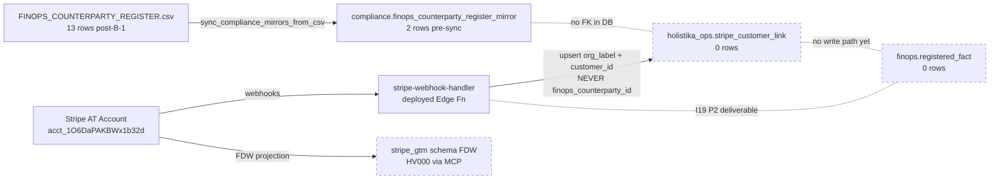
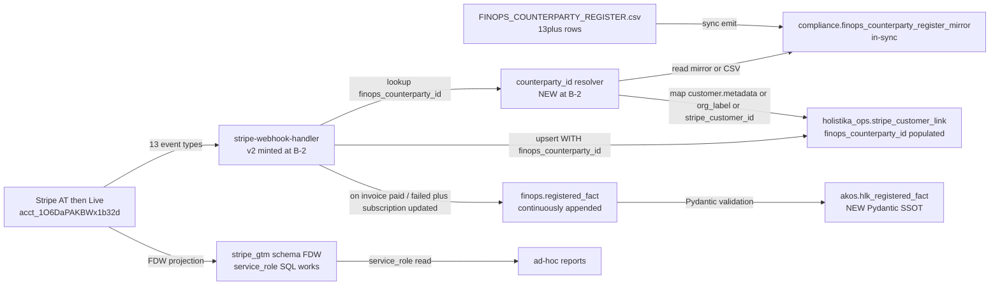

# Bundle B-1ext — Stripe AT (Account-Test) reconnaissance + monetary substrate gap inventory

> **Authoring posture**: read-only repo sweep at Bundle B-1 close (commit `f6a8983`). Live Stripe AT environment verification (`user-stripe` MCP) + live Supabase FDW verification (`plugin-supabase-supabase` MCP) deferred to next operator turn (user skipped `user-stripe` MCP auth at the recon ratify moment; that signal honored). This report is the **synthesis-before-tranche** substrate per the Quality Fabric 12th specialty (SYNTHESIS_BEFORE_TRANCHE_DISCIPLINE; PRIORITY-5 in the pipeline). Bundle B-2 substrate stand-up architecture inline-ratified post-live-verify.

## §1 TL;DR (operator-skim layer, ≤ 30s read)

| Layer | Current state | Prod-ready? | Gap-to-prod | Bundle B-2 scope? |
|:---|:---|:---|:---|:---|
| **1.1 FINOPS counterparty SSOT** (CSV) | 13 rows (was 2 pre-Bundle-B-1) | ✅ **YES** | None for the populated rows; OPS-81-3 ambiguous-tier drain still pending | NO (B-1 closed; Strand 2 stays scoped to B-1 cadence) |
| **1.2 Compliance mirror** (`compliance.finops_counterparty_register_mirror`) | 2 rows (last sync 2026-04-23 pre-B-1) | ⚠️ **PARTIAL** | Mirror not yet refreshed with 11 new B-1 rows; operator-gated `compliance_mirror_emit` deferred | **YES** — included in B-2 step 1 (cheap; sync emit + operator apply) |
| **1.3 Stripe FDW** (`stripe_gtm_server` + `stripe_gtm` schema) | Server exists; schema exists; `wrappers` v0.5.3 installed; foreign tables provisioned; **but vault SPI / HV000 error prevented MCP SELECT at I18 UAT 2026-04-23** | ⚠️ **PARTIAL** | Server-side SQL works (per I18 runbook); MCP SELECT path is broken | NO immediate fix needed (read-only diagnostic; live-verify in §7 follow-ups) |
| **1.4 Webhook handler** (`supabase/functions/stripe-webhook-handler/index.ts`) | Deployed; 13 event types handled; routes via `metadata.hlk_billing_plane`; structured JSON logging | ⚠️ **PARTIAL** | Handler **never populates** `holistika_ops.stripe_customer_link.finops_counterparty_id` (the I18 bridge column added 2026-04-23) — this is the load-bearing gap; no `finops.registered_fact` write path | **YES** — included in B-2 step 4 (event → registered_fact pipeline) |
| **1.5 `holistika_ops.stripe_customer_link` table** | DDL applied; `finops_counterparty_id` column exists; **0 rows seeded** (last I18 UAT 2026-04-23) | ⚠️ **PARTIAL** | Schema correct; no operational rows; webhook will populate on first `customer.created` event in AT | LIVE-VERIFY in §7; B-2 step 4 confirms population at first AT event |
| **1.6 `finops.registered_fact` table** | DDL applied (I19 Phase 1, 2026-04-23); RLS deny `anon` / `authenticated`; `service_role` only | ⚠️ **EMPTY** | No write paths yet (the I19 P2 "Phase 2 future" deliverable); MRR / AR / contract-value facts not yet flowing | **YES** — B-2 step 4 + step 5 (writer paths) |
| **1.7 `compliance.finops_counterparty_register_mirror` review-stamp** | 4 review columns added (I71 P4, 2026-05-14): `last_review_at` + `last_review_by` + `last_review_decision_id` + `methodology_version_at_review` | ✅ **YES** | None | NO (already in place) |

**One-sentence prod-readiness assessment**: Holistika is at **~60% of monetary-substrate prod-readiness**. The DDL bones are all there (I14 + I18 + I19 + I71 + I72 migrations applied); the webhook handler exists but has not been exercised end-to-end with `finops_counterparty_id` population; `finops.registered_fact` has zero rows because no writer paths were minted at I19 P1 close. Bundle B-2 closes the remaining 40% by minting the writer paths + exercising end-to-end against the AT environment.

**Bundle B-2 size estimate**: ~5-8 hours of architecture + ~3-5 atomic commits across 1-2 sessions if scope holds; could expand to 10-15 hours if operator wants additional discriminators / fact_types / dashboards. Recommend bracket the scope post-§4 architecture review.

## §2 Inventory of Stripe artifacts in repo (full sweep)

Captured by `rg` + `glob` across the repo at commit `f6a8983`.

### §2.1 Migrations referencing Stripe (4 files)

| Migration | Date | Stripe-related content |
|:---|:---|:---|
| `20260503190000_i14_phase3_compliance_and_holistika_ops.sql` | 2026-05-03 | Creates `holistika_ops.stripe_customer_link` (org_label + stripe_customer_id UNIQUE + livemode + created_at/updated_at + notes); creates `holistika_ops.billing_account` referencing stripe_customer_link via FK; RLS deny `anon` / `authenticated`; `service_role` only |
| `20260423014144_i18_finops_counterparty_mirror_cutover.sql` | 2026-04-23 | ALTER TABLE `holistika_ops.stripe_customer_link` ADD COLUMN `finops_counterparty_id TEXT` (nullable; **git-authoritative; not a FK to compliance mirror**); also hardens `stripe_gtm` schema privileges (`REVOKE PUBLIC` + `GRANT service_role`) |
| `20260423014326_i19_finops_ledger_phase1.sql` | 2026-04-23 | Creates `finops` schema + `finops.registered_fact` table (id UUID PK + counterparty_id TEXT + stripe_customer_id TEXT + stripe_subscription_id TEXT + fact_type TEXT + currency TEXT + amount_minor BIGINT + effective_date DATE + metadata JSONB + source_reference TEXT + created_at); 3 indexes (counterparty / stripe_customer / fact_type); RLS deny `anon` / `authenticated`; `service_role` only |
| `20260514250000_i72_revops_spine_finops_fk_columns.sql` | 2026-05-14 | ALTER TABLE `finops.registered_fact` ADD COLUMN `engagement_id TEXT` + `template_id TEXT` (nullable; RevOps spine FK columns per I72 P9) |

**Missing migration (gap)**: No migration creates `stripe_gtm_server` (the FDW server). Per I18 UAT 2026-04-23, the server was provisioned via **Supabase Dashboard + MCP `apply_migration`** outside the git migration ledger. This is the "Inventory-before-greenfield" precedent: server exists but not in repo migrations. **Recommended action (Bundle B-2 step 0)**: mint a `supabase/migrations/<timestamp>_i81_p2_b1ext_stripe_fdw_inventory.sql` that is a **READ-ONLY documentation migration** — `DO $$ ... RAISE NOTICE` with the actual `CREATE SERVER stripe_gtm_server` SQL captured from `pg_foreign_server` in a comment block; no DDL execution. This gets the FDW state into git for parity tracking without breaking the operator-gate SQL discipline.

### §2.2 Webhook handler (1 directory, 2 files, ~270 lines)

`supabase/functions/stripe-webhook-handler/`:

- **`index.ts`** (270 lines): Deno Edge Function. Validates `stripe-signature` header against `STRIPE_WEBHOOK_SECRET`. Handles 13 event types via switch statement.
- **`README.md`** (155 lines): Operator runbook covering `hlk_billing_plane` metadata contract, Stripe Dashboard setup, Stripe CLI setup, recommended events list, Supabase CLI setup. Comprehensive and well-maintained.

**Event types handled** (from index.ts):

| Group | Events | Action |
|:---|:---|:---|
| CRM | `customer.created` + `customer.updated` | If `metadata.hlk_billing_plane=holistika_ops` (or `holistika`), upserts `holistika_ops.stripe_customer_link` with `org_label` + `stripe_customer_id` + `livemode` + `updated_at`. **GAP**: never sets `finops_counterparty_id`. |
| Subscription lifecycle | `customer.subscription.created` + `customer.subscription.updated` + `customer.subscription.deleted` | Routes via `resolveSubscriptionPlane()` (subscription metadata → customer inherit → default `kirbe`). For `holistika_ops` plane: logs only (no DB write). For `kirbe`: stub log only (no `kirbe.subscriptions` write). |
| Invoice | `invoice.paid` + `invoice.payment_failed` + `invoice.finalized` | Fetches customer; if `holistika_ops` plane, upserts `stripe_customer_link` again (same gap as above). |
| Checkout | `checkout.session.completed` | Same routing as invoice. |
| Payment intent | `payment_intent.succeeded` + `payment_intent.payment_failed` | Same routing. |
| Charge | `charge.succeeded` + `charge.failed` | Same routing. |
| Self-serve | `billing_portal.session.created` | Log only (observability). |
| Default | (other) | `logRoute({ event_type, note: "no_op" })`. |

### §2.3 Repo helper scripts (1)

- **`scripts/stripe_set_billing_plane.py`**: Operator helper to set `metadata.hlk_billing_plane` on a Stripe Customer or Subscription via the Stripe SDK (stdlib + `STRIPE_SECRET_KEY` env var). Used pre-webhook-event to ensure the routing metadata is correct. **Not in scope for Bundle B-2 changes.**

### §2.4 Initiative planning artifacts (3 initiatives)

| Initiative | Status | Stripe-related deliverables |
|:---|:---|:---|
| **I14** (closed) | `holistika_ops` schema; `lead_intake`; webhook handler MVP routing logic |
| **I18** (closed 2026-04-23, D-IH-18-CLOSURE) | `FINOPS_COUNTERPARTY_REGISTER.csv` + mirror + `finops_counterparty_id` bridge column + Stripe FDW inventory-first runbook + UAT report |
| **I19** (status=program_line; Phase 1 complete 2026-04-23) | `finops` schema + `finops.registered_fact` skeleton DDL; **Phase 2 explicitly listed as "future" — write paths NOT YET MINTED** |

Phase 2 of I19 is the load-bearing forward-charter that Bundle B-2 will execute.

## §3 Data-flow architecture (current vs prod-ready)

### §3.1 Current data flow (pre-Bundle-B-2)

**Gaps numbered**:

1. **Webhook → Link bridge incomplete**: Handler never populates `finops_counterparty_id`. The bridge column was added at I18 (2026-04-23) but the I18 close was UAT-only — the handler code was NOT extended to populate it. This means even if `customer.created` fires for `vc_finops_supabase` (operator manually sets `hlk_billing_plane=holistika_ops` on the Stripe Customer), the row in `stripe_customer_link` will have `finops_counterparty_id IS NULL`.
2. **No Mirror sync since 2026-04-23**: 11 new B-1 rows in CSV not yet in `compliance.finops_counterparty_register_mirror`. Operator-gated; cheap fix (sync emit + apply).
3. **No `finops.registered_fact` writer**: Table exists with RLS + indexes but no event handler writes to it. I19 P2 is the named follow-up.
4. **FDW MCP path broken (read-only diagnostic)**: HV000 vault SPI error from I18 UAT 2026-04-23 may persist or may be fixed in `wrappers` v0.5.3+; needs live-verify. NOT a blocker for B-2 since the webhook is the primary write path; FDW is the read mirror for ad-hoc reporting.

### §3.2 Prod-ready data flow (post-Bundle-B-2)

**Bundle B-2 step list**:

- **Step 0** (FDW inventory documentation; no DDL): Inventory-document `stripe_gtm_server` state into a no-op migration for git parity. Surface what foreign tables exist (`stripe_gtm.stripe_gtm_customers` + likely `stripe_gtm.stripe_gtm_subscriptions` + `stripe_gtm.stripe_gtm_invoices` + others per Stripe Wrappers default schema).
- **Step 1** (mirror sync): `py scripts/sync_compliance_mirrors_from_csv.py --finops-counterparty-register-only` → review output → operator-apply via `compliance_mirror_emit`. 2 rows → 13 rows.
- **Step 2** (Pydantic SSOT for `registered_fact`): mint `akos/hlk_registered_fact.py` with frozen `RegisteredFactRow` model + enum frozensets for `fact_type` (initial: `reconciliation_snapshot`, `budget_line`, `contract_value_estimate`, `invoice_paid`, `invoice_failed`, `subscription_created`, `subscription_updated`, `subscription_deleted`, `payment_intent_succeeded`, `payment_intent_failed`, `charge_succeeded`, `charge_failed`) + currency frozenset (initial: `USD`, `EUR`).
- **Step 3** (validator): mint `scripts/validate_registered_fact.py` that operates on whatever SSOT will exist for fact_type vocabulary (since rows live in Postgres, not CSV, this validator becomes a fact_type allowed-list check + Pydantic round-trip test; FK-by-convention to `FINOPS_COUNTERPARTY_REGISTER.csv` counterparty_id). Wire into `validate_hlk.py` umbrella.
- **Step 4** (webhook handler v2): Extend `index.ts` with: (a) `resolveFinopsCounterpartyId(customer)` → reads `customer.metadata.finops_counterparty_id` first, falls back to `customer.metadata.org_label` lookup against `FINOPS_COUNTERPARTY_REGISTER.csv` slugs, falls back to NULL with audit log; (b) update `upsertHolistikaStripeCustomerLink` to include `finops_counterparty_id`; (c) new `appendRegisteredFact` helper that writes invoice / subscription / payment_intent events into `finops.registered_fact` with `fact_type` discriminator + `amount_minor` + `currency` + `effective_date` + `source_reference="stripe:<event_id>"` + `metadata={stripe_event_type, plane, livemode}`. Service-role client for the `finops` schema.
- **Step 5** (test mode end-to-end UAT): in Stripe AT (`acct_1O6DaPAKBWx1b32d`), `stripe trigger customer.created` with metadata `hlk_billing_plane=holistika_ops` + `finops_counterparty_id=vc_finops_supabase` → verify Edge log → verify `holistika_ops.stripe_customer_link` row → `stripe trigger invoice.paid` → verify `finops.registered_fact` row appended with correct amount + currency. Document evidence in dated UAT report.
- **Step 6** (governance cascade): `process_list.csv` row (`hol_opera_dtp_register_fact_writer` or `thi_finan_dtp_register_fact_curation` per area-owner judgment); SOP+runbook pair per `akos-executable-process-catalog.mdc` Rule 1; CHANGELOG; D-IH-81-W decision-row; `ARCHITECTURE.md` + `USER_GUIDE.md` sync.

**Step ordering**: Steps 1 + 2 + 3 can land in same commit (governance + Pydantic + validator; cheap and reversible). Steps 4 + 5 land together as the operational tranche (DDL-less; Edge Function deploy + AT-environment exercise). Step 6 land as governance close after AT UAT PASS.

## §4 The 7 architectural decisions Bundle B-2 needs operator ratification on

These are **fork-in-the-road** decisions, not implementation details. Each carries 3-5 framed options with recommended defaults. Surfaced here so the operator can ratify in a single batch before any code is written. Per `akos-inline-ratification.mdc` quality bar — every option carries one-clause rationale.

### §4.1 Decision A — `registered_fact` write granularity

How should the webhook map Stripe events to `registered_fact` rows? Three orthogonal options:

- **a1** (recommended — operator-explicit): **One row per material Stripe event** (`invoice.paid` → `fact_type=invoice_paid` + amount + currency + effective_date; `invoice.payment_failed` → `fact_type=invoice_failed`; `customer.subscription.updated` → `fact_type=subscription_updated` only when price/quantity actually changed). Filtered/transformed write — not a 1:1 dump. Best for analytics + audit; respects the I19 Phase 1 charter "operator- or system-recorded facts" framing.
- **a2**: **Mirror every Stripe event 1:1** into `registered_fact` (one row per webhook delivery; no filtering). Best for raw auditability; worst for analytics signal-to-noise.
- **a3**: **Only invoice-class events** (skip subscription lifecycle; skip charge; skip payment_intent). Best for MRR/AR signal only; worst for full payment-history reconstruction.

### §4.2 Decision B — `counterparty_id` resolution strategy when Stripe Customer is new

When `customer.created` fires for a Stripe Customer that has `hlk_billing_plane=holistika_ops` but no `finops_counterparty_id` in metadata and no matching slug, what should the handler do?

- **b1** (recommended): **Write `stripe_customer_link` with `finops_counterparty_id=NULL` + structured warn log** + the operator-inbox renders an "orphaned Stripe customer" report; operator manually links via `stripe customers update --metadata finops_counterparty_id=<slug>` then `customer.updated` fires → re-link. Surfaces the gap without blocking; the operator can backfill via Stripe CLI as part of weekly hygiene.
- **b2**: **Refuse to write the link row** + return 500 to Stripe (which triggers Stripe retry). Strongest enforcement but blocks all unrelated business if the resolver has a bug.
- **b3**: **Auto-mint a new `FINOPS_COUNTERPARTY_REGISTER.csv` row** with `confidence_level=1` + `notes="auto-minted from Stripe customer <id> on <date>; needs operator review"` + operator-inbox renders for review. Avoids data loss but introduces a registry-mutation path that violates the operator-explicit CSV gate per `akos-governance-remediation.mdc`. **NOT RECOMMENDED.**

### §4.3 Decision C — Currency strategy

Holistika operates in EUR primarily (per all FINOPS_COUNTERPARTY rows defaulting to NULL currency cells today + AT-Pymes priced at EUR + Madeira account class). Stripe AT may be in USD. Two options:

- **c1** (recommended): **Store `registered_fact.currency` exactly as Stripe reports it** (no conversion at write time). Add a separate `finops.fx_rate_snapshot` table later (out of B-2 scope) for time-series FX; reports compute EUR-equivalent at read time using the snapshot table. Preserves source-of-truth; defers FX complexity.
- **c2**: **Convert at write time** to a base currency (EUR) using a fixed rate or daily ECB rate. Simpler reports; loses source data.

### §4.4 Decision D — Pydantic SSOT for `registered_fact` enum vocabulary location

Where does the `fact_type` allowed-list live as authoritative source?

- **d1** (recommended): **`akos/hlk_registered_fact.py` `VALID_FACT_TYPES: frozenset[str]` Pydantic Literal** (matches the existing pattern from `akos/hlk_substrate_registry_csv.py` + `akos/hlk_finops_counterparty_csv.py`). Single source of truth; mirror schema CHECK constraint extracted from the frozenset at migration time.
- **d2**: A new canonical CSV `FINOPS_FACT_TYPE_VOCABULARY.csv` under `compliance/canonicals/finops/`. More extensible (operator can mint new fact_types via PR) but adds maintenance burden for a 12-row enum that rarely changes.

### §4.5 Decision E — Webhook handler retry posture for `finops.registered_fact` write failures

What happens when the `appendRegisteredFact` insert fails (e.g., Pydantic validation, RLS rejection, network error to Supabase)?

- **e1** (recommended): **Return 500 to Stripe** (which triggers Stripe's automatic retry per their exponential-backoff schedule up to 3 days) + structured error log to Supabase Edge logs. Stripe handles retry; we get the event eventually unless permanently broken. Most resilient with least code.
- **e2**: **Log + return 200** (acknowledge to Stripe; never retry). Simpler but data-loss-prone on transient errors.
- **e3**: **Dead-letter to a `holistika_ops.webhook_failure_log` table** + return 200. Most operationally observable but adds a new table + monitoring obligation that the operator-inbox doesn't yet surface.

### §4.6 Decision F — Live vs Test webhook signing secrets

In Stripe AT, you typically have separate webhook endpoints for test mode + live mode, each with own signing secret. Today the handler uses one `STRIPE_WEBHOOK_SECRET` env var. Two options:

- **f1** (recommended — for B-2 scope): **Keep single env var; AT environment uses `whsec_test_*`**. When promoting to live, operator switches the env var via Supabase CLI. Atomic switchover; no code change.
- **f2**: **Two env vars** (`STRIPE_WEBHOOK_SECRET_TEST` + `STRIPE_WEBHOOK_SECRET_LIVE`); handler tries both per request (signature verification fails on wrong one). More resilient at the cost of two webhook endpoints. Better for parallel test+live operation; out of B-2 scope unless operator explicitly wants it.

### §4.7 Decision G — Operator-inbox observability for the new pipeline

Should Bundle B-2 mint an operator-inbox view for monetary-substrate health (recent `registered_fact` rows + orphaned `stripe_customer_link` rows + last sync status of mirror)?

- **g1** (recommended): **Mint a minimal operator-inbox card** at `static/operator-inbox/finops-substrate.html` + corresponding render script `scripts/render_finops_substrate_inbox.py` that produces a daily summary (last 7d `registered_fact` row count by fact_type + orphaned-customer-link count + mirror-row-count vs CSV-row-count drift). Builds operational visibility from day one.
- **g2**: **Defer to a separate Wave-S initiative** focused on operator-inbox proliferation. Keeps B-2 scope tight at the cost of operating B-2's pipeline blind for a while.
- **g3**: **Use Supabase dashboards + Edge logs only** (no operator-inbox surface). Adequate for short-term; long-term the operator-inbox should own observability per existing pattern.

## §5 Cursor-rule compliance + cross-rule sanity check

This Bundle B-2 architecture is consistent with the following always-applied cursor rules:

- **akos-holistika-operations.mdc** §"Two-plane model": Step 0 (FDW inventory) + Step 1 (mirror sync) follow the Mirror Data (DML) plane; no large INSERT batches; webhook code lands as an Edge Function deploy, not a migration. Step 4 (`finops.registered_fact` writes) is operational data not CSV SSOT — matches the I19 framing.
- **akos-holistika-operations.mdc** §"Inventory-before-greenfield": Step 0 inventory of `stripe_gtm_server` honors the rule's call to verify what already exists before adding `CREATE SERVER` DDL. Single-server posture preserved.
- **akos-holistika-operations.mdc** §"Operator SQL gate": No DDL in Bundle B-2 (only Edge Function code + Pydantic + validator); the `compliance_mirror_emit` sync at Step 1 follows the existing operator-gate workflow.
- **akos-executable-process-catalog.mdc** RULE 1: Step 6 mints a paired SOP+runbook for the registered-fact writer process (`thi_finan_dtp_register_fact_curation` or `hol_opera_dtp_register_fact_writer` per area-owner ratification at G3).
- **akos-applied-research-discipline.mdc** RULE 2: Bundle B-2 introduces no novel framing (Stripe Wrappers + Edge Functions + `finops.registered_fact` are all existing patterns). No external research grounding required for B-2 itself.
- **akos-quality-fabric.mdc** RULES 1-5: Bundle B-2 closure UAT will satisfy the 5-axis composition (audience J-OP; channel ERP/Edge; scenario Stripe AT happy-path + sad-path; brand internal register; governance D-IH-81-W under D-IH-81-G umbrella).
- **akos-deploy-health.mdc**: Edge Function deploy at Step 4 triggers Step 1 deploy-status check (Supabase Edge Functions list → `stripe-webhook-handler` state=Active).

No conflicting cursor-rule signals identified. Bundle B-2 is doctrine-consistent.

## §6 Risks + mitigations

| Risk | Likelihood | Impact | Mitigation |
|:---|:---|:---|:---|
| R-B2-1 — `finops.registered_fact` write fails silently in production due to RLS misconfiguration | LOW | HIGH (data loss) | Decision E (e1 = return 500 → Stripe retries); explicit `pytest tests/test_registered_fact_writer.py` integration test against local Supabase before deploy |
| R-B2-2 — `finops_counterparty_id` resolution returns wrong slug + corrupts ledger lineage | MEDIUM | HIGH (audit-trail integrity) | Decision B (b1 = NULL + warn instead of guess); operator-inbox surfaces orphans for explicit review |
| R-B2-3 — Stripe AT webhook test events differ from live event shape | LOW | MEDIUM | Step 5 UAT covers happy + sad path with real `stripe trigger` commands; Stripe AT objects share API shape with live per Stripe docs |
| R-B2-4 — `wrappers` extension version drift breaks FDW read path post-deploy | LOW | LOW (FDW is ad-hoc reporting, not primary writer) | Pin `wrappers` version in migration comment; document fallback (server-side SQL via `service_role`) |
| R-B2-5 — Operator switches Stripe AT to live mode mid-Bundle-B-2 + signing secret mismatches | MEDIUM | MEDIUM | Decision F (f1 = single env var; explicit switchover); document Stripe Dashboard checklist in Step 5 README addendum |
| R-B2-6 — Pydantic `RegisteredFactRow` validation rejects valid Stripe data (currency edge case, amount overflow) | LOW | MEDIUM | Wide initial frozenset for currency; `amount_minor: BIGINT` already covers Stripe's int_64 amounts; integration test against captured Stripe event fixtures |
| R-B2-7 — Mirror sync at Step 1 introduces a regression to existing 2 seed rows | LOW | LOW (rollback trivial) | Operator-gate emit; review output before apply; idempotent UPSERT |

## §7 Follow-up items requiring live MCP access (operator-driven; next session)

**The following items REQUIRE live MCP access and operator authentication to the relevant servers; they cannot be resolved by repo-only sweep.** Listed in priority order:

1. **L-1 — `user-stripe` MCP auth + `get_stripe_account_info` smoke**: Confirm AT account is still `acct_1O6DaPAKBWx1b32d`; confirm webhook endpoint registered + signing secret consistent with Supabase env var; list current customers + subscriptions + invoices in AT (likely still empty per 2026-04-23 UAT; if non-empty, capture inventory).
2. **L-2 — `plugin-supabase-supabase` MCP live verify**: (a) `SELECT srvname, srvtype FROM pg_foreign_server WHERE srvname LIKE 'stripe%'`; (b) `SELECT table_name FROM information_schema.foreign_tables WHERE foreign_table_schema='stripe_gtm'`; (c) `SELECT count(*) FROM holistika_ops.stripe_customer_link` (expect 0); (d) `SELECT count(*) FROM finops.registered_fact` (expect 0); (e) `SELECT count(*) FROM compliance.finops_counterparty_register_mirror` (expect 2 pre-B-1 sync; will be 13 post-B-2 Step 1).
3. **L-3 — Stripe AT webhook event delivery test**: From Stripe AT Dashboard → Webhooks → endpoint → **Send test event** for `customer.updated` → verify Supabase Edge logs receive structured JSON log with `"source":"stripe_webhook"` + 200 response. Confirms current handler is reachable + signing-secret matches.
4. **L-4 — Vault SPI HV000 status check**: Attempt `SELECT count(*) FROM stripe_gtm.stripe_gtm_customers` via MCP `execute_sql` → confirm whether the I18 UAT 2026-04-23 vault SPI error is still present in current `wrappers` extension version. If still present, document workaround (server-side SQL via service_role); if resolved, MCP path is open.
5. **L-5 — `get_advisors` post-recon baseline**: Capture pre-Bundle-B-2 advisor lint set for security + performance. Compare to post-B-2 to attribute any new lints to B-2 changes.
6. **L-6 — `list_migrations` ledger drift check**: Confirm `20260423014144` (I18 cutover) + `20260423014326` (I19 P1) + `20260514250000` (I72 FK columns) are all present in remote `schema_migrations` ledger. If any missing, run `npm run supabase -- migration list` + `npm run supabase -- db push` to align.

**These 6 items convert §1 TL;DR's ⚠️ PARTIAL ratings into ✅ YES or ❌ FAIL definitively.** Recommend operator runs them at start of next session before Bundle B-2 Step 0 lands.

## §8 Bundle B-2 closure-decision label proposal

Per the sequential precedent established at I81 (T5 = D-IH-81-L, T4 = D-IH-81-M, T1 = D-IH-81-Q, T2 = D-IH-81-R, T3 = D-IH-81-S, Bundle C = D-IH-81-T, Bundle B-1 = D-IH-81-U):

- **Bundle B-1ext (this recon report)** = **D-IH-81-V** (read-only; informs Bundle B-2 architecture; landed at hygiene commit not requiring its own atomic decision row but listed in DECISION_REGISTER for traceability).
- **Bundle B-2 (substrate stand-up)** = **D-IH-81-W** if single atomic commit; **D-IH-81-W1 / W2 / W3** if multi-commit per ordering proposed in §3.2.

Letter contiguity preserved (U → V → W).

## §9 Cross-references

- **Parent commit (Bundle B-1)**: `f6a8983` (canonical CSV + governance cascade) + `2d47a03` (hygiene SHA backfill).
- **Parent decision row**: D-IH-81-U in `docs/references/hlk/v3.0/Admin/O5-1/People/Compliance/canonicals/DECISION_REGISTER.csv`.
- **Parent initiative master-roadmap**: `docs/wip/planning/81-vault-integrity-layout-milestones-retrofit/master-roadmap.md`.
- **Cluster coordinator**: `docs/wip/planning/86-initiative-cluster-execution-coordinator/master-roadmap.md`.
- **Sibling initiative references**:
  - I14 master-roadmap: `docs/wip/planning/14-holistika-internal-gtm-mops/master-roadmap.md`.
  - I18 master-roadmap (closed; FINOPS counterparty cutover): `docs/wip/planning/18-hlk-finops-counterparty-stripe/master-roadmap.md`.
  - I18 UAT report (the 2026-04-23 reconcile evidence cited throughout this recon): `docs/wip/planning/18-hlk-finops-counterparty-stripe/reports/uat-stripe-finops-reconcile-20260423.md`.
  - I18 Stripe FDW operator runbook: `docs/wip/planning/18-hlk-finops-counterparty-stripe/reports/stripe-fdw-operator-runbook.md`.
  - I19 master-roadmap (status=program_line; Phase 1 done; Phase 2 = Bundle B-2 scope): `docs/wip/planning/19-hlk-finops-ledger/master-roadmap.md`.
- **Migrations cited**:
  - `supabase/migrations/20260503190000_i14_phase3_compliance_and_holistika_ops.sql`.
  - `supabase/migrations/20260423014144_i18_finops_counterparty_mirror_cutover.sql`.
  - `supabase/migrations/20260423014326_i19_finops_ledger_phase1.sql`.
  - `supabase/migrations/20260514250000_i72_revops_spine_finops_fk_columns.sql`.
  - `supabase/migrations/20260514202912_i71_p4_followup_review_stamp_expansion.sql`.
- **Edge Function**: `supabase/functions/stripe-webhook-handler/index.ts` + `README.md`.
- **Helper scripts**: `scripts/stripe_set_billing_plane.py`.
- **Pydantic SSOT (existing)**: `akos/hlk_finops_counterparty_csv.py`.
- **Pydantic SSOT (to mint at B-2 Step 2)**: `akos/hlk_registered_fact.py` (NEW).
- **Validator (to mint at B-2 Step 3)**: `scripts/validate_registered_fact.py` (NEW).
- **Governing cursor rules**: `akos-holistika-operations.mdc` + `akos-executable-process-catalog.mdc` + `akos-quality-fabric.mdc` + `akos-applied-research-discipline.mdc` + `akos-deploy-health.mdc` + `akos-inline-ratification.mdc`.
- **Quality Fabric 12th specialty (pending)**: SYNTHESIS_BEFORE_TRANCHE_DISCIPLINE — this recon report IS an exemplar of synthesis-before-tranche craft; once that specialty mints, this report becomes the worked precedent.
