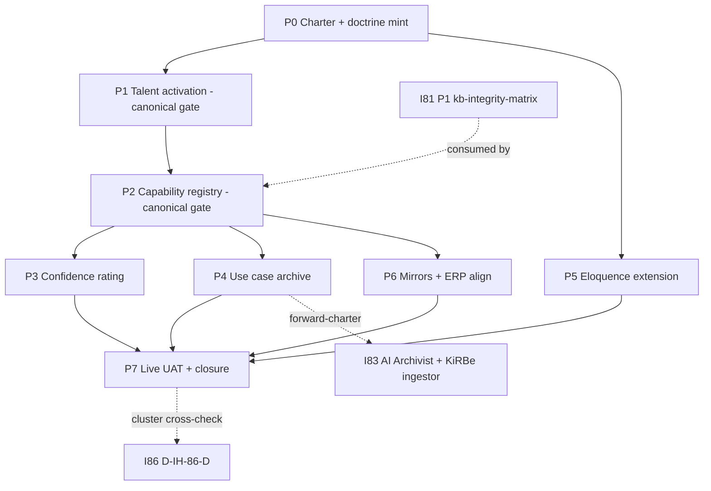
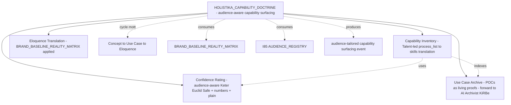

# I82 — Holistika Capability Doctrine and Commercial Readiness

> **Promoted candidate → active on 2026-05-16** under [I86 — Initiative Cluster Execution Coordinator](../86-initiative-cluster-execution-coordinator/master-roadmap.md) Wave 1. Full operating story + 4-facet architecture + 6 candidate conundrums in [`_candidates/i82-holistika-capability-doctrine-and-commercial-readiness.md`](../_candidates/i82-holistika-capability-doctrine-and-commercial-readiness.md).

## 1. Operating story (one-paragraph synthesis)

I82 mints the **third foundational doctrine** of Holistika — sibling to [`HOLISTIKA_ORGANISING_DOCTRINE.md`](../../references/hlk/v3.0/Admin/O5-1/People/canonicals/HOLISTIKA_ORGANISING_DOCTRINE.md) (I79 P1 — how we structure) and [`HOLISTIKA_AGENTIC_DOCTRINE.md`](../../references/hlk/v3.0/Admin/O5-1/People/canonicals/HOLISTIKA_AGENTIC_DOCTRINE.md) (I79 P3a — how AI fits): **how we surface what we do**. Codifies *audience-aware capability surfacing* — the meta-capability that takes a request from any external counterparty (J-CU customer / J-AD advisor / J-IN investor / J-CO collaborator / J-ENISA regulator / J-RC recruiter) and produces: (1) relevant capability rows from inventory; (2) confidence rating for delivery; (3) prior use-case proofs; (4) eloquence-translated message in the right register. The four named instruments — capability inventory + confidence rating + use case archive + eloquence translation — are *facets* of this single capability, not strands of a 4-track initiative. Operator motto: *"Concept to Use Case to Eloquence"*; cycle motto: *"If we do it, we sell it"*.

## 2. Charter decisions ratified at P0 (agent-default; operator skip 2026-05-16)

| ID | Question | Verdict | Source |
|:---|:---|:---|:---|
| **D-IH-82-A** | Mega-charter scope — 4-facet doctrine vs split | **Single 4-facet doctrine.** Per operator Round 9 framing: the four named instruments cohere as facets of one capability, not strands of separate initiatives. | `agent_inline_default` |
| **D-IH-82-B** | Doctrine canonical home | **`People/canonicals/`** — same path as existing two doctrines; sibling to ORGANISING + AGENTIC. | `agent_inline_default` |
| **D-IH-82-F** | Doctrine final filename (C-82-1; renamed from D-IH-82-NAME to conform to DECISION_REGISTER regex `^D-IH-\d{1,3}-[A-Z]{1,2}$`) | **`HOLISTIKA_CAPABILITY_DOCTRINE.md`** — most descriptive of the four-facet capability framing; "ELOQUENCE_DOCTRINE.md" alternative captures only one facet. Marketing/Brand can co-sign final naming at P0 mint. | `agent_inline_default` |
| **D-IH-82-G** | AI Archivist / KiRBe ingestor home (C-82-3; renamed from D-IH-82-ARCHIVIST) | **I83 forward-charter** — Tech-area-led product-shaped initiative. Use-case archive (P4) is the *data layer* I82 owns; the *ingestor-and-surfacing system* is I83 scope. | `agent_inline_default` |
| **D-IH-82-H** | Phase-sequencing posture (C-82-4; renamed from D-IH-82-SEQUENCE) | **Doctrine P0 ratified → Talent CSV P1 queued → Capability registry P2 awaits I81 integrity OR explicit waiver.** Avoids minting CAPABILITY_REGISTRY on orphaned `process_list.csv` paths. | `agent_inline_default` |

**Deferred decisions** (close at later phases):

- **D-IH-82-PREREQ** — Prerequisite waiver bridging I81 integrity ↔ I82 Capability registry → P2 entrance (per-mint or operator waiver).
- **D-IH-82-C** — Confidence rating naming policy (SCP-cameo vs numbers vs plain as PRIMARY) → P3.
- **D-IH-82-D** — Capability inventory PK + FK posture (`SKILL_REGISTRY` linkage + `process_list` anchoring) → P2.
- **D-IH-82-E** — Use case archive redaction policy (paraphrase default; case-by-case anonymise) → P4.

## 3. Phase shape

| Phase | Milestone | Effort | Deliverable | Gate |
|:---|:---|:---|:---|:---|
| **P0 — Charter + doctrine mint** (this commit + follow-up) | I82-CHARTER + I82-DOCTRINE-MINT | 1d | Folder + 6 planning files + INIT/DEC/OPS rows + INITIATIVE_DEPENDENCIES + planning README; **followup**: `HOLISTIKA_CAPABILITY_DOCTRINE.md` paired body + addendum at `People/canonicals/` | inline-ratify (this commit) + operator approval (doctrine prose) |
| **P1 — Talent activation** | I82-TALENT-ACTIVATION | gated | `baseline_organisation.csv` Talent role tranche + optional `process_list.csv` Talent upkeep rows | **operator approval** (canonical-CSV gate) |
| **P2 — Capability registry** | I82-CAPABILITY-REGISTRY-MINT | 1-2d | `dimensions/CAPABILITY_REGISTRY.csv` (+ `akos/hlk_capability_registry_csv.py` Pydantic + `scripts/validate_capability_registry.py` + `tests/test_capability_registry.py` + `validate_hlk.py` wiring + `PRECEDENCE.md` row); seed rows anchored to **audited `process_list.csv` paths via I81 P1 integrity matrix** | **operator approval** (canonical-CSV gate; consumes I81 P1 evidence OR waives via D-IH-82-PREREQ) |
| **P3 — Confidence rating** | I82-CONFIDENCE-REGISTRY-MINT | 1d | `CAPABILITY_CONFIDENCE_REGISTRY.csv` paired body+addendum + Marketing/Brand naming co-sign (SCP-cameo + numbers + plain registers) | operator approval (D-IH-82-C close) |
| **P4 — Use case archive** | I82-USE-CASE-ARCHIVE | 1d | `USE_CASE_ARCHIVE.csv` + 5 POC seed narratives (GDF + Hosteleria + RCD + documentation-team + Shopify); redaction policy ratified | operator approval (D-IH-82-E close) |
| **P5 — Eloquence translation** | I82-ELOQUENCE-EXTENSION | 0.5d | `BRAND_BASELINE_REALITY_MATRIX.md` §N "Capability messaging extension" with per-audience translation tables | inline-ratify |
| **P6 — Mirrors + ERP forward-spec alignment** | I82-MIRROR-ERP-ALIGN | 0.5d | `compliance.*_mirror` row appends + `hlk-erp` route specs (coordinated with I81 P2 layout waves if interleaving) | inline-ratify |
| **P7 — Live UAT + closure** | I82-LIVE-UAT-CLOSURE | 0.5d | Live capability-surfacing UAT dossier (one external stakeholder request rehearsed) OR explicit waiver narrative; closure + I83 promotion bolster | operator approval |
| **Total** | | **~7-10d** | (excl. operator pause windows + parallel I81) | |

## 4. Phase-dependency diagram

## 5. Architecture diagram (4-facet capability framing)

## 6. Wiring (cross-initiative dependencies)

| Inter-initiative wire | Direction | Realisation |
|:---|:---|:---|
| **I81 P1 → I82 P2** | `kb-integrity-matrix-<date>.csv` feeds CAPABILITY_REGISTRY seed-row anchoring | D-IH-82-H (sequencing posture) gates P2 on I81 P1 closed OR D-IH-82-PREREQ waiver |
| **I85 P1 → I82** | `AUDIENCE_REGISTRY.csv` provides audience codes for P5 eloquence translation surfaces | I85 P1 shipped under SHA `7d47199` 2026-05-16 |
| **I66 → I82 P5** | `BRAND_BASELINE_REALITY_MATRIX.md` dual-register doctrine extended | P5 adds §N "Capability messaging extension" |
| **I80 → I82 P0+P3** | `pattern_sop_addendum_split` applied to doctrine body+addendum + confidence registry paired files | I80 P1 precedent |
| **I82 P4 → I83** | `USE_CASE_ARCHIVE.csv` is the data layer; AI Archivist + KiRBe ingestor is the surfacing system | D-IH-82-G routes to I83 forward-charter |
| **I82 P7 → I86 D-IH-86-D** | Mechanical cluster cross-check on closure | I86 charter contract |

## 7. Asset classification (per [`PRECEDENCE.md`](../../references/hlk/v3.0/Admin/O5-1/People/Compliance/canonicals/PRECEDENCE.md))

- **Canonical** (P0): `INITIATIVE_REGISTRY.csv`, `DECISION_REGISTER.csv`, `OPS_REGISTER.csv` row appends; `HOLISTIKA_CAPABILITY_DOCTRINE.md` (body + `.addendum.md`).
- **Canonical** (P1): `baseline_organisation.csv` Talent activation row.
- **Canonical** (P2): `dimensions/CAPABILITY_REGISTRY.csv`; `akos/hlk_capability_registry_csv.py`; `scripts/validate_capability_registry.py`; `tests/test_capability_registry.py`; `CANONICAL_REGISTRY.csv` 2 rows.
- **Canonical** (P3): `CAPABILITY_CONFIDENCE_REGISTRY.csv` paired body+addendum.
- **Canonical** (P4): `USE_CASE_ARCHIVE.csv` + `akos/hlk_use_case_archive_csv.py` + `scripts/validate_use_case_archive.py` + tests.
- **Canonical modifications** (P5): `BRAND_BASELINE_REALITY_MATRIX.md` §N "Capability messaging extension".
- **Mirrored / derived** (P6): `compliance.capability_registry_mirror`, `compliance.capability_confidence_registry_mirror`, `compliance.use_case_archive_mirror`.
- **Reference**: `reports/p<NN>-uat-<date>.md` closure narratives.

## 8. Risk register (preview; full at [`risk-register.md`](risk-register.md))

| ID | Risk | L | I | Mitigation |
|:---|:---|:---:|:---:|:---|
| R-IH-82-1 | Doctrine remains aspirational without live test | M | H | P7 binds closure to one live external rehearsal OR explicit waiver narrative |
| R-IH-82-2 | SCP-Foundation cameo confuses audiences who don't get the reference | M | M | D-IH-82-C audience-aware multi-register (cameo only for methodology-curious) |
| R-IH-82-3 | Capability inventory drifts from `process_list.csv` over time | H | M | FK to `item_id`s; validator enforces FK resolution; quarterly sync cadence |
| R-IH-82-4 | Use case archive contains commercially-sensitive customer references | H | H | Default redaction = paraphrase; explicit `redaction_class` enum; Compliance Officer sign-off per row |
| R-IH-82-5 | Eloquence translation rails diverge from `BRAND_BASELINE_REALITY_MATRIX` over time | L | M | Extension lives IN the matrix (§N), not separate file; drift gate is existing matrix-drift validator |

## 9. Cross-references

- **Cluster coordinator**: [`86-initiative-cluster-execution-coordinator/master-roadmap.md`](../86-initiative-cluster-execution-coordinator/master-roadmap.md).
- **Candidate stub** (full expanded scope): [`_candidates/i82-holistika-capability-doctrine-and-commercial-readiness.md`](../_candidates/i82-holistika-capability-doctrine-and-commercial-readiness.md).
- **Parent**: [I80 P7 forward-charter](../80-i79-lessons-learned/master-roadmap.md) via inline-ratify Round 9.
- **Siblings**:
  - **[I81 — Vault integrity + layout migration + named-milestone schema](../81-vault-integrity-layout-milestones-retrofit/master-roadmap.md)** (upstream — P1 integrity-matrix consumed by I82 P2).
  - **[I85 — Audience-tag canonicalization](../85-audience-tag-canonicalization/master-roadmap.md)** (provides AUDIENCE_REGISTRY for P5 eloquence translation).
  - **[I83 — AI Archivist + KiRBe ingestor](../_candidates/i83-ai-archivist-and-kirbe-ingestor.md)** (downstream Tech-area-led; consumes I82 P4 use-case archive).
- **Companion doctrines**:
  - [`HOLISTIKA_ORGANISING_DOCTRINE.md`](../../references/hlk/v3.0/Admin/O5-1/People/canonicals/HOLISTIKA_ORGANISING_DOCTRINE.md) (I79 P1).
  - [`HOLISTIKA_AGENTIC_DOCTRINE.md`](../../references/hlk/v3.0/Admin/O5-1/People/canonicals/HOLISTIKA_AGENTIC_DOCTRINE.md) (I79 P3a).
- **Translation rails**: [`BRAND_BASELINE_REALITY_MATRIX.md`](../../references/hlk/v3.0/Admin/O5-1/Marketing/Brand/canonicals/BRAND_BASELINE_REALITY_MATRIX.md).
- **Decision log** (full rationale): [`decision-log.md`](decision-log.md).
- **Files modified** (per-commit traceability): [`files-modified.csv`](files-modified.csv).
- **Governing rules**: [`akos-people-discipline-of-disciplines.mdc`](../../../.cursor/rules/akos-people-discipline-of-disciplines.mdc) (People as discipline of disciplines); [`akos-brand-baseline-reality.mdc`](../../../.cursor/rules/akos-brand-baseline-reality.mdc); [`akos-holistika-operations.mdc`](../../../.cursor/rules/akos-holistika-operations.mdc) §"New git-canonical compliance registers"; [`akos-executable-process-catalog.mdc`](../../../.cursor/rules/akos-executable-process-catalog.mdc).

## 10. Closure criteria

- All seven phases land per shape table (or are explicitly waived with logged decision).
- `HOLISTIKA_CAPABILITY_DOCTRINE.md` paired body+addendum at `People/canonicals/` with `status: active`.
- Talent activated in `baseline_organisation.csv`.
- `CAPABILITY_REGISTRY.csv` seeded with rows anchored to audited `process_list.csv` paths (or operator waiver via D-IH-82-PREREQ).
- `CAPABILITY_CONFIDENCE_REGISTRY.csv` + `USE_CASE_ARCHIVE.csv` minted with seed content.
- `BRAND_BASELINE_REALITY_MATRIX.md` §N capability-messaging extension present.
- One live capability-surfacing UAT scenario rehearsed (or explicit waiver narrative).
- `INIT-OPENCLAW_AKOS-82` flipped `active → closed`; closure UAT report dated under `reports/`.
- I86 D-IH-86-D mechanical cross-check PASS.
- I83 P0 charter unblocked for next cluster wave.
