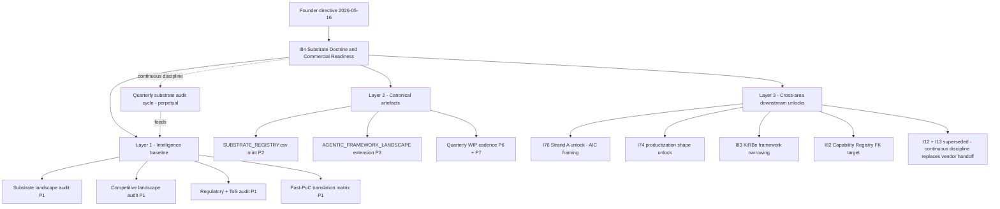
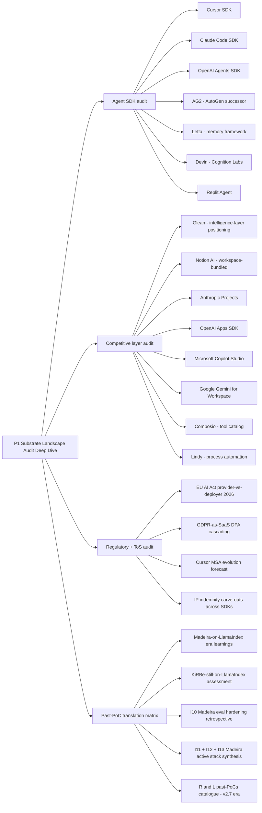
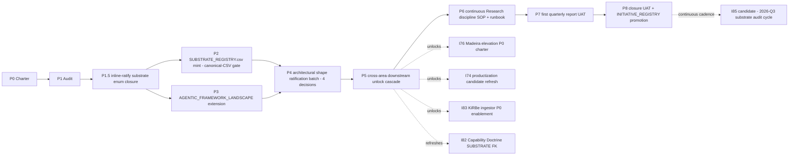

# I84 — Substrate Doctrine and Commercial Readiness

> **Founder directive 2026-05-16**: gather all intelligence past, present, and forecasted on agentic substrate choice + Madeira commercialization + market positioning + surfacing capabilities. **Research-area-owned**, **Tech-Lab-co-owned**, **cross-area impact** (Marketing positioning; People agentic doctrine refresh; Operations/PMO continuous-cadence discipline; Operations/RevOps commercial-readiness intelligence).
>
> Architecture ratified inline 2026-05-16 (3-question batch per `.cursor/skills/inline-ratify-craft/SKILL.md`): scope = Option D hybrid (standalone + continuous + supersedes-I12+I13 + unlocks-I76-Strand-A); canonical destination = Option D paired-three-tier (AGENTIC_FRAMEWORK_LANDSCAPE extension + new SUBSTRATE_REGISTRY.csv + quarterly Tier-1 WIP cadence reports); ratification depth = Option C hybrid (shape decisions ratified here; execution decisions deferred to each owning initiative).
>
> This initiative is the **first cross-area deployment** of the inline-ratify-craft skill minted at I80 P3. It is the **first concrete instantiation** of Research-area as a discipline-of-disciplines parallel to People-area (per `akos-people-discipline-of-disciplines.mdc` Rule 3 pattern, applied to Research). It supersedes the I12+I13 vendor-handoff Madeira-research-request lineage with an internal Research-area continuous discipline that produces dated quarterly substrate-audit reports.

## 1. Operating story

The operator opened the directive with: *"You're absolutely correct and that is really information I would've paid for. This is an absolute competitive advantage if played well, the fact that even Cursor SDK is in beta is something we need to capitalize. This warrants for a founder directive to Research owned towards Tech Lab with cross area impact to gather all intelligence we can about this topic, past, present and forecasted... This is the future not only of our agentic stance or what exactly Madeira will be made of (or why we're currently on OpenClaw instead of our own build like Madeira was in the LlamaIndex days like KiRBe still is) or reuse and extend past researches/PoCs we've already did translating these capabilities to v3.1), but also affects our market positioning and our actual surfacing capabilities."*

The directive names four interlocking governance questions that no single existing initiative covers in full:

1. **The substrate question — what is AKOS made of, and why?** Today AKOS runs on `OpenClaw` (a Holistika-internal wrapper over upstream frameworks per [`AGENTIC_FRAMEWORK_LANDSCAPE.md` §1](../../references/hlk/v3.0/Admin/O5-1/Envoy%20Tech%20Lab/canonicals/AGENTIC_FRAMEWORK_LANDSCAPE.md)). KiRBe is still on the LlamaIndex-era stack. The original LlamaIndex-Madeira era predates the current Cursor-3-Glass-as-agent-execution-runtime reality (Cursor 3 launched 2026-04-02; Anysphere at $2B ARR with 60% enterprise; Composer 2 built on Moonshot Kimi 2.5; Cursor SDK still beta but rapidly maturing). **The substrate landscape has fundamentally shifted between when AKOS was scaffolded and today**, and no canonical asset captures the comparison.

2. **The Madeira-commercialization question — what shape does Madeira ship in?** [`MADEIRA-AKOS/STATUS.md`](../../references/hlk/v3.0/Admin/O5-1/Envoy%20Tech%20Lab/MADEIRA-AKOS/STATUS.md) already reserves the productization destination + names TRIGGER-1 (≥3 external orgs request data-detached Madeira) and TRIGGER-2 (≥2 external orgs request AKOS-as-library). [`i74-brand-tooling-productization.md`](../_candidates/i74-brand-tooling-productization.md) scaffolds the library shapes (`@holistika/akos-brand` + `@holistika/akos-render` + `@holistika/madeira-agent`). [`i76-madeira-elevation.md`](../_candidates/i76-madeira-elevation.md) scaffolds the AIC framing F1-F5 architectural conundrum. But the ratification path from substrate-landscape-evidence → productization-shape-choice does not exist; each candidate waits for the other.

3. **The market-positioning question — what is our competitive moat?** Glean is positioned as "intelligence layer beneath the interface" — exactly Madeira's claimed positioning. Notion AI bundles search+docs+wikis at $10/user/month. Anthropic Projects + OpenAI Apps SDK + Microsoft Copilot Studio + Google Gemini for Workspace all ship 2026 capabilities that overlap with Madeira's value proposition. The operator's framing: *"we can strategically have a win there if we craft correctly"* (per [`i76-madeira-elevation.md`](../_candidates/i76-madeira-elevation.md) §1). The competitive matrix has never been written down.

4. **The past-PoC-translation question — what did we already learn?** The LlamaIndex-era Madeira + the still-LlamaIndex KiRBe + the I10 Madeira-eval-hardening closure + the I11 Madeira-ops-copilot active stack + the I12+I13 Madeira-research-request lineage all contain learnings that should translate to v3.1. No retrospective synthesises them.

I84 closes all four questions in one coordinated initiative, governed by the three ratifications captured at the inline-ratify batch on 2026-05-16. It deliberately does **not** execute the downstream initiatives (I76 / I74 / I83 / I82); those have their own scopes + owners + pause-points. I84 produces the **intelligence + shape ratifications** that unlock them, and mints the **continuous Research-area cadence** that keeps the intelligence fresh.

**Execution sequencing posture (ratified inline 2026-05-16 via Q1+Q2 batched gate, encoded as `D-IH-84-I`).** I84 runs **in true parallel** with [`I81`](../_candidates/i81-full-vault-sop-addendum-retrofit.md) foundation track — both are pure desk-research in their P1 phases (I81 P1 = vault integrity baseline; I84 P1 = substrate-landscape audit), zero canonical-CSV conflicts. The parallel posture preserves the time-sensitivity of substrate research (Cursor-SDK-beta competitive window flagged in the founder directive) without sacrificing the vault-integrity foundation that I82 P2 will need. **Critical coordination point**: I81 P3 named-milestone schema (`D-IH-81-H`) must ratify **before I84 P5 cross-area cascade** so the cascade lands in native named-milestone form (e.g. `I76-AIC-FRAMING-RATIFY` rather than magic-number `I76 Strand A`). If I81 P3 slips, I84 P5 either waits a session or ships with magic-number references and migrates as part of I81 P3 Wave 1 migration commits. Wave map: I81 P0+P1 ∥ I84 P1 → I81 P2+P3 ∥ I84 P2+P3 → I84 P4 batched ratification ∥ I82 P0+P1 → I82 P2-P4 (consumes I81 P1 matrix) → I83 P0 (both gates green) → I81 P4-P8 retrofit + I84 P5-P8 closure as background tracks. Full posture detail in [`decision-log.md` §D-IH-84-I](decision-log.md) and [`INITIATIVE_DEPENDENCIES.md` §3.7](../_templates/INITIATIVE_DEPENDENCIES.md).

## 2. Architecture (proposed → ratified at P0)

The architecture maps the founder-directive scope onto three load-bearing layers, with the substrate at the foundation, the canonical artefacts as the middle layer, and the cross-area downstream unlocks as the leverage layer.

The architecture is **recursive**: the continuous discipline (R) feeds back into Layer 1, keeping the intelligence fresh quarterly. Each layer's deliverables are independent enough to ship in sequence + dependent enough to demand coordinated governance (P0 charter holds them in alignment).

### 2a. Layer 1 deliverables — intelligence baseline (P1)

Four parallel audit threads, each producing a section of the P1 deep-dive synthesis at [`docs/wip/intelligence/substrate-audit-2026-Q2/`](../../intelligence/substrate-audit-2026-Q2/):

Each thread produces (i) a comparison row matrix; (ii) a scoring rubric output; (iii) a Madeira-positioning-implications note. The four converge in the synthesis dossier at P1 close.

### 2b. Layer 2 + Layer 3 dependency chain

The dependency chain has **two operator pause points beyond P0** (P2 canonical-CSV gate + P5 cross-area-unlock confirmation), plus the **inline-ratify batched gate at P4** (4 decisions in one round). Total: **6 operator interaction events** spread across the 2-3 calendar weeks, matching the cadence the operator has called sustainable across I70/I79/I80.

## 3. Phase at a glance

| Phase | Purpose | Effort | Gate type |
|:---|:---|---:|:---|
| **P0** | Charter + governance scaffolding ratifying Q1+Q2+Q3 architecture | 1d | **PAUSE POINT #1** (charter review) |
| **P1** | External substrate-landscape deep dive (founder directive's center of gravity) | 3-4d | inline-ratify at P1.5 (enum closure) |
| **P2** | SUBSTRATE_REGISTRY.csv canonical mint + Pydantic + validator + mirror | 2d | **PAUSE POINT #2** (canonical-CSV gate per `akos-holistika-operations.mdc`) |
| **P3** | AGENTIC_FRAMEWORK_LANDSCAPE.md extension + People-doctrine cross-coherence | 1d | inline-ratify at P3.5 (jargon-scan green) |
| **P4** | 4-decision batched architectural shape ratification (D-IH-84-B/C/D/E) | 0.5d operator + 0.5d agent prep | inline-ratify batched (4 decisions) |
| **P5** | Cross-area downstream-unlock cascade to I76 / I74 / I83 / I82 candidates | 1d | **PAUSE POINT #3** (operator confirms cascade lands cleanly) |
| **P6** | Continuous Research-area substrate-audit-cadence SOP + paired runbook | 1d | inline-ratify (cadence + owner ratify) |
| **P7** | First quarterly substrate-audit report UAT | 1d | **PAUSE POINT #4** (first-quarterly UAT) |
| **P8** | Closure UAT + INITIATIVE_REGISTRY promotion + I12+I13 supersession | 0.5d | **PAUSE POINT #5** (closure UAT) |

Total: **~10-12 engineer-days** + **6 operator interaction events**, spread over **2-3 calendar weeks** with natural pause windows. The 5 pause points are necessary per the high-blast-radius profile (canonical CSV mint + 4 architectural shape decisions affecting downstream initiatives + first-of-a-cadence UAT + initiative closure).

## 4. Per-phase deep sections

### P0 — Charter and governance scaffolding (1d; PAUSE POINT #1)

**Scope.** Author the P0 charter package per the I66/I68 plan-quality bar in [`akos-planning-traceability.mdc`](../../../.cursor/rules/akos-planning-traceability.mdc) §"Plan-quality bar". Six artefacts ship in lock-step: this master-roadmap.md + decision-log.md + risk-register.md + asset-classification.md + evidence-matrix.md + files-modified.csv. Update [`docs/wip/planning/README.md`](../README.md) to add the I84 row. Forward operator-pending: INITIATIVE_REGISTRY.csv row mint + 8 OPS_REGISTER.csv rows + 8 DECISION_REGISTER.csv rows (canonical-CSV gate per [`akos-governance-remediation.mdc`](../../../.cursor/rules/akos-governance-remediation.mdc) §"HLK compliance governance"). Mark I12 + I13 as superseded in their respective folders' README pointer files (no destructive edits — just forward-pointer header notes).

**Files.**
- Canonical (new): [`docs/wip/planning/84-substrate-doctrine-and-commercial-readiness/master-roadmap.md`](master-roadmap.md) (this file); [`docs/wip/planning/84-substrate-doctrine-and-commercial-readiness/decision-log.md`](decision-log.md); [`docs/wip/planning/84-substrate-doctrine-and-commercial-readiness/risk-register.md`](risk-register.md); [`docs/wip/planning/84-substrate-doctrine-and-commercial-readiness/asset-classification.md`](asset-classification.md); [`docs/wip/planning/84-substrate-doctrine-and-commercial-readiness/evidence-matrix.md`](evidence-matrix.md); [`docs/wip/planning/84-substrate-doctrine-and-commercial-readiness/files-modified.csv`](files-modified.csv).
- Planning meta (modified): [`docs/wip/planning/README.md`](../README.md) — add I84 row.
- Pointer-only (modified): [`docs/wip/planning/12-madeira-research-request/research-request-madeira.md`](../12-madeira-research-request/research-request-madeira.md) header note "**Superseded by I84**: this vendor-handoff lineage is replaced by the internal Research-area continuous substrate-audit discipline minted at I84 P6."; [`docs/wip/planning/13-madeira-research-followthrough/`](../13-madeira-research-followthrough/) similar.
- Operator-pending (NOT committed in P0): [`docs/references/hlk/v3.0/Admin/O5-1/People/Compliance/canonicals/INITIATIVE_REGISTRY.csv`](../../references/hlk/v3.0/Admin/O5-1/People/Compliance/canonicals/INITIATIVE_REGISTRY.csv) row; [`docs/references/hlk/v3.0/Admin/O5-1/People/Compliance/canonicals/OPS_REGISTER.csv`](../../references/hlk/v3.0/Admin/O5-1/People/Compliance/canonicals/OPS_REGISTER.csv) 8 rows (OPS-84-0 through OPS-84-8); [`docs/references/hlk/v3.0/Admin/O5-1/People/Compliance/canonicals/DECISION_REGISTER.csv`](../../references/hlk/v3.0/Admin/O5-1/People/Compliance/canonicals/DECISION_REGISTER.csv) 8 rows (D-IH-84-A through D-IH-84-H).

**Verification.** P0 charter package readable + internal links resolve; no canonical CSV mutated (gate respected); I12/I13 forward-pointer notes added without destructive edits. Operator reviews the master-roadmap as the load-bearing artefact; if approved, proceeds to canonical-CSV gate approval for the operator-pending list.

**Pause-point classification.** Charter review — per [`akos-agent-checkpoint-discipline.mdc`](../../../.cursor/rules/akos-agent-checkpoint-discipline.mdc) §"Pause-point depth heuristic" row for "7+ phases / ≥ 3 weeks": 1 pause point per 2-3 phases. P0 is the first.

**Self-checkpoint count.** 1 (post-charter, before P1 kickoff — agent files self-checkpoint at [`docs/wip/planning/84-.../reports/checkpoints/sc-post-p0-<date>.md`](reports/checkpoints/) documenting what shipped + what's next).

**Cursor-rules adherence.** Operationalises [`akos-planning-traceability.mdc`](../../../.cursor/rules/akos-planning-traceability.mdc) plan-quality bar (multi-sentence YAML todos + 3 mermaids + per-phase deep + decision preview + risk preview + files-modified.csv + file-path density); [`akos-governance-remediation.mdc`](../../../.cursor/rules/akos-governance-remediation.mdc) §"HLK compliance governance" (canonical-CSV gate respected — no mutations in P0); [`akos-inline-ratification.mdc`](../../../.cursor/rules/akos-inline-ratification.mdc) (charter scope ratified at the 3-question inline-ratify gate of 2026-05-16); [`akos-agent-checkpoint-discipline.mdc`](../../../.cursor/rules/akos-agent-checkpoint-discipline.mdc) (pause-point cadence + self-checkpoint cadence).

### P1 — External substrate-landscape audit (3-4d; inline-ratify at P1.5)

**Scope.** The founder-directive's center of gravity. Four parallel audit threads (per §2a above): agent-SDKs + competitive layer + regulatory + ToS + past-PoC translation. The output is a comprehensive dossier at [`docs/wip/intelligence/substrate-audit-2026-Q2/`](../../intelligence/substrate-audit-2026-Q2/) (Tier-1 WIP per [`WORKSPACE_BLUEPRINT_HOLISTIKA.md`](../../references/hlk/v3.0/Admin/O5-1/Operations/PMO/canonicals/WORKSPACE_BLUEPRINT_HOLISTIKA.md) §17). The dossier is the **discovery report** that I76 Strand A was waiting for + the **commercial-readiness baseline** that I74 + I82 need + the **framework-class-narrowing input** that I83 needs.

**Files.**
- Tier-1 WIP (new): [`docs/wip/intelligence/substrate-audit-2026-Q2/README.md`](../../intelligence/substrate-audit-2026-Q2/) (folder + audit scope); `agent-sdk-comparison-matrix.md` (per-SDK row analysis with structured attributes); `competitive-layer-positioning.md` (Glean / Notion / Anthropic / OpenAI / Microsoft / Google / Composio / Lindy comparison + Madeira-positioning-implications); `regulatory-tos-forecast.md` (EU AI Act + GDPR-as-SaaS + Cursor MSA + IP-indemnity + per-SDK ToS evolution forecast); `past-poc-translation-matrix.md` (LlamaIndex-era Madeira retrospective + KiRBe-still-on-LlamaIndex assessment + I10/I11/I12/I13 active-stack synthesis + R&L v2.7 PoC catalogue); `2026-q2-substrate-audit-synthesis.md` (the dossier itself, ~2000-3000 words).
- Operator-readable summary (new): [`docs/wip/planning/84-substrate-doctrine-and-commercial-readiness/reports/p1-substrate-audit-synthesis-<date>.md`](reports/) — a 1-page tldr for the busy operator.

**Verification.** Each of the 4 threads has structured outputs (matrix tables with attribute columns; not free prose only). Citations to external sources include URLs + access-date. The Madeira-positioning-implications section is internally-consistent (no contradictions between Glean-comparison and Notion-comparison framings). The past-PoC translation matrix names specific learnings translatable to v3.1 (no hand-waving). Brand-baseline-reality dual-register held when audit prose references customer-facing copy per [`akos-brand-baseline-reality.mdc`](../../../.cursor/rules/akos-brand-baseline-reality.mdc).

**P1.5 inline-ratify gate.** After the audit lands, batch-ask the operator: (a) which substrates audit deeply (full row analysis + ratification at P4) vs which mention briefly vs which defer to a future Research cycle (closes the in-scope enum so P2 SUBSTRATE_REGISTRY seeds are bounded); (b) any audit-thread that needs another iteration before P2 mints the registry; (c) any positioning-implication that warrants escalation to Marketing/Brand for parallel cross-area handling. Per [`akos-inline-ratification.mdc`](../../../.cursor/rules/akos-inline-ratification.mdc) — evidence-dependent gate; inline-ratify is correct.

**Pause-point classification.** None at P1; P1.5 is an inline-ratify gate (not a real-stop pause).

**Self-checkpoint count.** 3 — pre-P1 (sweep-plan documenting which sources will be read in which order); mid-P1 (after agent-SDK + competitive sweep, before regulatory + past-PoC); post-P1 (synthesis-quality self-check before P1.5 inline-ratify).

**Cursor-rules adherence.** Operationalises [`akos-inline-ratification.mdc`](../../../.cursor/rules/akos-inline-ratification.mdc) (P1.5 evidence-dependent gate); [`akos-brand-baseline-reality.mdc`](../../../.cursor/rules/akos-brand-baseline-reality.mdc) (any external-quotable prose in the audit dossier goes through the dual-register check); [`akos-people-discipline-of-disciplines.mdc`](../../../.cursor/rules/akos-people-discipline-of-disciplines.mdc) Rule 4 (anti-jargon scope is People-only; the audit dossier lives at Research-area Tier-1 WIP so jargon is legitimate); [`akos-agent-checkpoint-discipline.mdc`](../../../.cursor/rules/akos-agent-checkpoint-discipline.mdc) §"Self-checkpoint depth heuristic" 6+ deliverables row → 3 self-checkpoints.

### P2 — SUBSTRATE_REGISTRY.csv canonical mint (2d; MANDATORY PAUSE POINT #2)

**Scope.** Mint SUBSTRATE_REGISTRY.csv as a net-new git-canonical compliance register per the pattern in [`akos-holistika-operations.mdc`](../../../.cursor/rules/akos-holistika-operations.mdc) §"New git-canonical compliance registers". Ships with full SSOT chain: Pydantic model + validator + tests + mirror DDL + sync function + PRECEDENCE row + ARCHITECTURE/USER_GUIDE section refs + release-gate wiring. Seed initial ~18-22 rows from the P1 audit (the 8 existing AGENTIC_FRAMEWORK_LANDSCAPE rows promoted + 10-14 net-new substrates).

**Files.**
- Canonical (new): [`docs/references/hlk/v3.0/Admin/O5-1/People/Compliance/canonicals/dimensions/SUBSTRATE_REGISTRY.csv`](../../references/hlk/v3.0/Admin/O5-1/People/Compliance/canonicals/dimensions/) (18-column dimensional canonical sibling to [`SKILL_REGISTRY.csv`](../../references/hlk/v3.0/Admin/O5-1/People/Compliance/canonicals/dimensions/SKILL_REGISTRY.csv) and [`PEOPLE_DESIGN_PATTERN_REGISTRY.csv`](../../references/hlk/v3.0/Admin/O5-1/People/Compliance/canonicals/dimensions/PEOPLE_DESIGN_PATTERN_REGISTRY.csv)).
- Validators (new — follow [`CONTRIBUTING.md`](../../../CONTRIBUTING.md) §"Python Code Standards"): [`akos/hlk_substrate_registry_csv.py`](../../../akos/) (Pydantic SSOT — `SUBSTRATE_REGISTRY_FIELDNAMES` tuple + `SubstrateRegistryRow` model + `VALID_STATUS` / `VALID_RUNTIME_SHAPE` / `VALID_LICENSE_CLASS` / `VALID_PERSISTENCE_MODEL` / `VALID_TOOL_PROTOCOL` / `VALID_AKOS_INTEGRATION_STATE` / `VALID_MADEIRA_PRODUCTIZATION_ROLE` / `VALID_AIC_PATTERN_ROLE` frozensets); [`scripts/validate_substrate_registry.py`](../../../scripts/) (validator with structured logging via `akos.log.setup_logging`, type hints, `pathlib.Path`, FK resolution into existing registries); [`tests/test_substrate_registry.py`](../../../tests/) (Pydantic valid + invalid pairs registered under `@pytest.mark.governance` and `scripts/test.py` group list).
- Mirror (new): [`supabase/migrations/<YYYYMMDDHHMMSS>_i84_substrate_registry_mirror.sql`](../../../supabase/migrations/) — `CREATE TABLE compliance.substrate_registry_mirror (...) + RLS DENY anon/authenticated + service_role write`.
- Sync (modified): [`scripts/sync_compliance_mirrors_from_csv.py`](../../../scripts/sync_compliance_mirrors_from_csv.py) — add `_emit_substrate_registry_upserts()` + `--substrate-registry-only` CLI flag.
- Drift validator (modified): [`scripts/validate_compliance_schema_drift.py`](../../../scripts/validate_compliance_schema_drift.py) — add triple to `_REGISTRY` tuple.
- Governance registry (modified): [`docs/references/hlk/v3.0/Admin/O5-1/People/Compliance/canonicals/PRECEDENCE.md`](../../references/hlk/v3.0/Admin/O5-1/People/Compliance/canonicals/PRECEDENCE.md) — add canonical + mirror rows.
- Docs sync (modified): [`docs/ARCHITECTURE.md`](../../../docs/ARCHITECTURE.md) HLK Registry table + new "Substrate Registry" section; [`docs/USER_GUIDE.md`](../../../docs/USER_GUIDE.md) HLK Operator Model section; [`.cursor/rules/akos-docs-config-sync.mdc`](../../../.cursor/rules/akos-docs-config-sync.mdc) HLK compliance changes table — add a row.
- Release gate (modified): [`scripts/release-gate.py`](../../../scripts/release-gate.py) + [`scripts/validate_hlk.py`](../../../scripts/validate_hlk.py) umbrella + [`config/verification-profiles.json`](../../../config/verification-profiles.json) `pre_commit` profile (add `validate_substrate_registry` step).

**Verification.** `py scripts/validate_substrate_registry.py` exits 0; `py scripts/validate_hlk.py` umbrella green; `py scripts/test.py governance` green (new tests pass); `py scripts/verify.py compliance_mirror_emit` smoke green (new emit function exercised); `py scripts/release-gate.py` green; `py scripts/check-drift.py` clean. Operator applies the DDL via the operator-SQL-gate per [`docs/wip/planning/14-holistika-internal-gtm-mops/reports/operator-sql-gate.md`](../14-holistika-internal-gtm-mops/reports/operator-sql-gate.md).

**Pause-point classification.** MANDATORY canonical-CSV gate per [`akos-governance-remediation.mdc`](../../../.cursor/rules/akos-governance-remediation.mdc) §"Canonical CSV gates" applied to dimensional canonicals (same severity as `process_list.csv` / `baseline_organisation.csv` for SSOT mints). Operator approval required before commit. Operator review checklist: (1) column shape adequate for the cross-area use-cases? (2) initial row seed covers the founder-directive scope? (3) Madeira-productization-role + AIC-pattern-role enums correctly reflect the F1-F5 question shape? (4) license-class enum captures the open-vs-proprietary axis the productization analysis needs? (5) Supabase RLS posture matches the existing dimensional-canonical norm (service_role only)?

**Self-checkpoint count.** 3 — pre-DDL ratification (Pydantic + validator + tests passing before DDL author); post-CSV-row-seed (seed rows reviewed for completeness before operator gate); post-mirror-emit-smoke (mirror table populates correctly via emit script).

**Cursor-rules adherence.** Operationalises [`akos-holistika-operations.mdc`](../../../.cursor/rules/akos-holistika-operations.mdc) §"New git-canonical compliance registers" (canonical pattern + Pydantic SSOT + validator + mirror + PRECEDENCE registration); [`akos-governance-remediation.mdc`](../../../.cursor/rules/akos-governance-remediation.mdc) §"Canonical CSV gates" (operator pause); [`akos-docs-config-sync.mdc`](../../../.cursor/rules/akos-docs-config-sync.mdc) §"HLK compliance changes" (full docs cascade); [`CONTRIBUTING.md`](../../../CONTRIBUTING.md) §"Python Code Standards" (Pydantic + type hints + structured logging + pathlib + tests + release-gate wiring).

### P3 — AGENTIC_FRAMEWORK_LANDSCAPE extension + People-doctrine cross-coherence (1d; inline-ratify at P3.5)

**Scope.** Extend the Tech-Lab-side [`AGENTIC_FRAMEWORK_LANDSCAPE.md`](../../references/hlk/v3.0/Admin/O5-1/Envoy%20Tech%20Lab/canonicals/AGENTIC_FRAMEWORK_LANDSCAPE.md) to absorb the P1 audit findings while preserving the People-side anti-jargon discipline per [`akos-people-discipline-of-disciplines.mdc`](../../../.cursor/rules/akos-people-discipline-of-disciplines.mdc) Rule 3 + Rule 4. The landscape canonical currently carries 8 framework rows + 4 KB-infrastructure dimensions + 4 MCP postures. P3 extends each section per the P1 audit + adds the OpenClaw-vs-LlamaIndex-vs-Cursor-SDK retrospective the founder asked for.

**Files.**
- Canonical (modified): [`docs/references/hlk/v3.0/Admin/O5-1/Envoy Tech Lab/canonicals/AGENTIC_FRAMEWORK_LANDSCAPE.md`](../../references/hlk/v3.0/Admin/O5-1/Envoy%20Tech%20Lab/canonicals/AGENTIC_FRAMEWORK_LANDSCAPE.md) — §1 framework table extension (add Cursor SDK + Claude Code SDK + OpenAI Agents SDK + AG2 + Letta + Devin + Replit Agent rows; revise OpenClaw row with LlamaIndex-era retrospective + current substrate rationale + KiRBe-still-on-LlamaIndex parallel-note); §2 KB infrastructure dimensions (4 → 5: add "Substrate-portable" reflecting D-IH-84-B); §3 MCP-postures matrix (add Cursor-3-Glass parallel-agent + multi-repo postures); new §7 "OpenClaw / LlamaIndex / Cursor-SDK retrospective" — the founder-directive-named historical narrative.
- Cross-reference (modified): [`docs/references/hlk/v3.0/Admin/O5-1/People/canonicals/HOLISTIKA_AGENTIC_DOCTRINE.md`](../../references/hlk/v3.0/Admin/O5-1/People/canonicals/HOLISTIKA_AGENTIC_DOCTRINE.md) — add a §N "Cross-reference to Substrate Doctrine" pointing at the new Research-area [`SUBSTRATE_LANDSCAPE_DOCTRINE.md`](../../references/hlk/v3.0/Admin/O5-1/Research/Methodology/canonicals/) (minted at P6) + the Tech-Lab AGENTIC_FRAMEWORK_LANDSCAPE.md (extended here). **NO jargon leakage**: any framework name added must stay in Tech-Lab + Research-area canonicals; People canonicals reference via "see Substrate Doctrine for the technical row" hyperlinks.

**Verification.** `py scripts/validate_design_pattern_registry.py --jargon-scan` exits 0 (People canonicals stay free of forbidden tokens — `LangChain`, `LangGraph`, `Cursor SDK`, etc. — added to forbidden list if AGENTIC_FRAMEWORK adds rows). [`scripts/tech_agentic_landscape_audit.py`](../../../scripts/tech_agentic_landscape_audit.py) (the paired runbook to AGENTIC_FRAMEWORK_LANDSCAPE.md) green — confirms each new row's upstream URL resolves + each new MCP-posture matches its configuration.

**P3.5 inline-ratify gate.** Operator reviews the §7 retrospective (the OpenClaw-vs-LlamaIndex-vs-Cursor-SDK historical narrative the founder asked for) for accuracy + appropriate framing. The retrospective is operator-voice-adjacent; getting it right matters for the doctrine's long-term credibility.

**Pause-point classification.** None (P3.5 is inline-ratify, not real-stop pause).

**Self-checkpoint count.** 2 — pre-canonical-edit (sketch the row additions + cross-reference structure); post-jargon-scan (verify clean).

**Cursor-rules adherence.** Operationalises [`akos-people-discipline-of-disciplines.mdc`](../../../.cursor/rules/akos-people-discipline-of-disciplines.mdc) Rule 3 + Rule 4 (jargon-side to Tech Lab; clarity-side to People); [`akos-docs-config-sync.mdc`](../../../.cursor/rules/akos-docs-config-sync.mdc) (when AGENTIC_FRAMEWORK_LANDSCAPE.md changes, paired runbook `tech_agentic_landscape_audit.py` must stay coherent).

### P4 — Architectural shape ratification batched gate (0.5d operator + 0.5d agent prep)

**Scope.** Ratify 4 load-bearing architectural shape decisions in a single inline-ratify batch using P1+P2+P3 evidence as input. These are the decisions downstream initiatives (I76 / I74 / I83 / I82) were waiting on. Per Q3 ratification (Option C hybrid), the SHAPE decisions ratify here; the EXECUTION decisions defer to each owning initiative's P0.

The 4 decisions in the batch:

| Decision | Question | Owning initiative downstream |
|:---|:---|:---|
| **D-IH-84-B** | AKOS substrate-baseline-choice: stay-on-OpenClaw-as-internal-wrapper vs migrate-toward-Cursor-SDK-backed vs hybrid (Cursor SDK frontend runtime + OpenClaw policy layer) | (none — this is I84's own decision) |
| **D-IH-84-C** | AIC framing F1-F5 binding choice (supervised sub-agents / peer companions / ad-hoc dispatchers / single-agent rich-tools / hybrid per-task) | I76 P0 (was C-76-1 pre-charter blocking) |
| **D-IH-84-D** | MADEIRA productization shape (library-only / agent-only / library + agent hybrid / pre-commit on shape) | I74 P4 (was C-74-3 pre-execution) |
| **D-IH-84-E** | KiRBe framework-class-narrowing from 8 rows to 2 finalists (with rationale; KiRBe-execution chooses between the 2 finalists at I83 P0) | I83 P0 (was C-83-1 pre-charter) |

**Files.** [`docs/wip/planning/84-substrate-doctrine-and-commercial-readiness/reports/p4-shape-ratification-batch-<date>.md`](reports/) — the operator-readable batch presentation + the post-ratification record. DECISION_REGISTER.csv rows mint at this phase (operator-pending; 4 rows D-IH-84-B/C/D/E + their inception rows already at D-IH-84-A).

**Verification.** Operator's inline reply to the batched `AskQuestion` call ratifies (or pivots) each decision. Post-batch: each ratified row gets appended to DECISION_REGISTER.csv (canonical-CSV gate; operator pre-approves the row batch at the same time as the substantive ratification).

**Pause-point classification.** Inline-ratify batched gate, not real-stop pause. Per [`akos-inline-ratification.mdc`](../../../.cursor/rules/akos-inline-ratification.mdc): "evidence-dependent or spot-check operator decisions" → inline-ratify.

**Self-checkpoint count.** 2 — pre-batched-ratify-prep (agent drafts 4-question batch per inline-ratify-craft skill + reviews against pre-flight checklist); post-decision-register-mints (verify 4 rows landed + cross-references downstream resolve).

**Cursor-rules adherence.** Operationalises [`akos-inline-ratification.mdc`](../../../.cursor/rules/akos-inline-ratification.mdc) (architectural-shape decisions inline-ratify pattern); [`inline-ratify-craft/SKILL.md`](../../../.cursor/skills/inline-ratify-craft/SKILL.md) (batch tightly-coupled decisions + 2-5 options per question + rationale embedded inline + recommendation marked + citations).

### P5 — Cross-area downstream-unlock cascade (1d; PAUSE POINT #3)

**Scope.** Translate P4 ratifications into the cross-area cascade: update each downstream candidate stub to reference the I84 outputs as their unblocking inputs. Per Q3 Option C: SHAPE landed here; EXECUTION stays with each owning initiative's P0.

**Files.**
- Candidate stubs (modified): [`docs/wip/planning/_candidates/i76-madeira-elevation.md`](../_candidates/i76-madeira-elevation.md) — Strand A "External research must complete BEFORE planning" replaced with cross-reference to I84 P1 deliverable + C-76-1 AICs framing closed with D-IH-84-C reference; promotion gate updated (was: Strand A complete + AICs ratified; now: I84 closed + operator promotes when ready). [`docs/wip/planning/_candidates/i74-brand-tooling-productization.md`](../_candidates/i74-brand-tooling-productization.md) — Strand C cross-reference + C-74-3 MADEIRA gate-criteria closed with D-IH-84-D + C-74-4 license-separation-enforceability informed by Cursor SDK ToS analysis from I84 P1. [`docs/wip/planning/_candidates/i83-ai-archivist-and-kirbe-ingestor.md`](../_candidates/i83-ai-archivist-and-kirbe-ingestor.md) — C-83-1 framework-choice closed with D-IH-84-E (narrowed to 2 finalists; KiRBe-P0 picks between them). [`docs/wip/planning/_candidates/i82-holistika-capability-doctrine-and-commercial-readiness.md`](../_candidates/i82-holistika-capability-doctrine-and-commercial-readiness.md) — §2a CAPABILITY_REGISTRY column-spec extends to include `substrate_id` FK to SUBSTRATE_REGISTRY for capabilities that name an underlying technical substrate.
- New: [`docs/wip/planning/84-.../reports/cross-area-unlock-handoff-<date>.md`](reports/) — explicit cascade summary readable by each downstream owning role.

**Verification.** Each downstream candidate stub's "Promotion criteria" section reflects the I84 unlock + each candidate is verifiably promote-ready post-cascade (or operator-action-pending if other gates also block). Internal link integrity verified — all I84 → candidate cross-references resolve + back-references in candidates resolve to I84 master-roadmap + decision-log.

**Pause-point classification.** PAUSE POINT #3 — operator confirms the cascade lands cleanly (no over-reach into downstream candidates' scopes; respects each owner's independence). The pause is short (skim review); the deliverables are well-bounded.

**Self-checkpoint count.** 2 — pre-cascade-update (sketch the per-candidate diff + verify it stays within shape-not-execution); post-cross-reference-link-check (validate all internal links resolve).

**Cursor-rules adherence.** Operationalises [`akos-planning-traceability.mdc`](../../../.cursor/rules/akos-planning-traceability.mdc) §"Phase dependency chain" (downstream charters cite upstream ratifications); [`akos-inline-ratification.mdc`](../../../.cursor/rules/akos-inline-ratification.mdc) §"When NOT to use" (architectural decisions surfaced mid-execution → stop-and-clarify; cascade respects this by NOT making any new execution decisions for downstream initiatives).

### P6 — Continuous Research-area substrate-audit-cadence (1d; inline-ratify)

**Scope.** Mint the continuous Research-area substrate-audit discipline as the closure-cadence deliverable per Q1 Option D hybrid framing. Two new canonicals + one paired runbook + cadence wiring. Per [`akos-executable-process-catalog.mdc`](../../../.cursor/rules/akos-executable-process-catalog.mdc) RULE 1: every SOP minted needs a paired executable runbook.

**Files.**
- Canonical (new): [`docs/references/hlk/v3.0/Admin/O5-1/Research/Methodology/canonicals/SUBSTRATE_LANDSCAPE_DOCTRINE.md`](../../references/hlk/v3.0/Admin/O5-1/Research/Methodology/canonicals/) — the Research-area doctrine that frames substrate-as-discipline-of-disciplines, paired with the Tech-Lab AGENTIC_FRAMEWORK_LANDSCAPE.md per the People-DoD pattern (Rule 3 of [`akos-people-discipline-of-disciplines.mdc`](../../../.cursor/rules/akos-people-discipline-of-disciplines.mdc) applied recursively to Research-area: Research is itself a discipline-of-disciplines — the meta-discipline that audits which substrates earn the right to canonical status).
- SOP (new at status: review): [`docs/references/hlk/v3.0/Admin/O5-1/Research/Methodology/canonicals/SOP-RESEARCH_SUBSTRATE_AUDIT_CADENCE_001.md`](../../references/hlk/v3.0/Admin/O5-1/Research/Methodology/canonicals/) — quarterly cadence; structured audit flow (sweep → comparison-matrix → positioning-implications → SUBSTRATE_REGISTRY updates → cross-area handoff). Stays at `status: review` until I60 mints the corresponding `process_list.csv` row.
- Runbook (new — paired SOP+runbook per executable-process-catalog rule): [`scripts/peopl_research_substrate_audit_cadence.py`](../../../scripts/) — operationalises the cadence (parses the dated WIP audit report + cross-references SUBSTRATE_REGISTRY rows + emits a delta report against the prior quarter + flags substrates that changed status / runtime-shape / akos-integration-state).
- Tier-1 WIP convention (modified): [`docs/wip/intelligence/README.md`](../../intelligence/) — add `substrate-audit-<YYYY-Q>/` folder convention.
- Verification (modified): [`config/verification-profiles.json`](../../../config/verification-profiles.json) — add `substrate_audit_smoke` profile.

**Verification.** SOP at status: review (per SOP-META order — cannot promote to active until I60 mints the matching `process_list.csv` row). Paired runbook `peopl_research_substrate_audit_cadence.py` exits 0 in --uat-mode against a manually-curated tiny seed report. `substrate_audit_smoke` profile green.

**Pause-point classification.** Inline-ratify gate — confirm SUBSTRATE_LANDSCAPE_DOCTRINE.md framing + cadence-owner activation (Research Director if hired; otherwise Founder + KM Officer interim per [`i75-research-area-governance.md`](../_candidates/i75-research-area-governance.md) Strand C).

**Self-checkpoint count.** 2.

**Cursor-rules adherence.** Operationalises [`akos-executable-process-catalog.mdc`](../../../.cursor/rules/akos-executable-process-catalog.mdc) RULE 1 (paired SOP+runbook) + RULE 3 (cadence taxonomy — `scheduled` quarterly with `cadence_schedule: quarterly`); [`akos-people-discipline-of-disciplines.mdc`](../../../.cursor/rules/akos-people-discipline-of-disciplines.mdc) Rule 3 applied recursively to Research-area (discipline-of-disciplines pattern); [`akos-holistika-operations.mdc`](../../../.cursor/rules/akos-holistika-operations.mdc) §"SOP-META order" (status: review until process_list row lands).

### P7 — First quarterly substrate-audit report UAT (1d; PAUSE POINT #4)

**Scope.** Ship the first quarterly substrate-audit report as the proof-of-cadence + commercial-readiness baseline. Convert the P1 deep-dive output into the dated cadence-conformant report.

**Files.** [`docs/wip/intelligence/substrate-audit-2026-Q2/2026-Q2-substrate-audit.md`](../../intelligence/substrate-audit-2026-Q2/) — the first dated cadence report. Format per SOP-RESEARCH_SUBSTRATE_AUDIT_CADENCE_001.md.

**Verification.** [`scripts/peopl_research_substrate_audit_cadence.py`](../../../scripts/) `--uat-mode` against the freshly-committed report passes (parses cleanly + cross-references resolve + brand-baseline-reality dual-register held where external-quotable). Operator UAT review (PAUSE POINT #4): actionable strategic intelligence? Madeira-positioning section delivers? SUBSTRATE_REGISTRY row seeds correct?

**Pause-point classification.** PAUSE POINT #4 — first cycle of a new cadence warrants explicit operator UAT to validate the format/depth.

**Self-checkpoint count.** 1.

**Cursor-rules adherence.** Operationalises [`akos-planning-traceability.mdc`](../../../.cursor/rules/akos-planning-traceability.mdc) §"UAT evidence contract" (dated UAT under reports/).

### P8 — Closure UAT + INITIATIVE_REGISTRY promotion (0.5d; PAUSE POINT #5)

**Scope.** Closure UAT and promotion sequence per the I57/I58 closure precedent.

**Files.** [`docs/wip/planning/84-.../reports/uat-i84-substrate-doctrine-closure-<date>.md`](reports/) — the closure UAT per [`akos-planning-traceability.mdc`](../../../.cursor/rules/akos-planning-traceability.mdc) §"UAT evidence contract". INITIATIVE_REGISTRY.csv I84 row flipped status: active → status: closed; I12 + I13 rows flipped to status: superseded. Optional follow-on charter note for I85 (next-quarter substrate-audit cycle if SOP promotes to active).

**Verification.** Per [`akos-planning-traceability.mdc`](../../../.cursor/rules/akos-planning-traceability.mdc) §"Plan-quality bar": all 8 D-IH-84 rows landed in DECISION_REGISTER.csv; SUBSTRATE_REGISTRY.csv loads clean; cascade-update side-effects landed; continuous cadence runbook wired into release-gate.py.

**Pause-point classification.** PAUSE POINT #5 — closure UAT is mandatory for initiatives ≥ 5 phases per [`akos-agent-checkpoint-discipline.mdc`](../../../.cursor/rules/akos-agent-checkpoint-discipline.mdc) §"Pause-point depth heuristic".

**Self-checkpoint count.** 1.

**Cursor-rules adherence.** Operationalises [`akos-planning-traceability.mdc`](../../../.cursor/rules/akos-planning-traceability.mdc) §"UAT evidence contract" + §"Per-initiative file-changes CSV" closure backfill rule.

## 5. Decision-log preview

Full register at [`decision-log.md`](decision-log.md). Inline preview:

| ID | Question | Owner | Status entering | Close-out phase |
|:---|:---|:---|:---|:---:|
| **D-IH-84-A** | I84 mega-charter scope (3-question architecture: Q1 + Q2 + Q3 ratified inline 2026-05-16) | Founder + Research-area + System Owner | **ratified inline** 2026-05-16 | **P0** |
| **D-IH-84-B** | AKOS substrate-baseline-choice (stay-OpenClaw / migrate-Cursor-SDK / hybrid) | Founder + System Owner + Tech Lead | proposed | **P4** |
| **D-IH-84-C** | AIC framing F1-F5 binding choice (closes I76 C-76-1) | Founder + System Owner | proposed | **P4** |
| **D-IH-84-D** | MADEIRA productization library-vs-agent-vs-hybrid shape (closes I74 C-74-3) | Founder + Brand Manager + Tech Lead | proposed | **P4** |
| **D-IH-84-E** | KiRBe framework-class-narrowing to 2 finalists (closes I83 C-83-1 to a 2-choice) | Tech Lead + System Owner | proposed | **P4** |
| **D-IH-84-F** | SUBSTRATE_REGISTRY.csv column shape (18-col schema + 8 enum frozensets) | Data Architect + System Owner | proposed | **P2** |
| **D-IH-84-G** | SUBSTRATE_LANDSCAPE_DOCTRINE.md authoring posture (Research-area discipline-of-disciplines applied recursively) | Holistik Researcher + KM Officer + System Owner | proposed | **P6** |
| **D-IH-84-H** | Quarterly cadence + Research-area owner-activation pre-Research-Director (Founder + KM Officer interim per I75 candidate framing) | Founder + Research Director (or KM Officer interim) | proposed | **P6** |
| **D-IH-84-CLOSURE** | Initiative closure ratification | Founder + System Owner | (deferred) | **P8** |

## 6. Risk preview

Full register at [`risk-register.md`](risk-register.md). Inline preview (top 7):

| ID | Risk | L | I | Mitigation |
|:---|:---|:---:|:---:|:---|
| **R-IH-84-1** | P1 substrate-landscape audit goes broad-but-shallow (covers all substrates lightly; none deeply enough to ratify D-IH-84-C/D/E) | Medium | High | P1.5 inline-ratify enum closure bounds depth per substrate; agent self-checkpoint cadence flags scope sprawl mid-P1 |
| **R-IH-84-2** | SUBSTRATE_REGISTRY.csv column shape locks early; later need to alter for KiRBe-specific or MADEIRA-specific columns | Medium | Medium | P2 column shape ratified at D-IH-84-F with explicit "extensible via ALTER" forward-charter; first-cycle row count low enough that ALTER stays cheap |
| **R-IH-84-3** | The 4-decision batched ratification at P4 produces operator fatigue + rubber-stamp outcomes | Medium | High | Per [`inline-ratify-craft/SKILL.md`](../../../.cursor/skills/inline-ratify-craft/SKILL.md) pre-flight checklist: each option carries rationale + recommendation + citations; batch is tight (4 coupled decisions, not 6+); operator pivot-friction preserved |
| **R-IH-84-4** | Cross-area cascade at P5 over-reaches into downstream candidate scope (makes execution decisions that should stay with each owning initiative's P0) | Medium | High | Q3 Option C (shape-not-execution split) ratified at 2026-05-16; cascade-update PR diff reviewed at P5 PAUSE POINT #3 before merge |
| **R-IH-84-5** | Continuous-cadence SOP minted at P6 but Research-Director not yet hired → cadence stalls in Q3 without an owner | Medium | Medium | D-IH-84-H names Founder + KM Officer interim owner pre-Research-Director; cross-link to [`i75-research-area-governance.md`](../_candidates/i75-research-area-governance.md) Strand C activation; quarterly cadence enables 2 quarters of interim ownership before sustainability stress |
| **R-IH-84-6** | Substrate-landscape moves faster than quarterly cadence (e.g. Cursor SDK GA mid-quarter changes the comparison materially) | High | Medium | Cadence is quarterly default but allows ad-hoc updates via append to dated WIP report; SUBSTRATE_REGISTRY `last_audit_date` column flags staleness; `peopl_research_substrate_audit_cadence.py --staleness-check` runs in `pre_commit` (operator decides whether to defer to next quarter or trigger off-cycle update) |
| **R-IH-84-7** | OpenClaw-vs-LlamaIndex retrospective at P3 §7 mis-frames historical decisions (operator-voice-adjacent prose risks misrepresenting founder's actual reasoning at the time) | Medium | Medium | P3.5 inline-ratify gate explicitly reviews §7; founder can pivot framing before commit; cross-reference to [`LOGIC_CHANGE_LOG.md`](../../references/hlk/v3.0/Admin/O5-1/People/canonicals/LOGIC_CHANGE_LOG.md) anchors the retrospective in actual minted decisions |

## 7. Promotion criteria (P0 charter → operator activation)

I84 promotes from **active (this charter)** → **execution-active (P1 kickoff)** when:

1. Operator reviews this master-roadmap and confirms scope + phase shape (no revisions needed, or refinements surfaced via follow-on inline-ratify).
2. Operator approves the canonical-CSV gate batch (8 OPS_REGISTER rows + 8 DECISION_REGISTER rows + 1 INITIATIVE_REGISTRY row) — separate from the master-roadmap review since these are canonical mutations.
3. I12 + I13 pointer-note supersession added (forward-pointer only; no destructive edits).
4. P1 substrate-landscape audit kickoff scheduled (agent picks up the work in a subsequent session).

I84 closes at **P8 closure UAT** when:

1. All 8 D-IH-84 rows ratified + DECISION_REGISTER updated.
2. SUBSTRATE_REGISTRY.csv loaded + Pydantic + validator + Supabase mirror + release-gate green.
3. AGENTIC_FRAMEWORK_LANDSCAPE.md extended + People-doctrine cross-coherence preserved.
4. Cross-area cascade landed cleanly on I76 / I74 / I83 / I82 candidates.
5. Continuous Research cadence SOP at `status: review` (process_list row mint deferred to I60).
6. First quarterly substrate-audit report shipped + UAT passed.
7. INITIATIVE_REGISTRY.csv I84 row flipped to status: closed; I12 + I13 flipped to status: superseded.

## 8. Asset classification

Per [`PRECEDENCE.md`](../../references/hlk/v3.0/Admin/O5-1/People/Compliance/canonicals/PRECEDENCE.md) classes — full classification at [`asset-classification.md`](asset-classification.md):

- **Canonical (edit here first)**: `SUBSTRATE_REGISTRY.csv` (new); `SUBSTRATE_LANDSCAPE_DOCTRINE.md` (new); `SOP-RESEARCH_SUBSTRATE_AUDIT_CADENCE_001.md` (new at status: review); `AGENTIC_FRAMEWORK_LANDSCAPE.md` (modified — §1 + §2 + §3 + new §7); `HOLISTIKA_AGENTIC_DOCTRINE.md` (modified — cross-reference to Substrate Doctrine).
- **Mirrored / derived**: `compliance.substrate_registry_mirror` (Postgres mirror via standard sync chain); future KiRBe / Neo4j projections if cross-program-substrate-graph proves useful (not in I84 scope).
- **Reference-only**: P1 audit dossier under `docs/wip/intelligence/substrate-audit-2026-Q2/` (Tier-1 WIP; not canonical until promoted via SOP-PEOPLE_CROSS_AREA_BREAKTHROUGH_001.md cross-area handoff in future quarters); P3 §7 OpenClaw / LlamaIndex retrospective historical narrative.

## 9. Evidence matrix

What each phase consumes (input evidence) vs produces (output evidence). Full at [`evidence-matrix.md`](evidence-matrix.md).

| Phase | Consumes | Produces |
|:---|:---|:---|
| P0 | Founder directive 2026-05-16 + 3-question inline-ratify ratification 2026-05-16 + plan-quality bar from [`akos-planning-traceability.mdc`](../../../.cursor/rules/akos-planning-traceability.mdc) | Charter package (6 files) + operator-pending canonical-CSV row drafts |
| P1 | Existing AGENTIC_FRAMEWORK_LANDSCAPE.md 8 rows + R&L v2.7 PoCs + I10/I11/I12/I13 retrospectives + external web research | Tier-1 WIP audit dossier (4-thread synthesis) + P1.5 in-scope-substrate enum closure |
| P2 | P1 audit dossier rows + existing Pydantic/validator/mirror patterns from [`akos-holistika-operations.mdc`](../../../.cursor/rules/akos-holistika-operations.mdc) | SUBSTRATE_REGISTRY.csv with 18-22 seed rows + Pydantic + validator + Supabase mirror + PRECEDENCE row + docs cascade |
| P3 | P2 SUBSTRATE_REGISTRY canonical + existing AGENTIC_FRAMEWORK_LANDSCAPE.md structure | Extended landscape canonical (5 new framework rows + new §7 retrospective) + People-doctrine cross-reference |
| P4 | All P1+P2+P3 outputs + I76/I74/I83 candidate conundrums lists | 4 ratified shape decisions (D-IH-84-B/C/D/E) + DECISION_REGISTER rows |
| P5 | P4 ratifications | Cross-area cascade-update PR diff + downstream candidate stubs refreshed |
| P6 | Research-area Tier-1 WIP structure + executable-process-catalog rule + SOP-META status: review pattern | SUBSTRATE_LANDSCAPE_DOCTRINE.md + SOP-RESEARCH_SUBSTRATE_AUDIT_CADENCE_001.md + paired runbook |
| P7 | P1 audit dossier (reformatted to cadence template) + P6 SOP structure | First quarterly substrate-audit report at `docs/wip/intelligence/substrate-audit-2026-Q2/2026-Q2-substrate-audit.md` |
| P8 | All prior phase outputs + closure UAT criteria from [`akos-planning-traceability.mdc`](../../../.cursor/rules/akos-planning-traceability.mdc) | Closure UAT report + INITIATIVE_REGISTRY status flips + I85-candidate follow-on note |

## 10. Cross-references

- [`docs/wip/planning/_candidates/i76-madeira-elevation.md`](../_candidates/i76-madeira-elevation.md) — pre-charter scaffold; I84 P5 unlocks promotion by closing C-76-1 + Strand A discovery.
- [`docs/wip/planning/_candidates/i74-brand-tooling-productization.md`](../_candidates/i74-brand-tooling-productization.md) — productization candidate; I84 P5 closes C-74-3 + C-74-4 license-separation-enforceability evidence.
- [`docs/wip/planning/_candidates/i83-ai-archivist-and-kirbe-ingestor.md`](../_candidates/i83-ai-archivist-and-kirbe-ingestor.md) — KiRBe ingestor candidate; I84 P5 closes C-83-1 framework-class-narrowing.
- [`docs/wip/planning/_candidates/i82-holistika-capability-doctrine-and-commercial-readiness.md`](../_candidates/i82-holistika-capability-doctrine-and-commercial-readiness.md) — sibling commercial-readiness initiative; I84 P5 adds SUBSTRATE_REGISTRY FK to CAPABILITY_REGISTRY columns.
- [`docs/wip/planning/_candidates/i75-research-area-governance.md`](../_candidates/i75-research-area-governance.md) — Research-area governance candidate; I84 P6 cadence SOP cross-coordinates with Strand A Methodology pillars + Strand C Research-Director-or-Founder-interim ownership.
- [`docs/wip/planning/12-madeira-research-request/research-request-madeira.md`](../12-madeira-research-request/research-request-madeira.md) — superseded vendor-handoff lineage (P0 pointer-note added).
- [`docs/wip/planning/13-madeira-research-followthrough/master-roadmap.md`](../13-madeira-research-followthrough/master-roadmap.md) — superseded follow-through lineage (P0 pointer-note added).
- [`docs/references/hlk/v3.0/Admin/O5-1/Envoy Tech Lab/MADEIRA-AKOS/STATUS.md`](../../references/hlk/v3.0/Admin/O5-1/Envoy%20Tech%20Lab/MADEIRA-AKOS/STATUS.md) — TRIGGER-1 + TRIGGER-2 OS-migration triggers (cross-referenced by D-IH-84-D MADEIRA productization shape ratification).
- [`docs/references/hlk/v3.0/Admin/O5-1/Operations/PMO/canonicals/WORKSPACE_BLUEPRINT_HOLISTIKA.md`](../../references/hlk/v3.0/Admin/O5-1/Operations/PMO/canonicals/WORKSPACE_BLUEPRINT_HOLISTIKA.md) §15.2 — 4 OS-migration triggers + 4 scenarios canonical specification.
- [`docs/references/hlk/v3.0/Admin/O5-1/Operations/PMO/canonicals/HLK_ERP_ARCHITECTURE.md`](../../references/hlk/v3.0/Admin/O5-1/Operations/PMO/canonicals/HLK_ERP_ARCHITECTURE.md) §8 — AKOS-complete-enough trigger gates MADEIRA productization (cross-referenced by D-IH-84-D).
- [`docs/references/hlk/v3.0/Admin/O5-1/Envoy Tech Lab/canonicals/AGENTIC_FRAMEWORK_LANDSCAPE.md`](../../references/hlk/v3.0/Admin/O5-1/Envoy%20Tech%20Lab/canonicals/AGENTIC_FRAMEWORK_LANDSCAPE.md) — Tech-Lab canonical extended at P3.
- [`docs/references/hlk/v3.0/Admin/O5-1/People/canonicals/HOLISTIKA_AGENTIC_DOCTRINE.md`](../../references/hlk/v3.0/Admin/O5-1/People/canonicals/HOLISTIKA_AGENTIC_DOCTRINE.md) — People canonical cross-referenced at P3 (jargon scope respected — only adds hyperlinks to Substrate Doctrine, not jargon).
- [`.cursor/rules/akos-planning-traceability.mdc`](../../../.cursor/rules/akos-planning-traceability.mdc) — plan-quality bar I84 conforms to.
- [`.cursor/rules/akos-people-discipline-of-disciplines.mdc`](../../../.cursor/rules/akos-people-discipline-of-disciplines.mdc) — Rule 3 (agentic-as-DoD; Tech-Lab + People + Ethics split) + Rule 4 (anti-jargon discipline) applied recursively to Research-area.
- [`.cursor/rules/akos-holistika-operations.mdc`](../../../.cursor/rules/akos-holistika-operations.mdc) — §"New git-canonical compliance registers" pattern P2 follows.
- [`.cursor/rules/akos-executable-process-catalog.mdc`](../../../.cursor/rules/akos-executable-process-catalog.mdc) — RULE 1 (paired SOP+runbook) P6 follows.
- [`.cursor/rules/akos-inline-ratification.mdc`](../../../.cursor/rules/akos-inline-ratification.mdc) — gate-type-per-phase declarations.
- [`.cursor/skills/inline-ratify-craft/SKILL.md`](../../../.cursor/skills/inline-ratify-craft/SKILL.md) — craft applied at the 2026-05-16 architecture ratification + P1.5 + P3.5 + P4 + P6 inline-ratify gates.
- [`.cursor/rules/akos-agent-checkpoint-discipline.mdc`](../../../.cursor/rules/akos-agent-checkpoint-discipline.mdc) — pause-point + self-checkpoint cadence per phase.
- [`.cursor/rules/akos-brand-baseline-reality.mdc`](../../../.cursor/rules/akos-brand-baseline-reality.mdc) — dual-register discipline when external-quotable prose in audit dossiers.

## 11. Provenance

Authored at I84 P0 charter (2026-05-16) per founder directive 2026-05-16. Architecture ratified inline 2026-05-16 (3-question batch). This master-roadmap is the load-bearing P0 deliverable; supporting artefacts at sibling files in this folder. Cursor plan equivalent is **not** authored (per [`akos-planning-traceability.mdc`](../../../.cursor/rules/akos-planning-traceability.mdc) the Cursor plan is optional; the master-roadmap is mandatory and authoritative for this initiative).

