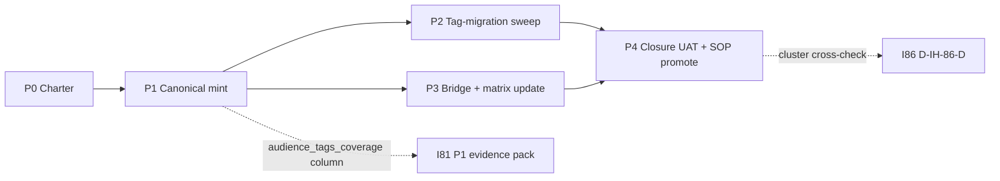

# I85 — Audience-tag canonicalization

> **Promoted candidate → active on 2026-05-16** under [I86 — Initiative Cluster Execution Coordinator](../86-initiative-cluster-execution-coordinator/master-roadmap.md) Wave 1. Spawned by I77 P4 follow-up + re-confirmed by Impeccable audit on `BASELINE_REALITY.md` (findings #7+#8+#9 collapse here). Operator framing 2026-05-16: *"brand needs to rework how to address these things, I rather have them in this initiative wired up with other jobs and initiatives properly like we did earlier"* — i.e., apply I77 P4.C wiring discipline (canonical CSV + Pydantic + validator + SOP + runbook + tests + release-gate) row-for-row to audience tagging.

## 1. Operating story

The J-* audience codes (J-IN investor, J-CU customer-SME, J-PT partner, J-ENISA reviewer, J-AD advisor, J-RC recruiter, J-CO collaborator, J-OP operator-internal) live as **prose-only** rows in [`BRAND_BASELINE_REALITY_MATRIX.md`](../../../docs/references/hlk/v3.0/Admin/O5-1/Marketing/Brand/canonicals/BRAND_BASELINE_REALITY_MATRIX.md). Every surface under `_assets/advops/**` and `_assets/touchpoint-kit/**` could carry `audience: <J-*>` frontmatter — but there is no canonical CSV to FK-resolve against, no validator, no migration. Impeccable infers audience from prose; mechanical FK identification would let `craft` hard-fail on `audience: <multi>` surfaces (per [`SKILL.md`](../../../.cursor/skills/impeccable/SKILL.md) line 20) AND let CI detect drift.

I85 closes the gap with the I77 P4.C wiring pattern.

## 2. Charter decisions ratified at P0 (agent-default; operator skip 2026-05-16)

| ID | Question | Verdict | Source |
|:---|:---|:---|:---|
| **D-IH-85-A** | `AUDIENCE_REGISTRY.csv` scope | **Narrow FK index** (code + name + register-side + surface examples). `BRAND_BASELINE_REALITY_MATRIX.md` stays SSOT for deep content (bridge frame + objection patterns + first-doubt trigger). Two-doc maintenance not justified | `agent_inline_default` |
| **D-IH-85-B** | Multi-audience frontmatter encoding | **YAML list** `audience: [J-IN, J-AD]`. Native, FK-resolvable, no parser ambiguity | `agent_inline_default` |
| **D-IH-85-C** | Tag-migration sweep posture | **Operator-batch-approve per file-class tranche** (advops/decks first; advops/dossiers next; touchpoint-kit/emails next). Auto-apply rejected (audience inference is judgement-heavy) | `agent_inline_default` |
| **D-IH-85-D** | `BASELINE_REALITY.md` frontmatter | **Yes — `audience: [J-OP]`** for consistency. The bridge file is itself an operator-internal surface; tagging it exercises the convention | `agent_inline_default` |
| **D-IH-85-E** | I81 absorption posture | **Sibling I-NN**, but I81 P1 evidence pack consumes `audience_tags_coverage` column from I85 P1 output (concrete inter-initiative wiring beyond a vague "absorbable by"). Different governance axis = less coupling as separate initiatives | `agent_inline_default` |

## 3. Phase shape

| Phase | Effort | Deliverable | Gate |
|:---|:---|:---|:---|
| **P0 — Charter** (this commit) | 0.5d | Folder + 6 planning files + INIT/DEC/OPS rows + INITIATIVE_DEPENDENCIES + planning README | inline-ratify (canonical-CSV gate; row-content review) |
| **P1 — Canonical mint** | 1d | `AUDIENCE_REGISTRY.csv` (8 seed rows) + `akos/hlk_audience_csv.py` Pydantic + `scripts/validate_audience_registry.py` + `tests/test_audience_registry.py` + `CANONICAL_REGISTRY.csv` 2 rows + `SOP-AUDIENCE_TAG_GOVERNANCE_001.md` at `status: review` | **operator approval** (canonical CSV gate; row-content review) |
| **P2 — Tag-migration sweep** | 1d | `scripts/audience_tag_assets.py` runbook + `scripts/validate_audience_tags.py` drift gate; sweep advops + touchpoint-kit surfaces per D-IH-85-C tranches | operator approval per tranche |
| **P3 — Bridge + matrix update** | 0.5d | `BASELINE_REALITY.md` frontmatter `audience: [J-OP]` + concrete frontmatter example; `BRAND_BASELINE_REALITY_MATRIX.md` §"Multi-audience composition recipe" (addresses Impeccable audit finding #9) | inline-ratify |
| **P4 — Closure UAT + SOP promotion** | 0.5d | `release-gate.py` 8/8 + `validate_hlk` PASS; closure UAT; CHANGELOG; SOP promoted `review → active`; I86 D-IH-86-D cross-check | operator approval |
| **Total** | **~3.5d** | | |

## 4. Phase-dependency diagram

## 5. Wiring (the "wired up with other jobs" requirement)

| Inter-initiative wire | Direction | Realisation |
|:---|:---|:---|
| **I85 P1 → I81 P1** | `audience_tags_coverage` column flows into `kb-integrity-matrix-<date>.csv` | Column added by I81 P1 after I85 P1 mint; sequencing forced by `INITIATIVE_DEPENDENCIES.md` edge |
| **I85 P2 → Impeccable `/craft`** | `audience` frontmatter lets `craft` hard-fail multi-audience surfaces per skill line 20 | Skill already supports the check; I85 P2 surfaces the data |
| **I85 P3 → I77 P4.C precedent** | Same wiring pattern (canonical + Pydantic + validator + SOP + runbook + tests + CANONICAL_REGISTRY) | I85 mirrors row-for-row |
| **I85 forward → I74** | Audience-aware rendering variants when TRIGGER-2 fires | `audience: [J-IN, J-AD]` becomes per-audience render dispatcher input |

## 6. Asset classification (per [`PRECEDENCE.md`](../../../docs/references/hlk/v3.0/Admin/O5-1/People/Compliance/canonicals/PRECEDENCE.md))

- **Canonical** (P1): `AUDIENCE_REGISTRY.csv`, `SOP-AUDIENCE_TAG_GOVERNANCE_001.md`, `CANONICAL_REGISTRY.csv` (2 row appends), `INITIATIVE_REGISTRY.csv` + `DECISION_REGISTER.csv` + `OPS_REGISTER.csv` (P0 rows).
- **Canonical modifications** (P3): `BRAND_BASELINE_REALITY_MATRIX.md` (§"Multi-audience composition recipe").
- **Mirrored / derived**: Supabase `compliance.audience_registry_mirror` (post P1; via `sync_compliance_mirrors_from_csv.py`).
- **Reference** (operator-local): `BASELINE_REALITY.md` (frontmatter update P3); `_assets/advops/**` and `_assets/touchpoint-kit/**` surfaces (frontmatter additions P2 per tranche).
- **Engineering surface** (governed by [`CONTRIBUTING.md`](../../../CONTRIBUTING.md)): `akos/hlk_audience_csv.py`, `scripts/validate_audience_registry.py`, `scripts/validate_audience_tags.py`, `scripts/audience_tag_assets.py`, `tests/test_audience_registry.py`.

## 7. Risk register (preview; full at [`risk-register.md`](risk-register.md))

| ID | Risk | Likelihood | Impact | Mitigation |
|:---|:---|:---|:---|:---|
| **R-IH-85-1** | Tag-migration sweep mis-classifies a surface's audience and lands as `audience: J-IN` when correct is `J-CU` | M | M | P2 operator-batch-approve per tranche (D-IH-85-C); pre-tranche dry-run report surfaces inferences for review |
| **R-IH-85-2** | `BRAND_BASELINE_REALITY_MATRIX.md` adds a new J-* row that drifts from `AUDIENCE_REGISTRY.csv` | L | M | P1 SOP names matrix as SSOT for additions; P3 multi-audience recipe references matrix; drift gate covers code-level FK; periodic review at I81 P1 |
| **R-IH-85-3** | Multi-audience encoding `audience: [J-IN, J-AD]` confuses downstream consumers expecting string | L | L | P1 Pydantic validator + P2 drift gate enforce list; D-IH-85-B sets precedent; tests cover both single + multi |
| **R-IH-85-4** | I85 P2 sweep stalls because tranche operator-approval bandwidth exceeds 1d budget | M | L | Phase split P2-a (advops) and P2-b (touchpoint-kit) acceptable; D-IH-85-C explicitly anticipates multi-tranche pacing |
| **R-IH-85-5** | I81 P1 evidence pack ships before I85 P1 mint, breaking the forward-link wire | L | M | `INITIATIVE_DEPENDENCIES.md` records the hard sequence; I86 D-IH-86-D mechanical cross-check verifies before I81 P1 closes |

## 8. Cross-references

- **Cluster coordinator**: [`86-initiative-cluster-execution-coordinator/master-roadmap.md`](../86-initiative-cluster-execution-coordinator/master-roadmap.md).
- **Origin**: [I77 P4 follow-up](../77-impeccable-brand-bridge-refresh/reports/p4-brand-canon-collapse-remediation-2026-05-16.md) + UAT §7 item #1 + Impeccable audit findings #7+#8+#9.
- **Sibling**: [I81 — Vault integrity sweep + layout migration + named-milestone schema](../_candidates/i81-full-vault-sop-addendum-retrofit.md) (forward-link wire P1 → P1).
- **Pattern precedent**: I77 P4.C [`RENDERING_PIPELINE_REGISTRY.csv`](../../../docs/references/hlk/v3.0/Envoy%20Tech%20Lab/canonicals/dimensions/RENDERING_PIPELINE_REGISTRY.csv) + [`SOP-RENDERING_PIPELINE_GOVERNANCE_001.md`](../../../docs/references/hlk/v3.0/Envoy%20Tech%20Lab/canonicals/SOP-RENDERING_PIPELINE_GOVERNANCE_001.md) — mirror row-for-row.
- **Brand canonical**: [`BRAND_BASELINE_REALITY_MATRIX.md`](../../../docs/references/hlk/v3.0/Admin/O5-1/Marketing/Brand/canonicals/BRAND_BASELINE_REALITY_MATRIX.md).
- **Decision log** (full rationale): [`decision-log.md`](decision-log.md).
- **Files modified** (per-commit traceability): [`files-modified.csv`](files-modified.csv).
- **Governing rules**: [`akos-executable-process-catalog.mdc`](../../../.cursor/rules/akos-executable-process-catalog.mdc) Rule 1 + 2; [`akos-holistika-operations.mdc`](../../../.cursor/rules/akos-holistika-operations.mdc) §"New git-canonical compliance registers"; [`akos-brand-baseline-reality.mdc`](../../../.cursor/rules/akos-brand-baseline-reality.mdc).

## 9. Closure criteria

- All four phases land per shape table.
- `AUDIENCE_REGISTRY.csv` has 8 seed rows; FK gates green.
- ~50-100 surfaces under `_assets/advops/**` + `_assets/touchpoint-kit/**` carry `audience: [...]` frontmatter (per tranche operator approval).
- `BRAND_BASELINE_REALITY_MATRIX.md` §"Multi-audience composition recipe" present.
- `BASELINE_REALITY.md` has `audience: [J-OP]` frontmatter + concrete example.
- `SOP-AUDIENCE_TAG_GOVERNANCE_001.md` at `status: active`.
- I86 D-IH-86-D mechanical cross-check PASS.
- `INIT-OPENCLAW_AKOS-85` flipped `active → closed`.
