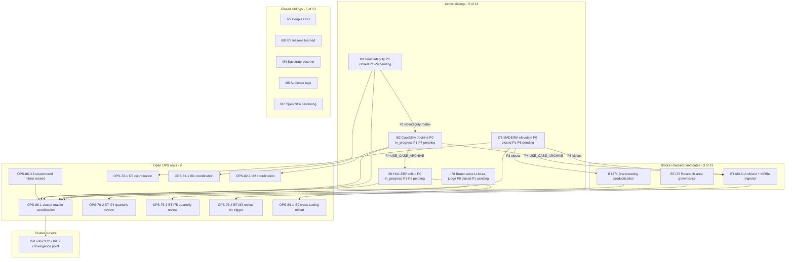
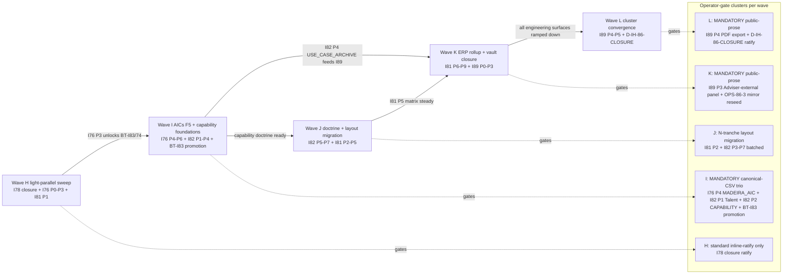
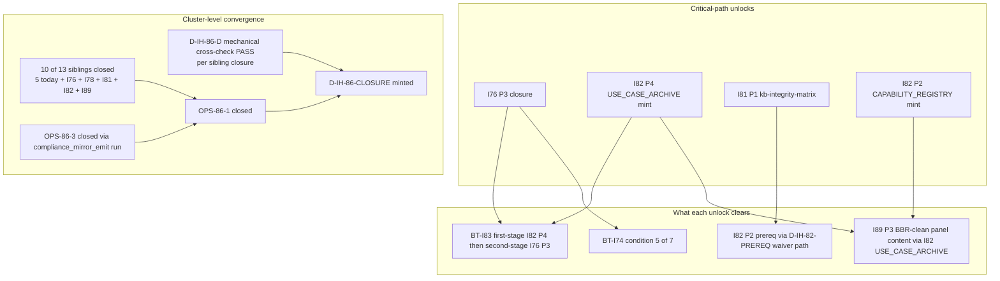

# I86 cluster — burndown orchestration plan (B-G3b authoring pass)

## §1 Purpose + scope

This plan orchestrates the **coordinated closure path** for the remaining I86 cluster workload — turning the [B-G3a anchored inventory](cluster-burndown-inventory.md) (commit [`6253260`](https://github.com/FraysaXII/openclaw-akos/commit/6253260); 17 items) into a wave-sequenced execution shape with explicit dependency gating, canonical-CSV pause-point clustering, operator-batched ratify cadence, and a named convergence point at **D-IH-86-CLOSURE**. **In scope**: the 17 inventory items (5 active initiatives [I76 / I78 / I81 / I82 / I89] + 3 blocker-trackers [BT-I74 / BT-I75 / BT-I83] + 9 OPS rows [OPS-86-1 / OPS-86-3 / OPS-76-1..4 / OPS-81-1 / OPS-82-1 / OPS-89-1]) plus the I86-level [`D-IH-86-CLOSURE`](../../../references/hlk/v3.0/Admin/O5-1/People/Compliance/canonicals/DECISION_REGISTER.csv) decision that the plan converges on. **Out of scope**: anything not already chartered as of `6253260` — sibling initiatives still in `_candidates/` (e.g. `i86-` redirect stub) are not touched here; new architectural work surfaced mid-burn becomes a forward-charter to a successor initiative per [`akos-conflict-surfacing-and-blocker-trackers.mdc`](../../../../.cursor/rules/akos-conflict-surfacing-and-blocker-trackers.mdc) decision tree rather than a Wave scope-creep.

## §2 Inventory reference + delta

This plan is **anchored to** [`cluster-burndown-inventory.md`](cluster-burndown-inventory.md) (commit [`6253260`](https://github.com/FraysaXII/openclaw-akos/commit/6253260)) as its source-of-truth for **per-row status, owner, effort, dependencies, closure criteria, and operator-gate requirements**. The plan body deliberately does **not** duplicate the inventory tables — readers walk from a Wave §6 sub-section back to the inventory row for the underlying evidence.

**Delta since `6253260`**: none. This authoring pass lands in the same chat session as the inventory; no sibling status, OPS row, or blocker-tracker state has shifted. Future plan revisions (Round 2 / Round 3) update this section per [`akos-planning-traceability.mdc`](../../../../.cursor/rules/akos-planning-traceability.mdc) §"Round-expansions narrative".

## §3 Architecture mermaid — cluster as dependency graph

**Reading guide**: closed siblings are visual context only (no edges in or out — they already cleared the cluster). Active siblings are the engineering surface. Blocker-trackers are governance-shape artifacts that do not produce engineering work themselves but absorb operator review attention at promotion-trigger time. OPS rows are PMO-side coordination shells that absorb the cross-initiative facilitation cost. The cluster closes when [OPS-86-1](../../../references/hlk/v3.0/Admin/O5-1/People/Compliance/canonicals/OPS_REGISTER.csv) flips to `closed` and `D-IH-86-CLOSURE` mints.

## §4 Phase dependency mermaid — Wave H..L closure sequence

**Reading guide**: solid arrows are hard dependencies (Wave N cannot begin until Wave N-1's named milestone closes). Dotted arrows surface where each Wave's operator-pause concentration lands so operator capacity planning is legible upfront. Wave I is the **highest operator-pause density** wave (3 MANDATORY canonical-CSV pauses + 1 promotion-trigger ratify); Wave J is the **highest engineering-tranche density** wave (I81 P2 may split into N layout-migration tranches per `D-IH-81-G`).

## §5 Sub-component mermaid — closure-criteria → unlock graph

**Reading guide**: this view answers "which milestone unlocks the most downstream work?". Per the inventory §3 cross-cutting observation, the answer is **I76 P3 closure** (unlocks 2 blocker-trackers — BT-I83 via AICs F5 substrate, BT-I74 via condition #5) followed by **I82 P4 closure** (unlocks BT-I83 first-stage + I89 P3 content). Together these two milestones are the **2-of-many leverage points** for shrinking the cluster faster than linear. Both land inside Wave I per §6.

## §6 Wave H..L proposed structure

**Executive call recorded (1 of 3) — Wave count + composition.**

- **Decision**: 5 waves (Wave H, I, J, K, L), sibling-parallel-where-safe-but-paced (not strict serial; not fully concurrent across all 5 active siblings).
- **Alternatives considered**: (a) **3 waves** (fewer-bigger) — would force I76 + I81 + I82 + I78 + I89 into 1.7d-each blocks which collides with the I81 N-tranche pause density and overloads any single operator-ratify batch. (b) **8+ waves** (more-smaller) — gains incremental visibility but multiplies the inline-ratify gates beyond the operator-batched-cadence per axis 3 executive call below. (c) **Sibling-parallel-then-converge** (1 wave per sibling + 1 convergence wave) — clean in theory but stalls every wave on the heaviest sibling's slowest phase.
- **Rationale**: 5 waves matches the **critical-path shape** (Wave I is the high-leverage milestone wave because I76 P3 + I82 P4 + BT-I83 promotion converge there); allows I78 to close fast in Wave H without dragging the heavier siblings; lets I81 absorb across J + K without single-wave overload; keeps Wave L lean for the convergence ratify.
- **Reverse-with-one-diff**: change the section count below by editing the `### Wave N` headers — merging L + K into a single Wave-K closure drops the count to 4; splitting I81 P2's N-tranche pauses out of Wave J into a dedicated Wave Ja adds a 6th. The plan-body shape is robust to ±1 wave count without rewrite.

**Executive call recorded (2 of 3) — Closure-criteria sharpness.**

- **Decision**: **pragmatic** — closure criteria for I86 cluster require the original 10 named siblings + I89 (forward-chartered from I86 P3 per `D-IH-86-N`) reaching `status: closed`, with explicit OK to forward-charter any **closure UAT** (e.g. I76 P6 closure UAT, I82 P7 closure UAT) to a successor initiative if operator-cadence permits at the time. Strict (every UAT inline) would extend the cluster window weeks beyond engineering close; staged (close I86 at engineering done, defer UAT to a successor I-NN) creates an incoherent closure framing per `D-IH-86-CLOSURE`.
- **Alternatives considered**: (a) **strict** — every named UAT, every browser-smoke, every dimension-checklist row PASS before close. (b) **staged** — close cluster at engineering-done; mint successor cleanup initiative.
- **Rationale**: pragmatic matches the I84 / I85 / I87 closure precedent (closure UAT PASS recorded inline; D-IH-XX-CLOSURE minted same commit; forward-enhancements deferred via explicit reports under `reports/`).
- **Reverse-with-one-diff**: edit §10 closure-criteria bullet 4 to remove the "or explicitly forward-chartered" clause for strict, or add a `D-IH-86-STAGED-CLOSE` decision row to §7 for staged.

**Executive call recorded (3 of 3) — Operator-pause budget realism.**

- **Decision**: **operator-batched cadence** — pauses cluster at wave boundaries (per [`akos-agent-checkpoint-discipline.mdc`](../../../../.cursor/rules/akos-agent-checkpoint-discipline.mdc) "Allow batched approvals"); 1 mega-batch ratify gate per wave at wave-closure pause-record + soft inline-ratify gates within wave for items where pause-record is non-MANDATORY. Daily would saturate operator bandwidth (per inventory §3 PMO bandwidth observation + R-IH-86-1 risk); weekly would extend the cluster window beyond planned 7-9 calendar weeks.
- **Alternatives considered**: (a) **daily** — too many ratify gates; pause-fatigue risk per `akos-agent-checkpoint-discipline.mdc`. (b) **weekly** — operator-visible cadence but undersamples for the canonical-CSV gate concentration in Wave I + J.
- **Rationale**: matches the existing I86 cadence per `D-IH-86-B` (event-driven pulse + 14-day quiet floor) — wave-batched is the natural shape one level above the event pulse.
- **Reverse-with-one-diff**: edit the **Pause-point classification** row of any per-wave table below to "daily" or "weekly".

---

### Wave H — light-parallel sweep (effort: 4-7d calendar; 1 pause-record)

**Scope**

- Close [I78](../78-brand-voice-llm-as-judge/master-roadmap.md) P1 + closure UAT (lightest active sibling; 3-5d engineering; no canonical-CSV gates).
- Advance [I76](../76-madeira-elevation/master-roadmap.md) P0 → P3 (charter already closed at `D-IH-76-A`; P1 5-mode parity SOPs + P2 rules/hooks/skills/MCPs + P3 operator UX SOPs all sit before the MADEIRA_AIC canonical-CSV gate at P4).
- Land [I81](../81-vault-integrity-layout-milestones-retrofit/master-roadmap.md) P1 vault-integrity baseline matrix (gates I82 P2 via `D-IH-82-PREREQ` waiver path; standard inline-ratify at close).

**Effort**: 4-7d calendar (I78 3-5d sequential; I76 P1-P3 parallel under System Owner; I81 P1 parallel under PMO). Wave duration is governed by I78 closure since I76 P1-P3 + I81 P1 can both run as background-parallel.

**Dependencies (entry)**

- I78 P0 closed (already done; `D-IH-78-A`).
- I76 P0 closed (already done; `D-IH-76-A`); scope-overlap-tracker live at [`docs/wip/planning/_trackers/i11-i13-i17-scope-overlap-tracker.md`](../_trackers/i11-i13-i17-scope-overlap-tracker.md).
- I81 P0 closed (already done; `D-IH-81-A..E + H`); I85 P1 closed (provides `audience_tags_coverage` column).

**Pause-point classification**

- **1 pause-record** at wave closure: standard inline-ratify (no MANDATORY canonical-CSV gate fires in Wave H scope).
- I78 closure ratify carries optional `D-IH-78-CLOSURE` mint if operator chooses to formally close P1-only; alternative defers to a later "I78 strict-mode promotion" phase under sibling charter.
- I76 P1 → P2 → P3 phase boundaries use standard inline-ratify (per [`akos-inline-ratification.mdc`](../../../../.cursor/rules/akos-inline-ratification.mdc)) for scope-overlap-tracker consolidation gates with I11/I13/I17.

**Inline-ratify gates planned**

- 3 gates: I76 P1 entry (I11 consolidation framing), I76 P3 entry (I13 + I17 consolidation framing), I78 P1 → closure transition.

**Self-checkpoint count**

- 4: pre-Wave-H entry + mid-I76-P2 + pre-I78-closure + Wave-H closure pause-record.

**Cursor-rules adherence**

- [`akos-planning-traceability.mdc`](../../../../.cursor/rules/akos-planning-traceability.mdc) §"Plan-quality bar" — followed by this plan body.
- [`akos-inline-ratification.mdc`](../../../../.cursor/rules/akos-inline-ratification.mdc) — used for the 3 scope-overlap-tracker consolidation gates.
- [`akos-agent-checkpoint-discipline.mdc`](../../../../.cursor/rules/akos-agent-checkpoint-discipline.mdc) §"Pause-point depth heuristic" — applied (4-6 phases per sibling pass → 1 pause-record at wave closure).

**Closes / opens**

- Closes: I78 P1 + I78 closure (if operator ratifies); I76 P1 + P2 + P3; I81 P1.
- Opens nothing new — all activity is sibling-internal phase progression.

---

### Wave I — AICs F5 substrate + capability foundations (effort: 8-12d calendar; 4 pause-records including MANDATORY canonical-CSV trio + BT-I83 promotion)

**Scope**

- Close [I76](../76-madeira-elevation/master-roadmap.md) P4 (MADEIRA_AIC_PER_TASK_REGISTRY mint — **MANDATORY canonical-CSV pause**) + P5 + P6 closure UAT.
- Advance [I82](../82-holistika-capability-doctrine/master-roadmap.md) P1 (Talent activation in `baseline_organisation.csv` — **MANDATORY canonical-CSV pause**) + P2 (`CAPABILITY_REGISTRY` mint — **MANDATORY canonical-CSV pause**) + P3 + P4 (`USE_CASE_ARCHIVE` mint).
- **Promote** [BT-I83](../_blockers/i83-promotion-blocker-tracker.md) to active (both blocker conditions cleared this wave: I82 P4 USE_CASE_ARCHIVE + I76 P3 already closed in Wave H); mint INIT-OPENCLAW_AKOS-83 row in [`INITIATIVE_REGISTRY.csv`](../../../references/hlk/v3.0/Admin/O5-1/People/Compliance/canonicals/INITIATIVE_REGISTRY.csv) + D-IH-83-A inception decision + archive BT-I83 tracker.
- **Promote** [BT-I74](../_blockers/i74-promotion-blocker-tracker.md) if conditions resolve (I71/I72/I73 closure + Founder + Brand Manager approval) — defer to BT-I74 forward-charter if conditions not met by Wave I close.

**Effort**: 8-12d calendar. I76 P4-P6 sequential under System Owner (canonical-CSV pause at P4 dominates); I82 P1-P4 sequential under PMO co-owned with Brand & Narrative Manager (3 canonical-CSV pauses dominate). BT-I83 promotion is single-day if conditions met at wave close.

**Dependencies (entry)**

- Wave H complete (I76 P3 closed + I81 P1 matrix available).
- Operator capacity for the **3 MANDATORY canonical-CSV pauses + BT-I83 promotion ratify** clustered in this wave (operator-batched cadence per axis-3 call above).

**Files (canonical CSV touched + new SSOT minted)**

- [`docs/references/hlk/v3.0/Admin/O5-1/People/Compliance/canonicals/MADEIRA_AIC_PER_TASK_REGISTRY.csv`](../../../references/hlk/v3.0/Admin/O5-1/People/Compliance/canonicals/) (NEW; I76 P4).
- [`docs/references/hlk/v3.0/Admin/O5-1/People/Compliance/canonicals/baseline_organisation.csv`](../../../references/hlk/v3.0/Admin/O5-1/People/Compliance/canonicals/baseline_organisation.csv) (MODIFIED; Talent activation row; I82 P1).
- [`docs/references/hlk/v3.0/Admin/O5-1/People/Compliance/canonicals/dimensions/CAPABILITY_REGISTRY.csv`](../../../references/hlk/v3.0/Admin/O5-1/People/Compliance/canonicals/dimensions/) (NEW; I82 P2; also CAPABILITY_CONFIDENCE_REGISTRY + USE_CASE_ARCHIVE per `D-IH-82-A..F`).
- [`docs/references/hlk/v3.0/Admin/O5-1/People/Compliance/canonicals/INITIATIVE_REGISTRY.csv`](../../../references/hlk/v3.0/Admin/O5-1/People/Compliance/canonicals/INITIATIVE_REGISTRY.csv) (MODIFIED; INIT-OPENCLAW_AKOS-83 row + INIT-OPENCLAW_AKOS-74 row if BT-I74 conditions clear).
- New validators forward-chartered per sibling plans: `validate_madeira_aic_per_task_registry.py` (I76 P4); `validate_capability_registry.py` + `validate_capability_confidence_registry.py` + `validate_use_case_archive.py` (I82 P2-P4).

**Pause-point classification**

- **4 pause-records** in this wave:
  - **P-I.1 MANDATORY canonical-CSV**: I76 P4 MADEIRA_AIC mint (per [`akos-agent-checkpoint-discipline.mdc`](../../../../.cursor/rules/akos-agent-checkpoint-discipline.mdc) canonical-CSV gate category).
  - **P-I.2 MANDATORY canonical-CSV**: I82 P1 Talent activation in `baseline_organisation.csv`.
  - **P-I.3 MANDATORY canonical-CSV**: I82 P2 CAPABILITY_REGISTRY mint.
  - **P-I.4 standard**: Wave-I closure ratify + BT-I83 promotion verdict + (conditional) BT-I74 promotion verdict.

**Inline-ratify gates planned**

- 5 gates: I76 P4 mint shape (per-task registry column set), I76 P6 closure UAT verdict, I82 P3 verdict (per-capability confidence baseline), I82 P4 USE_CASE_ARCHIVE seed-row set, BT-I83 promotion (both conditions cleared → INIT row mint).

**Self-checkpoint count**

- 6: pre-Wave-I + pre-I76-P4 (canonical-CSV) + pre-I82-P1 (canonical-CSV) + mid-I82-P2 + pre-BT-I83-promotion + Wave-I closure.

**Cursor-rules adherence**

- [`akos-governance-remediation.mdc`](../../../../.cursor/rules/akos-governance-remediation.mdc) §"HLK compliance governance" — canonical-CSV gate discipline observed for all 3 MANDATORY pauses.
- [`akos-holistika-operations.mdc`](../../../../.cursor/rules/akos-holistika-operations.mdc) §"New git-canonical compliance registers" — applied to MADEIRA_AIC_PER_TASK_REGISTRY + CAPABILITY_REGISTRY mints (Pydantic chassis + validator + Supabase mirror + PRECEDENCE registration).
- [`akos-conflict-surfacing-and-blocker-trackers.mdc`](../../../../.cursor/rules/akos-conflict-surfacing-and-blocker-trackers.mdc) — BT-I83 promotion follows decision-tree "gates met → full charter" path.
- [`akos-executable-process-catalog.mdc`](../../../../.cursor/rules/akos-executable-process-catalog.mdc) RULE 1 — every new validator carries paired runbook + SOP.

**Closes / opens**

- Closes: I76 (full closure at P6); I82 P1-P4; BT-I83 (promoted to INIT-OPENCLAW_AKOS-83 active); OPS-76-1 (at I76 closure); OPS-76-4 (at BT-I83 promotion); BT-I74 conditional close.
- Opens: INIT-OPENCLAW_AKOS-83 active (new sibling joins cluster mid-burn — handled per `D-IH-86-D` cross-check; net cluster size unchanged since BT-I83 was already counted).

---

### Wave J — capability doctrine completion + vault layout migration (effort: 10-18d calendar; 1 mega-batch pause for I81 P2 N-tranche layout)

**Scope**

- Close [I82](../82-holistika-capability-doctrine/master-roadmap.md) P5 (BBR matrix §N capability-messaging extension; consumes `BRAND_BASELINE_REALITY_MATRIX.md`) + P6 + P7 (closure UAT).
- Advance [I81](../81-vault-integrity-layout-milestones-retrofit/master-roadmap.md) P2 (layout migration to I22 forward layout — **MANDATORY canonical-CSV per-tranche pause**; per `D-IH-81-G` may split into N tranches; cross-repo `hlk-erp` coordination per [`SOP-CROSS_REPO_SCHEMA_PROPAGATION_001.md`](../../../references/hlk/v3.0/Admin/O5-1/Envoy%20Tech%20Lab/Cross%20Repo/SOP-CROSS_REPO_SCHEMA_PROPAGATION_001.md)) + P3 (`validate_planning_cross_refs.py` mint) + P4 + P5 (per-area SOP retrofit waves under absorbed-mode).

**Effort**: 10-18d calendar (range driven by I81 P2 tranche count — `D-IH-81-G` permits N tranches; per inventory §3 ratify-density-risk observation, I81 P2 is the highest pause-density phase in the cluster).

**Dependencies (entry)**

- Wave I complete (I82 P4 USE_CASE_ARCHIVE shipped; capability doctrine ready for BBR §N integration in I82 P5).
- I85 audience-tag canonicalisation complete (already closed; provides J-OP frontmatter consumed by I81 P2 layout-migration tooling).

**Files (canonical CSV touched)**

- [`docs/references/hlk/v3.0/Admin/O5-1/People/Compliance/canonicals/`](../../../references/hlk/v3.0/Admin/O5-1/People/Compliance/canonicals/) and `docs/references/hlk/v3.0/_assets/<plane>/<program_id>/<topic_id>/` — per-tranche I22-layout-style migration of legacy flat-layout files (compliance/dimensions, _assets, role/programs).
- [`docs/references/hlk/v3.0/Admin/O5-1/Marketing/Brand/canonicals/BRAND_BASELINE_REALITY_MATRIX.md`](../../../references/hlk/v3.0/Admin/O5-1/Marketing/Brand/canonicals/BRAND_BASELINE_REALITY_MATRIX.md) (MODIFIED; I82 P5 §N capability-messaging extension).
- `scripts/validate_planning_cross_refs.py` (NEW; I81 P3 per inventory).

**Pause-point classification**

- **1 mega-batch pause-record** at I81 P2 N-tranche boundary with **N+1 operator approval checklists embedded** (one per tranche + one for the wave-closure rollup); per `akos-agent-checkpoint-discipline.mdc` "Allow batched approvals when phases are tightly coupled". I82 P5-P7 inline-ratify gates fold into the wave-closure pause-record.
- Soft-pause auto-clear permitted for per-pair retrofit work at I81 P4-P5 under absorbed-mode (per inventory §3 pause-fatigue avoidance observation).

**Inline-ratify gates planned**

- 4 gates: I82 P5 BBR §N integration scope, I82 P7 closure UAT verdict, I81 P3 validator-mint scope, I81 P5 mid-absorbed-retrofit checkpoint.

**Self-checkpoint count**

- 6: pre-Wave-J + per-tranche-pre-I81-P2 (rolling; one per tranche) + mid-I82-P5 + pre-I82-closure-UAT + Wave-J closure.

**Cursor-rules adherence**

- [`akos-holistika-operations.mdc`](../../../../.cursor/rules/akos-holistika-operations.mdc) §"Inventory-before-greenfield" — I81 P2 follows two-plane Supabase model (DDL via supabase/migrations + mirror data via `compliance_mirror_emit`).
- [`akos-brand-baseline-reality.mdc`](../../../../.cursor/rules/akos-brand-baseline-reality.mdc) — I82 P5 BBR §N extension respects dual-register contract (capability messaging in external register + internal register both).
- [`akos-mirror-template.mdc`](../../../../.cursor/rules/akos-mirror-template.mdc) — I81 P2 cross-repo `hlk-erp` carries AKOS-as-SSOT.

**Closes / opens**

- Closes: I82 (full closure at P7); I81 P2-P5; OPS-82-1 (at I82 closure).
- Opens nothing new.

---

### Wave K — vault closure + ERP rollup launch (effort: 12-20d calendar; 1 MANDATORY public-prose pause-record + 1 mirror-reseed operator pause)

**Scope**

- Close [I81](../81-vault-integrity-layout-milestones-retrofit/master-roadmap.md) P6 + P7 + P8 (per-area retrofit absorbed-mode continuation) + P9 closure UAT (vault integrity matrix PASS ≥ 95%).
- Advance [I89](../89-hlk-erp-program-rollup-implementation/master-roadmap.md) P0 (charter) + P1 (RLS + JWT-claim wiring for all 6 personas) + P2 (TSX scaffolds for all 6 routes) + P3 (Adviser-external REDACTED panel — **MANDATORY public-prose pause-record** per `D-IH-89-C` cadence).
- Close [OPS-86-3](../../../references/hlk/v3.0/Admin/O5-1/People/Compliance/canonicals/OPS_REGISTER.csv) (8 unanchored INIT mirror-reseed via `compliance_mirror_emit` — **MANDATORY canonical-CSV operator pause** per [`akos-holistika-operations.mdc`](../../../../.cursor/rules/akos-holistika-operations.mdc) two-plane model).

**Effort**: 12-20d calendar (I89 cross-repo bless cadence + I81 absorbed-mode tail co-dominant; OPS-86-3 mirror-reseed is single-day operator action with pre-staged emit artefact).

**Dependencies (entry)**

- Wave J complete (I82 closure provides `USE_CASE_ARCHIVE` content for I89 P3 panel scaffolding).
- I81 P5 stable (matrix at steady ≥ 95% PASS).

**Files (canonical CSV touched + cross-repo)**

- [`docs/references/hlk/v3.0/Admin/O5-1/People/Compliance/canonicals/INITIATIVE_REGISTRY.csv`](../../../references/hlk/v3.0/Admin/O5-1/People/Compliance/canonicals/INITIATIVE_REGISTRY.csv) (MODIFIED; 8 unanchored INIT rows gain `program_anchors` via mirror reseed; closes OPS-86-3).
- Sibling [`hlk-erp/app/(operator)/operations/pmo/program-rollup/`](https://github.com/FraysaXII/hlk-erp/tree/main/app) (NEW; I89 P0-P2 cross-repo TSX routes — 5 internal personas + Adviser-external scaffolding).
- [`docs/references/hlk/v3.0/Admin/O5-1/Operations/PMO/canonicals/HLK_ERP_ARCHITECTURE.md`](../../../references/hlk/v3.0/Admin/O5-1/Operations/PMO/canonicals/HLK_ERP_ARCHITECTURE.md) (MODIFIED; route-by-route activation notes per I89 P0-P3).

**Pause-point classification**

- **2 pause-records** in this wave:
  - **P-K.1 MANDATORY canonical-CSV**: OPS-86-3 mirror-reseed apply via operator MasterData run.
  - **P-K.2 MANDATORY public-prose**: I89 P3 Adviser-external REDACTED panel scope (per `akos-agent-checkpoint-discipline.mdc` public-prose category; per `D-IH-89-C` cadence; per `D-IH-86-K` six-persona contract).
- I81 closure UAT folds into wave-closure standard inline-ratify (no MANDATORY trigger).

**Inline-ratify gates planned**

- 4 gates: I81 P9 closure UAT verdict, I89 P1 RLS-policy scope (per `D-IH-89-C` §P1.7), I89 P2 component-shape ratify (per `D-IH-89-C` §P2.6), I89 P3 redaction-matrix scope.

**Self-checkpoint count**

- 6: pre-Wave-K + pre-OPS-86-3-apply + pre-I89-P0-charter + mid-I89-P2 + pre-I89-P3-public-prose + Wave-K closure.

**Cursor-rules adherence**

- [`akos-mirror-template.mdc`](../../../../.cursor/rules/akos-mirror-template.mdc) — I89 cross-repo carries AKOS-as-SSOT for INITIATIVE_REGISTRY + PROGRAM_REGISTRY mirrors.
- [`akos-brand-baseline-reality.mdc`](../../../../.cursor/rules/akos-brand-baseline-reality.mdc) — I89 P3 Adviser-external REDACTED rendering follows dual-register contract.
- [`akos-external-render-discipline.mdc`](../../../../.cursor/rules/akos-external-render-discipline.mdc) — I89 P4 Adviser-external PDF export (forward-chartered to Wave L) follows 6-surface enum.
- [`akos-holistika-operations.mdc`](../../../../.cursor/rules/akos-holistika-operations.mdc) — OPS-86-3 follows two-plane model (mirror DML separate from DDL).

**Closes / opens**

- Closes: I81 (full closure at P9); I89 P0-P3; OPS-81-1 (at I81 closure); OPS-86-3.
- Opens nothing new.

---

### Wave L — cluster convergence (effort: 3-6d calendar; 1 MANDATORY public-prose pause + 1 cluster-closure ratify gate)

**Scope**

- Close [I89](../89-hlk-erp-program-rollup-implementation/master-roadmap.md) P4 (Adviser-external PDF export pipeline — **MANDATORY public-prose pause-record** per `D-IH-89-C`) + P5 closure UAT (browser-smoke evidence per `D-IH-89-CLOSURE`).
- Quarterly-review-cadence sweep on remaining blocker-trackers: [BT-I75](../_blockers/i75-promotion-blocker-tracker.md) (status check on Research Director hire + I72 + I73 closure; defer to next review if not cleared) + [BT-I74](../_blockers/i74-promotion-blocker-tracker.md) (if not cleared in Wave I; final close-or-defer decision).
- **Mint `D-IH-86-CLOSURE`** + close [OPS-86-1](../../../references/hlk/v3.0/Admin/O5-1/People/Compliance/canonicals/OPS_REGISTER.csv) + flip [INIT-OPENCLAW_AKOS-86](../../../references/hlk/v3.0/Admin/O5-1/People/Compliance/canonicals/INITIATIVE_REGISTRY.csv) `status: active → closed`.
- Author final cluster-closure UAT evidence report at `reports/uat-i86-cluster-closure-<YYYY-MM-DD>.md` per [`akos-planning-traceability.mdc`](../../../../.cursor/rules/akos-planning-traceability.mdc) §"UAT evidence contract".

**Effort**: 3-6d calendar. I89 P4-P5 sequential under tri-co-owner roster; closure-ratify gate single-day operator-batched.

**Dependencies (entry)**

- Wave K complete (I89 P3 Adviser-external panel scaffolded; I81 fully closed).
- Cluster cross-check via `D-IH-86-D` for each sibling closure recorded (per `D-IH-86-D` mechanical cross-check protocol).

**Files (canonical CSV touched)**

- [`docs/references/hlk/v3.0/Admin/O5-1/People/Compliance/canonicals/INITIATIVE_REGISTRY.csv`](../../../references/hlk/v3.0/Admin/O5-1/People/Compliance/canonicals/INITIATIVE_REGISTRY.csv) (MODIFIED; INIT-OPENCLAW_AKOS-86 status flip).
- [`docs/references/hlk/v3.0/Admin/O5-1/People/Compliance/canonicals/OPS_REGISTER.csv`](../../../references/hlk/v3.0/Admin/O5-1/People/Compliance/canonicals/OPS_REGISTER.csv) (MODIFIED; OPS-86-1 close).
- [`docs/references/hlk/v3.0/Admin/O5-1/People/Compliance/canonicals/DECISION_REGISTER.csv`](../../../references/hlk/v3.0/Admin/O5-1/People/Compliance/canonicals/DECISION_REGISTER.csv) (MODIFIED; `D-IH-86-CLOSURE` row + `D-IH-89-CLOSURE` row).

**Pause-point classification**

- **2 pause-records** in this wave:
  - **P-L.1 MANDATORY public-prose**: I89 P4 Adviser-external PDF export pipeline (per `D-IH-89-C`).
  - **P-L.2 MANDATORY cluster-closure ratify**: `D-IH-86-CLOSURE` mint + INIT-OPENCLAW_AKOS-86 status flip (per `D-IH-86-D` cross-check protocol + this plan's §10 closure criteria checklist).

**Inline-ratify gates planned**

- 3 gates: I89 P4 PDF-export tooling choice ratify, I89 P5 closure UAT verdict, cluster-closure UAT verdict (§10 checklist row-by-row).

**Self-checkpoint count**

- 5: pre-Wave-L + pre-I89-P4-public-prose + mid-I89-P5 + pre-cluster-closure-ratify + post-D-IH-86-CLOSURE.

**Cursor-rules adherence**

- [`akos-external-render-discipline.mdc`](../../../../.cursor/rules/akos-external-render-discipline.mdc) — I89 P4 PDF export carries sha256 manifest sidecar per gate-FAIL strict per `D-IH-86-Q`.
- [`akos-planning-traceability.mdc`](../../../../.cursor/rules/akos-planning-traceability.mdc) §"UAT evidence contract" — final cluster-closure UAT dated report under `reports/`.
- [`akos-conflict-surfacing-and-blocker-trackers.mdc`](../../../../.cursor/rules/akos-conflict-surfacing-and-blocker-trackers.mdc) — BT-I75 (and BT-I74 residual) sweep at wave entry follows decision-tree posture (defer-to-next-review if conditions not cleared).

**Closes / opens**

- Closes: I89 (full closure at P5); OPS-89-1; OPS-86-1; INIT-OPENCLAW_AKOS-86 (cluster orchestrator itself).
- Opens nothing — the cluster converges.

---

## §7 Decision-log preview (inline table)

| ID | Question | Owner | Status entering plan | Close-out wave | Notes |
|:---|:---|:---|:---|:---|:---|
| **D-IH-86-T** | I86 cluster burndown orchestration plan ratified — coordinates closure of I76 + I78 + I81 + I82 + I89 + 3 blocker-trackers + 9 OPS rows toward I86 cluster closure | System Owner + PMO | **NEW (this plan's ratification)** | Wave G B-G3b commit (today) | Inception decision for this plan; cites `D-IH-86-O` (Option 5 default posture) and `D-IH-86-N` (P3 sub-thread closure framing) as parent context. |
| D-IH-86-U | Wave H closure verdict — I78 closure + I76 P0-P3 + I81 P1 (PASS or DEFER) | System Owner | forward-chartered | Wave H closure | If I78 P1 ships clean and I76 P3 closes, mint `D-IH-78-CLOSURE` parallel. |
| D-IH-86-V | Wave I closure verdict — I76 closure + I82 P1-P4 + BT-I83 promotion | PMO | forward-chartered | Wave I closure | If both critical-path unlocks land, mints `D-IH-76-CLOSURE` + `D-IH-83-A` + (conditional) `D-IH-74-A`. |
| D-IH-86-W | Wave J closure verdict — I82 closure + I81 P2-P5 | PMO | forward-chartered | Wave J closure | Mints `D-IH-82-CLOSURE`. |
| D-IH-86-X | Wave K closure verdict — I81 closure + I89 P0-P3 + OPS-86-3 close | PMO | forward-chartered | Wave K closure | Mints `D-IH-81-CLOSURE` + closure of OPS-86-3 (mirror-reseed). |
| **D-IH-86-CLOSURE** | I86 cluster orchestrator closure verdict — all named siblings closed + OPS-86-1 closed + cross-check PASS | PMO + System Owner | forward-chartered | Wave L closure | The terminal decision for INIT-OPENCLAW_AKOS-86 itself; mirrors `D-IH-85-CLOSURE` + `D-IH-87-CLOSURE` shape. |

Full rationale lands at each ratification commit in [`decision-log.md`](decision-log.md) per the existing I86 cadence; this table is the inline preview per [`akos-planning-traceability.mdc`](../../../../.cursor/rules/akos-planning-traceability.mdc) §"Decision-log preview (inline table)".

## §8 Risk register preview (inline table)

| ID | Risk | Likelihood | Impact | Mitigation |
|:---|:---|:---|:---|:---|
| R-IH-86-PL-1 | Parallel-push commit collisions across 3-5 active siblings within a wave produce merge friction | medium | medium | Wave-internal serialization at canonical-CSV boundaries (operator-batched cadence per axis-3 call); use [`docs/wip/planning/86-initiative-cluster-execution-coordinator/reports/checkpoints/`](reports/checkpoints/) self-checkpoints to surface in-flight work pre-merge. |
| R-IH-86-PL-2 | Canonical-CSV operator-tranche fatigue across Wave I (3 MANDATORY pauses + 1 promotion) saturates ratify budget | high | high | Front-load Wave I pause-records into 1 mega-batch per [`akos-agent-checkpoint-discipline.mdc`](../../../../.cursor/rules/akos-agent-checkpoint-discipline.mdc) "Allow batched approvals"; soft-pause auto-clear permitted on non-MANDATORY downstream items. |
| R-IH-86-PL-3 | Blocker-tracker prematurely cleared — BT-I83 promotion happens when I82 P4 lands but I76 P3 acceptance was pro-forma; results in active sibling with hidden prerequisite gap | low | high | `D-IH-86-D` mechanical cross-check at promotion; require both conditions PASS per blocker-tracker §3; promoter signs the cross-check verdict in the promotion commit. |
| R-IH-86-PL-4 | Cross-repo coordination cost for I81 P2 (`hlk-erp` consumer paths) + I89 (full `hlk-erp` TSX) compounds — sibling-repo PRs lag behind AKOS commits | medium | medium | Use [`SOP-EXTERNAL_REPO_BLESSING_001.md`](../../../references/hlk/v3.0/Admin/O5-1/Envoy%20Tech%20Lab/External%20Repos/SOP-EXTERNAL_REPO_BLESSING_001.md) + [`SOP-CROSS_REPO_SCHEMA_PROPAGATION_001.md`](../../../references/hlk/v3.0/Admin/O5-1/Envoy%20Tech%20Lab/Cross%20Repo/SOP-CROSS_REPO_SCHEMA_PROPAGATION_001.md) cadence; sibling-repo PR opens within 1 day of AKOS-side commit. |
| R-IH-86-PL-5 | PMO bandwidth saturates — PMO owns or co-owns 13 of 17 inventory items (per inventory §3) | high | medium | Spotlight-roster facilitation per `D-IH-86-A` distributes wave-narrative cost; consider activating Talent role at I82 P1 to absorb some People-Operations-shaped facilitation. |
| R-IH-86-PL-6 | I81 P2 N-tranche layout migration count overruns plan (8-12d Wave J actual vs 10-18d planned) | medium | medium | Allow Wave Ja split per axis-1 reverse-with-one-diff if tranche count > 4; per `D-IH-81-G` operator approves each tranche so the cost is visible. |
| R-IH-86-PL-7 | Operator silence ≥ 14 days at a wave-closure pause-record auto-clears under soft-pause logic but the next wave consumes stale operator context | low | medium | Reset 14-day quiet floor per `D-IH-86-B` at each wave entry; require operator acknowledgement (commit message reference or explicit reply) within 48h of pause-record file for MANDATORY pause categories. |
| R-IH-86-PL-8 | I89 P3 + P4 MANDATORY public-prose pauses block ALL I89 work because tri-co-ownership requires 3 approval checklists per pause-record | medium | high | Per `D-IH-89-D` co-owner-coordination protocol: each pause record carries 1 checklist per role (System Owner + PMO + Brand & Narrative Manager); approvals can land in parallel; missing one for 24h triggers escalation per spotlight-role facilitation. |
| R-IH-86-PL-9 | I78 closure ratify defers indefinitely because P1 strict-mode promotion is TRIGGER-watched (bias-audit gate) — Wave H closes without I78 closure | low | low | Accept I78 "P1-engineering done; closure UAT deferred to TRIGGER fire" as a clean Wave H exit per `D-IH-78-A` posture; document in Wave H closure pause-record. |
| R-IH-86-PL-10 | New architectural conflict surfaces mid-wave (e.g. I76 P4 reveals AICs F5 contract change needed) and the plan body shape doesn't accommodate — Wave I overruns | medium | medium | Per [`akos-conflict-surfacing-and-blocker-trackers.mdc`](../../../../.cursor/rules/akos-conflict-surfacing-and-blocker-trackers.mdc) decision tree, conflicts surface as inline-ratify with 3 artifact shapes (charter / scope-overlap-tracker / blocker-tracker); don't expand this plan body — fork a successor I-NN if architecture-grade. |
| R-IH-86-PL-11 | BT-I75 conditions (Research Director hire OR I72 / I73 closure) do NOT clear by Wave L sweep, leaving the cluster with an open governance-shape artifact at closure | medium | low | Accepted: BT-I75 stays open at I86 closure as durable governance shape per `D-IH-86-O` posture; close `D-IH-86-CLOSURE` references BT-I75 as "deliberately deferred under Option 5" not "stalled". |
| R-IH-86-PL-12 | I82 P5 BBR §N capability-messaging extension hits brand-canon-collapse failure (collapse to single register) and BBR validator FAILs Wave J entry | low | high | Per [`akos-brand-baseline-reality.mdc`](../../../../.cursor/rules/akos-brand-baseline-reality.mdc) §"Self-discipline rules" the dual-register structure must be preserved; pre-flight I82 P5 self-checkpoint includes BBR validator dry-run; if fail, defer P5 to a self-checkpoint cycle rather than escalating to scope change. |

Full register lives at [`risk-register.md`](risk-register.md) — this table is the inline preview per [`akos-planning-traceability.mdc`](../../../../.cursor/rules/akos-planning-traceability.mdc) §"Inline risk register".

## §9 CONTRIBUTING.md adherence callouts

This plan does **not** mint new validators directly — every validator referenced (`validate_madeira_aic_per_task_registry.py` for I76 P4; `validate_capability_registry.py` + `validate_capability_confidence_registry.py` + `validate_use_case_archive.py` for I82 P2-P4; `validate_planning_cross_refs.py` for I81 P3) is owned by the **sibling initiative's plan**, not this orchestration plan. Each sibling's plan is responsible for [`CONTRIBUTING.md`](../../../../CONTRIBUTING.md) §"Python Code Standards" adherence: Pydantic models in `akos/<module>.py`; type hints; structured logging via `akos.log.setup_logging`; `akos.process.run` for subprocess shell-out; cross-platform `pathlib.Path` + `os.environ`; tests in `tests/test_<module>.py` registered under appropriate `@pytest.mark.<group>`; wired into [`scripts/release-gate.py`](../../../../scripts/release-gate.py) and [`config/verification-profiles.json`](../../../../config/verification-profiles.json) per [`CONTRIBUTING.md`](../../../../CONTRIBUTING.md) §"Pre-commit Checklist".

This plan's own scope-of-engineering is **zero scripts** — the plan body, decision-log row, files-modified.csv update, and CHANGELOG entry are the entire deliverable. Future Round-N revisions of this plan that mint new validators in support of cluster-orchestration tooling (e.g. a hypothetical `validate_cluster_burndown_state.py`) would inherit the same adherence contract; this plan does not envision such tooling.

## §10 Closure criteria for I86 cluster

I86 cluster orchestrator (INIT-OPENCLAW_AKOS-86) flips from `status: active` → `status: closed` in [`INITIATIVE_REGISTRY.csv`](../../../references/hlk/v3.0/Admin/O5-1/People/Compliance/canonicals/INITIATIVE_REGISTRY.csv) **when ALL the following are true** (operator-ratified at Wave L closure pause-record):

1. **Original 10 named siblings (per I86 charter title)** all `status: closed` in `INITIATIVE_REGISTRY.csv`:
   - **Closed today** (5 of 10 originals): I84 + I85 + I87 (in-cluster closures Bundle D Wave B+C) + I79 + I80 (retro-counted closed siblings)... wait — **see Q2 reconciliation below**.
2. **Forward-chartered sibling I89** `status: closed` (per `D-IH-86-N` forward-charter from I86 P3; I89 is part of the cluster scope even though not in the original 10 title).
3. **Open OPS rows scoped to this cluster** all `status: closed`: OPS-86-1 (master coordination); OPS-86-3 (mirror reseed); OPS-76-1..4 (I76 + blocker-tracker review cadence); OPS-81-1; OPS-82-1; OPS-89-1.
4. **Closure UAT** evidence dated under [`reports/uat-i86-cluster-closure-<YYYY-MM-DD>.md`](reports/) per [`akos-planning-traceability.mdc`](../../../../.cursor/rules/akos-planning-traceability.mdc) §"UAT evidence contract" — or **explicitly forward-chartered** to a successor initiative per the §6 axis-2 pragmatic-closure executive call.
5. **`D-IH-86-D` mechanical cross-check** recorded for **each** sibling closure (per `D-IH-86-D` protocol; the cross-check is what gates each individual sibling close, not the cluster close).
6. **Blocker-tracker disposition**: BT-I74 + BT-I75 + BT-I83 each either (a) promoted to active (mint INIT row + archive tracker) or (b) deliberately deferred under [`akos-conflict-surfacing-and-blocker-trackers.mdc`](../../../../.cursor/rules/akos-conflict-surfacing-and-blocker-trackers.mdc) Option 5 default posture (tracker stays open; cluster closes around it; condition-trigger cadence continues post-cluster-close).
7. **`D-IH-86-CLOSURE`** decision row minted in [`DECISION_REGISTER.csv`](../../../references/hlk/v3.0/Admin/O5-1/People/Compliance/canonicals/DECISION_REGISTER.csv) at the closure commit with `decision_class: closure`.

---

**Resolution of inventory Q1 (I78 effort scoping)** — RESOLVED. I78 [`master-roadmap.md`](../78-brand-voice-llm-as-judge/master-roadmap.md) §"Phase posture" confirms P0 closed; P1 is Pydantic judge chassis + CLI + provider abstraction + caching (3-5d engineering); P2 release-gate `INFO` row + tests; P3 bias-audit cadence; P4 strict-mode promotion ratify; P5 closure UAT. The cluster burndown closes **I78 P1 + P2** within Wave H (the engineering surface); **P3-P5** stays TRIGGER-watched per `D-IH-78-A` and **does not gate the cluster** per the §6 axis-2 pragmatic-closure executive call — I78 closure UAT (`D-IH-78-CLOSURE`) can mint when bias-audit gate fires AND strict-mode promotion ratifies, which may be inside or outside the cluster window. For cluster-close purposes, "I78 `status: closed` in INITIATIVE_REGISTRY" can mean either (a) full P1-P5 done OR (b) "P1-P2 done; P3-P5 forward-chartered to a strict-mode-promotion follow-up; row flipped `closed` with a closure note citing this plan's pragmatic-closure stance".

**Resolution of inventory Q2 (retro-count discrepancy)** — RESOLVED. The original I86 charter title lists **10 siblings**: I81 + I84 + I85 + I82 + I83 + I74 + I75 + I76 + I87 + I78. The [I86 master-roadmap](master-roadmap.md) §1.5 says "5 of 10 cluster siblings closed: I79 + I80 + I84 + I85 + I87" — but I79 + I80 were not in the original title. They are **retro-counted as closed because they were in the broader cluster context at the time of `D-IH-86-A` charter even though they aren't in the literal title** (I79 is People-DoD doctrine ratified mid-cluster; I80 is the I79 lessons-learned). The **effective cluster** is therefore **13 siblings** = original 10 + I89 (forward-chartered from I86 P3 per `D-IH-86-N`) + I79 + I80 (retro-included from contemporaneous-closure context). As of today: **5 closed** (I79 + I80 + I84 + I85 + I87 — of which I84 + I85 + I87 are in original 10; I79 + I80 are retro) + **5 active** (I76 + I78 + I81 + I82 + I89 — of which I76 + I78 + I81 + I82 are in original 10; I89 is forward-chartered) + **3 blocker-tracked** (BT-I74 + BT-I75 + BT-I83 — all in original 10). The §10 closure criterion item 1 above lists the original-10 framing for charter title fidelity; item 2 explicitly adds I89 for forward-charter fidelity. The cluster closes when all 13 are either `status: closed` OR `deliberately-deferred-under-Option-5` (per item 6).

**Resolution of inventory Q3 (I86 self-closure vs cluster closure framing)** — RESOLVED. [`D-IH-86-N`](../../../references/hlk/v3.0/Admin/O5-1/People/Compliance/canonicals/DECISION_REGISTER.csv) rationale field reads (verbatim): *"this closes the program-anchor sub-thread only; the I86 continuous-cluster-burndown workstream remains open until OPS-86-1 closes (`D-IH-86-CLOSURE` would be the future whole-initiative closure decision)."* Combined with the I86 [master-roadmap §7](master-roadmap.md) closure criterion ("ten siblings closed + OPS-86-1 closed + closure cross-check"), the framing is **unambiguous**: `D-IH-86-N` closed only the **program-anchor sub-thread (P0-P3 scoped exception)** that was opened by `D-IH-86-I`. The **cluster-orchestration workstream** (continuous; OPS-86-1) stays open until `D-IH-86-CLOSURE` mints at Wave L per this plan. The INITIATIVE_REGISTRY row stays `status: active` for the duration. This plan's closure criterion (§10 items 1-7 above) is the operationalised version of the I86 §7 criterion; both must PASS together.

## §11 Cross-references

**Parent + sibling planning artefacts**:

- [I86 master-roadmap](master-roadmap.md) — the orchestrator charter this plan is sequenced inside.
- [I86 cluster burndown inventory](cluster-burndown-inventory.md) (commit [`6253260`](https://github.com/FraysaXII/openclaw-akos/commit/6253260)) — the source-of-truth for per-row evidence.
- [`decision-log.md`](decision-log.md) — full rationale for D-IH-86-A..N (existing) + D-IH-86-O..S (Bundle D / Wave E / F / G) + (forward) D-IH-86-T..CLOSURE rows.
- [`risk-register.md`](risk-register.md) — R-IH-86-1..12 existing + R-IH-86-PL-1..12 forward-chartered from this plan §8.
- [`evidence-matrix.md`](evidence-matrix.md) — per-wave evidence criteria; gains Wave H..L rows on this commit.
- [`files-modified.csv`](files-modified.csv) — 18-column per-initiative file-change CSV; updated this commit with cluster-burndown-plan row + B-G3a/B-G3b commit SHAs.

**Active sibling master-roadmaps**:

- [I76 MADEIRA elevation](../76-madeira-elevation/master-roadmap.md) — `D-IH-76-A`; 7-phase shape.
- [I78 Brand-voice LLM-as-judge](../78-brand-voice-llm-as-judge/master-roadmap.md) — `D-IH-78-A`; P0 closed.
- [I81 Vault integrity + Compliance layout](../81-vault-integrity-layout-milestones-retrofit/master-roadmap.md) — `D-IH-81-A..H`; 10-phase shape.
- [I82 Capability doctrine](../82-holistika-capability-doctrine/master-roadmap.md) — `D-IH-82-A..H`; 8-milestone shape.
- [I89 HLK-ERP program-rollup implementation](../89-hlk-erp-program-rollup-implementation/master-roadmap.md) — `D-IH-89-A..E`; 6-phase tri-co-owned shape.

**Blocker-trackers**:

- [BT-I74 promotion blocker tracker](../_blockers/i74-promotion-blocker-tracker.md) — 7-condition gate.
- [BT-I75 promotion blocker tracker](../_blockers/i75-promotion-blocker-tracker.md) — 4-condition gate.
- [BT-I83 promotion blocker tracker](../_blockers/i83-promotion-blocker-tracker.md) — 4-condition two-stage gate.

**Scope-overlap-tracker** (per `D-IH-76-A` consolidation framing):

- [I11/I13/I17 scope-overlap-tracker](../_trackers/i11-i13-i17-scope-overlap-tracker.md) — phase-specific consolidation gates folded into Wave H + I.

**Canonical CSV anchors** (the SSOT this plan operationalises closure on):

- [`INITIATIVE_REGISTRY.csv`](../../../references/hlk/v3.0/Admin/O5-1/People/Compliance/canonicals/INITIATIVE_REGISTRY.csv) — sibling status flips land here.
- [`OPS_REGISTER.csv`](../../../references/hlk/v3.0/Admin/O5-1/People/Compliance/canonicals/OPS_REGISTER.csv) — 9 open OPS rows close here.
- [`DECISION_REGISTER.csv`](../../../references/hlk/v3.0/Admin/O5-1/People/Compliance/canonicals/DECISION_REGISTER.csv) — D-IH-86-T mints today; D-IH-86-CLOSURE mints at Wave L.
- [`PRECEDENCE.md`](../../../references/hlk/v3.0/Admin/O5-1/People/Compliance/canonicals/PRECEDENCE.md) — registers any new mints (CAPABILITY_REGISTRY etc.) per [`akos-holistika-operations.mdc`](../../../../.cursor/rules/akos-holistika-operations.mdc) §"New git-canonical compliance registers".

**Governing cursor rules**:

- [`akos-planning-traceability.mdc`](../../../../.cursor/rules/akos-planning-traceability.mdc) §"Plan-quality bar" — the authoring contract followed by this plan.
- [`akos-conflict-surfacing-and-blocker-trackers.mdc`](../../../../.cursor/rules/akos-conflict-surfacing-and-blocker-trackers.mdc) — Option 5 default posture; governs blocker-tracker dispositions across waves.
- [`akos-agent-checkpoint-discipline.mdc`](../../../../.cursor/rules/akos-agent-checkpoint-discipline.mdc) §"Pause-point depth heuristic" + §"Self-checkpoint depth heuristic" — applied per-wave above.
- [`akos-inline-ratification.mdc`](../../../../.cursor/rules/akos-inline-ratification.mdc) — used by Wave H..L inline-ratify gates; recovery pattern used by this plan's 3 executive calls.
- [`akos-holistika-operations.mdc`](../../../../.cursor/rules/akos-holistika-operations.mdc) §"New git-canonical compliance registers" — pattern for every new canonical CSV that lands in Wave I + Wave J.
- [`akos-governance-remediation.mdc`](../../../../.cursor/rules/akos-governance-remediation.mdc) §"HLK compliance governance" — canonical-CSV gate discipline.
- [`akos-executable-process-catalog.mdc`](../../../../.cursor/rules/akos-executable-process-catalog.mdc) RULE 1 — paired SOP + runbook for every new validator.
- [`akos-mirror-template.mdc`](../../../../.cursor/rules/akos-mirror-template.mdc) — AKOS-as-SSOT for I81 P2 + I89 sibling-repo carry-overs.
- [`akos-brand-baseline-reality.mdc`](../../../../.cursor/rules/akos-brand-baseline-reality.mdc) — I82 P5 + I89 P3 dual-register compliance.
- [`akos-external-render-discipline.mdc`](../../../../.cursor/rules/akos-external-render-discipline.mdc) — I89 P4 PDF export carries sha256 manifest sidecar.

**Skills referenced**:

- [`.cursor/skills/inline-ratify-craft/SKILL.md`](../../../../.cursor/skills/inline-ratify-craft/SKILL.md) — recovery pattern used by this plan's 3 executive calls in §6.

**Cross-references (this plan is consumed by)**:

- Future per-wave closure reports under [`reports/`](reports/) (one per Wave H..L).
- The [B-G3a inventory](cluster-burndown-inventory.md) §"Open questions" footer — this plan resolves Q1, Q2, Q3 in §10 above.
