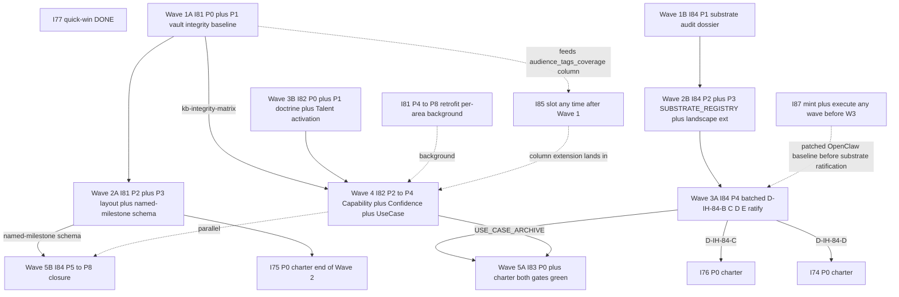
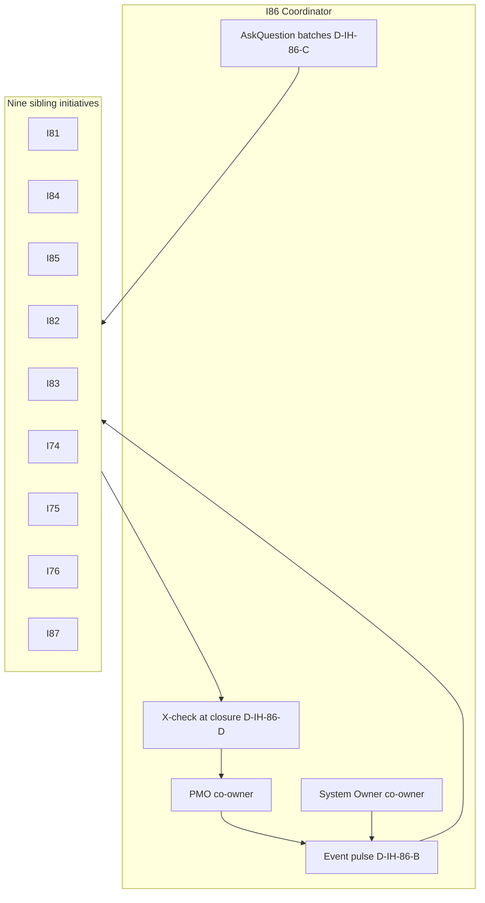
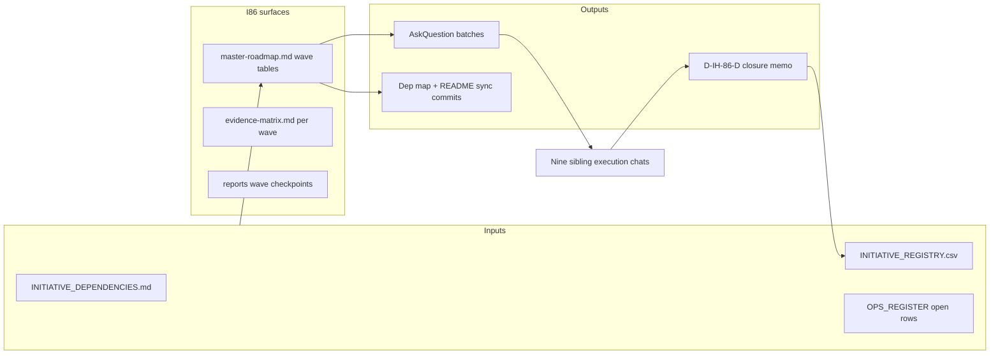

# I86 — Initiative Cluster Execution Coordinator

> **Operational initiative.** I86 mints **no** git-canonical SSOT under `docs/references/hlk/v3.0/Admin/O5-1/People/Compliance/canonicals/` beyond the standard initiative registers ([`INITIATIVE_REGISTRY.csv`](../../../references/hlk/v3.0/Admin/O5-1/People/Compliance/canonicals/INITIATIVE_REGISTRY.csv), [`DECISION_REGISTER.csv`](../../../references/hlk/v3.0/Admin/O5-1/People/Compliance/canonicals/DECISION_REGISTER.csv), [`OPS_REGISTER.csv`](../../../references/hlk/v3.0/Admin/O5-1/People/Compliance/canonicals/OPS_REGISTER.csv)). Its deliverable is the **mechanical burndown** of ten coordinated sibling initiatives from candidate, TRIGGER-watch, or active, to **closed**, with cluster-level coordination discipline. Success criterion: coordinated backlog reaches zero (all ten siblings `status: closed` in INITIATIVE_REGISTRY.csv, with D-IH-86-D cross-check recorded each time).

> **Scoped exception — program-anchor robustness (Round 2; P1 shipped 2026-05-17; P2 shipped 2026-05-17; P3 shipped 2026-05-17).** Per **D-IH-86-I** (ratified 2026-05-17) I86 minted anchor-specific tooling — Pydantic chassis ([`akos/hlk_initiative_program_anchors.py`](../../../../akos/hlk_initiative_program_anchors.py)), validator ([`scripts/validate_initiative_program_anchors.py`](../../../../scripts/validate_initiative_program_anchors.py); column-read default with `--legacy-notes-parser` deprecation flag), paired runbook ([`scripts/pmo_program_anchor_backfill.py`](../../../../scripts/pmo_program_anchor_backfill.py)), and Operations/PMO SOP ([`SOP-PMO_INITIATIVE_PROGRAM_ANCHORS_001.md`](../../../references/hlk/v3.0/Admin/O5-1/Operations/PMO/canonicals/SOP-PMO_INITIATIVE_PROGRAM_ANCHORS_001.md)). **P2 (Stage B) completed 2026-05-17**: `program_anchors` first-class semicolon-list FK column promoted on [`INITIATIVE_REGISTRY.csv`](../../../references/hlk/v3.0/Admin/O5-1/People/Compliance/canonicals/INITIATIVE_REGISTRY.csv) (24 rows migrated via single-use [`_oneshot_anchors_notes_to_column.py`](../../../../scripts/_oneshot_anchors_notes_to_column.py); notes prefix stripped); Supabase migration [`20260517163635_i86_p2_program_anchors_column.sql`](../../../../supabase/migrations/20260517163635_i86_p2_program_anchors_column.sql) applied to MasterData 2026-05-17 (version `20260517163635`); FK block live in [`scripts/validate_initiative_registry.py`](../../../../scripts/validate_initiative_registry.py); operator approval checklist in [`reports/p2-pause-record-2026-05-17.md`](reports/p2-pause-record-2026-05-17.md). **P3 (persona-view rollup) completed 2026-05-17 — I86 CLOSES at end of P3 per D-IH-86-N**: SQL view [`governance.initiative_program_rollup_view`](../../../../supabase/migrations/20260517163648_i86_p3_initiative_program_rollup_view.sql) + six-persona spec ([`reports/persona-view-spec-2026-05-19.md`](reports/persona-view-spec-2026-05-19.md)) + BBR drift-gate scope extension (founder-filed + adviser-handoff per D-IH-86-L) + six rollup-aware ERP route slots in [`HLK_ERP_ARCHITECTURE.md`](../../../references/hlk/v3.0/Admin/O5-1/Operations/PMO/canonicals/HLK_ERP_ARCHITECTURE.md) §4 + UAT acceptance ([`docs/uat/i86-p3-persona-rollup-acceptance.md`](../../../uat/i86-p3-persona-rollup-acceptance.md)) carved into D1-D5 self-attestable + E1-E4 forward-chartered. **Migrations live 2026-05-17 (operator carry-forward executed)**: P2 column applied (MCP version `20260517163635`); P3 view applied (MCP version `20260517163648`); 16 mirrored initiatives seeded with `program_anchors` (8 anchored rows still need operator-side full mirror reseed via `compliance_mirror_emit` — R-IH-86-10 closed for the 16 rows present in mirror; 8 unanchored rows tracked as residual operator work); rollup view returns 62 rows (27 with anchor); no new security advisors. TSX panel implementation + Adviser-external REDACTED rendering forward-chartered to **I89 active** ([`docs/wip/planning/89-hlk-erp-program-rollup-implementation/master-roadmap.md`](../89-hlk-erp-program-rollup-implementation/master-roadmap.md); **promoted 2026-05-17** from candidate per operator inline-ratify batch; five inception decisions D-IH-89-A..E ratified same-day; tri-co-owned PMO + System Owner + Brand & Narrative Manager per D-IH-89-D; BBR drift-gate flipped INFO→FAIL at I89 P0 per D-IH-89-E — `OPS-86-4` (I89 promotion trigger) **closed 2026-05-17** in [`OPS_REGISTER.csv`](../../../references/hlk/v3.0/Admin/O5-1/People/Compliance/canonicals/OPS_REGISTER.csv)) as MANDATORY public-prose pause-point per `akos-agent-checkpoint-discipline.mdc`. ADVOPS triage of 7 pre-existing `PRJ-HOL-FOUNDING-2026` leaks in ENISA dossiers routed to **OPS-86-5** for Brand & Narrative Manager + ADVOPS co-owner. All anchor work inherits the existing `pattern_paired_sop_runbook` pattern row — no new register dimension is created.

> **Structural siblings.** I86 sits alongside [I64 Governance Mission Control](../64-governance-mission-control/master-roadmap.md) and [I65 AKOS Planning Workspace Panel](../65-akos-planning-workspace-panel/master-roadmap.md) as a **coordination** initiative — portfolio orchestration rather than vault SSOT minting.

> **Cluster burndown orchestration plan.** The operational closure sequence for the remaining cluster (5 active initiatives + 3 blocker-trackers + 9 open OPS rows targeting `D-IH-86-CLOSURE`) is sequenced in the dedicated [`cluster-burndown-plan.md`](cluster-burndown-plan.md) (5-wave H..L shape; minted at Wave G B-G3b commit per `D-IH-86-T` 2026-05-19), anchored on the [`cluster-burndown-inventory.md`](cluster-burndown-inventory.md) evidence pass (commit [`6253260`](https://github.com/FraysaXII/openclaw-akos/commit/6253260) per B-G3a). The burndown plan's §10 closure criteria operationalise the §7 verification criterion below.

## 1. Operating story

Holistika is executing a **dense cluster** of interdependent initiatives (substrate doctrine, vault integrity, capability doctrine, KiRBe ingestor, Madeira elevation, brand tooling, audience tags, research-area governance, OpenClaw runtime hardening). Left unmanaged, the cluster produces context-switching cost, missed coordination points (for example I81 P3 named-milestone schema before I84 P5 cascade), and silent drift (for example multi-hour OpenClaw health-monitor failure without escalation — see [`openclaw-observed-symptoms-2026-05-16.md`](../../intelligence/substrate-audit-2026-Q2/openclaw-observed-symptoms-2026-05-16.md)).

I86 is the **AskQuestion hub**, **wave-coordination cadence**, **cross-initiative blocker triage**, and **cluster-level closure cross-check** (D-IH-86-D). It does **not** substitute sibling charter authority — each sibling closes itself and owns its artefacts.

### 1.1 Wave dependency diagram (authoritative burndown shape)

### 1.2 Wave spotlight roster (D-IH-86-A)

| Wave | Calendar hint | Wave spotlight role_owner | Why this spotlight |
|:---:|:---|:---|:---|
| 1 | weeks 1-2 | **System Owner** | Parallel desk-research tracks (I81 P0+P1, I84 P1); mechanical wiring and audit dossier threads land naturally under System Owner coordination with PMO. |
| 2 | weeks 2-4 | **System Owner** | Compliance layout tranches + substrate registry mint + schema validators — highest coupling to tooling and CSV gates. |
| 3 | weeks 4-5 | **Research Lead** (interim KM Officer until hire) | I84 P4 batched ratifications + I82 doctrine charter — substrate and capability framing decisions. |
| 4 | weeks 5-7 | **People Operations Lead** | I82 capability registry chain + confidence registry — People-pattern and Talent-adjacent gates. |
| 5 | weeks 7-9 | **Tech Lead** | I83 charter + I84 P5-P8 closure parallel — product-shaped ingestor plus cross-area cascade execution. |

Spotlight owners **facilitate** wave narrative and surface blockers to the PMO + System Owner pair; they **do not** replace sibling `role_owner` authority on each initiative's charter.

### 1.3 Coordinated sibling burndown checklist (updated 2026-05-19 Bundle D Wave A-D push: I76 promotion + I85 + I87 closure + KILLER dossier rewrite)

| Sibling | INIT slug | Status today | Phases closed | Wave emphasis | Notes |
|:---|:---|:---|:---|:---:|:---|
| I81 | INIT-OPENCLAW_AKOS-81 | **active** (`dbdb551`) | P0 | 1-2 + background 4-8 | P0 charter landed Wave 1; P1 vault-integrity baseline deferred to focused work-block. Feeds `kb-integrity-matrix` to I82 Wave 4. |
| I84 | INIT-OPENCLAW_AKOS-84 | active | charter | 1-5 | P4 unlocks I76, I74, I83 framework narrowing; compare OpenClaw baseline after I87 when possible. |
| I85 | INIT-OPENCLAW_AKOS-85 | **closed** (Wave C 2026-05-19 per D-IH-85-CLOSURE) | P0..P4 | 1+C (landed) | All 4 phases closed; SOP-AUDIENCE_TAG_GOVERNANCE_001 active; 11 surfaces tagged; UAT report at reports/uat-i85-closure-2026-05-19.md. 5 of 10 cluster siblings now closed. |
| I82 | INIT-OPENCLAW_AKOS-82 | **active** (`dbdb551`) | P0 | 3-4 | P0 charter landed Wave 1; P1+ waits on I84 P4 ratifications + I81 P1 integrity for registry mint. |
| I83 | INIT-OPENCLAW_AKOS-83 (forward) | candidate (blocker-tracker active 2026-05-18 per D-IH-86-O) | — | 5 | Blocker: I82 P4 USE_CASE_ARCHIVE + I76 P3 (AICs F5 substrate). Tracker: docs/wip/planning/_blockers/i83-promotion-blocker-tracker.md. |
| I74 | INIT-OPENCLAW_AKOS-74 (forward) | TRIGGER-watch (blocker-tracker active 2026-05-18 per D-IH-86-O) | — | 3-4 | TRIGGER-2 reactive count 0; resolution requires ≥2 external requests + I71/I72/I73 closure + I76 P3 closure. Tracker: docs/wip/planning/_blockers/i74-promotion-blocker-tracker.md. |
| I75 | INIT-OPENCLAW_AKOS-75 (forward) | candidate (blocker-tracker active 2026-05-18 per D-IH-86-O) | — | 2 end | Blocker: I72 P0 + I73 P0 + Research Director hire pending. Tracker: docs/wip/planning/_blockers/i75-promotion-blocker-tracker.md. |
| I76 | INIT-OPENCLAW_AKOS-76 | **active** (Wave A 2026-05-18 under D-IH-76-A + Option 5 default posture D-IH-86-O) | P0 | 3-5 | P0 charter landed Wave A; 7-phase shape P0..P6; scope-overlap-tracker docs/wip/planning/_trackers/i11-i13-i17-scope-overlap-tracker.md governs I11/I13/I17 consolidation at P1/P3/P4 entries. AICs F5 framing inherited from D-IH-84-C. Co-owner PMO. |
| I87 | INIT-OPENCLAW_AKOS-87 | **closed** (Wave B 2026-05-19 per D-IH-87-CLOSURE) | P0..P6 | 1+B (landed) | All 6 phases closed; SOP-OPENCLAW_RUNTIME_HEALTH_TRIAGE_001 promoted review->active; UAT report at reports/uat-i87-closure-2026-05-19.md (synthetic 3-class drill PASS). 4 of 10 cluster siblings now closed. |

### 1.4 Wave 1 mid-burn status (2026-05-16; 13 commits landed)

| Aggregate | Count | Detail |
|:---|:---|:---|
| Siblings flipped candidate → active | **4** | I85, I87, I81, I82 |
| Phases closed (across all siblings) | **9** | I85 P0+P1+P2infra+P3 (4); I87 P0+P2+P3+P4 (4); I81 P0 (1); I82 P0 (1) |
| Canonical CSV rows appended | **14** | 4 INITIATIVE_REGISTRY + 18 DECISION_REGISTER + 4 OPS_REGISTER |
| Decisions ratified `agent_inline_default` | **18** | I85 (5) + I87 (3) + I81 (5) + I82 (5) — operator-confirmed 2026-05-16 |
| New validators wired (INFO rows in release-gate) | **2** | `validate_audience_tags.py` + `validate_openclaw_plugin_pinning.py` |
| New tests added | **32** | 15 audience_registry + 10 audience_tags_drift + 7 openclaw_plugin_pinning |
| Hard FAILs encountered | **0** | All validator pre-existing gates remained green throughout |

Operator hand-back batch (folds into surface-ratify-batch-final per the I86 todo list): I85 P2 sweep tranches + I85 P4 SOP promotion + I82 P1 Talent baseline_organisation row + I81 P2 layout tranche 1 + (when eligible) I84 P4 batched decisions. Full snapshot at [`reports/checkpoints/sc-wave1-midburn-2026-05-16.md`](reports/checkpoints/sc-wave1-midburn-2026-05-16.md).

### 1.5 Bundle D push status (2026-05-19; 4 commits landed across Wave A → Wave D)

| Aggregate | Count | Detail |
|:---|:---|:---|
| Cluster siblings closed | **5 of 10** | I79 + I80 + I84 + I85 (Wave C 2026-05-19 D-IH-85-CLOSURE) + I87 (Wave B 2026-05-19 D-IH-87-CLOSURE) |
| Cluster siblings active | **3 of 10** | I81 + I82 + I76 (Wave A 2026-05-18 promotion under Option 5 default posture) |
| Cluster siblings on blocker-tracker | **3 of 10** | I74 + I75 + I83 — see `docs/wip/planning/_blockers/` (next-review triggers documented) |
| Sibling promotions this push | **1** | I76 (Wave A; clean activation of clean-activation candidate) |
| Wave-D dossier deliverable | **1** | KILLER dossier 5-pillar rewrite per D-IH-89-O (handoff §3.4 deferred deliverable; 8/8 acceptance criteria PASS; UAT at `reports/uat-killer-dossier-2026-05-19.md`) |
| New Cursor rules minted | **1** | `.cursor/rules/akos-conflict-surfacing-and-blocker-trackers.mdc` (codifies Option 5 default posture per D-IH-86-O; closed OPS-86-6) |
| New governance-shape artifacts minted | **4** | 3 blocker-trackers (I74 + I75 + I83) + 1 scope-overlap-tracker (I11/I13/I17 vs I76) |
| Decisions ratified | **3 closure + 1 architecture** | D-IH-87-CLOSURE + D-IH-85-CLOSURE + D-IH-89-O + D-IH-76-A (charter) + D-IH-86-O (default posture) |
| Validators run (all PASS) | **8+** | validate_hlk + validate_brand_baseline_reality_drift + validate_audience_registry + validate_audience_tags + validate_openclaw_plugin_pinning + 25+101+13 governance tests |

Bundle D push closes 5 of the 10 cluster siblings; remaining 3 active (I81 + I82 + I76) plus 3 candidates (I74 + I75 + I83) tracked via blocker-trackers. See [`reports/uat-killer-dossier-2026-05-19.md`](reports/uat-killer-dossier-2026-05-19.md) §5 for the full Wave A-D summary.

### 1.6 Wave H closure (2026-05-19; 5 lanes ratified across W3-C INLINE-STREAMING cadence)

**Wave H closure (2026-05-19):** All 5 lanes committed (`5e90dd4` → `aa72d0a` → `735a1c5` → `d38c8e4` → `dbe9365`). **23 decisions ratified** (9× D-IH-76-E..M + 5× D-IH-86-AB/AC/AD/AE/AF + 8× D-IH-86-RH-A..H + 1× D-IH-86-W3CNORM minted at closure commit). See [`reports/2026-05-19-wave-h-closure.md`](reports/2026-05-19-wave-h-closure.md) for full lane-by-lane closure.

| Aggregate | Count | Detail |
|:---|:---|:---|
| Lanes committed | **5** | Lane A persistence + Lane C personality/voice + Lane E canonical-enrichment-freshness + Lane D Research-Head discipline + Lane F application governance |
| Files touched | **~44** | 5 new canonicals + 3 new SOPs + 4 new Pydantic chassis + 4 new/extended validators + 1 new cursor rule + 1 skill extension + 1 new runbook + register / CHANGELOG / files-modified appends |
| Decisions ratified | **23** | 9 (I76 P3: D-IH-76-E..M) + 5 (cross-cutting governance: D-IH-86-AB/AC/AD/AE/AF) + 8 (Research-Head: D-IH-86-RH-A..H) + 1 (W3-C norm: D-IH-86-W3CNORM) |
| New SOPs minted | **3** | SOP-TECH_MADEIRA_PERSONALITY_001 + SOP-TECH_APPLICATION_GOVERNANCE_001 + RESEARCH_HEAD_DISCIPLINE.md (People canonical meta-discipline shape) |
| New People canonicals | **1** | RESEARCH_HEAD_DISCIPLINE.md (5-pillar Holistika-fit ResearchOps reduction + §6 Backfill protocol + §7 anti-patterns) |
| New cursor rules | **1** | `.cursor/rules/akos-applied-research-discipline.mdc` (always-applied) |
| Skill extensions | **1** | `inline-ratify-craft/SKILL.md` Principle 1.5 (research-sweep when novel) |
| New validators wired into release-gate | **4** | validate_madeira_persistence_vehicle + extended madeira_personality_check + validate_canonical_enrichment_freshness + extended validate_repository_registry --strict-app-class |
| New tests | **150+** | 55 voice + 38 freshness + 36 inventory + 28 personality + Lane A integration |
| Inline-ratify gates handled | **7** | Density ~1 per 25-30min execution time; zero operator pauses; **operator promoted W3-C INLINE-STREAMING to Wave I+ norm** at scratchpad L55 → formalised as D-IH-86-W3CNORM |
| Hard FAILs encountered | **0** | All validator pre-existing gates remained green throughout |

**Doctrine moves crystallised**: (1) W3-C INLINE-STREAMING cadence is the Wave I+ default; (2) canonical-enrichment freshness now mechanically gated (3d/30d/90d staleness); (3) applied-research-as-Holistika-competitive-advantage codified as always-applied cursor rule + People canonical; (4) application governance now mechanically inventoried (55 repos × 12 governance-metadata cols × paired SOP+runbook+quarterly cadence); (5) MADEIRA `memory_class` enum (working/episodic/semantic/procedural/archival) established as I76 P4+ foundation. Cluster status unchanged structurally — 5 closed (I79 + I80 + I84 + I85 + I87); 3 active engineering surfaces (I76 mid-P3→P4 next wave + I81 + I82); 3 candidate-blocker-tracker (I74 + I75 + I83); I78 P1 closure deferred to Wave I scope per cluster-burndown-plan.md.

### 1.7 Wave I (chartered 2026-05-19 per scratchpad L66 inline-ratify; W3-C norm)

**Wave I composition** (5 lanes; derived from [`reports/lane-visibility-sweep-2026-05-19.md`](reports/lane-visibility-sweep-2026-05-19.md) §6 ratified Q1-Q5 outcomes 2026-05-19 via inline-ratify AskQuestion batch):

| Lane | Source | Scope | Forward-charters |
|:---|:---|:---|:---|
| **I-A** Dashboard refresh | Q1=E + sweep §6.A | Refresh `WIP_DASHBOARD.md` + `OPERATOR_INBOX.md` via [`scripts/render_wip_dashboard.py`](../../../../scripts/render_wip_dashboard.py) + [`scripts/render_operator_inbox.py`](../../../../scripts/render_operator_inbox.py); mint NEW `docs/wip/planning/dashboards/2026-05-19/index.md` single-pane landing; link from `README.md`. **Audience:** J-OP. **Effort:** 1-2d. | RENDERING_PIPELINE_REGISTRY row `unified_operator_dashboard_render` if orchestrator script wraps multiple renders. |
| **I-B** Cohesion doctrine | Q1=E + sweep §6.D + Q2=C | NEW `docs/references/hlk/v3.0/Admin/O5-1/Operations/PMO/canonicals/OPERATIONAL_COHESION_DOCTRINE.md` PMO canonical; explicitly names AKOS-markdown surfaces vs ERP-browser routes vs external-render trail vs OpenClaw runtime; "when to open which" routing matrix per audience class. Paired runbook per `akos-executable-process-catalog.mdc` (e.g. `scripts/render_operational_cohesion_index.py`). **Audience:** J-OP primary + J-AIC. **Effort:** 3-5d. | OPS row for quarterly cohesion review; PEOPLE_DESIGN_PATTERN row if cross-area routing pattern is reusable. |
| **I-C** Visibility audit | Q1=E + sweep §6.B (folded as Wave I lane, NOT standalone INIT) | Inventory top-5 visibility gaps per sweep §2-§5; rank by RICE; forward-charter ERP gap fixes (I65 covered separately in I-D); decisions D-IH-86-AL..AN expected. **Effort:** ~1wk. | Forward-charter I-NN-* per top-5 outcomes; OPS rows for triage; potentially OPERATOR_INBOX triage subtask. |
| **I-D** I65 fast-track | Q3=A | Promote [`docs/wip/planning/65-akos-planning-workspace-panel/master-roadmap.md`](../65-akos-planning-workspace-panel/master-roadmap.md) from charter to execution; sibling-repo TSX implementation in `hlk-erp` per `HLK_ERP_ARCHITECTURE.md` §4 "AKOS planning workspace panel" row → `/operator/planning/` route. Required: `bless_external_repo` sibling-PR; Pydantic data schema for panel; page spec v2; ERP UAT. **Audience:** J-OP + J-AIC initially; Q4=D extends to all 8 J-* in Wave J+. **Effort:** 2-3wk. | I65 closure decisions; sibling-repo PR; ERP deploy verification; downstream link from I-A landing page. |
| **I-E** I62 status hygiene | Q5=A | Flip [`INITIATIVE_REGISTRY.csv`](../../../references/hlk/v3.0/Admin/O5-1/People/Compliance/canonicals/INITIATIVE_REGISTRY.csv) I62 row `status: active → closed` (this commit); cite UAT 2026-05-06 + 5/6 SQL views applied per migration reports as closure evidence; forward-charter ERP UI mocked-data work as separate **I-NN-MISSION-CONTROL-UI** candidate (NOT this wave; Q5 explicitly rejected sub-init split as Wave I scope). **Effort:** <1h (governance hygiene; lands inside this charter commit). | I-NN-MISSION-CONTROL-UI candidate stub in `_candidates/`; cross-link from `INITIATIVE_REGISTRY.csv` notes column. |

**Cross-cutting scope per Q4=D (full audience spectrum).** Visibility becomes a **brand artifact** spanning all 8 J-* codes (J-OP / J-IN / J-CU / J-PT / J-ENISA / J-AD / J-RC / J-CO). Wave I scope ships **J-OP + J-AIC** end-to-end (operator + Madeira). Wave J+ extends incrementally to J-IN (investor decks) / J-CU (customer presentations) / J-PT (partner kits) / J-AD (adviser handoff dashboards) / J-ENISA (regulator surfaces) / J-RC (recruiter — pending I75 activation) / J-CO (collaborator — pending I74). Lane I-B doctrine sets the contract for all 8 from the start so Wave J+ extension is mechanical, not re-architecture, per `akos-external-render-discipline.mdc` audience-channel-format triplet.

**Decision references.** D-IH-86-AG (Wave I composition / Q1=E), D-IH-86-AH (Q2=C dual-surface + routing), D-IH-86-AI (Q3=A I65 in-wave), D-IH-86-AJ (Q4=D full-audience-spectrum scope), D-IH-86-AK (Q5=A I62 flip).

**Wave I gates** (per W3-C INLINE-STREAMING norm `D-IH-86-W3CNORM`): no mega-batch pause-record at closure; inline-ratify gates surfaced per lane as evidence-dependent decisions arise; Wave I closes when all 5 lanes commit + verification passes + L67+ scratchpad entries drain.

**Evidence base.** [`reports/lane-visibility-sweep-2026-05-19.md`](reports/lane-visibility-sweep-2026-05-19.md) — comprehensive 4-axis sweep (AKOS internal / HLK external / HLK-ERP / cohesion) with ranked option set §6 + recommendation §7 + 5 open questions §8 (all 5 ratified in this charter). The sweep report itself lands as part of this Wave I charter commit (parent-written during inter-lane gap; correctly excluded from Wave H closure per scope discipline).

### 1.8 Wave J — Quality Fabric mint + I65 closure (chartered + executed 2026-05-20 per inline-ratify gates)

Wave J emerged inside the I65 closure post-flow when operator surfaced two compounding concerns: (a) the `hlk-erp` push of I65 P3+P4 work failed at Vercel (`dpl_6uNfwjKVUNwqqd2MZ65vySkvd834` ERROR via server-only-import poisoning client bundle); (b) the existing closure UAT pattern was insufficient for the mature multi-class verification needed for sibling-repo work. The wave produced both an emergency hotfix AND a meta-doctrine codifying how quality bars are derived for any Holistika artifact — answering the operator's verbatim challenge "we need to engineer properly the link between [audience and artifact]... channels... scenarios... brand... governance. And scalable."

**Wave J composition** (eight phases; J0-J3 mechanical-fix preceded J4-J9 doctrine-mint per same-day execution):

| Phase | Trigger | Deliverable | Decision row |
|----|---|---|---|
| **J0** Vercel hotfix | `dpl_6uNfwjKVUNwqqd2MZ65vySkvd834` ERROR | `hlk-erp` `ec3f883` extracts `lib/planning/github-urls.ts` as client-safe URL helpers; 4 client components migrated; Vercel `dpl_8N4pqRVEhhUCMMV82A8RUzYAfixo` READY | D-IH-86-AT |
| **J1** Post-push management | Operator post-push request | hlk-erp 71d3ebe rebased + pushed (flatten cb19f81 merge, drop already-upstream 31df5c5); operator WIP restored from stash | (mechanical) |
| **J2** UAT closure template | Operator "rework UAT, we have way better standards now" | [`docs/wip/planning/_templates/uat-closure-template.md`](_templates/uat-closure-template.md) minted; cites World Quality Report 2024 + Yuri Kan + Playwright MCP audit-trail + 5 internal precedents | (mechanical; D-IH-86-AS body) |
| **J3** UAT quality bar rule extension | Operator "make UAT properly governed" | [`akos-planning-traceability.mdc`](../../../../.cursor/rules/akos-planning-traceability.mdc) §"UAT quality bar" subsection added — binding contract on closure-UAT shape | D-IH-86-AS |
| **P0** Quality Fabric meta-doctrine | Operator "engineer the link [audience↔artifact]... and scalable. Do you accept?" | [`HOLISTIKA_QUALITY_FABRIC.md`](../../../references/hlk/v3.0/Admin/O5-1/People/canonicals/HOLISTIKA_QUALITY_FABRIC.md) at `status: charter` — 5-axis compose() architecture (audience × channel × scenario × brand × governance multiplicative) | D-IH-86-AU |
| **P1** UAT_DISCIPLINE first specialty | Quality Fabric needs first instantiation to validate | [`UAT_DISCIPLINE.md`](../../../references/hlk/v3.0/Admin/O5-1/People/canonicals/UAT_DISCIPLINE.md) — 7-class taxonomy (closure / brand / send / render / regression / persona / **deploy** [NEW from J0 evidence]); `compose_UAT(audience, channel, scenario, brand, governance) → UAT shape` | D-IH-86-AV |
| **P2** I65 UAT rework | Closure-UAT for I65 needed Quality Fabric materialisation | [`uat-i65-2026-05-19.md`](../65-akos-planning-workspace-panel/reports/uat-i65-2026-05-19.md) reworked to satisfy 5 of 7 classes (closure + brand + render + regression + deploy); the J0 ERROR→READY trail is the worked example for the deploy-class; verdict: PASS-WITH-FOLLOWUP | (composite of D-IH-86-AT + AS + AV) |
| **P3** Mechanical companion rule | Quality Fabric needs mechanical bar | [`akos-quality-fabric.mdc`](../../../../.cursor/rules/akos-quality-fabric.mdc) — RULE 1 axis-resolution + RULE 2 multiplicative-AND + RULE 3 deploy-verification for sibling-repo + RULE 4 Figma-source-check + RULE 5 compose_render() + RULE 6 inline-ratify on conflict + RULE 7 specialty-canonical contract | (composite of D-IH-86-AU) |

**Wave J forward-charters.** Three follow-on initiatives forward-chartered as candidate-shape per `akos-conflict-surfacing-and-blocker-trackers.mdc` Option 5 default posture (preserves operator-intent visibility without speculative-promotion debt):

- **D-IH-86-AW** — `I-NN-CHANNEL-DOCTRINES` per-channel goods/bads research initiative (the operator-named gap: every channel has its own rules but most lack written doctrine). Activation gates: this Quality Fabric at active + UAT_DISCIPLINE at active + 1 channel research POC.
- **D-IH-86-AX** — `UX_DISCIPLINE.md` mint as second specialty instantiation (sibling to UAT_DISCIPLINE.md). Depends on ≥1 channel doctrine so channel-aware UX bar derives from real channel rules, not speculation.
- **`scripts/derive_quality_bar.py` runbook** — given (audience, channel, scenario_id, surface_class), compute the binding bar by composing the 5 axes; emit JSON for ERP panel + Markdown for human reading. The "engineering of the link" runbook the operator named verbatim.

**I65 status closure.** I65 row in [`INITIATIVE_REGISTRY.csv`](../../../references/hlk/v3.0/Admin/O5-1/People/Compliance/canonicals/INITIATIVE_REGISTRY.csv) flipped `active → closed` at this commit; `last_review_decision_id: D-IH-86-AT`. Lane I-D is now fully closed end-to-end (charter at D-IH-86-AI → execution at D-IH-86-AQ → final closure at this Wave J commit).

**Wave J doctrine moves crystallised.** (1) Quality Fabric 5-axis compose() architecture is the durable record of operator intent for cross-area scalable quality; (2) UAT discipline now formalises 7 classes with mechanical bars including the new deploy-class motivated by the Vercel ERROR→READY evidence; (3) build-context-class regression vector (server-only-import bundle poisoning) added to recurring-risk awareness; (4) sibling-repo deploy verification is now binding via vendor-MCP per `akos-quality-fabric.mdc` RULE 3; (5) doctrine pipeline established for materialising specialty compose() functions (UX_DISCIPLINE next; per-channel doctrines next).

## 2. Architecture — cluster coordinator (diagram 1 of 3)

## 3. Module shape — coordination surfaces (diagram 2 of 3)

## 4. Phase dependency — I86 own lifecycle (diagram 3 of 3)

I86 uses **P0** only as the charter mint; thereafter it runs **continuous** until closure.

## 5. Decisions preview (canonical rows D-IH-86-A..E)

| ID | Question | Operator selection | Reversibility |
|:---|:---|:---|:---|
| D-IH-86-A | Ownership + wave spotlight | PMO + System Owner co-own; each wave names spotlight facilitator | medium |
| D-IH-86-B | Coordination cadence | Event-driven pulse + 14-day quiet floor | low |
| D-IH-86-C | AskQuestion batching | Wave-boundary batches + blocker-overflow lane | low |
| D-IH-86-D | Closure delegation | Sibling closes itself; I86 mechanical cross-check before closure ratifies | low |
| D-IH-86-E | Mint posture | Active folder + `_candidates/` redirect stub | low |

Full rationale: [`decision-log.md`](decision-log.md).

## 6. Risks preview

| ID | Risk | Mitigation |
|:---|:---|:---|
| R-IH-86-1 | PMO bandwidth saturated across ten threads | D-IH-86-B pulse collapses noise to event-driven + spotlight distributes facilitation |
| R-IH-86-2 | Wave spotlight handoff drops context between waves | Single paragraph handoff in `reports/wave-N-handoff-YYYY-MM-DD.md` (pattern established Wave 1 close) |
| R-IH-86-3 | 14-day quiet floor masks stalled sibling | OPS_REGISTER aging + operator inbox review |
| R-IH-86-4 | D-IH-86-D cross-check misses soft dependency | Explicit INITIATIVE_DEPENDENCIES §3.8 review each closure |
| R-IH-86-5 | `_candidates/` redirect stub drifts | Stub links only `master-roadmap.md`; folder rename triggers grep |
| R-IH-86-6 | I86 repo churn blocks siblings | I86 commits stay planning-meta + register rows only per phase |

Full register: [`risk-register.md`](risk-register.md).

## 7. Verification

- `py scripts/validate_hlk.py` after canonical CSV append.
- Cluster burndown verification is **INITIATIVE_REGISTRY.csv** ten siblings `status: closed` + OPS-86-1 closed + [`evidence-matrix.md`](evidence-matrix.md) closure row PASS.

## 8. Sync rule

When Wave boundaries or sibling promotion states change, update [`INITIATIVE_DEPENDENCIES.md`](../_templates/INITIATIVE_DEPENDENCIES.md) and append [`files-modified.csv`](files-modified.csv) per [`akos-planning-traceability.mdc`](../../../../.cursor/rules/akos-planning-traceability.mdc).
