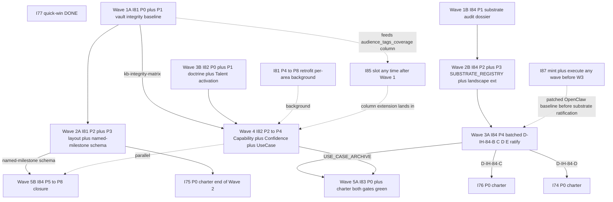
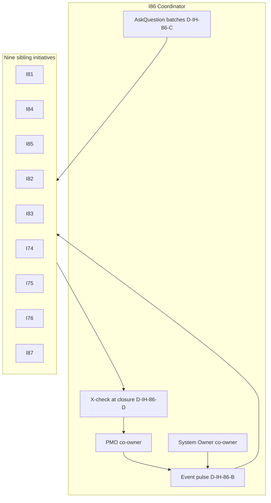
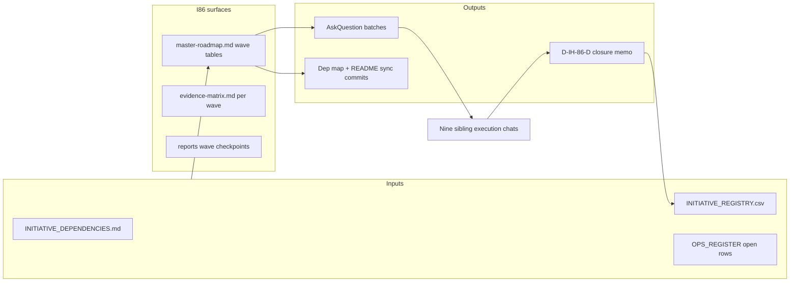

# I86 — Initiative Cluster Execution Coordinator

> **Operational initiative.** I86 mints **no** git-canonical SSOT under `docs/references/hlk/v3.0/Admin/O5-1/People/Compliance/canonicals/` beyond the standard initiative registers ([`INITIATIVE_REGISTRY.csv`](../../../references/hlk/v3.0/Admin/O5-1/People/Compliance/canonicals/INITIATIVE_REGISTRY.csv), [`DECISION_REGISTER.csv`](../../../references/hlk/v3.0/Admin/O5-1/People/Compliance/canonicals/DECISION_REGISTER.csv), [`OPS_REGISTER.csv`](../../../references/hlk/v3.0/Admin/O5-1/People/Compliance/canonicals/OPS_REGISTER.csv)). Its deliverable is the **mechanical burndown** of ten coordinated sibling initiatives from candidate, TRIGGER-watch, or active, to **closed**, with cluster-level coordination discipline. Success criterion: coordinated backlog reaches zero (all ten siblings `status: closed` in INITIATIVE_REGISTRY.csv, with D-IH-86-D cross-check recorded each time).

> **Scoped exception — program-anchor robustness (Round 2; P1 shipped 2026-05-17; P2 shipped 2026-05-17; P3 shipped 2026-05-17).** Per **D-IH-86-I** (ratified 2026-05-17) I86 minted anchor-specific tooling — Pydantic chassis ([`akos/hlk_initiative_program_anchors.py`](../../../../akos/hlk_initiative_program_anchors.py)), validator ([`scripts/validate_initiative_program_anchors.py`](../../../../scripts/validate_initiative_program_anchors.py); column-read default with `--legacy-notes-parser` deprecation flag), paired runbook ([`scripts/pmo_program_anchor_backfill.py`](../../../../scripts/pmo_program_anchor_backfill.py)), and Operations/PMO SOP ([`SOP-PMO_INITIATIVE_PROGRAM_ANCHORS_001.md`](../../../references/hlk/v3.0/Admin/O5-1/Operations/PMO/canonicals/SOP-PMO_INITIATIVE_PROGRAM_ANCHORS_001.md)). **P2 (Stage B) completed 2026-05-17**: `program_anchors` first-class semicolon-list FK column promoted on [`INITIATIVE_REGISTRY.csv`](../../../references/hlk/v3.0/Admin/O5-1/People/Compliance/canonicals/INITIATIVE_REGISTRY.csv) (24 rows migrated via single-use [`_oneshot_anchors_notes_to_column.py`](../../../../scripts/_oneshot_anchors_notes_to_column.py); notes prefix stripped); Supabase migration [`20260517163635_i86_p2_program_anchors_column.sql`](../../../../supabase/migrations/20260517163635_i86_p2_program_anchors_column.sql) applied to MasterData 2026-05-17 (version `20260517163635`); FK block live in [`scripts/validate_initiative_registry.py`](../../../../scripts/validate_initiative_registry.py); operator approval checklist in [`reports/p2-pause-record-2026-05-17.md`](reports/p2-pause-record-2026-05-17.md). **P3 (persona-view rollup) completed 2026-05-17 — I86 CLOSES at end of P3 per D-IH-86-N**: SQL view [`governance.initiative_program_rollup_view`](../../../../supabase/migrations/20260517163648_i86_p3_initiative_program_rollup_view.sql) + six-persona spec ([`reports/persona-view-spec-2026-05-19.md`](reports/persona-view-spec-2026-05-19.md)) + BBR drift-gate scope extension (founder-filed + adviser-handoff per D-IH-86-L) + six rollup-aware ERP route slots in [`HLK_ERP_ARCHITECTURE.md`](../../../references/hlk/v3.0/Admin/O5-1/Operations/PMO/canonicals/HLK_ERP_ARCHITECTURE.md) §4 + UAT acceptance ([`docs/uat/i86-p3-persona-rollup-acceptance.md`](../../../uat/i86-p3-persona-rollup-acceptance.md)) carved into D1-D5 self-attestable + E1-E4 forward-chartered. **Migrations live 2026-05-17 (operator carry-forward executed)**: P2 column applied (MCP version `20260517163635`); P3 view applied (MCP version `20260517163648`); 16 mirrored initiatives seeded with `program_anchors` (8 anchored rows still need operator-side full mirror reseed via `compliance_mirror_emit` — R-IH-86-10 closed for the 16 rows present in mirror; 8 unanchored rows tracked as residual operator work); rollup view returns 62 rows (27 with anchor); no new security advisors. TSX panel implementation + Adviser-external REDACTED rendering forward-chartered to **I89 active** ([`docs/wip/planning/89-hlk-erp-program-rollup-implementation/master-roadmap.md`](../89-hlk-erp-program-rollup-implementation/master-roadmap.md); **promoted 2026-05-17** from candidate per operator inline-ratify batch; five inception decisions D-IH-89-A..E ratified same-day; tri-co-owned PMO + System Owner + Brand & Narrative Manager per D-IH-89-D; BBR drift-gate flipped INFO→FAIL at I89 P0 per D-IH-89-E — `OPS-86-4` (I89 promotion trigger) **closed 2026-05-17** in [`OPS_REGISTER.csv`](../../../references/hlk/v3.0/Admin/O5-1/People/Compliance/canonicals/OPS_REGISTER.csv)) as MANDATORY public-prose pause-point per `akos-agent-checkpoint-discipline.mdc`. ADVOPS triage of 7 pre-existing `PRJ-HOL-FOUNDING-2026` leaks in ENISA dossiers routed to **OPS-86-5** for Brand & Narrative Manager + ADVOPS co-owner. All anchor work inherits the existing `pattern_paired_sop_runbook` pattern row — no new register dimension is created.

> **Structural siblings.** I86 sits alongside [I64 Governance Mission Control](../64-governance-mission-control/master-roadmap.md) and [I65 AKOS Planning Workspace Panel](../65-akos-planning-workspace-panel/master-roadmap.md) as a **coordination** initiative — portfolio orchestration rather than vault SSOT minting.

## 1. Operating story

Holistika is executing a **dense cluster** of interdependent initiatives (substrate doctrine, vault integrity, capability doctrine, KiRBe ingestor, Madeira elevation, brand tooling, audience tags, research-area governance, OpenClaw runtime hardening). Left unmanaged, the cluster produces context-switching cost, missed coordination points (for example I81 P3 named-milestone schema before I84 P5 cascade), and silent drift (for example multi-hour OpenClaw health-monitor failure without escalation — see [`openclaw-observed-symptoms-2026-05-16.md`](../../intelligence/substrate-audit-2026-Q2/openclaw-observed-symptoms-2026-05-16.md)).

I86 is the **AskQuestion hub**, **wave-coordination cadence**, **cross-initiative blocker triage**, and **cluster-level closure cross-check** (D-IH-86-D). It does **not** substitute sibling charter authority — each sibling closes itself and owns its artefacts.

### 1.1 Wave dependency diagram (authoritative burndown shape)

### 1.2 Wave spotlight roster (D-IH-86-A)

| Wave | Calendar hint | Wave spotlight role_owner | Why this spotlight |
|:---:|:---|:---|:---|
| 1 | weeks 1-2 | **System Owner** | Parallel desk-research tracks (I81 P0+P1, I84 P1); mechanical wiring and audit dossier threads land naturally under System Owner coordination with PMO. |
| 2 | weeks 2-4 | **System Owner** | Compliance layout tranches + substrate registry mint + schema validators — highest coupling to tooling and CSV gates. |
| 3 | weeks 4-5 | **Research Lead** (interim KM Officer until hire) | I84 P4 batched ratifications + I82 doctrine charter — substrate and capability framing decisions. |
| 4 | weeks 5-7 | **People Operations Lead** | I82 capability registry chain + confidence registry — People-pattern and Talent-adjacent gates. |
| 5 | weeks 7-9 | **Tech Lead** | I83 charter + I84 P5-P8 closure parallel — product-shaped ingestor plus cross-area cascade execution. |

Spotlight owners **facilitate** wave narrative and surface blockers to the PMO + System Owner pair; they **do not** replace sibling `role_owner` authority on each initiative's charter.

### 1.3 Coordinated sibling burndown checklist (updated 2026-05-16 Wave 1 mid-burn)

| Sibling | INIT slug | Status today | Phases closed | Wave emphasis | Notes |
|:---|:---|:---|:---|:---:|:---|
| I81 | INIT-OPENCLAW_AKOS-81 | **active** (`dbdb551`) | P0 | 1-2 + background 4-8 | P0 charter landed Wave 1; P1 vault-integrity baseline deferred to focused work-block. Feeds `kb-integrity-matrix` to I82 Wave 4. |
| I84 | INIT-OPENCLAW_AKOS-84 | active | charter | 1-5 | P4 unlocks I76, I74, I83 framework narrowing; compare OpenClaw baseline after I87 when possible. |
| I85 | INIT-OPENCLAW_AKOS-85 | **active** (`bde7060`) | P0+P1+P2-infra+P3 | 1 (landed) | Wave 1 closeable; only P2-sweep + P4-promotion remain (both operator-gated). |
| I82 | INIT-OPENCLAW_AKOS-82 | **active** (`dbdb551`) | P0 | 3-4 | P0 charter landed Wave 1; P1+ waits on I84 P4 ratifications + I81 P1 integrity for registry mint. |
| I83 | INIT-OPENCLAW_AKOS-83 (forward) | candidate (blocker-tracker active 2026-05-18 per D-IH-86-O) | — | 5 | Blocker: I82 P4 USE_CASE_ARCHIVE + I76 P3 (AICs F5 substrate). Tracker: docs/wip/planning/_blockers/i83-promotion-blocker-tracker.md. |
| I74 | INIT-OPENCLAW_AKOS-74 (forward) | TRIGGER-watch (blocker-tracker active 2026-05-18 per D-IH-86-O) | — | 3-4 | TRIGGER-2 reactive count 0; resolution requires ≥2 external requests + I71/I72/I73 closure + I76 P3 closure. Tracker: docs/wip/planning/_blockers/i74-promotion-blocker-tracker.md. |
| I75 | INIT-OPENCLAW_AKOS-75 (forward) | candidate (blocker-tracker active 2026-05-18 per D-IH-86-O) | — | 2 end | Blocker: I72 P0 + I73 P0 + Research Director hire pending. Tracker: docs/wip/planning/_blockers/i75-promotion-blocker-tracker.md. |
| I76 | INIT-OPENCLAW_AKOS-76 | **active** (Wave A 2026-05-18 under D-IH-76-A + Option 5 default posture D-IH-86-O) | P0 | 3-5 | P0 charter landed Wave A; 7-phase shape P0..P6; scope-overlap-tracker docs/wip/planning/_trackers/i11-i13-i17-scope-overlap-tracker.md governs I11/I13/I17 consolidation at P1/P3/P4 entries. AICs F5 framing inherited from D-IH-84-C. Co-owner PMO. |
| I87 | INIT-OPENCLAW_AKOS-87 | **active** (`bde7060`) | P0+P2+P3+P4 | 1 (landed) | 4 of 6 phases closed Wave 1; P1 escalation patch + P5 SOP+runbook + P6 closure UAT remain. |

### 1.4 Wave 1 mid-burn status (2026-05-16; 13 commits landed)

| Aggregate | Count | Detail |
|:---|:---|:---|
| Siblings flipped candidate → active | **4** | I85, I87, I81, I82 |
| Phases closed (across all siblings) | **9** | I85 P0+P1+P2infra+P3 (4); I87 P0+P2+P3+P4 (4); I81 P0 (1); I82 P0 (1) |
| Canonical CSV rows appended | **14** | 4 INITIATIVE_REGISTRY + 18 DECISION_REGISTER + 4 OPS_REGISTER |
| Decisions ratified `agent_inline_default` | **18** | I85 (5) + I87 (3) + I81 (5) + I82 (5) — operator-confirmed 2026-05-16 |
| New validators wired (INFO rows in release-gate) | **2** | `validate_audience_tags.py` + `validate_openclaw_plugin_pinning.py` |
| New tests added | **32** | 15 audience_registry + 10 audience_tags_drift + 7 openclaw_plugin_pinning |
| Hard FAILs encountered | **0** | All validator pre-existing gates remained green throughout |

Operator hand-back batch (folds into surface-ratify-batch-final per the I86 todo list): I85 P2 sweep tranches + I85 P4 SOP promotion + I82 P1 Talent baseline_organisation row + I81 P2 layout tranche 1 + (when eligible) I84 P4 batched decisions. Full snapshot at [`reports/checkpoints/sc-wave1-midburn-2026-05-16.md`](reports/checkpoints/sc-wave1-midburn-2026-05-16.md).

## 2. Architecture — cluster coordinator (diagram 1 of 3)

## 3. Module shape — coordination surfaces (diagram 2 of 3)

## 4. Phase dependency — I86 own lifecycle (diagram 3 of 3)

I86 uses **P0** only as the charter mint; thereafter it runs **continuous** until closure.

## 5. Decisions preview (canonical rows D-IH-86-A..E)

| ID | Question | Operator selection | Reversibility |
|:---|:---|:---|:---|
| D-IH-86-A | Ownership + wave spotlight | PMO + System Owner co-own; each wave names spotlight facilitator | medium |
| D-IH-86-B | Coordination cadence | Event-driven pulse + 14-day quiet floor | low |
| D-IH-86-C | AskQuestion batching | Wave-boundary batches + blocker-overflow lane | low |
| D-IH-86-D | Closure delegation | Sibling closes itself; I86 mechanical cross-check before closure ratifies | low |
| D-IH-86-E | Mint posture | Active folder + `_candidates/` redirect stub | low |

Full rationale: [`decision-log.md`](decision-log.md).

## 6. Risks preview

| ID | Risk | Mitigation |
|:---|:---|:---|
| R-IH-86-1 | PMO bandwidth saturated across ten threads | D-IH-86-B pulse collapses noise to event-driven + spotlight distributes facilitation |
| R-IH-86-2 | Wave spotlight handoff drops context between waves | Single paragraph handoff in `reports/wave-N-handoff-YYYY-MM-DD.md` (pattern established Wave 1 close) |
| R-IH-86-3 | 14-day quiet floor masks stalled sibling | OPS_REGISTER aging + operator inbox review |
| R-IH-86-4 | D-IH-86-D cross-check misses soft dependency | Explicit INITIATIVE_DEPENDENCIES §3.8 review each closure |
| R-IH-86-5 | `_candidates/` redirect stub drifts | Stub links only `master-roadmap.md`; folder rename triggers grep |
| R-IH-86-6 | I86 repo churn blocks siblings | I86 commits stay planning-meta + register rows only per phase |

Full register: [`risk-register.md`](risk-register.md).

## 7. Verification

- `py scripts/validate_hlk.py` after canonical CSV append.
- Cluster burndown verification is **INITIATIVE_REGISTRY.csv** ten siblings `status: closed` + OPS-86-1 closed + [`evidence-matrix.md`](evidence-matrix.md) closure row PASS.

## 8. Sync rule

When Wave boundaries or sibling promotion states change, update [`INITIATIVE_DEPENDENCIES.md`](../_templates/INITIATIVE_DEPENDENCIES.md) and append [`files-modified.csv`](files-modified.csv) per [`akos-planning-traceability.mdc`](../../../../.cursor/rules/akos-planning-traceability.mdc).
