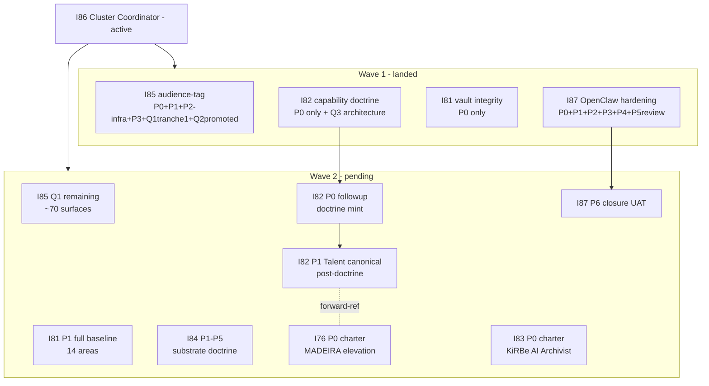

# I86 Wave 2 — Agent self-checkpoint resume document (2026-05-16)

> **Purpose.** Comprehensive hand-off document for the successor agent picking up the I86 cluster execution coordinator in a fresh chat. All ratified decisions, completed work, and pending items captured here so the successor has full context without scrolling 1000+ message transcript. Per [`akos-agent-checkpoint-discipline.mdc`](../../../../.cursor/rules/akos-agent-checkpoint-discipline.mdc) §"Agent self-checkpoint contract".

## 1. Wave 1 + Wave 2-execute summary (this chat run; 2026-05-16)

### Commits landed (chronological)

| # | SHA | Sibling | Description |
|:---|:---|:---|:---|
| 1 | `bde7060` | I85 P0 | I85 charter + audience-tag canonicalization initiative active |
| 2 | `7d47199` | I85 P1 | AUDIENCE_REGISTRY.csv mint + Pydantic + validator + tests + SOP at review |
| 3 | `20ed543` | I85 P2-infra | scripts/validate_audience_tags.py drift gate + 10 tests + release-gate wiring |
| 4 | `950b1e3` | I85 P3 | BASELINE_REALITY.md J-OP frontmatter + BRAND_BASELINE_REALITY_MATRIX §4.6 recipe |
| 5 | `e40fae1` | I87 P2+P3 | scripts/validate_openclaw_plugin_pinning.py + modelsConfig hygiene + 7 tests |
| 6 | `51a7045` | I87 P4 | reports/p4-gateway-token-rca-2026-05-16.md (upstream-bug verdict) |
| 7 | `dbdb551` | I81 P0 + I82 P0 | Two new initiatives chartered with full P0 evidence packs |
| 8 | `335092e` | I87 P0 | I87 active charter (was already charted prior to this chat; recorded for completeness) |
| 9 | `45c4f0c` | I86 P0-followup | master-roadmap §1.3 burndown checklist refresh + §1.4 Wave 1 mid-burn aggregate |
| 10 | `180099c` | I87 P1 | scripts/openclaw_health_escalate.py MVP + 13 governance tests |
| 11 | `a57a5cb` | I87 P5 + Q1-Q6 ratify | SOP-OPENCLAW_RUNTIME_HEALTH_TRIAGE_001.md (status:review) + env_tech_dtp_openclaw_runtime_health_triage_001 process row + Q1-Q6 ratify report |
| 12 | `7974fc3` | I82 D-IH-82-I | Talent split-tree architecture ratify (Q3 verdict) |
| 13 | `e1960cf` | I85 Q1+Q2 | Audience-tag sweep tranche-1 (11 surfaces) + SOP review->active promotion |
| 14 | (+ backfill commits 52ca5c9, fb24332, 9cbee27, d380f15, 2bc802b) | various | SHA backfill commits for files-modified.csv freshness |

**Totals**: 13 substantive feature commits + 5 backfill commits = ~18 commits in run; ~75-80 files modified across `docs/references/hlk/v3.0/`, `docs/wip/planning/`, `scripts/`, `tests/`, `config/`.

### Validators all green at hand-off

- `py scripts/validate_hlk.py` → OVERALL: PASS (1 advisory warning; not failing)
- `py scripts/validate_audience_tags.py` → 52 scanned, 11 J-coded, FK clean
- `py -m pytest tests/test_openclaw_health_escalate.py tests/test_openclaw_plugin_pinning.py tests/test_audience_tags_drift.py` → 30/30 PASS

## 2. Wave 2 operator ratification trail

All six Wave 2 forks ratified inline by operator on 2026-05-16. Full evidence: [`q1-q6-ratify-2026-05-16.md`](../q1-q6-ratify-2026-05-16.md).

| Q | Initiative | Verdict | Status |
|:---|:---|:---|:---|
| **Q1** | I85 P2 sweep | **all-external** (exhaustive ~80 surfaces) | Tranche-1 (11 surfaces) landed; tranche-2 deferred (see §3.1) |
| **Q2** | I85 P4 SOP | **wait-for-sweep**, promote at ≥6 surfaces | DONE — SOP active |
| **Q3** | I82 P1 Talent | **split-talent-tree** (Talent-H + Talent-A axis) | Architecture ratified; canonical mint deferred (see §3.2) |
| **Q4** | I81 P1 baseline | **full-14-areas** (1-3d work) | Deferred to successor (see §3.3) |
| **Q5** | I87 P5 SOP+process | **mint-sop-with-process-tranche** | DONE — SOP+process row landed |
| **Q6** | Wave-close posture | **execute-q1-q5-then-hand-off** | This document is the hand-off |

## 3. Pending work — successor agent picks up

### 3.1 I85 Q1 remaining sweep (~70 surfaces still untagged)

**Scope**: continue the audience-tag retag per operator Q1 all-external verdict. Remaining surface-classes (in priority order):

1. `docs/references/hlk/v3.0/_assets/advops/shared/` kits (`SEQUENCE_TEMPLATES.md` / `PROPOSAL_TEMPLATE.md` / `PRESS_KIT.md` / `ONBOARDING_KIT.md` / `ENGAGEMENT_PLAYBOOK.md` / `EMAIL_SIGNATURES.md`) — most are multi-audience; apply BRAND_BASELINE_REALITY_MATRIX §4.6 recipe (YAML list `audience: [J-X, J-Y, J-Z]`).
2. `docs/references/hlk/v3.0/_assets/advops/PRJ-HOL-FOUNDING-2026/adviser_handoff/` (2 files; J-AD).
3. `docs/references/hlk/v3.0/_assets/advops/PRJ-HOL-FOUNDING-2026/enisa_company_dossier/{deck-visual-system.md,figma-link.md}` (J-OP — internal design specs).
4. `docs/references/hlk/v3.0/_assets/advops/PRJ-HOL-FOUNDING-2026/enisa_evidence/topic_*.md` + `.manifest.md` (J-ENISA for topic body; J-OP for manifest).
5. `docs/references/hlk/v3.0/_assets/touchpoint-kit/**/*.md` — touchpoint kit surfaces (PERSONA-*/CHAN-* directory; varies by persona).
6. `docs/references/hlk/v3.0/Admin/O5-1/Marketing/Brand/canonicals/**/*.md` — Brand canonicals (mostly J-OP since these are internal).
7. `PRODUCT.md`, `DESIGN.md` (likely J-OP).
8. **Encoding decision needed**: `boilerplate/messages/*.json` and `hlk-erp/app/(public)/**/*.tsx` — these surfaces have no YAML frontmatter slot. Successor should propose either (a) extend `validate_audience_tags.py` to also scan JSON top-level + TSX leading-comment-block, or (b) declare these surfaces out-of-scope (since they're rendered externally and audience is implicit from the route/path).

**Validator current state**: `validate_audience_tags.py` is wired into `release-gate.py` as INFO row. Promote to FAIL/PASS at I85 P4 closure once the all-external sweep completes per master-roadmap.

### 3.2 I82 P1 Talent split-tree canonical row mint (operator gate; D-IH-82-I prerequisites)

**Verdict ratified architecturally**: split into Talent-H (human) + Talent-A (AI). Per [`docs/wip/planning/82-holistika-capability-doctrine/decision-log.md`](../../82-holistika-capability-doctrine/decision-log.md) D-IH-82-I §"Verdict prerequisites" the actual canonical row mint requires:

1. **`HOLISTIKA_CAPABILITY_DOCTRINE.md` minted at `status: review`** at `docs/references/hlk/v3.0/Admin/O5-1/People/canonicals/HOLISTIKA_CAPABILITY_DOCTRINE.md`. Body + addendum split per `pattern_sop_addendum_split` (precedent: HOLISTIKA_STAKEHOLDER_LENSES.md + addendum). I82 P0 master-roadmap §3 P0 "doctrine mint" deliverable.
2. **Doctrine §"Capability bearer classes"** authored explicitly naming Talent-H + Talent-A axes; cross-reference `akos-people-discipline-of-disciplines.mdc` RULE 3.
3. **Talent role-name conventions** decided (operator co-sign with Brand & Narrative Manager).
4. **I76 P0 charter** exists as `status: candidate` for Talent-A forward-reference — DONE (candidate stub at `_candidates/i76-madeira-elevation.md`).

After all four prerequisites land: append baseline_organisation.csv rows for Talent-H + Talent-A (with class axis in `sub_area` and explicit cross-reference in `role_full_description`); append process_list.csv rows for Talent-H + Talent-A processes (prefixed `hol_peopl_talent_h_*` and `hol_peopl_talent_a_*`); status:planned for Talent-A rows until I76 P0 lands.

**Successor recommended order**: mint doctrine first (P0 followup), THEN open operator gate for canonical row tranche.

### 3.3 I81 P1 vault-integrity baseline (Q4 verdict: full-14-areas)

**Verdict**: comprehensive baseline of all 14 v3.0 areas; 1-3 day work block.

**Approach** (per I81 master-roadmap §3 P1):

1. Audit each v3.0 area subtree for:
   - Missing required canonicals per `PRECEDENCE.md`.
   - Stale `last_review` dates (>180d old).
   - Broken cross-references (use existing validators where available; manual scan otherwise).
   - SOP-META compliance (every SOP has process_list.csv row).
2. File baseline matrix at `docs/wip/planning/81-vault-integrity-layout-milestones-retrofit/reports/p1-vault-baseline-2026-05-NN.md` (one row per area).
3. Surface gaps as OPS-81-N rows in OPS_REGISTER.csv per `akos-holistika-operations.mdc` pattern.
4. Closes I81-VAULT-INTEGRITY-BASELINE milestone.

**Areas to audit** (14):
- Admin/O5-1/Marketing/Brand
- Admin/O5-1/Marketing/Reach
- Admin/O5-1/Marketing/Experimentation
- Admin/O5-1/Marketing/Resonance
- Admin/O5-1/Operations/PMO
- Admin/O5-1/Operations/SMO
- Admin/O5-1/Operations/RevOps
- Admin/O5-1/Research
- Admin/O5-1/People
- Admin/O5-1/People/Compliance
- Admin/O5-1/People/Ethics
- Admin/O5-1/Envoy Tech Lab
- v3.0/_assets/
- v3.0/_candidates/ (out-of-scope; reference only)

### 3.4 I87 P6 closure UAT

**Scope**: Exercise the escalation rails on a synthetic 3-failure-cycle scenario. After PASS, promote `SOP-OPENCLAW_RUNTIME_HEALTH_TRIAGE_001.md` status:review → status:active (already minted at review by Q5).

**UAT steps**:

1. Operator runs `py scripts/openclaw_health_escalate.py --symptom-class ws-token-expiration --consecutive-failures 3 --evidence-path docs/wip/intelligence/substrate-audit-2026-Q2/openclaw-observed-symptoms-2026-05-16.md` (live, not dry-run).
2. Confirm OPS-87-N row appears in OPS_REGISTER.csv with correct shape.
3. Run `py scripts/render_operator_inbox.py` (or wait for next release-gate run) and confirm OPERATOR_INBOX.md surfaces the row.
4. Operator manually closes the row (status:closed; closed_at:today; note: "P6 closure UAT").
5. Repeat 1-4 for at least 2 more symptom-classes (e.g., docker-sandbox-churn + plugins-allow-trust) so the test covers the 5-class breadth.
6. File `docs/wip/planning/87-openclaw-operator-runtime-hardening/reports/p6-closure-uat-2026-05-NN.md` documenting outcomes.
7. Update SOP frontmatter: status:review → status:active; bump promotion_history.
8. INITIATIVE_REGISTRY.csv: INIT-OPENCLAW_AKOS-87 status:active → status:closed.

### 3.5 I84 substrate doctrine (P1-P5; not yet active)

**Status**: I84 P0 already chartered (commit prior to this chat run); P1-P5 substantive work pending. Per [I84 master-roadmap](../../84-substrate-doctrine-and-openclaw-cursor-sdk-decision/master-roadmap.md):

- **P1** — substrate landscape audit (web research + repo synthesis; ~1d).
- **P2** — substrate scorecard (OpenClaw vs Cursor-SDK vs hybrid vs other; ~0.5d).
- **P3** — substrate-doctrine canonical mint at `Envoy Tech Lab/canonicals/`.
- **P4** — substrate-decision rehearsal + operator inline-ratify gate.
- **P5** — substrate-decision ratified; cross-area pingback.

**Successor recommendation**: I84 is the highest-impact Wave 2 sibling for the operator's strategic clarity. Prioritize over I76 / I83 unless context budget runs hot.

### 3.6 I76 MADEIRA elevation P0 charter (candidate)

**Status**: candidate stub at `_candidates/i76-madeira-elevation.md`; not yet active.

**Scope**: charter the MADEIRA elevation (AI O5-1 role-class definition). Unlocks Talent-A canonical rows in I82 P1 split-tree (D-IH-82-I forward-reference).

**Successor recommendation**: file P0 charter using `_candidates/i76-madeira-elevation.md` as the source-of-truth + standard 6-file P0 evidence pack pattern. Charter decisions: AI O5-1 role-class definition + Madeira-as-current-embodiment + role-class growth posture + AIC vs AI O5-1 disambiguation.

### 3.7 I83 KiRBe AI Archivist P0 charter (candidate; D-IH-82-G forward-reference)

**Status**: candidate stub at `_candidates/i83-kirbe-ai-archivist.md`; not yet active.

**Scope**: Tech-area-led product-shaped initiative for the use-case archive ingestor-and-surfacing system (D-IH-82-G ratify).

**Successor recommendation**: deprioritized vs I84 + I76; can defer to Wave 3.

## 4. Cluster status snapshot at hand-off

## 5. Successor agent prompt suggestions

If the operator opens a fresh chat, the successor should be prompted with one of:

- *"Pick up I86 Wave 2 from sc-resume-wave2-architectural-2026-05-16.md §3.x; execute §3.4 I87 P6 closure UAT first."*
- *"Pick up I86 Wave 2 §3.5 I84 P1-P5 — substrate doctrine audit + scorecard + canonical mint."*
- *"Pick up I86 Wave 2 §3.3 I81 P1 full vault-integrity baseline (Q4 verdict full-14-areas)."*
- *"Continue I85 Q1 sweep per §3.1 — tranche-2 onwards (shared/ kits + adviser_handoff + touchpoint-kit)."*

Each prompt: load this document + `q1-q6-ratify-2026-05-16.md` + `sc-wave1-midburn-2026-05-16.md` for full context. Then execute per the §3 details.

## 6. Cluster-level forward decisions for successor

Decisions the successor will likely need to surface to operator via inline-ratify:

- **Tranche-2 audience-sweep encoding for non-Markdown surfaces** (JSON in `boilerplate/messages/`; TSX in `hlk-erp/app/(public)/`). Three options: (a) extend validator + add encoding spec; (b) declare out-of-scope; (c) defer to I74 audience-aware rendering initiative.
- **I81 P1 area-prioritization** — full 14-area baseline can be sequenced; some areas may have higher-drift risk than others (start with compliance + brand?).
- **I82 doctrine prose** — full HOLISTIKA_CAPABILITY_DOCTRINE.md body needs operator co-sign with Brand & Narrative Manager.
- **I84 P4 substrate-decision rehearsal** — major architectural fork (OpenClaw vs Cursor-SDK vs hybrid); will need formal inline-ratify with detailed evidence sweep.
- **I76 P0 AIC role-class definition** — D-IH-76-* decisions for role-class growth posture + AIC sub-tier.

## 7. Why this hand-off is the right move

Per Q6 operator ratify (execute-q1-q5-then-hand-off): the operator explicitly chose this path because:

- Q1-Q5 unlock contained tranches that fit context budget — DONE in this chat.
- Q4 (I81 P1 full baseline) + I84 P1-P5 + I76 P0 + I83 P0 are substantial work-blocks each better served by fresh context for substrate-doctrine reading.
- The mid-burn checkpoint + Q1-Q6 ratify report + this hand-off document together constitute the durable trail; no context loss in the chat-boundary transition.

Successor agent enters with full ratify trail in hand. Operator can resume from any §3 section without re-explaining Wave 1 / Wave 2.
