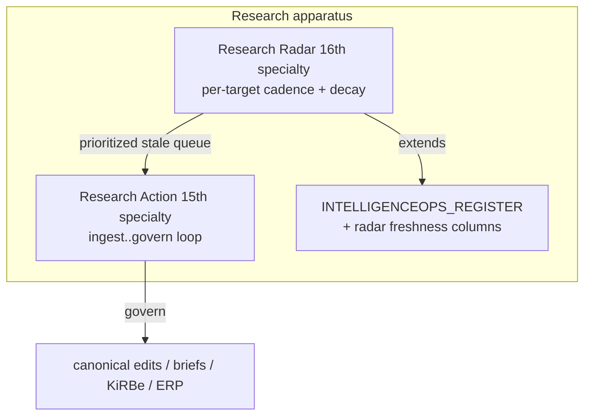
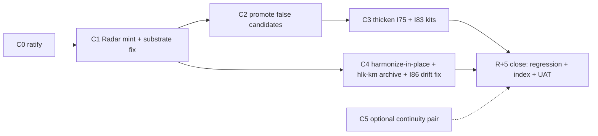
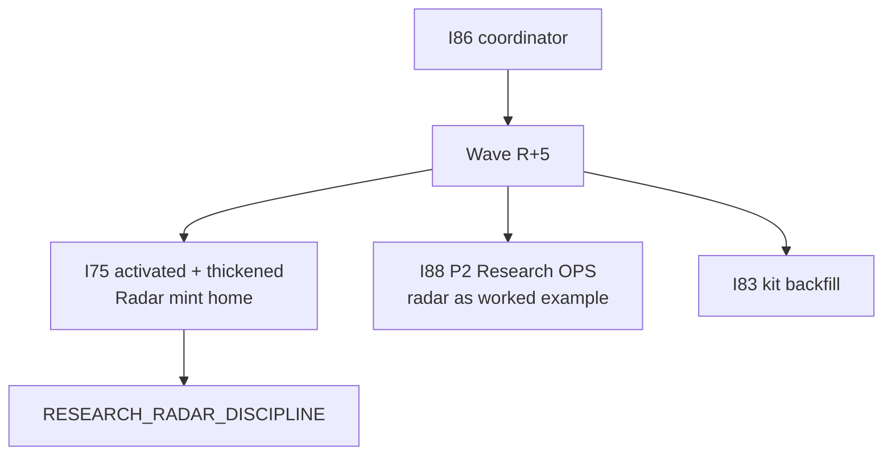

# I86 Wave R+5 — Research Radar spine + governance-integrity

> **What this is.** The governed execution plan for the operator's 2026-05-29 ratification:
> mint **Research Radar** (16th Quality-Fabric specialty / Research-area Methodology
> discipline) to best-effort full contract, **and** use it as the wedge to bring the
> **"false candidates"** — items active-in-fact but ungoverned — up to today's bar, all
> **coordinated under I86**. Nothing canonical moves until the operator approves this plan;
> every canonical-CSV / blueprint / link-migration step carries its own gate. Tags:
> **[ratified]** (operator 2026-05-29), **[crafted]** (my proposal, adjustable),
> **[verified]** (checked this session).

## 0. Ratified shape [ratified]

| Fork | Operator verdict |
|:---|:---|
| Composition | **A + C** — Research-area Methodology discipline **+ 16th QF specialty**, done heavy/governed, under I86 |
| Register | **Extend `INTELLIGENCEOPS_REGISTER.csv`** (one register; schema-drift contract honored) |
| Folder | **Harmonize-in-place — NO physical move** (operator correction 2026-05-29). `docs/wip/intelligence/` **is** the ratified Research-owned Tier-1 WIP home by design (`D-IH-70-O` + blueprint §17). Harmonization = build the **area-identity anchor**, **complete the half-migrated area**, **fix phantom-path drift** — not relocate the WIP folder. |
| `hlk-km` | **Archive-after-migration** (supersede `D-IH-86-CY-D`); successors land in `docs/wip/intelligence/` (no new home) |
| Execution | **Comply with Q1** — I86-coordinated, mint via the natural sibling (I75 = Research-AREA rework); radar = **one Methodology discipline under it**, not a standalone |
| Substrate gap | **Fix + subsume** — mint the missing process row + fold substrate freshness into the radar sweep |
| Lifecycle scope | **Research = full CORPINT lifecycle** (acquire → share → process → store → recall → protect), not a research-action queue. Thin stages **OUTAKE / RECALL / PROTECT** named as forward work (charter now, mint phased). |
| Area-identity guardrail | **Build now + generalize** — `Research/README.md` anchor + scoped `akos-research-area.mdc` rule (delivered this commit); pattern rolls out to other areas. |

Plus the standing mandate: **cover blind spots proactively; best-effort full mint; gates included.**

> **Operator correction folded in (2026-05-29).** An earlier draft proposed a *physical
> move* of `docs/wip/intelligence/` to a new `docs/wip/research-ops/` home. That was the
> recurring **un-harmonization error**: the WIP folder is already the Research-area Tier-1
> home by ratified design. The corrected harmonization keeps it in place and instead fixes
> the *real* gaps — no always-on area anchor, a half-migrated legacy tree, phantom paths,
> and an asymmetric lifecycle.

## 1. Why this is an I86 wave, minted via I75 [verified]

I86 is a **coordinator** — by charter it "mints no canonical SSOT beyond the initiative
registers" ([I86 master-roadmap](../master-roadmap.md) §1). So Research Radar is **minted
through its natural sibling, I75 (research-area governance)**, which I86 coordinates. This
also activates the operator's headline "false candidate": **I75 is `active` but thinly
governed** (master-roadmap only; no decision-log / risk-register / files-modified) and its
[blocker tracker](../../_blockers/i75-promotion-blocker-tracker.md) cites conditions
(`I72 P0 + I73 P0`) that are **already closed** [verified, arc sweep]. So I75 is exactly the
"quite active but non-governed, parked on stale blockers" pattern — and it is the home the
radar rides on.

## 2. Scope — the false-candidate activation set [verified inventory]

| Priority | Item | Path | Gap vs bar | This wave |
|:---|:---|:---|:---|:---|
| P0 | **Research Radar** | [`research-radar-2026-05-29/`](../../../intelligence/research-radar-2026-05-29/) | no INIT / no mint | C1 mint (full kit) |
| P0 | **Research-OPS substrate** | [`_candidates/i-nn-research-ops-substrate.md`](../../_candidates/i-nn-research-ops-substrate.md) | candidate-only; I88 companion | C2 promote/govern |
| P0 | **Cross-area topic+intent** | [`_candidates/i-nn-research-area-cross-area-topic-intent-improvement.md`](../../_candidates/i-nn-research-area-cross-area-topic-intent-improvement.md) | candidate-only; child of above | C2 (with parent) |
| P1 | **I75 governance kit** | [`75-research-area-governance/`](../../75-research-area-governance/master-roadmap.md) | no decision-log/risk/files-modified | C3 thicken + activate |
| P1 | **I83 governance kit** | [`83-ai-archivist-and-kirbe-ingestor/`](../../83-ai-archivist-and-kirbe-ingestor/master-roadmap.md) | same thin kit | C3 backfill |
| P1 | **Program-continuity + pre-action-reread** | [`_candidates/i-nn-program-continuity-discipline.md`](../../_candidates/i-nn-program-continuity-discipline.md) + [`pre-action`](../../_candidates/i-nn-pre-action-substrate-reread-discipline.md) | QF-specialty candidates, no mint | C5 optional pair |
| P2 | **I86 §1.3 stale sibling table + INIT notes** | [I86 master-roadmap](../master-roadmap.md) §1.3 | says candidate/blocker for already-active I74/I75/I83 | C4 drift fix |
| P2 | **Intelligence WIP wrappers** (agentic-os taxonomy, model-selection) | [`agentic-os…`](../../../intelligence/agentic-os-and-aic-taxonomy-2026-05-29/), [`model-selection…`](../../../intelligence/model-selection-2026-05-28/) | research-action shape, no INIT wrapper | C2/C3 lightweight pointers |

**Explicit non-scope** [crafted]: I90 visibility-audit (correctly gated — absent from registry); I74 brand-tooling (TRIGGER-2 still 0); the paired-runbook I-NN batch (Wave S–T band). Flagged so they don't silently expand the wave.

## 3. Commit structure (gated)

| Commit | Content | Gate |
|:---|:---|:---|
| **R+5-C0** | This plan + operator ratification of [`charter-2026-05-29.md`](../../../intelligence/research-radar-2026-05-29/charter-2026-05-29.md); **area-identity guardrail delivered** (`Research/README.md` + `akos-research-area.mdc`) | **CLEARED 2026-05-29** — shape ratified (A+C); canonical-data gate for C1 (IntelligenceOps schema + process_list) cleared; operator chose Composer execution + C1+C4 in one pass |
| **R+5-C1** | **Research Radar 16th-specialty mint** via I75: `RESEARCH_RADAR_DISCIPLINE.md` (Research/Methodology) + extend `INTELLIGENCEOPS_REGISTER.csv` with `volatility_class`/`staleness_days`/`staleness_posture`/`next_verify_by` + Pydantic + validator + sweep runbook + cursor rule + skill + paired SOP + pattern row + PRECEDENCE + QF §6 + process_list row + CHANGELOG + verify/release-gate wiring. **+ substrate fix** (mint `env_tech_dtp_substrate_landscape_mtnce_001`; subsume substrate freshness as radar targets) | **canonical-CSV gate** (IntelligenceOps schema change + process_list) + synthesis-before-tranche sweep |
| **R+5-C2** | Promote **research-ops-substrate** + **topic+intent** to governed homes (new INIT rows or I75/I88 sub-tranches) + lightweight INIT pointers for the two intelligence WIP packs + **charter the three thin CORPINT stages** (OUTAKE / RECALL / PROTECT) as named I75 work-streams (see §5.5) | **canonical-CSV gate** (INITIATIVE_REGISTRY) |
| **R+5-C3** | **I75 + I83 governance-kit backfill** (decision-log, risk-register, files-modified) + I75 blocker-tracker close (stale conditions cleared) + **Trello-topic promotion** (candidate `topic_*` → `TOPIC_REGISTRY.csv`, closing the variety/registry drift) | **canonical-CSV gate** (TOPIC_REGISTRY) |
| **R+5-C4** | **Area harmonization-in-place** (anchor **delivered**; legacy `Admin/O5-1/Research/`→top-level migration; phantom-path fix) + **`hlk-km` archive** + **I86 §1.3 / INIT-notes drift fix** (see §5–§6) | **standard** (link-check; no blueprint amendment — folder stays) |
| **R+5-C5** *(optional)* | Program-continuity + pre-action-substrate-reread specialty pair (17th/18th) | separate ratify |
| **R+5-close** | Inter-wave regression (13-dim) + index-integrity (8-dim) + closure UAT (11-section) | wave-close bundle |

## 4. Dependency + architecture diagrams

## 5. Folder harmonization-in-place design [corrected 2026-05-29 — NO physical move]

`docs/wip/intelligence/` **stays where it is.** It is the Research-owned Tier-1 WIP home by
ratified design (`D-IH-70-O` + [blueprint](../../../references/hlk/v3.0/Admin/O5-1/Operations/PMO/canonicals/WORKSPACE_BLUEPRINT_HOLISTIKA.md) §17).
Moving it (the rejected `research-ops/` proposal) would *un-harmonize* — break ~150
references and contradict the topology. Harmonization means making the area **coherent in
place**, in four moves:

1. **Area-identity anchor [DELIVERED this commit].** `docs/references/hlk/v3.0/Research/README.md`
   (the "read-this-first" map: what Research IS = the CORPINT lifecycle; the 4 disciplines;
   the homes; do/don't) + scoped [`akos-research-area.mdc`](../../../../.cursor/rules/akos-research-area.mdc)
   (loads the anchor on every Research surface — the missing mechanism behind the amnesia).
2. **Complete the half-migrated area.** Migrate the operational/legacy technique tree at
   `Admin/O5-1/Research/` into the top-level `Research/<discipline>/` structure; resolve the
   four discipline charters from stubs to real missions (I75 buildout).
3. **Fix phantom-path drift.** Reconcile any canonical/rule references that point at moved or
   never-existed Research paths (link-check sweep; no file move required — just correct links).
4. **Optional WIP subfolder taxonomy [in place].** Add discipline-shaped subfolders *inside*
   `docs/wip/intelligence/` (`actions/`, `engagements/`, `audits/`, `radar/`, `briefs/`) only
   if it earns its keep — additive, no path change, no blueprint amendment.

**Blast radius [verified]:** near-zero file moves; the anchor + rule are new files; the
migration is within the canonical tree (legacy→top-level Research) under the I75 buildout;
phantom-path fixes are link edits. The earlier 150-file scripted migration + `D-IH-70-O`
successor + blueprint amendment is **withdrawn**.

## 5.5 CORPINT lifecycle + research-variety coverage [enrichment 2026-05-29]

Research is the **full corporate-intelligence lifecycle**, not a research-action queue. The
variety+lifecycle regression (subagent 43b38527, 2026-05-29) confirmed the apparatus is
**asymmetric** — intake-heavy, outake/recall/protect-thin. This wave names every stage so
the design is honest about what's built vs. what's forward work; it does **not** pretend to
mint three specialties in one wave.

| Stage | State | This wave |
|:---|:---|:---|
| **ACQUIRE** | strong (Research Action, IntelligenceOps, source ledgers, substrate audit, Trello backlog) | radar adds the **time axis** (C1) |
| **PROCESS** | moderate (Research Action govern; Validation; Diagnosis) | I75 lifts the 4 discipline charters from stubs (C3) |
| **STORE** | moderate (KM Topic–Fact–Source + TOPIC_REGISTRY; KiRBe I83; Neo4j) | Trello-topic promotion closes registry drift (C3); KiRBe stays I83-gated |
| **SHARE / OUTAKE** | **thin** — delegated to render/brand; no Research-owned dissemination doctrine | **charter** `RESEARCH_OUTAKE` work-stream under I75 (C2); mint phased |
| **RECALL** | **thin** — indexes exist; no governed retrieval discipline; no `as_of`/freshness in recall | **charter** recall-discipline work-stream under I75 (C2); radar supplies the freshness primitive |
| **PROTECT** | **thin** — access levels + GOI/POI stance + redaction; no counter-intelligence doctrine | **charter** counter-intelligence work-stream under I75 (C2); mint phased |

**Variety (don't dump research linearly).** The backlog spans ≥14 subject playlists (AI,
legal, macro/investment, security/intelligence, people, design, politics, social, UX/CRM,
office-automation, …) + the MADEIRA radar nest, each with an **owner** and a **topic**.
Research must be **routed by owner + topic + intent + lifecycle stage**, not appended as a
flat stream. The topic+intent matrix (C2) + Trello-topic promotion (C3) are the mechanisms;
the area anchor (§5.1) makes the variety legible.

## 6. `hlk-km` archive + I86 drift fix [verified]

- **`hlk-km`**: re-home the 5 Trello-linkage stubs into `docs/wip/intelligence/<topic>/` successors (the Research Tier-1 home — **not** a new folder), update the [`RESEARCH_BACKLOG_TRELLO_REGISTRY.md`](../../../references/hlk/v3.0/Admin/O5-1/Operations/PMO/RESEARCH_BACKLOG_TRELLO_REGISTRY.md) rows + `USER_GUIDE.md` + vault `index.md` + the UAT row, then `git mv` the folder to `docs/wip/_archived/hlk-km-pre-2026-05-12/`, via a decision **superseding `D-IH-86-CY-D`**. ~11 referencing files updated in the same commit.
- **I86 drift fix**: §1.3 sibling table + INIT-I86 `notes` still read "candidate/blocker" for **already-active** I74/I75/I83 — an index-integrity finding waiting to fire. Corrected in C4.

## 7. Decision preview (IDs assign at mint) [crafted]

A new D-IH-86 cluster (next available IDs after `…-EO`):

1. Research Radar mint as 16th QF specialty + Research-area Methodology discipline (A+C).
2. IntelligenceOps register freshness-column extension (schema-drift contract).
3. Substrate-radar fix (mint missing process row + subsume).
4. False-candidate activation (research-ops-substrate + topic+intent promotion).
5. I75 activation/thickening + blocker-tracker close (stale conditions).
6. **Area-identity guardrail mint** — `Research/README.md` anchor + scoped `akos-research-area.mdc` rule (**delivered this commit**); generalize the pattern to other areas (forward). **No** Tier-1 path change; `D-IH-70-O` stands.
7. `hlk-km` archive — supersede `D-IH-86-CY-D`.
8. CORPINT-lifecycle charter — OUTAKE / RECALL / PROTECT named as I75 work-streams (mint phased).
9. *(optional C5)* program-continuity + pre-action-reread specialty pair.

## 8. Risk preview [crafted]

| Risk | Mitigation |
|:---|:---|
| Area amnesia recurs (the confidence risk) | **anchor + scoped rule delivered this commit**; generalize the pattern to other areas; closure UAT verifies the rule loads on Research surfaces |
| IntelligenceOps schema change breaks the closed-I72 register contract | full schema-drift bundle (fieldnames tuple + mirror DDL + `validate_compliance_schema_drift` row + validator) in the same commit |
| Legacy→top-level Research migration drops links | link-check + `validate_hlk_vault_links` before commit; `git mv` for history; **scope is the canonical tree only — `docs/wip/intelligence/` does not move** |
| Lifecycle over-promise (OUTAKE/RECALL/PROTECT) | charter-now / mint-phased; not pretending to ship 3 specialties this wave |
| Wave R+5 over-scopes (8+ commits) | C5 is optional; non-scope items (§2) explicitly fenced; split to R+5 + R+5.5 if findings > threshold |
| I75 thin governance hides deeper gaps | C3 backfill runs the full kit; closure UAT at R+5-close verifies |

## 9. Verification matrix

- `py scripts/validate_research_action.py --source-ledger docs/wip/intelligence/research-radar-2026-05-29/source-ledger.csv` (already PASS; path stable — no folder move).
- Confirm scoped rule loads: open a Research surface, verify `akos-research-area.mdc` + `Research/README.md` are in context (the guardrail's own acceptance test).
- `py scripts/validate_research_radar.py --self-test` (new; C1).
- `py scripts/validate_compliance_schema_drift.py` (IntelligenceOps extension; C1).
- `py scripts/synthesis_before_tranche_check.py --check-charter <this>` (pre-commit, C1).
- `py scripts/validate_hlk.py` + link-check (C4 post-move).
- Inter-wave regression + index-integrity sweeps + closure UAT (R+5-close).

## 10. Cross-references

- Stage A regression: [`regression-2026-05-29.md`](../../../intelligence/research-radar-2026-05-29/regression-2026-05-29.md); Stage B charter: [`charter-2026-05-29.md`](../../../intelligence/research-radar-2026-05-29/charter-2026-05-29.md); ledger: [`source-ledger.csv`](../../../intelligence/research-radar-2026-05-29/source-ledger.csv).
- I86 coordinator: [`master-roadmap.md`](../master-roadmap.md) + [`cluster-burndown-plan.md`](../cluster-burndown-plan.md) + [`operator-scratchpad.md`](../operator-scratchpad.md).
- Mint home: I75 [`master-roadmap.md`](../../75-research-area-governance/master-roadmap.md).
- Integration: I88 [`master-roadmap.md`](../../88-cross-area-ops-wiring-review-discipline/master-roadmap.md), I83 [`master-roadmap.md`](../../83-ai-archivist-and-kirbe-ingestor/master-roadmap.md).
- WIP topology: [`WORKSPACE_BLUEPRINT_HOLISTIKA.md`](../../../references/hlk/v3.0/Admin/O5-1/Operations/PMO/canonicals/WORKSPACE_BLUEPRINT_HOLISTIKA.md) §17; [`docs/wip/intelligence/README.md`](../../../intelligence/README.md); [`hlk-km/README.md`](../../../hlk-km/README.md).
- **Area-identity guardrail (delivered 2026-05-29):** [`Research/README.md`](../../../references/hlk/v3.0/Research/README.md) anchor + scoped rule [`akos-research-area.mdc`](../../../../.cursor/rules/akos-research-area.mdc).
- Variety + lifecycle evidence: subagent regression `43b38527` (Trello variety + CORPINT 6-stage coverage map).
