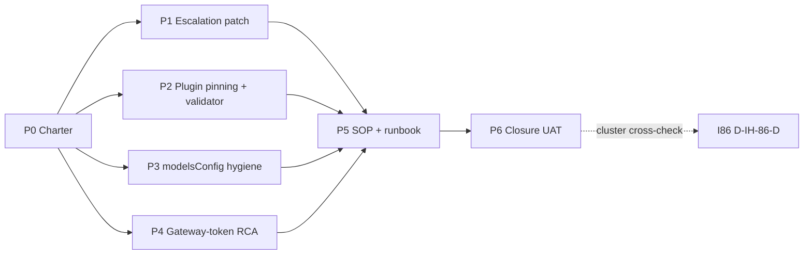

# I87 — OpenClaw operator-runtime hardening

> **Promoted candidate → active initiative on 2026-05-16** under [I86 — Initiative Cluster Execution Coordinator](../86-initiative-cluster-execution-coordinator/master-roadmap.md) Wave 1. **Spawned from substrate audit evidence** ([`openclaw-observed-symptoms-2026-05-16.md`](../../intelligence/substrate-audit-2026-Q2/openclaw-observed-symptoms-2026-05-16.md) §2). I87 sits as the **operational sibling** to **I84** (research): I84 decides which substrate Holistika commits to long-term; **I87 makes the currently deployed OpenClaw substrate stop bleeding silently** so I84 Wave 3 ratification compares against a *patched* baseline.

## 1. Operating story

Operator-visible OpenClaw / gateway logs surfaced five symptom classes on 2026-05-16: Docker sandbox churn, low LLM context warnings, gateway WebSocket auth churn, `plugins.allow` trust posture, bonjour self-heal. **I84** owns substrate doctrine; **I87** owns **operator-runtime reliability**:

1. **Escalation** when health monitors loop failure without operator-visible signal — current behaviour ("`Runtime: unknown`") violates [`akos-governance-remediation.mdc`](../../../.cursor/rules/akos-governance-remediation.mdc) §"Runtime contract" verbatim *"observability contract bug, not a healthy state."*
2. **Explicit pinning** for AKOS-authored plugins (`akos-runtime-tools` and future) in `plugins.allow`.
3. **modelsConfig hygiene** so warnings stop lying about Ollama models that fall back to vLLM anyway.
4. **Gateway-token UX** root-cause investigation — control UI repeatedly loses the gateway token between sessions.
5. **Paired triage SOP + executable runbook** routing every symptom class to a governed action per [`akos-executable-process-catalog.mdc`](../../../.cursor/rules/akos-executable-process-catalog.mdc) Rule 1.

## 2. Charter decisions ratified at P0

| ID | Question | Verdict | Source |
|:---|:---|:---|:---|
| **D-IH-87-A** | Escalation sink for health-monitor failures | `OPERATOR_INBOX.md` row first (low coupling; rendered by `scripts/render_operator_inbox.py`). Slack + toast deferred to follow-up if signal-to-noise sufficient | `agent_inline_default` (I86 batch ratify 2026-05-16; recommended option per inline-ratify-craft skill — low blast radius + already-rendered surface) |
| **D-IH-87-B** | Validator for `plugins.allow` | Ship miniature `scripts/validate_openclaw_plugin_pinning.py` in P2 mirroring I77 P4.C wiring pattern; one allow-list per environment; wired into `release-gate.py` as INFO | `agent_inline_default` |
| **D-IH-87-C** | modelsConfig posture for `ollama/qwen3:8b` | **Remove** unused Ollama row (gateway log evidence shows fallback to vLLM already happening; bumping ctx would mask configuration drift) | `agent_inline_default` |

## 3. Phase shape

| Phase | Effort | Deliverable | Gate |
|:---|:---|:---|:---|
| **P0 — Charter** (this commit) | 0.5d | Promotion + INIT/DEC/OPS rows + INITIATIVE_DEPENDENCIES + planning README + master-roadmap | inline-ratify (canonical-CSV gate; row-content review) |
| **P1 — Escalation patch** | 1-2d | Health monitor emits row to `OPS_REGISTER.csv` (or staging file) on N=3 consecutive failures; renderer surfaces in `OPERATOR_INBOX.md` | `validate_hlk` clean |
| **P2 — Plugin pinning + validator** | 0.5d | `plugins.allow` entry in `~/.openclaw/openclaw.json` template + `scripts/validate_openclaw_plugin_pinning.py` + test | release-gate INFO row green |
| **P3 — modelsConfig hygiene** | 0.5d | Remove `ollama/qwen3:8b` from modelsConfig per D-IH-87-C; bonjour self-heal note in operator UX | inline-ratify (config diff review) |
| **P4 — Gateway-token UX investigation** | ~1d | Root-cause memo at `reports/p4-gateway-token-rca-<date>.md`; either (a) OpenClaw upstream ticket + workaround SOP entry OR (b) operator-config doc fix | inline-ratify on RCA verdict |
| **P5 — SOP + paired runbook** | 2-3d | `SOP-OPENCLAW_RUNTIME_HEALTH_TRIAGE_001.md` at `status: review` + `scripts/openclaw_health_triage.py` + `process_list.csv` row `env_tech_sop_openclaw_runtime_health_triage_001` | operator approval (canonical CSV gate; SOP-META order) |
| **P6 — Closure UAT** | 0.5d | UAT report exercising rails on a synthetic 3-failure-cycle scenario; promote SOP to `status: active` | operator approval |
| **Total** | **~5-7d** | | |

## 4. Phase-dependency diagram

P1/P2/P3/P4 run in parallel after P0. P5 needs all four ready (SOP triage tree references the patched-baseline behaviour). P6 closes by mechanical I86 D-IH-86-D row 4 (`INITIATIVE_REGISTRY` flip to `closed`).

## 5. Cluster wave-slot

Per I86 master-roadmap §"Wave 1 (Sprint 1, sibling-independent burns)" + D-IH-86-C: **I87 executes in Wave 1 before I84 Wave 3 substrate ratification**, so D-IH-84-B (OpenClaw vs Cursor-SDK vs hybrid) compares against a patched-baseline observation, not a bleeding one. R-IH-86-3 (substrate-decision lag) is mitigated by this ordering.

## 6. Asset classification (per [`PRECEDENCE.md`](../../../docs/references/hlk/v3.0/Admin/O5-1/People/Compliance/canonicals/PRECEDENCE.md))

- **Canonical**: `SOP-OPENCLAW_RUNTIME_HEALTH_TRIAGE_001.md` (new; P5), `process_list.csv` new row (P5), `INITIATIVE_REGISTRY.csv` + `DECISION_REGISTER.csv` + `OPS_REGISTER.csv` rows (P0).
- **Mirrored / derived**: `OPERATOR_INBOX.md` (auto-rendered from `OPS_REGISTER.csv`).
- **Reference**: `openclaw-observed-symptoms-2026-05-16.md` (substrate audit WIP — not promoted to canonical).
- **Operator-local config (not git-canonical)**: `~/.openclaw/openclaw.json` (per-operator state); `modelsConfig.yaml` (per-operator state).

## 7. Risk register (inline preview; full at [`risk-register.md`](risk-register.md))

| ID | Risk | Likelihood | Impact | Mitigation |
|:---|:---|:---|:---|:---|
| **R-IH-87-1** | OpenClaw upstream owns gateway-token UX bug and won't fix soon | M | M | P4 produces workaround SOP entry + upstream ticket; no in-tree fix attempted |
| **R-IH-87-2** | `OPERATOR_INBOX.md` becomes noisy if escalation threshold N=3 too low | M | L | P1 ships with N=3 default + operator-tunable env `AKOS_HEALTH_ESCALATION_N`; review at P6 |
| **R-IH-87-3** | Plugin pinning validator regresses other plugin-pinning patterns I77 P4.C established | L | M | P2 plugin validator follows I77 P4.C `validate_*_pinning` precedent verbatim; integration test |
| **R-IH-87-4** | Removing `ollama/qwen3:8b` (D-IH-87-C) breaks any operator who relied on bonjour self-heal | L | L | P3 ships with rollback one-liner; bonjour fallback to vLLM is already implicit per gateway log evidence |

## 8. Cross-references

- **Cluster coordinator**: [`86-initiative-cluster-execution-coordinator/master-roadmap.md`](../86-initiative-cluster-execution-coordinator/master-roadmap.md).
- **Substrate research**: [`84-substrate-doctrine-and-commercial-readiness/master-roadmap.md`](../84-substrate-doctrine-and-commercial-readiness/master-roadmap.md).
- **Prior hygiene initiative**: [`09-openclaw-hygiene/`](../09-openclaw-hygiene/master-roadmap.md).
- **Evidence**: [`openclaw-observed-symptoms-2026-05-16.md`](../../intelligence/substrate-audit-2026-Q2/openclaw-observed-symptoms-2026-05-16.md) (substrate audit WIP).
- **Governing rules**: [`akos-governance-remediation.mdc`](../../../.cursor/rules/akos-governance-remediation.mdc) §"Runtime contract"; [`akos-executable-process-catalog.mdc`](../../../.cursor/rules/akos-executable-process-catalog.mdc) Rule 1 (SOP+runbook pairing) + Rule 2 (status metadata).
- **Decision log** (full rationale): [`decision-log.md`](decision-log.md).
- **Files modified** (per-commit traceability): [`files-modified.csv`](files-modified.csv).

## 9. Closure criteria

- All six phases land per shape table.
- `process_list.csv` `env_tech_sop_openclaw_runtime_health_triage_001` row active (post operator approval).
- `SOP-OPENCLAW_RUNTIME_HEALTH_TRIAGE_001.md` at `status: active`.
- I86 D-IH-86-D mechanical cross-check PASS (release-gate + `validate_hlk` + paired-runbook contract + UAT report present).
- `INITIATIVE_REGISTRY.csv` `INIT-OPENCLAW_AKOS-87` flipped `active → closed`.
