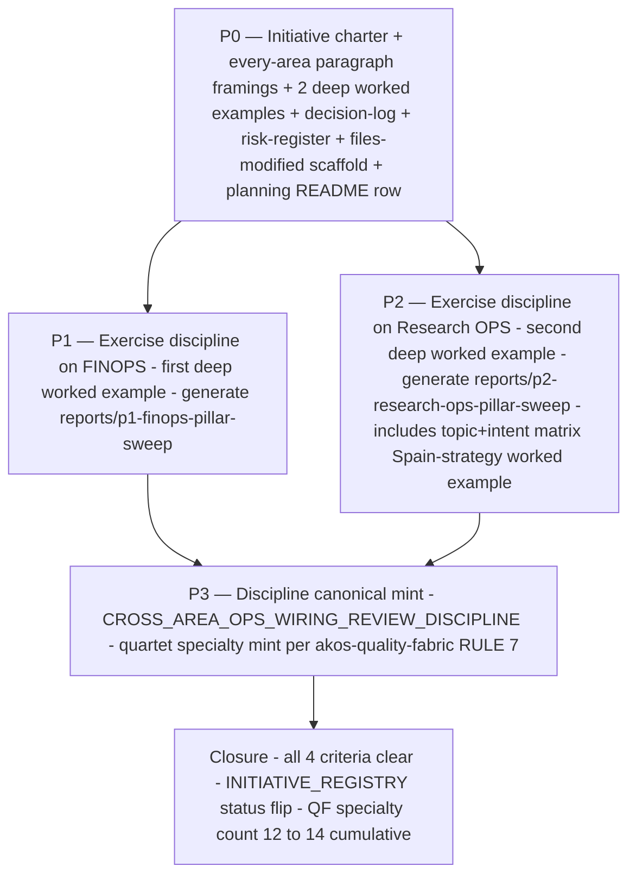

# I88 — Cross-area Ops wiring review discipline (every-area + 3-tier) × 10-pillar Holistika ReOps lens

> **Provenance.** Initiative-grade promotion of [`_candidates/i-nn-cross-area-ops-wiring-review.md`](../_candidates/i-nn-cross-area-ops-wiring-review.md), originally spawned by **D-IH-81-O** (operator's "FINOPS is a backbone — review each area's OPS to ensure proper wiring maintenance" framing at I81 Bundle B-2 synthesis ratification 2026-05-22), amended by **D-IH-81-T** (operator's s4 "every area gets cross-area wiring review at its own hierarchy + ownership level; no small-vs-big prioritization" framing at I81 Wave R Bundle C amendment 2026-05-23), and **activated as numbered initiative I88** by **D-IH-86-CW** (operator META1-a + META2-b ratification at I86 Wave R+1 OPS-86-22 + OPS-86-23 attack gate 2026-05-24).
>
> **Companion mint.** This initiative ships paired with the candidate [`_candidates/i-nn-research-ops-substrate.md`](../_candidates/i-nn-research-ops-substrate.md) (Research-area-side 10-pillar Holistika ReOps frame; first of 2 deep worked examples for this initiative's P1 exercise), which inherits the Spain-strategy ad-hoc burst documented in [`_candidates/i-nn-research-area-cross-area-topic-intent-improvement.md`](../_candidates/i-nn-research-area-cross-area-topic-intent-improvement.md) as a pillar-8 worked example.

## 1. Charter

### 1.1 Doctrine in one sentence

**Every area's Ops surface deserves explicit cross-area wiring review at its own hierarchy + ownership level — no small-vs-big prioritization, because small or big is just backfilling data.** Cross-area wiring integrity is checked across all area boundaries the same way `INTER_WAVE_REGRESSION_DISCIPLINE.md` checks cluster-coordinator integrity. The review scales **density** with each area's wiring surface (FINOPS = weekly Tier 1; Brand = quarterly Tier 3) but **never** restricts **scope** (every area is in scope at all times).

### 1.2 The 10-pillar Holistika ReOps lens (per META1-a)

Every area's Ops surface is reviewed through a 10-pillar lens — Boulton's industry-standard 8 pillars (Strategy & Planning; Recruitment & Admin; Tools & Infrastructure; Knowledge Management; Governance, Ethics, & Privacy; Skills, Methods, & Capability; Internal Communications & Advocacy; Asks & Logistics) extended with Holistika-specific **(9) Brand** + **(10) UX** per operator's META1-a ratification. The +2 pillars are load-bearing because Holistika research outputs are brand-touching by default and UX of the consumer surface determines whether the research/finance/legal/etc. work lands. The full lens is codified in [`_candidates/i-nn-research-ops-substrate.md`](../_candidates/i-nn-research-ops-substrate.md) §3 (10-pillar instantiation for the Research area) and is the canonical structural lens for every area's Ops surface in this initiative.

### 1.3 All 7 areas in scope (META2-b)

This initiative covers ALL 7 areas registered in `baseline_organisation.csv`. **Research OPS and FINOPS are the 2 deep worked examples** (one full per-pillar instantiation each); the remaining 5 areas (Marketing, Tech Lab, Legal, Operations, People) receive **paragraph framings** at P0 charter time (below) and graduate to deep worked examples in future phases as their wiring density warrants.

### 1.4 Paragraph framings for the 5 non-deep-worked areas (META2-b)

#### Marketing (Resonance + Reach + Experimentation + Brand sub-area)

Marketing operates **two Ops surfaces** in parallel — outbound (Reach: CRM + email + SCHEDULING + COMMUNICATION adapters per `akos-executable-process-catalog.mdc` adapter registries) and inbound (Resonance: persona + scenario registry + LIVE field intelligence per `PERSONA_SCENARIO_REGISTRY.csv` + `INTELLIGENCEOPS_REGISTER.csv` Marketing-adjacent rows). The most wiring-dense surface today is **Reach ↔ RevOps**: every active outbound campaign in CRM_ADAPTER-registered systems must have a paired engagement-funnel stage in the engagement template registry (OPS-72-* lineage). Tier 2 cadence. The brand sub-area is Tier 3 today (semi-annual cross-Brand-to-Marketing-Reach freshness check on outbound surfaces' `BRAND_*` canonical citations) but may promote to Tier 2 if Account Management RevOps tie-in matures. All 10 pillars are present; pillar 9 (Brand) is structurally elevated because Marketing **is** brand's primary consumer area.

#### Tech Lab (Envoy Tech Lab + System Owner + Engineering disciplines)

Tech Lab's Ops surface is the **substrate layer for every other area** — KB infrastructure (Obsidian + ERP + AKOS + agent stack per `SUBSTRATE_LANDSCAPE_DOCTRINE`), CI/CD baseline (per `SOP-CICD_BASELINE_001`), deploy-health surveillance (per `akos-deploy-health.mdc`), MCP wiring (per `mcporter.json.example`), and external-repo blessing (per `bless_external_repo.py`). The most wiring-dense surface is **Tech Lab ↔ every other area's tooling adapter registry** (every CRM_ADAPTER / EMAIL_ADAPTER / BILLING_ADAPTER / SCHEDULING_ADAPTER / COMMUNICATION_ADAPTER / CONTRACT_ADAPTER / ATTRIBUTION_ADAPTER row depends on Tech Lab's infrastructure layer being live). Tier 1 cadence per PR-cycle deploy-health discipline; Tier 2 cadence per weekly cross-adapter freshness sweep. All 10 pillars are present; pillar 3 (Tools & Infrastructure) is structurally elevated because Tech Lab **is** the tools-and-infrastructure pillar for every other area.

#### Legal (Legal canon-set + LegalOps as ADVOPS operational plane)

Legal operates **two surfaces** — the canon-set (per `Legal/canonicals/` brand-trademark + IP-scope + contract-shape canonicals) and the operational ADVOPS plane (per `SOP-EXTERNAL_ADVISER_ENGAGEMENT_001` + `advops/FILED_INSTRUMENTS.csv` + `ADVISER_ENGAGEMENT_DISCIPLINES.csv` + `ADVISER_OPEN_QUESTIONS.csv` + `GOI_POI_REGISTER.csv`). The most wiring-dense surface today is **LegalOps ↔ FINOPS**: every `advops/FILED_INSTRUMENTS.csv` row carrying a money amount must have a paired counterparty_id back-reference in the FINOPS counterparty register (OPS-81-15 surface; partially live post-Wave R Strand 2). Tier 1 cadence per monthly LegalOps ↔ FINOPS reconciliation. **LegalOps ↔ RevOps**: every active engagement has paired contract instrument in `advops/FILED_INSTRUMENTS.csv` (or the SME-counterparty equivalent when minted). Tier 2 cadence per quarterly engagement-to-instrument reconciliation. All 10 pillars are present; pillar 5 (Governance, Ethics, & Privacy) is structurally elevated because Legal **is** the governance pillar for every other area.

#### Operations (PMO + SMO + RevOps + IntelligenceOps)

Operations is the **integration spine across every other area** — PMO governs initiative-level cadence (per `INITIATIVE_REGISTRY.csv` + initiative folders); SMO governs ITIL-class service management (per contract lifecycle); RevOps governs engagement lifecycle (per `ENGAGEMENT_MODEL_REGISTRY.csv` + paired adapter registries); IntelligenceOps governs target-class research (per `INTELLIGENCEOPS_REGISTER.csv`). The most wiring-dense surface is **PMO ↔ every area** (every active initiative has paired `role_owner` resolvable to `baseline_organisation.csv` AND a paired primary `process_list.csv` row owning the initiative's deliverable class — this is also `INDEX_INTEGRITY_DISCIPLINE.md` IDX-01 + IDX-07; cross-area sweep cross-checks the same surface). Tier 1 cadence per wave-close. **RevOps ↔ FINOPS** is also Tier 1 (engagement signed → counterparty registered → Stripe customer linked per `SOP-FINOPS_BRIDGE_001`). All 10 pillars are present; pillar 1 (Strategy & Planning) is structurally elevated for PMO; pillar 8 (Asks & Logistics) is structurally elevated for SMO.

#### People (People canon-set + People Ops + Ethics)

People operates as the **discipline of disciplines** per `akos-people-discipline-of-disciplines.mdc` — owning cross-area methodology + design patterns + KB stewardship + AI agentic governance + cross-area breakthrough propagation. The most wiring-dense surface is **People ↔ every other area's process+role pairing** (every new role in `baseline_organisation.csv` has ≥1 paired `process_list.csv` row; every new process has its role_owner FK resolvable — this is also `INTER_WAVE_REGRESSION_DISCIPLINE.md` Dimension 13; cross-area sweep cross-checks the same surface). Tier 1 cadence per wave-close. **People ↔ Tech Lab** for KB stewardship split (per People DoD RULE 2 — People owns the stewardship layer; Tech Lab owns the infrastructure layer). Tier 2 cadence per quarterly KB-accessibility audit. All 10 pillars are present; pillar 2 (Recruitment & Admin) is structurally elevated for People Ops; pillar 5 (Governance, Ethics, & Privacy) is structurally elevated for Ethics; **People is also the area that owns the cross-area-pattern itself**, so this initiative's eventual canonical-doctrine mint lands in `People/canonicals/CROSS_AREA_OPS_WIRING_REVIEW_DISCIPLINE.md`.

### 1.5 Closure criteria

I88 closes when **all** of:

1. Bundle C scope (the every-area 10-pillar paragraph framings + the two deep worked examples) is materialised as a per-phase deliverable across P0..P3.
2. The promoted **`CROSS_AREA_OPS_WIRING_REVIEW_DISCIPLINE.md`** canonical lands in `People/canonicals/` at status: charter, with the full quartet specialty-mint contract honored per `akos-quality-fabric.mdc` RULE 7 (Pydantic chassis + validator + runbook + cursor rule + skill + SOP+runbook pair + pattern-registry row + PRECEDENCE row + QF §6 row + CHANGELOG entry + `process_list.csv` row).
3. Two areas exercised end-to-end (FINOPS + Research OPS, per the candidate's A2 activation gate); the exercise produces a dated sweep report under `reports/`.
4. INFO→FAIL ramp wired in `config/verification-profiles.json` + `scripts/release-gate.py` with at least one wave at INFO before flip-to-FAIL.

When all 4 conditions clear, INITIATIVE_REGISTRY.csv I88 row flips `status: closed` per a closure decision (likely D-IH-88-A or D-IH-86-CW-closure-extension).

## 2. Phase plan (preview)

> Full per-phase deep sections (Scope / Files / Verification / Pause-point classification / Self-checkpoint count / Cursor-rules adherence) follow standard plan-quality bar per `akos-planning-traceability.mdc` §"Per-phase deep-section template" and will materialise as the phases are entered. P0 lives in this charter; P1..P3 forward-charter to future commits.

### 2.1 Phase dependency narrative

- **P0 — Initiative charter + every-area paragraph framings + 2 deep worked examples + decision-log + risk-register + files-modified scaffold + planning README row.** (This commit.)
- **P1 — Exercise the discipline on FINOPS** (the first deep worked example). FINOPS already has 9 of 10 pillars exercised end-to-end post-Bundle B-2c (operational substrate; engagement-event wiring; counterparty + filed-instruments register; bridge SOP + paired runbook; pgmq DLQ + ECB FX cache; HLK-ERP convergence). Pillar 9 (Brand-axis on FINOPS-outbound surfaces) + pillar 10 (UX of HLK-ERP FINOPS dashboard) are partial. P1 produces a dated sweep report at `reports/p1-finops-pillar-sweep-<date>.md` with per-pillar PASS / PASS-WITH-FOLLOWUP / FAIL verdicts.
- **P2 — Exercise the discipline on Research OPS** (the second deep worked example). Research OPS pillar 1 (Strategy) + pillar 5 (Governance) + pillar 6 (Skills/Methods) are partial-to-active; pillars 2/4/7/8 are partial; pillars 3/9/10 are not-yet. P2 produces a dated sweep report at `reports/p2-research-ops-pillar-sweep-<date>.md` with per-pillar verdicts + a forward-charter for the gaps. P2 also exercises the topic+intent matrix shape via the Spain-strategy worked example (per `_candidates/i-nn-research-area-cross-area-topic-intent-improvement.md`).
- **P3 — Discipline canonical mint** (`CROSS_AREA_OPS_WIRING_REVIEW_DISCIPLINE.md` + quartet). After P1 + P2 have produced 2 sweep reports, the canonical doctrine lands grounded in real exercise patterns. Quality Fabric specialty inclusion ratified at P3 entry (likely 14th specialty after Wave R+1's 12th UAT + planned 13th PWF_GOVERNANCE).

### 2.2 Phase dependency mermaid

### 2.3 Architecture mermaid (the 10-pillar × 7-area cross-cut)

## 3. Decision log (preview)

| ID | Question | Owner | Status entering plan | Close-out phase |
|:---|:---|:---|:---|:---|
| **D-IH-86-CW** | Promote UAT_DISCIPLINE charter→active + open 3-wave field-test window + activate Bundle C as I88 + spawn Research OPS substrate candidate + extend Boulton 8-pillar ReOps frame to 10 pillars (Brand + UX) | Founder/CEO + PMO | ratified 2026-05-24 (I86 Wave R+1 META4-b + META1-a + META2-b) | P0 (this commit) |
| **D-IH-81-O** | Cross-area Ops wiring review discipline mint (original backbone-areas framing) | Founder/CEO + PMO | ratified 2026-05-22 (I81 Bundle B-2 synthesis Decision C) | candidate origin |
| **D-IH-81-T** | Every-area + 3-tier review-density amendment to D-IH-81-O (operator s4 framing) | Founder/CEO + PMO | ratified 2026-05-23 (I81 Wave R Bundle C amendment) | candidate amendment |
| **D-IH-88-A (NEW; reserved)** | Tier assignment for each of the 7 areas at P1 entry | Founder/CEO + System Owner | open | P1 |
| **D-IH-88-B (NEW; reserved)** | FINOPS pillar 9 (Brand-axis) + pillar 10 (UX) closure criteria | Founder/CEO + System Owner + Brand Manager | open | P1 |
| **D-IH-88-C (NEW; reserved)** | Research OPS pillar 3 (Tools/Infrastructure) + pillar 9 (Brand) + pillar 10 (UX) closure criteria | Founder/CEO + System Owner + Holistik Researcher | open | P2 |
| **D-IH-88-D (NEW; reserved)** | Quality Fabric specialty inclusion ratification (13th or 14th specialty depending on PWF_GOVERNANCE mint timing) | Founder/CEO + System Owner | open | P3 |

## 4. Risk register (preview)

| ID | Risk | Likelihood | Impact | Mitigation |
|:---|:---|:---|:---|:---|
| **R-IH-88-1** | Discipline minted from FINOPS + Research OPS over-generalises; pillars sized for those two areas don't fit Marketing / Tech Lab / Legal / Operations / People when those areas reach deep worked example status in a future cycle | M | M | Charter explicitly notes paragraph-framing → deep-worked-example promotion path as future-cycle work; A2 activation gate (2-area exercise floor) deliberately protects against single-area generalisation; per-area Tier assignment lets the discipline adapt density without re-minting structure. |
| **R-IH-88-2** | Pillar 9 (Brand) + pillar 10 (UX) over-extension — operator's META1-a +2 pillars feel correct in 2026 but reveal as wrong framing later (e.g., Brand should have stayed inside Marketing pillar 7 Communications; UX should have stayed inside Tools pillar 3 Infrastructure) | L | M | The +2 pillars are explicitly framed in canon as Holistika-specific extensions to the Boulton baseline (per `_candidates/i-nn-research-ops-substrate.md` §1+§2); revocation path: a successor decision (D-IH-NN-X) collapses the 10 pillars back to 8 + reassigns Brand/UX content; the change is local to the pillars enum + per-area pillar instantiations, not the cross-area-wiring core discipline. |
| **R-IH-88-3** | INFO→FAIL ramp on validator promoted too aggressively (before discipline lands cleanly across all 7 areas); causes pre-commit fail cascades that the operator has to escape via overrides | M | H | INFO stays through at least 3 waves (the same posture as INTER_WAVE_REGRESSION + INDEX_INTEGRITY + UAT_DISCIPLINE per their own field-test windows); promotion-to-FAIL gate requires explicit operator decision; mid-wave operator-override is the documented escape per `akos-inline-ratification.mdc` §Time-box recovery; revocation triggers documented in P3 SOP addendum analogous to UAT_DISCIPLINE field-test window pattern. |
| **R-IH-88-4** | Cross-area wiring sweep cadence over-commits operator attention; sweep findings exceed inline-ratify 5-option enum bandwidth at every wave-close | M | M | Findings disposition pattern inherited from `INTER_WAVE_REGRESSION_DISCIPLINE.md` §6 (5-option enum: deterministic-fix-now / manual-fix-now / defer-OPS / accept-as-canon / escalate-to-blocker-tracker); when findings exceed 10, split into 2 AskQuestion batches; when findings exceed 20, halt and propose splitting the wave into Wave-N + Wave-N.5 per bandwidth-recovery pattern (Wave M.5 precedent). |
| **R-IH-88-5** | Sibling cross-area discipline activation (e.g., I-NN-RESEARCH-OPS-SUBSTRATE eventually activates with its own validator + cursor rule + skill) creates discipline-soup that operators + agents cannot keep distinct | L | M | Each discipline has explicit scope boundary in canonical doctrine (per `akos-quality-fabric.mdc` RULE 7 specialty-mint contract); cross-references between siblings are mandatory at mint time; PEOPLE_DESIGN_PATTERN_REGISTRY row taxonomy (class column) keeps disciplines categorised + searchable. |
| **R-IH-88-6** | Field-test window precedent from UAT_DISCIPLINE (D-IH-86-CW) NOT inherited by this initiative's eventual canonical mint at P3, leaving the discipline without a machine-readable promotion-criteria + revocation-triggers contract | M | M | Mitigation built into closure criterion #2: the canonical mint at P3 MUST carry a `field_test_window:` frontmatter block per `akos-uat-discipline.mdc` RULE 2 + `CanonicalFieldTestWindow` Pydantic schema in `akos/hlk_uat_report.py`. P3 reviewer (operator or AIC role_owner) must verify the FTW block is present and well-formed before INITIATIVE_REGISTRY closure flip. |

## 5. Files-modified shape

Standard 18-column schema per `akos-planning-traceability.mdc` §"Per-initiative file-changes CSV". Header is seeded in [`files-modified.csv`](files-modified.csv); rows accumulate per-phase commit.

## 6. Cross-references

- Inception decision: **D-IH-86-CW** (META1-a + META2-b activation; META4-b UAT promotion in the same ratify batch).
- Lineage decisions: **D-IH-81-O** (original spawn) + **D-IH-81-T** (s4 amendment) + **D-IH-81-P** (CFOaaS-default amendment).
- Spawning candidate: [`_candidates/i-nn-cross-area-ops-wiring-review.md`](../_candidates/i-nn-cross-area-ops-wiring-review.md) (the candidate is kept as spec/history; this master-roadmap is the active execution surface).
- Companion candidate: [`_candidates/i-nn-research-ops-substrate.md`](../_candidates/i-nn-research-ops-substrate.md) (Research-area-side 10-pillar mint; exercised inside P2).
- Worked-example child of companion candidate: [`_candidates/i-nn-research-area-cross-area-topic-intent-improvement.md`](../_candidates/i-nn-research-area-cross-area-topic-intent-improvement.md) (Spain-strategy ad-hoc burst; pillar-8 worked example for the companion).
- Parent initiative: I86 (cluster coordinator; this initiative spawned from I86 Wave R+1 OPS-86-22 + OPS-86-23 attack gate).
- Sibling initiatives in scope (per linked_canonicals + related_initiatives): I21 (ADVOPS plane), I72 (RevOps adapter registries), I75 (Research area governance — likely future parent of pillar-10-pillar refinements), I79 (People manifesto + design pattern library), I85 (closure UAT bar), I89 (HLK-ERP persona rollup panel).
- Sister disciplines (Quality Fabric specialties): `INTER_WAVE_REGRESSION_DISCIPLINE.md` (Wave M Dimension 13 role+process pairing overlaps this initiative's cross-area wiring scope); `INDEX_INTEGRITY_DISCIPLINE.md` (Wave N IDX-01 + IDX-07 planning README ↔ INITIATIVE_REGISTRY parity overlaps PMO ↔ every-area paragraph framing); `UAT_DISCIPLINE.md` (Wave R+1 active; field-test window pattern that this initiative's P3 canonical mint MUST inherit per R-IH-88-6).
- Governing rules: [`akos-quality-fabric.mdc`](../../../../.cursor/rules/akos-quality-fabric.mdc) (5-axis composition + specialty mint RULE 7), [`akos-people-discipline-of-disciplines.mdc`](../../../../.cursor/rules/akos-people-discipline-of-disciplines.mdc) (People owns cross-area methodology), [`akos-executable-process-catalog.mdc`](../../../../.cursor/rules/akos-executable-process-catalog.mdc) (paired SOP+runbook), [`akos-planning-traceability.mdc`](../../../../.cursor/rules/akos-planning-traceability.mdc) (plan-quality bar + UAT discipline at closure), [`akos-applied-research-discipline.mdc`](../../../../.cursor/rules/akos-applied-research-discipline.mdc) (internal + external research grounding at canonical mint), [`akos-inline-ratification.mdc`](../../../../.cursor/rules/akos-inline-ratification.mdc) (findings disposition gate at sweep time).
- External research grounding: Team Topologies (Skelton + Pais) + DDD Context Mapping (Vernon + Fowler) for the cross-area wiring framework; Boulton + ReOps Community + NN/g for the 10-pillar ReOps lens; CIA Psychology of Intelligence Analysis + RAND for the topic+intent matrix Research-area sub-discipline.
